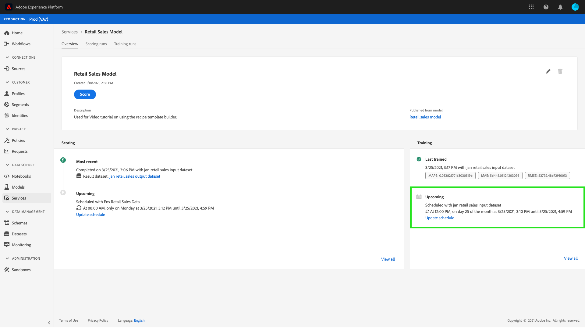

# Plan een model in de werkruimte van de Wetenschap van Gegevens UI

Met Adobe Experience Platform [!DNL Data Science Workspace] kunt u geplande scoring- en trainingssessies instellen voor een computerleerservice. Het automatiseren van het trainings- en scoringsproces kan de efficiëntie van een service helpen behouden en verbeteren door patronen in uw gegevens bij te houden.

Deze zelfstudie doorloopt de stappen voor het configureren van trainings- en scoring-planningen op een bestaande service via de [!UICONTROL Service Gallery]. Het is opgedeeld in de volgende hoofdsecties:

- [Geplande scoring configureren](#configure-scheduled-scoring)
- [Geplande training configureren](#configure-scheduled-training)

## Aan de slag

Als u deze zelfstudie wilt voltooien, moet u toegang hebben tot [!DNL Experience Platform]. Als u geen toegang tot een Organisatie IMS in [!DNL Experience Platform] hebt, gelieve met uw systeembeheerder te spreken alvorens te werk te gaan.

Voor deze zelfstudie is een bestaande service vereist. Als u geen toegankelijke dienst hebt om met te werken, kunt u tot stand brengen door het leerprogramma voor [te volgen het publiceren van een model als dienst](./publish-model-service-ui.md).

## Geplande scores {#configure-scheduled-scoring} configureren

Model het scoren kan worden gevormd om een geautomatiseerd proces op een geplande basis te zijn. Zodra de dienst wordt gecreeerd, kunt u de stappen volgen hieronder om een het scoren programma te vormen en toe te passen:

Selecteer in Adobe Experience Platform de tab **[!UICONTROL Services]** in de linkernavigatiekolom voor toegang tot **[!DNL Service Gallery]**. Zoek de service waarop u scoring wilt plannen en selecteer **[!UICONTROL Open]** om de bijbehorende pagina **[!UICONTROL Overview]** weer te geven.

De overzichtspagina toont de het scoren van de Dienst informatie. Selecteer de koppeling **[!UICONTROL Update Schedule]** om een scoreschema te configureren.

Vorm de frequentie, begindatum, einddatum, inputdataset, en outputdataset voor het het scoren programma. Als u tevreden bent met de configuraties, selecteert u **[!UICONTROL Create]** om het scoreschema van de service bij te werken.

Uw bijgewerkte scorebord wordt weergegeven op de pagina **[!UICONTROL Overview]** van de service.

## Geplande training {#configure-scheduled-training} configureren

Het vormen van geplande trainingslooppas op de dienst zorgt ervoor dat het machine het leren model aan de meest recente gegevenspatronen wordt bijgewerkt. Wanneer een geplande trainingsrun is voltooid, wordt het resulterende getrainde model gebruikt om de service aan te sturen tot de volgende geplande trainingsrun.

Nadat een service is gemaakt, kunt u de onderstaande stappen volgen om een trainingsprogramma te configureren en toe te passen:

Selecteer in Adobe Experience Platform de tab **[!UICONTROL Services]** in de linkernavigatiekolom voor toegang tot **[!UICONTROL Service Gallery]**. Zoek de service waarop u trainingsprogramma&#39;s wilt plannen en selecteer **[!UICONTROL Open]** om de **[!UICONTROL Overview]**-pagina weer te geven.

De overzichtspagina toont de de opleidingsinformatie van de dienst. Selecteer de koppeling **[!UICONTROL Update Schedule]** om een trainingsprogramma te configureren.

Vorm de frequentie, begindatum, einddatum, en inputdataset die voor het opleidingsprogramma wordt gebruikt. Als u tevreden bent met de configuraties, selecteert u **[!UICONTROL Create]** om het trainingsschema van de service bij te werken.

Uw bijgewerkte trainingsschema wordt weergegeven op de pagina **[!UICONTROL Overview]** van de service.

## Volgende stappen

Door deze zelfstudie te volgen, hebt u met succes geautomatiseerde trainings- en scoring-runtime op een service gepland en de gebruikersinterfaceworkflow van de [!DNL Data Science Workspace] voltooid. Als u dit nog niet hebt gedaan, kunt u [de zelfstudie opnieuw starten](./create-retails-sales-dataset.md) en de API-workflow volgen om een model te maken, te trainen, te scoren en te publiceren.
