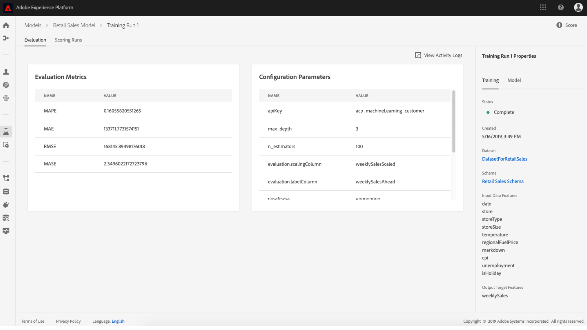
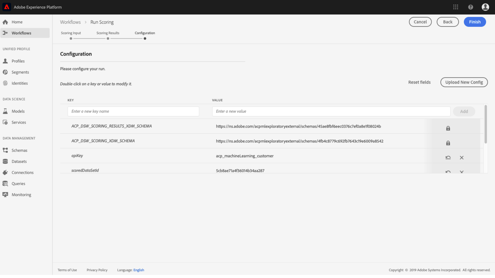

# Score een model (UI)

Scores in de Data Science Workspace van het Adobe Experience Platform kunnen worden bereikt door invoergegevens in te voeren in een bestaand getraind model. De resultaten van het scoren worden dan opgeslagen en viewable in een gespecificeerde outputdataset als nieuwe partij.

Deze zelfstudie demonstreert de stappen die nodig zijn om een model te scoren in de gebruikersinterface van de Data Science Workspace.

## Aan de slag

Als u deze zelfstudie wilt voltooien, hebt u toegang nodig tot Experience Platform. Als u geen toegang hebt tot een IMS-organisatie in het ervaringsplatform, neemt u contact op met uw systeembeheerder voordat u verdergaat.

Voor deze zelfstudie is een getraind model vereist. Als u geen getraind Model hebt, volg de [trein en evalueer een Model in de UI](./train-evaluate-model-ui.md) zelfstudie alvorens verder te gaan.

## Nieuwe scores maken

Er wordt een scoring-run gemaakt met geoptimaliseerde configuraties van een eerder voltooide en geëvalueerde training. De reeks optimale configuraties voor een Model wordt typisch bepaald door de metriek van de evaluatie van de opleidingslooppas te herzien.

1. Vind de meest optimale trainingslooppas om zijn configuraties voor het scoren te gebruiken. Open de gewenste trainingsrun door op de naam ervan te klikken.

2. Klik op de **[!UICONTROL Evaluation]** **[!UICONTROL Score]** knop rechtsboven in het scherm op de knop Training uitvoeren. Hiermee wordt een nieuwe workflow voor *Run Scoring* gestart.
   

3. Selecteer de gegevensset voor het noteren van de invoer en klik op **[!UICONTROL Next]**.
   

4. Selecteer de output die dataset noteert, is dit de specifieke outputdataset waar de het scoren resultaten worden opgeslagen. Bevestig uw selectie  en klik op **[!UICONTROL Next]**.
   

5. In de laatste stap in de workflow wordt u gevraagd uw scoring uit te voeren. Deze configuraties worden gebruikt door het Model voor de scoring looppas.
U kunt overgeërfde parameters die tijdens het maken van het model zijn ingesteld, niet verwijderen. U kunt niet-overgeërfde parameters bewerken of herstellen door te dubbelklikken op de waarde of te klikken op het pictogram Omkeren terwijl u de muisaanwijzer op de invoer plaatst.
   
Controleer en bevestig de scoreconfiguraties en klik **[!UICONTROL Finish]** om de scoring uit te voeren. U wordt omgeleid naar het tabblad *Scoringuitvoering* en de nieuwe scoringstijd geeft een status weer.
   
In een scoring worden de volgende statussen weergegeven: In behandeling, Voltooid, Mislukt of Running en worden automatisch bijgewerkt. Ga naar de volgende stap als de status &quot;Voltooid&quot; of &quot;Mislukt&quot; is.

## De resultaten van scores weergeven

1. Zoek de trainingsrun die voor de scoring werd gebruikt en klik op de naam om de bijbehorende **[!UICONTROL Evaluation]** pagina weer te geven.

2. Klik boven aan de evaluatiepagina van de trainingsrun op het **[!UICONTROL Scoring Runs]** tabblad om een lijst met bestaande scoring-runtime weer te geven. Klik op het scoreningoverzicht om de details ervan in de rechterkolom weer te geven.
   

3. Als de geselecteerde scoring-run de status &quot;Voltooid&quot; of &quot;Mislukt&quot; heeft, is de **[!UICONTROL View Activity Logs]** koppeling in de rechterkolom actief. Klik op de koppeling om de uitvoeringslogboeken weer te geven of te downloaden. Als een scoring is mislukt, kunnen de uitvoeringslogboeken nuttige informatie bevatten over de oorzaak van de fout.
   

4. Klik op de **[!UICONTROL Preview Scoring Results Dataset]** koppeling in de rechterkolom. U zult een voorproef van de outputdataset van de het scoren looppas kunnen zien.
   

5. Voor de volledige reeks het scoren resultaten, klik op de **[!UICONTROL Scoring Results Dataset]** verbinding die in de juiste kolom wordt gevonden.

## Volgende stappen

In deze zelfstudie werden de stappen doorlopen om gegevens te scoren met behulp van een getraind model in de werkruimte voor wetenschap van gegevens. Volg de zelfstudie bij het [publiceren van een Model als Dienst in UI](./publish-model-service-ui.md) om gebruikers binnen uw organisatie toe te staan om gegevens te scoren door gemakkelijke toegang tot een machine het leren Dienst te verlenen.
