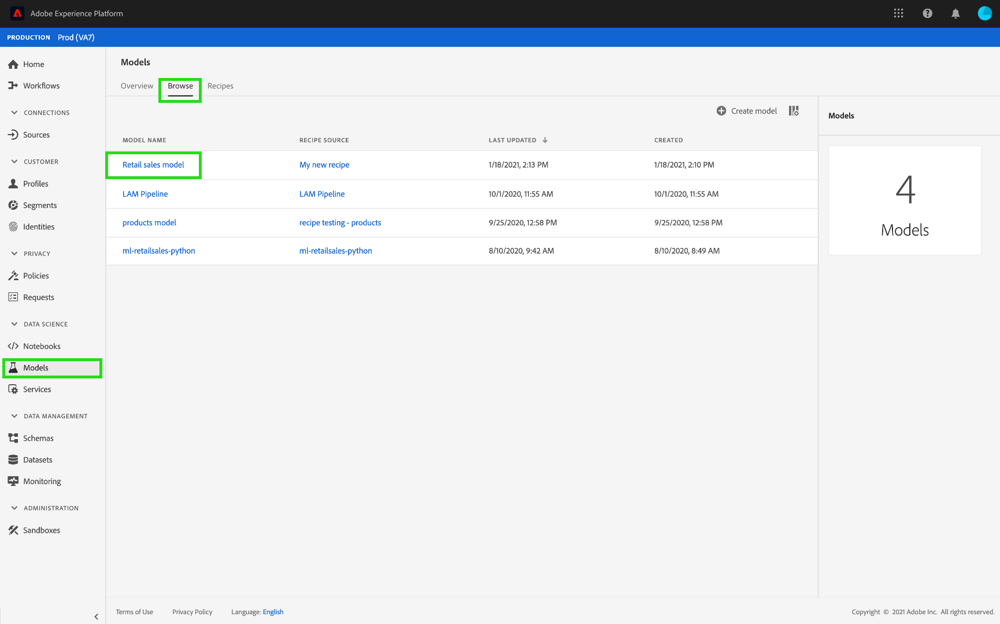

# Een model trainen en evalueren in de gebruikersinterface van Data Science Workspace

>[!NOTE]
>
>Data Science Workspace is niet meer verkrijgbaar.
>
>Deze documentatie is bedoeld voor bestaande klanten met eerdere rechten voor Data Science Workspace.

In Adobe Experience Platform Data Science Workspace wordt een machine-learningmodel gemaakt door een bestaande ontvanger op te nemen die geschikt is voor de bedoeling van het model. Vervolgens wordt het model getraind en geëvalueerd om de efficiëntie en werkzaamheid van het systeem te optimaliseren door de bijbehorende hyperparameters te verfijnen. Ontvangers zijn herbruikbaar, wat betekent dat meerdere modellen kunnen worden gemaakt en afgestemd op specifieke doeleinden met één ontvanger.

Deze zelfstudie doorloopt de stappen voor het maken, trainen en evalueren van een model.

## Aan de slag

Als u deze zelfstudie wilt voltooien, moet u toegang hebben tot [!DNL Experience Platform] . Als u in [!DNL Experience Platform] geen toegang hebt tot een organisatie, neemt u contact op met de systeembeheerder voordat u verdergaat.

Voor deze zelfstudie is een bestaande ontvanger vereist. Als u geen Ontvanger hebt, volg de [&#x200B; Invoer een verpakte Ontvanger in UI &#x200B;](./import-packaged-recipe-ui.md) leerprogramma alvorens verder te gaan.

## Een model maken

Selecteer in het Experience Platform de tab **[!UICONTROL Models]** in de linkernavigatie en selecteer vervolgens het tabblad Bladeren om uw bestaande modellen weer te geven. Selecteer **[!UICONTROL Create Model]** in de rechterbovenhoek van de pagina om te beginnen met het maken van een model.

Blader door de lijst met bestaande ontvangers, zoek en selecteer de ontvanger die u wilt gebruiken om het model te maken en selecteer **[!UICONTROL Next]** .

Selecteer een geschikte gegevensset en selecteer **[!UICONTROL Next]** . Hiermee stelt u de standaardgegevensset voor de invoertraining voor het model in.

Geef een naam op voor het model en bekijk de standaardmodelconfiguraties. Er zijn standaardconfiguraties toegepast tijdens het maken van de ontvanger, het controleren en wijzigen van de configuratiewaarden door te dubbelklikken op de waarden.

Als u een nieuwe set configuraties wilt opgeven, selecteert u **[!UICONTROL Upload New Config]** en sleept u een JSON-bestand met modelconfiguraties naar het browservenster. Selecteer **[!UICONTROL Finish]** om het model te maken.

>[!NOTE]
>
>Configuraties zijn uniek en specifiek voor de beoogde recept. Dit betekent dat configuraties voor de Retail Sales Recipe niet werken voor de Product Recommendations Recipe. Zie de [&#x200B; verwijzings &#x200B;](#reference) sectie voor een lijst van de Retail configuraties van het Ontvangstbericht van de Verkoop.

## Een trainingsrun maken

Selecteer in Experience Platform de tab **[!UICONTROL Models]** in de linkernavigatie en selecteer vervolgens het tabblad Bladeren om uw bestaande modellen weer te geven. Zoek en selecteer de hyperlink die is gekoppeld aan de naam van het model dat u wilt trainen.

Alle bestaande trainingsprogramma&#39;s met hun huidige trainingsstatus worden weergegeven. Voor Modellen die worden gecreeerd gebruikend het [!DNL Data Science Workspace] gebruikersinterface, wordt een trainingslooppas automatisch geproduceerd en uitgevoerd gebruikend de standaardconfiguraties en de dataset van de inputopleiding.

Maak een nieuwe trainingsrun door **[!UICONTROL Train]** in de rechterbovenhoek van de overzichtspagina van het model te selecteren.

Selecteer de dataset van de trainingsinput voor de trainingsrun en selecteer vervolgens **[!UICONTROL Next]** .

De standaardconfiguraties die tijdens de creatie van het Model worden verstrekt worden getoond, veranderen en wijzigen dienovereenkomstig door de waarden tweemaal te klikken. Selecteer **[!UICONTROL Finish]** om de trainingsrun te maken en uit te voeren.

>[!NOTE]
>
>Configuraties zijn uniek en specifiek voor de beoogde recept. Dit betekent dat configuraties voor de Retail Sales Recipe niet werken voor de Product Recommendations Recipe. Zie de [&#x200B; verwijzings &#x200B;](#reference) sectie voor een lijst van de Retail configuraties van het Ontvangstbericht van de Verkoop.

## Evalueer het model

Selecteer in het Experience Platform de tab **[!UICONTROL Models]** in de linkernavigatie en selecteer vervolgens het tabblad Bladeren om uw bestaande modellen weer te geven. Zoek en selecteer de hyperlink die is gekoppeld aan de naam van het model dat u wilt evalueren.

Alle bestaande trainingsruns met hun huidige trainingsstatus worden vermeld. Met veelvoudige voltooide trainingslooppas, kunnen de evaluatiemetrieken over verschillende opleidingslooppas in de Modelgrafiek van de Beoordeling worden vergeleken. Selecteer een evaluatiemetrisch met behulp van de vervolgkeuzelijst boven de grafiek.

De gemiddelde absolute foutenpercentage (MAPE) metrisch drukt nauwkeurigheid als percentage van de fout uit. Hiermee wordt het best presterende experiment geïdentificeerd. Hoe lager de MAPE, hoe beter.

De metrische &quot;Precisie&quot;beschrijft het percentage relevante Instanties vergeleken met het totaal *teruggewonnen* Instanties. Precisie kan worden gezien als de waarschijnlijkheid dat een willekeurig gekozen uitkomst correct is.

Het selecteren van een specifieke trainingslooppas verstrekt de details van die looppas door de evaluatiepagina te openen. Dit kan zelfs worden gedaan voordat de run is voltooid. Op de evaluatiepagina kunt u andere evaluatiemetrieken, configuratieparameters, en visualisaties zien specifiek voor de trainingslooppas.

U kunt activiteitenlogboeken ook downloaden om de details van de looppas te zien. Logboeken zijn vooral handig voor mislukte runs om te zien wat er mis ging.

Hyperparameters kunnen niet worden getraind en een model moet worden geoptimaliseerd door verschillende combinaties van Hyperparameters te testen. Herhaal dit training- en evaluatieproces voor het model totdat u tot een geoptimaliseerd model bent gekomen.

## Volgende stappen

Deze zelfstudie leidde u door het maken, trainen en evalueren van een model in [!DNL Data Science Workspace] . Zodra u bij een geoptimaliseerd Model bent aangekomen, kunt u het getrainde Model gebruiken om inzichten te produceren door de [&#x200B; Score een Model in het UI &#x200B;](./score-model-ui.md) leerprogramma te volgen.

## Verwijzing {#reference}

### Retail Sales Recipe-configuraties

Hyperparameters bepalen het trainingsgedrag van het model. Als u hyperparameters wijzigt, is dit van invloed op de nauwkeurigheid en precisie van het model:

| Hyperparameter | Beschrijving | Aanbevolen bereik |
| --- | --- | --- |
| learning_rate | De leersnelheid verkleint de bijdrage van elke boom door learning_rate. Er is een compromis tussen learning_rate en n_estimators. | 0,1 |
| n_estimators | Het aantal boosterstadia dat moet worden uitgevoerd. Het verhogen van het verloop is vrij robuust aan te passen, zodat een groot aantal gewoonlijk in betere prestaties resulteert. | 100 |
| max_depth | Maximale diepte van de individuele regressieschattingen. De maximale diepte beperkt het aantal knooppunten in de boomstructuur. Stem deze parameter af op de beste prestaties; de beste waarde is afhankelijk van de interactie van de invoervariabelen. | 3 |

Aanvullende parameters bepalen de technische eigenschappen van het model:

| Parametersleutel | Type | Beschrijving |
| ----- | ----- | ----- |
| `ACP_DSW_INPUT_FEATURES` | Tekenreeks | Lijst met door komma&#39;s gescheiden invoerschemakenmerken. |
| `ACP_DSW_TARGET_FEATURES` | Tekenreeks | Lijst met door komma&#39;s gescheiden uitvoerschemakenmerken. |
| `ACP_DSW_FEATURE_UPDATE_SUPPORT` | Boolean | Hiermee wordt bepaald of invoer- en uitvoerfuncties kunnen worden gewijzigd |
| `tenantId` | Tekenreeks | Deze id zorgt ervoor dat bronnen die u maakt, op de juiste wijze worden benoemd en zich binnen uw organisatie bevinden. [&#x200B; volg hier de stappen &#x200B;](../../xdm/api/getting-started.md#know-your-tenant_id) om uw huurdersidentiteitskaart te vinden. |
| `ACP_DSW_TRAINING_XDM_SCHEMA` | String | Het invoerschema dat wordt gebruikt voor het trainen van een model. |
| `evaluation.labelColumn` | String | Kolomlabel voor evaluatievisualisaties. |
| `evaluation.metrics` | String | Door komma&#39;s gescheiden lijst met evaluatiemetriek die moet worden gebruikt voor de evaluatie van een model. |
| `ACP_DSW_SCORING_RESULTS_XDM_SCHEMA` | String | Het uitvoerschema dat voor het scoren van een model wordt gebruikt. |
