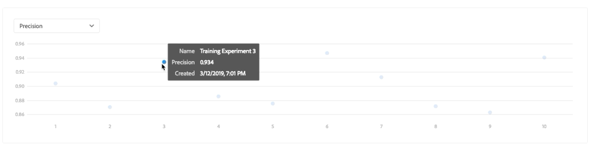

# Een model trainen en evalueren in de gebruikersinterface van Data Science Workspace

In Adobe Experience Platform Data Science Workspace wordt een model voor machinaal leren gemaakt door een bestaande ontvanger op te nemen die geschikt is voor de intentie van het model. Het model wordt vervolgens getraind en geëvalueerd om de efficiëntie en werkzaamheid van de werking te optimaliseren door de bijbehorende hyperparameters te verfijnen. Ontvangers zijn herbruikbaar, wat betekent dat er meerdere modellen kunnen worden gemaakt en op specifieke doeleinden kunnen worden toegesneden met één ontvanger.

Deze zelfstudie doorloopt de stappen voor het maken, trainen en evalueren van een model.

## Aan de slag

U moet toegang hebben tot [!DNL Experience Platform] om deze zelfstudie te kunnen voltooien. Als u geen toegang hebt tot een organisatie in [!DNL Experience Platform] , neemt u contact op met uw systeembeheerder voordat u verdergaat.

Voor deze zelfstudie is een bestaande ontvanger vereist. Als u geen Ontvanger hebt, volg de [ Invoer een verpakte Ontvanger in de UI ](./import-packaged-recipe-ui.md) leerprogramma alvorens verder te gaan.

## Een model maken

Selecteer in Experience Platform de tab **[!UICONTROL Models]** in de linkernavigatie en selecteer vervolgens het tabblad Bladeren om uw bestaande modellen weer te geven. Selecteer **[!UICONTROL Create Model]** rechtsboven op de pagina om een modelontwerpproces te starten.

Blader door de lijst met bestaande ontvangers, zoek en selecteer de ontvanger die u wilt gebruiken om het model te maken en selecteer **[!UICONTROL Next]** .

Selecteer een geschikte invoergegevensset en selecteer **[!UICONTROL Next]** . Hiermee wordt de standaardgegevensset voor de invoertraining voor het model ingesteld.

Geef een naam op voor het model en bekijk de standaardmodelconfiguraties. De standaardconfiguraties zijn toegepast tijdens het maken van Recipe, herzie en wijzig de configuratiewaarden door op de waarden te dubbelklikken.

Als u een nieuwe set configuraties wilt opgeven, selecteert u **[!UICONTROL Upload New Config]** en sleept u een JSON-bestand met modelconfiguraties naar het browservenster. Selecteer **[!UICONTROL Finish]** om het model te maken.

>[!NOTE]
>
>Configuraties zijn uniek en specifiek voor de beoogde recept. Dit betekent dat configuraties voor de Retail Sales Recipe niet werken voor de Product Recommendations Recipe. Zie de [ verwijzings ](#reference) sectie voor een lijst van de Retail configuraties van het Ontvangstbericht van de Verkoop.

## Een trainingsrun maken

Selecteer in Experience Platform de tab **[!UICONTROL Models]** in de linkernavigatie en selecteer vervolgens het tabblad Bladeren om uw bestaande modellen weer te geven. Zoek en selecteer de hyperlink die is gekoppeld aan de naam van het model dat u wilt trainen.

Alle bestaande trainingsprogramma&#39;s met hun huidige trainingsstatus worden weergegeven. Voor Modellen die worden gecreeerd gebruikend het [!DNL Data Science Workspace] gebruikersinterface, wordt een trainingslooppas automatisch geproduceerd en uitgevoerd gebruikend de standaardconfiguraties en de dataset van de inputopleiding.

Maak een nieuwe trainingsrun door **[!UICONTROL Train]** in de rechterbovenhoek van de overzichtspagina van het model te selecteren.

Selecteer de dataset van de trainingsinput voor de trainingsrun en selecteer vervolgens **[!UICONTROL Next]** .

De standaardconfiguraties die tijdens de creatie van het Model worden verstrekt worden getoond, veranderen en wijzigen dienovereenkomstig door de waarden tweemaal te klikken. Selecteer **[!UICONTROL Finish]** om de trainingsrun te maken en uit te voeren.

>[!NOTE]
>
>Configuraties zijn uniek en specifiek voor de beoogde recept. Dit betekent dat configuraties voor de Retail Sales Recipe niet werken voor de Product Recommendations Recipe. Zie de [ verwijzings ](#reference) sectie voor een lijst van de Retail configuraties van het Ontvangstbericht van de Verkoop.

## Het model evalueren

Selecteer in Experience Platform de tab **[!UICONTROL Models]** in de linkernavigatie en selecteer vervolgens het tabblad Bladeren om uw bestaande modellen weer te geven. Zoek en selecteer de hyperlink die is gekoppeld aan de naam van het model dat u wilt evalueren.

Alle bestaande trainingsprogramma&#39;s met hun huidige trainingsstatus worden weergegeven. Met veelvoudige voltooide trainingslooppas, kunnen de evaluatiemetriek over verschillende opleidingslooppas in de Modelbeoordelinggrafiek worden vergeleken. Selecteer een evaluatiemetrisch gebruikend dropdown lijst boven de grafiek.

De gemiddelde absolute foutenpercentage (MAPE) metrisch drukt nauwkeurigheid als percentage van de fout uit. Dit wordt gebruikt om het best presterende Experiment te identificeren. Hoe lager de MAPE, hoe beter.

De metrische &quot;Precisie&quot;beschrijft het percentage relevante Instanties vergeleken met het totaal *teruggewonnen* Instanties. Precisie kan worden gezien als de waarschijnlijkheid dat een willekeurig gekozen resultaat correct is.

Het selecteren van een specifieke trainingslooppas verstrekt de details van die looppas door de evaluatiepagina te openen. Dit kan zelfs worden gedaan alvorens de looppas is voltooid. Op de evaluatiepagina, kunt u andere evaluatiemetriek, configuratieparameters, en visualisaties zien specifiek voor de trainingslooppas.

U kunt activiteitenlogboeken ook downloaden om de details van de looppas te zien. Logs zijn vooral nuttig voor mislukte looppas om te zien wat verkeerd ging.

Hyperparameters kunnen niet worden getraind en een model moet worden geoptimaliseerd door verschillende combinaties van Hyperparameters te testen. Herhaal dit training- en evaluatieproces voor het model totdat u tot een geoptimaliseerd model bent gekomen.

## Volgende stappen

In deze zelfstudie hebt u het maken, trainen en evalueren van een model besproken in [!DNL Data Science Workspace] . Zodra u bij een geoptimaliseerd Model bent aangekomen, kunt u het opgeleide Model gebruiken om inzichten te produceren door de [ Score een Model in het UI ](./score-model-ui.md) leerprogramma te volgen.

## Referentie {#reference}

### Retail Sales Recipe-configuraties

Hyperparameters bepalen het trainingsgedrag van het model. Als u de hyperparameters wijzigt, is dit van invloed op de nauwkeurigheid en precisie van het model:

| Hyperparameter | Beschrijving | Aanbevolen bereik |
| --- | --- | --- |
| learning_rate | Het leren tarief vermindert de bijdrage van elke boom door learning_rate. Er is een compromis tussen learning_rate en n_estimators. | 0,1 |
| n_estimators | Het aantal opstartfasen dat moet worden uitgevoerd. Het verhogen van de gradiënt is vrij robuust aan overmaat zodat een groot aantal gewoonlijk in betere prestaties resulteert. | 100 |
| max_depth | Maximale diepte van de individuele regressieschattingen. De maximale diepte beperkt het aantal knooppunten in de structuur. Stem deze parameter af op de beste prestaties. De beste waarde hangt af van de interactie van de invoervariabelen. | 3 |

Aanvullende parameters bepalen de technische eigenschappen van het model:

| Parametersleutel | Type | Beschrijving |
| ----- | ----- | ----- |
| `ACP_DSW_INPUT_FEATURES` | String | Lijst met door komma&#39;s gescheiden invoerschemakenmerken. |
| `ACP_DSW_TARGET_FEATURES` | String | Lijst met door komma&#39;s gescheiden kenmerken van het uitvoerschema. |
| `ACP_DSW_FEATURE_UPDATE_SUPPORT` | Boolean | Hiermee wordt bepaald of invoer- en uitvoerfuncties kunnen worden gewijzigd |
| `tenantId` | String | Deze id zorgt ervoor dat bronnen die u maakt, op de juiste wijze worden benoemd en zich binnen uw organisatie bevinden. [ volg hier de stappen ](../../xdm/api/getting-started.md#know-your-tenant_id) om uw huurdersidentiteitskaart te vinden. |
| `ACP_DSW_TRAINING_XDM_SCHEMA` | String | Het invoerschema dat wordt gebruikt voor het trainen van een model. |
| `evaluation.labelColumn` | String | Kolomlabel voor evaluatievisualisaties. |
| `evaluation.metrics` | String | Door komma&#39;s gescheiden lijst met evaluatiemetriek die moet worden gebruikt voor de evaluatie van een model. |
| `ACP_DSW_SCORING_RESULTS_XDM_SCHEMA` | String | Het uitvoerschema dat voor het scoren van een model wordt gebruikt. |
