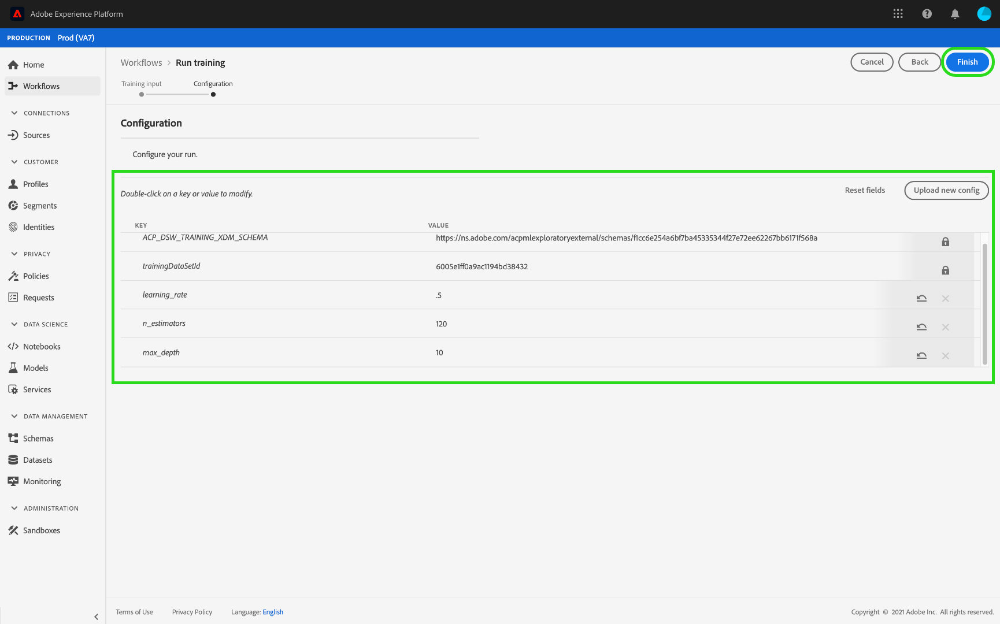

# Een model trainen en evalueren (UI)

In de Werkruimte van de Wetenschap van de Gegevens van het Platform van de Ervaring van Adobe, wordt een machine het leren Model gecreeerd door een bestaande Ontvanger op te nemen die voor de bedoeling van het Model aangewezen is. Het model wordt vervolgens getraind en geëvalueerd om de efficiëntie en werkzaamheid van de werking te optimaliseren door de bijbehorende hyperparameters te verfijnen. Ontvangers zijn herbruikbaar, wat betekent dat er meerdere modellen kunnen worden gemaakt en op specifieke doeleinden kunnen worden afgestemd met één ontvanger.

Deze zelfstudie doorloopt de stappen voor het maken, trainen en evalueren van een model.

## Aan de slag

Als u deze zelfstudie wilt voltooien, hebt u toegang nodig tot Experience Platform. Als u geen toegang hebt tot een IMS-organisatie in het ervaringsplatform, neemt u contact op met uw systeembeheerder voordat u verdergaat.

Voor deze zelfstudie is een bestaande ontvanger vereist. Als u geen Ontvanger hebt, volg de [Invoer een verpakte Ontvanger in de zelfstudie UI](./import-packaged-recipe-ui.md) alvorens verder te gaan.

## Een model maken

1. Klik in het Adobe Experience Platform op de **[!UICONTROL Models]** koppeling in de linkernavigatiekolom om alle bestaande modellen weer te geven. Klik **[!UICONTROL Create Model]** rechtsboven op de pagina om een modelontwerpproces te starten.
   

2. Blader door de lijst met bestaande ontvangers, zoek en selecteer de ontvanger die u wilt gebruiken om het model te maken en klik **[!UICONTROL Next]**.
   

3. Selecteer een juiste invoergegevensset en klik op **[!UICONTROL Next]**. Hiermee wordt de standaardgegevensset voor de invoertraining voor het model ingesteld.
   

4. Geef een naam op voor het model en bekijk de standaardmodelconfiguraties. De standaardconfiguraties zijn toegepast tijdens het maken van Recipe, herzie en wijzig de configuratiewaarden door op de waarden te dubbelklikken. Als u een nieuwe set configuraties wilt opgeven, klikt u op een JSON-bestand met modelconfiguraties **[!UICONTROL Upload New Config]** en sleept u dit naar het browservenster. Klik **[!UICONTROL Finish]** om het model te maken.
   >[!NOTE]Configuraties zijn uniek en specifiek voor de beoogde geadresseerde. Dit betekent dat configuraties voor de Retail Sales Recipe niet werken voor de Recipe Product Recommendations. Zie de [verwijzingssectie](#reference) voor een lijst van de configuraties van de Ontvanger van de Verkoop Retail.

   

## Een trainingsrun maken

1. Klik in het Adobe Experience Platform op de **[!UICONTROL Models]** koppeling in de linkernavigatiekolom om alle bestaande modellen weer te geven. Zoek en klik op de naam van het model dat u wilt opleiden.
   

2. Alle bestaande trainingsprogramma&#39;s met hun huidige trainingsstatus worden weergegeven. Voor Modellen die worden gecreeerd gebruikend het gebruikersinterface van de Werkruimte van de Wetenschap van Gegevens, wordt een opleidingslooppas automatisch geproduceerd en uitgevoerd gebruikend de standaardconfiguraties en de dataset van de inputopleiding.
   

3. Maak een nieuwe training door **[!UICONTROL Train]** rechtsboven op de pagina Modeloverzicht te klikken.
   

4. Selecteer de dataset van de opleidingsinput voor de trainingslooppas en klik **[!UICONTROL Next]**.
   

5. De standaardconfiguraties die tijdens de creatie van het Model worden verstrekt worden getoond, veranderen en wijzigen dienovereenkomstig door de waarden tweemaal te klikken. Klik **[!UICONTROL Finish]** om de trainingsrun te maken en uit te voeren.
   >[!NOTE]Configuraties zijn uniek en specifiek voor de beoogde geadresseerde. Dit betekent dat configuraties voor de Retail Sales Recipe niet werken voor de Recipe Product Recommendations. Zie de [verwijzingssectie](#reference) voor een lijst van de configuraties van de Ontvanger van de Verkoop Retail.

   

## Het model evalueren

1. Klik in het Adobe Experience Platform op de **[!UICONTROL Models]** koppeling in de linkernavigatiekolom om alle bestaande modellen weer te geven. Zoek en klik op de naam van het te evalueren model.
   

2. Alle bestaande trainingsprogramma&#39;s met hun huidige trainingsstatus worden weergegeven. Met veelvoudige voltooide trainingslooppas, kunnen de evaluatiemetriek over verschillende opleidingslooppas in de Model beoordelinggrafiek worden vergeleken, selecteer evaluatiemetrisch gebruikend dropdown lijst boven de grafiek.

   De gemiddelde absolute foutenpercentage (MAPE) metrisch drukt nauwkeurigheid als percentage van de fout uit. Dit wordt gebruikt om het best presterende Experiment te identificeren. Hoe lager de MAPE, hoe beter.

   

   De &quot;precisiemetrie&quot; beschrijft het percentage relevante instanties in vergelijking met het totaal *opgehaalde* Instanties. Precisie kan worden gezien als de waarschijnlijkheid dat een willekeurig gekozen resultaat correct is.
   

   Klik op een specifieke trainingsrun om de details van die run weer te geven. Dit kan zelfs worden gedaan alvorens de looppas is voltooid. Op de looppasdetailpagina, kunt u andere evaluatiemetriek, configuratieparameters, en visualisaties zien specifiek voor de trainingslooppas. U kunt activiteitenlogboeken ook downloaden om de details van de looppas te zien. Logs zijn vooral nuttig voor mislukte looppas om te zien wat verkeerd ging.
   

3. Hyperparameters kunnen niet worden getraind en een model moet worden geoptimaliseerd door verschillende combinaties van Hyperparameters te testen. Herhaal deze training en evaluatie-procedure voor het model totdat u een geoptimaliseerd model hebt behaald.

## Volgende stappen

In deze zelfstudie werd u door het maken, trainen en evalueren van een model in de Data Science Workspace geleid. Zodra u bij een geoptimaliseerd Model bent aangekomen, kunt u het getrainde Model gebruiken om inzichten te produceren door de [Score een Model in het UI](./score-model-ui.md) leerprogramma te volgen.

## Referentie {#reference}

### Retail Sales Recipe-configuraties

Hyperparameters bepalen het trainingsgedrag van het model. Als u de hyperparameters wijzigt, is dit van invloed op de nauwkeurigheid en precisie van het model:

| Hyperparameter | Beschrijving | Aanbevolen bereik |
--- | --- | ---
| learning_rate | Het leren tarief vermindert de bijdrage van elke boom door learning_rate. Er is een compromis tussen learning_rate en n_estimators. | 0.1 | [2 - 10] / aantal schatters |
| n_estimators | Het aantal opstartfasen dat moet worden uitgevoerd. Het verhogen van de gradiënt is vrij robuust aan overmaat zodat een groot aantal gewoonlijk in betere prestaties resulteert. | 100 | 100 - 1000 |
| max_depth | Maximale diepte van de individuele regressieschattingen. De maximale diepte beperkt het aantal knooppunten in de structuur. Deze parameter afstemmen voor de beste prestaties; de beste waarde is afhankelijk van de interactie van de invoervariabelen. | 3 | 4 - 10 |

Aanvullende parameters bepalen de technische eigenschappen van het model:

| Parametersleutel | Type | Beschrijving |
| ----- | ----- | ----- |
| `ACP_DSW_INPUT_FEATURES` | String | Lijst met door komma&#39;s gescheiden invoerschemakenmerken. |
| `ACP_DSW_TARGET_FEATURES` | String | Lijst met door komma&#39;s gescheiden kenmerken van het uitvoerschema. |
| `ACP_DSW_FEATURE_UPDATE_SUPPORT` | Boolean | Hiermee wordt bepaald of invoer- en uitvoerfuncties kunnen worden gewijzigd |
| `tenantId` | String | Deze id zorgt ervoor dat bronnen die u maakt, op de juiste wijze worden benoemd en zich binnen uw IMS-organisatie bevinden. [Volg de stappen hier](../../xdm/api/getting-started.md#know-your-tenant_id) om uw huurder te vinden identiteitskaart |
| `ACP_DSW_TRAINING_XDM_SCHEMA` | String | Het invoerschema dat wordt gebruikt voor het trainen van een model. |
| `evaluation.labelColumn` | String | Kolomlabel voor evaluatievisualisaties. |
| `evaluation.metrics` | String | Door komma&#39;s gescheiden lijst met evaluatiemetriek die moet worden gebruikt voor de evaluatie van een model. |
| `ACP_DSW_SCORING_RESULTS_XDM_SCHEMA` | String | Het uitvoerschema dat voor het scoren van een model wordt gebruikt. |