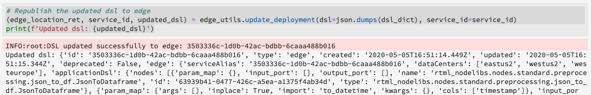

# Real-time Machine Learning-laptops beheren (Alpha)

>[!IMPORTANT]
>
>Het leren van de machine in real time is niet beschikbaar aan alle gebruikers nog. Deze functie bevindt zich in alfa en wordt nog steeds getest. Dit document kan worden gewijzigd.

In de volgende handleiding worden de stappen beschreven die nodig zijn om een toepassing voor het leren van machines in realtime te bouwen. De meegeleverde Adobe gebruiken **[!UICONTROL Real-time ML]** Deze handleiding, Python-laptopsjabloon, omvat het trainen van een model, het maken van een DSL, het publiceren van DSL naar Edge en het scoren van de aanvraag. Aangezien u door het uitvoeren van uw het Leren model van de machine in real time vordert, wordt verwacht dat u het malplaatje wijzigt om de behoeften van uw dataset te passen.

## Een laptop voor real-time leren van machines maken

Selecteer in de gebruikersinterface van Adobe Experience Platform de optie **[!UICONTROL Notebooks]** van binnen **Gegevenswetenschap**. Selecteer vervolgens **[!UICONTROL JupyterLab]** en laat de omgeving enige tijd laden.


De [!DNL JupyterLab] wordt gestart. Omlaag schuiven naar *Real-Time Machine Learning* en selecteert u de **[!UICONTROL Real-time ML]** -laptop. Er wordt een sjabloon geopend met voorbeeldlaptopcellen met een voorbeeldgegevensset.


## Knooppunten importeren en ontdekken

Begin door alle vereiste pakketten voor uw model in te voeren. Zorg ervoor om het even welk pakket u op het gebruiken voor knoop creatie van plan bent wordt ingevoerd.

>[!NOTE]
>
>De lijst met geïmporteerde producten kan afwijken, afhankelijk van het model dat u wilt maken. Deze lijst zal veranderen aangezien de nieuwe knopen in tijd worden toegevoegd. Raadpleeg de [verwijzingsgids voor knooppunten](./node-reference.md) voor een volledige lijst met beschikbare knooppunten.

```python
from pprint import pprint
import pandas as pd
import numpy as np
import json
import uuid
from shutil import copyfile
from pathlib import Path
from datetime import date, datetime, timedelta
from platform_sdk.dataset_reader import DatasetReader

from rtml_nodelibs.nodes.standard.preprocessing.json_to_df import JsonToDataframe
from rtml_sdk.edge.utils import EdgeUtils
from rtml_sdk.graph.utils import GraphBuilder
from rtml_nodelibs.nodes.standard.ml.onnx import ONNXNode
from rtml_nodelibs.core.nodefactory import NodeFactory as nf
from rtml_nodelibs.nodes.standard.preprocessing.pandasnode import Pandas
from rtml_nodelibs.nodes.standard.preprocessing.one_hot_encoder import OneHotEncoder
from rtml_nodelibs.nodes.standard.ml.artifact_utils import ModelUpload
from rtml_nodelibs.core.nodefactory import NodeFactory as nf
from rtml_nodelibs.core.datamsg import DataMsg
```

In de volgende codecel wordt een lijst met beschikbare knooppunten afgedrukt.

```python
# Discover Nodes
pprint(nf.discover_nodes())
```


## Een real-time leren van machines trainen

Als u een van de volgende opties gebruikt, schrijft u [!DNL Python] code om gegevens te lezen, vooraf te verwerken en te analyseren. Daarna, moet u uw eigen model van XML trainen, het in formaat rangschikken ONNX en dan uploadt het aan het Leren modelopslag van de machine in real time.

- [Uw eigen model trainen in JupyterLab-laptops](#training-your-own-model)
- [Uw eigen vooraf getrainde ONNX-model uploaden naar JupyterLab-laptops](#pre-trained-model-upload)

### Uw eigen model trainen {#training-your-own-model}

Begin met het laden van uw trainingsgegevens.

>[!NOTE]
>
>In de **Real-time ML** sjabloon, de [CSV-gegevensset autoverzekering](https://github.com/adobe/experience-platform-dsw-reference/tree/master/datasets/insurance) wordt opgehaald uit [!DNL Github].


Als u een gegevensset wilt gebruiken vanuit Adobe Experience Platform, verwijdert u de commentaarmarkering uit de onderstaande cel. Nu moet u `DATASET_ID` met de juiste waarde.


Om tot een dataset in uw toegang te hebben [!DNL JupyterLab] -laptop, selecteert u de **Gegevens** in de linkernavigatie van [!DNL JupyterLab]. De **[!UICONTROL Datasets]** en **[!UICONTROL Schemas]** worden weergegeven. Selecteren **[!UICONTROL Datasets]** en klikt u met de rechtermuisknop en selecteert u vervolgens de **[!UICONTROL Explore Data in Notebook]** in het vervolgkeuzemenu op de gegevensset die u wilt gebruiken. Onder aan de laptop wordt een uitvoerbaar code-item weergegeven. Deze cel bevat uw `dataset_id`.


Klik met de rechtermuisknop en verwijder de cel die u onder aan de laptop hebt gegenereerd.

### Trainingseigenschappen

Wijzig met behulp van het meegeleverde sjabloon de trainingseigenschappen in `config_properties`.

```python
config_properties = {
    "train_records_limit":1000000,
    "n_estimators": "80",
    "max_depth": "5",
    "ten_id": "_experienceplatform"  
}
```

### Uw model voorbereiden

Met de **[!UICONTROL Real-time ML]** sjabloon, moet u uw model van XML analyseren, vooraf verwerken, trainen, en evalueren. Dit wordt gedaan door gegevenstransformaties toe te passen en een opleidingspijpleiding te bouwen.

**Gegevenstransformaties**

De **[!UICONTROL Real-time ML]** sjablonen **Gegevenstransformaties** De cel moet worden gewijzigd om met uw eigen dataset te werken. Doorgaans gaat het hier om het wijzigen van de naam van kolommen, rollup van gegevens en het voorbereiden en bewerken van gegevens.

>[!NOTE]
>
>Het volgende voorbeeld is voor leesbaarheidsdoeleinden gecondenseerd met `[ ... ]`. Geef de *Real-time ML* de sectie van de transformaties van malplaatjegegevens voor de volledige codecel.

```python
df1.rename(columns = {config_properties['ten_id']+'.identification.ecid': 'ecid',
                     [ ... ]}, inplace=True)
df1 = df1[['ecid', 'km', 'cartype', 'age', 'gender', 'carbrand', 'leasing', 'city', 
       'country', 'nationality', 'primaryuser', 'purchase', 'pricequote', 'timestamp']]
print("df1 shape 1", df1.shape)
#########################################
# Data Rollup
######################################### 
df1['timestamp'] = pd.to_datetime(df1.timestamp)
df1['hour'] = df1['timestamp'].dt.hour.astype(int)
df1['dayofweek'] = df1['timestamp'].dt.dayofweek

df1.loc[(df1['purchase'] == 'yes'), 'purchase'] = 1
df1.purchase.fillna(0, inplace=True)
df1['purchase'] = df1['purchase'].astype(int)

[ ... ]

print("df1 shape 2", df1.shape)

#########################################
# Data Preparation/Feature Engineering
#########################################      

df1['carbrand'] = df1['carbrand'].str.lower()
df1['country'] = df1['country'].str.lower()
df1.loc[(df1['carbrand'] == 'vw'), 'carbrand'] = 'volkswagen'

[ ... ]

df1['age'].fillna(df1['age'].median(), inplace=True)
df1['gender'].fillna('notgiven', inplace=True)

[ ... ]

df1['city'] = df1.groupby('country')['city'].transform(lambda x: x.fillna(x.mode()))
df1.dropna(subset = ['pricequote'], inplace=True)
print("df1 shape 3", df1.shape)
print(df1)

#grouping
grouping_cols = ['carbrand', 'cartype', 'city', 'country']

for col in grouping_cols:
    df_idx = pd.DataFrame(df1[col].value_counts().head(6))

    def grouping(x):
        if x in df_idx.index:
            return x
        else:
            return "Others"
    df1[col] = df1[col].apply(lambda x: grouping(x))

def age(x):
    if x < 20:
        return "u20"
    elif x > 19 and x < 29:
    [ ... ]
    else: 
        return "Others"

df1['age'] = df1['age'].astype(int)
df1['age_bucket'] = df1['age'].apply(lambda x: age(x))

df_final = df1[['hour', 'dayofweek','age_bucket', 'gender', 'city',  
   'country', 'carbrand', 'cartype', 'leasing', 'pricequote', 'purchase']]
print("df final", df_final.shape)

cat_cols = ['age_bucket', 'gender', 'city', 'dayofweek', 'country', 'carbrand', 'cartype', 'leasing']
df_final = pd.get_dummies(df_final, columns = cat_cols)
```

Voer de opgegeven cel uit om een voorbeeldresultaat te zien. De uitvoertabel die wordt geretourneerd door de `carinsurancedataset.csv` de dataset keert de wijzigingen terug u bepaalde.


**Trainingsleiding**

Daarna moet u de trainingspijpleiding tot stand brengen. Dit zal gelijkaardig aan een ander dossier van de trainingspijpleiding kijken behalve u moet omzetten en een ONNX dossier produceren.

Wijzig de sjabloon met de gegevenstransformaties die in de vorige cel zijn gedefinieerd. De volgende hieronder benadrukte code wordt gebruikt voor het produceren van een ONNX- dossier in uw eigenschappijpleiding. Bekijk de *Real-time ML* malplaatje voor de volledige cel van de pijpleidingscode.

```python
#for generating onnx
def generate_onnx_resources(self):        
    install_dir = os.path.expanduser('~/my-workspace')
    print("Generating Onnx")
        
    from skl2onnx import convert_sklearn
    from skl2onnx.common.data_types import FloatTensorType
        
    # ONNX-ification
    initial_type = [('float_input', FloatTensorType([None, self.feature_len]))]

    print("Converting Model to Onnx")
    onx = convert_sklearn(self.model, initial_types=initial_type)
             
    with open("model.onnx", "wb") as f:
        f.write(onx.SerializeToString())
            
    print("Model onnx created")
```

Nadat u de trainingsleiding hebt voltooid en uw gegevens hebt gewijzigd via gegevenstransformaties, gebruikt u de volgende cel om training uit te voeren.

```python
model = train(config_properties, df_final)
```

### Een ONNX-model genereren en uploaden

Nadat u een training hebt voltooid, moet u een ONNX-model genereren en het opgeleide model uploaden naar de modelwinkel voor het leren van machines in real time. Nadat u de volgende cellen hebt uitgevoerd, verschijnt uw ONNX-model in de linkerrail naast al uw andere laptops.

```python
import os
import skl2onnx, subprocess

model.generate_onnx_resources()
```

>[!NOTE]
>
>Wijzig de `model_path` tekenreekswaarde (`model.onnx`) om de naam van uw model te wijzigen.

```python
model_path = "model.onnx"
```

>[!NOTE]
>
>De volgende cel is niet bewerkbaar of kan worden verwijderd en is vereist voor het werken van uw toepassing voor het leren van machines in realtime.

```python
model = ModelUpload(params={'model_path': model_path})
msg_model = model.process(None, 1)
model_id = msg_model.model['model_id']
 
print("Model ID: ", model_id)
```


### Uw eigen vooraf opgeleide ONNX-model uploaden {#pre-trained-model-upload}

De uploadknop in [!DNL JupyterLab] -laptops, uploadt u uw vooraf opgeleide ONNX-model naar de [!DNL Data Science Workspace] -laptops.


Wijzig vervolgens de `model_path` tekenreekswaarde in het dialoogvenster *Real-time ML* -laptop die aansluit bij uw ONNX-modelnaam. Voer de opdracht *Modelpad instellen* cel en voert vervolgens de *Uw model uploaden naar de RTML Model Store* cel. Uw modellocatie en model-id worden beide geretourneerd in de reactie als de bewerking succesvol was.


## Maken van domeinspecifieke taal (DSL)

Deze sectie schetst het creëren van een DSL. U gaat de knopen schrijven die om het even welke voorverwerking van gegevens samen met knoop ONNX omvatten. Vervolgens wordt een DSL-grafiek gemaakt met knooppunten en randen. Randen verbinden knooppunten met behulp van een op twee gebaseerde indeling (node_1, node_2). De grafiek moet geen cycli hebben.

>[!IMPORTANT]
>
>Het gebruik van het ONNX-knooppunt is verplicht. Zonder het ONNX-knooppunt is de toepassing mislukt.

### Node authoring

>[!NOTE]
>
> U hebt waarschijnlijk meerdere knooppunten op basis van het type gegevens dat wordt gebruikt. In het volgende voorbeeld wordt slechts één knooppunt in het dialoogvenster *Real-time ML* sjabloon. Bekijk de *Real-time ML* sjablonen *Node Authoring* sectie voor de volledige codecel.

Het onderstaande Pandas-knooppunt gebruikt `"import": "map"` om de methodenaam als koord in de parameters in te voeren, door de parameters als kaartfunctie in te voeren. In het onderstaande voorbeeld wordt dit gedaan door `{'arg': {'dataLayerNull': 'notgiven', 'no': 'no', 'yes': 'yes', 'notgiven': 'notgiven'}}`. Nadat u de kaart hebt geplaatst, hebt u de optie om te plaatsen `inplace` als `True` of `False`. Set `inplace` als `True` of `False` op basis van de vraag of u transformatie wilt toepassen. Standaard `"inplace": False` maakt een nieuwe kolom. Ondersteuning voor het opgeven van een nieuwe kolomnaam is ingesteld om in een volgende release te worden toegevoegd. De laatste regel `cols` Dit kan een enkele kolomnaam of een lijst met kolommen zijn. Geef de kolommen op waarop u de transformatie wilt toepassen. In dit voorbeeld `leasing` wordt opgegeven. Ga voor meer informatie over de beschikbare knooppunten en hoe u deze kunt gebruiken naar de [verwijzingsgids voor knooppunten](./node-reference.md).

```python
# Renaming leasing column using Pandas Node
leasing_mapper_node = Pandas(params={'import': 'map',
                                'kwargs': {'arg': {
                                    'dataLayerNull': 'notgiven', 
                                    'no': 'no', 
                                    'yes': 'yes', 
                                    'notgiven': 'notgiven'}},
                                'inplace': True,
                                'cols': 'leasing'})
```

### De DSL-grafiek maken

Als uw knooppunten zijn gemaakt, bestaat de volgende stap uit het koppelen van de knooppunten om een grafiek te maken.

Begin door van alle knopen een lijst te maken die een deel van de grafiek door een serie vormen.

```python
nodes = [json_df_node, 
        to_datetime_node,
        hour_node,
        dayofweek_node,
        age_fillna_node,
        carbrand_fillna_node,
        country_fillna_node,
        cartype_primary_nationality_km_fillna_node,
        carbrand_mapper_node,
        cartype_mapper_node,
        country_mapper_node,
        gender_mapper_node,
        leasing_mapper_node,
        age_to_int_node,
        age_bins_node,
        dummies_node, 
        onnx_node]
```

Sluit vervolgens de knooppunten aan op de randen. Elke tegel is een [!DNL Edge] verbinding.

>[!TIP]
>
> Aangezien de knopen lineair van elkaar afhankelijk zijn (elke knoop hangt van de output van vorige knoop af), kunt u verbindingen tot stand brengen gebruikend een eenvoudige het lijstbegrip van Python. Voeg uw eigen verbindingen toe als een knooppunt afhankelijk is van meerdere invoeren.

```python
edges = [(nodes[i], nodes[i+1]) for i in range(len(nodes)-1)]
```

Maak de grafiek wanneer uw knooppunten zijn verbonden. De onderstaande cel is verplicht en kan niet worden bewerkt of verwijderd.

```python
dsl = GraphBuilder.generate_dsl(nodes=nodes, edges=edges)
pprint(json.loads(dsl))
```

Na voltooiing, en `edge` object wordt geretourneerd met elk van de knooppunten en de parameters die eraan zijn toegewezen.


## Publiceren naar rand (hub)

>[!NOTE]
>
>Het leren van de machine in real time wordt tijdelijk opgesteld aan en beheerd door de Hub van Adobe Experience Platform. Ga voor meer informatie naar de overzichtssectie over [Real-time Machine Learning-architectuur](./home.md#architecture).

Nu u een DSL-grafiek hebt gemaakt, kunt u de grafiek in de [!DNL Edge].

>[!IMPORTANT]
>
>Niet publiceren naar [!DNL Edge] vaak kan dit leiden tot overbelasting van [!DNL Edge] knooppunten. Het wordt niet aanbevolen hetzelfde model meerdere keren te publiceren.

```python
edge_utils = EdgeUtils()
(edge_location, service_id) = edge_utils.publish_to_edge(dsl=dsl)
print(f'Edge Location: {edge_location}')
print(f'Service ID: {service_id}')
```

### De DSL bijwerken en opnieuw publiceren naar Edge (optioneel)

Als u uw DSL niet hoeft bij te werken, kunt u overslaan naar [scoren](#scoring).

>[!NOTE]
>
>De volgende cellen zijn alleen vereist als u een bestaande DSL wilt bijwerken die naar Edge is gepubliceerd.

Uw modellen zullen zich waarschijnlijk blijven ontwikkelen. In plaats van een volledige nieuwe service te maken, is het mogelijk een bestaande service bij te werken met uw nieuwe model. U kunt een knooppunt definiëren dat u wilt bijwerken, er een nieuwe id aan toewijzen en vervolgens de nieuwe DSL opnieuw uploaden naar de [!DNL Edge].

In het onderstaande voorbeeld wordt knooppunt 0 bijgewerkt met een nieuwe id.

```python
# Update the id of Node 0 with a random uuid.

dsl_dict = json.loads(dsl)
print(f"ID of Node 0 in current DSL: {dsl_dict['edge']['applicationDsl']['nodes'][0]['id']}")

new_node_id = str(uuid.uuid4())
print(f'Updated Node ID: {new_node_id}')

dsl_dict['edge']['applicationDsl']['nodes'][0]['id'] = new_node_id
```


Na het bijwerken van knoopidentiteitskaart, kunt u een bijgewerkte DSL aan de Rand opnieuw publiceren.

```python
# Republish the updated DSL to Edge
(edge_location_ret, service_id, updated_dsl) = edge_utils.update_deployment(dsl=json.dumps(dsl_dict), service_id=service_id)
print(f'Updated dsl: {updated_dsl}')
```

U bent teruggekeerd bijgewerkte DSL.



## Scores {#scoring}

Na publicatie naar [!DNL Edge]scoring wordt uitgevoerd door een verzoek van een POST van een client. Dit kan doorgaans worden gedaan vanuit een clienttoepassing waarvoor XML-scores vereist zijn. Je kunt het ook van Postman doen. De **[!UICONTROL Real-time ML]** het malplaatjegebruik EdgeUtils om dit proces aan te tonen.

>[!NOTE]
>
>Er is een kleine verwerkingstijd vereist voordat het scoren begint.

```python
# Wait for the app to come up
import time
time.sleep(20)
```

Met hetzelfde schema dat in de training werd gebruikt, worden voorbeeldgegevens voor het bijhouden van de score gegenereerd. Deze gegevens worden gebruikt om een dataframe voor scoring te maken en vervolgens om te zetten in een scorewoordenboek. Bekijk de *Real-time ML* sjabloon voor de volledige codecel.


### Score tegen het eindpunt van de Rand

Gebruik de volgende cel in de *Real-time ML* template waarop je moet worden gescore [!DNL Edge] service.


Wanneer het scoren is voltooid, wordt de opdracht [!DNL Edge] URL, Payload en gekleurde uitvoer van de [!DNL Edge] worden geretourneerd.

## Maak een lijst met uw geïmplementeerde apps vanuit de [!DNL Edge]

Een lijst genereren van uw momenteel geïmplementeerde apps in het dialoogvenster [!DNL Edge], voert u de volgende codecel uit. Deze cel kan niet worden bewerkt of verwijderd.

```python
services = edge_utils.list_deployed_services()
print(services)
```

De teruggekeerde reactie is een serie van uw opgestelde diensten.

```json
[
    {
        "created": "2020-05-25T19:18:52.731Z",
        "deprecated": false,
        "id": "40eq76c0-1c6f-427a-8f8f-54y9cdf041b7",
        "type": "edge",
        "updated": "2020-05-25T19:18:52.731Z"
    }
]
```

## Een geïmplementeerde app of service-id verwijderen uit de [!DNL Edge] (optioneel)

>[!CAUTION]
>
>Deze cel wordt gebruikt om uw geïmplementeerde Edge-toepassing te verwijderen. Gebruik de volgende cel alleen als u een geïmplementeerde cel moet verwijderen [!DNL Edge] toepassing.

```python
if edge_utils.delete_from_edge(service_id=service_id):
    print(f"Deleted service id {service_id} successfully")
else:
    print(f"Failed to delete service id {service_id}")
```

## Volgende stappen

Door de bovenstaande zelfstudie te volgen, hebt u een ONNX-model getraind en geüpload naar de modelwinkel voor het leren van machines in realtime. Bovendien, hebt u uw in real time het Leren model van de Machine gescoord en opgesteld. Als u meer wilt weten over de knooppunten die beschikbaar zijn voor het ontwerpen van modellen, gaat u naar de [verwijzingsgids voor knooppunten](./node-reference.md).
