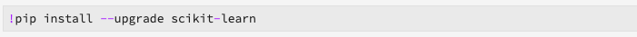

# Een model trainen voor Real-time Machine Learning

>[!IMPORTANT]
>Het leren van de machine in real time is niet beschikbaar aan alle gebruikers nog. Deze functie bevindt zich in alfa en wordt nog steeds getest. Dit document kan worden gewijzigd.

Dit document biedt een zelfstudie voor het uploaden van een ONNX-model naar de modelwinkel voor het leren van machines in realtime.

Als u een van de volgende opties gebruikt, schrijft u pythoncode voor het lezen, voorbewerken en analyseren van gegevens. Daarna, moet u uw eigen model van XML trainen, het in formaat in series vervaardigen ONNX, en het tenslotte uploaden aan het Lerende modelarchief van de machine in real time. Bovendien krijgt u tegen het einde van de zelfstudie een model-id waarmee het getrainde model wordt geïdentificeerd voor gebruik in de [zelfstudie](./scoring-ml-model.md)over het studeren.

* [Een model trainen met een Python-laptop](#training-model-python-notebook)
* [Een model trainen met uw eigen ONNX-model](#train-using-own-onnx-model)
* [Een model trainen met behulp van de sjabloon voor het samenstellen van recepten](#train-using-recipe-builder)
* [Een model trainen met behulp van de Data Science Workplace-recept-workflow](#recipe-workflow-train-model)


## Een model trainen met een Python-laptop {#training-model-python-notebook}

Selecteer in de gebruikersinterface van het Adobe Experience Platform **[!UICONTROL laptops]** uit *Data Science*. Selecteer vervolgens **[!UICONTROL JupyterLab]** en laat de omgeving enige tijd laden.


Begin met het selecteren van de **lege Python 3-laptop** in de JupyterLab-startprogramma.


### Toegangsgegevens {#access-data}

Selecteer vervolgens de gegevensset die u wilt gebruiken. Als u toegang wilt krijgen tot een gegevensset in uw JupyterLab-laptop, selecteert u het tabblad **Gegevens** in de linkernavigatie van JupyterLab. De mappen *Datasets* en *Schemas* worden weergegeven. Selecteer **[!UICONTROL Datasets]** en klik met de rechtermuisknop, dan selecteren **[!UICONTROL onderzoek Gegevens in Notitie]** van het drop-down menu op de dataset u wenst te gebruiken. Er wordt een uitvoerbare code in uw notitieboekje weergegeven.


### Uw model voorbereiden

Gebruik het volgende malplaatje om uw model van XML te analyseren, vooraf te verwerken, op te leiden en te evalueren. Voor een volledig voorbeeld gebruikt u de schermafbeeldingen onder deze sjabloon:

```python
from sklearn import svm, metrics
from sklearn.model_selection import train_test_split


data = df[input_columns]
target = df[target_column]
# Create a classifier: a support vector classifier
classifier = svm.SVC(gamma=0.001)

# Split data into train and test subsets
X_train, X_test, y_train, y_test = train_test_split(
    data, target, test_size=0.5, shuffle=False)

# We train the classifier
classifier.fit(X_train, y_train)

# Now do predictions
predicted = classifier.predict(X_test)


print("Classification report for classifier %s:\n%s\n"
      % (classifier, metrics.classification_report(y_test, predicted)))
disp = metrics.plot_confusion_matrix(classifier, X_test, y_test)
disp.figure_.suptitle("Confusion Matrix")
print("Confusion matrix:\n%s" % disp.confusion_matrix)
```

>[!NOTE]
>In het onderstaande voorbeeld wordt de scikit-learn-bibliotheek gebruikt in plaats van de gegevens te laden uit een ingesloten gegevensset van het Adobe Experience Platform.



**Uitvoer**


### Uw model uploaden

Zodra u de vorige stap hebt voltooid, moet u uw model in series vervaardigen in een formaat ONNX en het uploaden aan de Echte - tijd opslag van het Leren van de Machine. Dit keert terug `model_id` gebruikt in het [volgende leerprogramma](#next-steps).

Gebruik het volgende malplaatje om in ONNX om te zetten en uw dataset te uploaden:

```python
from rtml_nodelibs.nodes.standard.ml.artifact_utils
import ModelUpload
from rtml_nodelibs.core.nodefactory
import NodeFactory as nf
from skl2onnx.common.data_types
import FloatTensorType
from skl2onnx
import convert_sklearn

########## Save sklearn model in ONNX format at model_path ##########
inputs = [('features', FloatTensorType([None, X_train.shape[1]]))]
model_onnx = convert_sklearn(classifier, 'ScikitLearnModel', inputs)

model_path = "model.onnx"
os.environ["ONNX_MODEL_PATH"] = model_path

with open(model_path, "wb") as f:
  f.write(model_onnx.SerializeToString())

  ########## Upload the model from model_path to RTML model store ##########
  model = ModelUpload(params = {
    'model_path': model_path
  })

msg_model = model.process(None, 1)

model_id = msg_model.model['model_id']

print("Model ID : ", model_id)
```

**Antwoord**


Kopieer de inhoud `model_id`en ga verder met de [volgende stappen](#next-steps).


## Een model trainen met uw eigen ONNX-model {#train-using-own-onnx-model}

Selecteer in de gebruikersinterface van het Adobe Experience Platform **[!UICONTROL laptops]** uit *Data Science*. Selecteer vervolgens **[!UICONTROL JupyterLab]** en laat de omgeving enige tijd laden.


Met de uploadknop in JupyterLab-laptops kunt u uw ONNX-model uploaden naar de notebookomgeving van de Data Science Workspace.


Maak vervolgens een nieuwe, lege laptop door het lege notitiepictogram onder Python 3 te selecteren in de JupyterLab-startprogramma.


Kopieer en plak het volgende in het lege notebook:

>[!NOTE]
> Zorg ervoor dat u de gegevens opgeeft `model_path` van het ONNX-model dat u hebt geüpload.

```python
from rtml_nodelibs.nodes.standard.ml.artifact_utils import ModelUpload
from rtml_nodelibs.core.nodefactory import NodeFactory as nf
 
model_path = <path/to/onnx_model>
########## Upload the model from model_path to RTML model store ##########
model = ModelUpload(params={'model_path': model_path})
 
msg_model = model.process(None, 1)
 
model_id = msg_model.model['model_id']
 
print("Model ID : ", model_id)
```

Nadat u de bovenstaande cel hebt uitgevoerd, `model_id` wordt er een geretourneerd. Kopieer de model-id die u wilt gebruiken in de [volgende zelfstudie](#next-steps).

## Een model trainen met behulp van een vooraf opgebouwd recept-sjabloon {#train-using-recipe-builder}

Selecteer in de gebruikersinterface van het Adobe Experience Platform **[!UICONTROL laptops]** uit *Data Science*. Selecteer vervolgens **[!UICONTROL JupyterLab]** en laat de omgeving enige tijd laden.


Volg vervolgens de zelfstudie voor Jupyter-laptops [om een recept te](../jupyterlab/create-a-recipe.md) maken. Zodra volledig, moet u het pijpleiding.py- dossier voor echt - tijd het meetellen wijzigen om te werken.

>[!NOTE]
>Het malplaatje door de Werkruimte van de Wetenschap van Gegevens wordt verstrekt moet worden gewijzigd om uw dataset te passen die.

Sla het model op in de ONNX-indeling en stel de omgevingsvariabele in op `ONNX_MODEL_PATH`. In het onderstaande voorbeeld ziet u hoe u het pijplijnbestand kunt wijzigen met de sjabloon recept-builder.

```python
def train(configProperties, data):

  print("Train Start")

########## Extract fields from configProperties ##########
learning_rate = float(configProperties['learning_rate'])
n_estimators = int(configProperties['n_estimators'])
max_depth = int(configProperties['max_depth'])

########## Fit model ##########
X_train = data.drop('weeklySalesAhead', axis = 1).values
y_train = data['weeklySalesAhead'].values

seed = 1234
model = GradientBoostingRegressor(learning_rate = learning_rate,
  n_estimators = n_estimators,
  max_depth = max_depth,
  random_state = seed)

model.fit(X_train, y_train)

########## Save sklearn model in ONNX format at model_path ##########
inputs = [('features', FloatTensorType([None, X_train.shape[1]]))]
model_onnx = convert_sklearn(model, 'ScikitLearnModel', inputs)

model_path = "retail_sales_model.onnx"
os.environ["ONNX_MODEL_PATH"] = model_path

with open(model_path, "wb") as f:
  f.write(model_onnx.SerializeToString())

print("Train Complete")

return model
```

Nadat u het bestand pipe.py hebt gewijzigd, voert u **[!UICONTROL Training]** en **[!UICONTROL Scoring]** uit. Selecteer de knop Ontvanger **[!UICONTROL maken]** als de bewerking is voltooid.


Er wordt een dialoogvenster voor naamgeving weergegeven. Voer de naam van uw recept in en selecteer **[!UICONTROL OK]**. Er verschijnt een nieuw dialoogvenster waarin u wordt gewaarschuwd dat het maken van het recept is begonnen. Laat enige tijd over voor het recept.


Nadat u een recept hebt gemaakt, kunt u dit weergeven door Ontvangers **** weergeven te selecteren in het dialoogvenster dat verschijnt of door naar **[!UICONTROL Modellen]** te navigeren en vervolgens **[!UICONTROL Ontvangers]** te selecteren in de navigatie linksboven. Er wordt een lijst weergegeven met recepten die zijn gesorteerd op de aanmaakdatum. Bevestig dat je nieuwe recept bovenaan staat.


Selecteer uw recept. De overzichtspagina van het recept wordt weergegeven. Selecteer Model **** maken in de navigatie rechtsboven.


Selecteer vervolgens een geschikte gegevensset. Klik vervolgens op **[!UICONTROL Volgende]** in de navigatie rechtsboven.


De configuratiepagina wordt geopend. Geef een naam voor het model op en controleer de standaardmodelconfiguraties. Standaardconfiguraties worden toegepast tijdens het maken van het recept. Controleer en wijzig de configuratiewaarden door op de waarden te dubbelklikken. Als u een nieuwe set configuraties wilt opgeven, klikt u op **[!UICONTROL Nieuwe configuratie]** uploaden en sleept u een JSON-bestand met modelconfiguraties naar het browservenster. Selecteer **[!UICONTROL Voltooien]** om het model te maken.


Nadat u het model hebt gemaakt, moet u wachten tot de training is voltooid. Als een trainingsprogramma met succes is voltooid, kunt u de trainingsreeks selecteren om de details ervan weer te geven.

Selecteer een trainingsrun. Als deze optie is geselecteerd, wordt rechts een dialoogvenster met eigenschappen weergegeven. Selecteer **[!UICONTROL Activiteitenlogboeken]** weergeven in dit dialoogvenster.


Het dialoogvenster Activiteitenlogboek *weergeven* wordt weergegeven. Selecteer URL voor de *stderlogboeken* om de logboeken te downloaden en de details van de looppas te zien.


Logs zijn vooral nuttig voor mislukte looppas om te zien wat verkeerd ging. Maar in dit geval zoekt u naar het `model-id` corresponderende ONNX-model dat u hebt gemaakt. Kopieer de model-id.

>[!NOTE]
>U hoeft geen scoretaak uit te voeren. In real time het Leren van de Rand van de Machine wordt het scoren behandeld in de [volgende stap](#next-steps).


## Een model trainen met behulp van de Data Science Workplace-recept-workflow {#recipe-workflow-train-model}

Dit is de beste methode om te gebruiken als u bekend bent met Docker, git en het verpakken van Python-code. Het gebruik van de werkruimte voor wetenschap van gegevens biedt u de meeste flexibiliteit en vrijheid bij het maken van uw recepten. U kunt een basisdockerbeeld trekken en uw eigen dockermilieu bouwen, uw recept met meer gemak zuiveren, pre-gebouwde recepten klonen om met om het even welke dienst van de Werkruimte van de Wetenschap van Gegevens te spelen, de receptlooppas, en veel meer plannen.

### Een schema maken

De eerste stap vereist dat u een gegevensschema voor uw dataset hebt. Een schema kan worden gemaakt via de gebruikersinterface van het Adobe Experience Platform of de platform-API&#39;s.

>[!NOTE]
>Als u al over de gegevens beschikt die u in het Adobe Experience Platform wilt gebruiken, slaat u deze over om een Python-recept [te](#create-a-python-recipe)maken.

* [Een schema maken met de zelfstudie voor de schema-editor](../../xdm/tutorials/create-schema-ui.md)
* [Een schema maken met de API-zelfstudie voor de Schema-editor](../../xdm/tutorials/create-schema-api.md)

### Gegevens verzamelen

Daarna, moet u gegevens opnemen gebruikend het schema dat u enkel creeerde. Dit kan worden gedaan door API of Platform UI te gebruiken.

>[!NOTE]
>Als u al over de gegevens beschikt die u in het Adobe Experience Platform wilt gebruiken, slaat u deze over om een Python-recept [te](#create-a-python-recipe)maken.

* [Zelfstudie over het toevoegen van gegevens aan de gebruikersinterface van het Adobe Experience Platform](../../ingestion/tutorials/ingest-batch-data.md)
* [Gegevens opnemen in de API-zelfstudie van Adobe Experience Platform](../../ingestion/batch-ingestion/api-overview.md)

### Een Python-recept maken {#create-a-python-recipe}

Het maken van recept begint met het verpakken van bronbestanden om een archiefbestand te maken. De brondossiers bepalen de machine het leren logica en de algoritmen die worden gebruikt om een specifiek probleem op te lossen. Gebruik de volgende zelfstudie om een Python Docker-afbeelding te maken.

* [Bronbestanden in een recept plaatsen](../models-recipes/package-source-files-recipe.md)

Om de volgende stap te voltooien moet u een beeld van de Dokker in een Azure Registratie van de Container samen met het overeenkomstige beeld URL hebben. Selecteer een van de onderstaande koppelingen naar zelfstudies om een Python-recept te maken:

* [Een gecomprimeerde ontvanger importeren in de gebruikersinterface](../models-recipes/import-packaged-recipe-ui.md)
* [Een gecomprimeerde ontvanger importeren met de API](../models-recipes/import-packaged-recipe-api.md)

### Een trainingsrun maken

In de Werkruimte van de Wetenschap van de Gegevens van het Platform van de Ervaring van Adobe, wordt een machine het leren Model gecreeerd door een bestaande Ontvanger op te nemen die voor de bedoeling van het Model aangewezen is. Het model wordt vervolgens getraind en geëvalueerd om de efficiëntie en werkzaamheid van de werking te optimaliseren door de bijbehorende hyperparameters te verfijnen.

* [Een model trainen en evalueren in de gebruikersinterface](../models-recipes/train-evaluate-model-ui.md)
* [Een model trainen en evalueren in de API](../models-recipes/train-evaluate-model-api.md)

>[!IMPORTANT]
>Sla het model op in de indeling ONNX in het bestand pipe.py voor uw recept `model_path` en stel de omgevingsvariabele in op `ONNX_MODEL_PATH`. De runtime zoekt naar deze specifieke omgevingsvariabele.

```python
def train(configProperties, data):
 
    print("Train Start")
 
    ########## Extract fields from configProperties ##########

    learning_rate = float(configProperties['learning_rate'])
    n_estimators = int(configProperties['n_estimators'])
    max_depth = int(configProperties['max_depth'])
 
 
    
    ########## Fit model ##########
    
    X_train = data.drop('weeklySalesAhead', axis=1).values
    y_train = data['weeklySalesAhead'].values
 
    seed = 1234
    model = GradientBoostingRegressor(learning_rate=learning_rate,
                                      n_estimators=n_estimators,
                                      max_depth=max_depth,
                                      random_state=seed)
 
    model.fit(X_train, y_train)
     
    ########## Save sklearn model in ONNX format at model_path ##########
    inputs = [('features', FloatTensorType([None, X_train.shape[1]]))]
    model_onnx = convert_sklearn(model, 'ScikitLearnModel', inputs)
 
    model_path = "retail_sales_model.onnx"
    os.environ["ONNX_MODEL_PATH"] = model_path
 
    with open(model_path, "wb") as f:
        f.write(model_onnx.SerializeToString())
 
    print("Train Complete")
 
    return model
```

Nadat u het model hebt gemaakt, moet u wachten tot de training is voltooid. Wanneer een trainingsprogramma met succes is voltooid, kunt u de trainingsreeks selecteren om de details ervan weer te geven. Selecteer een trainingsrun. Als rechts een eigenschappendialoogvenster is geselecteerd, selecteert u **[!UICONTROL Activiteitenlogboeken]** weergeven.


Het dialoogvenster Activiteitenlogboek *weergeven* wordt weergegeven. Selecteer URL voor de *stderlogboeken* om de logboeken te downloaden en de details van de looppas te zien.


Logs zijn vooral nuttig voor mislukte looppas om te zien wat verkeerd ging. Maar in dit geval zoekt u naar het `model-id` corresponderende ONNX-model dat u hebt gemaakt. Kopieer de model-id.


U hoeft geen scoraak in het recept uit te voeren. In de [volgende zelfstudie](#next-steps)vindt u de scoring van Edge-leerranden in realtime voor machines.

## Volgende stappen {#next-steps}

Door een van de bovenstaande zelfstudies te volgen, hebt u een ONNX-model getraind en geüpload naar de modelwinkel voor het leren van machines in real time en beschikt u over een model `model_id` dat uw model identificeert. Ga verder met de volgende zelfstudie om te leren hoe u uw [Real-Time Machine Learning-model](./scoring-ml-model.md)kunt scoren.