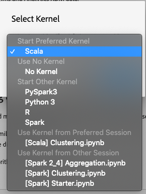
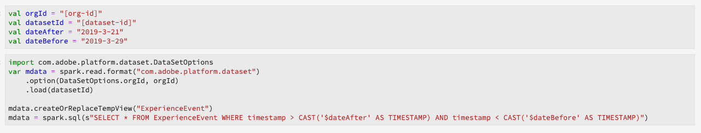

# Hulplijnen voor recept- en laptopmigratie

>[!NOTE]
>Laptops en recepten die gebruikmaken van Python/R blijven onaangetast. De migratie is alleen van toepassing op bestaande PySpark/Spark-recepten en -laptops.

In de volgende handleidingen worden de stappen en informatie beschreven die nodig zijn voor het migreren van bestaande recepten en laptops.

- [Hulplijnen voor migratie ontvang](#recipe-migration)
- [Laptopmigratiehulplijnen](#notebook-migration)

## Hulplijnen voor migratie ontvang {#recipe-migration}

Recente veranderingen in de Werkruimte van de Wetenschap van Gegevens vereisen dat de bestaande recepten van de Vonk en van PySpark worden bijgewerkt. Gebruik de volgende workflows om u te helpen bij de overgang van uw recepten.

- [Gids voor parkmigratie](#spark-migration-guide)
   - [Wijzigen hoe u gegevenssets leest en schrijft](#read-write-recipe-spark)
   - [Download het voorbeeldrecept](#download-sample-spark)
   - [Het dockingbestand toevoegen](#add-dockerfile-spark)
   - [Afhankelijkheden controleren](#change-dependencies-spark)
   - [Dockerscripts voorbereiden](#prepare-docker-spark)
   - [recept maken met docker](#create-recipe-spark)
- [PySpark-migratiegids](#pyspark-migration-guide)
   - [Wijzigen hoe u gegevenssets leest en schrijft](#pyspark-read-write)
   - [Download het voorbeeldrecept](#pyspark-download-sample)
   - [Het dockingbestand toevoegen](#pyspark-add-dockerfile)
   - [Dockerscripts voorbereiden](#pyspark-prepare-docker)
   - [recept maken met docker](#pyspark-create-recipe)

## Gids voor parkmigratie {#spark-migration-guide}

Het recept artefact dat door de bouwstijlstappen wordt geproduceerd is nu een beeld van de Docker dat uw .jar binair dossier bevat. Bovendien, is de syntaxis die wordt gebruikt om datasets te lezen en te schrijven gebruikend het Platform SDK veranderd en vereist u om uw receptcode te wijzigen.

De volgende video wordt ontworpen om in het begrijpen van de veranderingen verder te helpen die voor de recepten van de Vonk worden vereist:

>[!VIDEO](https://video.tv.adobe.com/v/33243)

### Gegevenssets lezen en schrijven (Spark) {#read-write-recipe-spark}

Alvorens u het beeld van de Docker bouwt, herzie de voorbeelden voor het lezen van en het schrijven van datasets in het Platform SDK, die in de hieronder secties wordt verstrekt. Als u bestaande recepten omzet, moet uw code van Platform SDK worden bijgewerkt.

#### Een gegevensset lezen

Deze sectie schetst de veranderingen die voor het lezen van een dataset nodig zijn en gebruikt het [helper.range](https://github.com/adobe/experience-platform-dsw-reference/blob/master/recipes/scala/src/main/scala/com/adobe/platform/ml/helper/Helper.scala) voorbeeld, die door Adobe wordt verstrekt.

Met de updates aan de recepten van de Vonk, moet een aantal waarden worden toegevoegd en worden veranderd. Ten eerste wordt `DataSetOptions` het niet meer gebruikt. Vervangen `DataSetOptions` door `QSOption`. Daarnaast zijn nieuwe `option` parameters vereist. Zowel `QSOption.mode` als `QSOption.datasetId` zijn nodig. Tot slot `orgId` en `serviceApiKey` moeten we het veranderen in `imsOrg` en `apiKey`. Bekijk de volgende tabel voor een vergelijking bij het lezen van datasets:

<table>
  <th>Oude manier om een dataset te lezen</th>
  <th>Nieuwe manier om een dataset te lezen</th>
  <tr>
  <td>
  <pre class="JSON language-JSON hljs">
  var df = sparkSession.read.format("com.adobe.platform.dataset") .option(DataSetOptions.orgId, orgId) .option(DataSetOptions.serviceToken, serviceToken) .option(DataSetOptions.userToken, userToken) .option(DataSetOptions.serviceApiKey, apiKey Key) .load(dataSetId)
</pre>
  </td>
  <td>
<pre class="JSON language-JSON hljs">
import com.adobe.platform.query.QSOption

var df = sparkSession.read.format(&quot;com.adobe.platform.query&quot;).option(QSOption.userToken&quot;, {userToken}).option(QSOption.serviceToken, {serviceToken}).option(QSOption.imsOrg, {orgId}).option(QSOption.apiKey, {apf iKey}).option(QSOption.mode, &quot;interactive&quot;).option(QSOption.datasetId, {dataSetId}).load()
</pre>
</td>
  </tr>
</table>

>[!TIP]
> De interactieve wijzetijden uit als de vragen langer dan 10 minuten lopen. Als u meer dan een paar gigabytes aan gegevens opneemt, adviseert men dat u op &quot;partij&quot;wijze overschakelt. De batterijmodus duurt langer om te starten, maar kan grotere gegevenssets verwerken.

#### Schrijven naar een gegevensset

Deze sectie schetst de veranderingen nodig voor het schrijven van een dataset door het [ScoringDataSaver.range](https://github.com/adobe/experience-platform-dsw-reference/blob/master/recipes/scala/src/main/scala/com/adobe/platform/ml/ScoringDataSaver.scala) voorbeeld te gebruiken, die door Adobe wordt verstrekt.

Met de updates aan de recepten van de Vonk, moet een aantal waarden worden toegevoegd en worden veranderd. Ten eerste wordt `DataSetOptions` het niet meer gebruikt. Vervangen `DataSetOptions` door `QSOption`. Daarnaast zijn nieuwe `option` parameters vereist. `QSOption.datasetId` is vereist en vervangt de noodzaak om de `{dataSetId}` insteekmodule te laden `.save()`. Tot slot `orgId` en `serviceApiKey` moeten we het veranderen in `imsOrg` en `apiKey`. Herzie de volgende lijst voor een vergelijking over het schrijven van datasets:

<table>
  <th>Oude manier om een dataset te schrijven</th>
  <th>Nieuwe manier om een dataset te schrijven</th>
  <tr>
  <td>
  <pre class="JSON language-JSON hljs">
  df.write.format("com.adobe.platform.dataset") .option(DataSetOptions.orgId, orgId) .option(DataSetOptions.serviceToken, serviceToken) .option(DataSetOptions.userToken, userToken) .option(DataSetOptions.serviceApiKey, apiKey) .save(scoring ResultatenDataSetId)
</pre>
  </td>
  <td>
<pre class="JSON language-JSON hljs">
import com.adobe.platform.query.QSOption

df.write.format(&quot;com.adobe.platform.query&quot;).option(QSOption.userToken&quot;, {userToken}).option(QSOption.serviceToken, {serviceToken}).option(QSOption.imsOrg, {orgId}).option(QSOption.apiKey, {apiKey}).option (QSOption.datasetId, {dataSetId}).save()
</pre>
</td>
  </tr>
</table>

### Op docker gebaseerde bronbestanden in pakketten (Spark) {#package-docker-spark}

Begin door naar de directory te navigeren waar uw recept zich bevindt.

In de volgende secties wordt gebruikgemaakt van het nieuwe Scala Retail Sales-recept dat u kunt vinden in de [Data Science Workspace public Github-opslagplaats](https://github.com/adobe/experience-platform-dsw-reference).

### Download het voorbeeldrecept (Vonk) {#download-sample-spark}

Het voorbeeldrecept bevat bestanden die naar het bestaande recept moeten worden gekopieerd. Als u de openbare Github wilt klonen die alle voorbeeldrecepten bevat, voert u het volgende in de terminal in:

```BASH
git clone https://github.com/adobe/experience-platform-dsw-reference.git
```

Het Scala-recept bevindt zich in de volgende directory `experience-platform-dsw-reference/recipes/scala/retail`.

### Dockerfile toevoegen (Vonk) {#add-dockerfile-spark}

Er is een nieuw bestand nodig in de map Recept om de op docker gebaseerde workflow te kunnen gebruiken. Kopieer en plak het Dockerbestand vanuit de map recipes in `experience-platform-dsw-reference/recipes/scala/Dockerfile`de map. U kunt desgewenst ook de onderstaande code kopiëren en plakken in een nieuw bestand met de naam `Dockerfile`.

>[!IMPORTANT]
> Het hieronder weergegeven voorbeeldjar-bestand `ml-retail-sample-spark-*-jar-with-dependencies.jar` moet worden vervangen door de naam van het jar-bestand van uw recept.

```scala
FROM adobe/acp-dsw-ml-runtime-spark:0.0.1

COPY target/ml-retail-sample-spark-*-jar-with-dependencies.jar /application.jar
```

### Afhankelijkheden wijzigen (Vonk) {#change-dependencies-spark}

Als u een bestaand recept gebruikt, worden de veranderingen vereist in het pom.xml- dossier voor gebiedsdelen. Verander model-creatie-sdk gebiedsdeelversie in 1.0.0. Werk vervolgens de Spark-versie in het pomabestand bij naar versie 2.4.3 en de Scala-versie naar versie 2.11.12.

```json
<groupId>com.adobe.platform.ml</groupId>
<artifactId>authoring-sdk_2.11</artifactId>
<version>1.0.0</version>
<classifier>jar-with-dependencies</classifier>
```

### Uw Docker-scripts voorbereiden (Spark) {#prepare-docker-spark}

De recepten van de Vonk gebruiken niet meer Binaire Artefacten en in plaats daarvan vereisen het bouwen van een beeld van de Docker. Als u dit nog niet hebt gedaan, [downloadt en installeert u Docker](https://www.docker.com/products/docker-desktop).

In het meegeleverde Scala-voorbeeldrecept kunt u de scripts vinden `login.sh` en `build.sh` vinden op `experience-platform-dsw-reference/recipes/scala/` . Kopieer en plak deze bestanden in uw bestaande recept.

De mapstructuur moet er nu hetzelfde uitzien als in het volgende voorbeeld (nieuw toegevoegde bestanden worden gemarkeerd):


De volgende stap bestaat uit het volgen van de bronbestanden van het [pakket in een zelfstudie over het recept](./models-recipes/package-source-files-recipe.md) . Deze zelfstudie bevat een sectie waarin de bouw van een dockerafbeelding voor een Scala-recept (Spark) wordt beschreven. Zodra volledig, wordt u voorzien van het beeld van de Dokker in een Azure Registratie van de Container samen met het overeenkomstige beeld URL.

### Een recept maken (Vonk) {#create-recipe-spark}

Als u een recept wilt maken, moet u eerst de zelfstudie over bronbestanden [in het](./models-recipes/package-source-files-recipe.md) pakket voltooien en de URL van de dockerafbeelding gereed hebben. U kunt een recept maken met de gebruikersinterface of API.

Als u uw recept wilt maken met de gebruikersinterface, volgt u de zelfstudie voor het verpakken van een recept (UI) [voor het](./models-recipes/import-packaged-recipe-ui.md) importeren van Scala.

Als u het recept wilt maken met de API, volgt u de zelfstudie [voor het verpakte recept (API)](./models-recipes/import-packaged-recipe-api.md) voor Scala.

## PySpark-migratiegids {#pyspark-migration-guide}

Het recept artefact dat door de bouwstijlstappen wordt geproduceerd is nu een beeld van de Docker dat uw binair dossier .egg bevat. Bovendien, is de syntaxis die wordt gebruikt om datasets te lezen en te schrijven gebruikend het Platform SDK veranderd en vereist u om uw receptcode te wijzigen.

De volgende video wordt ontworpen om in het begrijpen van de veranderingen verder te helpen die voor PySpark recepten worden vereist:

>[!VIDEO](https://video.tv.adobe.com/v/33048?learn=on&quality=12)

### Gegevenssets lezen en schrijven (PySpark) {#pyspark-read-write}

Alvorens u het beeld van de Docker bouwt, herzie de voorbeelden voor het lezen van en het schrijven van datasets in het Platform SDK, die in de hieronder secties wordt verstrekt. Als u bestaande recepten omzet, moet uw code van Platform SDK worden bijgewerkt.

#### Een gegevensset lezen

Deze sectie schetst de veranderingen nodig voor het lezen van een dataset door het [helper.py](https://github.com/adobe/experience-platform-dsw-reference/blob/master/recipes/pyspark/pysparkretailapp/helper.py) voorbeeld te gebruiken, die door Adobe wordt verstrekt.

Met de updates aan de recepten van de Vonk, moet een aantal waarden worden toegevoegd en worden veranderd. Ten eerste wordt `DataSetOptions` het niet meer gebruikt. Vervangen `DataSetOptions` door `qs_option`. Daarnaast zijn nieuwe `option` parameters vereist. Zowel `qs_option.mode` als `qs_option.datasetId` zijn nodig. Tot slot `orgId` en `serviceApiKey` moeten we het veranderen in `imsOrg` en `apiKey`. Bekijk de volgende tabel voor een vergelijking bij het lezen van datasets:

<table>
  <th>Oude manier om een dataset te lezen</th>
  <th>Nieuwe manier om een dataset te lezen</th>
  <tr>
  <td>
  <pre class="JSON language-JSON hljs">
dataset_options = get_dataset_options(spark.sparkContext)

pd = spark.read.format(&quot;com.adobe.platform.dataset&quot;).option(dataset_options.serviceToken(), service_token).option(dataset_options.userToken(), user_token).option(dataset_options.orgId(), org_id).option(dataset_options.serviceApiKey(), api_key).load(dataset_id)
</pre>
</td>
  <td>
<pre class="JSON language-JSON hljs">
qs_option = spark_context._jvm.com.adobe.platform.query.QSOption

pd = sparkSession.read.format(&quot;com.adobe.platform.query&quot;).option(qs_option.userToken, {userToken}).option(qs_option.serviceToken, {serviceToken}).option(qs_option.imsOrg, {orgId}).option(qs_option.apiKey, {apiKey}).option(qs_option.mode, &quot;interactive&quot;).option(qs_option.datasetId, {dataSetId}).load()
</pre>
</td>
  </tr>
</table>

>[!TIP]
> De interactieve wijzetijden uit als de vragen langer dan 10 minuten lopen. Als u meer dan een paar gigabytes aan gegevens opneemt, adviseert men dat u op &quot;partij&quot;wijze overschakelt. De batterijmodus duurt langer om te starten, maar kan grotere gegevenssets verwerken.

#### Schrijven naar een gegevensset

In deze sectie worden de wijzigingen beschreven die nodig zijn voor het schrijven van een gegevensset met behulp van het voorbeeld [data_saver.py](https://github.com/adobe/experience-platform-dsw-reference/blob/master/recipes/pyspark/pysparkretailapp/data_saver.py) , dat wordt geleverd door Adobe.

Met de updates aan PySpark recepten, moet een aantal waarden worden toegevoegd en worden veranderd. Ten eerste wordt `DataSetOptions` het niet meer gebruikt. Vervangen `DataSetOptions` door `qs_option`. Daarnaast zijn nieuwe `option` parameters vereist.  `qs_option.datasetId` is vereist en vervangt de noodzaak om de `{dataSetId}` in te laden `.save()` . Tot slot `orgId` en `serviceApiKey` moeten we het veranderen in `imsOrg` en `apiKey`. Bekijk de volgende tabel voor een vergelijking bij het lezen van datasets:

<table>
  <th>Oude manier om een dataset te schrijven</th>
  <th>Nieuwe manier om een dataset te schrijven</th>
  <tr>
  <td>
  <pre class="JSON language-JSON hljs">
df.write.format("com.adobe.platform.dataset") .option(DataSetOptions.orgId, orgId) .option(DataSetOptions.serviceToken, serviceToken) .option(DataSetOptions.userToken, userToken) .option(DataSetOptions.serviceApiKey, apiKey) .save(scoring ResultatenDataSetId)
</pre>
  </td>
  <td>
<pre class="JSON language-JSON hljs">
qs_option = spark_context._jvm.com.adobe.platform.query.QSOption

scored_df.write.format(&quot;com.adobe.platform.query&quot;).option(qs_option.userToken, {userToken}).option(qs_option.serviceToken, {serviceToken}).option(qs_option.imsOrg, {orgId}).option(qs_option.apiKey, {apiKey}).option(qs_option.datasetId, {dataSetId}).save()
</pre>
</td>
  </tr>
</table>

### Op docker gebaseerde bronbestanden in pakketten (PySpark) {#pyspark-package-docker}

Begin door naar de directory te navigeren waar uw recept zich bevindt.

In dit voorbeeld wordt het nieuwe PySpark Retail Sales-recept gebruikt en is het te vinden in de [Data Science Workspace public Github-opslagplaats](https://github.com/adobe/experience-platform-dsw-reference).

### Download het voorbeeldrecept (PySpark) {#pyspark-download-sample}

Het voorbeeldrecept bevat bestanden die naar het bestaande recept moeten worden gekopieerd. Als u de openbare Github wilt klonen die alle voorbeeldrecepten bevat, voert u het volgende in de terminal in.

```BASH
git clone https://github.com/adobe/experience-platform-dsw-reference.git
```

Het PySpark-recept bevindt zich in de volgende directory `experience-platform-dsw-reference/recipes/pyspark`.

### Dockerfile toevoegen (PySpark) {#pyspark-add-dockerfile}

Er is een nieuw bestand nodig in de map Recept om de op docker gebaseerde workflow te kunnen gebruiken. Kopieer en plak het Dockerbestand vanuit de map recipes in `experience-platform-dsw-reference/recipes/pyspark/Dockerfile`de map. U kunt desgewenst ook de onderstaande code kopiëren en plakken en een nieuw bestand maken met de naam `Dockerfile`.

>[!IMPORTANT]
> Het onderstaande voorbeeld-eibestand `pysparkretailapp-*.egg` moet worden vervangen door de naam van het eibestand van uw recept.

```scala
FROM adobe/acp-dsw-ml-runtime-pyspark:0.0.1
RUN mkdir /recipe

COPY . /recipe

RUN cd /recipe && \
    ${PYTHON} setup.py clean install && \
    rm -rf /recipe

RUN cp /databricks/conda/envs/${DEFAULT_DATABRICKS_ROOT_CONDA_ENV}/lib/python3.6/site-packages/pysparkretailapp-*.egg /application.egg
```

### De Docker-scripts voorbereiden (PySpark) {#pyspark-prepare-docker}

PySpark-recepten gebruiken niet langer Binaire artefacten en vereisen in plaats daarvan het maken van een Docker-afbeelding. Download en installeer [Docker](https://www.docker.com/products/docker-desktop)als u dat nog niet hebt gedaan.

In het meegeleverde PySpark-voorbeeldrecept kunt u de scripts vinden `login.sh` en `build.sh` vinden op `experience-platform-dsw-reference/recipes/pyspark` . Kopieer en plak deze bestanden in uw bestaande recept.

De mapstructuur moet er nu hetzelfde uitzien als in het volgende voorbeeld (nieuw toegevoegde bestanden worden gemarkeerd):


Uw recept is nu klaar om te worden gebouwd met een Docker-afbeelding. De volgende stap bestaat uit het volgen van de bronbestanden van het [pakket in een zelfstudie over het recept](./models-recipes/package-source-files-recipe.md) . Deze zelfstudie bevat een sectie met een overzicht van het maken van een dockerafbeelding voor een PySpark-recept (Spark 2.4). Zodra volledig, wordt u voorzien van het beeld van de Dokker in een Azure Registratie van de Container samen met het overeenkomstige beeld URL.

### Een recept maken (PySpark) {#pyspark-create-recipe}

Als u een recept wilt maken, moet u eerst de zelfstudie over bronbestanden [in het](./models-recipes/package-source-files-recipe.md) pakket voltooien en de URL van de dockerafbeelding gereed hebben. U kunt een recept maken met de gebruikersinterface of API.

Om uw recept te bouwen gebruikend UI, volg de [invoer een verpakte recept (UI)](./models-recipes/import-packaged-recipe-ui.md) zelfstudie voor PySpark.

Als u het recept wilt maken met de API, volgt u de zelfstudie [voor verpakte recept (API)](./models-recipes/import-packaged-recipe-api.md) voor PySpark.

## Laptopmigratiehulplijnen {#notebook-migration}

Recente wijzigingen in JupyterLab-laptops vereisen dat u uw bestaande PySpark- en Spark 2.3-laptops bijwerkt naar 2.4. Met deze wijziging is JupyterLauncher bijgewerkt met nieuwe startlaptops. Voor een stapsgewijze handleiding voor het omzetten van uw laptops selecteert u een van de volgende hulplijnen:

- [PySpark 2.3 tot 2.4-migratiegids](#pyspark-notebook-migration)
- [Spark 2.3 aan Vonk 2.4 (Scala) migratiegids](#spark-notebook-migration)

## PySpark 2.3 tot 2.4 laptopmigratiehandleiding {#pyspark-notebook-migration}

Met de introductie van PySpark 2.4 in JupyterLab-laptops gebruiken nieuwe Python-laptops met PySpark 2.4 nu de Python 3-kernel in plaats van de PySpark 3-kernel. Dit betekent bestaande code die op PySpark 2.3 loopt niet in PySpark 2.4 wordt gesteund.

>[!IMPORTANT] PySpark 2.3 is afgekeurd en ingesteld om in een volgende versie te worden verwijderd. Alle bestaande voorbeelden worden geplaatst om met PySpark 2.4 voorbeelden worden vervangen.

Volg de onderstaande voorbeelden om uw bestaande PySpark 3 (Spark 2.3)-laptops om te zetten in Spark 2.4:

### Kernel

PySpark 3 (Spark 2.4) notebooks gebruiken de Python 3 Kernel in plaats van de afgekeurde PySpark kernel die in PySpark 3 (Spark 2.3 - afgekeurd) notebooks wordt gebruikt.

Als u de kernel in de JupyterLab-gebruikersinterface wilt bevestigen of wijzigen, selecteert u de kernelknop in de rechterbovennavigatiebalk van uw laptop. Als u een van de vooraf gedefinieerde laptops voor startprogramma&#39;s gebruikt, wordt de kernel vooraf geselecteerd. In het onderstaande voorbeeld wordt de *startfunctie van de PySpark 3 (Spark 2.4)-laptop* gebruikt.


Als u het vervolgkeuzemenu selecteert, wordt een lijst met beschikbare kernels geopend.


Voor PySpark 3 (Spark 2.4) notebooks, selecteer de Python 3 kernel en bevestig door op de **Select** knoop te klikken.


## sparkSession initialiseren

Alle laptops van de Vonk 2.4 vereisen dat u de zitting met de nieuwe boilerplate code initialiseert.

<table>
  <th>Laptop</th>
  <th>PySpark 3 (Spark 2.3 - afgekeurd)</th>
  <th>PySpark 3 (Spark 2.4)</th>
  <tr>
  <th>Kernel</th>
  <td align="center">PySpark 3</td>
  <td align="center">Python 3</td>
  </tr>
  <tr>
  <th>Code</th>
  <td>
  <pre class="JSON language-JSON hljs">
  vonk
</pre>
  </td>
  <td>
  <pre class="JSON language-JSON hljs">
van pyspark.sql import SparkSessionspark = SparkSession.builder.getOrCreate()
</pre>
  </td>
  </tr>
</table>

De volgende beelden benadrukken de verschillen in configuratie voor PySpark 2.3 en PySpark 2.4. In dit voorbeeld worden de *Startlaptops voor aggregatie* gebruikt die in JupyterLauncher zijn meegeleverd.

**Voorbeeld van configuratie voor 2.3 (afgekeurd)**


**Voorbeeld van configuratie voor 2.4**


## Maken van %dataset gebruiken {#magic}

Met de introductie van Spark 2.4 wordt `%dataset` aangepaste magie geleverd voor gebruik in nieuwe PySpark 3 (Spark 2.4) notebooks (Python 3 kernel).

**Gebruik**

`%dataset {action} --datasetId {id} --dataFrame {df}`

**Beschrijving**

Een toveropdracht voor aangepaste Data Science Workspace voor het lezen of schrijven van een gegevensset van een Python-laptop (Python 3-kernel).

- **{action}**: Het type van actie op de dataset uit te voeren. Er zijn twee handelingen beschikbaar: &quot;read&quot; of &quot;write&quot;.
- **—datasetId {id}**: Gebruikt om identiteitskaart van de dataset te leveren om te lezen of te schrijven. Dit is een verplicht argument.
- **—dataFrame {df}**: Het dataframe van de pandas. Dit is een verplicht argument.
   - Wanneer de handeling &quot;read&quot; is, is {df} de variabele waar de resultaten van de bewerking voor het lezen van de gegevensset beschikbaar zijn.
   - Wanneer de actie &quot;schrijven&quot;is, wordt dit dataframe {df} geschreven aan de dataset.
- **—modus (optioneel)**: Toegestane parameters zijn &quot;batch&quot; en &quot;interactief&quot;. De modus is standaard ingesteld op &quot;interactief&quot;. Het wordt aanbevolen de modus &quot;batch&quot; te gebruiken bij het lezen van grote hoeveelheden gegevens.

**Voorbeelden**

- **Voorbeeld** lezen: `%dataset read --datasetId 5e68141134492718af974841 --dataFrame pd0`
- **Voorbeeld** schrijven: `%dataset write --datasetId 5e68141134492718af974842 --dataFrame pd0`

## Laden in een dataframe in LocalContext

Met de introductie van Spark 2.4 wordt [`%dataset`](#magic) aangepaste magie geleverd. De volgende lijst benadrukt de belangrijkste verschillen voor ladingsdataframe in PySpark (Vonk 2.3) en PySpark (Vonk 2.4) laptops:

<table>
  <th>Laptop</th>
  <th>PySpark 3 (Spark 2.3 - afgekeurd)</th>
  <th>PySpark 3 (Spark 2.4)</th>
  <tr>
  <th>Kernel</th>
  <td align="center">PySpark 3</td>
  <td align="center">Python 3</td>
  </tr>
  <tr>
  <th>Code</th>
  <td>
  <pre class="JSON language-JSON hljs">
dataset_options = sc._jvm.com.adobe.platform.dataset.DataSetOptions

pd0 = spark.read.format(&quot;com.adobe.platform.dataset&quot;).option(dataset_options.orgId(), &quot;310C6D375BA5248F0A494212@AdobeOrg&quot;).load(&quot;5e68141134492718af974844&quot;)
</pre>
</td>
  <td>
  <pre class="JSON language-JSON hljs">
%dataset read —datasetId 5e68141134492718af974844 —dataFrame pd0
</pre>
  </td>
  </tr>
</table>

| Element | Beschrijving |
| ------- | ----------- |
| pd0 | Naam van dataframe van pandas dat moet worden gebruikt of gemaakt. |
| [%dataset](#magic) | Aangepaste magie voor gegevenstoegang in Python3-kernel. |

De volgende beelden benadrukken de belangrijkste verschillen in ladingsgegevens voor PySpark 2.3 en PySpark 2.4. In dit voorbeeld worden de *Startlaptops voor aggregatie* gebruikt die in JupyterLauncher zijn meegeleverd.

**Gegevens laden in PySpark 2.3 (Luminagegegevensset) - afgekeurd**


**Gegevens laden in PySpark 2.4 (Luminagegegevensset)**

Met PySpark 3 (Vonk 2.4) `sc = spark.sparkContext` wordt bepaald in lading.


**Gegevens van het Cloud Platform laden in PySpark 2.3 - verouderd**


**Gegevens van het Cloud Platform laden in PySpark 2.4**

Met PySpark 3 (Vonk 2.4) te hoeven `org_id` en `dataset_id` niet meer worden bepaald. Bovendien `df = spark.read.format` is deze vervangen door een aangepaste magie [`%dataset`](#magic) om het lezen en schrijven van datasets te vereenvoudigen.


| Element | beschrijving |
| ------- | ----------- |
| [%dataset](#magic) | Aangepaste magie voor gegevenstoegang in Python3-kernel. |

>[!TIP] —mode kan aan `interactive` of worden geplaatst `batch`. De standaardwaarde voor —mode is `interactive`. Het wordt aanbevolen de `batch` modus te gebruiken wanneer u grote hoeveelheden gegevens leest.

## Een lokaal dataframe maken

Met PySpark 3 (Spark 2.4) wordt `%%` sparkmagic niet meer ondersteund. De volgende bewerkingen kunnen niet meer worden gebruikt:

- `%%help`
- `%%info`
- `%%cleanup`
- `%%delete`
- `%%configure`
- `%%local`

In de volgende tabel worden de wijzigingen beschreven die nodig zijn om `%%sql` query&#39;s in sparkmagic om te zetten:

<table>
  <th>Laptop</th>
  <th>PySpark 3 (Spark 2.3 - afgekeurd)</th>
  <th>PySpark 3 (Spark 2.4)</th>
  <tr>
  <th>Kernel</th>
  <td align="center">PySpark 3</td>
  <td align="center">Python 3</td>
  </tr>
  <tr>
  <th>Code</th>
      <td>
         <pre class="JSON language-JSON hljs">%%sql -o dfselect * van sparkdf
</pre>
         <pre class="JSON language-JSON hljs"> %%sql -o df -n limitselect * van sparkdf
</pre>
         <pre class="JSON language-JSON hljs">%%sql -o df -qselect * van sparkdf
</pre>
         <pre class="JSON language-JSON hljs"> %%sql -o df -r fractionselect * van sparkdf
</pre>
      </td>
      <td>
         <pre class="JSON language-JSON hljs">
df = spark.sql('' SELECT * FROM sparkdf'')
</pre>
         <pre class="JSON language-JSON hljs">
df = spark.sql('' SELECT * FROM sparkdf LIMIT limit'')
</pre>
         <pre class="JSON language-JSON hljs">
df = spark.sql('' SELECT * FROM sparkdf LIMIT limit'')
</pre>
         <pre class="JSON language-JSON hljs">
sample_df = df.sample(breuk)
</pre>
      </td>
   </tr>
</table>

>[!TIP] U kunt ook een optioneel zaadmonster opgeven, zoals een booleaan met Vervanging, een dubbele fractie of een lang zaadmonster.

De volgende beelden benadrukken de belangrijkste verschillen voor het creëren van een lokaal dataframe in PySpark 2.3 en PySpark 2.4. In dit voorbeeld worden de *Startlaptops voor aggregatie* gebruikt die in JupyterLauncher zijn meegeleverd.

**Lokaal dataframe PySpark 2.3 maken - afgekeurd**


**Lokaal dataframe PySpark 2.4 maken**

Met PySpark 3 (Spark 2.4) wordt `%%sql` Sparkmagic niet meer ondersteund en is vervangen door:


## Schrijven naar een gegevensset

Met de introductie van Spark 2.4 wordt [`%dataset`](#magic) aangepaste magie geleverd die het schrijven van datasets schoner maakt. Om aan een dataset te schrijven, gebruik het volgende voorbeeld van de Vonk 2.4:

<table>
  <th>Laptop</th>
  <th>PySpark 3 (Spark 2.3 - afgekeurd)</th>
  <th>PySpark 3 (Spark 2.4)</th>
  <tr>
  <th>Kernel</th>
  <td align="center">PySpark 3</td>
  <td align="center">Python 3</td>
  </tr>
  <tr>
  <th>Code</th>
  <td>
  <pre class="JSON language-JSON hljs">
userToken = spark.sparkContext.getConf().get("spark.aren.appMasterEnv.USER_TOKEN")serviceToken = spark.sparkContext.getConf().get("spark.gark.appMasterEnv.SERVICE_TOKEN")serviceApiKey = spark.sparkContext.appContext.SERVICE Conf().get("spark.aren.appMasterEnv.SERVICE_API_KEY")

dataset_options = sc._jvm.com.adobe.platform.dataset.DataSetOptions

pd0.write.format(&quot;com.adobe.platform.dataset&quot;).option(dataset_options.orgId(), &quot;310C6D375BA5248F0A494212@AdobeOrg&quot;).option(dataset_options.userToken(), userToken).option(dataset_options.serviceToken(), serviceToken).option(dataset_options.serviceApiKey(), serviceApiKey() Key).save(&quot;5e68141134492718af974844&quot;)
</pre>
</td>
  <td>
  <pre class="JSON language-JSON hljs">
%dataset write —datasetId 5e68141134492718af974844 —dataFrame pd0

pd0.describe()pd0.show(10, False)
</pre>
</td>
  </tr>
</table>

| Element | beschrijving |
| ------- | ----------- |
| pd0 | Naam van dataframe van pandas dat moet worden gebruikt of gemaakt. |
| [%dataset](#magic) | Aangepaste magie voor gegevenstoegang in Python3-kernel. |

>[!TIP] —mode kan aan `interactive` of worden geplaatst `batch`. De standaardwaarde voor —mode is `interactive`. Het wordt aanbevolen de `batch` modus te gebruiken wanneer u grote hoeveelheden gegevens leest.

De volgende beelden benadrukken de belangrijkste verschillen voor het schrijven van gegevens terug naar Platform in PySpark 2.3 en PySpark 2.4. In dit voorbeeld worden de *Startlaptops voor aggregatie* gebruikt die in JupyterLauncher zijn meegeleverd.

**Gegevens terugschrijven naar Platform PySpark 2.3 - afgekeurd**


**Gegevens terugschrijven naar Platform PySpark 2.4**

Met PySpark 3 (Vonk 2.4) verwijdert de `%dataset` douanemagie de behoefte om waarden zoals `userToken`, `serviceToken`, `serviceApiKey`, en `.option`te bepalen. Bovendien hoeft `orgId` niet langer te worden gedefinieerd.


## Gids voor migratie van Spark 2.3 naar Spark 2.4 (Scala)-laptops {#spark-notebook-migration}

Met de introductie van Vonk 2.4 aan JupyterLab Blocbooks, gebruiken de bestaande laptops van de Vonk (Vonk 2.3) nu de pit Scala in plaats van de pit van de Vonk. Dit betekent de bestaande code die op Vonk loopt (Vonk 2.3) wordt niet gesteund in Scala (Vonk 2.4). Bovendien zouden alle nieuwe laptops van de Vonk Scala (Vonk 2.4) in de lancering JupyterLab moeten gebruiken.

>[!IMPORTANT] De Vonk (Vonk 2.3) wordt afgekeurd en geplaatst om in een verdere versie worden verwijderd. Alle bestaande voorbeelden moeten worden vervangen door Scala-voorbeelden (Spark 2.4).

Volg de onderstaande voorbeelden om uw bestaande Spark-laptops (Spark 2.3) om te zetten in Scala (Spark 2.4):

## Kernel

Scala-laptops (Spark 2.4) gebruiken de Scala Kernel in plaats van de afgekeurde Spark-kernel die in Spark-laptops (Spark 2.3 - afgekeurd) wordt gebruikt.

Als u de kernel in de JupyterLab-gebruikersinterface wilt bevestigen of wijzigen, selecteert u de kernelknop in de rechterbovennavigatiebalk van uw laptop. Het pop-upvenster *Selecteren van* ernel wordt weergegeven. Als u een van de vooraf gedefinieerde laptops voor startprogramma&#39;s gebruikt, wordt de kernel vooraf geselecteerd. In het onderstaande voorbeeld wordt de Scala *Clustering* -laptop in JupyterLab Launcher gebruikt.


Als u het vervolgkeuzemenu selecteert, wordt een lijst met beschikbare kernels geopend.




Voor Scala-laptops (Spark 2.4) selecteert u de Scala-kernel en klikt u op de knop **Selecteren** .


## SparkSession initialiseren {#initialize-sparksession-scala}

Alle Scala-laptops (Spark 2.4) vereisen dat u de sessie initialiseert met de volgende bouwsteencode:

<table>
  <th>Laptop</th>
  <th>Vonk (Vonk 2.3 - afgekeurd)</th>
  <th>Scala (park 2.4)</th>
  <tr>
  <th>Kernel</th>
  <td align="center">Spark</td>
  <td align="center">Scala</td>
  </tr>
  <tr>
  <th>code</th>
  <td align="center">
  geen code vereist
  </td>
  <td>
  <pre class="JSON language-JSON hljs">
import org.apache.spark.sql.{ SparkSession} val spark = SparkSession.builder() .master("local") .getOrCreate()
</pre>
  </td>
  </tr>
</table>

Het beeld Scala (Vonk 2.4) benadrukt hieronder het zeer belangrijke verschil in het initialiseren van sparkSession met de kernel van de Vonk 2.3 en Spark 2.4 Scala. In dit voorbeeld worden de *Clustering* -startlaptops gebruikt die in JupyterLauncher zijn meegeleverd.

**Vonk (Vonk 2.3 - afgekeurd)**

De vonk (Vonk 2.3 - afgekeurd) gebruikt de pit van de Vonk, en daarom werd u niet vereist om Vonk te bepalen.

**Scala (park 2.4)**

Het gebruiken van Vonk 2.4 met Scala kernel vereist dat u bepaalt `val spark` en invoert `SparkSesson` om te lezen of te schrijven:


## Query-gegevens

Met Scala (Spark 2.4) wordt `%%` sparkmagic niet meer ondersteund. De volgende bewerkingen kunnen niet meer worden gebruikt:

- `%%help`
- `%%info`
- `%%cleanup`
- `%%delete`
- `%%configure`
- `%%local`

In de volgende tabel worden de wijzigingen beschreven die nodig zijn om `%%sql` query&#39;s in sparkmagic om te zetten:

<table>
  <th>Laptop</th>
  <th>Vonk (Vonk 2.3 - afgekeurd)</th>
  <th>Scala (park 2.4)</th>
  <tr>
  <th>Kernel</th>
  <td align="center">Spark</td>
  <td align="center">Scala</td>
  </tr>
  <tr>
  <th>code</th>
    <td>
       <pre class="JSON language-JSON hljs">
%%sql -o dfselect * van sparkdf
</pre>
         <pre class="JSON language-JSON hljs">
%%sql -o df -n limitselect * van sparkdf
</pre>
         <pre class="JSON language-JSON hljs">
%%sql -o df -qselect * van sparkdf
</pre>
         <pre class="JSON language-JSON hljs">
%%sql -o df -r fractionselect * van sparkdf
</pre>
      </td>
      <td>
         <pre class="JSON language-JSON hljs">
val df = spark.sql('' SELECT * FROM sparkdf'')
</pre>
         <pre class="JSON language-JSON hljs">
val df = spark.sql('' SELECT * FROM sparkdf LIMIT limit'')
</pre>
         <pre class="JSON language-JSON hljs">
val df = spark.sql('' SELECT * FROM sparkdf LIMIT limit'')
</pre>
         <pre class="JSON language-JSON hljs">
val sample_df = df.sample(fraction) </pre>
      </td>
   </tr>
</table>

Het beeld Scala (Vonk 2.4) benadrukt hieronder de zeer belangrijke verschillen in het maken van vragen met de kernel van de Vonk 2.3 en Spark 2.4 Scala. In dit voorbeeld worden de *Clustering* -startlaptops gebruikt die in JupyterLauncher zijn meegeleverd.

**Vonk (Vonk 2.3 - afgekeurd)**

De Spark-laptop (Spark 2.3 - afgekeurd) gebruikt de Spark-kernel. De Spark-kernel ondersteunt en gebruikt `%%sql` sparkmagic.


**Scala (park 2.4)**

De Scala-kernel ondersteunt geen `%%sql` magie meer. Bestaande magische code moet worden omgezet.


## Een gegevensset lezen {#notebook-read-dataset-spark}

In Vonk 2.3 moest u variabelen bepalen voor `option` waarden die worden gebruikt om gegevens te lezen of de ruwe waarden in de codecel te gebruiken. In Scala, kunt u gebruiken `sys.env("PYDASDK_IMS_USER_TOKEN")` om een waarde te verklaren en terug te keren, elimineert dit de behoefte om variabelen zoals `var userToken`te bepalen. In het Scala (Vonk 2.4) voorbeeld hieronder, `sys.env` wordt gebruikt om alle vereiste waarden te bepalen en terug te keren nodig voor het lezen van een dataset.

<table>
  <th>Laptop</th>
  <th>Vonk (Vonk 2.3 - afgekeurd)</th>
  <th>Scala (park 2.4)</th>
  <tr>
  <th>Kernel</th>
  <td align="center">Spark</td>
  <td align="center">Scala</td>
  </tr>
  <tr>
  <th>code</th>
  <td>
  <pre class="JSON language-JSON hljs">

import com.adobe.platform.dataset.DataSetOptions

var df1 = spark.read.format(&quot;com.adobe.platform.dataset&quot;).option(DataSetOptions.orgId, &quot;310C6D375BA5248F0A494212@AdobeOrg&quot;).option(DataSetOptions.batchId, &quot;dbe154d3-197a-4e6c-80f8-9b7025eea2b9&quot;).load(&quot;5e68141134492718af974844&quot;)
</pre>
</td>
  <td>
  <pre class="JSON language-JSON hljs">

import org.apache.spark.sql.{Dataset, SparkSession}val spark = SparkSession.builder().master(&quot;local&quot;).getOrCreate()

val df1 = spark.read.format(&quot;com.adobe.platform.query&quot;).option(&quot;user-token&quot;, sys.env(&quot;PYDASDK_IMS_USER_TOKEN&quot;).option(&quot;ims-org&quot;, sys.env(&quot;IMS_ORG_ID&quot;)).option(&quot;api-key&quot;, sys.env(&quot;PYDF ASDK_IMS_CLIENT_ID&quot;).option(&quot;service-token&quot;, sys.env(&quot;PYDASDK_IMS_SERVICE_TOKEN&quot;).option(&quot;mode&quot;, &quot;interactive&quot;).option(&quot;dataset-id&quot;, &quot;5e6814134492718th af97484&quot;).load()
</pre>
</td>
  </tr>
</table>

| element | beschrijving |
| ------- | ----------- |
| df1 | Een variabele die het dataframe van Pandas vertegenwoordigt dat wordt gebruikt om gegevens te lezen en te schrijven. |
| user-token | Uw gebruikerstoken die automatisch wordt opgehaald gebruikend `sys.env("PYDASDK_IMS_USER_TOKEN")`. |
| service-token | Uw servicetoken dat automatisch wordt opgehaald met `sys.env("PYDASDK_IMS_SERVICE_TOKEN")`. |
| ims-org | Uw ims-org-id die automatisch wordt opgehaald met `sys.env("IMS_ORG_ID")`. |
| api-toets | De api-sleutel die automatisch wordt opgehaald met `sys.env("PYDASDK_IMS_CLIENT_ID")`. |

De beelden hieronder benadrukken de belangrijkste verschillen in ladingsgegevens met Vonk 2.3 en Vonk 2.4. In dit voorbeeld worden de *Clustering* -startlaptops gebruikt die in JupyterLauncher zijn meegeleverd.

**Vonk (Vonk 2.3 - afgekeurd)**

De Spark-laptop (Spark 2.3 - afgekeurd) gebruikt de Spark-kernel. De volgende twee cellen tonen een voorbeeld van het laden van de gegevensset met een opgegeven id voor de gegevensset in het datumbereik (2019-3-21, 2019-3-29).



**Scala (park 2.4)**

De Scala-laptop (Spark 2.4) gebruikt de Scala-kernel, waarvoor bij de installatie meer waarden nodig zijn, zoals in de eerste codecel is gemarkeerd. Daarnaast `var mdata` moeten er meer `option` waarden worden ingevuld. In dit notitieboek, is de eerder vermelde code voor het [initialiseren van SparkSession](#initialize-sparksession-scala) inbegrepen binnen de `var mdata` codecel.


>[!TIP] In Scala, kunt u gebruiken `sys.env()` om een waarde van binnen te verklaren en terug te keren `option`. Dit elimineert de behoefte om variabelen te bepalen als u weet zij slechts één keer zullen worden gebruikt. In het volgende voorbeeld wordt `val userToken` in het bovenstaande voorbeeld het voorbeeld inline gedeclareerd `option`:
> 
```scala
> .option("user-token", sys.env("PYDASDK_IMS_USER_TOKEN"))
> ```

## Schrijven naar een gegevensset

Net als bij het [lezen van een gegevensset](#notebook-read-dataset-spark), vereist het schrijven naar een gegevensset extra `option` waarden die in de onderstaande tabel worden beschreven. In Scala, kunt u gebruiken `sys.env("PYDASDK_IMS_USER_TOKEN")` om een waarde te verklaren en terug te keren, elimineert dit de behoefte om variabelen zoals `var userToken`te bepalen. In het Scala voorbeeld hieronder, `sys.env` wordt gebruikt om alle vereiste waarden te bepalen en terug te keren nodig om aan een dataset te schrijven.

<table>
  <th>Laptop</th>
  <th>Vonk (Vonk 2.3 - afgekeurd)</th>
  <th>Scala (park 2.4)</th>
  <tr>
  <th>Kernel</th>
  <td align="center">Spark</td>
  <td align="center">Scala</td>
  </tr>
  <tr>
  <th>code</th>
  <td>
  <pre class="JSON language-JSON hljs">

import com.adobe.platform.dataset.DataSetOptions

var userToken = spark.sparkContext.getConf.getOption(&quot;spark.gars.appMasterEnv.USER_TOKEN&quot;).getvar serviceToken = spark.sparkContext.getConf.getOption(&quot;spark.gark.appMasterEnv.SERVICE_TOKEN&quot;).getvar serviceApiKey = spark.sparkContext.getConf.getOption(&quot;spark.gark.appMasterEnv.SERVICE_API_KEY&quot;).get

df1.write.format(&quot;com.adobe.platform.dataset&quot;).option(DataSetOptions.orgId, &quot;310C6D375BA5248F0A494212@AdobeOrg&quot;).option(DataSetOptions.userToken, userToken).option(DataSetOptions.serviceToken, serviceToken).option(DataSetOptions.serviceApiKey, serviceApiKey).option (&quot;5e68141134492718af974844&quot;)
</pre>
</td>
  <td>
  <pre class="JSON language-JSON hljs">

import org.apache.spark.sql.{Dataset, SparkSession}val spark = SparkSession.builder().master(&quot;local&quot;).getOrCreate()

df1.write.format(&quot;com.adobe.platform.query&quot;).option(&quot;user-token&quot;, sys.env(&quot;PYDASDK_IMS_USER_TOKEN&quot;).option(&quot;service-token&quot;, sys.env(&quot;PYDASDK_IMS_SERVICE_TOKEN&quot;).option(&quot;ims-org&quot;, sys.env(&quot;IMS_ORG_ID&quot;).option(&quot;api-key&quot;, sys.env(&quot;PYDASDK_IMS_CLIENT_ID&quot;).option(&quot;mode&quot;, &quot;interactive&quot;).option(&quot;dataset-id&quot;, &quot;5e68141134492718af9 74844&quot;).save()
</pre>
</td>
  </tr>
</table>

| element | beschrijving |
| ------- | ----------- |
| df1 | Een variabele die het dataframe van Pandas vertegenwoordigt dat wordt gebruikt om gegevens te lezen en te schrijven. |
| user-token | Uw gebruikerstoken die automatisch wordt opgehaald gebruikend `sys.env("PYDASDK_IMS_USER_TOKEN")`. |
| service-token | Uw servicetoken dat automatisch wordt opgehaald met `sys.env("PYDASDK_IMS_SERVICE_TOKEN")`. |
| ims-org | Uw ims-org-id die automatisch wordt opgehaald met `sys.env("IMS_ORG_ID")`. |
| api-toets | De api-sleutel die automatisch wordt opgehaald met `sys.env("PYDASDK_IMS_CLIENT_ID")`. |