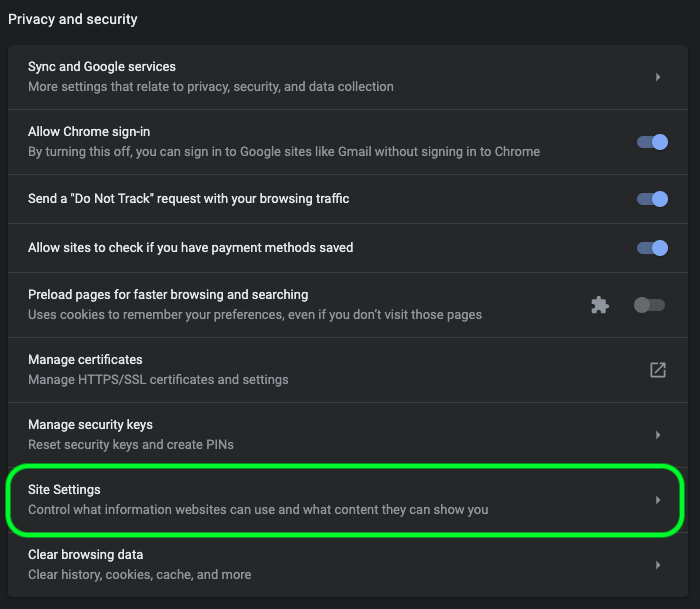

# Handleiding voor het oplossen van problemen in de Data Science Workspace

In dit document worden antwoorden gegeven op veelgestelde vragen over de Adobe Experience Platform Data Science Workspace. Raadpleeg de handleiding voor het oplossen van problemen met de [Adobe Experience Platform API&#39;s in het algemeen voor vragen en het oplossen van problemen met betrekking tot platform-API&#39;s](../landing/troubleshooting.md).

## De JupyterLab-omgeving wordt niet geladen in Google Chrome

>[!IMPORTANT] Dit probleem is opgelost, maar kan nog steeds voorkomen in de Google Chrome 80.x-browser. Controleer of uw Chrome-browser up-to-date is.

Met Google Chrome versie 80.x worden alle cookies van derden standaard geblokkeerd. Met dit beleid kan worden voorkomen dat JupyterLab wordt geladen in Adobe Experience Platform.

Voer de volgende stappen uit om dit probleem op te lossen:

Navigeer in uw Chrome-browser naar de rechterbovenhoek en selecteer **Instellingen** (u kunt ook &quot;chrome://settings/&quot; in de adresbalk kopiëren en plakken). Blader vervolgens naar de onderkant van de pagina en klik op het vervolgkeuzemenu **Geavanceerd** .


De sectie *Privacy en beveiliging* wordt weergegeven. Klik vervolgens op **Site-instellingen** gevolgd door **cookies en sitegegevens**.




Schakel ten slotte &quot;Cookies van derden blokkeren&quot; in op &quot;UIT&quot;.


>[!NOTE] U kunt cookies van derden uitschakelen en [* toevoegen.]ds.adobe.net aan toestaan lijst.

Ga naar &quot;chrome://flags/&quot; op de adresbalk. U kunt de markering *&quot;SameSite by default cookies&quot;* zoeken en uitschakelen in het vervolgkeuzemenu rechts.


Na Stap 2, wordt u ertoe aangezet om uw browser opnieuw te lanceren. Nadat u het programma opnieuw hebt gestart, moet Jupyterlab toegankelijk zijn.

## Waarom heb ik geen toegang tot JupyterLab in Safari?

Safari schakelt cookies van derden standaard uit in Safari &lt; 12. Aangezien de Jupyter-instantie van de virtuele machine zich in een ander domein bevindt dan het bovenliggende frame, vereist Adobe Experience Platform momenteel dat cookies van derden zijn ingeschakeld. Schakel cookies van derden in of schakel over naar een andere browser, zoals Google Chrome.

Voor Safari 12, moet u uw Agent van de Gebruiker op &quot;Chrome&quot;of &quot;Firefox&quot;schakelen. Om uw Agent van de Gebruiker te schakelen, begin door het menu van *Safari* te openen en **Voorkeur** te selecteren. Het voorkeurenvenster wordt weergegeven.


Selecteer **Geavanceerd** in het voorkeurenvenster van Safari. Schakel vervolgens het menu Ontwikkelen *tonen in het vak van de menubalk* in. U kunt het voorkeurenvenster sluiten nadat deze stap is voltooid.


Selecteer vervolgens in de bovenste navigatiebalk het menu **Ontwikkelen** . Houd de muisaanwijzer boven *Gebruikersagent* in het vervolgkeuzemenu *Ontwikkelen*. U kunt de tekenreeks **Chrome** of **Firefox** User Agent selecteren die u wilt gebruiken.


## Waarom zie ik een &#39;403 Verboden&#39; bericht bij het uploaden of verwijderen van een bestand in JupyterLab?

Als uw browser is ingeschakeld met software voor het blokkeren van advertenties, zoals Ghostery of AdBlock Plus, moet het domein &quot;\*.adobe.net&quot; zijn toegestaan in elke software voor het blokkeren van advertenties, zodat JupyterLab normaal kan werken. Dit komt doordat virtuele JupyterLab-machines op een ander domein worden uitgevoerd dan het Experience Platform-domein.

## Waarom zien sommige onderdelen van mijn Jupyter-laptop er gescroleerd uit of worden ze niet weergegeven als code?

Dit kan gebeuren als de cel in kwestie per ongeluk van &quot;Code&quot;in &quot;Markdown&quot;wordt veranderd. Als u op de toetscombinatie **ESC+M** drukt terwijl een codecel de focus heeft, verandert het type cel in Markering. Het type van een cel kan worden gewijzigd door de vervolgkeuzelijst boven aan de laptop voor de geselecteerde cel(len). Als u een celtype in code wilt wijzigen, selecteert u eerst de cel die u wilt wijzigen. Klik vervolgens op het vervolgkeuzemenu dat het huidige type van de cel aangeeft en selecteer &quot;Code&quot;.


## Hoe installeer ik aangepaste Python-bibliotheken?

De Python-kernel wordt vooraf geïnstalleerd met een groot aantal populaire bibliotheken voor machinaal leren. U kunt echter aanvullende aangepaste bibliotheken installeren door de volgende opdracht in een codebel uit te voeren:

```shell
!pip install {LIBRARY_NAME}
```

Voor een volledige lijst van vooraf geïnstalleerde Python bibliotheken, zie de [bijlage sectie van de Gids](./jupyterlab/overview.md#supported-libraries)van de Gebruiker JupyterLab.

## Kan ik aangepaste PySpark-bibliotheken installeren?

Helaas kunt u geen extra bibliotheken voor de PySpark-kernel installeren. U kunt echter contact opnemen met uw Adobe-medewerker van de klantenservice om aangepaste PySpark-bibliotheken voor u te laten installeren.

Voor een lijst van vooraf geïnstalleerde bibliotheken PySpark, zie de [bijlage sectie van de Gids](./jupyterlab/overview.md#supported-libraries)van de Gebruiker JupyterLab.

## Is het mogelijk om de clustermiddelen van de Vonk voor de Vonk JupyterLab of de pySpark kernel te vormen?

U kunt bronnen configureren door het volgende blok toe te voegen aan de eerste cel van uw laptop:

```python
%%configure -f 
{
    "numExecutors": 10,
    "executorMemory": "8G",
    "executorCores":4,
    "driverMemory":"2G",
    "driverCores":2,
    "conf": {
        "spark.cores.max": "40"
    }
}
```

Voor meer informatie over de het middelconfiguratie van de cluster van de Vonk, met inbegrip van de volledige lijst van configureerbare eigenschappen, zie de Gids [van de Gebruiker](./jupyterlab/overview.md#kernels)JupyterLab.