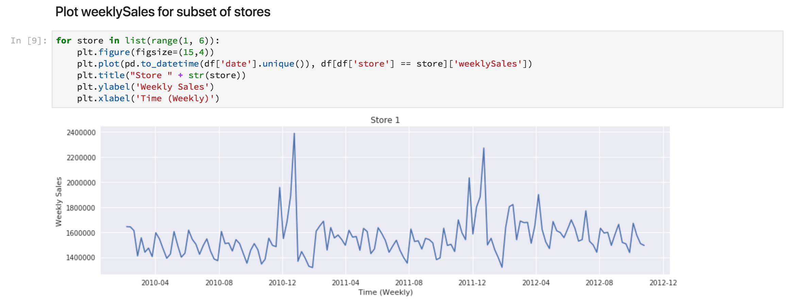
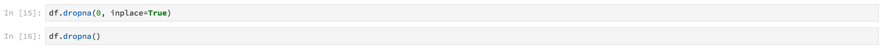

# Analyse van de Data Science Workspace

Dit document biedt een analyse van de Data Science Workspace van het Adobe Experience Platform. We gaan specifiek over de algemene werkstroom die een wetenschapper zou doorlopen om een probleem op te lossen door middel van machinaal leren.

## Vereisten

- Een geregistreerd Adobe-id-account
   - Het Adobe-id-account moet zijn toegevoegd aan een organisatie met toegang tot het Adobe Experience Platform en de Data Science Workspace

## Motivering van de wetenschapper

Een detailhandelaar staat voor vele uitdagingen om concurrerend te blijven op de huidige markt. Een van de belangrijkste punten van zorg van de detailhandelaar is te beslissen over de optimale prijsstelling van zijn producten en de verkooptrends te voorspellen. Met een accuraat voorspellingsmodel zou de detailhandelaar de relatie tussen vraag en prijsbeleid kunnen vinden en geoptimaliseerde prijsbeslissingen kunnen nemen om verkoop en inkomsten te maximaliseren.

## Oplossing van de wetenschapper

De oplossing van een wetenschapper op het gebied van gegevens is het benutten van de rijkdom aan historische gegevens waartoe een detailhandelaar toegang heeft, het voorspellen van toekomstige trends en het optimaliseren van prijsbeslissingen. We gebruiken oude verkoopgegevens om ons model voor machinaal leren op te leiden en het model te gebruiken om toekomstige verkooptrends te voorspellen. Hierdoor zal de detailhandelaar inzichten kunnen hebben om hen te helpen bij het maken van prijswijzigingen.

In dit overzicht gaan we door de stappen die een data wetenschapper zou doorlopen om een dataset te nemen en een model te creëren om wekelijkse verkopen te voorspellen. We zullen de volgende secties doornemen in het voorbeeldnotebook voor detailhandel op de Data Science Workspace van het Adobe Experience Platform:

- [Instellen](#setup)
- [Gegevens verkennen](#exploring-data)
- [Functietechniek](#feature-engineering)
- [Training en verificatie](#training-and-verification)

### Laptops in de werkruimte voor gegevenswetenschap

In de eerste plaats willen we een JupyterLab-laptop maken om de voorbeeldlaptop voor de detailhandel te openen. Als we de stappen volgen die de gegevenswetenschapper in het notebook heeft gezet, kunnen we inzicht krijgen in een typische workflow.

Klik in de gebruikersinterface van het Adobe Experience Platform op het tabblad Data Science in het bovenste menu om naar de Data Science Workspace te gaan. Klik op het tabblad JupyterLab van deze pagina om de JupyterLab-startprogramma te openen. U zou een pagina moeten zien gelijkend op dit.


In onze zelfstudie gebruiken we Python 3 in het Jupyter-notebook om te tonen hoe we de gegevens kunnen openen en verkennen. Op de pagina Launcher staan voorbeelden van laptops. Voor Python 3 gebruiken we het voorbeeldformulier &#39;Winkelverkoop&#39;.


### Instellen

Als de Retail Sales-laptop geopend is, is het eerste wat we doen, het laden van de bibliotheken die nodig zijn voor onze workflow. In de volgende lijst wordt een korte beschrijving gegeven van de doeleinden waarvoor elk wordt gebruikt:
- **numpy** - wetenschappelijke computerbibliotheek die ondersteuning biedt voor grote, multidimensionale arrays en matrixen
- **pandas** - bibliotheek met gegevensstructuren en -bewerkingen die worden gebruikt voor gegevensmanipulatie en -analyse
- **matplotlib.pyplot** - plottbibliotheek die een MATLAB-achtige ervaring bij het plotten verstrekt
- **seaborn** - bibliotheek voor de visualisatie van interfacegegevens op hoog niveau op basis van matplotlib
- **sklearn** - machine het leren bibliotheek die classificatie, regressie, steunvector, en clusteralgoritmen kenmerkt
- **waarschuwingen** - bibliotheek met waarschuwingsberichten

### Gegevens verkennen

#### Gegevens laden

Nadat de bibliotheken zijn geladen, kunnen we de gegevens bekijken. De volgende Python-code gebruikt de `DataFrame` gegevensstructuur van de pandas en de functie [read_csv()](https://pandas.pydata.org/pandas-docs/stable/generated/pandas.read_csv.html#pandas.read_csv) om de CSV te lezen die op Github wordt gehost in het DataFrame van de pandas:


De gegevensstructuur van Pandas&#39; DataFrame is een tweedimensionale gelabelde gegevensstructuur. Om snel de afmetingen van onze gegevens te zien, kunnen we gebruiken `df.shape`. Dit keert een tegel terug die de dimensionaliteit van DataFrame vertegenwoordigt:


Tot slot kunnen we eens bekijken hoe onze gegevens eruit zien. Wij kunnen gebruiken `df.head(n)` om de eerste `n` rijen van DataFrame te bekijken:


#### Statistisch overzicht

We kunnen de pandabibliotheek van Python gebruiken om het gegevenstype van elk kenmerk op te halen. De output van de volgende vraag zal ons informatie over het aantal ingangen en het gegevenstype voor elk van de kolommen geven:

```PYTHON
df.info()
```


Deze informatie is nuttig aangezien het weten van het gegevenstype voor elke kolom ons zal toelaten om te weten hoe te om de gegevens te behandelen.

Laten we nu eens kijken naar de statistische samenvatting. Alleen de numerieke gegevenstypen worden als volgt weergegeven `date`, `storeType`en `isHoliday` worden niet uitgevoerd:

```PYTHON
df.describe()
```


We zien dat er 6435 gevallen zijn voor elk kenmerk. Daarnaast worden statistische informatie zoals gemiddelde, standaardafwijking (std), min, max en interkwartielen gegeven. Dit geeft ons informatie over de afwijking voor de gegevens. In de volgende sectie gaan we over tot visualisatie die samen met deze informatie werkt om ons een volledig inzicht te geven in onze gegevens.

Wanneer u de minimum- en maximumwaarden voor `store`bekijkt, ziet u dat er 45 unieke opslagruimten zijn waarin de gegevens zich bevinden. Er zijn ook `storeTypes` die onderscheid maken tussen wat een winkel is. We kunnen de verdeling van `storeTypes` zien door het volgende te doen:


Dit betekent dat er 22 winkels zijn van `storeType A` , 17 zijn `storeType B`en 6 zijn `storeType C`.

#### Gegevens visualiseren

Nu we onze gegevenskaderwaarden kennen, willen we dit aanvullen met visualisaties om de dingen duidelijker en makkelijker te maken om patronen te identificeren. Deze grafieken zijn ook handig wanneer u resultaten naar een publiek stuurt.

#### Grafieken gelijktrekken

Univariate grafieken zijn percelen van een individuele variabele. Een uniforme grafiek die wordt gebruikt om uw gegevens te visualiseren is box en whiskerpercelen.

Met behulp van onze detailhandelsdataset van voordien, kunnen wij de doos en de whiskerperceel voor elk van 45 winkels en hun wekelijkse verkoop produceren. Het waarnemingspunt wordt geproduceerd gebruikend de `seaborn.boxplot` functie.


Een doos en een whiskerplot worden gebruikt om de verspreiding van gegevens te tonen. De buitenlijnen van het waarnemingspunt tonen de bovenste en onderste kwartiel, terwijl de doos het interkwartielbereik beslaat. De regel in het vak markeert de mediaan. Alle gegevenspunten die meer dan 1,5 keer het bovenste of onderste kwartiel bedragen, worden als een cirkel gemarkeerd. Deze punten worden beschouwd als uitschieters.

Vervolgens kunnen we de wekelijkse verkoop met tijd uitzetten. Wij zullen slechts de output van de eerste opslag tonen. De code in de laptop genereert 6 percelen die overeenkomen met 6 van de 45 winkels in onze dataset.



Met dit diagram kunnen we de wekelijkse verkopen over een periode van twee jaar vergelijken. Het is gemakkelijk om verkooppieken en dalpatronen in tijd te zien.

#### Meerdere grafieken

Meerdere percelen worden gebruikt om de interactie tussen variabelen te zien. Met de visualisatie kunnen wetenschappers van data zien of er correlaties of patronen zijn tussen de variabelen. Een veelgebruikte multivariate grafiek is een correlatiematrix. Met een correlatiematrix worden de afhankelijkheden tussen meerdere variabelen gekwantificeerd aan de hand van de correlatiecoëfficiënt.

Gebruikend de zelfde kleinhandelsdataset, kunnen wij de correlatiematrix produceren.


Let op de diagonaal van de diagonalen in het midden. Dit toont aan dat wanneer het vergelijken van een variabele aan zich, het volledige positieve correlatie heeft. Sterke positieve correlatie zal een grootte dichter bij 1 hebben, terwijl zwakke correlaties dichter bij 0 liggen. Een negatieve correlatie wordt aangetoond met een negatieve coëfficiënt die een omgekeerde trend laat zien.

### Functietechniek

In deze sectie, zullen wij wijzigingen in onze Retaildataset aanbrengen. De volgende bewerkingen worden uitgevoerd:

- kolommen voor week en jaar toevoegen
- storeType omzetten in een indicatorvariabele
- isHoliday omzetten in een numerieke variabele
- wekelijkse verkoop van volgende week voorspellen

#### Week- en jaarkolommen toevoegen

De huidige indeling voor datum (`2010-02-05`) is moeilijk te onderscheiden van de gegevens voor elke week. Daarom zullen we de datum omzetten in de week en het jaar.


Nu zijn de week en de datum als volgt:


#### StoreType omzetten in indicatorvariabele

Daarna, willen wij de storeType kolom in kolommen omzetten die elk vertegenwoordigen `storeType`. Er zijn 3 opslagtypes, (`A`, `B`, `C`), waarvan wij 3 nieuwe kolommen creëren. De waarde die in elke eigenschap wordt ingesteld, is een booleaanse waarde waarbij &#39;1&#39; wordt ingesteld, afhankelijk van wat de waarde `storeType` was en `0` voor de andere twee kolommen.


De huidige `storeType` kolom wordt verwijderd.

#### IsHoliday omzetten in numeriek type

De volgende wijziging bestaat uit het wijzigen van de `isHoliday` booleaanse waarde in een numerieke weergave.


#### wekelijkseVerkoop van volgende week voorspellen

Nu willen wij vorige en toekomstige wekelijkse verkoop aan elk van onze datasets toevoegen. Dat doen we door onze `weeklySales`zaken te compenseren. Bovendien berekenen we het `weeklySales` verschil. Dit gebeurt door af te trekken `weeklySales` van de vorige week `weeklySales`.


Aangezien wij de `weeklySales` gegevens 45 datasets door:sturen en 45 datasets achterwaarts compenseren om nieuwe kolommen tot stand te brengen, zullen de eerste en laatste 45 gegevenspunten waarden NaN hebben. Wij kunnen deze punten uit onze dataset verwijderen door de `df.dropna()` functie te gebruiken die alle rijen verwijdert die waarden NaN hebben.



Een samenvatting van de dataset na onze wijzigingen wordt getoond hieronder:


### Training en verificatie

Nu is het tijd om een aantal modellen van de gegevens te maken en te selecteren welk model de best presterende is voor het voorspellen van toekomstige verkopen. We evalueren de volgende vijf algoritmen:

- Lineaire regressie
- Beslissingsboom
- Willekeurig bos
- Verloop verhogen
- K-buren

#### Gegevensset splitsen naar subsets voor training en tests

We hebben een manier nodig om te weten hoe nauwkeurig ons model waarden kan voorspellen. Deze evaluatie kan worden uitgevoerd door een deel van de gegevensset toe te wijzen aan gebruik als validatie en de rest als trainingsgegevens. Aangezien `weeklySalesAhead` de werkelijke toekomstige waarden van `weeklySales`zijn, kunnen we dit gebruiken om te evalueren hoe nauwkeurig het model de waarde voorspelt. De splitsing vindt hieronder plaats:


We hebben nu `X_train` en `y_train` voor de voorbereiding van de modellen en `X_test` en `y_test` voor de evaluatie later.

#### Spotcontrolealgoritmen

In deze sectie, zullen wij alle algoritmen in een serie genoemd verklaren `model`. Vervolgens doorlopen we deze array en voor elk algoritme voeren we onze trainingsgegevens in waarmee `model.fit()` een model wordt gemaakt `mdl`. Met dit model voorspellen we `weeklySalesAhead` met onze `X_test` gegevens.


Voor de score nemen we het gemiddelde procentuele verschil tussen de voorspelde waarden `weeklySalesAhead` en de werkelijke waarden in de `y_test` gegevens. Aangezien wij het verschil tussen onze voorspelling en daadwerkelijke willen minimaliseren, is de Gradient Boosting Regressor het best presterende model.

#### Voorspellingen visualiseren

Tot slot zullen we ons voorspellingsmodel visualiseren met de werkelijke wekelijkse verkoopwaarden. De blauwe lijn geeft de werkelijke getallen aan, terwijl de groene lijn onze voorspelling weergeeft met Verloop verhogen. De volgende code produceert 6 percelen die 6 van de 45 opslag in onze dataset vertegenwoordigen. Alleen `Store 1` hier wordt weergegeven:


<!--TODO UI Flow> -->

## Conclusie

Met dit overzicht, gingen wij over het werkschema dat een gegevenswetenschapper zou gaan door om een probleem van de detailhandel op te lossen. Specifiek, gingen wij de volgende stappen over om een oplossing te bereiken die toekomstige wekelijkse verkoop voorspelt.

- [Instellen](#setup)
- [Gegevens verkennen](#exploring-data)
- [Functietechniek](#feature-engineering)
- [Training en verificatie](#training-and-verification)