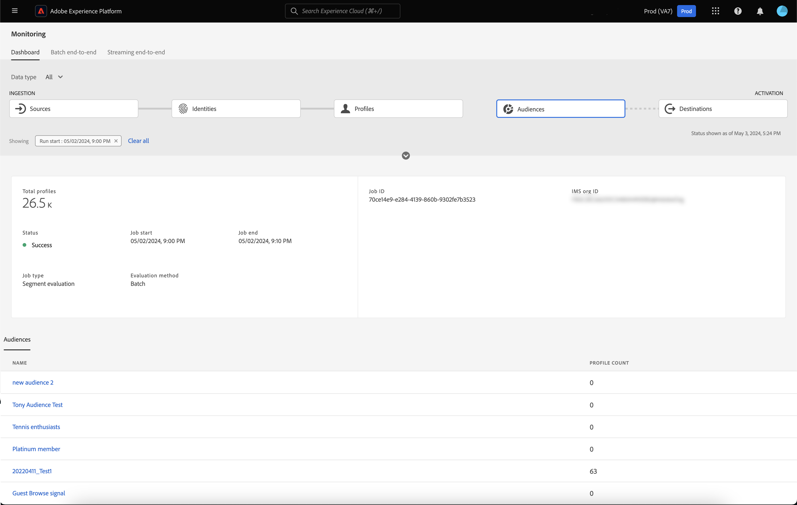

# Dataflows for publiek in UI controleren

De Dienst van de segmentatie staat u toe om publiek door segmentdefinities of andere bronnen van uw te creëren [!DNL Real-Time Customer Profile] gegevens. Het platform verstrekt gegevensstromen om deze stroom van gegevens van bronnen aan bestemmingen doorzichtig te volgen.

Gebruik het controledashboard om een visuele vertegenwoordiging van de activiteit van de gegevens binnen een publiek, met inbegrip van de status van de segmentatie van uw gegevens te zien. Lees de zelfstudie voor instructies over hoe u het monitordashboard kunt gebruiken om de segmentatie van uw gegevens te controleren gebruikend het gebruikersinterface van het Experience Platform, die u toestaat om de status van publieksactivering, evaluatie, en de uitvoerbanen te volgen.

## Aan de slag {#getting-started}

Deze handleiding vereist een goed begrip van de volgende onderdelen van Adobe Experience Platform:

- [Gegevensstromen](../home.md): Gegevensstromen zijn een weergave van gegevenstaken die gegevens verplaatsen over het hele platform. Dataflows worden gevormd over verschillende diensten, die gegevens van bronschakelaars aan doeldatasets helpen bewegen, aan [!DNL Identity] en [!DNL Profile], en [!DNL Destinations].
   - [Dataflow-uitvoering](../../sources/notifications.md): De looppas van Dataflow is de terugkomende geplande banen die op de frequentieconfiguratie van geselecteerde dataflows worden gebaseerd.
- [Segmentering](../../segmentation/home.md): De segmentatie staat u toe om publiek van uw gegevens van het Profiel van de Klant in real time tot stand te brengen.
   - [Activeringstaken](../../destinations/ui/activation-overview.md): Een activeringstaak wordt gebruikt om uw publiek te activeren naar een opgegeven doel.
   - [Evaluatiebanen](../../segmentation/tutorials/evaluate-a-segment.md#evaluate-a-segment): Een evaluatietaak is een asynchroon proces dat het publiek evalueert.
   - [Exporttaken](../../segmentation/api/export-jobs.md): Een exporttaak is een asynchroon proces dat wordt gebruikt om de publieksleden aan datasets voort te zetten.
- [Sandboxen](../../sandboxes/home.md): [!DNL Experience Platform] biedt virtuele sandboxen die één enkele partitie maken [!DNL Platform] in afzonderlijke virtuele omgevingen om toepassingen voor digitale ervaringen te ontwikkelen en te ontwikkelen.

## Het dashboard voor publiek controleren {#monitoring-audiences-dashboard}

>[!CONTEXTUALHELP]
>id="platform_monitoring_segments"
>title="Doelgroepen"
>abstract="De weergave Soorten publiek bevat informatie over het publiek van uw organisatie, met meer informatie over de activerings- en evaluatietaken van uw organisatie."

Als u toegang wilt krijgen tot **[!UICONTROL Audiences]** dashboard, selecteren **[!UICONTROL Monitoring]** in de linkernavigatie. Eén keer op de knop **[!UICONTROL Monitoring]** pagina, selecteert u de **[!UICONTROL Audiences]** kaart.

Over de hoofdlijnen **[!UICONTROL Audiences]** dashboard, het **[!UICONTROL Audiences]** op de kaart staan de status en de datum van de laatste evaluatietaak en de laatste exporttaak.

Het dashboard zelf bevat meetgegevens voor zowel publiek- als segmentatietaken. Standaard ziet u op het dashboard de meetgegevens voor het publiek voor de laatste 24 uur. Voor meer informatie over de weergave segmentatietaken leest u de [segmentatietaken controleren](#monitoring-segmentation-jobs-dashboard) sectie.

>[!IMPORTANT]
>
>Momenteel worden alleen publiek geactiveerd waarop [batchbestemmingen (op basis van bestanden)](../../destinations/destination-types.md#file-based) worden ondersteund voor het dashboard voor het controlepubliek.

De volgende metriek is beschikbaar voor deze dashboardmening:

| Metrisch | Beschrijving |
| ------ | ----------- |
| **[!UICONTROL Audience name]** | De naam van het publiek. |
| **[!UICONTROL Data type]** | Het gegevenstype van het publiek. Mogelijke waarden zijn **[!UICONTROL Customer]**, **[!UICONTROL Account]**, en **[!UICONTROL Prospect]**. U kunt voor publiek van een gespecificeerd gegevenstype bekijken door te gebruiken [!UICONTROL Data type] filter boven het lint van kaarten. |
| **[!UICONTROL Last evaluation timestamp]** | De datum en tijd waarop de laatste evaluatietaak van het publiek werd uitgevoerd. |
| **[!UICONTROL Last evaluation status]** | De status van de laatste evaluatietaak van het publiek. Mogelijke waarden zijn **[!UICONTROL Success]**, **[!UICONTROL No runs]**, en **[!UICONTROL Failed]**. |
| **[!UICONTROL Last evaluation method]** | De evaluatiemethode van het publiek. Omdat alleen batchsegmentatie wordt ondersteund, is de enige mogelijke waarde: **[!UICONTROL Batch]**. |
| **[!UICONTROL Last evaluation profiles]** | Het aantal profielen dat is geëvalueerd in de laatste evaluatietaak van het publiek. |
| **[!UICONTROL Last activation timestamp]** | De datum en tijd waarop de laatste activeringstaak van het publiek werd uitgevoerd. |
| **[!UICONTROL Last activation status]** | De status van de laatste activeringstaak van het publiek. Mogelijke waarden zijn **[!UICONTROL Success]**, **[!UICONTROL No runs]**, en **[!UICONTROL Failed]**. |
| **[!UICONTROL Last activation identities]** | Het aantal identiteiten dat is geactiveerd in de laatste activeringstaak van het publiek. |
| **[!UICONTROL Last activation destination]** | De naam van de bestemming waarop de laatste activeringstaak van het publiek is geactiveerd. |

U kunt de resultaten naar een specifiek publiek filteren en de segmentatietaken ervan weergeven door het filterpictogram te selecteren (). De segmentatietaken worden gesorteerd in chronologische volgorde, waarbij de meest recente segmentatietaken bovenaan worden weergegeven.

Het gefilterde publieksdashboard verschijnt. De **[!UICONTROL Audiences]** op de kaart staan de status en de datum van de laatste evaluatietaak en de laatste activeringstaak.

Het dashboard zelf toont de tijd en de status van de laatste evaluatie en activeringstaken, een grafiek die de profieltelling van de publieksevaluatie, en metriek voor de segmentatietaken toont die werden in werking gesteld. Standaard worden op het dashboard de gegevens van de segmentatietaak voor de laatste 24 uur weergegeven.

De volgende metriek is beschikbaar voor deze dashboardmening:

| Metrisch | Beschrijving |
| ------ | ----------- |
| **[!UICONTROL Job start]** | De datum en tijd waarop de segmentatietaak is gestart. |
| **[!UICONTROL Type]** | Geeft het type segmentatietaak aan. De twee ondersteunde taaktypen zijn **activering** en **evaluatie** banen. |
| **[!UICONTROL Job complete]** | De datum en tijd waarop de segmentatietaak is voltooid. |
| **[!UICONTROL Processing time]** | De hoeveelheid tijd die nodig was om de segmentatietaak te voltooien. |
| **[!UICONTROL Job status]** | De status van de segmentatietaak. Tot de ondersteunde waarden behoren **[!UICONTROL Success]**, **[!UICONTROL In Progress]**, en **[!UICONTROL Failed]**. |
| **[!UICONTROL Profile count]** | Het aantal profielen dat de segmentatietaak evalueert. Elke gebruiker moet een uniek profiel hebben. |
| **[!UICONTROL Identity activated]** | Het aantal identiteiten dat de segmentatietaak activeert. Elk profiel kan meerdere identiteiten hebben. Een profiel kan bijvoorbeeld een e-mail, telefoonnummer en een loyaliteitsnummer als identiteiten hebben. |
| **[!UICONTROL Destination name]** | De naam van het doel waarop de segmentatietaak wordt geactiveerd. |

U kunt verder filteren naar een specifieke segmentatietaak en de details bekijken door het filterpictogram te selecteren (). Er zijn twee verschillende soorten segmentatietaken die gefilterd kunnen worden: activeringsbanen en evaluatietaken.

### Gegevens activeringstaak {#activation-job-details}

De pagina met gegevens over de uitvoering van de activeringstaak bevat informatie over de metriek van de uitvoering, fouten bij uitvoering van de gegevensstroom en soorten publiek die betrekking hebben op de segmentatietaak. Een activeringstaak wordt gebruikt om uw publiek voor een gespecificeerde bestemming te activeren.

De volgende metriek is beschikbaar voor deze dashboardmening:

| Metrisch | Beschrijving |
| ------ | ----------- |
| **[!UICONTROL Profiles received]** | Het totale aantal profielen dat is ontvangen in de activeringsstroom. |
| **[!UICONTROL Identities activated]** | Het totale aantal identiteiten dat met succes aan de bestemming werd geactiveerd, die op de ontvangen profielen wordt gebaseerd. |
| **[!UICONTROL Identities excluded]** | Het totale aantal identiteiten dat op basis van de ontvangen profielen is uitgesloten van activering naar de bestemming. Deze identiteiten kunnen worden uitgesloten vanwege ontbrekende kenmerken of schendingen van de toestemming. |
| **[!UICONTROL Size of data]** | De grootte van de gegevensstroom die wordt geactiveerd. |
| **[!UICONTROL Total files]** | Het totale aantal bestanden dat in de gegevensstroom wordt geactiveerd. |
| **[!UICONTROL Status]** | De huidige status van de activeringstaak. |
| **[!UICONTROL Dataflow run start]** | De datum en tijd waarop de activeringstaak is gestart. |
| **[!UICONTROL Dataflow run end]** | De datum en tijd waarop de activeringstaak is beëindigd. |
| **[!UICONTROL Dataflow run ID]** | De id van de huidige activeringstaak. |
| **[!UICONTROL IMS org ID]** | De id van de organisatie waartoe de activeringstaak behoort. |
| **[!UICONTROL Destination name]** | De naam van het doel waarop de gegevens worden geactiveerd. |

Onder de sectie Soorten publiek ziet u een lijst met soorten publiek die zijn geactiveerd als onderdeel van de activeringstaak.

Voor de sectie publiek zijn de volgende meetgegevens beschikbaar:

| Metrisch | Beschrijving |
| ------ | ----------- |
| **[!UICONTROL Name]** | De naam van het publiek dat is geactiveerd. |
| **[!UICONTROL Identities activated]** | Het totale aantal identiteiten dat met succes aan de bestemming werd geactiveerd, die op de ontvangen profielen wordt gebaseerd. |
| **[!UICONTROL Identities excluded]** | Het totale aantal identiteiten dat op basis van de ontvangen profielen is uitgesloten van activering naar de bestemming. Deze identiteiten kunnen worden uitgesloten vanwege ontbrekende kenmerken of schending van de toestemming. |
| **[!UICONTROL Last dataflow run status]** | De status van de laatste activeringstaak die voor dat publiek werd uitgevoerd. |
| **[!UICONTROL Last dataflow run date]** | De datum en het tijdstip van de laatste activeringstaak die voor dat publiek werd uitgevoerd. |

Bovendien kunt u details over de dataflow looppas fouten bekijken. In de sectie met uitvoerfouten voor gegevensstroom kunt u zowel de mislukte identiteiten als de uitgesloten identiteiten weergeven. De sectie Fouten bevat details over de foutcode en het aantal mislukte of uitgesloten identiteiten.

### Gegevens van evaluatietaken {#evaluation-job-details}

De dataflow van de evaluatietaak looppas detailpagina toont informatie over de metriek en het publiek van de looppas die met de segmentatietaak verwant zijn.

De volgende metriek is beschikbaar voor deze dashboardmening:

| Metrisch | Beschrijving |
| ------ | ----------- |
| **[!UICONTROL Total profiles]** | Het totale aantal profielen dat wordt geëvalueerd. |
| **[!UICONTROL Status]** | De status van de evaluatietaak. Mogelijke statussen voor de evaluatietaak omvatten **[!UICONTROL Success]** en **[!UICONTROL Failed]**. |
| **[!UICONTROL Job start]** | De datum en het tijdstip waarop de evaluatietaak is begonnen. |
| **[!UICONTROL Job end]** | De datum en het tijdstip waarop de evaluatietaak is beëindigd. |
| **[!UICONTROL Job type]** | Het type segmentatietaak. In dit geval zal het altijd een **[!UICONTROL Segment evaluation]** taak. |
| **[!UICONTROL Evaluation type]** | Het soort evaluatie dat wordt uitgevoerd. Dit kan **[!UICONTROL Batch]** of **[!UICONTROL Streaming]**. |
| **[!UICONTROL Job ID]** | De id van de evaluatietaak. |
| **[!UICONTROL IMS org ID]** | De id van de organisatie waartoe de evaluatietaak behoort. |
| **[!UICONTROL Audience name]** | De naam van het publiek dat wordt geëvalueerd. |
| **[!UICONTROL Audience ID]** | De id van het publiek dat wordt geëvalueerd. |

Onder de [!UICONTROL Audiences] in de sectie kunt u een lijst met doelgroepen zien die als onderdeel van de evaluatietaak worden geëvalueerd. U kunt de lijst met soorten publiek filteren op naam met de zoekbalk.

>[!IMPORTANT]
>
>Deze dashboardweergave biedt momenteel ondersteuning voor maximaal 800 publieksmetingen.

Voor de [!UICONTROL Audiences] zijn de volgende meetwaarden beschikbaar:

| Metrisch | Beschrijving |
| ------ | ----------- |
| **[!UICONTROL Name]** | De naam van het publiek dat wordt geëvalueerd. |
| **[!UICONTROL Profile count]** | Het aantal profielen dat wordt geëvalueerd. |

## Dashboard voor segmentatietaken controleren {#monitoring-segmentation-jobs-dashboard}

>[!CONTEXTUALHELP]
>id="platform_monitoring_segment_jobs"
>title="Segmentatietaken"
>abstract="De weergave voor segmentatietaken bevat informatie over de evaluatie- en exporttaken voor al uw doelgroepen."

Als u toegang wilt krijgen tot **[!UICONTROL Segmentation Jobs]** dashboard, selecteren **[!UICONTROL Segmentation jobs]** in de [!UICONTROL Audiences] dashboard. De [!UICONTROL Monitoring] het dashboard bevat meetgegevens en informatie over de evaluatie - en exporttaken .

>[!NOTE]
>
>Alleen **segmenteringsevaluatietaken** worden ondersteund voor monitoring per publiek. De de uitvoerbanen van de segmentatie steunen slechts organisatie-vlakke controle.

Gebruik de [!UICONTROL Segmentation Jobs] dashboard om te begrijpen als de profielevaluatie en de uitvoer op tijd en zonder enige uitzonderingen voorkomen, zodat kunnen de stroomafwaartse diensten voor bestemmingsactivering de recentste geëvalueerde profielgegevens hebben.

De volgende metriek is beschikbaar voor segmentatietaken:

| Metrisch | Beschrijving |
| ------ | ----------- |
| **[!UICONTROL Segmentation job]** | Geeft de naam van de segmentatietaak aan. |
| **[!UICONTROL Type]** | Geeft het type segmentatietaak aan: exporteren of evalueren. Merk op dat in beide gevallen de segmentatietaak evalueert of exporteert **alles** publiek dat tot een organisatie behoort. Voor meer informatie over exporttaken leest u de handleiding op de [eindpunt exporttaken](../../segmentation/api/export-jobs.md). Lees de zelfstudie voor meer informatie over evaluatietaken op [evalueren van een segmentdefinitie](../../segmentation/tutorials/evaluate-a-segment.md#evaluate-a-segment). |
| **[!UICONTROL Job start]** | De datum en tijd waarop de segmentatietaak is gestart. |
| **[!UICONTROL Job end]** | De datum en tijd waarop de segmentatietaak is voltooid. |
| **[!UICONTROL Status]** | De status van de voltooide taak. Mogelijke statussen voor de segmentatietaak zijn geslaagd of mislukt. |
