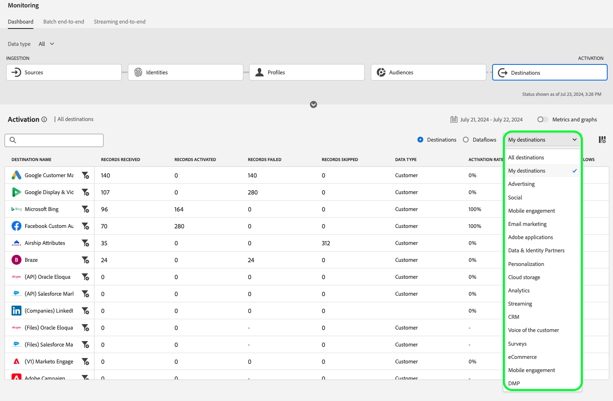

# Dataflows voor doelen in de UI controleren

Gebruik de verschillende doelen in de Experience Platform-catalogus om uw gegevens vanuit Experience Platform te activeren voor talloze externe partners. Experience Platform maakt het proces om de stroom van gegevens aan uw bestemmingen gemakkelijker te volgen door transparantie van gegevensstromen te verstrekken.

Het controledashboard voorziet u van een visuele vertegenwoordiging van de reis van een dataflow, met inbegrip van de bestemming die de gegevens worden geactiveerd aan, het type gegevens dat u bekijkt, uitgevoerde gegevens per dataflow looppas, en veel meer.

Dit leerprogramma verstrekt instructies op hoe u of dataflows direct in de bestemmingswerkruimte kunt controleren of het controledashboard gebruiken om dataflows voor uw bestemmingen te controleren gebruikend het gebruikersinterface van Experience Platform.

## Aan de slag {#getting-started}

Deze handleiding vereist een goed begrip van de volgende onderdelen van Adobe Experience Platform:

- [&#x200B; Dataflows &#x200B;](../home.md): Dataflows zijn een vertegenwoordiging van gegevensbanen die gegevens over Experience Platform bewegen. Dataflows worden geconfigureerd op verschillende services, waardoor gegevens van bronconnectors naar doelgegevenssets worden verplaatst, naar [!DNL Identity] en [!DNL Profile] en naar [!DNL Destinations] .
   - [&#x200B; looppas Dataflow &#x200B;](../../sources/notifications.md): De looppas van Dataflow is de terugkomende geplande banen die op de frequentieconfiguratie van geselecteerde dataflows worden gebaseerd.
- [&#x200B; Doelen &#x200B;](../../destinations/home.md): De bestemmingen zijn pre-gebouwde integratie met algemeen gebruikte toepassingen die voor de naadloze activering van gegevens van Experience Platform voor kanaalmarketing campagnes, e-mailcampagnes, gerichte reclame, en vele andere gebruiksgevallen toestaan.
- [&#x200B; Sandboxen &#x200B;](../../sandboxes/home.md): [!DNL Experience Platform] verstrekt virtuele zandbakken die één enkele [!DNL Experience Platform] instantie in afzonderlijke virtuele milieu&#39;s verdelen helpen digitale ervaringstoepassingen ontwikkelen en ontwikkelen.

## Gegevens controleren in de werkruimte Doelen {#monitor-dataflows-in-the-destinations-workspace}

Navigeer in de **[!UICONTROL Destinations]** -werkruimte in de gebruikersinterface van Experience Platform naar het tabblad **[!UICONTROL Browse]** en selecteer de naam van een doel dat u wilt weergeven.

Er wordt een lijst met bestaande gegevensstromen weergegeven. Op deze pagina vindt u een lijst met zichtbare gegevensstromen, waaronder informatie over het doel, de gebruikersnaam, het aantal gegevensstromen en de status.

Zie de volgende tabel voor meer informatie over statussen:

| Status | Beschrijving |
| ------ | ----------- |
| Ingeschakeld | De status `Enabled` geeft aan dat een gegevensstroom actief is en gegevens exporteert volgens het schema dat is opgegeven. |
| Uitgeschakeld | De status `Disabled` geeft aan dat een gegevensstroom inactief is en geen gegevens exporteert. |
| Verwerking | De status `Processing` geeft aan dat een gegevensstroom nog niet actief is. Deze status wordt vaak direct na het maken van een nieuwe gegevensstroom aangetroffen. |
| Fout | De `Error` -status geeft aan dat het activeringsproces van een gegevensstroom is onderbroken. |

### Dataflow wordt uitgevoerd voor streamingdoelen {#dataflow-runs-for-streaming-destinations}

>[!CONTEXTUALHELP]
>id="platform_monitoring_dataflow_run_details_activation_streaming"
>title="Gegevens gegevensstroom uitvoeren"
>abstract="De gegevens van de bestemmingdataflow looppas bevatten informatie over de activeringsstatus van een publiek en metriek die van het Profiel van de Klant in real time wordt genomen om unieke identiteiten te produceren. Raadpleeg de handleiding voor metrische definities voor meer informatie."

>[!CONTEXTUALHELP]
>id="platform_monitoring_profiles_received_streaming"
>title="Ontvangen profielen"
>abstract="Het totale aantal profielen dat is ontvangen in de gegevensstroom. Deze waarde wordt elke 60 minuten bijgewerkt."

>[!CONTEXTUALHELP]
>id="platform_destinations_dataflow_identitiesactivated_streaming"
>title="Geactiveerde identiteiten"
>abstract="Het aantal afzonderlijke profiel-id&#39;s dat is geactiveerd voor het geselecteerde doel. Deze metrische waarde bevat identiteiten die zijn gemaakt, bijgewerkt en verwijderd uit geëxporteerde doelgroepen."

>[!CONTEXTUALHELP]
>id="platform_destinations_dataflow_identitiesexcluded_streaming"
>title="Uitgesloten identiteiten"
>abstract="Het aantal afzonderlijke profielrecords dat is uitgesloten van activering voor de geselecteerde bestemming op basis van ontbrekende kenmerken en schending van de toestemming."

>[!CONTEXTUALHELP]
>id="platform_destinations_dataflow_identitiesfailed_streaming"
>title="Identiteiten mislukt"
>abstract="Het aantal individuele profielidentiteiten die voor de geselecteerde bestemming ontbraken. Controleer de foutdiagnostiek voor meer informatie."

Voor streamingdoelen biedt het tabblad [!UICONTROL Dataflow runs] een update per uur voor metrische gegevens over uw dataflow-runtime. De meest prominente statistieken met het label zijn voor identiteiten.

De identiteiten vertegenwoordigen de verschillende facetten van een profiel. Als een profiel bijvoorbeeld zowel een telefoonnummer als een e-mailadres bevat, heeft dat profiel twee identiteiten.

Er wordt een lijst met afzonderlijke reeksen en de bijbehorende maatstaven weergegeven, samen met de volgende totalen voor identiteiten:

- **[!UICONTROL Identities activated]**: Het totale aantal profielidentiteiten dat is geactiveerd voor het geselecteerde doel. Deze metrische waarde bevat identiteiten die zijn gemaakt, bijgewerkt en verwijderd uit geëxporteerde doelgroepen.
- **[!UICONTROL Identities excluded]**: Het totale aantal profiel-id&#39;s dat voor activering wordt overgeslagen op basis van ontbrekende kenmerken en schending van de toestemming.
- **[!UICONTROL Identities failed]**: Het totale aantal profielidentiteiten dat niet aan de bestemming wegens fouten wordt geactiveerd.

>[!NOTE]
>
>De totalen voor geactiveerde, uitgesloten en mislukte identiteiten vertegenwoordigen een som van alle individuele dataflow-run tellingen. Aangezien dataflow-run een time-to-live (TTL) van 90 dagen heeft, bestrijken deze totalen doorgaans ongeveer de laatste 3 maanden. Aangezien de oudere dataflow looppas verlopen en uit het systeem worden verwijderd, kunt u een daling in de totale getoonde aantallen waarnemen.

Elke individuele dataflow run toont de volgende details:

- **[!UICONTROL Dataflow run start]**: De tijd waarop de gegevensstroom is gestart. Voor het stromen dataflow looppas, legt Experience Platform metriek op het begin van dataflow looppas, in de vorm van uurmetriek vast. Dit betekent dat voor het stromen dataflow looppas, als een dataflow looppas bijvoorbeeld bij 10 :30PM begon, metrisch toont de begintijd zoals 10 :00 PM in UI.
- **[!UICONTROL Audience]**: Het aantal soorten publiek dat aan elke dataflow-run is gekoppeld.
- **[!UICONTROL Processing duration]**: De hoeveelheid tijd die nodig was voor het uitvoeren van de gegevensstroom om te verwerken.
   - Bij **[!UICONTROL completed]** -uitvoering wordt bij de verwerkingstijd altijd een uur gemeten.
   - Voor dataflow-run die nog steeds de status **[!UICONTROL processing]** heeft, blijft het venster om alle metriek vast te leggen langer dan een uur open om alle metriek te verwerken die overeenkomen met de dataflow-run. Bijvoorbeeld, zou een dataflow looppas die bij 9 :30 AM begon in een verwerkingsstaat één uur en dertig minuten kunnen blijven om alle metriek te vangen en te verwerken. De duur van de verwerkingstijd wordt rechtstreeks beïnvloed door de pogingen die als resultaat van de ontbroken reactie van de bestemming worden gedaan. Dan, zodra het verwerkingsvenster sluit en het statuut van de dataflow looppas updates aan **voltooide**, wordt de getoonde verwerkingstijd veranderd in één uur.
- **[!UICONTROL Profiles received]**: Het totale aantal profielen dat is ontvangen in de gegevensstroom.
- **[!UICONTROL Identities activated]**: Het totale aantal profielidentiteiten dat met succes aan de geselecteerde bestemming als deel van de dataflow looppas werd geactiveerd. Deze metrische waarde bevat identiteiten die zijn gemaakt, bijgewerkt en verwijderd uit geëxporteerde doelgroepen.
- **[!UICONTROL Identities excluded]**: Het totale aantal profiel-id&#39;s dat van activering is uitgesloten op basis van ontbrekende kenmerken en schending van toestemming.
- **[!UICONTROL Identities failed]** Het totale aantal profielidentiteiten dat niet aan de bestemming wegens fouten wordt geactiveerd.

  >[!IMPORTANT]
  >
  > Vanaf maart 2025 brengt Adobe een update uit om de rapportagenauwkeurigheid voor streamingbestemmingen te verbeteren. Deze verbetering zorgt voor een betere afstemming tussen de rapportage in Experience Platform en de doelplatforms.
  >
  > Vóór deze update heeft **[!UICONTROL Identities failed]** alle activeringspogingen opgenomen. Na deze update wordt alleen de laatste activeringspoging opgenomen in het totale aantal.
  > 
  > Deze verbetering is van toepassing op alle streamingdoelen.
  > Na deze verbetering, kunnen de gebruikers van het stromen bestemmingen een verwachte daling in hun **[!UICONTROL Identities failed]** aantal zien.

- **[!UICONTROL Activation rate]**: Het percentage ontvangen identiteiten dat is geactiveerd. De volgende formule laat zien hoe deze waarde wordt berekend:
  
- **[!UICONTROL Status]**: geeft de status aan waarin de gegevensstroom zich bevindt: [!UICONTROL Completed] of [!UICONTROL Processing] . [!UICONTROL Completed] betekent dat alle identiteiten voor de overeenkomstige dataflow-run binnen de periode van één uur zijn geëxporteerd. [!UICONTROL Processing] betekent dat de uitvoering van de gegevensstroom nog niet is voltooid.

Om de details van een bepaalde dataflow looppas te bekijken, selecteer de begintijd van de looppas van de lijst.

De detailpagina voor een dataflow-run bevat aanvullende informatie zoals het aantal ontvangen profielen, het aantal geactiveerde identiteiten, het aantal mislukte identiteiten en het aantal uitgesloten identiteiten.

Op de detailpagina wordt ook een lijst met mislukte identiteiten en identiteiten weergegeven die zijn uitgesloten. De informatie voor zowel de mislukte als uitgesloten identiteiten wordt getoond, met inbegrip van de foutencode, het aantal van de identiteit, en beschrijving. Standaard worden in de lijst de mislukte identiteiten weergegeven. Selecteer de schakeloptie **[!UICONTROL Identities excluded]** om overgeslagen identiteiten weer te geven.

#### Publiek-niveau dataflow run controle voor het stromen bestemmingen {#audience-level-dataflow-runs-for-streaming-destinations}

U kunt informatie bekijken over de geactiveerde, uitgesloten of mislukte identiteiten uitgesplitst op publieksniveau, voor elk publiek dat deel van dataflow uitmaakt.

De publiek-vlakke controle voor het stromen bestemmingen is slechts beschikbaar voor bepaalde bestemmingen. Zie de [&#x200B; sectie van het 0&rbrace; publieksniveau voor een lijst van gesteunde bestemmingen.](#audience-level-view)

>[!NOTE]
>
>Het **[!UICONTROL Profiles received]** -getal op het tabblad **[!UICONTROL Audiences]** komt mogelijk niet altijd overeen met het aantal profielen dat is ontvangen voor de uitvoering van de gegevensstroom. Dit komt omdat een bepaald profiel deel van meer dan één publiek zou kunnen uitmaken dat in de dataflow looppas wordt geactiveerd.

### Dataflow wordt uitgevoerd voor batchdoelen {#dataflow-runs-for-batch-destinations}

>[!CONTEXTUALHELP]
>id="platform_monitoring_dataflow_run_details_activation"
>title="Gegevens gegevensstroom uitvoeren"
>abstract="De gegevens van de bestemmingdataflow looppas bevatten informatie over de activeringsstatus van een publiek en metriek die van het Profiel van de Klant in real time wordt genomen om unieke identiteiten te produceren. Raadpleeg de handleiding voor metrische definities voor meer informatie."
>additional-url="https://experienceleague.adobe.com/docs/experience-platform/dataflows/ui/monitor-destinations.html#dataflow-runs-for-streaming-destinations" text="Dataflow wordt uitgevoerd voor streamingdoelen"

>[!CONTEXTUALHELP]
>id="platform_monitoring_profiles_received_batch"
>title="Ontvangen profielen"
>abstract="Het totale aantal profielen dat is ontvangen in de gegevensstroom. Deze waarde wordt elke 60 minuten bijgewerkt."

>[!CONTEXTUALHELP]
>id="platform_destinations_dataflow_identitiesactivated_batch"
>title="Geactiveerde identiteiten"
>abstract="Het aantal afzonderlijke profiel-id&#39;s dat is geactiveerd voor het geselecteerde doel. Deze metrische waarde bevat identiteiten die zijn gemaakt, bijgewerkt en verwijderd uit geëxporteerde doelgroepen."

>[!CONTEXTUALHELP]
>id="platform_destinations_dataflow_identitiesexcluded_batch"
>title="Uitgesloten identiteiten"
>abstract="Het aantal afzonderlijke profielrecords dat is uitgesloten van activering voor de geselecteerde bestemming op basis van ontbrekende kenmerken en schending van de toestemming."

Voor batchbestemmingen biedt het tabblad [!UICONTROL Dataflow runs] metrische gegevens over uw dataflow-runtime. Er wordt een lijst met afzonderlijke reeksen en de bijbehorende maatstaven weergegeven, samen met de volgende totalen voor identiteiten:

- **[!UICONTROL Identities activated]**: Het totale aantal profielidentiteiten dat is geactiveerd voor het geselecteerde doel. Deze metrische waarde bevat identiteiten die zijn gemaakt, bijgewerkt en verwijderd uit geëxporteerde doelgroepen.
- **[!UICONTROL Identities excluded]**: Het aantal individuele profiel-id&#39;s dat is uitgesloten van activering voor de geselecteerde bestemming, op basis van ontbrekende kenmerken en schending van toestemming.

Elke individuele dataflow run toont de volgende details:

- **[!UICONTROL Dataflow run start]**: De tijd waarop de gegevensstroom is gestart.
- **[!UICONTROL Audience]**: De naam van het publiek dat aan elke dataflow-run is gekoppeld.
- **[!UICONTROL Processing duration]**: De hoeveelheid tijd die nodig was om de dataflow uit te voeren om te worden verwerkt.
- **[!UICONTROL Profiles received]**: Het totale aantal profielen dat is ontvangen in de gegevensstroom. Deze waarde wordt elke 60 minuten bijgewerkt.
- **[!UICONTROL Identities activated]**: Het totale aantal profielidentiteiten dat met succes aan de geselecteerde bestemming als deel van de dataflow looppas werd geactiveerd. Deze metrische waarde bevat identiteiten die zijn gemaakt, bijgewerkt en verwijderd uit geëxporteerde doelgroepen.
- **[!UICONTROL Identities excluded]**: Het totale aantal profiel-id&#39;s dat van activering is uitgesloten op basis van ontbrekende kenmerken en schending van toestemming.
- **[!UICONTROL Status]**: geeft de status aan waarin de gegevensstroom zich bevindt. Dit kan een van de volgende drie statussen hebben: [!UICONTROL Success], [!UICONTROL Failed] en [!UICONTROL Processing] . [!UICONTROL Success] betekent dat de gegevensstroom actief is en gegevens exporteert volgens het opgegeven schema. [!UICONTROL Failed] betekent dat de activering van gegevens is opgeschort als gevolg van fouten. [!UICONTROL Processing] betekent dat de gegevensstroom nog niet actief is en over het algemeen wordt ontmoet wanneer een nieuwe gegevensstroom wordt gecreeerd.

Om details van een specifieke dataflow looppas te bekijken, selecteer de begintijd van de looppas van de lijst.

>[!NOTE]
>
>De looppas van Dataflow wordt geproduceerd gebaseerd op de planningsfrequentie van bestemmingsdataflow. Een afzonderlijke dataflow looppas wordt gemaakt voor elk [&#x200B; samenvoegbeleid &#x200B;](../../profile/merge-policies/overview.md) toegepast op een publiek.

De detailspagina voor een dataflow, naast de details die op de dataflows lijst worden getoond, toont specifiekere informatie over dataflow:

- **[!UICONTROL Size of data]**: De grootte van de gegevensstroom die wordt geëxporteerd.
- **[!UICONTROL Total files]**: Het totale aantal bestanden dat in de gegevensstroom is geëxporteerd.
- **[!UICONTROL Last updated]**: De tijd waarop de dataflow-uitvoering voor het laatst is bijgewerkt.

Op de detailpagina wordt ook een lijst met mislukte identiteiten en identiteiten weergegeven die zijn uitgesloten. Er wordt informatie voor zowel de mislukte als de uitgesloten identiteiten weergegeven, inclusief de foutcode en beschrijving. Standaard worden in de lijst de mislukte identiteiten weergegeven. Selecteer de schakeloptie **[!UICONTROL Identities excluded]** om uitgesloten identiteiten weer te geven.

### Weergeven in controle {#view-in-monitoring}

U kunt ook selecteren om rijke informatie over een bepaalde gegevensstroom en zijn dataflow looppas in het controledashboard te bekijken. Informatie over een gegevensstroom weergeven in het dashboard voor bewaking:

1. Ga naar **[!UICONTROL Connections]** > **[!UICONTROL Destinations]** > tabblad **[!UICONTROL Browse]**
2. Navigeer naar de gegevensstroom die u wilt inspecteren.
3. Selecteer het ellipssymbool en  **[!UICONTROL View in monitoring]**.

>[!SUCCESS]
>
>U kunt nu informatie over de gegevensstroom en zijn bijbehorende dataflow looppas in het controledashboard bekijken. Lees de paragraaf hieronder voor meer informatie.

## Het dashboard Bestemmingen controleren {#monitoring-destinations-dashboard}

>[!NOTE]
>
>Doelen die functionaliteit controleren wordt momenteel gesteund voor alle bestemmingen in Experience Platform *behalve* [&#x200B; Adobe Target &#x200B;](/help/destinations/catalog/personalization/adobe-target-connection.md) en [&#x200B; de verpersoonlijking van de Douane &#x200B;](/help/destinations/catalog/personalization/custom-personalization.md) bestemmingen.

>[!CONTEXTUALHELP]
>id="platform_monitoring_activation"
>title="Activering"
>abstract="De weergave voor doelactivering bevat informatie over de activeringsstatus van een publiek en maatstaven die vanuit het realtime-klantprofiel zijn genomen om unieke identiteiten te genereren."

Om tot het [!UICONTROL Monitoring] dashboard toegang te hebben, selecteer **[!UICONTROL Monitoring]** () in de linkernavigatie. Selecteer [!UICONTROL Monitoring] eenmaal op de [!UICONTROL Destinations] -pagina. Het dashboard van [!UICONTROL Monitoring] bevat metriek en informatie over de banen van de bestemmingslooppas.

Gebruik het dashboard van [!UICONTROL Destinations] om een algemeen idee van de gezondheid van uw activeringsstromen te krijgen. Begin door inzichten op een bijeengevoegd niveau voor alle partij en het stromen bestemmingen te krijgen en dan neer in gedetailleerde meningen voor dataflows, dataflow looppas, en geactiveerd publiek voor een diepgaande blik op uw activeringsgegevens te boren. De schermen in het dashboard van [!UICONTROL Monitoring] verstrekken actionable inzichten door metriek en foutenbeschrijvingen om u te helpen om het even welke problemen oplossen die zich in uw activeringsscenario&#39;s zouden kunnen voordoen.

U kunt de weergegeven informatie filteren op gegevenstype - klanten, accounts (alleen voor de Adobe Real-Time CDP B2B edition), vooruitzichten en verrijking van accounts. Lees meer over deze opties in de [&#x200B; controledashboardgids &#x200B;](/help/dataflows/ui/monitor.md#monitoring-dashboard-overview).

In het midden van het dashboard bevindt zich het [!UICONTROL Activation] -deelvenster, dat metriek en grafieken bevat die gegevens weergeven over de activeringsfrequentie van de gegevens die naar streamingdoelen worden geëxporteerd, en over de mislukte batchgegevensstroom naar batchdoelen.

Standaard bevatten de weergegeven gegevens de activeringsgegevens van de laatste 24 uur. Selecteer **[!UICONTROL Last 24 hours]** om het tijdkader van getoonde verslagen aan te passen. Beschikbare opties zijn **[!UICONTROL Last 24 hours]** , **[!UICONTROL Last 7 days]** en **[!UICONTROL Last 30 days]** . U kunt ook de datums in het pop-upvenster Kalender selecteren dat wordt weergegeven. Als u de datums hebt geselecteerd, selecteert u **[!UICONTROL Apply]** om het tijdframe van de weergegeven informatie aan te passen.

>[!NOTE]
>
>De volgende schermafbeelding toont de activeringsfrequentie en batch-gegevensstroom gedurende de laatste 30 dagen in plaats van de laatste 24 uur. U kunt het tijdframe aanpassen door **[!UICONTROL Last 30 days]** te selecteren.

 wordt benadrukt

Gebruik het pijlpictogram () om de kaarten bij de bovenkant van het scherm uit te breiden of te verwerpen, die bij-a-blik informatie over de activeringsdetails tonen, die op het bestemmingstype - het stromen of partij wordt gebaseerd:

- **[!UICONTROL Streaming activation rate]**: geeft het percentage aan van de ontvangen identiteiten die zijn geactiveerd of overgeslagen. De formule die wordt gebruikt om dit percentage te berekenen wordt hierboven beschreven verder op deze pagina, in de [&#x200B; looppas Dataflow voor het stromen bestemmingen &#x200B;](#dataflow-runs-for-streaming-destinations) sectie.
- **[!UICONTROL Batch failed dataflow runs]**: vertegenwoordigt het aantal mislukte dataflow looppas in het geselecteerde tijdinterval.

De grafiek **[!UICONTROL Activation]** wordt standaard weergegeven en u kunt deze uitschakelen om de lijst met onderstaande doelen uit te vouwen. Selecteer de schakeloptie **[!UICONTROL Metrics and graphs]** om de grafieken uit te schakelen.

In het deelvenster **[!UICONTROL Activation]** wordt een lijst weergegeven met doelen die ten minste één bestaande account bevatten. Deze lijst bevat ook informatie over de ontvangen profielen, de geactiveerde identiteiten, de mislukte identiteiten, uitgesloten identiteiten, het activeringspercentage, de totale mislukte gegevensstromen, en de laatste bijgewerkte datum voor deze bestemmingen. Niet zijn alle metriek beschikbaar voor alle bestemmingstypes. In de onderstaande tabel worden de beschikbare gegevens en gegevens per doeltype weergegeven.

| Metrisch | Doeltype |
|--------------------------------------|-----------------------|
| **[!UICONTROL Records received]** | Streaming en batch |
| **[!UICONTROL Records activated]** | Streaming en batch |
| **[!UICONTROL Records failed]** | Streaming |
| **[!UICONTROL Records skipped]** | Streaming en batch |
| **[!UICONTROL Data type]** | Streaming en batch |
| **[!UICONTROL Activation rate]** | Streaming |
| **[!UICONTROL Total failed dataflows]** | Batch |
| **[!UICONTROL Last updated]** | Streaming en batch |

{style="table-layout:auto"}

U kunt uw lijst van bestemmingen ook filtreren om slechts de geselecteerde categorie van bestemmingen te tonen. Selecteer **[!UICONTROL My destinations]** dropdown, en selecteer de [&#x200B; bestemmingscategorie &#x200B;](/help/destinations/destination-types.md#categories) die u wilt filtreren aan.

Bovendien kunt u een bestemming in de onderzoeksbar ingaan om aan één enkele bestemming te isoleren. Als u de dataflows van de bestemming wilt zien kunt u de filter  naast het selecteren om een lijst van zijn actieve dataflows te zien.

Selecteer **[!UICONTROL Dataflows]** als u alle bestaande gegevensstromen voor alle doelen wilt weergeven.

Er wordt een lijst met gegevensstromen weergegeven, gesorteerd op de laatste dataflow-run. U kunt extra details voor een specifieke dataflow zien door van de bestemming de plaats te bepalen wilt u controleren, die de filter  naast het selecteren, en dan het filter  naast dataflow selecteren u meer informatie over wilt.

Zodra u een gegevensstroom voor verdere inspectie selecteert, bevat de dataflow detailspagina een knevel die u toestaat om de geactiveerde gegevens in dataflow te zien, die door dataflow looppas of publiek wordt verdeeld.

### Dataflow-run-weergave {#dataflow-runs-view}

Wanneer **[!UICONTROL Dataflow runs]** is geselecteerd, ziet u een lijst met gegevensstroombewerkingen voor de geselecteerde gegevensstroom en meer informatie over elke uitvoering.

>[!INFO]
>
>Voor gegevensstromen aan het stromen bestemmingen, wordt een dataflow looppas verdeeld in uurvensters. Elk uurvenster produceert een overeenkomstige dataflow looppas identiteitskaart
>
>Voor dataflows aan partijbestemmingen, heeft elk publiek een overeenkomstige dataflow die looppas wordt geproduceerd, op de publiekactivering geplande frequentie wordt gebaseerd. Bijvoorbeeld, als u opstelling een dagelijkse geplande activering voor vijf publiek in de zelfde bestemmingsdataflow, er vijf afzonderlijke dataflow looppas zal zijn die elke dag wordt geproduceerd.

Met de schakeloptie **[!UICONTROL Show failures only]** kunt u alleen de mislukte uitvoering voor een gegevensstroom weergeven.

### Weergave op publiek niveau {#segment-level-view}

Wanneer **[!UICONTROL Audiences]** is geselecteerd, wordt een lijst weergegeven met de soorten publiek die binnen het geselecteerde tijdbereik zijn geactiveerd voor de geselecteerde gegevensstroom. Dit scherm omvat publiek-vlakke informatie over de geactiveerde verslagen, verslagen uitgesloten, evenals de status en de tijd van laatste dataflow looppas. Door de meetgegevens voor uitgesloten en geactiveerde records te bekijken, kunt u controleren of een publiek is geactiveerd of niet.

U activeert bijvoorbeeld een publiek met de naam &#39;Loyalty Member States in California&#39; naar een Amazon S3-bestemming &#39;Loyalty Member California December&#39;. Laten we ervan uitgaan dat het geselecteerde publiek 100 profielen bevat, maar dat slechts 80 van de 100 records Loyalty-id-kenmerken bevatten en u de regels voor exporttoewijzingen hebt gedefinieerd als `loyalty.id` vereist is. In dit geval worden op publieksniveau 80 records geactiveerd en 20 records uitgesloten.

>[!IMPORTANT]
>
>Neem nota van de huidige beperkingen met betrekking tot publiek-vlakke metriek:
>
>- De publiek-vlakke mening is momenteel beschikbaar voor de hieronder vermelde bestemmingen. De uitrol is gepland voor verdere het stromen bestemmingen.
>
>   - [[!DNL (API) Oracle Eloqua] verbinding](../../destinations/catalog/email-marketing/oracle-eloqua-api.md)
>   - [[!DNL (V2) Marketo Engage]](../../destinations/catalog/adobe/marketo-engage.md)
>   - [[!DNL Airship Attributes]](../../destinations/catalog/mobile-engagement/airship-attributes.md)
>   - [[!DNL Airship Tags]](../../destinations/catalog/mobile-engagement/airship-tags.md)
>   - [[!DNL Amazon Kinesis]](../../destinations/catalog/cloud-storage/amazon-kinesis.md)
>   - [[!DNL Azure Event Hubs]](../../destinations/catalog/cloud-storage/azure-event-hubs.md)
>   - [[!DNL Google Customer Match + Display & Video 360]](../../destinations/catalog/advertising/google-customer-match-dv360.md)
>   - [[!DNL HTTP API]](../../destinations/catalog/streaming/http-destination.md)
>   - [[!DNL HubSpot]](../../destinations/catalog/crm/hubspot.md)
>   - [[!DNL Magnite: Real-time]](../../destinations/catalog/advertising/magnite-streaming.md)
>   - [[!DNL Marketo Engage]](../../destinations/catalog/adobe/marketo-engage.md)
>   - [[!DNL Marketo Engage Person Sync]](../../destinations/catalog/adobe/marketo-engage-person-sync.md)
>   - [[!DNL Microsoft Bing]](../../destinations/catalog/advertising/bing.md)
>   - [[!DNL Microsoft Dynamics 365]](../../destinations/catalog/crm/microsoft-dynamics-365.md)
>   - [[!DNL Moengage]](../../destinations/catalog/mobile-engagement/moengage.md)
>   - [[!DNL Outreach]](../../destinations/catalog/crm/outreach.md)
>   - [[!DNL Pega CDH Realtime Audience (V1)]](../../destinations/catalog/personalization/pega.md)
>   - [[!DNL Pega CDH Realtime Audience (V2)]](../../destinations/catalog/personalization/pega-v2.md)
>   - [[!DNL PubMatic Connect]](../../destinations/catalog/advertising/pubmatic.md)
>   - [[!DNL PubMatic Connect (Custom Audience ID Mapping)]](../../destinations/catalog/advertising/pubmatic.md)
>   - [[!DNL Qualtrics Automations]](../../destinations/catalog/survey/qualtrics-automations.md)
>   - [[!DNL RainFocus Attendee Profiles]](../../destinations/catalog/marketing-automation/rainfocus.md)
>   - [[!DNL Salesforce Marketing Cloud]  (API) &#x200B;](../../destinations/catalog/email-marketing/salesforce-marketing-cloud.md)
>   - [[!DNL SAP Commerce]](../../destinations/catalog/ecommerce/sap-commerce.md)
>   - [[!DNL Snowflake]](../../destinations/catalog/warehouses/snowflake-batch.md)
>   - [[!DNL The Trade Desk]](../../destinations/catalog/advertising/tradedesk.md)
>   - [[!DNL Yahoo DataX]](../../destinations/catalog/advertising/datax.md)
>   - [[!DNL Zendesk]](../../destinations/catalog/crm/zendesk.md)
>   - Batchbestemmingen (op basis van bestanden)
> 
>- Voor batchbestemmingen, worden de publiek-vlakke metriek momenteel geregistreerd voor succesvolle dataflow looppas slechts. Zij worden niet geregistreerd voor ontbroken dataflow looppas en uitgesloten verslagen. Voor dataflow-run op streamingdoelen worden meetgegevens vastgelegd en weergegeven voor geactiveerde en uitgesloten records.

In de publiek-vlakke mening, worden de metriek bijeengevoegd over veelvoudige dataflow looppas binnen de geselecteerde tijdwaaier. Als er veelvoudige dataflow looppas zijn, kunt u neer van het publieksniveau boren om de uitsplitsing voor elke dataflow looppas te zien, die door het geselecteerde publiek wordt gefiltreerd.
Gebruik de filterknoop  om neer in de dataflow looppas mening voor elk publiek in dataflow te boren.

### DataFlow-uitvoerpagina {#dataflow-runs-page}

De dataflow looppas pagina toont informatie over uw dataflow looppas, met inbegrip van de dataflow runtime begintijd, verwerkingstijd, ontvangen verslagen, geactiveerde verslagen, verslagen uitgesloten, verslagen ontbroken, activeringstarief, en status.

Wanneer u neer in de dataflow looppas pagina van de [&#x200B; publiek-vlakke mening &#x200B;](#segment-level-view) boor, hebt u de optie om de dataflow looppas door de volgende opties te filtreren:

- **[!UICONTROL Dataflow runs with failed records]**: Voor het geselecteerde publiek worden met deze optie alle gegevensstroombewerkingen weergegeven die zijn mislukt voor activering. Om te inspecteren waarom verslagen in bepaalde dataflow in werking gestelde ontbroken, zie de [&#x200B; dataflow looppas detailpagina &#x200B;](#dataflow-run-details-page) voor die dataflow looppas.
- **[!UICONTROL Dataflow runs with excluded records]**: Voor het geselecteerde publiek worden met deze optie alle dataflow-run weergegeven waarvoor sommige records niet volledig zijn geactiveerd en sommige profielen zijn overgeslagen. Om te inspecteren waarom de verslagen in bepaalde dataflow looppas werden overgeslagen, zie de [&#x200B; dataflow looppas detailpagina &#x200B;](#dataflow-run-details-page) voor die dataflow looppas.
- **[!UICONTROL Dataflow runs with activated records]**: Voor het geselecteerde publiek worden met deze optie alle gegevensstroombewerkingen weergegeven die records hebben die correct zijn geactiveerd.

Om meer details over een specifieke dataflow looppas te zien, selecteer de filter  naast de dataflow runtime begintijd om de dataflow looppas detailpagina te zien.

### Detailpagina voor gegevensstroom {#dataflow-run-details-page}

De dataflow looppas detailpagina, naast de details die op de dataflow looppas lijst worden getoond, toont specifiekere informatie over dataflow:

- **[!UICONTROL Dataflow run ID]**: De id van de gegevensstroom.
- **[!UICONTROL IMS org ID]**: De organisatie waartoe de gegevensstroom behoort.
- **[!UICONTROL Last updated]**: De tijd waarop de dataflow-uitvoering voor het laatst is bijgewerkt.

De detailspagina heeft ook een knevel om tussen dataflow loopfouten en publiek te schakelen. Deze optie is beschikbaar voor de bestemmingen die in de [&#x200B; publiek-vlakke mening &#x200B;](#segment-level-view) sectie worden vermeld.

In de weergave met uitvoerfouten in de gegevensstroom wordt een lijst weergegeven met records die zijn mislukt en records die zijn overgeslagen. De informatie voor zowel de ontbroken als overgeslagen verslagen wordt getoond, met inbegrip van de foutencode, identiteitstelling, en beschrijving. Standaard worden in de lijst de mislukte records weergegeven. Als u overgeslagen records wilt weergeven, selecteert u de schakeloptie **[!UICONTROL Records skipped]** .

Als **[!UICONTROL Audiences]** is geselecteerd, wordt een lijst weergegeven met de soorten publiek die zijn geactiveerd in de geselecteerde gegevensstroomuitvoering. Dit scherm omvat publiek-vlakke informatie over de geactiveerde verslagen, verslagen uitgesloten, evenals de status en de tijd van laatste dataflow looppas.

## Volgende stappen {#next-steps}

Door deze gids te volgen, weet u nu hoe te om dataflows voor zowel partij als het stromen bestemmingen, met inbegrip van alle relevante informatie zoals verwerkingstijd, activeringstarief, en status te controleren. Meer over gegevens leren in Experience Platform, lees het [&#x200B; dataflows overzicht &#x200B;](../home.md). Meer over bestemmingen leren, lees het [&#x200B; overzicht van bestemmingen &#x200B;](../../destinations/home.md).