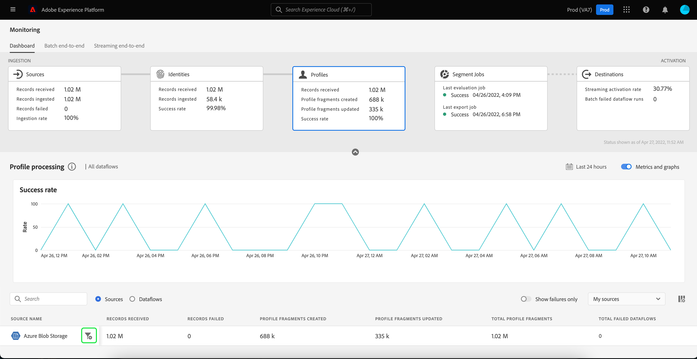

# Dataflows for Profiles in de UI controleren

In real time het Profiel van de Klant laat u een holistische mening van elke individuele klant zien door gegevens van veelvoudige kanalen, met inbegrip van online, off-line, CRM, en derde te combineren. Het profiel staat u toe om uw klantengegevens in een verenigde mening te consolideren die een actionable, timestamped rekening van elke klanteninteractie aanbiedt.

Op het dashboard voor bewaking ziet u een visuele weergave van de activiteit van de gegevens in Profiel, inclusief de status van de profielen van uw gegevens. Deze zelfstudie bevat instructies voor het gebruik van het dashboard voor bewaking van de gegevensprofielen via de gebruikersinterface van het Experience Platform, zodat u de status van de profielverwerking kunt bijhouden.

## Aan de slag {#getting-started}

Deze handleiding vereist een goed begrip van de volgende onderdelen van Adobe Experience Platform:

- [Gegevensstromen](../home.md): Dataflows zijn een voorstelling van gegevenstaken die gegevens over het Platform verplaatsen. Dataflows worden gevormd over verschillende diensten, die gegevens van bronschakelaars aan doeldatasets helpen bewegen, aan [!DNL Identity] en [!DNL Profile]en [!DNL Destinations].
   - [Dataflow-uitvoering](../../sources/notifications.md): De looppas van Dataflow is de terugkomende geplande banen die op de frequentieconfiguratie van geselecteerde dataflows worden gebaseerd.
- [Klantprofiel in realtime](../../profile/home.md): Verstrekt een verenigd, real-time consumentenprofiel dat op bijeengevoegde gegevens van veelvoudige bronnen wordt gebaseerd.
- [Sandboxen](../../sandboxes/home.md): [!DNL Experience Platform] biedt virtuele sandboxen die één enkele partitie maken [!DNL Platform] in afzonderlijke virtuele omgevingen om toepassingen voor digitale ervaringen te ontwikkelen en te ontwikkelen.

## Dashboard voor controleprofielen {#profile-metrics}

>[!CONTEXTUALHELP]
>id="platform_monitoring_profile_processing"
>title="Profielverwerking"
>abstract="De profielverwerkingsweergave bevat informatie over records die worden opgenomen in de profielservice, zoals het aantal gemaakte profielfragmenten, de bijgewerkte profielfragmenten en het totale aantal profielfragmenten."
>text="Learn more in documentation"

>[!CONTEXTUALHELP]
>id="platform_monitoring_dataflow_run_details_profile"
>title="Gegevens gegevensstroom"
>abstract="Op de pagina met uitvoergegevens voor Dataflow-gegevens wordt meer informatie weergegeven over de uitvoering van de profielgegevens, waaronder de organisatie-id en de uitvoerings-id van de dataflow."

Om toegang te krijgen tot **[!UICONTROL Profiles]** dashboard, selecteren **[!UICONTROL Monitoring]** in de linkernavigatie. Eén keer op de knop **[!UICONTROL Monitoring]** pagina, selecteert u de **[!UICONTROL Profiles]** kaart.

Over de hoofdlijnen **[!UICONTROL Profiles]** dashboard, het **[!UICONTROL Profiles]** De kaart bevat informatie over het totale aantal ontvangen records, het aantal gemaakte en bijgewerkte profielfragmenten en de successnelheid van gemaakte en bijgewerkte profielfragmenten.

Het dashboard zelf bevat gegevens over profielverwerking. Standaard bevat het dashboard de verwerkingsgegevens van het profiel voor de bronnen van uw organisatie gedurende de laatste 24 uur.

De [!UICONTROL Profile processing] pagina bevat informatie over records die aan worden toegevoegd [!DNL Profile], inclusief het aantal gemaakte profielfragmenten, de bijgewerkte profielfragmenten en het totale aantal profielfragmenten.

De volgende metriek is beschikbaar voor deze dashboardmening:

| Metrisch | Beschrijving |
| -------| ----------- |
| **[!UICONTROL Source name]** | De naam van de bron. |
| **[!UICONTROL Records received]** | Het aantal records dat wordt ontvangen van data Lake. |
| **[!UICONTROL Records failed]** | Het aantal records dat is ingesloten, maar niet in [!DNL Profile] vanwege fouten. |
| **[!UICONTROL Profile fragments created]** | Het aantal netto nieuwe [!DNL Profile] fragmenten toegevoegd. |
| **[!UICONTROL Profile fragments updated]** | Het aantal bestaande [!DNL Profile] fragmenten bijgewerkt. |
| **[!UICONTROL Total Profile fragments]** | The total number of records written into [!DNL Profile], met inbegrip van alle bestaande [!DNL Profile] fragmenten bijgewerkt en nieuw [!DNL Profile] gemaakte fragmenten. |
| **[!UICONTROL Total failed dataflows]** | Het aantal dataflow wordt uitgevoerd dat is mislukt. |

U kunt het filterpictogram selecteren  naast de bronnaam om de verwerkingsinformatie van het Profiel voor de gegevens van die geselecteerde bron te zien.

U kunt ook **[!UICONTROL Dataflows]** op de schakeloptie om de gegevens van de profielverwerking voor de gegevens van uw organisatie gedurende de laatste 24 uur te bekijken.

De volgende metriek is beschikbaar voor deze dashboardmening:

| Metrisch | Beschrijving |
| -------| ----------- |
| **[!UICONTROL Dataflow]** | De naam van de gegevensstroom. |
| **[!UICONTROL Dataset]** | De naam van de dataset die dataflow opneemt aan. |
| **[!UICONTROL Source name]** | De naam van de bron waartoe de gegevensstroom behoort. |
| **[!UICONTROL Records received**] | Het aantal records dat wordt ontvangen van data Lake. |
| **[!UICONTROL Records failed]** | Het aantal records dat is ingesloten, maar niet in [!DNL Profile] vanwege fouten. |
| **[!UICONTROL Profile fragments created]** | Het aantal netto nieuwe [!DNL Profile] fragmenten toegevoegd. |
| **[!UICONTROL Profile fragments updated]** | Het aantal bestaande [!DNL Profile] fragmenten bijgewerkt |
| **[!UICONTROL Total Profile fragments]** | The total number of records written into [!DNL Profile], met inbegrip van alle bestaande [!DNL Profile] fragmenten bijgewerkt en nieuw [!DNL Profile] gemaakte fragmenten. |
| **[!UICONTROL Total failed flow runs]** | Het aantal dataflow wordt uitgevoerd dat is mislukt. |
| **[!UICONTROL Last active]** | De tijdstempel die de gegevensstroom het laatst heeft uitgevoerd. |

Filterpictogram selecteren  naast de dataflow run start time om meer informatie over uw [!DNL Profile] dataflow run.

De [!UICONTROL Dataflow run details] pagina geeft meer informatie over uw [!DNL Profile] dataflow-run, inclusief de organisatie-id en de uitvoerings-id voor dataflow. Op deze pagina ziet u ook de bijbehorende foutcode en het foutbericht van [!DNL Profile], indien er fouten optreden in het innameproces.

De volgende metriek is beschikbaar voor deze dashboardmening:

| Metrisch | Beschrijving |
| -------| ----------- |
| **[!UICONTROL Records received]** | Het aantal records dat wordt ontvangen van data Lake. |
| **[!UICONTROL Records failed]** | Het aantal records dat is ingesloten, maar niet in [!DNL Profile] vanwege fouten. |
| **[!UICONTROL Profile fragments created]** | Het aantal netto nieuwe [!DNL Profile] fragmenten toegevoegd. |
| **[!UICONTROL Profile fragments updated]** | Het aantal bestaande [!DNL Profile] fragmenten bijgewerkt. |
| **[!UICONTROL Status]** | Bepaalt de algemene status van een gegevensstroom. De mogelijke statuswaarden zijn: <ul><li>`Success`: Geeft aan dat een gegevensstroom actief is en gegevens opneemt volgens het schema dat is opgegeven.</li><li>`Failed`: Geeft aan dat het activeringsproces van een gegevensstroom is onderbroken door fouten. </li><li>`Processing`: Geeft aan dat de gegevensstroom nog niet actief is. Deze status wordt vaak direct na het maken van een nieuwe gegevensstroom aangetroffen.</li></ul> |
| **[!UICONTROL Dataflow run start]** | De datum en de tijd dataflow begon te lopen. |
| **[!UICONTROL Last updated]** | De datum en tijd de dataflow laatst bijgewerkt. |
| **[!UICONTROL Error summary]** | Als de dataflow-run is mislukt, wordt een foutcode en een overzicht weergegeven van waarom de dataflow-run is mislukt. |
| **[!UICONTROL Dataflow run ID]** | De id van de gegevensstroom wordt uitgevoerd. |
| **[!UICONTROL IMS org ID]** | De organisatie-id waartoe de dataflow-run behoort. |

Bovendien kunt u de schakeloptie selecteren om de records te bekijken die zijn mislukt of de records die zijn overgeslagen. De sectie Fouten bevat details over de foutcode en het aantal mislukte of uitgesloten records.