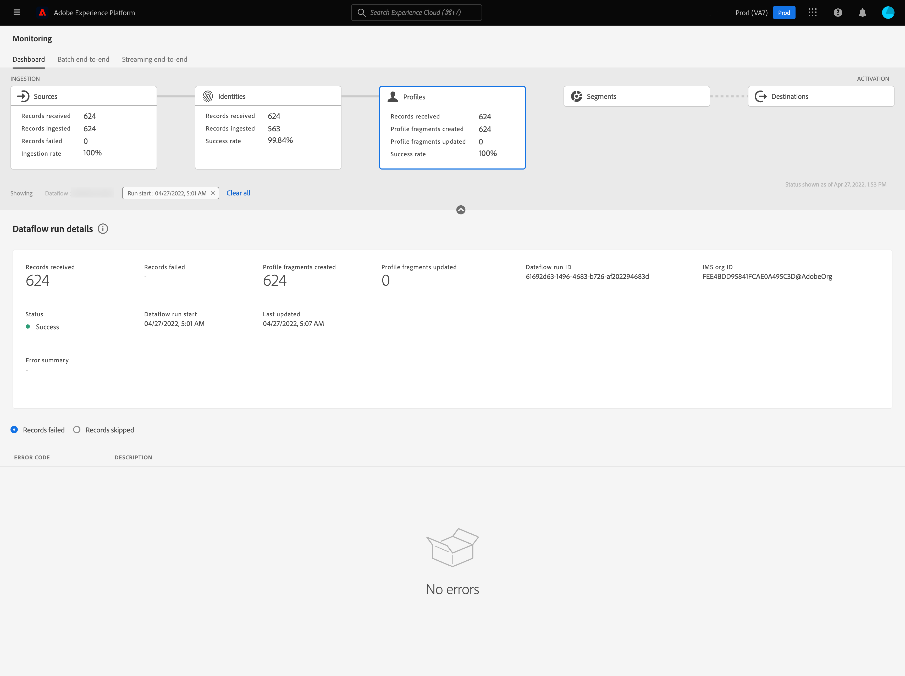

# Dataflows for Profiles in de UI controleren

In real time het Profiel van de Klant laat u een holistische mening van elke individuele klant zien door gegevens van veelvoudige kanalen, met inbegrip van online, off-line, CRM, en derde te combineren. Het profiel staat u toe om uw klantengegevens in een verenigde mening te consolideren die een actionable, timestamped rekening van elke klanteninteractie aanbiedt.

Op het dashboard voor bewaking ziet u een visuele weergave van de activiteit van de gegevens in Profiel, inclusief de status van de profielen van uw gegevens. Deze zelfstudie bevat instructies voor het gebruik van het dashboard voor bewaking van de gegevensprofielen via de Experience Platform-gebruikersinterface, waarmee u de status van de profielverwerking kunt bijhouden.

## Aan de slag {#getting-started}

Deze handleiding vereist een goed begrip van de volgende onderdelen van Adobe Experience Platform:

- [ Dataflows ](../home.md): Dataflows zijn een vertegenwoordiging van gegevensbanen die gegevens over Experience Platform bewegen. Dataflows worden geconfigureerd op verschillende services, waardoor gegevens van bronconnectors naar doelgegevenssets worden verplaatst, naar [!DNL Identity] en [!DNL Profile] en naar [!DNL Destinations] .
   - [ looppas Dataflow ](../../sources/notifications.md): De looppas van Dataflow is de terugkomende geplande banen die op de frequentieconfiguratie van geselecteerde dataflows worden gebaseerd.
- [ Real-Time Profiel van de Klant ](../../profile/home.md): Verstrekt een verenigd, real-time consumentenprofiel dat op samengevoegde gegevens van veelvoudige bronnen wordt gebaseerd.
- [ Sandboxen ](../../sandboxes/home.md): [!DNL Experience Platform] verstrekt virtuele zandbakken die één enkele [!DNL Experience Platform] instantie in afzonderlijke virtuele milieu&#39;s verdelen helpen digitale ervaringstoepassingen ontwikkelen en ontwikkelen.

## Dashboard voor controleprofielen {#profile-metrics}

>[!CONTEXTUALHELP]
>id="platform_monitoring_profile_processing"
>title="Profielverwerking"
>abstract="De profielverwerkingsweergave bevat informatie over records die worden opgenomen in de profielservice, zoals het aantal gemaakte profielfragmenten, de bijgewerkte profielfragmenten en het totale aantal profielfragmenten."
>text="Learn more in documentation"

>[!CONTEXTUALHELP]
>id="platform_monitoring_dataflow_run_details_profile"
>title="Gegevens gegevensstroom uitvoeren"
>abstract="Op de pagina met uitvoergegevens voor Dataflow-gegevens wordt meer informatie weergegeven over de uitvoering van de profielgegevens, waaronder de organisatie-id en de uitvoerings-id van de dataflow."

Als u het dashboard **[!UICONTROL Profiles]** wilt openen, selecteert u **[!UICONTROL Monitoring]** in de linkernavigatie. Selecteer eenmaal op de pagina **[!UICONTROL Monitoring]** de **[!UICONTROL Profiles]** -kaart.

Op het hoofddashboard van **[!UICONTROL Profiles]** geeft de **[!UICONTROL Profiles]** -kaart informatie over het totale aantal ontvangen records, het aantal gemaakte en bijgewerkte profielfragmenten en de successnelheid van gemaakte en bijgewerkte profielfragmenten.

Het dashboard zelf bevat gegevens over profielverwerking. Standaard bevat het dashboard de verwerkingsgegevens van het profiel voor de bronnen van uw organisatie gedurende de laatste 24 uur.

De pagina [!UICONTROL Profile processing] bevat informatie over records die aan [!DNL Profile] worden toegevoegd, zoals het aantal gemaakte profielfragmenten, bijgewerkte profielfragmenten en het totale aantal profielfragmenten.

De volgende metriek is beschikbaar voor deze dashboardmening:

| Metrisch | Beschrijving |
| -------| ----------- |
| **[!UICONTROL Source name]** | De naam van de bron. |
| **[!UICONTROL Records received]** | Het aantal records dat wordt ontvangen van data Lake. |
| **[!UICONTROL Records failed]** | Het aantal records dat als gevolg van fouten is opgenomen, maar niet in [!DNL Profile] . |
| **[!UICONTROL Profile fragments created]** | Het aantal netto nieuwe [!DNL Profile] fragmenten dat wordt toegevoegd. |
| **[!UICONTROL Profile fragments updated]** | Het aantal bestaande [!DNL Profile] fragmenten dat is bijgewerkt. |
| **[!UICONTROL Total Profile fragments]** | Het totale aantal records dat in [!DNL Profile] is geschreven, inclusief alle bestaande [!DNL Profile] fragmenten die zijn bijgewerkt en nieuwe [!DNL Profile] fragmenten die zijn gemaakt. |
| **[!UICONTROL Total failed dataflows]** | Het aantal dataflow wordt uitgevoerd dat is mislukt. |

U kunt het pictogram van de filter  naast de bronnaam selecteren om de verwerkingsinformatie van het Profiel voor de dataflows van die geselecteerde bron te zien.

U kunt ook **[!UICONTROL Dataflows]** in de schakeloptie selecteren om de profielverwerkingsdetails voor de gegevensstromen van uw organisatie gedurende de laatste 24 uur te bekijken.

De volgende metriek is beschikbaar voor deze dashboardmening:

| Metrisch | Beschrijving |
| -------| ----------- |
| **[!UICONTROL Dataflow]** | De naam van de gegevensstroom. |
| **[!UICONTROL Dataset]** | De naam van de dataset die dataflow opneemt aan. |
| **[!UICONTROL Source name]** | De naam van de bron waartoe de gegevensstroom behoort. |
| **[!UICONTROL Data type]** | Het type gegevens dat van de dataset wordt ontvangen. |
| **[!UICONTROL Records received**] | Het aantal records dat wordt ontvangen van data Lake. |
| **[!UICONTROL Records failed]** | Het aantal records dat als gevolg van fouten is opgenomen, maar niet in [!DNL Profile] . |
| **[!UICONTROL Profile fragments created]** | Het aantal netto nieuwe [!DNL Profile] fragmenten dat wordt toegevoegd. |
| **[!UICONTROL Profile fragments updated]** | Het aantal bestaande [!DNL Profile] fragmenten dat is bijgewerkt |
| **[!UICONTROL Total Profile fragments]** | Het totale aantal records dat in [!DNL Profile] is geschreven, inclusief alle bestaande [!DNL Profile] fragmenten die zijn bijgewerkt en nieuwe [!DNL Profile] fragmenten die zijn gemaakt. |
| **[!UICONTROL Total failed flow runs]** | Het aantal dataflow wordt uitgevoerd dat is mislukt. |
| **[!UICONTROL Last active]** | De tijdstempel die de gegevensstroom het laatst heeft uitgevoerd. |

Selecteer het filterpictogram  naast de dataflow runtime begintijd om meer informatie over uw [!DNL Profile] dataflow looppas te zien.

Er wordt een dashboard weergegeven met alle gegevensstroombewerkingen. Dit dashboard bevat metriek over de dataflow looppas evenals grafieken die het succestarief, gemaakte profielfragmenten, en bijgewerkte profielfragmenten tonen.

De volgende metriek is beschikbaar voor deze dashboardmening:

>[!NOTE]
>
>Wanneer de dataflow-run zich in de **[!UICONTROL Processing]** -status bevindt, kunt u informatie over de gereedheid zien door de status van het controlepunt in het innameproces te bekijken.
>
>{zoomable="yes" width="300"}

| Metrisch | Beschrijving |
| ------ | ----------- |
| **[!UICONTROL Dataflow run start]** | De tijd de dataflow looppas in UTC begon. |
| **[!UICONTROL Data type]** | Het type gegevens dat door de gegevensstroom wordt ontvangen. |
| **[!UICONTROL Records received]** | Het aantal records dat wordt ontvangen van data Lake. |
| **[!UICONTROL Records failed]** | Het aantal records dat als gevolg van fouten is opgenomen, maar niet in [!DNL Profile] . |
| **[!UICONTROL Profile fragments created]** | Het aantal netto nieuwe [!DNL Profile] fragmenten dat wordt toegevoegd. |
| **[!UICONTROL Profile fragments updated]** | Het aantal bestaande [!DNL Profile] fragmenten dat is bijgewerkt. |
| **[!UICONTROL Total profile fragments]** | Het totale aantal records dat in [!DNL Profile] is geschreven, inclusief alle bestaande [!DNL Profile] fragmenten die zijn bijgewerkt en nieuwe [!DNL Profile] fragmenten die zijn gemaakt. |
| **[!UICONTROL Processing time]** | De hoeveelheid tijd het voor dataflow nam om te verwerken in werking te stellen. |
| **[!UICONTROL Status]** | De status van de gegevensstroom wordt uitgevoerd. Mogelijke waarden zijn [!UICONTROL Success] , [!UICONTROL Failed] , [!UICONTROL Queued] en [!UICONTROL Processing] . |
| **[!UICONTROL Ready for customer segmentation]** | Een status die toont als de ingebedde verslagen klaar zijn om in klantensegmentatie te worden gebruikt. Mogelijke waarden zijn [!UICONTROL Yes] , [!UICONTROL Failed] , [!UICONTROL Queued] en [!UICONTROL Processing] . Zelfs als de **Status** van dataflow verwerking is, als de waarde van dit gebied ja is, kunt u de profielen in klantensegmentatie gebruiken. |
| **[!UICONTROL Ready for lookup]** | Een status die aangeeft of de opgenomen records klaar zijn om te worden gebruikt in Adobe Journey Optimizer-zoekopdracht.  Mogelijke waarden zijn [!UICONTROL Yes] , [!UICONTROL Failed] , [!UICONTROL Queued] en [!UICONTROL Processing] . Zelfs als de **Status** van dataflow verwerking is, als de waarde van dit gebied ja is, kunt u de profielen in de raadpleging van Journey Optimizer gebruiken. |

Op de pagina [!UICONTROL Dataflow run details] wordt meer informatie weergegeven over de [!DNL Profile] dataflow-uitvoering, inclusief de organisatie-id en de id voor de uitvoering van de gegevensstroom. Op deze pagina worden ook de bijbehorende foutcode en het foutbericht weergegeven die door [!DNL Profile] worden geboden, als er fouten optreden in het innameproces.

De volgende metriek is beschikbaar voor deze dashboardmening:

| Metrisch | Beschrijving |
| -------| ----------- |
| **[!UICONTROL Records received]** | Het aantal records dat wordt ontvangen van data Lake. |
| **[!UICONTROL Records failed]** | Het aantal records dat als gevolg van fouten is opgenomen, maar niet in [!DNL Profile] . |
| **[!UICONTROL Profile fragments created]** | Het aantal netto nieuwe [!DNL Profile] fragmenten dat wordt toegevoegd. |
| **[!UICONTROL Profile fragments updated]** | Het aantal bestaande [!DNL Profile] fragmenten dat is bijgewerkt. |
| **[!UICONTROL Status]** | Bepaalt de algemene status van een gegevensstroom. De mogelijke statuswaarden zijn: <ul><li>`Success`: Geeft aan dat een gegevensstroom actief is en gegevens opneemt volgens het schema dat is opgegeven.</li><li>`Failed`: geeft aan dat het activeringsproces van een gegevensstroom is onderbroken als gevolg van fouten. </li><li>`Processing`: geeft aan dat de gegevensstroom nog niet actief is. Deze status wordt vaak direct na het maken van een nieuwe gegevensstroom aangetroffen.</li></ul> |
| **[!UICONTROL Dataflow run start]** | De datum en de tijd dataflow begon te lopen. |
| **[!UICONTROL Last updated]** | De datum en tijd de dataflow laatst bijgewerkt. |
| **[!UICONTROL Error summary]** | Als de dataflow-run is mislukt, wordt een foutcode en een overzicht weergegeven van waarom de dataflow-run is mislukt. |
| **[!UICONTROL Dataflow run ID]** | De id van de gegevensstroom wordt uitgevoerd. |
| **[!UICONTROL IMS org ID]** | De organisatie-id waartoe de dataflow-run behoort. |

Bovendien kunt u de schakeloptie selecteren om de records te bekijken die zijn mislukt of de records die zijn overgeslagen. De sectie Fouten bevat details over de foutcode en het aantal mislukte of uitgesloten records.
