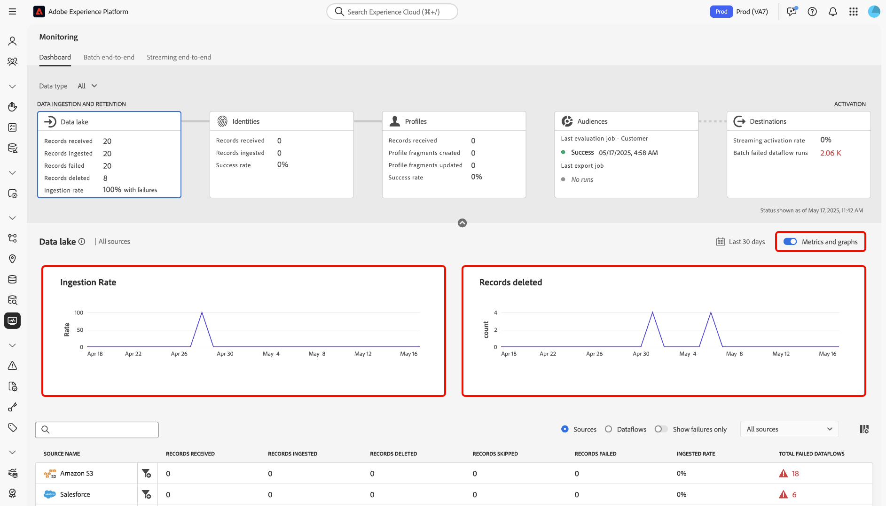
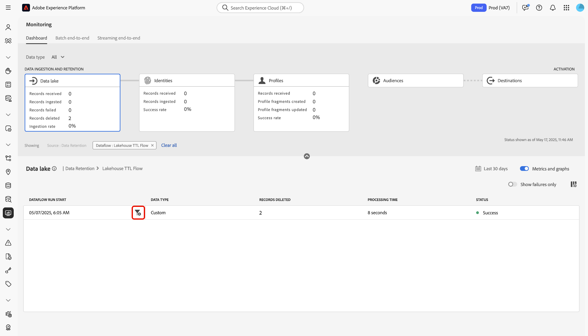

# Inname van meer gegevens controleren

>[!IMPORTANT]
>
>Het stromen bronnen, zoals de [ bron van HTTP API ](../../sources/connectors/streaming/http.md) wordt momenteel niet gesteund door het controledashboard. Op dit moment kunt u het dashboard alleen gebruiken om batchbronnen te controleren.

Lees dit document om te leren hoe u het dashboard voor bewaking kunt gebruiken om de opname van gegevens in het meer in de gebruikersinterface van Experience Platform te controleren.

## Aan de slag {#get-started}

Deze zelfstudie vereist een goed begrip van de volgende onderdelen van Adobe Experience Platform:

* [ Dataflows ](../home.md): Dataflows zijn een vertegenwoordiging van gegevensbanen die gegevens over Experience Platform bewegen. Dataflows worden geconfigureerd op verschillende services, waardoor gegevens van bronconnectors naar doelgegevenssets worden verplaatst, naar [!DNL Identity] en [!DNL Profile] en naar [!DNL Destinations] .
   * [ looppas Dataflow ](../../sources/notifications.md): De looppas van Dataflow is de terugkomende geplande banen die op de frequentieconfiguratie van geselecteerde dataflows worden gebaseerd.
* [ Bronnen ](../../sources/home.md): Experience Platform staat gegevens toe om van diverse bronnen worden opgenomen terwijl het voorzien van u van de capaciteit om, inkomende gegevens te structureren te etiketteren en te verbeteren gebruikend de diensten van Experience Platform.
* [ Dienst van de Identiteit ](../../identity-service/home.md): Verkrijg een betere mening van individuele klanten en hun gedrag door identiteiten over apparaten en systemen te overbruggen.
* [ Real-Time Profiel van de Klant ](../../profile/home.md): Verstrekt een verenigd, real-time consumentenprofiel dat op samengevoegde gegevens van veelvoudige bronnen wordt gebaseerd.
* [ Sandboxes ](../../sandboxes/home.md): Experience Platform verstrekt virtuele zandbakken die één enkele instantie van Experience Platform in afzonderlijke virtuele milieu&#39;s verdelen helpen digitale ervaringstoepassingen ontwikkelen en ontwikkelen.

## Het dashboard voor toezicht op het opnemen van gegevens in het meer gebruiken

>[!CONTEXTUALHELP]
>id="platform_monitoring_source_ingestion"
>title="Source ingestion"
>abstract="De weergave Source-opname bevat informatie over de status van de gegevensactiviteit en metriek in de datameerservice, inclusief opgenomen records en mislukte records. Bekijk de metrische definitiegids voor meer informatie over metriek en grafieken."
>text="Learn more in documentation"

>[!CONTEXTUALHELP]
>id="platform_monitoring_dataflow_run_details_ingestion"
>title="Gegevens gegevensstroom uitvoeren"
>abstract="De bronverwerking bevat informatie over de status van de gegevensactiviteit en metriek in de dienst van het gegevensmeer, met inbegrip van opgenomen verslagen en ontbroken verslagen. Bekijk de metrische definitiegids voor meer informatie over metriek en grafieken."
>text="Learn more in documentation"

Selecteer **[!UICONTROL Data lake]** in de hoofdkoptekst van het dashboard voor controle om de opnamesnelheid van het gegevensmeer weer te geven.

In de grafiek [!UICONTROL Ingestion rate] wordt de gegevensinnamesnelheid weergegeven op basis van het geconfigureerde tijdkader. Standaard geeft het dashboard voor de bewaking de innamesnelheden van de laatste 24 uur weer. Voor stappen op hoe te om uw tijdkader te vormen, leest de gids bij [ vormend controletijdkader ](monitor.md#configure-monitoring-time-frame).

De grafiek wordt standaard weergegeven. Als u de grafiek wilt verbergen, selecteert u **[!UICONTROL Metrics and graphs]** om het schakelen uit te schakelen en de grafiek te verbergen.

Het onderste gedeelte van het dashboard toont een lijst die het huidige metriekrapport voor alle bestaande brongegevens schetst.

| Metrics | Beschrijving |
| --- | --- |
| Ontvangen records | Het totale aantal records dat van een bepaalde bron is ontvangen. |
| Opgenomen records | Het totale aantal records dat aan data Lake wordt ingesloten. |
| Records overgeslagen | Het totale aantal overgeslagen records. Een overgeslagen record verwijst naar velden die zijn overgeslagen omdat ze niet vereist waren voor inname. Bijvoorbeeld, als u een bronnen dataflow met gedeeltelijke toegelaten opname creeert, kunt u een aanvaardbare drempel van het foutentarief vormen. Tijdens het insluiten proces, zal de inname verslagen van gebieden overslaan die niet worden vereist, zoals identiteitsgebieden, zolang zij binnen de foutendrempel zijn. |
| Records mislukt | Het totale aantal records dat niet kan worden opgenomen vanwege fouten. |
| Verhoogde snelheid | Het percentage records dat is opgenomen, is gebaseerd op het totale aantal records dat is ontvangen. |
| Totaal aantal mislukte gegevensstromen | Het totale aantal mislukte gegevensstromen. |

{style="table-layout:auto"}

U kunt uw gegevens verder filteren met de opties boven de metrieke tabel:

| Filteropties | Beschrijving |
| --- | --- |
| Zoeken | Met de zoekbalk kunt u de weergave filteren op één brontype. |
| Bronnen | Selecteer **[!UICONTROL Sources]** om de weergave te filteren en metrische gegevens per type bron weer te geven. Dit is de standaardweergave die het dashboard voor bewaking gebruikt. |
| Gegevensstromen | Selecteer **[!UICONTROL Dataflows]** om uw weergave te filteren en metrische gegevens per gegevensstroom weer te geven. |
| Alleen fouten tonen | Selecteer **[!UICONTROL Show failures only]** om uw weergave te filteren en alleen gegevens weer te geven die mislukte inname hebben gemeld. |
| Mijn bronnen | U kunt de weergave verder filteren met het vervolgkeuzemenu [!UICONTROL My sources] . Met het vervolgkeuzemenu filtert u de weergave op categorie. U kunt ook **[!UICONTROL All sources]** selecteren om metriek in alle bronnen of bronnen weer te geven, of **[!UICONTROL My sources]** selecteren om alleen de bronnen weer te geven waarmee u een corresponderende account hebt. |

{style="table-layout:auto"}

Om de gegevens te controleren die in een specifieke dataflow worden opgenomen, selecteer het filterpictogram  naast een bron.

De metrietabel werkt aan een lijst van actieve gegevens bij die aan de bron beantwoorden die u selecteerde. Tijdens deze stap, kunt u extra informatie over uw gegevensstromen, met inbegrip van hun overeenkomstige dataset en gegevenstype, evenals een tijdstempel bekijken om erop te wijzen wanneer zij het laatst actief waren.

Om een dataflow verder te inspecteren, selecteer het filterpictogram  naast een dataflow.

Daarna, wordt u genomen aan een interface die van alle dataflow looplooploopherhalingen van dataflow een lijst maakt die u selecteerde.

Dataflow-uitvoering is een instantie van de uitvoering van de gegevensstroom. Bijvoorbeeld, als een dataflow om 09:00 AM, 10:00 AM, en 11:00 AM gepland is te lopen, dan zou u drie instanties van een stroomlooppas hebben. De looppas van de stroom is specifiek voor uw bepaalde organisatie.

Om metriek van een specifieke dataflow looploopherhaling te inspecteren, selecteer het filterpictogram  naast uw dataflow.

Gebruik de gegevenspagina van de dataflow looppas om metriek en informatie van uw geselecteerde looppas herhaling te bekijken.

| Gegevens gegevensstroom uitvoeren | Beschrijving |
| --- | --- |
| Opgenomen records | Het totale aantal verslagen die van dataflow looppas werden opgenomen. |
| Records mislukt | Het totale aantal verslagen die niet werden opgenomen toe te schrijven aan fouten in dataflow looppas. |
| Totaal aantal bestanden | Het totale aantal bestanden in de gegevensstroom dat wordt uitgevoerd. |
| Grootte van gegevens | De totale grootte van gegevens bevat in dataflow looppas. |
| ID gegevensstroom uitvoeren | De id van de gegevensstroomrun-iteratie. |
| Org-id | De id van de organisatie waarin de dataflow-run is gemaakt. |
| Status | De status van de gegevensstroom wordt uitgevoerd. |
| Start gegevensstroom | Een tijdstempel die aangeeft wanneer de gegevensstroom is gestart. |
| Einde gegevensstroom | Een tijdstempel die aangeeft wanneer de gegevensstroom is beëindigd. |
| Gegevensset | De dataset die wordt gebruikt om dataflow tot stand te brengen. |
| Gegevenstype | Het type van de gegevens dat in dataflow was. |
| Gedeeltelijke inname | Gedeeltelijke batch-opname is de mogelijkheid om gegevens met fouten in te voeren, tot een bepaalde configureerbare drempel. Met deze functie kunt u al uw nauwkeurige gegevens in Experience Platform opnemen, terwijl al uw onjuiste gegevens afzonderlijk worden opgeslagen met informatie over waarom deze niet geldig zijn. U kunt gedeeltelijke opname tijdens het dataflow-aanmaakproces toelaten. |
| Foutdiagnostiek | De diagnostiek van de fout instrueert de bron om foutendiagnostiek te veroorzaken die u kunt later van verwijzingen voorzien wanneer het controleren van uw datasetactiviteit en dataflow status. U kunt foutdiagnostiek inschakelen tijdens het maken van de gegevensstroom. |
| Overzicht van Error | Op basis van een mislukte gegevensstroomuitvoering geeft het foutenoverzicht een foutcode en een beschrijving weer om samen te vatten waarom de uitvoering is mislukt. |

{style="table-layout:auto"}

Als in de dataflow fouten worden gerapporteerd, kunt u naar de onderkant van de pagina schuiven met de interface [!UICONTROL Dataflow run errors] .

In de sectie [!UICONTROL Records failed] kunt u metrische gegevens weergeven voor records die niet zijn opgenomen als gevolg van fouten. Selecteer **[!UICONTROL Preview error diagnostics]** als u een uitgebreid foutrapport wilt weergeven. Als u een kopie van de foutdiagnostiek en het bestandsmanifest wilt downloaden, selecteert u **[!UICONTROL Download]** en kopieert u vervolgens de voorbeeld-API-aanroep die u met de [!DNL Data Access] -API wilt gebruiken.

>[!NOTE]
>
>U kunt foutdiagnostiek alleen gebruiken als deze functie is ingeschakeld tijdens het maken van de bronverbinding.

## Volgende stappen {#next-steps}

Aan de hand van deze zelfstudie hebt u geleerd hoe u de opnamesnelheid van het gegevensmeer kunt controleren met behulp van het dashboard **[!UICONTROL Monitoring]** . U leerde ook fouten identificeren die dataflow-fouten tijdens inname veroorzaken. Raadpleeg de volgende documenten voor meer informatie:

* [ de identiteitsgegevens van de Controle ](./monitor-identities.md).
* [ het profielgegevens van de Controle ](./monitor-profiles.md).
