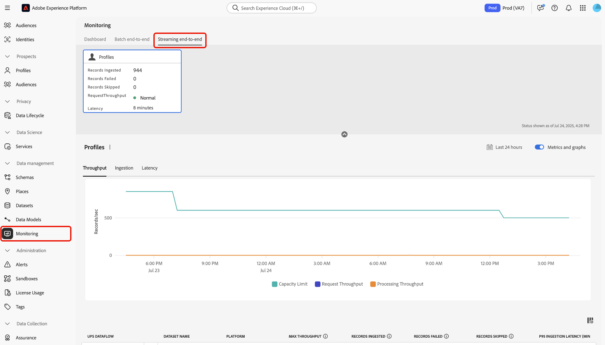
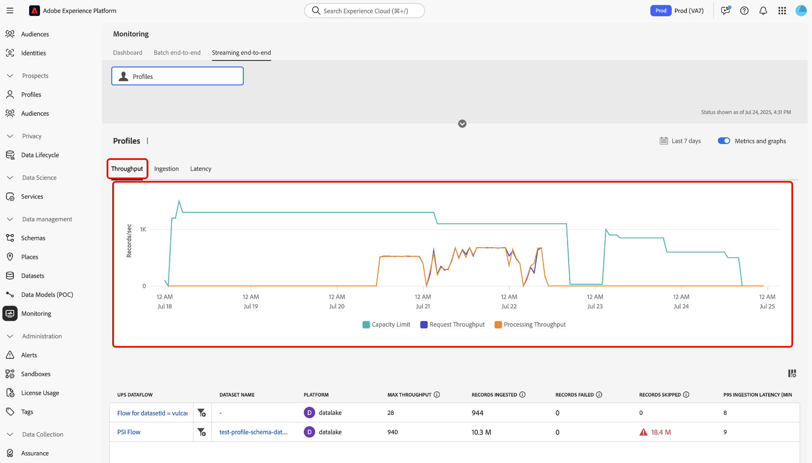

# Streaming profielopname controleren

Met het dashboard voor bewaking in de gebruikersinterface van Adobe Experience Platform kunt u realtime controle uitvoeren op het opnemen van streaming profielen binnen uw organisatie. Met deze functie hebt u toegang tot meer transparantie in de gegevens over doorvoer en gegevenskwaliteit die betrekking hebben op uw streaming gegevens. Bovendien, gebruik deze eigenschap voor pro-actieve alarmering en de terugwinning van actionable inzichten helpen potentiële capaciteitsschendingen en de kwesties van de gegevensopname identificeren.

Lees de volgende handleiding om te leren hoe u het dashboard voor bewaking kunt gebruiken om de tarieven en meetwaarden bij te houden voor het streamen van taken voor het opnemen van profielen in uw organisatie.

## Aan de slag

Deze handleiding vereist een goed begrip van de volgende onderdelen van Experience Platform:

* [&#x200B; Dataflows &#x200B;](../home.md): Dataflows vertegenwoordigen gegevensbanen die informatie over Experience Platform overbrengen. Zij worden gevormd over diverse diensten om de beweging van gegevens van bronschakelaars aan doeldatasets, evenals aan de Dienst van de Identiteit, het Profiel van de Klant in real time, en Doelen te vergemakkelijken.
* [&#x200B; Real-Time Profiel van de Klant &#x200B;](../../profile/home.md): In real-time het Profiel van de Klant combineert gegevens van veelvoudige bronnen-online, off-line, CRM, en derde-partij-in één enkele, actionable mening van elke klant, toelatend verenigbare en gepersonaliseerde ervaringen over alle aanrakingspunten.
* [&#x200B; Streaming opname &#x200B;](../../ingestion/streaming-ingestion/overview.md): Het stromen opname voor Experience Platform verstrekt gebruikers een methode om gegevens van cliënt en server-zijapparaten naar Experience Platform in real time te verzenden.Experience Platform laat u toe om gecoördineerde, verenigbare, en relevante ervaringen te drijven door een Real-Time Profiel van de Klant voor elk van uw individuele klanten te produceren. .
* [&#x200B; Capaciteiten &#x200B;](../../landing/license-usage-and-guardrails/capacity.md): In Experience Platform, laten de capaciteiten u weten als uw organisatie om het even welk van uw gidsen heeft overschreden en geeft u informatie over hoe te om deze kwesties te bevestigen.

>[!NOTE]
>
>De stroomdoorvoercapaciteit ondersteunt maximaal 1500 inkomende gebeurtenissen per seconde. U kunt aanvullende streaming segmentatie aanschaffen ter ondersteuning van maximaal 13.500 extra binnenkomende gebeurtenissen per &#x200B;. Voor meer informatie, verwijs naar [&#x200B; Real-Time CDP B2C Edition - Prime en Ultimate de productbeschrijvingen van Pakketten &#x200B;](https://helpx.adobe.com/legal/product-descriptions/real-time-customer-data-platform-b2c-edition-prime-and-ultimate-packages.html).

## Metrische gegevens voor het streamen van profielopname controleren {#streaming-profile-metrics}

>[!CONTEXTUALHELP]
>id="platform_monitoring_streaming_profile"
>title="Streaming profielopname controleren"
>abstract="Op het dashboard voor controle op streaming profielen wordt informatie over de doorvoer en de innamesnelheden weergegeven. Met dit dashboard kunt u de gegevens voor gegevensverwerking weergeven, begrijpen en analyseren. van uw streamingprofielen naar Experience Platform."
>text="Learn more in documentation"

>[!CONTEXTUALHELP]
>id="platform_monitoring_streaming_profile_request_throughput"
>title="Productie aanvragen"
>abstract="Deze metrische waarde vertegenwoordigt het aantal gebeurtenissen dat per seconde het innamesysteem binnenkomt."
>text="Learn more in documentation"

>[!CONTEXTUALHELP]
>id="platform_monitoring_streaming_profile_processing_throughput"
>title="Verwerkingsdoorvoer"
>abstract="Deze metrische waarde vertegenwoordigt het aantal gebeurtenissen dat met succes door het systeem elke seconde wordt opgenomen."
>text="Learn more in documentation"

>[!CONTEXTUALHELP]
>id="platform_monitoring_streaming_profile_p95_ingestion_latency"
>title="P95-inlaatlatentie"
>abstract="Deze metrische waarde meet de latentie van het 95e percentiel vanaf het moment dat een gebeurtenis in Experience Platform aankomt tot wanneer de gebeurtenis met succes in de opslag van het Profiel wordt opgenomen."
>text="Learn more in documentation"

>[!CONTEXTUALHELP]
>id="platform_monitoring_streaming_profile_max_throughput"
>title="Maximale doorvoer"
>abstract="Deze metrische waarde vertegenwoordigt het maximumaantal binnenkomende verzoeken per seconde die het stromen profielopname ingaan."
>text="Learn more in documentation"

>[!CONTEXTUALHELP]
>id="platform_monitoring_streaming_profile_records_ingested"
>title="Opgenomen records"
>abstract="Deze metrische waarde vertegenwoordigt het totale aantal verslagen die aan de opslag van het Profiel binnen een gevormd tijdvenster worden opgenomen."
>text="Learn more in documentation"

>[!CONTEXTUALHELP]
>id="platform_monitoring_streaming_profile_records_failed"
>title="Records mislukt"
>abstract="Deze metrische waarde vertegenwoordigt het totale aantal verslagen die geen opname in de opslag van het Profiel, binnen een gevormd tijdvenster, wegens fouten ontbrak."
>text="Learn more in documentation"

>[!CONTEXTUALHELP]
>id="platform_monitoring_streaming_profile_records_skipped"
>title="Records overgeslagen"
>abstract="Deze metrisch vertegenwoordigt het totale aantal verslagen die binnen een gevormd tijdvenster, wegens configuratie of capaciteitsschendingen werden gelaten vallen."
>text="Learn more in documentation"

>[!CONTEXTUALHELP]
>id="platform_monitoring_streaming_profile_error_details"
>title="Foutgegevens"
>abstract="Deze metrische waarde vertegenwoordigt het aantal mislukte gebeurtenissen als gevolg van fouten."
>text="Learn more in documentation"

Gebruik de metrietabel voor informatie specifiek voor uw gegevensstromen. Raadpleeg de volgende tabel voor meer informatie over elke kolom.

| Metrisch | Beschrijving | Afmetingen | Frequentie van meting |
| --- | --- | --- | --- |
| Productie aanvragen | Deze metrische waarde vertegenwoordigt het aantal gebeurtenissen dat per seconde het innamesysteem binnenkomt. | Sandbox/DataFlow | Controle in real time met gegevens verfrist zich elke 60 seconden. |
| Verwerkingsdoorvoer | Deze metrische waarde vertegenwoordigt het aantal gebeurtenissen dat met succes door het systeem elke seconde wordt opgenomen. | Sandbox/DataFlow | Controle in real time met gegevens verfrist zich elke 60 seconden. |
| Maximale doorvoer | Deze metrische waarde vertegenwoordigt het maximumaantal binnenkomende verzoeken per seconde die streaming profielopname ingaan | <ul><li>Sandbox/DataFlow</li><li>Dataflow-uitvoering</li></ul> |  |
| Opgenomen records | Deze metrische waarde vertegenwoordigt het totale aantal verslagen die aan de opslag van het Profiel binnen een gevormd tijdvenster worden opgenomen. | <ul><li>Sandbox/DataFlow</li><li>Dataflow-uitvoering</li></ul> | <ul><li>Sandbox/Dataflow: Real-time controle met gegevens verfrist zich om de 60 seconden.</li><li>Dataflow-run: binnen 15 minuten gegroepeerd.</li></ul> |
| Records mislukt | Deze metrische waarde vertegenwoordigt het totale aantal verslagen die geen opname in de opslag van het Profiel, binnen een gevormd tijdvenster, wegens fouten ontbrak. | <ul><li>Sandbox/DataFlow</li><li>Dataflow-uitvoering</li></ul> | <ul><li>Sandbox/Dataflow: Real-time controle met gegevens verfrist zich om de 60 seconden.</li><li>Dataflow-run: binnen 15 minuten gegroepeerd.</li></ul> |
| Records overgeslagen | Deze metrisch vertegenwoordigt het totale aantal verslagen die binnen een gevormd tijdvenster, wegens configuratie of capaciteitsschendingen werden gelaten vallen. | <ul><li>Sandbox/DataFlow</li><li>Dataflow-uitvoering</li></ul> | <ul><li>Sandbox/Dataflow: Real-time controle met gegevens verfrist zich om de 60 seconden.</li><li>Dataflow-run: binnen 15 minuten gegroepeerd.</li></ul> |
| Foutgegevens | Deze metrische waarde vertegenwoordigt het aantal mislukte gebeurtenissen als gevolg van fouten. | Dataflow-uitvoering | gegroepeerd in een uurvenster. |

{style="table-layout:auto"}

## Het dashboard voor controle gebruiken voor het streamen van profielopname

Ga naar de Experience Platform-gebruikersinterface en selecteer **[!UICONTROL Monitoring]** in de linkernavigatie om het dashboard voor het streamen van profielen te openen.**[!UICONTROL Streaming end-to-end]**

Raadpleeg de bovenste koptekst van het dashboard voor de *[!UICONTROL Profile]* -meetkaart. Gebruik deze vertoning om informatie over de verslagen te bekijken die, ontbroken, en overgeslagen, evenals informatie over de huidige status van verzoekproductie worden opgenomen.

Vervolgens gebruikt u de interface om gedetailleerde informatie over de gegevens van uw streamingprofielopname weer te geven. Gebruik de kalenderfunctie om te schakelen tussen verschillende tijdframes. U kunt uit de volgende vooraf geconfigureerde tijdvensters selecteren:

* [!UICONTROL Last 6 hours]
* [!UICONTROL Last 12 hours]
* [!UICONTROL Last 24 hours]
* [!UICONTROL Last 7 days]
* [!UICONTROL Last 30 days]

U kunt ook handmatig uw eigen tijdframe configureren met de kalender.

U kunt twee verschillende metrische categorieën in het controledashboard voor het stromen profielopname gebruiken: [!UICONTROL Throughput] en [!UICONTROL Ingestion].

>[!BEGINTABS]

>[!TAB  Output ]

Selecteer **[!UICONTROL Throughput]** om informatie te bekijken over de hoeveelheid gegevens die Experience Platform verwerkt op basis van een geconfigureerde periode. Verwijs naar deze metrisch om de efficiency en de capaciteit van uw systeem te evalueren.

* **[Capaciteit](../../landing/license-usage-and-guardrails/capacity.md)**: De maximumhoeveelheid gegevens die uw zandbak onder bepaalde voorwaarden kan verwerken.
* **productie van het Verzoek**: Het tarief waarbij de gebeurtenissen door het innamesysteem worden ontvangen, dat in gebeurtenissen per seconde wordt gemeten.
* **Verwerkingsproductie**: Het tarief waarbij het systeem met succes binnenkomt en inkomende gebeurtenislading verwerkt, die in gebeurtenissen per seconde wordt gemeten.

>[!TAB  Ingestie ]

**Ingestie**: Selecteer **[!UICONTROL Ingestion]** om informatie over de innametaken in uw zandbak te bekijken. Deze innametaken worden in drie verschillende meeteenheden gemeten.

* **Ontvangen Verslagen**: De totale hoeveelheid verslagen die binnen een bepaalde tijdspanne worden gecreeerd. Deze metrische waarde vertegenwoordigt succesvolle processen voor gegevensinvoer in uw sandbox.
* **Verslagen overgeslagen**: Het totale aantal verslagen die niet wegens fouten werden opgenomen.
* **Verslagen overgeslagen**: Het totale aantal verslagen die wegens schending van capaciteitsgrenzen werden gelaten vallen.

>[!ENDTABS]

### De tabel met gegevensstroomgegevens gebruiken

De dataflow lijst maakt een lijst van alle het stromen ingangsactiviteiten met hun overeenkomstige reeks metriek voor het Profiel van de Klant in real time. Elke dataflow wordt vermeld met het is overeenkomstige dataset.

Als u de grenzen van uw zandbak-vlakke capaciteit nadert, kunt u naar de [!UICONTROL Max throughput] kolom verwijzen om het even welke bestaande gegevensstromen te identificeren die tot uw verbruikstarieven bijdragen. Lees de [&#x200B; beste praktijken sectie &#x200B;](#best-practices) voor meer informatie over dataflow beheer beste praktijken.

Om de gegevens te controleren die in een specifieke dataflow worden opgenomen, selecteer de filter  naast de dataflow naam.

Vervolgens gebruikt u de gegevensstroommetrische interface om de specifieke flowuitvoering te selecteren die u wilt inspecteren. Selecteer het filter  naast een looppasherhaling van de stroom aan meningsmetriek specifiek aan de geselecteerde stroomlooppas.

Dataflow-uitvoering is een instantie van de uitvoering van de gegevensstroom. Bijvoorbeeld, als een dataflow om bij 9 :00 AM, 10 :00 AM, en 11 :00 AM gepland is te lopen, dan zou u drie instanties van een stroomlooppas hebben. De looppas van de stroom is specifiek voor uw bepaalde organisatie.

Gebruik de gegevenspagina van de dataflow looppas om metriek en informatie van uw geselecteerde looppas herhaling te bekijken.

## Best practices voor gegevensstroombeheer {#best-practices}

Lees de volgende sectie voor informatie over hoe u uw gegevensstromen het beste kunt beheren en uw gegevensverbruik op Experience Platform kunt optimaliseren.

### Gegevens over streaming opname evalueren en optimaliseren

Voor efficiënte streamingopname kunt u uw gegevensstromen en verwerkingsstrategie controleren en aanpassen:

* **beoordeelt huidig gebruik**: Identificeer welke dataflows en datasets het meest aan productie bijdragen.
* **Prioriseer waardevolle gegevens**: Niet alle gegevens kunnen noodzakelijk zijn. Sluit gegevens uit die uw gebruiksgevallen niet ondersteunen om de opslag te verminderen en de efficiëntie te verbeteren.
* **optimaliseer verwerkingswijze**: Bepaal als sommige gegevens van het stromen aan batch-opname kunnen worden verschoven. Het stromen van de reserve voor gebruiksgevallen die lage latentie, zoals segmentatie in real time vereisen.

### Plan voor capaciteit en seizoensverkeer

Als uw huidige grens van **1.500 gebeurtenissen per seconde** ontoereikend is, denk na optimaliserend uw gegevensstrategie of verhogend uw vergunningscapaciteit:

* **analyseert dataset en zandbakgebruik**: Herzie zowel huidige als historische gegevens om te begrijpen hoe het verkeer en de overeenkomst het stromen segmenteringsproductie beïnvloeden.
* **Rekening voor seizoonaliteit**: Identificeer piekverkeersperioden die door terugkerende marketing campagnes of industrie-specifieke cycli worden gedreven.
* **Voorspelde toekomstige vraag**: Schatting van het aanstaande verkeer en betrokkenheidsvolumes die op voorbije seizoensgebonden tendensen, geplande campagnes, of belangrijke gebeurtenissen worden gebaseerd.

| bijdragende factor | Wat het is | Gevolgen van het gebruik | Best practices |
| --- | --- | --- | --- |
| Batch naar streaming conversie | Batchwerklasten die in streaming worden omgezet, kunnen de doorvoer aanzienlijk verhogen, wat van invloed is op de prestaties en de toewijzing van bronnen. Bijvoorbeeld het uitvoeren van een bulkprofielupdate na een gebeurtenis zonder tariefgrenzen. | Streaming strategieën zijn niet nodig voor batchgebruik wanneer verwerking met lage latentie niet vereist is. | Evalueer de eisen van het gebruikscase. Voor partij uitgaande marketing, denk na gebruikend [&#x200B; partij ingestie &#x200B;](../../ingestion/batch-ingestion/overview.md) in plaats van het stromen om gegevensopname efficiënter te beheren. |
| Onnodige gegevensinvoer | Het invoeren van gegevens die niet voor verpersoonlijking worden vereist verhoogt productie zonder waarde toe te voegen, die middelen verspillen. Bijvoorbeeld, het opnemen van al analyseverkeer in profielen ongeacht relevantie. | Overbodige, niet-relevante gegevens zorgen voor ruis, waardoor het moeilijker wordt om onechte gegevenspunten te identificeren. Het kan ook wrijving veroorzaken wanneer het bepalen van en het leiden van publiek en profielen. | Vermeld alleen de gegevens die nodig zijn voor uw gebruiksgevallen. Zorg ervoor dat u overbodige gegevens verwijdert.<ul><li>**Adobe Analytics**: Het 2&rbrace; rij-vlakke filtreren van het gebruik [&#x200B; om uw gegevensopname te optimaliseren.](../../sources/tutorials/ui/create/adobe-applications/analytics.md#filtering-for-real-time-customer-profile)</li><li>**Bronnen**: Gebruik [[!DNL Flow Service]  API aan filter rij-vlakke gegevens &#x200B;](../../sources/tutorials/api/filter.md) voor gesteunde bronnen zoals [!DNL Snowflake] en [!DNL Google BigQuery].</li></li>**Edge datastream**: Vorm [&#x200B; dynamische gegevensstromen &#x200B;](../../datastreams/configure-dynamic-datastream.md) om rij-vlakke het filtreren van verkeer uit te voeren dat binnen van WebSDK komt.</li></ul> |

{style="table-layout:auto"}

### Veelgestelde vragen {#faq}

Lees deze sectie voor antwoorden op vaak gestelde vragen over de controle voor het stromen profielopname.

#### Waarom kijken mijn metriek verschillend tussen de Dashboards van de Capaciteit en van de Controle voor verzoekproductie?

+++Antwoord

Op het dashboard van [!UICONTROL Monitoring] worden real-time metriek voor inname en verwerking weergegeven. Deze getallen zijn exacte meetwaarden die zijn opgenomen op het moment van de activiteit. Omgekeerd gebruikt het dashboard [!UICONTROL Capacity] een vloeiend mechanisme voor de berekening van de doorvoercapaciteit. Dit mechanisme helpt kortstondige pieken te voorkomen die onmiddellijk als overtredingen worden gekwalificeerd en zorgt ervoor dat capaciteitswaarschuwingen zich richten op duurzame trends in plaats van op kortstondige uitbarstingen.

Vanwege het vloeiend maken kunt u het volgende opmerken:

* Kleine pieken in [!UICONTROL Monitoring] die niet worden weergegeven in [!UICONTROL Capacity] .
* Iets lagere waarden in [!UICONTROL Capacity] vergeleken met [!UICONTROL Monitoring] tegelijk.

De twee dashboards zijn correct, maar voor verschillende doeleinden ontworpen.

* [!UICONTROL Monitoring]: Gedetailleerde, moment-voor-moment operationele zichtbaarheid.
* [!UICONTROL Capacity]: strategische weergave voor het identificeren van gebruiks- en schendingspatronen.

+++

## Volgende stappen {#next-steps}

Aan de hand van deze zelfstudie hebt u geleerd hoe u de taken voor het opnemen van streaming profielen in uw organisatie kunt controleren. Lees de volgende documenten voor extra informatie over controlegegevens voor het Profiel van de Klant in real time.

* [&#x200B; gebruik het controledashboard &#x200B;](./monitor.md).
* [&#x200B; de profielgegevens van de Monitor &#x200B;](./monitor-profiles.md).
