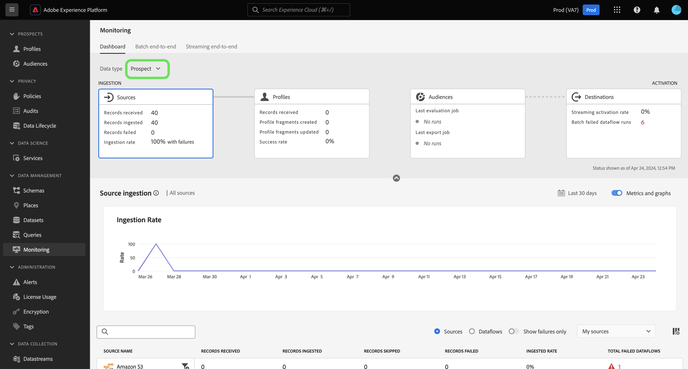

# Overzicht van het dashboard controleren

Met het dashboard voor bewaking in de gebruikersinterface van Adobe Experience Platform kunt u de reis van uw gegevens van inname naar activering bekijken. Met het controledashboard kunt u:

* Controleer de reis van uw gegevens van Bronnen, de Dienst van de Identiteit, het Profiel van de Klant in real time, Soorten publiek, en tenslotte in Doelen.
* U kunt verschillende metriek en statussen weergeven, afhankelijk van het werkgebied waarin de gegevens zich bevinden.
* Filter de weergave voor gegevenscontrole op het gegevenstype.

Het controledashboard ondersteunt de weergave van verschillende gegevenstypen:

* **Klant en account**: Gegevens van de klant hebben betrekking op de gegevens die worden gebruikt in [Real-time Customer Data Platform](../../rtcdp/home.md), terwijl accountgegevens betrekking hebben op [accountprofielgegevens](../../rtcdp/accounts/account-profile-overview.md) dat toegankelijk is wanneer geabonneerd op [Real-Time CDP, B2B Edition](../../rtcdp/b2b-overview.md). Als uw Real-Time CDP-licentie Real-Time CDP, B2B Edition niet bevat, kunt u het dashboard voor bewaking alleen gebruiken om de klantgegevens te controleren.
* **Perspectief**: [Prospectieprofielen](../../profile/ui/prospect-profile.md) worden gebruikt om mensen te vertegenwoordigen die nog niet met uw bedrijf in dienst hebben maar u wilt bereiken. Met perspectiefprofielen, kunt u uw klantenprofielen met attributen van vertrouwde op derdepartners aanvullen. U moet een licentie hebben met Real-Time CDP (App Service), Adobe Experience Platform Activation, Real-Time CDP, Real-Time CDP Premiere, Real-Time CDP Ultimate om het gegevenstype voor perspectiefgegevens te kunnen bekijken.
* **Verbetering van accountprofiel**: Met accountprofielen kunt u accountgegevens uit meerdere bronnen verenigen. U moet een licentie hebben voor de Real-Time CDP B2B-editie om de gegevens over het verrijken van accountprofielen te kunnen controleren.

Lees dit document om te leren hoe u het dashboard voor bewaking kunt gebruiken om de reis van uw gegevens over verschillende services van Experience Platforms te controleren.

## Aan de slag

Voor dit document is een goed begrip van de volgende onderdelen van het Experience Platform vereist:

* [Gegevensstromen](../home.md): Dataflows are representations of data jobs that move data across Experience Platform. U kunt de werkruimte van bronnen gebruiken om gegevensstromen tot stand te brengen die gegevens van een bepaalde bron aan Experience Platform opnemen.
* [Bronnen](../../sources/home.md): Gebruik bronnen in Experience Platform om gegevens van een Adobe of een gegevensbron van derden in te voeren.
* [Identiteitsservice](../../identity-service/home.md): Verbeter een beter beeld van individuele klanten en hun gedrag door identiteiten over apparaten en systemen te overbruggen.
* [Klantprofiel in realtime](../../profile/home.md): Biedt een uniform, real-time consumentenprofiel dat is gebaseerd op geaggregeerde gegevens van meerdere bronnen.
* [Segmentering](../../segmentation/home.md): Gebruik de Segmentatieservice om segmenten en publiek te maken op basis van uw gegevens van het profiel van de klant in realtime.
* [Doelen](../../destinations/home.md): De bestemmingen zijn pre-gebouwde integratie met algemeen gebruikte toepassingen die voor de naadloze activering van gegevens van Platform voor kanaalmarketing campagnes, e-mailcampagnes, gerichte reclame, en vele andere gebruiksgevallen toestaan.

## Handleiding voor het controledashboard

Selecteer in de gebruikersinterface van het Experience Platform de optie **[!UICONTROL Monitoring]** krachtens [!UICONTROL Data Management] in de linkernavigatie.

Selecteren **[!UICONTROL Data Type]** en gebruikt u vervolgens het vervolgkeuzemenu om het type gegevens te selecteren dat u wilt weergeven. De gegevenstypes worden bepaald door het schemaklassen van het Model van de Gegevens van de Ervaring (XDM) om ervoor te zorgen dat hun gegevens een standaardformaat wanneer ingebed in Experience Platform volgen. Raadpleeg de volgende documentatie voor meer informatie:

* [B2B-rekeninggegevenstype](../../rtcdp/b2b-tutorial.md)
* [Gegevenstype prospectie](../../rtcdp/partner-data/prospecting.md)

U kunt de weergave filteren op basis van de volgende gegevenstypen:

>[!BEGINTABS]

>[!TAB Alles]

Selecteren **[!UICONTROL All]** om uw dashboard bij te werken en metriek op alle gegevens te tonen die aan Experience Platform in de loop van een bepaalde periode zijn opgenomen.

>[!TAB Klant en account]

Selecteren **[!UICONTROL Customer & Account]** om uw dashboard bij te werken en metriek weer te geven op gegevens van klanten en accounts die gedurende een bepaalde periode aan Experience Platform zijn toegevoegd.

>[!TAB Perspectief]

Selecteren **[!UICONTROL Prospect]** om uw dashboard en vertoningsmetriek op het prospecteren van gegevens bij te werken die aan Experience Platform in de loop van een bepaalde periode zijn opgenomen. **Opmerking**: U kunt activiteiten van het type van vooruitlopende gegevens alleen bekijken als u [recht op prospectiegegevens](../../rtcdp/partner-data/prospecting.md).

>[!TAB Verbetering van accountprofiel]

Selecteren **[!UICONTROL Account profile enrichment]** om uw dashboard bij te werken en metriek op de gegevens van de profielverrijking te tonen. **Opmerking**: U kunt de cijfers voor het verrijken van accountprofielen alleen weergeven als u gemachtigd bent om [B2B-gegevens](../../rtcdp/b2b-tutorial.md).

>[!ENDTABS]

Gebruik de bovenste koptekst van het dashboard voor een ervaring van cross-service controle. U kunt uw metriek en grafiekmening filtreren door de eigenschapkaart van uw keus van de kopbal van de gegevenscategorie te selecteren.

>[!BEGINTABS]

>[!TAB Bronnen]

Selecteren **[!UICONTROL Sources]** om de metriek van uw bronopname tarief te bekijken. Lees de handleiding op [gegevens over monitoringbronnen](monitor-sources.md) voor meer informatie .

>[!TAB Identiteiten]

Selecteren **[!UICONTROL Identities]** om de snelheid van het verwerken van uw identiteitsgegevens te bekijken. Lees de handleiding op [identiteitsgegevens controleren](monitor-identities.md) voor meer informatie .

>[!TAB Profielen]

Selecteren **[!UICONTROL Profiles]** om de snelheid van het verwerken van uw profielgegevens weer te geven. Lees de handleiding op [profielgegevens controleren](monitor-profiles.md) voor meer informatie .

>[!TAB Doelgroepen]

Selecteren **[!UICONTROL Audiences]** om metriek op uw publiek en segmentatietaken te bekijken. Lees de handleiding op [gegevens voor het publiek controleren](monitor-audiences.md) voor meer informatie .

>[!TAB Doelen]

Selecteren **[!UICONTROL Destinations]** om metriek op uw [!UICONTROL Streaming activate rate] en [!UICONTROL Batch failed dataflow runs]. Lees de handleiding op [gegevens over controledoelen](monitor-destinations.md) voor meer informatie .

>[!ENDTABS]

### Bewakingstijdframe configureren {#configure-monitoring-time-frame}

Standaard worden op het dashboard voor bewaking meetgegevens weergegeven over gegevens die in de afgelopen 24 uur zijn ingevoerd. Als u het tijdkader wilt bijwerken, selecteert u **[!UICONTROL Last 24 hours]**.

U kunt een nieuw tijdkader voor uw gegevens controlemening in het dialoogvenster vormen dat verschijnt. U kunt een aangepast tijdframe maken of een keuze maken in de lijst met vooraf geconfigureerde opties:

* [!UICONTROL Last 24 hours]
* [!UICONTROL Last 7 days]
* [!UICONTROL Last 30 days]

Selecteer **[!UICONTROL Apply]**.

## Volgende stappen

Door dit document te lezen, kunt u nu door het controledashboard in UI navigeren. Lees de onderstaande documentatie voor informatie over hoe u gegevens voor een specifieke service van het Experience Platform kunt controleren:

* [Brongegevens controleren](monitor-sources.md).
* [Identiteitsgegevens controleren](monitor-identities.md).
* [Profielgegevens controleren](monitor-profiles.md).
* [publieksgegevens controleren](monitor-audiences.md).
* [Gegevens van doelen controleren](monitor-destinations.md).
