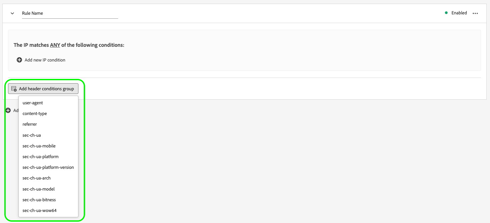

# Beide detectie configureren voor gegevensstromen

Het onmenselijke verkeer van geautomatiseerde programma&#39;s, Webschrapers, spinnen, en scripted scanners kan het moeilijk maken om gebeurtenissen van menselijke bezoekers te identificeren. Dit type van verkeer kan belangrijke bedrijfsmetriek negatief beïnvloeden, die tot onjuist verkeer leiden meldend.

Beide opsporing staat u toe om gebeurtenissen te identificeren die door [&#x200B; SDK van het Web &#x200B;](../web-sdk/home.md), [&#x200B; Mobiele SDK &#x200B;](https://developer.adobe.com/client-sdks/home/) en [[!DNL Edge Network API] &#x200B;](https://developer.adobe.com/data-collection-apis/docs/api/) worden geproduceerd als door bekende spinnen en bots.

Door beide opsporing voor uw gegevensstromen te vormen, kunt u specifieke IP adressen, IP waaiers, en verzoekkopballen identificeren om als beide gebeurtenissen te classificeren. Zo kunt u de gebruikersactiviteit op uw site of mobiele toepassing nauwkeuriger meten.

Wanneer een verzoek aan de Edge Network om het even welke beide ontdekkingsregels aanpast, wordt het schema XDM bijgewerkt met een beide score (altijd geplaatst aan 1), zoals hieronder getoond:

```json
{
  "botDetection": {
    "score": 1
  }
}
```

Deze beide het scoren helpt de oplossingen die het verzoek ontvangen beide verkeer correct identificeren.

>[!IMPORTANT]
>
>Boot detection slaat beide aanvragen niet neer. Het werkt slechts het schema XDM met beide het scoren bij, en door:sturen de gebeurtenis aan de [&#x200B; datastream dienst &#x200B;](configure.md) die u vormde.
>
>Adobe-oplossingen kunnen beide scoren op verschillende manieren verwerken. Bijvoorbeeld, gebruikt Adobe Analytics zijn eigen [&#x200B; bot filtrerende dienst &#x200B;](https://experienceleague.adobe.com/docs/analytics/admin/admin-tools/manage-report-suites/edit-report-suite/report-suite-general/bot-removal/bot-rules.html) en gebruikt niet de score die door Edge Network wordt geplaatst. De twee diensten gebruiken de zelfde [&#x200B; IAB beide lijst &#x200B;](https://www.iab.com/guidelines/iab-abc-international-spiders-bots-list/), zodat is het beide het scoren identiek.

## Technische overwegingen {#technical-considerations}

Voordat u beide detectie in uw gegevensstromen inschakelt, moet u rekening houden met een aantal belangrijke punten voor een correcte en vloeiende implementatie:

* Bot-detectie is alleen van toepassing op niet-geverifieerde aanvragen die naar `edge.adobedc.net` worden verzonden.
* De voor authentiek verklaarde verzoeken die aan `server.adobedc.net` worden verzonden worden niet geëvalueerd voor beide verkeer, aangezien het voor authentiek verklaarde verkeer als betrouwbaar wordt beschouwd.
* Bot-detectieregels kunnen tot 15 minuten duren voordat ze door de Edge Network worden verspreid.

## Vereisten {#prerequisites}

Om beide detectie uit te voeren, moet u de veldgroep **[!UICONTROL Bot Detection Information]** aan uw schema toevoegen. Zie de [&#x200B; XDM schema &#x200B;](../xdm/ui/resources/schemas.md#add-field-groups) documentatie leren hoe te om gebiedsgroepen aan een schema toe te voegen.

## Beide detectie configureren voor gegevensstromen {#configure}

U kunt beide detectie configureren na het maken van een gegevensstroomconfiguratie. Zie de documentatie op hoe te [&#x200B; tot stand brengen en een datastream &#x200B;](configure.md) vormen, dan volg de instructies hieronder om beide opsporingsmogelijkheden aan uw gegevensstroom toe te voegen.

Ga naar de lijst van gegevensstromen en selecteer de gegevensstroom waaraan u beide opsporing wilt toevoegen.


Selecteer op de pagina met gegevensstroomdetails de optie **[!UICONTROL Bot Detection]** op de rechterrails.


De pagina **[!UICONTROL Bot Detection Rules]** wordt weergegeven.


Op de pagina Bot Detection Rules kunt u beide detectie configureren met de volgende functies:

* De [[!DNL [IAB/ABC International Spiders and Bots List]]](https://www.iab.com/guidelines/iab-abc-international-spiders-bots-list/) gebruiken.
* Uw eigen regels voor botdetectie maken.

### De IAB/ABC International Spiders and Bots List gebruiken {#iab-list}

De [&#x200B; IAB/ABC Internationale Spinnen en Bots Lijst &#x200B;](https://www.iab.com/guidelines/iab-abc-international-spiders-bots-list/) is een derde, industrie-standaardlijst van internetspinnen en bots. Deze lijst helpt u geautomatiseerd verkeer zoals onderzoekmachine kruipende, controlehulpmiddelen, en ander onmenselijk verkeer identificeren dat u niet in uw analytische tellingen kunt willen omvatten.

Om uw gegevensstroom te vormen om IAB/ABC Internationale Spinnen en Lijst van Bots te gebruiken:

1. Schakel de optie **[!UICONTROL Use IAB/ABC International Spiders and Bots List for bot detection on this datastream]** in.
2. Selecteer **[!UICONTROL Save]** om de instellingen voor beide detectie toe te passen op uw gegevensstroom.


### Baandetectieregels maken {#rules}

Naast het gebruiken van de [&#x200B; IAB/ABC Internationale Spinnen en Bots Lijst &#x200B;](https://www.iab.com/guidelines/iab-abc-international-spiders-bots-list/), kunt u uw eigen regels van de botopsporing voor elke gegevensstroom bepalen.

U kunt beide opsporingsregels tot stand brengen die op **IP adressen** en **IP adreswaaiers** worden gebaseerd.

Als u meer regels voor korrelige botdetectie nodig hebt, kunt u de IP-voorwaarden combineren met de voorwaarden van de aanvraagkoptekst. De regels van de Bot opsporing kunnen de volgende kopballen gebruiken:

| HTTP-header | Beschrijving |
| --- | --- |
| `user-agent` | Een koptekst waarmee servers en netwerkpeers de toepassing, het besturingssysteem, de leverancier en/of de versie van de aanvragende gebruikersagent kunnen identificeren. |
| `content-type` | Geeft het oorspronkelijke mediatype van de bron aan (vóór eventuele inhoudcodering die is toegepast voor verzending). |
| `referer` | Identificeert het adres van de Web-pagina waarvan het middel is gevraagd. |
| `sec-ch-ua` | Biedt het merk en de significante versie voor elk merk verbonden aan browser in een komma-gescheiden lijst. |
| `sec-ch-ua-mobile` | Geeft aan of de browser zich op een mobiel apparaat bevindt. Deze kan ook door een desktopbrowser worden gebruikt om een voorkeur voor een mobiele gebruikerservaring aan te geven. |
| `sec-ch-ua-platform` | Verstrekt het platform of het werkende systeem waarop de gebruikersagent loopt. Bijvoorbeeld: &quot;Windows&quot; of &quot;Android&quot;. |
| `sec-ch-ua-platform-version` | Verstrekt de versie van het werkende systeem waarop de gebruikersagent loopt. |
| `sec-ch-ua-arch` | Verstrekt de onderliggende architectuur van CPU van de gebruiker-agent, zoals ARM of x86. |
| `sec-ch-ua-model` | Geeft het apparaatmodel aan waarop de browser wordt uitgevoerd. |
| `sec-ch-ua-bitness` | Verstrekt de &quot;bitness&quot;van de onderliggende architectuur van CPU van de gebruiker-agent. Dit is de grootte in beetjes van een geheel of geheugenadres-typisch 64 of 32 beetjes. |
| `sec-ch-ua-wow64` | Geeft aan of een binaire gebruikersagent wordt uitgevoerd in de 32-bits modus van 64-bits Windows. |

Volg onderstaande stappen om een regel voor botdetectie te maken:

1. Selecteer **[!UICONTROL Add New Rule]**.

   

2. Typ een naam voor de regel in het veld **[!UICONTROL Rule Name]** .

   

3. Selecteer **[!UICONTROL Add new IP condition]** om een nieuwe op IP gebaseerde regel toe te voegen. U kunt de regel door IP adres of door IP adreswaaier bepalen.

   

   

   >[!TIP]
   >
   >De IP-voorwaarden zijn gebaseerd op een logische `OR` -bewerking. Een verzoek wordt gemarkeerd als afkomstig van een beide als aan een van de door u gedefinieerde IP-voorwaarden wordt voldaan.

4. Als u kopbalvoorwaarden aan uw regel wilt toevoegen, selecteert u **[!UICONTROL Add header conditions group]**, en selecteert u vervolgens de kopballen die u de regel wilt gebruiken.

   

   Voeg vervolgens de voorwaarden toe die voor de geselecteerde koptekst moeten worden gebruikt.

   

5. Nadat u de gewenste regels voor beide detectie hebt geconfigureerd, selecteert u **[!UICONTROL Save]** om de regels toe te passen op uw gegevensstroom.

   


## Voorbeelden van binddetectieregel {#examples}

Om u te helpen aan de slag te gaan met beide detectie, kunt u de onderstaande voorbeelden gebruiken om beide detectieregels te maken.

### Bot-detectie op basis van één IP-adres {#one-ip}

Om alle verzoeken te merken die uit een specifiek IP adres als allebei verkeer voortkomen, creeer een nieuwe beide opsporingsregel die één enkel IP adres evalueert, zoals aangetoond in het hieronder beeld.


### Bot-detectie op basis van twee IP-adressen {#two-ip}

Om alle verzoeken te merken die uit één van beiden van twee specifieke IP adressen als allebei verkeer voortkomen, creeer een nieuwe regel van de botopsporing die twee IP adressen evalueert, zoals aangetoond in het hieronder beeld.


### Bot-detectie op basis van een reeks IP-adressen {#range}

Om alle verzoeken te merken die uit om het even welk IP adres in een specifieke waaier als beide verkeer voortkomen, creeer een nieuwe de detectieregel van de bot die een volledige IP adreswaaier evalueert, zoals aangetoond in het hieronder beeld.


### Bot-detectie op basis van een IP-adres en een aanvraagheader {#ip-header}

Om alle verzoeken te merken die uit een specifiek IP adres voortkomen en een specifieke verzoekkopbal als allebei verkeer bevatten, creeer een nieuwe de detectieregel van de bot zoals aangetoond in het hieronder beeld.

Deze regel controleert of de aanvraag afkomstig is van een specifiek IP-adres en of de aanvraagheader `referer` begint met `www.adobe.com` .


### Bot-detectie op basis van meerdere omstandigheden {#multiple-conditions}

U kunt beide detectieregels maken op basis van:

* **Veelvoudige verschillende voorwaarden**: De verschillende voorwaarden worden geëvalueerd als logische `AND` verrichting, betekenend dat de voorwaarden gelijktijdig moeten worden vervuld opdat het verzoek als voortkomend van een beide worden geïdentificeerd.
* **Veelvoudige voorwaarden van het zelfde type**: De voorwaarden van het zelfde type worden geëvalueerd als logische `OR` verrichting, betekenend dat als om het even welke voorwaarden worden vervuld, wordt het verzoek geïdentificeerd als voortkomend van een beide.

De regel in onderstaande afbeelding geeft een verzoek aan dat van oorsprong is als aan de volgende voorwaarden is voldaan:

De aanvraag is afkomstig van een van de twee IP-adressen, de `referer` header begint met `www.adobe.com` en de `sec-ch-ua-mobile` header geeft aan dat de aanvraag afkomstig is van een desktopbrowser.


