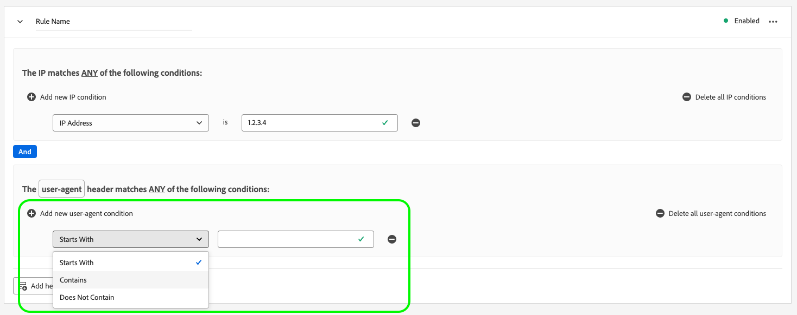

# Beide detectie configureren voor gegevensstromen

Verkeer afkomstig van niet-menselijke entiteiten, zoals geautomatiseerde programma&#39;s, webschrapers, spinnen, scanners met scripts, kan het moeilijker maken om gebeurtenissen die plaatsvinden bij bezoekers van het menselijk publiek te identificeren. Dit type van verkeer kan belangrijke bedrijfsmetriek negatief beïnvloeden, die tot onjuist verkeer leiden meldend.

Met beide detectie kunt u gebeurtenissen identificeren die door de [Web SDK](../web-sdk/home.md), [Mobile SDK](https://developer.adobe.com/client-sdks/home/) en [[!DNL Server API]](../server-api/overview.md) als gegenereerd door bekende spinnen en bots.

Door beide detectie voor uw gegevensstromen te configureren, kunt u specifieke IP-adressen, IP-bereiken en aanvraagheaders identificeren die u als beide gebeurtenissen wilt classificeren.

De identificatie van beide verkeer kan u een nauwkeurigere meting van gebruikersactiviteit op uw plaats of mobiele toepassing verstrekken.

Wanneer een verzoek aan de Edge Network om het even welke beide opsporingsregels aanpast, wordt het schema XDM bijgewerkt met beide het scoren (altijd geplaatst aan 1), zoals hieronder getoond.

```json
{
  "botDetection": {
    "score": 1
  }
}
```

Deze beide het scoren helpt de oplossingen die het verzoek ontvangen het beide verkeer correct identificeren.

>[!IMPORTANT]
>
>Boot detection slaat beide aanvragen niet neer. Het werkt slechts het XDM schema met beide het scoren bij en door:sturen de gebeurtenis aan [datastream service](configure.md) die u hebt geconfigureerd.
>
>Adobe oplossingen kunnen beide scoren op verschillende manieren verwerken. Adobe Analytics gebruikt bijvoorbeeld zijn eigen [bot filtering](https://experienceleague.adobe.com/docs/analytics/admin/admin-tools/manage-report-suites/edit-report-suite/report-suite-general/bot-removal/bot-rules.html) en maakt geen gebruik van de score die door de Edge Network is ingesteld. De twee diensten gebruiken het zelfde [IAB-bot](https://www.iab.com/guidelines/iab-abc-international-spiders-bots-list/)De beide scoring is dus identiek.

Bot-detectieregels kunnen tot 15 minuten duren voordat ze door de Edge Network worden verspreid.

## Vereisten {#prerequisites}

Om beide detectie uit te voeren, moet u de **[!UICONTROL Bot Detection Information]** veldgroep aan uw schema. Zie de [XDM-schema](../xdm/ui/resources/schemas.md#add-field-groups) documentatie leren hoe u veldgroepen aan een schema kunt toevoegen.

## Beide detectie configureren voor gegevensstromen {#configure}

U kunt beide detectie configureren na het maken van een gegevensstroomconfiguratie. Zie de documentatie over hoe u [een gegevensstroom maken en configureren](configure.md)Volg vervolgens de onderstaande instructies om beide detectiemogelijkheden aan uw gegevensstroom toe te voegen.

Ga naar de lijst van gegevensstromen en selecteer de gegevensstroom waaraan u beide opsporing wilt toevoegen.


Selecteer op de pagina met gegevensstroomdetails de optie **[!UICONTROL Bot Detection]** op de rechterspoorlijn.


De **[!UICONTROL Bot Detection Rules]** wordt weergegeven.


Op de pagina Bot Detection Rules kunt u beide detectie configureren met de volgende functies:

* Met de [!DNL [IAB/ABC International Spiders and Bots List]](https://www.iab.com/guidelines/iab-abc-international-spiders-bots-list/).
* Uw eigen regels voor botdetectie maken.

### De IAB/ABC International Spiders and Bots List gebruiken {#iab-list}

De [IAB/ABC International Spiders and Bots List](https://www.iab.com/guidelines/iab-abc-international-spiders-bots-list/) is een industriestandaard lijst van internetspinnen en -borden van derden, die u helpt geautomatiseerd verkeer zoals zoekmachinecrawlers, controlemiddelen en ander niet-menselijk verkeer te identificeren dat u wellicht niet wilt tonen in uw analyses.

Om uw gegevensstroom te vormen om te gebruiken [!DNL IAB/ABC International Spiders and Bots List], schakelt u de **[!UICONTROL Use IAB/ABC International Spiders and Bots List for bot detection on this datastream]** Selecteer vervolgens Opslaan om de instellingen voor beide detectie toe te passen op uw gegevensstroom.


### Baandetectieregels maken {#rules}

Naast het gebruik [IAB/ABC International Spiders and Bots List](https://www.iab.com/guidelines/iab-abc-international-spiders-bots-list/)U kunt voor elke gegevensstroom uw eigen detectieregels voor beide definiëren.

U kunt beide detectieregels maken op basis van **IP-adressen** en **IP-adresbereiken**.

Als u meer regels voor korrelige botdetectie nodig hebt, kunt u de IP-voorwaarden combineren met de voorwaarden van de aanvraagkoptekst. De regels van de Bot opsporing kunnen de volgende kopballen gebruiken:

| HTTP-header | Beschrijving |
| --- | --- |
| `user-agent` | Een koptekst waarmee servers en netwerkpeers de toepassing, het besturingssysteem, de leverancier en/of de versie van de aanvragende gebruikersagent kunnen identificeren. |
| `content-type` | Geeft het oorspronkelijke mediatype van de bron aan (vóór eventuele inhoudcodering die is toegepast voor verzending). |
| `referer` | Identificeert het adres van de Web-pagina waarvan het middel is gevraagd. |
| `sec-ch-ua` | Biedt het merk en de significante versie voor elk merk verbonden aan browser in een komma-gescheiden lijst. |
| `sec-ch-ua-mobile` | Geeft aan of de browser zich op een mobiel apparaat bevindt. Deze kan ook door een desktopbrowser worden gebruikt om een voorkeur voor een mobiele gebruikerservaring aan te geven. |
| `sec-ch-ua-platform` | Verstrekt het platform of het werkende systeem waarop de gebruikersagent loopt. Bijvoorbeeld: &quot;Windows&quot; of &quot;Android&quot;. |
| `sec-ch-ua-platform-version` | Verstrekt de versie van het werkende systeem waarop de gebruikersagent loopt. |
| `sec-ch-ua-arch` | Verstrekt de onderliggende architectuur van cpu van de gebruiker-agent, zoals ARM of x86. |
| `sec-ch-ua-model` | Geeft het apparaatmodel aan waarop de browser wordt uitgevoerd. |
| `sec-ch-ua-bitness` | Verstrekt de &quot;bitness&quot;van de onderliggende architectuur van cpu van de gebruiker-agent. Dit is de grootte in beetjes van een geheel of geheugenadres-typisch 64 of 32 beetjes. |
| `sec-ch-ua-wow64` | Geeft aan of een binaire gebruikersagent wordt uitgevoerd in de 32-bits modus van 64-bits Windows. |

Volg onderstaande stappen om een regel voor botdetectie te maken:

1. Selecteer **[!UICONTROL Add New Rule]**.

   

2. Typ een naam voor de regel in het dialoogvenster **[!UICONTROL Rule Name]** veld.

   

3. Selecteren **[!UICONTROL Add new IP condition]** om een nieuwe op IP gebaseerde regel toe te voegen. U kunt de regel door IP adres of door IP adreswaaier bepalen.

   

   

   >[!TIP]
   >
   >De IP voorwaarden zijn gebaseerd op een logisch `OR` -bewerking. Een verzoek wordt gemarkeerd als afkomstig van een beide als aan een van de door u gedefinieerde IP-voorwaarden wordt voldaan.

4. Als u koptekstvoorwaarden aan uw regel wilt toevoegen, selecteert u **[!UICONTROL Add header conditions group]** en selecteer vervolgens de koppen die u voor de regel wilt gebruiken.

   

   Voeg vervolgens de voorwaarden toe die voor de geselecteerde koptekst moeten worden gebruikt.

   

5. Nadat u de gewenste regels voor beide detectie hebt geconfigureerd, selecteert u **[!UICONTROL Save]** om de regels toe te passen op uw gegevensstroom.

   


## Voorbeelden van binddetectieregel {#examples}

Om u te helpen aan de slag te gaan met beide detectie, kunt u de onderstaande voorbeelden gebruiken om beide detectieregels te maken.

### Bot-detectie op basis van één IP-adres {#one-ip}

Om alle verzoeken te merken die uit een specifiek IP adres als allebei verkeer voortkomen, creeer een nieuwe beide opsporingsregel die één enkel IP adres evalueert, zoals aangetoond in het hieronder beeld.


### Bot-detectie op basis van twee IP-adressen {#two-ip}

Om alle verzoeken te merken die uit één van beiden van twee specifieke IP adressen als allebei verkeer voortkomen, creeer een nieuwe regel van de botopsporing die twee IP adressen evalueert, zoals aangetoond in het hieronder beeld.


### Bot-detectie op basis van een reeks IP-adressen {#range}

Om alle verzoeken te merken die uit om het even welk IP adres in een specifieke waaier als beide verkeer voortkomen, creeer een nieuwe de detectieregel van de bot die een volledige IP adreswaaier evalueert, zoals aangetoond in het hieronder beeld.


### Bot-detectie op basis van een IP-adres en een aanvraagheader {#ip-header}

Om alle verzoeken te merken die uit een specifiek IP adres voortkomen en een specifieke verzoekkopbal als allebei verkeer bevatten, creeer een nieuwe de detectieregel van de bot zoals aangetoond in het hieronder beeld.

Deze regel controleert of het verzoek uit een specifiek IP adres voortkomt en of `referer` aanvraagkoptekst begint met `www.adobe.com`.


### Bot-detectie op basis van meerdere omstandigheden {#multiple-conditions}

U kunt beide detectieregels maken op basis van:

* **Meerdere verschillende voorwaarden**: Verschillende voorwaarden worden als logisch beoordeeld `AND` bewerking, dat wil zeggen dat gelijktijdig aan de voorwaarden moet worden voldaan om te kunnen vaststellen dat het verzoek van een bot afkomstig is.
* **Meerdere voorwaarden van hetzelfde type**: Voorwaarden van hetzelfde type worden als logisch beschouwd `OR` bewerking, dat wil zeggen dat indien aan een van de voorwaarden is voldaan, het verzoek van een bot afkomstig is.

De regel in onderstaande afbeelding geeft een verzoek aan dat van oorsprong is als aan de volgende voorwaarden is voldaan:

Het verzoek is afkomstig van een van de twee IP-adressen, de `referer` header begint met `www.adobe.com`en de `sec-ch-ua-mobile` header geeft aan dat het verzoek afkomstig is van een desktopbrowser.


