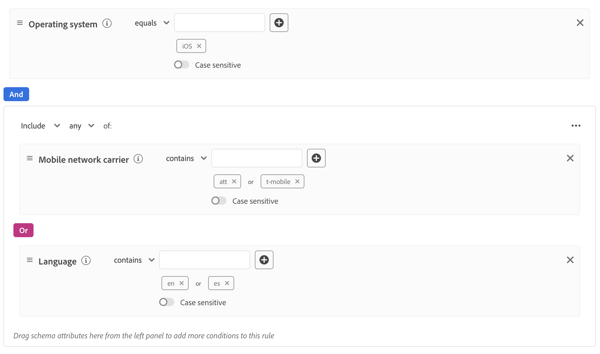

# Dynamische gegevensstroomconfiguraties maken

>[!AVAILABILITY]
>
>* De optie voor het definiëren van dynamische gegevensstroomconfiguraties is momenteel in Beta beschikbaar voor een beperkt aantal klanten. Neem contact op met uw Adobe-vertegenwoordiger als u toegang tot deze functie wilt krijgen. De documentatie en de functionaliteit kunnen worden gewijzigd.

Door gebrek, verzendt Experience Platform Edge Network alle gebeurtenissen die een gegevensstroom aan alle Experience Cloud [&#x200B; diensten &#x200B;](configure.md#add-services) bereiken die u voor uw gegevensstromen hebt toegelaten. Dit is wellicht niet altijd de ideale workflow voor u, afhankelijk van uw gebruiksgevallen.

De dynamische configuraties van gegevensstroom richten deze zorg door gebruiker-configureerbare reeksen regels die u voor elke dienst bepaalt die voor uw gegevensstroom wordt toegelaten, die dicteren welke oplossing Experience Cloud elk type van gegevens zou moeten ontvangen.

## Vereisten {#prerequisites}

Om een dynamische configuratie voor uw gegevensstroom tot stand te brengen, zijn er twee voorwaarden u moet ontmoeten:

* U moet *minstens* één gegevensstroom hebben gecreeerd om met te werken. Zie de documentatie over hoe te [&#x200B; een datastream &#x200B;](configure.md) voor gedetailleerde informatie tot stand brengen.
* U moet *minstens* één dienst van Experience Cloud hebben die aan uw gegevensstroom wordt toegevoegd. Zie de documentatie over hoe te [&#x200B; om de dienst &#x200B;](configure.md#add-services) aan een datastream voor gedetailleerde informatie toe te voegen.

Nadat u een datastream hebt gecreeerd en de dienst van Experience Cloud aan het toegevoegd, kunt u dan [&#x200B; een dynamische configuratie &#x200B;](#create-dynamic-configuration) creëren.

## Guardrails {#guardrails}

Dynamische gegevensstroomconfiguraties hebben specifieke beperkingen en prestatiebeperkingen om optimale systeemprestaties en efficiëntie van gegevensverwerking te garanderen. De volgende instructies zijn van toepassing wanneer u dynamische gegevensstroomregels configureert:

| Guardrail | Limiet | Type limiet |
|---------|------------|------|
| Maximumaantal dynamische gegevensstroomconfiguraties per gegevensstroom voor Experience Platform-services | 5 | Prestatiegerichting |
| Maximumaantal dynamische gegevensstroomconfiguraties per gegevensstroom voor het doorsturen van gebeurtenissen | 5 | Prestatiegerichting |
| Maximumaantal dynamische gegevensstroomconfiguraties per gegevensstroom voor Adobe Analytics | 5 | Prestatiegerichting |
| Maximumaantal dynamische gegevensstroomconfiguraties per gegevensstroom voor Adobe Target | 5 | Prestatiegerichting |
| Maximumaantal dynamische gegevensstroomconfiguraties per gegevensstroom voor Adobe Audience Manager | 5 | Prestatiegerichting |
| Maximumaantal voorwaarden (voorspelling) dat u kunt combineren binnen één regel | 100 | Prestatiegerichting |
| Maximale tijd die is toegestaan voor het evalueren van alle dynamische gegevensstroomconfiguraties per gegevensstroom voordat de timing wordt uitgezet | 25 ms | Door het systeem afgedwongen geleiding |

## Dynamische gegevensstroomconfiguraties versus gegevensstroomconfiguratie overschrijft {#dynamic-versus-overrides}

De dynamische configuraties van de gegevensstroom en [&#x200B; datastream configuratietreedt met voeten &#x200B;](overrides.md) zijn wederzijds exclusieve functies.

Dit betekent dat u geen dynamische configuraties van de gegevensstroom samen met de configuratieoverschrijvingen van de gegevensstroom kunt gebruiken. U moet een van beide kiezen.

Als u zowel dynamische configuraties van de gegevensstroom als de configuratieoverschrijvingen van de gegevensstroom toelaat, zullen de configuratieoverschrijvingen belangrijkheid nemen en de dynamische regels van de gegevensstroomconfiguratie zullen worden genegeerd.

## Een dynamische gegevensstroomconfiguratie maken {#create-dynamic-configuration}

Nadat u [&#x200B; een datastream &#x200B;](configure.md) hebt gecreeerd en [&#x200B; de dienst &#x200B;](configure.md#add-services) aan het toegevoegd, volg de stappen hieronder om een dynamische configuratie aan de dienst toe te voegen.

1. Ga naar de pagina **[!UICONTROL Data Collection]** > **[!UICONTROL Datastreams]** en selecteer de gegevensstroom die u hebt gemaakt.

   

1. Selecteer de optie **[!UICONTROL Edit]** op de service waarvoor u een dynamische configuratie wilt definiëren.

   

1. Selecteer **[!UICONTROL Save and Edit Dynamic Configuration]** op de pagina **[!UICONTROL Configure]** .

   

1. Selecteer **[!UICONTROL Add Dynamic Configuration]**.

   

1. Sleep vanuit het deelvenster **[!UICONTROL Resources]** de items waarmee u de lijn wilt maken naar de rechterkant van het venster. U kunt veelvoudige middelen combineren om complexe regels te bouwen.

   Gebruik de opties van elke bron, zoals **[!UICONTROL equals]** , **[!UICONTROL does not equal]** , **[!UICONTROL exists]** en meer, om de regels te perfectioneren.

   

1. Schakel in de sectie **[!UICONTROL Configuration]** de services in of uit die u voor elke regel wilt in- of uitschakelen, afhankelijk van het feit of u de gegevens naar elke service wilt verzenden. Als u de knevel weg zet, wordt de dienst verpletterend onbruikbaar gemaakt en *geen gegevens* zal naar de stroomopwaartse dienst worden verzonden.

   

1. Wanneer u klaar bent met het configureren van de regels, selecteert u **[!UICONTROL Save]** .

## Prioriteitsoverwegingen voor regels {#considerations}

U kunt veelvoudige regels voor elke dynamische configuratie van de gegevensstroom bepalen. Als uw gegevens echter overeenkomen met de voorwaarden van meerdere regels, wordt alleen de eerste overeenkomende regel in de lijst in aanmerking genomen en worden alle andere overeenkomende regels genegeerd.

Om de gewenste gegevens te bereiken die gedrag verpletteren, let op de orde waarin u de regels schikt.

Om de regelorde te vormen, kunt u de regelvensters in de orde slepen u wilt.

## Subsidiabiliteitscriteria voor regels {#eligibility-criteria}

Dynamische gegevensstroomconfiguraties moeten voldoen aan specifieke criteria om in aanmerking te komen voor hoge prestaties, onderhoudsgemak en duidelijkheid. Hieronder staan de belangrijkste vereisten en beste praktijken voor het definiëren van regels.

### Ondersteunde gegevenstypen {#supported-data-types}

De dynamische regels van de gegevensstroomconfiguratie werken met specifieke gegevenstypes om optimale prestaties en betrouwbare gegevens te verzekeren die verpletteren. Als u begrijpt welke gegevenstypen worden ondersteund, kunt u effectieve regels maken die uw gegevens efficiënt verwerken.

| Gegevenstype | Status | Notities |
|-----------|--------|-------|
| String | Toegestaan | - |
| Getal (geheel getal, lang, kort, byte) | Toegestaan | - |
| Enum | Toegestaan | - |
| Boolean | Toegestaan | - |
| Datum | Toegestaan | - |
| Array | Niet toegestaan | Regels die op arrays zijn gebaseerd, worden niet ondersteund omdat de prestaties hierdoor kunnen afnemen. |
| Kaart | Niet toegestaan | Regels die zijn gebaseerd op kaarten worden niet ondersteund, omdat de prestaties hierdoor kunnen afnemen. |

### Ondersteunde operatoren {#supported-operators}

De regels kunnen de volgende exploitanten, afhankelijk van het gegevenstype gebruiken:

| Gegevenstype | Ondersteunde operatoren |
|-----------|-------------------|
| **Koord** | `equals`, `starts with`, `ends with`, `contains`, `exists`, `does not equal`, `does not start with`, `does not end with`, `does not contain`, `does not exist` |
| **Aantal (Lang, Geheel, Kort, Byte)** | `equals`, `does not equal`, `greater than`, `less than`, `greater than or equal to`, `less than or equal to`, `exists`, `does not exist` |
| **Van Boole** | `equals true/false`, `does not equal true/false` |
| **Enum** | `equals`, `does not equal`, `exists`, `does not exist` |
| **Datum** | `today`, `yesterday`, `this month`, `this year`, `custom date`, `in last`, `from`, `during`, `within`, `before`, `after`, `rolling range`, `in next`, `exists`, `does not exist` |
| **Logisch** | `INCLUDE`, `ANY/ALL` (equivalent aan AND/OR) |

>[!NOTE]
>
>De operator **[!UICONTROL EXCLUDE]** wordt niet rechtstreeks ondersteund, maar u kunt equivalente logica bereiken met **[!UICONTROL INCLUDE]** met genegeerde vergelijkingsoperatoren (bijvoorbeeld &quot;is niet gelijk&quot;).

### Regelstructuur {#rule-structure}

Wanneer het creëren van regels voor dynamische configuraties van de gegevensstroom, is het belangrijk om de structurele vereisten te begrijpen die optimale prestaties en systeemverenigbaarheid verzekeren. De regelstructuur is rechtstreeks van invloed op de efficiëntie waarmee uw gegevens worden verwerkt en via het systeem worden geleid.

**slechts vlakke uitdrukkingen van het Gebruik**. U moet regels definiëren als platte logische expressies. Geneste logische expressies (met containers of meerdere niveaus van AND/OR) worden niet ondersteund. Als u complexe logica nodig hebt, breek het in veelvoudige vlakke regels.

Neem bijvoorbeeld de complexe lijn die in de onderstaande afbeelding wordt getoond.

U kunt deze regel in de volgende eenvoudigere regels breken:

**vermijd complexe regels**. Eenvoudigere regels zorgen voor een snellere evaluatie en betere onderhoudsmogelijkheden.

### Best practices {#best-practices}

De volgende beste praktijken wanneer het creëren van dynamische regels van de gegevensstroomconfiguratie verzekert optimale prestaties, systeembetrouwbaarheid, en onderhoudsbare configuraties. Deze richtlijnen helpen u gemeenschappelijke valkuilen te vermijden en efficiënte regels tot stand te brengen die naadloos met de architectuur van het platform werken.

* **houd regels eenvoudig en vlak.** Als u complexe logica wilt uitdrukken, gebruikt u meerdere regels in plaats van te nesten.
* **Gebruik slechts [&#x200B; gesteunde gegevenstypes &#x200B;](#supported-data-types) en [&#x200B; exploitanten &#x200B;](#supported-operators).**
* **Test uw regels voor prestaties.** Te complexe of niet-ondersteunde regels kunnen ertoe leiden dat het systeem deze regels afwijst of dat ze van invloed zijn op de systeemprestaties.

