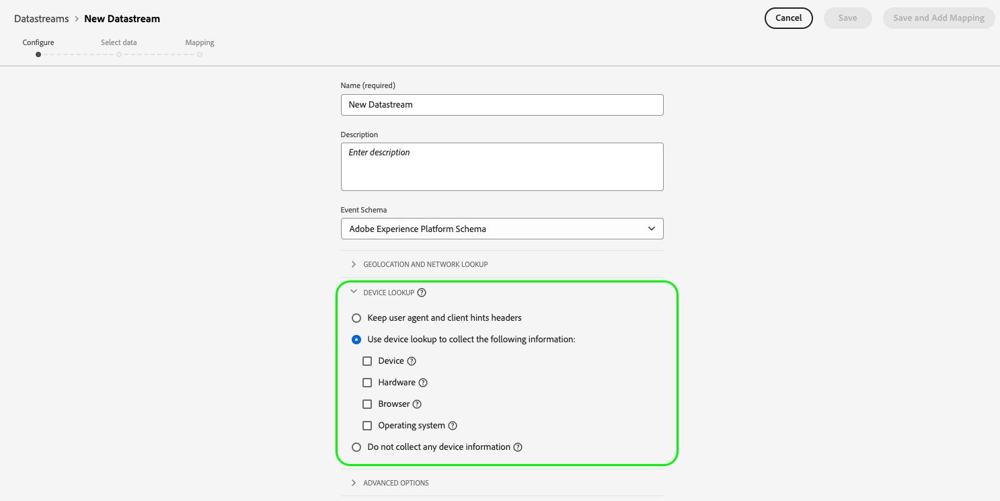

# Gegevensstromen maken en configureren

Dit document behandelt de stappen voor het vormen a [ datastream ](./overview.md) in UI.

## De werkruimte van [!UICONTROL Datastreams] openen

U kunt gegevensstromen in de UI van de Inzameling van Gegevens of UI van Experience Platform tot stand brengen en beheren door **[!UICONTROL Datastreams]** in de linkernavigatie te selecteren.

Op het tabblad **[!UICONTROL Datastreams]** wordt een lijst weergegeven met bestaande gegevensstromen, inclusief de vriendelijke naam, id en datum die als laatste is gewijzigd. Om [ zijn details te bekijken en de diensten ](#view-details) te vormen, selecteer de naam van een gegevensstroom.

Om meer opties voor een bepaalde gegevensstroom te openbaren, selecteer het &quot;meer&quot;pictogram (**...**). Om de [ basisconfiguratie ](#configure) voor de gegevensstroom bij te werken, selecteer **[!UICONTROL Edit]**. Selecteer **[!UICONTROL Delete]** als u de gegevensstroom wilt verwijderen.

## Een gegevensstroom maken {#create}

Als u een gegevensstroom wilt maken, selecteert u **[!UICONTROL New Datastream]** .

De workflow voor het maken van de gegevensstroom wordt weergegeven, te beginnen bij de configuratiestap. Van hier, moet u een naam en een facultatieve beschrijving voor de gegevensstroom verstrekken.

Als u een gegevensstroom voor gebruik in Experience Platform vormt en u ook het Web SDK gebruikt, moet u ook een [ op gebeurtenis-gebaseerde schema van de Gegevens van de Ervaring (XDM) ](../xdm/classes/experienceevent.md) selecteren om de gegevens te vertegenwoordigen u bij het opnemen van plan bent.

### Geolocatie en netwerkopzoekhandeling configureren {#geolocation-network-lookup}

De montages van de geolocatie en van de netwerkraadpleging helpen u het niveau van granulariteit van de geografische en netwerk-vlakke gegevens bepalen die u wilt verzamelen.

Vouw de sectie **[!UICONTROL Geolocation and network lookup]** uit om de hieronder beschreven instellingen te configureren.

| Instelling | Beschrijving |
| --- | --- |
| [!UICONTROL Geo Lookup] | Hiermee schakelt u geolocatiezoekopdrachten voor de geselecteerde opties in op basis van het IP-adres van de bezoeker. Beschikbare opties zijn: <ul><li>**Land**: Populaten `xdm.placeContext.geo.countryCode`</li><li>**Postcode**: Populates `xdm.placeContext.geo.postalCode`</li><li>**Staat/Provincie**: Populaten `xdm.placeContext.geo.stateProvince`</li><li>**DMA**: Populates `xdm.placeContext.geo.dmaID`</li><li>**Stad**: Populates `xdm.placeContext.geo.city`</li><li>**Breedte**: Bevolkt `xdm.placeContext.geo._schema.latitude`</li><li>**Lengte**: Bevolkt `xdm.placeContext.geo._schema.longitude`</li></ul>Als u **[!UICONTROL City]** , **[!UICONTROL Latitude]** of **[!UICONTROL Longitude]** selecteert, krijgt u coördinaten tot twee decimale punten, ongeacht welke andere opties zijn geselecteerd. Dit wordt beschouwd als stad-vlakke granulariteit.    het selecteren van geen optie maakt geolocatieraadplegingen onbruikbaar. Geolocatie vindt plaats vóór [!UICONTROL IP Obfuscation] . Dit houdt in dat dit niet wordt beïnvloed door de instelling [!UICONTROL IP Obfuscation] . |
| [!UICONTROL Network Lookup] | Laat netwerkraadplegingen voor de geselecteerde opties toe die op het IP van de bezoeker adres worden gebaseerd. Beschikbare opties zijn: <ul><li>**Mobiele Drager**: Bevolkt `xdm.environment.carrier`</li><li>**Domein**: Populates `xdm.environment.domain`</li><li>**ISP**: Populates `xdm.environment.ISP`</li><li>**Type van Verbinding**: Bevolkt `xdm.environment.connectionType`</li></ul> |

Als u een van de bovenstaande velden inschakelt voor gegevensverzameling, moet u de array-eigenschap [`context`](/help/web-sdk/commands/configure/context.md) correct instellen wanneer u de Web SDK configureert.

Geolocatie-opzoekvelden gebruiken de `context` arraytekenreeks `"placeContext"` , terwijl netwerkopzoekvelden de `context` arraytekenreeks `"environment"` gebruiken.

Zorg er ook voor dat elk gewenst XDM-veld in uw schema voorkomt. Als dit niet het geval is, kunt u de door Adobe verschafte `Environment Details` veldgroep toevoegen aan uw schema.

### Opzoeken van apparaat configureren {#geolocation-device-lookup}

Met de instellingen van **[!UICONTROL Device Lookup]** kunt u apparaatspecifieke informatie selecteren die u wilt verzamelen.

Vouw de sectie **[!UICONTROL Device Lookup]** uit om de hieronder beschreven instellingen te configureren.

{het configuratiescherm van 0} DataStream met de benadrukte montages van de apparatenraadpleging.

>[!IMPORTANT]
>
>De instellingen in de onderstaande tabel sluiten elkaar uit. U kunt niet zowel gebruikersagent informatie *als* apparaat raadplegingsgegevens tezelfdertijd selecteren.

| Instelling | Beschrijving |
| --- | --- |
| **[!UICONTROL Keep user agent and client hints headers]** | Selecteer deze optie als u alleen de gegevens wilt verzamelen die in de userAgent-tekenreeks zijn opgeslagen. Deze instelling is standaard geselecteerd. Populaten `xdm.environment.browserDetails.userAgent` |
| **[!UICONTROL Use device lookup to collect the following information]** | Selecteer deze optie als u een of meer van de volgende apparaatspecifieke informatie wilt verzamelen: <ul><li>**[!UICONTROL Device]** -informatie:<ul><li>**de fabrikant van het Apparaat**: Bevolkt `xdm.device.manufacturer`</li><li>**model van het Apparaat**: Bevolkt `xdm.device.modelNumber`</li><li>**Marketing naam**: Populates `xdm.device.model`</li></ul></li><li>**[!UICONTROL Hardware]** -informatie: <ul><li>**Type van Hardware**: Bevolkt `xdm.device.type`</li><li>**de hoogte van de Vertoning**: Bevolkt `xdm.device.screenHeight`</li><li>**de breedte van de Vertoning**: Bevolkt `xdm.device.screenWidth`</li><li>**de kleurdiepte van de Vertoning**: Bevolkt `xdm.device.colorDepth`</li></ul></li><li>**[!UICONTROL Browser]** -informatie: <ul><li>**Browser verkoper**: Bevolkt `xdm.environment.browserDetails.vendor`</li><li>**Browser naam**: Bevolkt `xdm.environment.browserDetails.name`</li><li>**Browser versie**: Populates `xdm.environment.browserDetails.version`</li></ul></li><li>**[!UICONTROL Operating system]** -informatie: <ul><li>**OS verkoper**: Bevolkt `xdm.environment.operatingSystemVendor`</li><li>**OS naam**: Bevolkt `xdm.environment.operatingSystem`</li><li>**OS versie**: Populates `xdm.environment.operatingSystemVersion`</li></ul></li></ul>Opzoekgegevens van het apparaat kunnen niet samen met de gebruikersagent en de clienthints worden verzameld. Als u ervoor kiest apparaatinformatie te verzamelen, wordt de verzameling van gebruikersagent- en clienthints uitgeschakeld en andersom. |
| **[!UICONTROL Do not collect any device information]** | Selecteer deze optie als u geen informatie over het zoeken van apparaten wilt verzamelen. Er worden geen apparaat-, hardware-, browser-, besturingssysteem-, gebruikersagent- of clientgegevens verzameld. |

Als u een van de bovenstaande velden inschakelt voor gegevensverzameling, moet u de array-eigenschap [`context`](/help/web-sdk/commands/configure/context.md) correct instellen wanneer u de Web SDK configureert.

Apparaat- en hardwaregegevens gebruiken de `context` arraytekenreeks `"device"` , terwijl browser- en besturingssysteemgegevens de `context` arraytekenreeks `"environment"` gebruiken.

Zorg er ook voor dat elk gewenst XDM-veld in uw schema voorkomt. Als dit niet het geval is, kunt u de door Adobe verschafte `Environment Details` veldgroep toevoegen aan uw schema.

### Geavanceerde opties configureren {#advanced-options}

Selecteer **[!UICONTROL Advanced Options]** om geavanceerde configuratieopties weer te geven. Hier, kunt u extra gegevensstroommontages, zoals IP obfuscation, de koekjes van eerste identiteitskaart van de Partij, en meer vormen.

>[!IMPORTANT]
>
> U bent ervoor verantwoordelijk dat u alle benodigde machtigingen, toestemmingen, toestemmingen, toestemmingen, en toestemming hebt verkregen die krachtens de toepasselijke wetten en verordeningen vereist zijn voor het verzamelen, verwerken en verzenden van persoonlijke gegevens, met inbegrip van nauwkeurige geolocatiegegevens.
> 
> Uw IP selectie van de adresverwarring beïnvloedt niet het niveau van geolocatieinformatie die uit het IP adres wordt afgeleid en naar uw gevormde oplossingen van Adobe wordt verzonden. Geolocation lookups moeten worden beperkt of afzonderlijk worden uitgeschakeld.

| Instelling | Beschrijving |
| --- | --- |
| [!UICONTROL IP Obfuscation] | Geeft het type IP-verduistering aan dat op de gegevensstroom moet worden toegepast. Om het even welke verwerking die op klantIP wordt gebaseerd wordt beïnvloed door IP het obfuseren plaatsen. Dit geldt ook voor alle Experience Cloud-services die gegevens van uw gegevensstroom ontvangen. 
Beschikbare opties:
 <ul><li>**[!UICONTROL None]**: Schakelt IP-verduistering uit. Het volledige gebruikersIP adres wordt verzonden via de datastream.</li><li>**[!UICONTROL Partial]**: Voor IPv4-adressen wordt het laatste octet van het IP-adres van de gebruiker verborgen. Voor IPv6 adressen, verduistert de laatste 80 beetjes van het adres. 
Voorbeelden:
 <ul><li>IPv4: `1.2.3.4` -> `1.2.3.0`</li><li>IPv6: `2001:0db8:1345:fd27:0000:ff00:0042:8329` -> `2001:0db8:1345:0000:0000:0000:0000:0000`</li></ul></li><li>**[!UICONTROL Full]**: Verduistert het volledige IP adres. 
Voorbeelden:
 <ul><li>IPv4: `1.2.3.4` -> `0.0.0.0`</li><li>IPv6: `2001:0db8:1345:fd27:0000:ff00:0042:8329` -> `0:0:0:0:0:0:0:0`</li></ul></li></ul> Invloed van IP-verduistering op andere Adobe-producten: <ul><li>**Adobe Target**: Het datastream-niveau [!UICONTROL IP obfuscation] wordt toegepast vóór [!UICONTROL IP obfuscation] uitgevoerd in Adobe Target, op alle IP adressen aanwezig op het verzoek. Als de optie op gegevensstroomniveau [!UICONTROL IP obfuscation] bijvoorbeeld is ingesteld op **[!UICONTROL Full]** en de optie Adobe Target IP-verduistering is ingesteld op **[!UICONTROL Last octet obfuscation]** , ontvangt Adobe Target een volledig verduisterde IP. Als de gegevensstroom-vlakke [!UICONTROL IP obfuscation] optie aan **[!UICONTROL Partial]** wordt geplaatst en de optie van de Verduistering van Adobe Target IP wordt geplaatst aan **[!UICONTROL Full]**, ontvangt Adobe Target gedeeltelijk verduisterde IP, en past dan de volledige verduistering op het toe. De verwarring van Adobe Target IP wordt beheerd onafhankelijk van datastream één. Zie de documentatie van Adobe Target op [ IP verduistering ](https://experienceleague.adobe.com/docs/target-dev/developer/implementation/privacy/privacy.html?lang=nl-NL) en [ geolocation ](https://experienceleague.adobe.com/docs/target/using/audiences/create-audiences/categories-audiences/geo.html?lang=nl-NL) voor meer details.</li><li>**Audience Manager**: Het datastream-niveau [!UICONTROL IP obfuscation] plaatsen wordt toegepast vóór [!UICONTROL IP obfuscation] uitgevoerd in Audience Manager, op alle IP adressen aanwezig in het verzoek. Elke opzoekhandeling van de geolocatie door Audience Manager wordt beïnvloed door de optie op gegevensstroomniveau [!UICONTROL IP obfuscation] . Een opzoekhandeling naar een geolocatie in Audience Manager, gebaseerd op een volledig verduisterde IP, resulteert in een onbekend gebied en alle segmenten op basis van de resulterende geolocatiegegevens worden niet uitgevoerd. Zie de documentatie van Audience Manager op [ IP verduistering ](https://experienceleague.adobe.com/docs/audience-manager/user-guide/features/administration/ip-obfuscation.html?lang=nl-NL) voor meer details.</li><li>**Adobe Analytics**: Als het gegevensbestand-vlakke IP obfuscation plaatsen aan **[!UICONTROL Full]** wordt geplaatst, behandelt Adobe Analytics het IP adres als leeg. Dit beïnvloedt om het even welke verwerking van Analytics die van IP adres, zoals geolocation raadplegingen en IP het filtreren afhangt. Voor Analytics om de onverduisterde of gedeeltelijk verduisterde IP adressen te ontvangen, plaats het IP verduisteren plaatsen aan **[!UICONTROL Partial]** of **[!UICONTROL None]**. Gedeeltelijk verduisterde en onverduisterde IP adressen kunnen verder worden verduisterd binnen Analytics. Zie Adobe Analytics [ documentatie ](https://experienceleague.adobe.com/docs/analytics/admin/admin-tools/manage-report-suites/edit-report-suite/report-suite-general/general-acct-settings-admin.html?lang=nl-NL) voor details op hoe te om IP verwarring in Analytics toe te laten. Als het IP adres volledig verduisterd is en de paginacrek noch [!DNL ECID] noch [!DNL VisitorID] heeft, dan laat Analytics de slag vallen eerder dan het produceren van identiteitskaart van de a [ Fallback ](https://experienceleague.adobe.com/docs/id-service/using/reference/analytics-reference/analytics-ids.html?lang=nl-NL), die gedeeltelijk op het IP adres gebaseerd is.</li></ul> |
| [!UICONTROL First Party ID Cookie] | Wanneer toegelaten, vertelt dit het plaatsen Edge Network om naar een gespecificeerd koekje te verwijzen wanneer het omhoog a [ eerste-partijapparaat identiteitskaart ](../web-sdk/identity/first-party-device-ids.md) kijkt, eerder dan het kijken omhoog deze waarde in de Kaart van de Identiteit.   wanneer het toelaten van dit het plaatsen, moet u de naam van het koekje verstrekken dat identiteitskaart zou moeten opslaan. |
| [!UICONTROL Third Party ID Sync] | De syncs van identiteitskaart kunnen in containers worden gegroepeerd om verschillende syncs van identiteitskaart toe te laten om op verschillende tijden worden in werking gesteld. Als deze instelling is ingeschakeld, kunt u opgeven welke container met id-syncs wordt uitgevoerd voor deze gegevensstroom. |
| [!UICONTROL Third Party ID Sync Container ID] | De numerieke id van de container die wordt gebruikt voor synchronisatie van externe id&#39;s. |
| [!UICONTROL Container ID Overrides] | In deze sectie kunt u aanvullende id&#39;s van de synchronisatiecontainer van derden definiëren waarmee u de standaard id&#39;s kunt overschrijven. |
| [!UICONTROL Access Type] | Definieert het verificatietype dat de Edge Network accepteert voor de gegevensstroom. <ul><li>**[!UICONTROL Mixed Authentication]**: Als deze optie is geselecteerd, accepteert de Edge Network zowel geverifieerde als niet-geverifieerde aanvragen. Selecteer deze optie wanneer u van plan bent om het Web SDK of [ Mobiele SDK ](https://developer.adobe.com/client-sdks/home/), samen met [ Edge Network API ](https://developer.adobe.com/data-collection-apis/docs/api/) te gebruiken. </li><li>**[!UICONTROL Authenticated Only]**: Als deze optie is geselecteerd, accepteert de Edge Network alleen geverifieerde aanvragen. Selecteer deze optie als u alleen de Edge Network API wilt gebruiken en niet-geverifieerde aanvragen door de Edge Network moeten worden verwerkt.</li></ul> |
| [!UICONTROL Media Analytics] | Laat verwerking van het stromen volgen gegevens voor de integratie van Edge Network via Experience Platform SDKs of [ Media Edge API ](https://developer.adobe.com/cja-apis/docs/endpoints/media-edge/getting-started/) toe. Leer over Analytics van Media van de [ documentatie ](https://experienceleague.adobe.com/docs/media-analytics/using/media-overview.html?lang=nl-NL). |

Van hier, als u uw gegevensstroom voor Experience Platform vormt, volg het leerprogramma op [ Prep van Gegevens voor de Inzameling van Gegevens ](./data-prep.md) om uw gegevens aan een de gebeurtenisschema van Experience Platform in kaart te brengen alvorens aan deze gids terug te keren. Anders selecteert u **[!UICONTROL Save]** en gaat u verder naar de volgende sectie.

## Gegevens gegevensstroom weergeven {#view-details}

Nadat u een nieuwe gegevensstroom hebt geconfigureerd of een bestaande gegevensstroom hebt geselecteerd, wordt de detailpagina voor die gegevensstroom weergegeven. Hier vindt u meer informatie over de gegevensstroom, inclusief de bijbehorende id.

Van het scherm van gegevensstroomdetails, kunt u [ de diensten ](#add-services) toevoegen om mogelijkheden van de producten van Adobe Experience Cloud toe te laten u toegang tot hebt. U kunt de 0&rbrace; basisconfiguratie van de gegevensstroom [&#128279;](#create) ook uitgeven, zijn [ kaartregels ](./data-prep.md) bijwerken, [ exemplaar de datastream ](#copy), of het volledig schrappen.

## Services toevoegen aan een gegevensstroom {#add-services}

Selecteer op de detailpagina van een gegevensstroom **[!UICONTROL Add Service]** om de beschikbare services voor die gegevensstroom toe te voegen.

Voor het volgende scherm, gebruik dropdown menu om de dienst te selecteren voor deze gegevensstroom te vormen. Alleen de services waartoe u toegang hebt, worden in deze lijst weergegeven.

Selecteer de gewenste service, vul de configuratieopties in die worden weergegeven en selecteer vervolgens **[!UICONTROL Save]** om de service aan de gegevensstroom toe te voegen. Alle toegevoegde diensten verschijnen in de detailmening voor de gegevensstroom.

 worden toegevoegd

In de onderstaande subsecties worden de configuratieopties voor elke service beschreven.

>[!NOTE]
>
>Elke serviceconfiguratie bevat een schakeloptie **[!UICONTROL Enabled]** die automatisch wordt geactiveerd wanneer de service wordt geselecteerd. Als u de geselecteerde service voor deze gegevensstroom wilt uitschakelen, selecteert u de **[!UICONTROL Enabled]** -schakeloptie opnieuw.

### Adobe Analytics-instellingen {#analytics}

Deze service bepaalt of en hoe gegevens naar Adobe Analytics worden verzonden. Zie [ verzendend gegevens naar Adobe Analytics ](/help/web-sdk/use-cases/adobe-analytics.md).

| Instelling | Beschrijving |
| --- | --- |
| [!UICONTROL Report Suite ID] | **(Vereist)** identiteitskaart van de het rapportreeks van Analytics die u gegevens naar wilt verzenden. U vindt deze id in de gebruikersinterface van Adobe Analytics onder [!UICONTROL Admin] > [!UICONTROL ReportSuites] . Als de veelvoudige rapportreeksen worden gespecificeerd, dan worden de gegevens gekopieerd aan elke rapportreeks. |
| [!UICONTROL Visitor ID namespace] | (Facultatief) namespace u voor Adobe Analytics [ bezoekorID ](https://experienceleague.adobe.com/docs/analytics/implementation/vars/config-vars/visitorid.html?lang=nl-NL) wilt gebruiken. Wanneer u een gebeurtenis verzendt met een waarde die voor deze naamruimte is opgegeven, wordt deze automatisch gebruikt als `visitorID` in Analytics. |
| [!UICONTROL Report Suite Overrides] | In deze sectie, kunt u extra rapportreeks IDs toevoegen die u kunt gebruiken om het gebrek met voeten te treden. |

### Adobe Audience Manager-instellingen {#audience-manager}

Deze service bepaalt of en hoe gegevens naar Adobe Audience Manager worden verzonden. U kunt deze sectie alleen inschakelen als u gegevens naar Audience Manager wilt verzenden. De andere instellingen zijn optioneel, maar worden wel aangemoedigd.

| Instelling | Beschrijving |
| --- | --- |
| [!UICONTROL Cookie Destinations Enabled] | Staat SDK toe om segmentinformatie via [ koekjesbestemmingen ](https://experienceleague.adobe.com/docs/audience-manager/user-guide/features/destinations/custom-destinations/create-cookie-destination.html?lang=nl-NL) van [!DNL Audience Manager] te delen. |
| [!UICONTROL URL Destinations Enabled] | Staat SDK toe om segmentinformatie via [ te delen bestemmingen URL ](https://experienceleague.adobe.com/docs/audience-manager/user-guide/features/destinations/custom-destinations/create-url-destination.html?lang=nl-NL) van [!DNL Audience Manager]. |

### Adobe Experience Platform-instellingen {#aep}

>[!IMPORTANT]
>
>Wanneer u een gegevensstroom voor Experience Platform inschakelt, moet u rekening houden met de Experience Platform-sandbox die u momenteel gebruikt, zoals wordt weergegeven in het bovenste lint van de gebruikersinterface.
>
>
>
>Sandboxen zijn virtuele partities in Adobe Experience Platform waarmee u uw gegevens en implementaties kunt isoleren van die in uw organisatie. Wanneer een gegevensstroom is gemaakt, kan de sandbox niet meer worden gewijzigd. Voor meer details over de rol van zandbakken in Experience Platform, zie de [ zandbakdocumentatie ](../sandboxes/home.md).

Deze service bepaalt of en hoe gegevens naar Adobe Experience Platform worden verzonden.

| Instelling | Beschrijving |
|---| --- |
| [!UICONTROL Event Dataset] | **(Vereist)** Selecteer de dataset van Experience Platform dat de gegevens van de klantengebeurtenis zullen worden gestroomd aan. Dit schema moet de [ klasse XDM ExperienceEvent ](../xdm/classes/experienceevent.md) gebruiken. Selecteer **[!UICONTROL Add Event Dataset]** als u aanvullende gegevenssets wilt toevoegen. |
| [!UICONTROL Profile Dataset] | Selecteer de dataset van Experience Platform waarnaar de gegevens van de klantenattributen zullen worden verzonden. Dit schema moet de [ individuele klasse van het Profiel XDM ](../xdm/classes/individual-profile.md) gebruiken. |
| [!UICONTROL Offer Decisioning] | Hiermee schakelt u Offer Decisioning for Web SDK-implementaties in. Zie de gids op [ gebruikend Offer Decisioning met het Web SDK ](../web-sdk/personalization/offer-decisioning/offer-decisioning-overview.md) voor meer implementatiedetails.   voor meer informatie over de mogelijkheden van Offer Decisioning, verwijs naar de [ documentatie van Adobe Journey Optimizer ](https://experienceleague.adobe.com/docs/journey-optimizer/using/offer-decisioning/get-started-decision/starting-offer-decisioning.html?lang=nl-NL). |
| [!UICONTROL Edge Segmentation] | Laat [ randsegmentatie ](../segmentation/methods/edge-segmentation.md) voor deze gegevensstroom toe. Wanneer het [ Web SDK ](../web-sdk/home.md) of [ Edge Network API ](https://developer.adobe.com/data-collection-apis/docs/api/) gegevens door een gegevensstroom met toegelaten randsegmentatie verzendt, worden om het even welke bijgewerkte publiekslidmaatschappen voor het profiel in kwestie teruggestuurd in de reactie.   u kunt deze optie in combinatie met **[!UICONTROL Personalization Destinations]** voor zelfde-pagina en volgende-pagina het gebruiksgevallen van het verpersoonlijkingsgebruik door [ randbestemmingen ](../destinations/ui/activate-edge-personalization-destinations.md) of [!DNL Offer Decisioning] gebruiken. |
| [!UICONTROL Personalization Destinations] | Wanneer het toelaten van dit na het toelaten van [!UICONTROL Edge Segmentation] checkbox, staat deze optie de datastream toe om met verpersoonlijkingsbestemmingen, zoals [ Douane Personalization ](../destinations/catalog/personalization/custom-personalization.md) te verbinden.   verwijs naar de bestemmingsdocumentatie voor specifieke stappen op [ vormend verpersoonlijkingsbestemmingen ](../destinations/ui/activate-edge-personalization-destinations.md). |
| [!UICONTROL Adobe Journey Optimizer] | Laat [ Adobe Journey Optimizer ](https://experienceleague.adobe.com/docs/journey-optimizer/using/ajo-home.html?lang=nl-NL) voor deze gegevensstroom toe.    Als u deze optie inschakelt, kan de gegevensstroom gepersonaliseerde inhoud van binnenkomende campagnes via het web en op apps gebaseerde campagnes retourneren in [!DNL Adobe Journey Optimizer] . Deze optie is alleen actief in [!UICONTROL Edge Segmentation] . Als [!UICONTROL Edge Segmentation] niet is ingeschakeld, wordt deze optie grijs weergegeven. |

### Adobe Target-instellingen {#target}

Deze service bepaalt of en hoe gegevens naar Adobe Target worden verzonden.

| Instelling | Beschrijving |
| --- | --- |
| [!UICONTROL Property Token] | [!DNL Target] staat klanten toe om toestemmingen te controleren door eigenschappen te gebruiken. Voor meer informatie over eigenschappen, zie de gids over [ het vormen ondernemingstoestemmingen ](https://experienceleague.adobe.com/docs/target/using/administer/manage-users/enterprise/properties-overview.html?lang=nl-NL) in de [!DNL Target] documentatie.   Het bezitstoken kan in Adobe Target UI onder [!UICONTROL Setup] worden gevonden > [!UICONTROL Properties]. |
| [!UICONTROL Target Environment ID] | [ Milieu&#39;s in Adobe Target ](https://experienceleague.adobe.com/docs/target/using/administer/hosts.html?lang=nl-NL) helpen u uw implementatie door alle stadia van ontwikkeling beheren. Deze instelling geeft aan welke omgeving u wilt gebruiken voor deze gegevensstroom.   beste praktijken moeten dit voor elk van uw `dev`, `stage`, en `prod` gegevensstroommilieu&#39;s verschillend plaatsen om dingen eenvoudig te houden. Als u echter al Adobe Target-omgevingen hebt gedefinieerd, kunt u deze gebruiken. |
| [!UICONTROL Target Third Party ID namespace] | De naamruimte voor de identiteit van de `mbox3rdPartyId` die u voor deze gegevensstroom wilt gebruiken. Als u een [!DNL Customer Attributes] integratie met Adobe Target gebruikt of `thirdPartyId` gebruikt om profielen via [ Profiles API van Adobe Target ](https://experienceleague.adobe.com/nl/docs/target-dev/developer/api/profile-apis/profiles-api) bij te werken of tot stand te brengen, moet u een namespacewaarde van uw keus verstrekken. U moet deze naamruimte gebruiken in de `IdentityMap` -sectie van uw XDM-schema om de `customerID` of `thirdPartyId` te verzenden die worden gebruikt in het uploaden van het bestand met klantkenmerken of in de API-aanroepen voor het bijwerken van het profiel.  Zie de gids bij [ het uitvoeren `mbox3rdPartyId` met het Web SDK ](../web-sdk/personalization/adobe-target/using-mbox-3rdpartyid.md) voor meer informatie. |
| [!UICONTROL Property Token Overrides] | In deze sectie kunt u aanvullende eigenschapstokens definiëren die u kunt gebruiken om de standaardtokens te overschrijven. |

### [!UICONTROL Event Forwarding] instellingen

Deze dienst controleert of en hoe het gegeven wordt verzonden naar [ gebeurtenis door:sturen ](../tags/ui/event-forwarding/overview.md).

| Instelling | Beschrijving |
| --- | --- |
| [!UICONTROL Launch Property] | **(Vereist)** de gebeurtenis die bezit door:sturen dat u gegevens naar wilt verzenden. |
| [!UICONTROL Launch Environment] | **(Vereist)** het milieu binnen het geselecteerde bezit dat u gegevens naar wilt verzenden. |

>[!NOTE]
>
>U kunt **[!UICONTROL Manually enter IDs]** selecteren om de naam van de eigenschap en omgeving in te voeren in plaats van de vervolgkeuzemenu&#39;s te gebruiken.

## Een gegevensstroom kopiëren {#copy}

U kunt een kopie van een bestaande gegevensstroom maken en de details ervan desgewenst wijzigen.

>[!NOTE]
>
>De stromen van gegevens kunnen slechts binnen de zelfde [ zandbak ](../sandboxes/home.md) worden gekopieerd. Met andere woorden, u kunt geen gegevensstroom van één zandbak aan een andere kopiëren.

Van de belangrijkste pagina in de [!UICONTROL Datastreams] werkruimte, selecteer de ellips (**...** ) voor de gegevensstroom in kwestie, dan uitgezocht **[!UICONTROL Copy]**.

U kunt ook **[!UICONTROL Copy Datastream]** selecteren in de weergave Details van een bepaalde gegevensstroom.

Er wordt een bevestigingsdialoogvenster weergegeven waarin u wordt gevraagd een unieke naam op te geven voor de nieuwe gegevensstroom die moet worden gemaakt, en waarin u informatie kunt vinden over de configuratieopties waarover u de gegevens wilt kopiëren. Selecteer **[!UICONTROL Copy]** als u klaar bent.

De hoofdpagina van de [!UICONTROL Datastreams] -werkruimte wordt opnieuw weergegeven met de nieuwe gegevensstroom.

## Volgende stappen

Deze gids behandelde hoe te om gegevensstromen in de Inzameling van Gegevens UI te beheren. Voor meer informatie over hoe te om het Web SDK na vestiging te installeren en te vormen een datastream, verwijs naar de [ gids van de Inzameling E2E van Gegevens van de Gegevens ](../collection/e2e.md#install).
