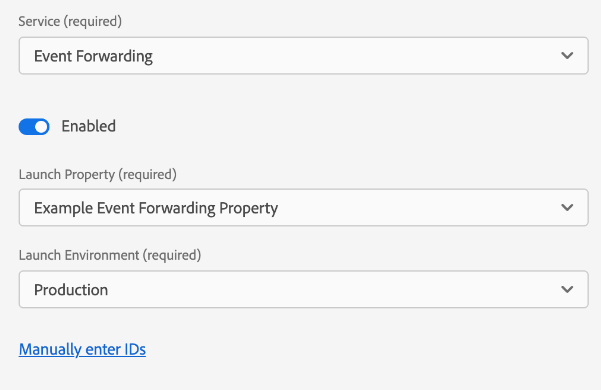

# Een gegevensstroom configureren

In dit document worden de stappen beschreven voor het configureren van een [datastream](./overview.md) in de gebruikersinterface.

## Toegang krijgen tot de [!UICONTROL Datastreams] werkruimte

U kunt gegevensstromen in de UI van de Inzameling van Gegevens of UI van het Experience Platform tot stand brengen en beheren door te selecteren **[!UICONTROL Datastreams]** in de linkernavigatie.

De **[!UICONTROL Datastreams]** wordt een lijst weergegeven met bestaande gegevensstromen, inclusief de vriendelijke naam, id en datum die als laatste is gewijzigd. Selecteer de naam van een gegevensstroom die u wilt [Bekijk zijn details en vorm de diensten](#view-details).

Selecteer het pictogram Meer (**...**) voor een bepaalde gegevensstroom om meer opties weer te geven. Selecteren **[!UICONTROL Edit]** om de [basisconfiguratie](#configure) voor de gegevensstroom, of selecteer **[!UICONTROL Delete]** om de gegevensstroom te verwijderen.

## Een nieuwe gegevensstroom maken {#create}

Als u een gegevensstroom wilt maken, selecteert u **[!UICONTROL New Datastream]**.

De workflow voor het maken van de gegevensstroom wordt weergegeven, te beginnen bij de configuratiestap. Van hier, moet u een naam en een facultatieve beschrijving voor de gegevensstroom verstrekken.

Als u deze gegevensstroom voor gebruik in Experience Platform vormt en SDK van het Web van het Platform gebruikt, moet u ook selecteren [op gebeurtenissen gebaseerd XDM-schema (Experience Data Model)](../xdm/classes/experienceevent.md) om de gegevens te vertegenwoordigen u bij het opnemen bent.

Selecteren **[!UICONTROL Advanced Options]** om extra controles te openbaren om de gegevensstroom te vormen.

 {#advanced-options}

>[!IMPORTANT]
>
> U bent ervoor verantwoordelijk dat u alle benodigde machtigingen, toestemmingen, toestemmingen, toestemmingen en toestemming hebt verkregen die vereist zijn krachtens de toepasselijke wet- en regelgeving voor het verzamelen, verwerken en verzenden van persoonlijke gegevens, inclusief nauwkeurige geolocatiegegevens.
> 
> Uw IP selectie van de adresverwarring beïnvloedt niet het niveau van geolocatieinformatie die van het IP adres zal worden afgeleid en naar uw gevormde oplossingen van de Adobe zal worden verzonden. Geolocation lookups moeten worden beperkt of afzonderlijk worden uitgeschakeld.

| Instelling | Beschrijving |
| --- | --- |
| [!UICONTROL Geo Lookup] | Hiermee schakelt u geolocatiezoekopdrachten voor de geselecteerde opties in op basis van het IP-adres van de bezoeker. Voor het opzoeken van Geolocatie moet u de [`placeContext`](../edge/data-collection/automatic-information.md#place-context) gebiedsgroep in uw configuratie van SDK van het Web.   Beschikbare opties: <ul><li>Land</li><li>Postcode</li><li>Staat/provincie</li><li>DMA</li><li>Plaats</li><li>Breedtegraad </li><li>Lengtegraad</li></ul>Selecteren **[!UICONTROL City]**, **[!UICONTROL Latitude]**, of **[!UICONTROL Longitude]** biedt coördinaten tot twee decimale punten, ongeacht welke andere opties zijn geselecteerd. Dit wordt beschouwd als granulariteit op stadsniveau.    Als u geen enkele optie selecteert, worden geolocatieopzoekingen uitgeschakeld. Geolocatie komt voor [!UICONTROL IP Obfuscation] en niet door de  [!UICONTROL IP Obfuscation] instellen. |
| [!UICONTROL Network Lookup] | Laat netwerkraadplegingen voor de geselecteerde opties toe, die op het bezoekerIP adres worden gebaseerd. De raadpleging van het netwerk vereist u om te omvatten [`Environment`](../edge/data-collection/automatic-information.md#environment) gebiedsgroep in uw configuratie van SDK van het Web.   Beschikbare opties: <ul><li>Vervoerder</li><li>Domein</li><li>ISP</li></ul>Gebruik deze opties om meer informatie aan andere diensten over het specifieke netwerk te verstrekken waar de verzoeken voortvloeiden. |
| [!UICONTROL IP Obfuscation] | Geeft het type IP-verduistering aan dat op de gegevensstroom moet worden toegepast. Om het even welke verwerking die op klantIP wordt gebaseerd zal door IP het obfuseren plaatsen worden beïnvloed. Dit omvat alle diensten van het Experience Cloud die gegevens van uw gegevensstroom ontvangen. 
Beschikbare opties:
 <ul><li>**[!UICONTROL None]**: Schakelt IP-verduistering uit. Het volledige IP-adres van de gebruiker wordt via de gegevensstroom verzonden.</li><li>**[!UICONTROL Partial]**: Voor IPv4 adressen, verduistert het laatste octet van het gebruikersIP adres. Voor IPv6 adressen, verduistert de laatste 80 beetjes van het adres. 
Voorbeelden:
 <ul><li>IPv4: `1.2.3.4` -> `1.2.3.0`</li><li>IPv6: `2001:0db8:1345:fd27:0000:ff00:0042:8329` -> `2001:0db8:1345:0000:0000:0000:0000:0000`</li></ul></li><li>**[!UICONTROL Full]**: Verduistert het volledige IP adres. 
Voorbeelden:
 <ul><li>IPv4: `1.2.3.4` -> `0.0.0.0`</li><li>IPv6: `2001:0db8:1345:fd27:0000:ff00:0042:8329` -> `0:0:0:0:0:0:0:0`</li></ul></li></ul> Het effect van IP-verduistering op andere Adobe producten: <ul><li>**Adobe Target**: Het gegevensstroomniveau [!UICONTROL IP obfuscation] het plaatsen neemt belangrijkheid over om het even welke IP die optieoptie in Adobe Target wordt geplaatst. Bijvoorbeeld wanneer het gegevensstroomniveau [!UICONTROL IP obfuscation] optie is ingesteld op **[!UICONTROL Full]** en de optie van de Verduistering van Adobe Target IP wordt geplaatst aan **[!UICONTROL Last octet obfuscation]** Adobe Target zal een volledig verduisterde IP ontvangen. Zie de Adobe Target documentatie op [IP obfuscatie](https://developer.adobe.com/target/before-implement/privacy/privacy/) en [geolocatie](https://experienceleague.adobe.com/docs/target/using/audiences/create-audiences/categories-audiences/geo.html?lang=en) voor meer informatie .</li><li>**Audience Manager**: De gegevensstroom-vlakke IP obfuscation die voorrang over om het even welke IP die optieoptie neemt in Audience Manager wordt geplaatst, en het wordt toegepast op alle IP adressen. Elke opzoekhandeling van de geolocatie door de Audience Manager wordt beïnvloed door het niveau van de gegevensstroom [!UICONTROL IP obfuscation] -optie. Een opzoekhandeling naar een geolocatie in de Audience Manager, gebaseerd op een volledig verduisterde IP, resulteert in een onbekend gebied en alle segmenten op basis van de resulterende geolocatiegegevens worden niet uitgevoerd. Zie de documentatie van de Audience Manager op [IP obfuscatie](https://experienceleague.adobe.com/docs/audience-manager/user-guide/features/administration/ip-obfuscation.html?lang=en) voor meer informatie .</li><li>**Adobe Analytics**: Adobe Analytics ontvangt momenteel de gedeeltelijk verduisterde IP adressen als om het even welke IP verduisteringsoptie, buiten NONE wordt geselecteerd. Voor Analytics om volledig verduisterde IP adressen te ontvangen, moet u IP verduistering afzonderlijk vormen, in Adobe Analytics. Dit gedrag wordt in toekomstige versies bijgewerkt. Zie de Adobe Analytics [documentatie](https://experienceleague.adobe.com/docs/analytics/admin/admin-tools/manage-report-suites/edit-report-suite/report-suite-general/general-acct-settings-admin.html) voor details op hoe te om IP verwarring in Analytics toe te laten.</li></ul> |
| [!UICONTROL First Party ID Cookie] | Als deze instelling is ingeschakeld, geeft het Edge Network de opdracht naar een opgegeven cookie te verwijzen wanneer u een [apparaat-id van eerste partij](../edge/identity/first-party-device-ids.md)in plaats van deze waarde op te zoeken in het identiteitsoverzicht.  Als u deze instelling inschakelt, moet u de naam opgeven van het cookie waarop de id moet worden opgeslagen. |
| [!UICONTROL Third Party ID Sync] | De syncs van identiteitskaart kunnen in containers worden gegroepeerd om verschillende syncs van identiteitskaart toe te laten om op verschillende tijden worden in werking gesteld. Als deze instelling is ingeschakeld, kunt u opgeven welke container met id-syncs wordt uitgevoerd voor deze gegevensstroom. |
| [!UICONTROL Third Party ID Sync Container ID] | De numerieke id van de container die wordt gebruikt voor synchronisatie van externe id&#39;s. |
| [!UICONTROL Container ID Overrides] | In deze sectie kunt u aanvullende id&#39;s van de synchronisatiecontainer van derden definiëren waarmee u de standaard id&#39;s kunt overschrijven. |
| [!UICONTROL Access Type] | Bepaalt het authentificatietype dat het Netwerk van de Rand voor de gegevensstroom goedkeurt. <ul><li>**[!UICONTROL Mixed Authentication]**: Als deze optie is geselecteerd, accepteert het Edge-netwerk zowel geverifieerde als niet-geverifieerde aanvragen. Selecteer deze optie als u de SDK van het Web wilt gebruiken of [Mobile SDK](https://developer.adobe.com/client-sdks/documentation/), samen met de [Server-API](../server-api/overview.md). </li><li>**[!UICONTROL Authenticated Only]**: Als deze optie is geselecteerd, accepteert het Edge-netwerk alleen geverifieerde aanvragen. Selecteer deze optie als u alleen de server-API wilt gebruiken en niet-geverifieerde aanvragen niet door het Edge-netwerk moeten worden verwerkt.</li></ul> |

Als u vanaf hier uw gegevensstroom configureert voor Experience Platform, volgt u de zelfstudie [Gegevensvoorvoegsel voor gegevensverzameling](./data-prep.md) om uw gegevens toe te wijzen aan een de gebeurtenisschema van het Platform alvorens aan deze gids terug te keren. Anders selecteert u **[!UICONTROL Save]** en ga verder met de volgende sectie.

## Gegevens gegevensstroom weergeven {#view-details}

Nadat u een nieuwe gegevensstroom hebt geconfigureerd of een bestaande gegevensstroom hebt geselecteerd, wordt de detailpagina voor die gegevensstroom weergegeven. Hier vindt u meer informatie over de gegevensstroom, inclusief de bijbehorende id.

Vanuit het scherm met gegevensstroomdetails kunt u [toevoegen, services](#add-services) om functies in te schakelen van de Adobe Experience Cloud-producten waartoe u toegang hebt. U kunt de gegevensstroom ook uitgeven [basisconfiguratie](#create), werkt de [toewijzingsregels](./data-prep.md), [de gegevensstroom kopiëren](#copy), of deze volledig verwijderen.

## Services toevoegen aan een gegevensstroom {#add-services}

Selecteer op de detailpagina van een gegevensstroom de optie **[!UICONTROL Add Service]** om de beschikbare services voor die gegevensstroom toe te voegen.

Voor het volgende scherm, gebruik dropdown menu om de dienst te selecteren voor deze gegevensstroom te vormen. Alleen de services waartoe u toegang hebt, worden in deze lijst weergegeven.

Selecteer de gewenste service, vul de configuratieopties in die worden weergegeven en selecteer **[!UICONTROL Save]** om de dienst aan de datastream toe te voegen. Alle toegevoegde diensten verschijnen in de detailmening voor de gegevensstroom.

In de onderstaande subsecties worden de configuratieopties voor elke service beschreven.

>[!NOTE]
>
>Elke de dienstconfiguratie bevat **[!UICONTROL Enabled]** schakelt die automatisch wordt geactiveerd wanneer de service wordt geselecteerd. Als u de geselecteerde service voor deze gegevensstroom wilt uitschakelen, selecteert u de **[!UICONTROL Enabled]** weer schakelen.

### Adobe Analytics-instellingen {#analytics}

Deze service bepaalt of en hoe gegevens naar Adobe Analytics worden verzonden. Meer informatie vindt u in de handleiding op [gegevens verzenden naar Analytics](../edge/data-collection/adobe-analytics/analytics-overview.md).

| Instelling | Beschrijving |
| --- | --- |
| [!UICONTROL Report Suite ID] | **(Vereist)** De id van de Analytics-rapportsuite waarnaar u gegevens wilt verzenden. Deze id is te vinden in de gebruikersinterface van Adobe Analytics onder [!UICONTROL Admin] > [!UICONTROL ReportSuites]. Als de veelvoudige rapportreeksen worden gespecificeerd, dan worden de gegevens gekopieerd aan elke rapportreeks. |
| [!UICONTROL Report Suite Overrides] | In deze sectie, kunt u extra rapportreeks IDs toevoegen die u kunt gebruiken om het gebrek met voeten te treden. |

### Adobe Audience Manager-instellingen {#audience-manager}

Deze service bepaalt of en hoe gegevens naar Adobe Audience Manager worden verzonden. Alles wat nodig is om gegevens naar de Audience Manager te verzenden, moet deze sectie inschakelen. De andere instellingen zijn optioneel, maar worden wel aangemoedigd.

| Instelling | Beschrijving |
| --- | --- |
| [!UICONTROL Cookie Destinations Enabled] | Staat SDK toe om segmentinformatie via te delen [koekjesbestemmingen](https://experienceleague.adobe.com/docs/audience-manager/user-guide/features/destinations/custom-destinations/create-cookie-destination.html) van [!DNL Audience Manager]. |
| [!UICONTROL URL Destinations Enabled] | Staat SDK toe om segmentinformatie via te delen [URL-doelen](https://experienceleague.adobe.com/docs/audience-manager/user-guide/features/destinations/custom-destinations/create-url-destination.html) van [!DNL Audience Manager]. |

### Adobe Experience Platform-instellingen {#aep}

>[!IMPORTANT]
>
>Wanneer het toelaten van een gegevensstroom voor Platform, neem nota van de zandbak van het Platform die u momenteel gebruikt, zoals getoond in het hoogste lint van UI.
>
>
>
>Sandboxen zijn virtuele partities in Adobe Experience Platform waarmee u uw gegevens en implementaties kunt isoleren van die in uw organisatie. Wanneer een gegevensstroom is gemaakt, kan de sandbox niet meer worden gewijzigd. Zie voor meer informatie over de rol van sandboxen in het Experience Platform de klasse [sandboxdocumentatie](../sandboxes/home.md).

Deze service bepaalt of en hoe gegevens naar Adobe Experience Platform worden verzonden.

| Instelling | Beschrijving |
|---| --- |
| [!UICONTROL Event Dataset] | **(Vereist)** Selecteer de dataset van het Platform dat de gegevens van de klantengebeurtenis zullen worden gestroomd aan. Dit schema moet de [XDM ExperienceEvent, klasse](../xdm/classes/experienceevent.md). Als u aanvullende gegevenssets wilt toevoegen, selecteert u **[!UICONTROL Add Event Dataset]**. |
| [!UICONTROL Profile Dataset] | Selecteer de dataset van het Platform dat de gegevens van de klantenattributen zullen worden verzonden naar. Dit schema moet de [Afzonderlijke XDM-profielklasse](../xdm/classes/individual-profile.md). |
| [!UICONTROL Offer Decisioning] | Selecteer dit checkbox om Offer decisioning voor een implementatie van SDK van het Web van het Platform toe te laten. Zie de handleiding op [het gebruiken van Offer decisioning met het Web SDK van het Platform](../edge/personalization/offer-decisioning/offer-decisioning-overview.md) voor meer details over de implementatie.  Raadpleeg voor meer informatie over de mogelijkheden van Offer decisioning de [Adobe Journey Optimizer-documentatie](https://experienceleague.adobe.com/docs/journey-optimizer/using/offer-decisioniong/get-started/starting-offer-decisioning.html?lang=nl). |
| [!UICONTROL Edge Segmentation] | Schakel dit selectievakje in om in te schakelen [randsegmentatie](../segmentation/ui/edge-segmentation.md) voor deze gegevensstroom. Wanneer de SDK gegevens via een voor edge-segmentatie ingeschakelde gegevensstroom verzendt, worden bijgewerkte segmentlidmaatschappen voor het profiel in kwestie teruggestuurd in de reactie.  Deze optie kan in combinatie met [!UICONTROL Personalization Destinations] for [gebruiksgevallen voor personalisatie op de volgende pagina](../destinations/ui/activate-edge-personalization-destinations.md). |
| [!UICONTROL Personalization Destinations] | Wanneer u deze optie inschakelt nadat u het [!UICONTROL Edge Segmentation] checkbox, staat deze optie de datastream toe om met verpersoonlijkingsbestemmingen, zoals te verbinden [Aangepaste personalisatie](../destinations/catalog/personalization/custom-personalization.md).  Raadpleeg de documentatie bij bestemmingen voor specifieke stappen over [het vormen verpersoonlijkingsbestemmingen](../destinations/ui/activate-edge-personalization-destinations.md). |
| [!UICONTROL Adobe Journey Optimizer] | Schakel dit selectievakje in om in te schakelen [Adobe Journey Optimizer](https://experienceleague.adobe.com/docs/journey-optimizer/using/ajo-home.html) voor deze gegevensstroom.    Als u deze optie inschakelt, kan de gegevensstroom gepersonaliseerde inhoud van binnenkomende webcampagnes en op apps gebaseerde campagnes retourneren in [!DNL Adobe Journey Optimizer]. Deze optie is vereist [!UICONTROL Edge Segmentation] om actief te zijn. Indien [!UICONTROL Edge Segmentation] is uitgeschakeld, wordt deze optie grijs weergegeven. |

### Adobe Target-instellingen {#target}

Deze service bepaalt of en hoe gegevens naar Adobe Target worden verzonden.

| Instelling | Beschrijving |
| --- | --- |
| [!UICONTROL Property Token] | [!DNL Target] staat klanten toe om toestemmingen door het gebruik van eigenschappen te controleren. Zie de handleiding voor meer informatie over eigenschappen [configureren van bedrijfsmachtigingen](https://experienceleague.adobe.com/docs/target/using/administer/manage-users/enterprise/properties-overview.html) in de [!DNL Target] documentatie.  Het eigenschapstoken vindt u in de gebruikersinterface van Adobe Target onder [!UICONTROL Setup] > [!UICONTROL Properties]. |
| [!UICONTROL Target Environment ID] | [Milieu in Adobe Target](https://experienceleague.adobe.com/docs/target/using/administer/hosts.html) helpen u bij het beheren van uw implementatie in alle ontwikkelingsstadia. Deze instelling geeft aan welke omgeving u wilt gebruiken voor deze gegevensstroom.  De beste manier is om dit voor elk van uw `dev`, `stage`, en `prod` gegevensstroomomgevingen om dingen eenvoudig te houden. Als u echter al Adobe Target-omgevingen hebt gedefinieerd, kunt u deze gebruiken. |
| [!UICONTROL Target Third Party ID namespace] | De naamruimte voor de identiteit van de `mbox3rdPartyId` wilt gebruiken voor deze gegevensstroom. Zie de handleiding op [uitvoeren `mbox3rdPartyId` met de Web SDK](../edge/personalization/adobe-target/using-mbox-3rdpartyid.md) voor meer informatie . |
| [!UICONTROL Property Token Overrides] | In deze sectie kunt u aanvullende eigenschapstokens definiëren die u kunt gebruiken om de standaardtokens te overschrijven. |

### [!UICONTROL Event Forwarding] instellingen

Deze service bepaalt of en hoe gegevens worden verzonden naar [gebeurtenis doorsturen](../tags/ui/event-forwarding/overview.md).

| Instelling | Beschrijving |
| --- | --- |
| [!UICONTROL Launch Property] | **(Vereist)** De gebeurtenis die bezit door:sturen dat u gegevens naar wilt verzenden. |
| [!UICONTROL Launch Environment] | **(Vereist)** De omgeving binnen de geselecteerde eigenschap waarnaar u gegevens wilt verzenden. |

>[!NOTE]
>
>U kunt **[!UICONTROL Manually enter IDs]** om in de bezit en omgevingsnamen in plaats van het gebruiken van dropdown menu&#39;s te typen.

## Een gegevensstroom kopiëren {#copy}

U kunt een kopie van een bestaande gegevensstroom maken en de details ervan desgewenst wijzigen.

>[!NOTE]
>
>Gegevensstromen kunnen alleen worden gekopieerd binnen dezelfde map [sandbox](../sandboxes/home.md). Met andere woorden, u kunt geen gegevensstroom van één zandbak aan een andere kopiëren.

Vanaf de hoofdpagina in het dialoogvenster [!UICONTROL Datastreams] werkruimte, selecteert u de ellips (**...**) voor de gegevensstroom in kwestie, dan selecteren **[!UICONTROL Copy]**.

![Afbeelding die de [!UICONTROL Copy] optie die wordt geselecteerd in de lijstweergave van de gegevensstroom](assets/configure/copy-datastream-list.png)

U kunt ook **[!UICONTROL Copy Datastream]** in de detailweergave van een bepaalde gegevensstroom.

![Afbeelding die de [!UICONTROL Copy] optie die wordt geselecteerd uit de datastream detailweergave](assets/configure/copy-datastream-details.png)

Er wordt een bevestigingsdialoogvenster weergegeven waarin u wordt gevraagd een unieke naam op te geven voor de nieuwe gegevensstroom die moet worden gemaakt, en waarin u informatie kunt vinden over de configuratieopties waarover u de gegevens wilt kopiëren. Indien klaar, selecteert u **[!UICONTROL Copy]**.

De hoofdpagina van de [!UICONTROL Datastreams] wordt de werkruimte opnieuw weergegeven met de nieuwe gegevensstroom die wordt weergegeven.

## Volgende stappen

Deze gids behandelde hoe te om gegevensstromen in de Inzameling van Gegevens UI te beheren. Voor meer informatie over om SDK van het Web na vestiging een gegevensstroom te installeren en te vormen, verwijs naar [E2E-handleiding voor gegevensverzameling](../collection/e2e.md#install).
