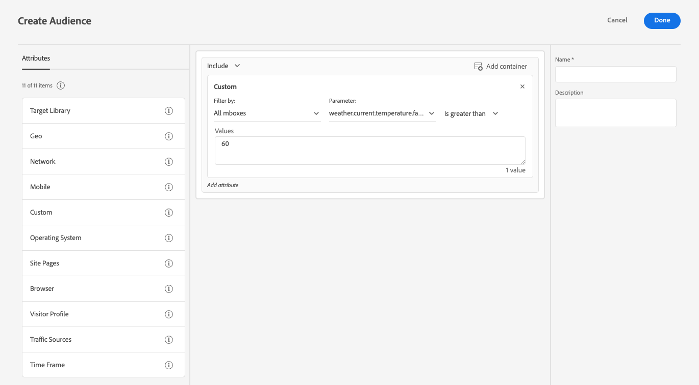

# Verbeter gegevensverzameling met weersgegevens van [!DNL The Weather Channel]

Adobe heeft samengewerkt met [[!DNL [The Weather Company]]](https://www.ibm.com/weather) om de extra context van het weer in de Verenigde Staten te brengen aan de gegevens die via gegevensstreams worden verzameld. U kunt deze gegevens gebruiken voor analyses, doelgroepen en het maken van doelgroepen in Experience Platform.

Er zijn drie typen gegevens beschikbaar via [!DNL The Weather Channel] :

* **[!UICONTROL Current Weather]**: De huidige weersomstandigheden van de gebruiker, op basis van hun locatie. Dit omvat de huidige temperatuur, neerslag, wolkendekking en meer.
* **[!UICONTROL Forecasted Weather]**: De voorspelling omvat de voorspelling van 1, 2, 3, 5, 7 en 10 dagen voor de gebruikerslocatie.
* **[!UICONTROL Triggers]**: Triggers zijn specifieke combinaties die zijn toegewezen aan verschillende semantische weersomstandigheden. Er zijn drie verschillende soorten weertriggers:

   * **[!UICONTROL Weather Triggers]**: semantisch betekenisvolle omstandigheden, zoals koud of regenachtig weer. Deze kunnen in de definities verschillen tussen de verschillende klimatologische omstandigheden.
   * **[!UICONTROL Product Triggers]**: voorwaarden die tot de aankoop van verschillende soorten producten zouden leiden. Voorbeelden hiervan zijn koudweerprognoses die kunnen betekenen dat de aankoop van regenjassen waarschijnlijker wordt.
   * **[!UICONTROL Severe Weather Triggers]**: Ernstige weerswaarschuwingen, zoals winterstorm- of orkaanwaarschuwingen.

## Vereisten {#prerequisites}

Voordat u weergegevens gebruikt, moet u controleren of aan de volgende voorwaarden is voldaan:

* U moet een licentie geven voor de weergegevens die u gebruikt vanuit [!DNL The Weather Channel] . Ze zullen het dan inschakelen op je account.
* Weer-gegevens zijn alleen beschikbaar via gegevensstreams. Om weergegevens te gebruiken, moet u [!DNL Web SDK] gebruiken, [!DNL Mobile Edge Extension] of [ Edge Network API ](https://developer.adobe.com/data-collection-apis/docs/api/) om deze gegevens te omvatten.
* Voor uw gegevensstroom moet [[!UICONTROL Geo Location]](../configure.md#advanced-options) zijn ingeschakeld.
* Voeg de [ groep van het weergebied ](#schema-configuration) aan het schema toe dat u gebruikt.

## Inrichting {#provisioning}

Nadat u een licentie voor de gegevens van [!DNL The Weather Channel] hebt verkregen, kan uw account toegang krijgen tot de gegevens. Vervolgens moet u contact opnemen met de klantenservice van Adobe om de gegevens op uw gegevensstroom in te schakelen. Als deze optie is ingeschakeld, worden de gegevens automatisch toegevoegd.

U kunt controleren of het wordt toegevoegd door een randspoor met debugger in werking te stellen of door Assurance te gebruiken om een klap door [!DNL Edge Network] te vinden.

### Schema-configuratie {#schema-configuration}

U moet de groepen van het weergebied aan uw schema van Experience Platform toevoegen die aan de gebeurtenisdataset beantwoorden u in uw gegevensstroom gebruikt. Er zijn vijf veldgroepen beschikbaar:

* [!UICONTROL Forecasted Weather]
* [!UICONTROL Current Weather]
* [!UICONTROL Product Triggers]
* [!UICONTROL Relative Triggers]
* [!UICONTROL Severe Weather Triggers]

## Toegang tot de weergegevens {#access-weather-data}

Zodra u beschikt over een licentie en de gegevens beschikbaar zijn, kunt u deze op verschillende manieren openen in de Adobe-services.

### Adobe Analytics {#analytics}

In [!DNL Adobe Analytics] zijn de weergegevens beschikbaar voor toewijzing via verwerkingsregels, samen met de rest van het [!DNL XDM] -schema.

U kunt de lijst van gebieden vinden die u in de [ Web van de weerverwijzing ](weather-reference.md) pagina kunt in kaart brengen. Net als bij alle schema&#39;s van [!DNL XDM] , worden de toetsen voorafgegaan door `a.x` . Een veld met de naam `weather.current.temperature.farenheit` wordt bijvoorbeeld weergegeven in [!DNL Analytics] as `a.x.weather.current.temperature.farenheit` .

### Adobe Customer Journey Analytics {#cja}

In [!DNL Adobe Customer Journey Analytics] zijn de weergegevens beschikbaar in de gegevensset die in de gegevensstroom is opgegeven. Zolang de weerattributen [ aan uw schema ](#prerequisites-prerequisites) worden toegevoegd, zijn zij beschikbaar aan [ toevoegen aan een gegevensmening ](https://experienceleague.adobe.com/docs/analytics-platform/using/cja-dataviews/create-dataview.html?lang=nl-NL) in [!DNL Customer Journey Analytics].

### Real-Time Customer Data Platform {#rtcdp}

De gegevens van het Weer zijn beschikbaar in [ Real-Time Customer Data Platform ](../../rtcdp/overview.md), voor gebruik in publiek. Weezelgegevens worden gekoppeld aan gebeurtenissen.

 toont

Aangezien de weersomstandigheden vaak veranderen, raadt Adobe u aan om tijdbeperkingen in te stellen voor het publiek, zoals in het bovenstaande voorbeeld wordt getoond. Een koude dag in de laatste twee is veel impacter dan een koude dag zes maanden geleden.

Zie [ weerverwijzing ](weather-reference.md) voor de beschikbare gebieden.

### Adobe Target {#target}

In [!DNL Adobe Target] kunt u weergegevens gebruiken om in real-time te personaliseren. Weezelgegevens worden doorgegeven aan [!DNL Target] als [!UICONTROL mBox] -parameters en u kunt deze benaderen via een aangepaste [!UICONTROL mBox] -parameter.

De parameter is het [!DNL XDM] -pad naar een specifiek veld. Zie de [ weerverwijzing ](weather-reference.md) voor de beschikbare gebieden en hun overeenkomstige wegen.

## Volgende stappen {#next-steps}

Na het lezen van dit document hebt u nu een beter inzicht in hoe u weergegevens kunt gebruiken voor verschillende Adobe-oplossingen. Meer over de afbeelding van het het gebied van weergegevens leren, zie de [ verwijzing van de gebiedstoewijzing ](weather-reference.md).
