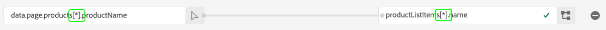

# Gegevensvoorvoegsel voor gegevensverzameling

Data Prep is een Adobe Experience Platform-service waarmee u gegevens kunt toewijzen, transformeren en valideren van en naar [Experience Data Model (XDM)](../xdm/home.md). Wanneer het vormen van een Platform toegelaten [datastream](./overview.md), kunt u de mogelijkheden van de Prep van Gegevens gebruiken om uw brongegevens aan XDM in kaart te brengen wanneer het verzenden van het naar het Netwerk van de Rand van het Platform.

Alle gegevens die vanaf een webpagina worden verzonden, moeten als XDM in Experience Platform worden geplaatst. Er zijn 3 manieren om gegevens van een op pagina gegevenslaag aan XDM te vertalen die door Experience Platform wordt goedgekeurd:

1. Hervorm de gegevenslaag in XDM op de Web-pagina zelf.
2. Met de functionaliteit voor eigen gegevenselementen van tags kunt u de bestaande indeling van een webpagina voor gegevenslagen opnieuw opmaken in XDM.
3. De bestaande indeling van de gegevenslaag van een webpagina via het Edge-netwerk opnieuw indelen in XDM, met Gegevensvoorinstelling voor gegevensverzameling.

Deze handleiding is gericht op de derde optie.

## Wanneer wordt Data Prep gebruikt voor gegevensverzameling {#when-to-use-data-prep}

Er zijn twee gebruiksgevallen waarin Data Prep voor gegevensverzameling nuttig is:

1. De website heeft een goed gevormde, bestuurde en onderhouden gegevenslaag en er is een voorkeur voor het rechtstreeks verzenden van deze laag naar het Edge-netwerk in plaats van het gebruik van JavaScript-manipulatie om deze om te zetten naar XDM op de pagina (via Tags-gegevenselementen of via handmatige JavaScript-manipulatie).
2. Op de site wordt een ander coderingssysteem dan Tags geïmplementeerd.

## Verzend een bestaande gegevenslaag naar het Netwerk van de Rand via WebSDK {#send-datalayer-via-websdk}

De bestaande gegevenslaag moet worden verzonden met de [`data`](/help/web-sdk/commands/sendevent/data.md) object binnen `sendEvent` gebruiken.

Als u Tags gebruikt, moet u de opdracht **[!UICONTROL Data]** van het **[!UICONTROL Send Event]** actietype, zoals beschreven in het dialoogvenster [Web SDK-tagextensiedocumentatie](/help/tags/extensions/client/web-sdk/action-types.md).

De rest van deze gids zal zich op hoe te om de gegevenslaag aan normen in kaart te brengen XDM nadat het door WebSDK is verzonden.

>[!NOTE]
>
>Raadpleeg de volgende documentatie voor uitgebreide informatie over alle mogelijkheden van Data Prep, inclusief transformatiefuncties voor berekende velden:
>
>* [Overzicht van Data Prep](../data-prep/home.md)
>* [Toewijzingsfuncties van Data Prep](../data-prep/functions.md)
>* [Gegevensindelingen verwerken met Data Prep](../data-prep/data-handling.md)

In deze handleiding wordt uitgelegd hoe u uw gegevens in de gebruikersinterface kunt toewijzen. Als u de stappen wilt volgen, start u het proces voor het maken van een gegevensstroom tot (en met) de [basisconfiguratiestap](./overview.md#create).

Raadpleeg de volgende video voor een snelle demonstratie van het proces Gegevensvoorbereiding voor gegevensverzameling:

>[!VIDEO](https://video.tv.adobe.com/v/342120?quality=12&enable10seconds=on&speedcontrol=on)

## [!UICONTROL Select data] {#select-data}

Selecteren **[!UICONTROL Save and Add Mapping]** na de voltooiing van de basisconfiguratie voor een datastream, en **[!UICONTROL Select data]** wordt weergegeven. Van hier, moet u een steekproefJSON voorwerp verstrekken dat de structuur van de gegevens vertegenwoordigt die u bij het verzenden naar Platform van plan bent.

Als u eigenschappen rechtstreeks vanaf uw gegevenslaag wilt vastleggen, moet het JSON-object één basiseigenschap hebben `data`. De subeigenschappen van de `data` Het object moet vervolgens zo worden samengesteld dat het wordt toegewezen aan de eigenschappen van de gegevenslaag die u wilt vastleggen. Selecteer de onderstaande sectie om een voorbeeld weer te geven van een JSON-object met de juiste indeling `data` hoofdmap.

+++JSON-voorbeeldbestand met `data` basis

```json
{
  "data": {
    "eventMergeId": "cce1b53c-571f-4f36-b3c1-153d85be6602",
    "eventType": "view:load",
    "timestamp": "2021-09-30T14:50:09.604Z",
    "web": {
      "webPageDetails": {
        "siteSection": "Product section",
        "server": "example.com",
        "name": "product home",
        "URL": "https://www.example.com"
      },
      "webReferrer": {
        "URL": "https://www.adobe.com/index2.html",
        "type": "external"
      }
    },
    "commerce": {
      "purchase": 1,
      "order": {
        "orderID": "1234"
      }
    },
    "product": [
      {
        "productInfo": {
          "productID": "123"
        }
      },
      {
        "productInfo": {
          "productID": "1234"
        }
      }
    ],
    "reservation": {
      "id": "anc45123xlm",
      "name": "Embassy Suits",
      "SKU": "12345-L",
      "skuVariant": "12345-LG-R",
      "priceTotal": "112.99",
      "currencyCode": "USD",
      "adults": 2,
      "children": 3,
      "productAddMethod": "PDP",
      "_namespace": {
        "test": 1,
        "priceTotal": "112.99",
        "category": "Overnight Stay"
      },
      "freeCancellation": false,
      "cancellationFee": 20,
      "refundable": true
    }
  }
}
```

+++

Als u eigenschappen wilt vastleggen van een gegevenselement van een XDM-object, zijn dezelfde regels van toepassing op het JSON-object, maar moet de eigenschap root worden ingesteld op `xdm` in plaats daarvan. Selecteer de onderstaande sectie om een voorbeeld weer te geven van een JSON-object met de juiste indeling `xdm` hoofdmap.

+++JSON-voorbeeldbestand met `xdm` basis

```json
{
  "xdm": {
    "environment": {
      "type": "browser",
      "browserDetails": {
        "userAgent": "Mozilla/5.0 (Macintosh; Intel Mac OS X 10_7_5) AppleWebkit/537.36 (KHTML, like Gecko) Chrome/49.0.2623.112 Safari/537.36",
        "javaScriptEnabled": true,
        "javaScriptVersion": "1.8.5",
        "cookiesEnabled": true,
        "viewportHeight": 900,
        "viewportWidth": 1680,
        "javaEnabled": true
      },
      "domain": "adobe.com",
      "colorDepth": 24,
      "viewportHeight": 1050,
      "viewportWidth": 1680
    },
    "device": {
      "screenHeight": 1050,
      "screenWidth": 1680
    }
  }
}
```

+++

U kunt de optie selecteren om het object als een bestand te uploaden of het onbewerkte object in het tekstvak dat wordt weergegeven plakken. Als de JSON geldig is, wordt een voorvertoningsschema weergegeven in het rechterdeelvenster. Selecteren **[!UICONTROL Next]** om door te gaan.


>[!NOTE]
>
> Gebruik een voorbeeld-JSON-object dat elk element in een gegevenslaag vertegenwoordigt dat op elke pagina kan worden gebruikt. Niet alle pagina&#39;s gebruiken bijvoorbeeld de gegevenslaagelementen van winkelwagentjes. De elementen voor de laag met winkelwagengegevens moeten echter wel worden opgenomen in dit voorbeeld van het JSON-object.

## [!UICONTROL Mapping]

De **[!UICONTROL Mapping]** wordt weergegeven, zodat u de velden in uw brongegevens kunt toewijzen aan die van het doelgebeurtenisschema in Platform. Van hier, kunt u de afbeelding op twee manieren vormen:

* [Toewijzingsregels maken](#create-mapping) voor deze gegevensstroom via een handmatig proces.
* [Toewijzingsregels importeren](#import-mapping) uit een bestaande gegevensstroom.

### Toewijzingsregels maken {#create-mapping}

Als u een toewijzingsregel wilt maken, selecteert u **[!UICONTROL Add new mapping]**.


Selecteer het bronpictogram () en selecteert u in het dialoogvenster dat wordt weergegeven het bronveld dat u wilt toewijzen in het beschikbare canvas. Als u een veld hebt gekozen, gebruikt u de opdracht **[!UICONTROL Select]** om door te gaan.


Selecteer vervolgens het schemapictogram () om een vergelijkbaar dialoogvenster voor het doelgebeurtenisschema te openen. Kies het veld waaraan u de gegevens wilt toewijzen voordat u bevestigt met **[!UICONTROL Select]**.


De toewijzingspagina wordt opnieuw weergegeven met de voltooide veldtoewijzing weergegeven. De **[!UICONTROL Mapping progress]** sectie wordt bijgewerkt met het totale aantal velden dat is toegewezen.


>[!TIP]
>
>Als u een array van objecten (in het bronveld) wilt toewijzen aan een array van verschillende objecten (in het doelveld), voegt u `[*]` na de arraynaam in de bron- en doelveldpaden, zoals hieronder wordt weergegeven.
>
>

### Bestaande toewijzingsregels importeren {#import-mapping}

Als u eerder een gegevensstroom hebt gecreeerd, kunt u zijn gevormde toewijzingsregels voor een nieuwe gegevensstroom opnieuw gebruiken.

>[!WARNING]
>
>Als u toewijzingsregels uit een andere gegevensstroom importeert, worden alle veldtoewijzingen die u vóór het importeren hebt toegevoegd, overschreven.

Selecteer **[!UICONTROL Import Mapping]**.


Selecteer in het dialoogvenster dat wordt weergegeven de gegevensstroom waarvan u de toewijzingsregels wilt importeren. Wanneer de gegevensstroom is gekozen, selecteert u **[!UICONTROL Preview]**.


>[!NOTE]
>
>Gegevensstromen kunnen alleen worden geïmporteerd binnen dezelfde [sandbox](../sandboxes/home.md). Met andere woorden, u kunt geen gegevensstroom van één zandbak in een andere invoeren.

In het volgende scherm ziet u een voorvertoning van de opgeslagen toewijzingsregels voor de geselecteerde gegevensstroom. Zorg ervoor dat de weergegeven toewijzingen zijn wat u verwacht en selecteer **[!UICONTROL Import]** om de toewijzingen aan de nieuwe gegevensstroom te bevestigen en toe te voegen.


>[!NOTE]
>
>Als een bronveld in de geïmporteerde toewijzingsregels niet is opgenomen in de JSON-voorbeeldgegevens die u [eerder verstrekt](#select-data), worden deze veldtoewijzingen niet opgenomen in de importbewerking.

### De toewijzing voltooien

Ga verder met de bovenstaande stappen om de rest van de velden toe te wijzen aan het doelschema. Hoewel u niet alle beschikbare brongebieden moet in kaart brengen, om het even welke gebieden in het doelschema die zoals vereist worden geplaatst moeten worden in kaart gebracht om deze stap te voltooien. De **[!UICONTROL Required fields]** teller geeft aan hoeveel vereiste velden nog niet zijn toegewezen in de huidige configuratie.

Als het vereiste aantal velden nul heeft bereikt en u tevreden bent met de toewijzing, selecteert u **[!UICONTROL Save]** om uw wijzigingen te voltooien.


## Volgende stappen

In deze handleiding wordt beschreven hoe u uw gegevens aan XDM kunt toewijzen bij het instellen van een gegevensstroom in de gebruikersinterface. Als u de algemene zelfstudie voor gegevensstromen hebt gevolgd, kunt u nu terugkeren naar de volgende stap [gegevensstroomdetails weergeven](./overview.md).
