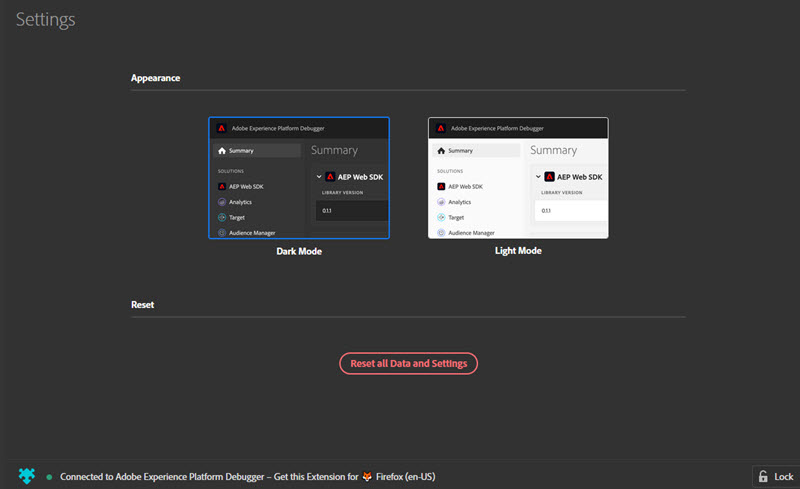

# Experience Platform-foutopsporing configureren

U kunt bepaalde aspecten configureren van hoe Adobe Experience Platform Debugger eruitziet en werkt.

## Licht- of donkermodus

Nadat Debugger van Experience Platform opent, kunt u uw aangewezen verschijning selecteren door **[!UICONTROL Settings]** te gaan en of **Donkere Wijze** (gebrek) of **Lichte Wijze** te selecteren.

## Herstellen

Selecteer **[!UICONTROL Reset all Data and Settings]** als u alle gegevens wilt wissen en de standaardinstellingen wilt herstellen.

## Experience Platform Debugger op één pagina vergrendelen

Als u pagina&#39;s op uw site wijzigt, wordt het venster Experience Platform Debugger bijgewerkt met informatie over die pagina. De naam van de pagina waarmee u verbinding hebt, wordt onder in het scherm weergegeven. Als u Experience Platform Debugger op één pagina vergrendeld wilt houden, selecteert u **[!UICONTROL Lock]** in de rechteronderhoek van het venster Experience Platform Debugger.

Dit is handig als u documentatie leest of informatie op een andere pagina bekijkt tijdens het opsporen van fouten in uw pagina.
