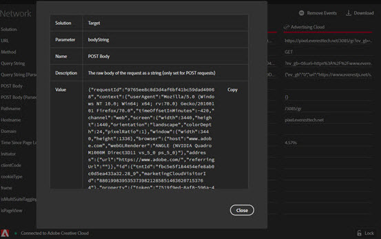

# Het tabblad Netwerk

Het **lusje van het Netwerk** aggregeert alle de oplossingsvraag van Adobe Experience Cloud die op de pagina wordt gemaakt en toont hen in orde van links naar rechts. Standaardparameters worden automatisch geëtiketteerd met vriendelijke namen en gerangschikt om gemeenschappelijke parameters op dezelfde rol te groeperen.

Dit scherm is nuttig om zeer belangrijke waardeparen over klappen te vergelijken. U kunt bevestigen dat de parameters die voor integratie worden gebruikt, zoals identiteitskaart van de Bezoeker van het Experience Cloud of de Supplementaire identiteitskaart van Gegevens, over integraties verenigbaar zijn.

>[!NOTE]
>
>Op dit ogenblik, zijn niet alle parameters die in de oplossingsvraag worden overgegaan (bijvoorbeeld, de contextvariabelen van de Analyse, de douaneparameters van het Doel, of de Klant IDs van de Dienst van identiteitskaart van het Experience Cloud) zichtbaar in het scherm van het Netwerk.

Om de informatie door oplossing te veranderen, selecteer de oplossing u van de lijst in linkernav wilt bekijken. In het volgende voorbeeld wordt alleen Analytics weergegeven:

Selecteer **[!UICONTROL Network]** om alle oplossingen weer te geven

Selecteer op een punt in de mening van het Netwerk om een uitgebreide mening te zien. Vanuit het uitgevouwen weergavevenster kunt u de weergegeven informatie naar het klembord kopiëren.

<!--Use the icon at the top of each column to copy the server call URL to your clipboard, where you can paste it into another document for reference or debugging purposes.

-->

Als u de lijst wilt wissen, selecteert u **[!UICONTROL Remove Events]** .

Selecteer **[!UICONTROL Download]** als u een Excel-bestand met de informatie op dit scherm wilt downloaden.
