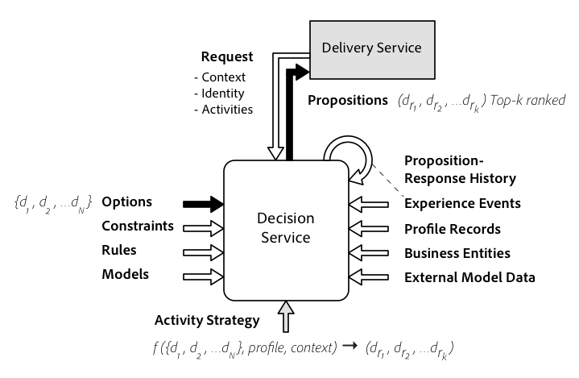

# Ervaar het Beslissen domeinmodel

In deze sectie, worden de componenten van de Beslissende Dienst verklaard en de manieren waarin die componenten interactie aangaan zijn gedetailleerd. De concepten en hun relaties vormen het *domein* van het beslissingsprobleem. Deze fundamentele componenten komen in spel ongeacht hoe u de Dienst van het Beslissen gebruikt.

## Beslissingsopties

Een ervaringsbeslissingsoptie ** is een potentiële ervaring die aan een specifieke klant kan worden gepresenteerd. Een optie wordt ook wel een keuze of een alternatief genoemd. Wanneer het beslissen over de volgende beste optie voor een klant, overweegt de Dienst van Beslissing opties ***d1***aan***dN*** van onder een eindige reeks opties **`D`**.

Besluiten worden genomen door de beste optie te kiezen uit een reeks beschikbare opties. Eén methode is het achtereenvolgens uitsluiten van *beslissingsopties* ***di***uit de set*** D ***totdat er slechts één overblijft en vervolgens willekeurig een &quot;winnaar&quot; uit de resterende set kiezen. Een andere vorm van besluitvorming is het rangschikken van de resterende (in aanmerking komende) beslissingsopties naar hun verwachte resultaat.

### Eindverzameling beslissingsopties

In het domein van het Beslissen van de Ervaring, bestaan de opties waarvan één of meerdere a priori worden geselecteerd en het berekenen van een besluit leidt niet tot nieuwe opties onmiddellijk. We zeggen dat het terrein van de opties eindig is op het moment dat de beslissingen worden genomen. Dit lijkt misschien een beperking, maar een eindige reeks opties geeft aanleiding tot de mogelijkheid om machinaal leeralgoritmen en soortgelijke technieken te gebruiken om te beslissen welke van de opties &quot;de beste&quot; is. Veel leeralgoritmen zouden geen beste optie kunnen produceren onder een reeks oneindige alternatieven die niet met elkaar kunnen worden vergeleken en waarvoor geen steekproefgegevens bestaan.

## Beslissingsresultaten

Het is belangrijk een onderscheid te maken tussen de uitkomsten van het besluit `d` en de uitkomst `o`, d.w.z. de beoogde resultaten die in het besluit zijn vastgelegd. Een besluit kan vaak niet rechtstreeks tot een resultaat leiden. In het besluit wordt alleen de optie geselecteerd (of voorgesteld) met het best verwachte resultaat. Tussen voorstellen en resultaten doen zich veel gebeurtenissen en interacties voor, vaak vertraagd met dagen of weken. In meer formele termen is het resultaat een functie van het besluit `o = f(d)`.

Om de optimale beslissing te vinden wordt aan elk resultaat een ***nutswaarde*** toegewezen `U(o) = U(f(d))`.
Voor de toepassing van de Beslissende van de Aanbieding, zou die functie de kosten berekenen om de aanbieding te vervullen, en de waarde die door de onderneming wordt verworven wanneer de aanbieding door de klant wordt aanvaard. Het resultaat zou worden gebruikt om de optimale beslissing (aanbieding) te vinden door de nutswaarde over alle opties (aanbiedingen) te maximaliseren.

Over het algemeen is het niet mogelijk met zekerheid te voorspellen wat het resultaat van een bepaald besluit zal zijn en daarom is een probabilistische aanpak noodzakelijk. De ***nutswaarde*** `U(o)` wordt de ***verwachte nutswaarde van een beslissingsoptie***`EU(d)`

## Beslissingsvoorstellen

Een *besluitvormingsvoorstel* is een keuze van beslissingsopties die is gemaakt naar aanleiding van een feitelijk verzoek om een beslissing. Zoals hierboven vermeld, kunnen de resultaten van een besluit veel later plaatsvinden en kunnen de resultaten ook niet in één stap worden bereikt. Daarom is het belangrijk om de voorstellen te volgen door middel van verschillende *ervaringen* , zodat ze terug te vinden zijn in de beslissingsopties. Deze feedbacklus wordt gebruikt om de voorspellingsnauwkeurigheid voor `EU(d)`te verbeteren.

Een voorstel blijft bestaan als een entiteit en heeft dus een id. De entiteit bevat verwijzingen naar de geselecteerde opties en kan contextgegevens opnemen die zijn gebruikt bij het nemen van de beslissing. Met een id kunnen andere entiteiten er ook naar verwijzen. Een van die entiteiten is een *beslissingsgebeurtenis*. Het heeft het tijdstempel, dat aangeeft wanneer zijn beslissing (voorstel) is genomen. Een beslissingsgebeurtenis is een geregistreerd feit van de handeling tot uitvoering van de beslissing. Andere gebeurtenissen die verwijzen naar de propositie-entiteit zijn ervaringsgebeurtenissen. Elke ervaringsgebeurtenis kan worden uitgebreid om naar een beslissingsvoorstel te verwijzen. De interpretatie hiervan is dat de ervaringsgebeurtenis geheel of gedeeltelijk kan worden toegeschreven aan het voorstel van het besluit.

## Beslissingsstrategie - Algoritme

Met een eindige reeks alternatieven waaruit kan worden gekozen, is elke *beslissingsstrategie* in wezen een algoritme - of een functie - dat **`N`** beslissingsopties *{d1, d2, ...dN* ** } input neemt en een gerangschikte lijst van beslissingsopties produceert (dr1, dr2. ・ waarbij de eerste beslissingsoptie in de lijst volgens een verwacht nut als optimaal wordt beschouwd, wordt de tweede optie in de resultatenlijst vervolgens als de tweede beste optie beschouwd enzovoort. Doorgaans heeft de set een hogere cardinaliteit dan de resulterende gerangschikte lijst, aangezien het beslissingsalgoritme opties verwijdert die niet in aanmerking komen en een algoritme kan worden geconfigureerd om alleen de bovenste **`K`** opties te retourneren, en stopte nadat er voldoende opties zijn gevonden.
Het algemene besluitvormingskader wordt weergegeven in het volgende diagram.

## Beslissingsactiviteiten

*De besluitvormingsactiviteiten* vormen de algoritme en leveringsparameters voor een specifieke beslissingsstrategie. De strategieparameters omvatten de beperkingen die op de opties en de rangschikkingsfunctie worden toegepast. Alle besluiten worden genomen in het kader van een activiteit. De de gastheren van de Dienst van het besluit vele activiteiten, en de activiteiten kunnen over kanalen worden opnieuw gebruikt. Op elk bepaald ogenblik, wordt de beste optie geëvalueerd gebaseerd op de huidigste reeks beperkingen, regels, en modellen.

Een besluitvormingsactiviteit bepaalt de inzameling van de te overwegen beslissingsopties. De subset van alle opties die voor deze activiteit van belang zijn, wordt uitgefilterd. Hierdoor kan de beslissingsservice de actuele categorieën in de catalogus met alle opties beheren.

Een besluitvormingsactiviteit specificeert een *reserveoptie* als de gecombineerde beperkingen alle andere opties onbruikbaar maken. Dat betekent dat er altijd een antwoord is op de vraag: Wat is momenteel de &quot;beste&quot; optie?

Beslissingsactiviteiten kunnen de plaats bepalen waar de ervaring wordt opgedaan. Dit vermindert het aantal besluitvormingsopties dat in aanmerking kan worden genomen en is een andere beperking die door de besluitvormingsactiviteit wordt opgelegd. Dit wordt de *plaatsingsbeperking* genoemd. Alleen de beslissingsopties met inhoud die aan deze plaatsingsbeperking voldoet, worden in overweging genomen. Dit wordt geëvalueerd in de beginstadia van de besluitvormingsstrategie. Wanneer de definities de plaatsingsbeperkingen van elke beslissingsactiviteit veranderen worden herzien en de beslissingsoptie kan in of buiten beschouwing worden gelaten voor een of meer besluitvormingsactiviteiten.

## Beslissingscontext

Tot dusverre werd alleen de *logica* van het bedrijfsleven beschreven die de beschikking beïnvloedt. Maar nog meer effect voor de output is de inputgegevens ** van het besluit. Deze gegevens worden de *besluitvormingscontext* genoemd en zijn verschillend voor elke gebruiker en telkens als een besluit wordt genomen - in tegenstelling tot beperkingen, regels en modellen die voor verschillende gebruikers voor de zelfde activiteit gelijk zijn. De regels, beperkingen en modellen veranderen ook minder vaak. Voor beslissingen in real-time moet ook in real-time worden bepaald wat de besluitvormingscontext is.

De contextgegevens van beslissingen kunnen worden onderverdeeld in gegevens over gebruikersprofielen, bedrijfsgegevens en intern verzamelde gegevens.

- *Profielentiteiten* worden gebruikt om gegevens van eindgebruikers weer te geven, maar niet elke profielentiteit vertegenwoordigt een individu. Het zou een huishouden, een sociale groep, of een ander onderwerp kunnen zijn. Experience Events zijn gegevensrecords uit de tijdreeks die aan een profiel zijn gekoppeld. Als er ervaring is, dan is deze informatie het *onderwerp* van deze ervaring.
- Aan de andere kant zijn er de *bedrijfsentiteiten*. Ze kunnen worden beschouwd als de *objecten* van de interacties. In de ervaringsgebeurtenissen van profielentiteiten wordt vaak naar deze entiteiten verwezen. Voorbeelden van bedrijfsentiteiten zijn websites en pagina&#39;s, winkels, productdetails, digitale inhoud, productinventarisgegevens enzovoort.
- De laatste categorie gegevens in de besluitvormingscontext is gegevens die tijdens de verrichting van de Beslissingsdienst werden gecreeerd. Elke beslissingsgebeurtenis valt in die categorie, samen met de antwoorden van klanten vormen de propositiegegevens een interne gegevensset die de *propositie-reactie geschiedenis* wordt genoemd.

Er zijn drie wegen de gegevens kunnen nemen om deel van de besluitvormingscontext te worden. Gegevens uit records- en tijdreeksen kunnen via gegevenssetbestanden worden geüpload. Dit pad is voornamelijk bedoeld voor bulksynchronisatie met externe systemen. Gegevens uit een record- en tijdreeks kunnen ook worden gestreamd naar Platform waar de gegevens worden geïndexeerd en aan formulierentiteiten worden gekoppeld. Via het derde pad kunnen contextgegevens als parameters aan het beslissingsverzoek worden doorgegeven. Deze vorm van gegevens is kortstondig van aard en is alleen relevant voor het gevraagde besluit. Het wordt niet als entiteit voortgeduurd en is niet beschikbaar voor andere verzoeken.
