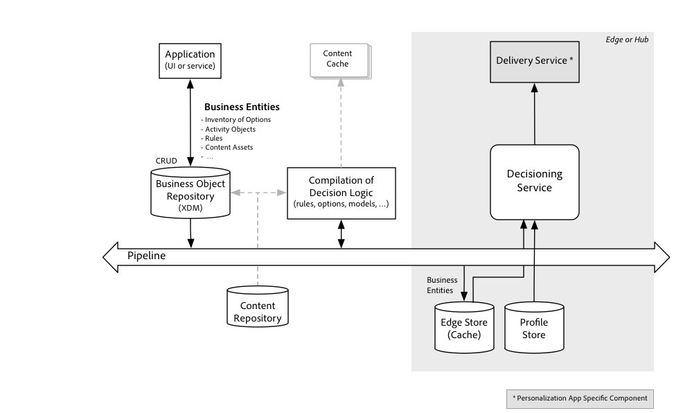

# Overzicht van de beslissingsservice

[!DNL Decisioning Service] biedt de mogelijkheid om persoonlijke, geoptimaliseerde en geordende ervaringen te maken in toepassingen die op het Adobe Experience Platform worden uitgevoerd. Met behulp [!DNL Decisioning Service]van een set beschikbare opties kunt u de beste *optie* bepalen. Deze opties, ook genoemd alternatieven, zouden aanbiedingen, productaanbevelingen, inhoudscomponenten voor een Webervaring, gespreksmanuscripten, en te nemen acties kunnen zijn. Momenteel wordt het gebruiksgeval en het domein van de Beslissing *van de* Aanbieding gesteund, waar de besluitvormingsopties specifiek als aanbiedingen worden gemodelleerd, met steun voor meer te gebruiken gevallen om te komen.

Met [!DNL Decisioning Service], kunnen de klanten bedrijfslogica opnieuw gebruiken en een catalogus van opties over kanalen en toepassingen delen. In plaats van het beheren van besluitvormingsopties - en strategieën om hen te selecteren - diep binnen een toepassing, kunnen zij nu worden leveraged ongeacht wanneer, hoe en op welk kanaal de eindgebruiker van een klant met een zaken of organisatie interactie aangaat.

Beslissingsstrategieën kunnen in de vele interactie een klant, over vele kanalen en toepassingen hebben beïnvloed. De activiteit van een callcenter-toepassing kan bijvoorbeeld een marketingbericht na een klacht enige tijd inschakelen of onderdrukken en dat bericht zelf kan gebaseerd zijn op aankopen en revisies die door de klant zijn geplaatst.

[!DNL Decisioning Service] vergemakkelijkt geëvolueerde ervaringshitvering.

| Voor ervaring met het nemen van beslissingen | After Experience Decisition |
| --- | --- |
| Pas de ervaringen van gebruikers aan en optimaliseer ze met één kanaal of in een kleine set aanraakpunten. | Ervaringen zijn georkestreerde reacties op interacties. |
| De optimalisaties zijn geconcentreerd op één enkele en typisch korte fase van de reis van de eindgebruiker | Besluiten zijn gebaseerd op de volledige interactiegeschiedenis die zich uitstrekken van gedrag dat in het verleden werd ontdekt tot de recentste situationcontext. |
| De opties en de strategieën om te selecteren welke u tijdens de ervaring van een klant wilt presenteren, worden doorgaans diep in een toepassing gecodeerd. | Strategieën voor het selecteren van de beste optie zijn gedefinieerd buiten de kanaalspecifieke toepassingen en worden herbruikbaar. |
| De ervaringen van de klant worden gepersonaliseerd en geoptimaliseerd volgens een simplistisch doel, bijvoorbeeld het aantal geslaagde afrekeningen op een webpagina vergroten of de aanvaarding van een aanbod dat wordt aangeboden in een interactie met een vertegenwoordiger. | De ervaringen van de klant zijn geoptimaliseerd op basis van een holistische interpretatie van de huidige behoeften van de klant en worden aangepast aan alle ervaringen van de gebruiker, goed of slecht. Een marketingcampagne is bijvoorbeeld niet geschikt voor klanten die onlangs een klacht hebben ingediend over een product of service. |

[!DNL Decisioning Service] zet uw ervaring personaliseringsmogelijkheden van het richten in één enkel kanaal tot het bepalen van de algemene fase in de levenscyclus van de betrokkenheid van uw klanten met uw merk onafhankelijk van kanalen. Een levenscyclusfase is veel complexer dan een segmentlidmaatschap en is bijna altijd gebaseerd op complexe gebeurtenisstromen, bedrijfsregels en voorspelde kenmerken.

Andere termen die worden gebruikt door producten en diensten die soortgelijke gebruiksgevallen beogen te bedienen:

- Real-time Interactiebeheer (RTIM)
- Reisbeheer
- Omni-channel marketing en personalisatie
- Beslissing in realtime

## Hoe werkt [!DNL Decisioning Service] het?

Ervaringen kunnen [!DNL Decisioning Service] in real-time worden aangepast, aangezien uw klant via een binnenkomend kanaal, zoals uw site of mobiele app, met uw merk werkt. Het besluit kan ook worden gebruikt om berichten via uitgaand kanaal, zoals een e-mail of dupbericht aan te passen.

Besluiten kunnen op vele manieren worden genomen. U kunt de opties achtereenvolgens verwijderen totdat er maar één optie overblijft of de opties zijn afgebroken en er een subset overblijft of een winnaar willekeurig uit de verlaagde set wordt gekozen. Een variant van deze benadering om de winnende optie volgens een berekende formule te kiezen. Het rangschikken van in aanmerking komende opties wordt verwezenlijkt gebruikend een functie. Voor het bepalen van de aanbieding kan die functie de kosten, de waarde van de aanbieding aan het bedrijf berekenen en een vooraf bepaalde waarschijnlijkheid gebruiken dat de aanbieding door de eindgebruiker wordt aanvaard. De resulterende score kan worden gebruikt om de aanbiedingen te bestellen.

Een strategie kan ook of aanvullend gebaseerd zijn op resultaten die zijn verzameld bij eerdere interacties met vergelijkbare klanten die vergelijkbare opties hebben voorgesteld. In deze strategie, wordt de functie die de prioritaire waarden berekende geleerd. De optimale resultaatwaarde is gekoppeld aan de doelstellingen van de activiteit en de prestatie-indicator voor de voorspelling is hoe vaak het resultaat werd bereikt nadat de optie was voorgesteld.

### Beslissingsstrategie

Beslissingsstrategieën worden geconfigureerd via objecten die _activiteiten_ worden genoemd. Elke beslissingsstrategie is in feite een algoritme of een functie die N-opties {o1, o2, ...oN} als invoer gebruikt en een geordende lijst met opties (o1, o2,...oK) produceert, waarbij de eerste optie in de lijst als de beste wordt beschouwd volgens een optimalisatiecriteria, wordt de tweede optie in de resultatenlijst vervolgens als de tweede beste optie beschouwd enzovoort.

Op elk bepaald tijdstip tijdens de reis van een klant, wordt de beste optie voor een bepaalde activiteit opnieuw geëvalueerd gebaseerd op de huidigste reeks contextvariabelen, regels, en beperkingen. Contextvariabelen omvatten de records die zijn opgeslagen in [!DNL Real Time Customer Profile]. Een centrale recordentiteit is het profiel van een klant, maar andere entiteiten zoals operationele bedrijfsgegevens zijn ook beschikbaar voor de activiteit.

Het algoritme of de functie die de lijst met opties van top-K produceert, varieert met het gebruiksgeval. De interne componenten van dat algoritme zijn verschillend voor verschillende gebruiksgevallen. De componenten worden in een bewaarplaats in ontwerptijd bepaald en &quot;gecompileerd&quot;in instructies voor de gebruiksgeval specifieke beslissingsstrategie.

## Working with [!DNL Decisioning Service]

Net [!DNL Decisioning Service]als andere [!DNL Platform] services neemt de eerste API-filosofie over. Dit betekent dat de API de primaire interface is waar alle functies, inclusief administratieve functies, beschikbaar worden gesteld via API&#39;s. Dit betekent ook dat andere [!DNL Platform] services, Adobe-oplossingen en integraties van derden dezelfde API&#39;s gebruiken.

U kunt [!DNL Decisioning Service] in een synchrone verzoek-reactie interactiemodus gebruiken die door eenvoudige HTTP REST API wordt gefaciliteerd. De API-aanroep retourneert de momenteel beste optie voor één profiel. De selectie van de &quot;momenteel beste optie&quot; verandert op basis van de regels en beperkingen die van toepassing zijn op alle opties die door een bepaalde activiteit in overweging worden genomen. Met de REST API kunt u de volgende beste optie voor meerdere activiteiten tegelijk ophalen. Hierdoor kunnen opties langs verschillende kanalen worden verdeeld. Wanneer reacties voor meerdere activiteiten samen worden verkregen, kunnen aanvullende regels worden toegepast.

### Integratie met andere [!DNL Platform] workflows

Het gebruik van [!DNL Decisioning Service] is optioneel en vereist slechts een paar stappen naast de standaardstappen die nodig zijn om [!DNL Profile] entiteiten te maken en te beheren.

>[!NOTE]
>
>Om het beste uit het [!DNL Real-time Customer Profile], [!DNL Decisioning Service] direct te maken integreert met de profielopslag. De API-aanroepen hoeven slechts een van de identiteiten voor een bepaald profiel aan te geven.

De typische opeenvolging van stappen begint met het opbouwen van profielen:

- Verifiëren voor [!DNL Experience Platform].
- Definieer een schema op basis van de profielklasse en definieer desgewenst een schema op basis van de ervaringsgebeurtenisklasse.
- Vorm een dataset om verslag en tijdreeksgegevens aan te uploaden [!DNL Customer Profile].
- Voeg gegevens via de dataset toe die in de vroegere stap of stroominstantiegegevens via Pijpleiding wordt gevormd.
- Stream ervaart gebeurtenissen in de stroom [!DNL Platform] om het profiel te verrijken met gedragsgegevens.

Bovendien, om te gebruiken [!DNL Decisioning Service], de volgende stappen:

- Bepaal besluitvormingscomponenten gebruikend Repository APIs. Dit zijn de bedrijfslogische entiteiten die de besluitvormingsstrategie vormen. De besluitvormingscomponenten zullen automatisch in een formaat worden gecompileerd dat door de [!DNL Decision Service Runtime]. De Repository-API&#39;s worden links in het onderstaande diagram weergegeven.
- Roep de Runtime API aan om de beste optie volgens de bedrijfslogica te verkrijgen die in de vorige stap wordt bepaald. De [!DNL Decision Service Runtime] API&#39;s worden rechts in het onderstaande diagram weergegeven.

De activering van de bedrijfslogische entiteiten gebeurt automatisch en voortdurend. Zodra een nieuwe optie in de opslagplaats wordt bewaard en als &quot;goedgekeurd&quot;wordt gemerkt, zal het een kandidaat voor opneming in de reeks beschikbare opties zijn. Zodra een beslissingsregel wordt bijgewerkt, wordt de regelset opnieuw samengesteld en voorbereid voor uitvoering tijdens de runtime. Bij deze automatische activeringsstap worden eventuele beperkingen die door de bedrijfslogica worden gedefinieerd en die niet afhankelijk zijn van de runtimecontext, geëvalueerd. De resultaten van deze activeringsstap worden verzonden naar een cache waar ze beschikbaar zijn voor de [!DNL Decisioning Service] runtime. Dit wordt geïllustreerd in het volgende diagram.

Zodra de optiesreeksen, de regelreeksen en de beperkingen worden geactiveerd, en aan [!DNL Decisioning Service] knopen zijn geduwd, wordt een eenvoudige API gebruikt om een verzoek om een beslissing te posten. De API wordt doorgaans aangeroepen door een leveringsservice die vervolgens de voorgestelde optie uitvoert (bijvoorbeeld de volgende beste actie of de volgende beste aanbieding) en de ervaring samenbrengt of de actie uitvoert. Als het voorstel een aanbieding is, dan wordt de inhoud die dat aanbod vertegenwoordigt opgezocht en opgenomen in een ervaring die aan de eindgebruiker wordt geleverd. Dit wordt geïllustreerd in het volgende diagram.

[!DNL Delivery Service] verzamelt gegevens voor het verzoek om een besluit. Hiermee wordt de id bepaald van de profielentiteit waarvoor de beste optie is gekozen. Het assembleert ook om het even welke contextgegevens die niet in worden opgeslagen [!DNL Customer Profile] maar potentieel door de besluitvormingslogica worden gebruikt.

De besluitvormingslogica wordt georganiseerd door activiteiten, elk waarvan een filter voor de ondergroep van opties specificeert die voor deze activiteit, samen met één enkele reserveoptie zou moeten worden overwogen.

Elk besluit wordt genomen door eerst beperkingen toe te passen om het aantal opties te verminderen en dan de resterende opties te rangschikken. Hoewel het grootste deel van de logica binnen wordt geëvalueerd [!DNL Decisioning Service], worden de diverse ondersteunende diensten gebruikt om met deze twee aspecten te helpen. Bijvoorbeeld, beheert een het begrenzen voor hoe vaak een optie in om het even welk besluit kan worden gebruikt, en een andere dienst kan een machine het leren model ontvangen dat wordt gebruikt om scores voor een profiel en een optie te berekenen.

Meer informatie over het gebruiken van de Bewaarplaats APIs, zie de zelfstudie over het [Leiden van Beslissende entiteiten en regel het gebruiken van APIs](./tutorials/entities.md)

Meer informatie over het gebruiken van [!DNL Decisioning Service] runtime, zie de zelfstudie over het [Werken met runtime van de Dienst van Beslissing gebruikend APIs](./tutorials/runtime.md)