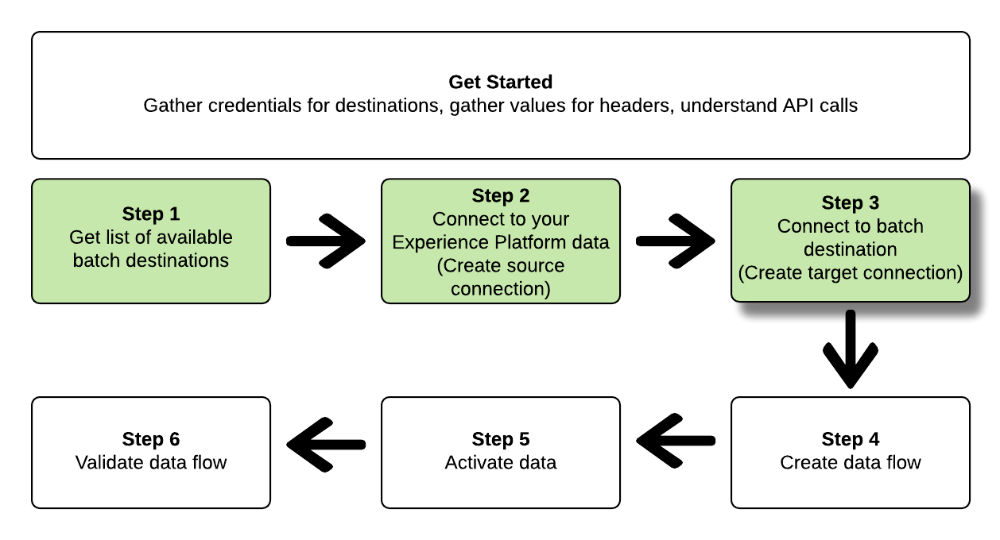

# Verbinden met batchbestemmingen en gegevens activeren met de Flow Service API

>[!IMPORTANT]
> 
>Als u verbinding wilt maken met een doel, hebt u de **[!UICONTROL Manage Destinations]** [toegangsbeheermachtiging](/help/access-control/home.md#permissions).
>
>Als u gegevens wilt activeren, hebt u de opdracht **[!UICONTROL Manage Destinations]**, **[!UICONTROL Activate Destinations]**, **[!UICONTROL View Profiles]**, en **[!UICONTROL View Segments]** [toegangsbeheermachtigingen](/help/access-control/home.md#permissions).
>
>Lees de [toegangsbeheeroverzicht](/help/access-control/ui/overview.md) of neem contact op met de productbeheerder om de vereiste machtigingen te verkrijgen.

Deze zelfstudie laat zien hoe u de Flow Service API kunt gebruiken om een batch te maken [cloudopslag](../catalog/cloud-storage/overview.md) of [e-mailmarketingbestemming](../catalog/email-marketing/overview.md), maakt u een gegevensstroom naar het nieuwe doel en exporteert u gegevens naar het nieuwe doel via CSV-bestanden.

Deze zelfstudie gebruikt de [!DNL Adobe Campaign] doel in alle voorbeelden, maar de stappen zijn identiek voor alle opslag van de batchcloud en e-mailmarketingbestemmingen.


Als u liever de gebruikersinterface van het Platform gebruikt om verbinding te maken met een doel en gegevens te activeren, raadpleegt u de [Een doel verbinden](../ui/connect-destination.md) en [Gebruikersgegevens activeren om exportdoelen voor batchprofielen te maken](../ui/activate-batch-profile-destinations.md) zelfstudies.

## Aan de slag {#get-started}

Deze handleiding vereist een goed begrip van de volgende onderdelen van Adobe Experience Platform:

* [[!DNL Experience Data Model (XDM) System]](../../xdm/home.md): Het gestandaardiseerde kader waardoor [!DNL Experience Platform] organiseert de gegevens van de klantenervaring.
* [[!DNL Segmentation Service]](../../segmentation/api/overview.md): [!DNL Adobe Experience Platform Segmentation Service] staat u toe om segmenten te bouwen en publiek te produceren in [!DNL Adobe Experience Platform] van uw [!DNL Real-time Customer Profile] gegevens.
* [[!DNL Sandboxes]](../../sandboxes/home.md): [!DNL Experience Platform] biedt virtuele sandboxen die één enkele partitie maken [!DNL Platform] in afzonderlijke virtuele omgevingen om toepassingen voor digitale ervaringen te ontwikkelen en te ontwikkelen.

De volgende secties verstrekken extra informatie die u moet weten om gegevens aan partijbestemmingen in Platform te activeren.

### Vereiste referenties verzamelen {#gather-required-credentials}

Om de stappen in dit leerprogramma te voltooien, zou u de volgende geloofsbrieven klaar moeten hebben, afhankelijk van het type van bestemming dat u verbindt en segmenten aan activeert.

* Voor [!DNL Amazon S3] verbindingen: `accessId`, `secretKey`
* Voor [!DNL Amazon S3] verbindingen met [!DNL Adobe Campaign]: `accessId`, `secretKey`
* Voor SFTP-verbindingen: `domain`, `port`, `username`, `password` of `sshKey` (afhankelijk van de verbindingsmethode met de FTP-locatie)
* Voor [!DNL Azure Blob] verbindingen: `connectionString`

>[!NOTE]
>
>De referenties `accessId`, `secretKey` for [!DNL Amazon S3] verbindingen en `accessId`, `secretKey` for [!DNL Amazon S3] verbindingen met [!DNL Adobe Campaign] identiek zijn.

### API-voorbeeldaanroepen lezen {#reading-sample-api-calls}

Deze zelfstudie biedt voorbeeld-API-aanroepen om aan te tonen hoe uw verzoeken moeten worden opgemaakt. Dit zijn paden, vereiste kopteksten en correct opgemaakte ladingen voor aanvragen. Voorbeeld-JSON die wordt geretourneerd in API-reacties, wordt ook verschaft. Voor informatie over de conventies die worden gebruikt in documentatie voor voorbeeld-API-aanroepen raadpleegt u de sectie over [voorbeeld-API-aanroepen lezen](../../landing/troubleshooting.md#how-do-i-format-an-api-request) in de [!DNL Experience Platform] gids voor probleemoplossing.

### Waarden verzamelen voor vereiste en optionele koppen {#gather-values-headers}

Om vraag te maken aan [!DNL Platform] API&#39;s, moet u eerst de [verificatiezelfstudie](https://www.adobe.com/go/platform-api-authentication-en). Het voltooien van de zelfstudie over verificatie biedt de waarden voor elk van de vereiste kopteksten in alle [!DNL Experience Platform] API-aanroepen, zoals hieronder wordt getoond:

* Autorisatie: Drager `{ACCESS_TOKEN}`
* x-api-key: `{API_KEY}`
* x-gw-ims-org-id: `{ORG_ID}`

Bronnen in [!DNL Experience Platform] kan worden geïsoleerd naar specifieke virtuele sandboxen. In verzoeken om [!DNL Platform] API&#39;s kunt u de naam en id opgeven van de sandbox waarin de bewerking plaatsvindt. Dit zijn optionele parameters.

* x-sandbox-name: `{SANDBOX_NAME}`

>[!NOTE]
>
>Voor meer informatie over sandboxen in [!DNL Experience Platform], zie de [overzichtsdocumentatie van sandbox](../../sandboxes/home.md).

Alle verzoeken die een nuttige lading (POST, PUT, PATCH) bevatten vereisen een extra media type kopbal:

* Inhoudstype: `application/json`

### API-naslagdocumentatie {#api-reference-documentation}

In deze zelfstudie vindt u begeleidende referentiedocumentatie voor alle API-bewerkingen. Zie de [Flow Service API-documentatie over Adobe I/O](https://www.adobe.io/experience-platform-apis/references/flow-service/). We raden u aan deze zelfstudie en de API-naslagdocumentatie parallel te gebruiken.

## Krijg de lijst van beschikbare bestemmingen {#get-the-list-of-available-destinations}


Als eerste stap moet u bepalen naar welk doel de gegevens moeten worden geactiveerd. Om met te beginnen, voer een vraag uit om een lijst van beschikbare bestemmingen te verzoeken die u segmenten kunt verbinden en activeren aan. Voer het volgende verzoek van de GET uit aan `connectionSpecs` eindpunt om een lijst van beschikbare bestemmingen terug te keren:

**API-indeling**

```http
GET /connectionSpecs
```

**Verzoek**

```shell
curl --location --request GET 'https://platform.adobe.io/data/foundation/flowservice/connectionSpecs' \
--header 'accept: application/json' \
--header 'x-gw-ims-org-id: {ORG_ID}' \
--header 'x-api-key: {API_KEY}' \
--header 'x-sandbox-name: {SANDBOX_NAME}' \
--header 'Authorization: Bearer {ACCESS_TOKEN}'
```


**Antwoord**

Een succesvolle reactie bevat een lijst met beschikbare bestemmingen en hun unieke id&#39;s (`id`). Sla de waarde op van het doel dat u wilt gebruiken, zoals in verdere stappen wordt vereist. Bijvoorbeeld, als u segmenten wilt verbinden en leveren aan [!DNL Adobe Campaign]zoekt u het volgende fragment in het antwoord:

```json
{
    "id": "0b23e41a-cb4a-4321-a78f-3b654f5d7d97",
  "name": "Adobe Campaign",
  ...
  ...
}
```

Voor uw verwijzing, bevat de lijst hieronder de verbindingsspecificaties - IDs voor algemeen gebruikte partijbestemmingen:

| Bestemming | Verbinding, specificatie-id |
---------|----------|
| [!DNL Adobe Campaign] | `0b23e41a-cb4a-4321-a78f-3b654f5d7d97` |
| [!DNL Amazon S3] | `4890fc95-5a1f-4983-94bb-e060c08e3f81` |
| [!DNL Azure Blob] | `e258278b-a4cf-43ac-b158-4fa0ca0d948b` |
| [!DNL Oracle Eloqua] | `c1e44b6b-e7c8-404b-9031-58f0ef760604` |
| [!DNL Oracle Responsys] | `a5e28ddf-e265-426e-83a1-9d03a3a6822b` |
| [!DNL Salesforce Marketing Cloud] | `f599a5b3-60a7-4951-950a-cc4115c7ea27` |
| SFTP | `64ef4b8b-a6e0-41b5-9677-3805d1ee5dd0` |

{style=&quot;table-layout:auto&quot;}

## Verbinding maken met uw [!DNL Experience Platform] data {#connect-to-your-experience-platform-data}


Vervolgens moet u verbinding maken met uw [!DNL Experience Platform] gegevens, zodat u profielgegevens kunt exporteren en activeren in de gewenste bestemming. Deze bestaat uit twee substappen die hieronder worden beschreven.

1. Eerst, moet u een vraag uitvoeren om toegang tot uw gegevens toe te staan binnen [!DNL Experience Platform]door een basisverbinding in te stellen.
2. Dan, gebruikend identiteitskaart van de basisverbinding, voer een andere vraag uit waarin u creeert *bronverbinding*, waarmee de verbinding met uw [!DNL Experience Platform] gegevens.

### Toegang tot uw gegevens toestaan in [!DNL Experience Platform]

**API-indeling**

```http
POST /connections
```

**Verzoek**

```shell
curl --location --request POST 'https://platform.adobe.io/data/foundation/flowservice/connections' \
--header 'Authorization: Bearer {ACCESS_TOKEN}' \
--header 'x-api-key: {API_KEY}' \
--header 'x-gw-ims-org-id: {ORG_ID}' \
--header 'x-sandbox-name: {SANDBOX_NAME}' \
--header 'Content-Type: application/json' \
--data-raw '{
            "name": "Base connection to Experience Platform",
            "description": "This call establishes the connection to Experience Platform data",
            "connectionSpec": {
                "id": "{CONNECTION_SPEC_ID}",
                "version": "1.0"
            }
}'
```

| Eigenschap | Beschrijving |
| --------- | ----------- |
| `name` | Geef een naam op voor de basisverbinding met het Experience Platform [!DNL Profile Store]. |
| `description` | U kunt desgewenst een beschrijving voor de basisverbinding opgeven. |
| `connectionSpec.id` | Gebruik de verbindingsspecificatie-id voor de [Experience Platform Profile Store](/help/profile/home.md#profile-data-store) - `8a9c3494-9708-43d7-ae3f-cda01e5030e1`. |

{style=&quot;table-layout:auto&quot;}

**Antwoord**

Een geslaagde reactie bevat de unieke id van de basisverbinding (`id`). Sla deze waarde op zoals vereist in de volgende stap om de bronverbinding te maken.

```json
{
    "id": "1ed86558-59b5-42f7-9865-5859b552f7f4"
}
```

### Verbinding maken met uw [!DNL Experience Platform] data {#connect-to-platform-data}

**API-indeling**

```http
POST /sourceConnections
```

**Verzoek**

```shell
curl --location --request POST 'https://platform.adobe.io/data/foundation/flowservice/sourceConnections' \
--header 'Authorization: Bearer {ACCESS_TOKEN}' \
--header 'x-api-key: {API_KEY}' \
--header 'x-gw-ims-org-id: {ORG_ID}' \
--header 'x-sandbox-name: {SANDBOX_NAME}' \
--header 'Content-Type: application/json' \
--data-raw '{
            "name": "Connecting to Profile Store",
            "description": "Optional",
            "connectionSpec": {
                "id": "{CONNECTION_SPEC_ID}",
                "version": "1.0"
            },
            "baseConnectionId": "{BASE_CONNECTION_ID}",
            "data": {
                "format": "CSV",
                "schema": null
            },
            "params" : {}
}'
```

| Eigenschap | Beschrijving |
| --------- | ----------- |
| `name` | Geef een naam op voor de bronverbinding met het Experience Platform [!DNL Profile Store]. |
| `description` | U kunt desgewenst een beschrijving voor de bronverbinding opgeven. |
| `connectionSpec.id` | Gebruik de verbindingsspecificatie-id voor de [Experience Platform Profile Store](/help/profile/home.md#profile-data-store) - `8a9c3494-9708-43d7-ae3f-cda01e5030e1`. |
| `baseConnectionId` | Gebruik de basisverbindings-id die u in de vorige stap hebt verkregen. |
| `data.format` | `CSV` is momenteel de enige ondersteunde indeling voor het exporteren van bestanden. |

{style=&quot;table-layout:auto&quot;}

**Antwoord**

Een geslaagde reactie retourneert de unieke id (`id`) voor de nieuwe bronverbinding met [!DNL Profile Store]. Dit bevestigt dat u verbinding hebt gemaakt met uw [!DNL Experience Platform] gegevens. Sla deze waarde op zoals deze in een latere stap wordt vereist.

```json
{
    "id": "ed48ae9b-c774-4b6e-88ae-9bc7748b6e97"
}
```

## Verbinden met batchbestemming {#connect-to-batch-destination}



In deze stap stelt u een verbinding in met de gewenste opslag van de batchcloud of het gewenste marketingdoel voor e-mail. Deze bestaat uit twee substappen die hieronder worden beschreven.

1. Eerst, moet u een vraag uitvoeren om toegang tot het bestemmingsplatform toe te staan, door vestiging een basisverbinding.
2. Dan, gebruikend identiteitskaart van de basisverbinding zult u een andere vraag maken waarin u creeert *doelverbinding*, die de locatie in uw opslagaccount aangeeft waar de geëxporteerde gegevensbestanden worden geleverd, en de indeling van de gegevens die worden geëxporteerd.

### Toegang tot de batchbestemming toestaan {#authorize-access-to-batch-destination}

**API-indeling**

```http
POST /connections
```

**Verzoek**

In de onderstaande aanvraag wordt een basisverbinding tot stand gebracht met [!DNL Adobe Campaign] bestemmingen. Afhankelijk van de opslaglocatie waarnaar u bestanden wilt exporteren ([!DNL Amazon S3], SFTP, [!DNL Azure Blob]), de passende `auth` en de overige verwijderen.

```shell
curl --location --request POST 'https://platform.adobe.io/data/foundation/flowservice/connections' \
--header 'Authorization: Bearer {ACCESS_TOKEN}' \
--header 'x-api-key: {API_KEY}' \
--header 'x-gw-ims-org-id: {ORG_ID}' \
--header 'x-sandbox-name: {SANDBOX_NAME}' \
--header 'Content-Type: application/json' \
--data-raw '{
    "name": "S3 Connection for Adobe Campaign",
    "description": "summer advertising campaign",
    "connectionSpec": {
        "id": "0b23e41a-cb4a-4321-a78f-3b654f5d7d97",
        "version": "1.0"
    },
    "auth": {
        "specName": "S3",
        "params": {
            "accessId": "{ACCESS_ID}",
            "secretKey": "{SECRET_KEY}"
        }
    }
    "auth": {
        "specName": "SFTP with Password",
        "params": {
            "domain": "{DOMAIN}",
            "host": "{HOST}",
            "username": "{USERNAME}",
            "password": "{PASSWORD}"
        }
    }
    "auth": {
        "specName": "SFTP with SSH Key",
        "params": {
            "domain": "{DOMAIN}",
            "host": "{HOST}",
            "username": "{USERNAME}",
            "sshKey": "{SSH_KEY}"
        }
    }        
    "auth": {
        "specName": "Azure Blob",
        "params": {
            "connectionString": "{AZURE_BLOB_CONNECTION_STRING}"
        }
    }    
}'
```

Zie de onderstaande voorbeeldverzoeken om verbinding te maken met andere ondersteunde batch-cloudopslag- en e-mailmarketingdoelen.

+++ Voorbeeld van aanvraag om verbinding te maken met [!DNL Amazon S3] bestemmingen

In de onderstaande aanvraag wordt een basisverbinding tot stand gebracht met [!DNL Amazon S3] bestemmingen.

```shell
curl --location --request POST 'https://platform.adobe.io/data/foundation/flowservice/connections' \
--header 'Authorization: Bearer {ACCESS_TOKEN}' \
--header 'x-api-key: {API_KEY}' \
--header 'x-gw-ims-org-id: {ORG_ID}' \
--header 'x-sandbox-name: {SANDBOX_NAME}' \
--header 'Content-Type: application/json' \
--data-raw '{
    "name": "Connect to Amazon S3",
    "description": "summer advertising campaign",
    "connectionSpec": {
        "id": "4890fc95-5a1f-4983-94bb-e060c08e3f81",
        "version": "1.0"
    },
    "auth": {
        "specName": "Access Key",
        "params": {
            "s3AccessKey": "{AMAZON_S3_ACCESS_KEY}",
            "s3SecretKey": "{AMAZON_S3_SECRET_KEY}"
        }
    }
}'
```

+++

+++ Voorbeeld van aanvraag om verbinding te maken met [!DNL Azure Blob] bestemmingen

In de onderstaande aanvraag wordt een basisverbinding tot stand gebracht met [!DNL Azure Blob] bestemmingen.

```shell
curl --location --request POST 'https://platform.adobe.io/data/foundation/flowservice/connections' \
--header 'Authorization: Bearer {ACCESS_TOKEN}' \
--header 'x-api-key: {API_KEY}' \
--header 'x-gw-ims-org-id: {ORG_ID}' \
--header 'x-sandbox-name: {SANDBOX_NAME}' \
--header 'Content-Type: application/json' \
--data-raw '{
    "name": "Connect to Azure Blob",
    "description": "Summer advertising campaign",
    "connectionSpec": {
        "id": "e258278b-a4cf-43ac-b158-4fa0ca0d948b",
        "version": "1.0"
    },
    "auth": {
        "specName": "ConnectionString",
        "params": {
            "connectionString": "{AZURE_BLOB_CONNECTION_STRING}"
        }
    }
}'
```

+++

+++ Voorbeeld van aanvraag om verbinding te maken met [!DNL Oracle Eloqua] bestemmingen

In de onderstaande aanvraag wordt een basisverbinding tot stand gebracht met [!DNL Oracle Eloqua] bestemmingen. Afhankelijk van de opslaglocatie waarnaar u bestanden wilt exporteren, moet u de juiste instelling `auth` en de overige verwijderen.

```shell
curl --location --request POST 'https://platform.adobe.io/data/foundation/flowservice/connections' \
--header 'Authorization: Bearer {ACCESS_TOKEN}' \
--header 'x-api-key: {API_KEY}' \
--header 'x-gw-ims-org-id: {ORG_ID}' \
--header 'x-sandbox-name: {SANDBOX_NAME}' \
--header 'Content-Type: application/json' \
--data-raw '{
    "name": "Connect to Eloqua destination",
    "description": "summer advertising campaign",
    "connectionSpec": {
        "id": "c1e44b6b-e7c8-404b-9031-58f0ef760604",
        "version": "1.0"
    },
    "auth": {
        "specName": "SFTP with Password",
        "params": {
            "domain": "{DOMAIN}",
            "host": "{HOST}",
            "username": "{USERNAME}",
            "password": "{PASSWORD}"
        }
    }
    "auth": {
        "specName": "SFTP with SSH Key",
        "params": {
            "domain": "{DOMAIN}",
            "host": "{HOST}",
            "username": "{USERNAME}",
            "sshKey": "{SSH_KEY}"
        }
    }    
}'
```

+++

+++ Voorbeeld van aanvraag om verbinding te maken met [!DNL Oracle Responsys] bestemmingen

In de onderstaande aanvraag wordt een basisverbinding tot stand gebracht met [!DNL Oracle Responsys] bestemmingen. Afhankelijk van de opslaglocatie waarnaar u bestanden wilt exporteren, moet u de juiste instelling `auth` en de overige verwijderen.

```shell
curl --location --request POST 'https://platform.adobe.io/data/foundation/flowservice/connections' \
--header 'Authorization: Bearer {ACCESS_TOKEN}' \
--header 'x-api-key: {API_KEY}' \
--header 'x-gw-ims-org-id: {ORG_ID}' \
--header 'x-sandbox-name: {SANDBOX_NAME}' \
--header 'Content-Type: application/json' \
--data-raw '{
    "name": "Connect to Responsys destination",
    "description": "summer advertising campaign",
    "connectionSpec": {
        "id": "a5e28ddf-e265-426e-83a1-9d03a3a6822b",
        "version": "1.0"
    },
    "auth": {
        "specName": "SFTP with Password",
        "params": {
            "domain": "{DOMAIN}",
            "host": "{HOST}",
            "username": "{USERNAME}",
            "password": "{PASSWORD}"
        }
    }
    "auth": {
        "specName": "SFTP with SSH Key",
        "params": {
            "domain": "{DOMAIN}",
            "host": "{HOST}",
            "username": "{USERNAME}",
            "sshKey": "{SSH_KEY}"
        }
    }    
}'
```

+++

+++ Voorbeeld van aanvraag om verbinding te maken met [!DNL Salesforce Marketing Cloud] bestemmingen

In de onderstaande aanvraag wordt een basisverbinding tot stand gebracht met [!DNL Salesforce Marketing Cloud] bestemmingen. Afhankelijk van de opslaglocatie waarnaar u bestanden wilt exporteren, moet u de juiste instelling `auth` en de overige verwijderen.

```shell
curl --location --request POST 'https://platform.adobe.io/data/foundation/flowservice/connections' \
--header 'Authorization: Bearer {ACCESS_TOKEN}' \
--header 'x-api-key: {API_KEY}' \
--header 'x-gw-ims-org-id: {ORG_ID}' \
--header 'x-sandbox-name: {SANDBOX_NAME}' \
--header 'Content-Type: application/json' \
--data-raw '{
    "name": "Connect to Salesforce Marketing Cloud",
    "description": "summer advertising campaign",
    "connectionSpec": {
        "id": "f599a5b3-60a7-4951-950a-cc4115c7ea27",
        "version": "1.0"
    },
    "auth": {
        "specName": "SFTP with Password",
        "params": {
            "domain": "{DOMAIN}",
            "host": "{HOST}",
            "username": "{USERNAME}",
            "password": "{PASSWORD}"
        }
    }
    "auth": {
        "specName": "SFTP with SSH Key",
        "params": {
            "domain": "{DOMAIN}",
            "host": "{HOST}",
            "username": "{USERNAME}",
            "sshKey": "{SSH_KEY}"
        }
    }    
}'
```

+++

+++ Voorbeeld van een verzoek om verbinding te maken met SFTP met wachtwoorddoelen

In het onderstaande verzoek wordt een basisverbinding met SFTP-bestemmingen tot stand gebracht.

```shell
curl --location --request POST 'https://platform.adobe.io/data/foundation/flowservice/connections' \
--header 'Authorization: Bearer {ACCESS_TOKEN}' \
--header 'x-api-key: {API_KEY}' \
--header 'x-gw-ims-org-id: {ORG_ID}' \
--header 'x-sandbox-name: {SANDBOX_NAME}' \
--header 'Content-Type: application/json' \
--data-raw '{
    "name": "Connect to SFTP with password",
    "description": "summer advertising campaign",
    "connectionSpec": {
        "id": "64ef4b8b-a6e0-41b5-9677-3805d1ee5dd0",
        "version": "1.0"
    },
    "auth": {
        "specName": "Basic Authentication for sftp",
        "params": {
            "host": "{HOST}",
            "username": "{USERNAME}",
            "password": "{PASSWORD}"
        }
    }
}'
```

+++

| Eigenschap | Beschrijving |
| --------- | ----------- |
| `name` | Geef een naam op voor de basisverbinding met de batchbestemming. |
| `description` | U kunt desgewenst een beschrijving voor de basisverbinding opgeven. |
| `connectionSpec.id` | Gebruik de verbindingsspecificatie-id voor het gewenste batchdoel. U hebt deze id in de stap verkregen [Krijg de lijst van beschikbare bestemmingen](#get-the-list-of-available-destinations). |
| `auth.specname` | Wijst op het authentificatieformaat voor de bestemming. Om te weten te komen specName voor uw bestemming, voer a uit [De vraag van de GET aan de verbinding specs eindpunt](https://developer.adobe.com/experience-platform-apis/references/flow-service/#operation/retrieveConnectionSpec), op basis van de verbindingsspecificaties van het gewenste doel. De parameter zoeken `authSpec.name` in de reactie. <br> Voor Adobe Campaign-doelen kunt u bijvoorbeeld elk van de volgende handelingen uitvoeren `S3`, `SFTP with Password`, of `SFTP with SSH Key`. |
| `params` | Afhankelijk van het doel waarmee u verbinding maakt, moet u verschillende vereiste verificatieparameters opgeven. Voor Amazon S3-verbindingen moet u uw toegangs-id en geheime sleutel opgeven op de opslaglocatie van Amazon S3. <br> Om de vereiste parameters voor uw bestemming te weten te komen, voer a uit [De vraag van de GET aan de verbinding specs eindpunt](https://developer.adobe.com/experience-platform-apis/references/flow-service/#operation/retrieveConnectionSpec), op basis van de verbindingsspecificaties van het gewenste doel. De parameter zoeken `authSpec.spec.required` in de reactie. |

{style=&quot;table-layout:auto&quot;}

**Antwoord**

Een geslaagde reactie bevat de unieke id van de basisverbinding (`id`). Sla deze waarde op zoals vereist in de volgende stap om een doelverbinding te maken.

```json
{
    "id": "1ed86558-59b5-42f7-9865-5859b552f7f4"
}
```

### Opslaglocatie en gegevensindeling opgeven {#specify-storage-location-data-format}

[!DNL Adobe Experience Platform] exporteert gegevens voor batch-e-mailmarketing en cloudopslagbestemmingen in de vorm van [!DNL CSV] bestanden. In deze stap kunt u het pad in uw opslaglocatie bepalen waar de bestanden worden geëxporteerd.

>[!IMPORTANT]
> 
>[!DNL Adobe Experience Platform] Hiermee worden de exportbestanden automatisch gesplitst op 5 miljoen records (rijen) per bestand. Elke rij vertegenwoordigt één profiel.
>
>Namen van gesplitste bestanden worden toegevoegd met een getal dat aangeeft dat het bestand deel uitmaakt van een grotere exportbewerking, als zodanig: `filename.csv`, `filename_2.csv`, `filename_3.csv`.

**API-indeling**

```http
POST /targetConnections
```

**Verzoek**

Met de onderstaande aanvraag wordt een doelverbinding tot stand gebracht met [!DNL Adobe Campaign] doelen, om te bepalen waar de geëxporteerde bestanden op uw opslaglocatie worden aangeland. Afhankelijk van de opslaglocatie waarnaar u bestanden wilt exporteren, moet u de juiste instelling `params` en de overige verwijderen.

```shell
curl --location --request POST 'https://platform.adobe.io/data/foundation/flowservice/targetConnections' \
--header 'Authorization: Bearer {ACCESS_TOKEN}' \
--header 'x-api-key: {API_KEY}' \
--header 'x-gw-ims-org-id: {ORG_ID}' \
--header 'Content-Type: application/json' \
--data-raw '{
    "name": "TargetConnection for Adobe Campaign",
    "description": "Connection to Adobe Campaign",
    "baseConnectionId": "{BASE_CONNECTION_ID}",
    "connectionSpec": {
        "id": "0b23e41a-cb4a-4321-a78f-3b654f5d7d97",
        "version": "1.0"
    },
    "data": {
        "format": "json",
        "schema": {
            "id": "1.0",
            "version": "1.0"
        }
    },
    "params": {
        "mode": "S3",
        "bucketName": "{BUCKET_NAME}",
        "path": "{FILEPATH}",
        "format": "CSV"
    }
    "params": {
        "mode": "AZURE_BLOB",
        "container": "{CONTAINER}",
        "path": "{FILEPATH}",
        "format": "CSV"
    }
    "params": {
        "mode": "FTP",
        "remotePath": "{REMOTE_PATH}",
        "format": "CSV"
    }        
}'
```

Zie de onderstaande voorbeeldaanvragen voor een opslaglocatie voor andere ondersteunde batch-cloudopslag- en e-mailmarketingdoelen.

+++ Voorbeeld van een verzoek om een opslaglocatie in te stellen voor [!DNL Amazon S3] bestemmingen

Met de onderstaande aanvraag wordt een doelverbinding tot stand gebracht met [!DNL Amazon S3] doelen, om te bepalen waar de geëxporteerde bestanden op uw opslaglocatie worden aangeland.

```shell
curl --location --request POST 'https://platform.adobe.io/data/foundation/flowservice/targetConnections' \
--header 'Authorization: Bearer {ACCESS_TOKEN}' \
--header 'x-api-key: {API_KEY}' \
--header 'x-gw-ims-org-id: {ORG_ID}' \
--header 'Content-Type: application/json' \
--data-raw '{
    "name": "TargetConnection for Amazon S3",
    "description": "Connection to Amazon S3",
    "baseConnectionId": "{BASE_CONNECTION_ID}",
    "connectionSpec": {
        "id": "4890fc95-5a1f-4983-94bb-e060c08e3f81",
        "version": "1.0"
    },
    "data": {
        "format": "json",
        "schema": {
            "id": "1.0",
            "version": "1.0"
        }
    },
    "params": {
        "mode": "S3",
        "bucketName": "{BUCKET_NAME}",
        "path": "{FILEPATH}",
        "format": "CSV"
    }
}'
```

+++

+++ Voorbeeld van een verzoek om een opslaglocatie in te stellen voor [!DNL Azure Blob] bestemmingen

Met de onderstaande aanvraag wordt een doelverbinding tot stand gebracht met [!DNL Azure Blob] doelen, om te bepalen waar de geëxporteerde bestanden op uw opslaglocatie worden aangeland.

```shell
curl --location --request POST 'https://platform.adobe.io/data/foundation/flowservice/targetConnections' \
--header 'Authorization: Bearer {ACCESS_TOKEN}' \
--header 'x-api-key: {API_KEY}' \
--header 'x-gw-ims-org-id: {ORG_ID}' \
--header 'Content-Type: application/json' \
--data-raw '{
    "name": "TargetConnection for Azure Blob",
    "description": "Connection to Azure Blob",
    "baseConnectionId": "{BASE_CONNECTION_ID}",
    "connectionSpec": {
        "id": "e258278b-a4cf-43ac-b158-4fa0ca0d948b",
        "version": "1.0"
    },
    "data": {
        "format": "json",
        "schema": {
            "id": "1.0",
            "version": "1.0"
        }
    },
    "params": {
        "mode": "AZURE_BLOB",
        "container": "{CONTAINER}",
        "path": "{FILEPATH}",
        "format": "CSV"
    }
}'
```

+++

+++ Voorbeeld van een verzoek om een opslaglocatie in te stellen voor [!DNL Oracle Eloqua] bestemmingen

Met de onderstaande aanvraag wordt een doelverbinding tot stand gebracht met [!DNL Oracle Eloqua] doelen, om te bepalen waar de geëxporteerde bestanden op uw opslaglocatie worden aangeland. Afhankelijk van de opslaglocatie waarnaar u bestanden wilt exporteren, moet u de juiste instelling `params` en de overige verwijderen.

```shell
curl --location --request POST 'https://platform.adobe.io/data/foundation/flowservice/targetConnections' \
--header 'Authorization: Bearer {ACCESS_TOKEN}' \
--header 'x-api-key: {API_KEY}' \
--header 'x-gw-ims-org-id: {ORG_ID}' \
--header 'Content-Type: application/json' \
--data-raw '{
    "name": "TargetConnection for Oracle Eloqua",
    "description": "Connection to Oracle Eloqua",
    "baseConnectionId": "{BASE_CONNECTION_ID}",
    "connectionSpec": {
        "id": "c1e44b6b-e7c8-404b-9031-58f0ef760604",
        "version": "1.0"
    },
    "data": {
        "format": "json",
        "schema": {
            "id": "1.0",
            "version": "1.0"
        }
    },
    "params": {
        "mode": "S3",
        "bucketName": "{BUCKET_NAME}",
        "path": "{FILEPATH}",
        "format": "CSV"
    }
    "params": {
        "mode": "FTP",
        "remotePath": "{REMOTE_PATH}",
        "format": "CSV"
    }        
}'
```

+++

+++ Voorbeeld van een verzoek om een opslaglocatie in te stellen voor [!DNL Oracle Responsys] bestemmingen

Met de onderstaande aanvraag wordt een doelverbinding tot stand gebracht met [!DNL Oracle Responsys] doelen, om te bepalen waar de geëxporteerde bestanden op uw opslaglocatie worden aangeland. Afhankelijk van de opslaglocatie waarnaar u bestanden wilt exporteren, moet u de juiste instelling `params` en de overige verwijderen.

```shell
curl --location --request POST 'https://platform.adobe.io/data/foundation/flowservice/targetConnections' \
--header 'Authorization: Bearer {ACCESS_TOKEN}' \
--header 'x-api-key: {API_KEY}' \
--header 'x-gw-ims-org-id: {ORG_ID}' \
--header 'Content-Type: application/json' \
--data-raw '{
    "name": "TargetConnection for Oracle Responsys",
    "description": "Connection to Oracle Responsys",
    "baseConnectionId": "{BASE_CONNECTION_ID}",
    "connectionSpec": {
        "id": "a5e28ddf-e265-426e-83a1-9d03a3a6822b",
        "version": "1.0"
    },
    "data": {
        "format": "json",
        "schema": {
            "id": "1.0",
            "version": "1.0"
        }
    },
    "params": {
        "mode": "S3",
        "bucketName": "{BUCKET_NAME}",
        "path": "{FILEPATH}",
        "format": "CSV"
    }
    "params": {
        "mode": "FTP",
        "remotePath": "{REMOTE_PATH}",
        "format": "CSV"
    }        
}'
```

+++

+++ Voorbeeld van een verzoek om een opslaglocatie in te stellen voor [!DNL Salesforce Marketing Cloud] bestemmingen

Met de onderstaande aanvraag wordt een doelverbinding tot stand gebracht met [!DNL Salesforce Marketing Cloud] doelen, om te bepalen waar de geëxporteerde bestanden op uw opslaglocatie worden aangeland. Afhankelijk van de opslaglocatie waarnaar u bestanden wilt exporteren, moet u de juiste instelling `params` en de overige verwijderen.

```shell
curl --location --request POST 'https://platform.adobe.io/data/foundation/flowservice/targetConnections' \
--header 'Authorization: Bearer {ACCESS_TOKEN}' \
--header 'x-api-key: {API_KEY}' \
--header 'x-gw-ims-org-id: {ORG_ID}' \
--header 'Content-Type: application/json' \
--data-raw '{
    "name": "TargetConnection for Salesforce Marketing Cloud",
    "description": "Connection to Salesforce Marketing Cloud",
    "baseConnectionId": "{BASE_CONNECTION_ID}",
    "connectionSpec": {
        "id": "f599a5b3-60a7-4951-950a-cc4115c7ea27",
        "version": "1.0"
    },
    "data": {
        "format": "json",
        "schema": {
            "id": "1.0",
            "version": "1.0"
        }
    },
    "params": {
        "mode": "S3",
        "bucketName": "{BUCKET_NAME}",
        "path": "{FILEPATH}",
        "format": "CSV"
    }
    "params": {
        "mode": "FTP",
        "remotePath": "{REMOTE_PATH}",
        "format": "CSV"
    }        
}'
```

+++

+++ Voorbeeld van een verzoek om een opslaglocatie voor SFTP-doelen in te stellen

In het onderstaande verzoek wordt een doelverbinding met SFTP-doelen vastgelegd om te bepalen waar de geëxporteerde bestanden in uw opslaglocatie worden geland.

```shell
curl --location --request POST 'https://platform.adobe.io/data/foundation/flowservice/targetConnections' \
--header 'Authorization: Bearer {ACCESS_TOKEN}' \
--header 'x-api-key: {API_KEY}' \
--header 'x-gw-ims-org-id: {ORG_ID}' \
--header 'Content-Type: application/json' \
--data-raw '{
    "name": "TargetConnection for SFTP",
    "description": "Connection to SFTP",
    "baseConnectionId": "{BASE_CONNECTION_ID}",
    "connectionSpec": {
        "id": "64ef4b8b-a6e0-41b5-9677-3805d1ee5dd0",
        "version": "1.0"
    },
    "data": {
        "format": "json",
        "schema": {
            "id": "1.0",
            "version": "1.0"
        }
    },
    "params": {
        "mode": "FTP",
        "remotePath": "{REMOTE_PATH}",
    }
}'
```

+++


| Eigenschap | Beschrijving |
| --------- | ----------- |
| `name` | Geef een naam op voor de doelverbinding met de batchbestemming. |
| `description` | U kunt desgewenst een beschrijving voor de doelverbinding opgeven. |
| `baseConnectionId` | Gebruik de id van de basisverbinding die u in de bovenstaande stap hebt gemaakt. |
| `connectionSpec.id` | Gebruik de verbindingsspecificatie-id voor het gewenste batchdoel. U hebt deze id in de stap verkregen [Krijg de lijst van beschikbare bestemmingen](#get-the-list-of-available-destinations). |
| `params` | Afhankelijk van het doel waarmee u verbinding maakt, moet u verschillende vereiste parameters opgeven voor de opslaglocatie. Voor Amazon S3-verbindingen moet u uw toegangs-id en geheime sleutel opgeven op de opslaglocatie van Amazon S3. <br> Om de vereiste parameters voor uw bestemming te weten te komen, voer a uit [De vraag van de GET aan de verbinding specs eindpunt](https://developer.adobe.com/experience-platform-apis/references/flow-service/#operation/retrieveConnectionSpec), op basis van de verbindingsspecificaties van het gewenste doel. De parameter zoeken `targetSpec.spec.required` in de reactie. |
| `params.mode` | Afhankelijk van de ondersteunde modus voor uw doel moet u hier een andere waarde opgeven. Om de vereiste parameters voor uw bestemming te weten te komen, voer a uit [De vraag van de GET aan de verbinding specs eindpunt](https://developer.adobe.com/experience-platform-apis/references/flow-service/#operation/retrieveConnectionSpec), op basis van de verbindingsspecificaties van het gewenste doel. De parameter zoeken `targetSpec.spec.properties.mode.enum` in het antwoord en selecteer de gewenste modus. |
| `params.bucketName` | Geef voor S3-verbindingen de naam op van het emmertje waar de bestanden worden geëxporteerd. |
| `params.path` | Geef voor S3-verbindingen het bestandspad op in de opslaglocatie waar de bestanden worden geëxporteerd. |
| `params.format` | `CSV` is momenteel het enige ondersteunde exporttype voor bestanden. |

{style=&quot;table-layout:auto&quot;}

**Antwoord**

Een geslaagde reactie retourneert de unieke id (`id`) voor de nieuwe doelverbinding naar uw batchbestemming. Sla deze waarde op zoals deze in latere stappen wordt vereist.

```json
{
    "id": "12ab90c7-519c-4291-bd20-d64186b62da8"
}
```

## Een gegevensstroom maken {#create-dataflow}


Met de flowspecificatie, bronverbinding en doel-verbindings-id&#39;s die u in de vorige stappen hebt verkregen, kunt u nu een gegevensstroom maken tussen de [!DNL Experience Platform] gegevens en de bestemming waar u gegevensbestanden wilt exporteren. Denk aan deze stap als het construeren van de pijpleiding waardoor de gegevens tussen zullen later stromen [!DNL Experience Platform] en uw gewenste bestemming.

Om een gegevensstroom tot stand te brengen, voer een verzoek van de POST uit zoals hieronder getoond, terwijl het verstrekken van de hieronder vermelde waarden binnen de nuttige lading.

**API-indeling**

```http
POST /flows
```

**Verzoek**

```shell
curl -X POST \
'https://platform.adobe.io/data/foundation/flowservice/flows' \
-H 'Authorization: Bearer {ACCESS_TOKEN}' \
-H 'x-api-key: {API_KEY}' \
-H 'x-gw-ims-org-id: {ORG_ID}' \
-H 'x-sandbox-name: {SANDBOX_NAME}' \
-H 'Content-Type: application/json' \
-d  '{
   
        "name": "Activate segments to Adobe Campaign",
        "description": "This operation creates a dataflow which we will later use to activate segments to Adobe Campaign",
        "flowSpec": {
            "id": "{FLOW_SPEC_ID}",
            "version": "1.0"
        },
        "sourceConnectionIds": [
            "{SOURCE_CONNECTION_ID}"
        ],
        "targetConnectionIds": [
            "{TARGET_CONNECTION_ID}"
        ],
        "transformations": [
            {
                "name": "GeneralTransform",
                "params": {
                    "segmentSelectors": {
                        "selectors": []
                    },
                    "profileSelectors": {
                        "selectors": []
                    }
                }
            }
        ]
    }
```

| Eigenschap | Beschrijving |
| --------- | ----------- |
| `name` | Geef een naam op voor de gegevensstroom die u maakt. |
| `description` | U kunt desgewenst een beschrijving voor de gegevensstroom opgeven. |
| `flowSpec.Id` | Gebruik de flow-specificatie-id voor de batchbestemming waarmee u verbinding wilt maken. Voer een GET-bewerking uit op de knop `flowspecs` eindpunt, zoals getoond in het [stroomspecificaties API-naslagdocumentatie](https://www.adobe.io/experience-platform-apis/references/flow-service/#operation/retrieveFlowSpec). In de reactie zoekt u naar `upsTo` en kopieer de bijbehorende id van de batchbestemming waarmee u verbinding wilt maken. Voor Adobe Campaign kunt u bijvoorbeeld zoeken naar `upsToCampaign` en kopieert u de `id` parameter. |
| `sourceConnectionIds` | Gebruik de bronverbindings-id die u in de stap hebt opgehaald [Verbinden met uw Experience Platform gegevens](#connect-to-your-experience-platform-data). |
| `targetConnectionIds` | Gebruik de doel-verbindings-id die u in de stap hebt verkregen [Verbinden met batchbestemming](#connect-to-batch-destination). |
| `transformations` | In de volgende stap vult u deze sectie met de segmenten en profielkenmerken die moeten worden geactiveerd. |

Voor uw verwijzing, bevat de lijst hieronder de stroom specifieke IDs voor algemeen gebruikte partijbestemmingen:

| Bestemming | Stroom-specificatie-id |
---------|----------|
| Alle cloudopslagbestemmingen ([!DNL Amazon S3], SFTP, [!DNL Azure Blob]) en [!DNL Oracle Eloqua] | `71471eba-b620-49e4-90fd-23f1fa0174d8` |
| [!DNL Oracle Responsys] | `51d675ce-e270-408d-91fc-22717bdf2148` |
| [!DNL Salesforce Marketing Cloud] | `493b2bd6-26e4-4167-ab3b-5e910bba44f0` |

**Antwoord**

Een geslaagde reactie retourneert de id (`id`) van de nieuwe gegevensstroom en een `etag`. Noteer beide waarden op dezelfde manier als u ze in de volgende stap nodig hebt om segmenten te activeren en gegevensbestanden te exporteren.

```json
{
    "id": "8256cfb4-17e6-432c-a469-6aedafb16cd5",
    "etag": "8256cfb4-17e6-432c-a469-6aedafb16cd5"
}
```


## Gegevens activeren naar uw nieuwe bestemming {#activate-data}


Nadat u alle verbindingen en de gegevensstroom hebt gemaakt, kunt u nu uw profielgegevens activeren op het doelplatform. In deze stap selecteert u welke segmenten en welke profielkenmerken u naar het doel wilt exporteren.

U kunt ook de naamgevingsindeling van de geëxporteerde bestanden bepalen en bepalen welke kenmerken moeten worden gebruikt als [deduplicatietoetsen](../ui/activate-batch-profile-destinations.md#mandatory-keys) of [verplichte kenmerken](../ui/activate-batch-profile-destinations.md#mandatory-attributes). In deze stap, kunt u het programma ook bepalen om gegevens naar de bestemming te verzenden.

Als u segmenten naar uw nieuwe bestemming wilt activeren, moet u een JSON PATCH-bewerking uitvoeren, vergelijkbaar met het onderstaande voorbeeld. U kunt veelvoudige segmenten en profielattributen in één vraag activeren. Voor meer informatie over JSON PATCH raadpleegt u de [RFC-specificatie](https://tools.ietf.org/html/rfc6902).

**API-indeling**

```http
PATCH /flows
```

**Verzoek**

```shell
curl --location --request PATCH 'https://platform.adobe.io/data/foundation/flowservice/flows/{DATAFLOW_ID}' \
--header 'Authorization: Bearer {ACCESS_TOKEN}' \
--header 'x-api-key: {API_KEY}' \
--header 'x-gw-ims-org-id: {ORG_ID}' \
--header 'Content-Type: application/json' \
--header 'x-sandbox-name: {SANDBOX_NAME}' \
--header 'If-Match: "{ETAG}"' \
--data-raw '[
    {
        "op": "add",
        "path": "/transformations/0/params/segmentSelectors/selectors/-",
        "value": {
            "type": "PLATFORM_SEGMENT",
            "value": {
                "name": "Name of the segment that you are activating",
                "description": "Description of the segment that you are activating",
                "id": "{SEGMENT_ID}",
                "filenameTemplate": "%DESTINATION_NAME%_%SEGMENT_ID%_%DATETIME(YYYYMMdd_HHmmss)%",
                "exportMode": "DAILY_FULL_EXPORT",
                "schedule": {
                    "frequency": "ONCE",
                    "startDate": "2021-12-20",
                    "startTime": "17:00"
                } 
            }
        }
    },
{
        "op": "add",
        "path": "/transformations/0/params/segmentSelectors/selectors/-",
        "value": {
            "type": "PLATFORM_SEGMENT",
            "value": {
                "name": "Name of the segment that you are activating",
                "description": "Description of the segment that you are activating",
                "id": "{SEGMENT_ID}",
                "filenameTemplate": "%DESTINATION_NAME%_%SEGMENT_ID%_%DATETIME(YYYYMMdd_HHmmss)%",
                "exportMode": "DAILY_FULL_EXPORT",
                "schedule": {
                    "frequency": "ONCE",
                    "triggerType": "SCHEDULED",
                    "startDate": "2021-12-20",
                    "startTime": "17:00"
                },   
            }
        }
    },
{
        "op": "add",
        "path": "/transformations/0/params/profileSelectors/selectors/-",
        "value": {
            "type": "JSON_PATH",
            "value": {
                "path": "{PROFILE_ATTRIBUTE}"
            }
        }
    }
]
```

| Eigenschap | Beschrijving |
| --------- | ----------- |
| `{DATAFLOW_ID}` | Gebruik in de URL de id van de gegevensstroom die u in de vorige stap hebt gemaakt. |
| `{ETAG}` | Krijg de `{ETAG}` uit het antwoord in de vorige stap, [Een gegevensstroom maken](#create-dataflow). De antwoordindeling in de vorige stap heeft escape-aanhalingstekens. U moet de niet-beschermde waarden in de kopbal van het verzoek gebruiken. Zie het onderstaande voorbeeld: <br> <ul><li>Voorbeeld van reactie: `"etag":""7400453a-0000-1a00-0000-62b1c7a90000""`</li><li>Waarde die u in uw verzoek wilt gebruiken: `"etag": "7400453a-0000-1a00-0000-62b1c7a90000"`</li></ul> <br> De labelwaarde wordt bijgewerkt bij elke geslaagde update van een gegevensstroom. |
| `{SEGMENT_ID}` | Geef de segment-id op die u naar dit doel wilt exporteren. Als u segment-id&#39;s wilt ophalen voor de segmenten die u wilt activeren, raadpleegt u [een segmentdefinitie ophalen](https://www.adobe.io/experience-platform-apis/references/segmentation/#operation/retrieveSegmentDefinitionById) in de API-naslaggids voor Experience Platforms. |
| `{PROFILE_ATTRIBUTE}` | Bijvoorbeeld: `"person.lastName"` |
| `op` | De verrichtingsvraag die wordt gebruikt om de actie te bepalen nodig om dataflow bij te werken. Bewerkingen omvatten: `add`, `replace`, en `remove`. Als u een segment wilt toevoegen aan een gegevensstroom, gebruikt u de opdracht `add` bewerking. |
| `path` | Definieert het deel van de flow dat moet worden bijgewerkt. Wanneer u een segment toevoegt aan een gegevensstroom, gebruikt u het pad dat in het voorbeeld is opgegeven. |
| `value` | De nieuwe waarde waarmee u de parameter wilt bijwerken. |
| `id` | Geef de id op van het segment dat u toevoegt aan de doelgegevensstroom. |
| `name` | *Optioneel*. Geef de naam op van het segment dat u toevoegt aan de doelgegevensstroom. Merk op dat dit gebied niet verplicht is en u kunt met succes een segment aan de bestemmingsdataflow toevoegen zonder zijn naam te verstrekken. |
| `filenameTemplate` | Dit veld bepaalt de bestandsnaamindeling van de bestanden die naar uw doel worden geëxporteerd. <br> De volgende opties zijn beschikbaar: <br> <ul><li>`%DESTINATION_NAME%`: Verplicht. De geëxporteerde bestanden bevatten de doelnaam.</li><li>`%SEGMENT_ID%`: Verplicht. De geëxporteerde bestanden bevatten de id van het geëxporteerde segment.</li><li>`%SEGMENT_NAME%`: Optioneel. De geëxporteerde bestanden bevatten de naam van het geëxporteerde segment.</li><li>`DATETIME(YYYYMMdd_HHmmss)` of `%TIMESTAMP%`: Optioneel. Selecteer één van deze twee opties voor uw dossiers om de tijd te omvatten wanneer zij door Experience Platform worden geproduceerd.</li><li>`custom-text`: Optioneel. Vervang deze tijdelijke aanduiding door aangepaste tekst die u aan het einde van de bestandsnamen wilt toevoegen.</li></ul> <br> Raadpleeg voor meer informatie over het configureren van bestandsnamen de [bestandsnamen configureren](/help/destinations/ui/activate-batch-profile-destinations.md#file-names) in de activeringszelfstudie voor batchbestemmingen. |
| `exportMode` | Verplicht. Selecteren `"DAILY_FULL_EXPORT"` of `"FIRST_FULL_THEN_INCREMENTAL"`. Voor meer informatie over de twee opties raadpleegt u [volledige bestanden exporteren](/help/destinations/ui/activate-batch-profile-destinations.md#export-full-files) en [incrementele bestanden exporteren](/help/destinations/ui/activate-batch-profile-destinations.md#export-incremental-files) in de activeringszelfstudie voor batchbestemmingen. |
| `startDate` | Selecteer de datum waarop het segment moet beginnen met het exporteren van profielen naar uw bestemming. |
| `frequency` | Verplicht. <br> <ul><li>Voor de `"DAILY_FULL_EXPORT"` u kunt de exportmodus `ONCE` of `DAILY`.</li><li>Voor de `"FIRST_FULL_THEN_INCREMENTAL"` u kunt de exportmodus `"DAILY"`, `"EVERY_3_HOURS"`, `"EVERY_6_HOURS"`, `"EVERY_8_HOURS"`, `"EVERY_12_HOURS"`.</li></ul> |
| `triggerType` | Voor *batchbestemmingen* alleen. Dit veld is alleen vereist als u de optie `"DAILY_FULL_EXPORT"` in de `frequency` kiezer. <br> Verplicht. <br> <ul><li>Selecteren `"AFTER_SEGMENT_EVAL"` om de activeringstaak onmiddellijk uit te voeren nadat de dagelijkse batchsegmentatietaak van het Platform is voltooid. Dit zorgt ervoor dat wanneer de activeringstaak wordt uitgevoerd, de meest recente profielen naar uw bestemming worden uitgevoerd.</li><li>Selecteren `"SCHEDULED"` om de activeringstaak op een vast tijdstip uit te voeren. Dit zorgt ervoor dat de gegevens van het Experience Platform profielgegevens tezelfdertijd elke dag worden uitgevoerd, maar de profielen u uitvoert kunnen niet de meest bijgewerkte zijn, afhankelijk van of de batch-segmentatietaak heeft voltooid alvorens de activeringstaak begint. Als u deze optie selecteert, moet u ook een `startTime` aangeven op welk tijdstip in UTC de dagelijkse uitvoer moet plaatsvinden.</li></ul> |
| `endDate` | Voor *batchbestemmingen* alleen. Dit veld is alleen vereist wanneer u een segment toevoegt aan een gegevensstroom in exportdoelen voor batchbestanden zoals Amazon S3, SFTP of Azure Blob. <br> Niet van toepassing bij selectie `"exportMode":"DAILY_FULL_EXPORT"` en `"frequency":"ONCE"`. <br> Hiermee stelt u de datum in waarop segmentleden stoppen met exporteren naar de bestemming. |
| `startTime` | Voor *batchbestemmingen* alleen. Dit veld is alleen vereist wanneer u een segment toevoegt aan een gegevensstroom in exportdoelen voor batchbestanden zoals Amazon S3, SFTP of Azure Blob. <br> Verplicht. Selecteer het tijdstip waarop bestanden met leden van het segment moeten worden gegenereerd en naar uw bestemming moeten worden geëxporteerd. |

{style=&quot;table-layout:auto&quot;}

>[!TIP]
>
> Zie [De componenten van een segment van de update in een dataflow](/help/destinations/api/update-destination-dataflows.md#update-segment) om te leren hoe u diverse componenten (bestandsnaamsjabloon, exporttijd, enzovoort) van geëxporteerde segmenten kunt bijwerken.

**Antwoord**

Zoek naar een 202 Geaccepteerde reactie. Er wordt geen responsorgaan geretourneerd. Ga naar de volgende stap om te controleren of de aanvraag juist was. [De gegevensstroom valideren](#validate-dataflow).

## De gegevensstroom valideren {#validate-dataflow}


Als laatste stap in de zelfstudie moet u controleren of de segmenten en profielkenmerken correct zijn toegewezen aan de gegevensstroom.

Om dit te bevestigen, voer het volgende verzoek van de GET uit:

**API-indeling**

```http
GET /flows
```

**Verzoek**

```shell
curl --location --request PATCH 'https://platform.adobe.io/data/foundation/flowservice/flows/{DATAFLOW_ID}' \
--header 'Authorization: Bearer {ACCESS_TOKEN}' \
--header 'x-api-key: {API_KEY}' \
--header 'x-gw-ims-org-id: {ORG_ID}' \
--header 'Content-Type: application/json' \
--header 'x-sandbox-name: prod' \
--header 'If-Match: "{ETAG}"' 
```

* `{DATAFLOW_ID}`: Gebruik de gegevensstroom van de vorige stap.
* `{ETAG}`: Gebruik het label van de vorige stap.

**Antwoord**

De geretourneerde reactie moet worden opgenomen in de `transformations` parameter de segmenten en profielkenmerken die u in de vorige stap hebt verzonden. Een monster `transformations` de parameter in het antwoord kan er als volgt uitzien :

```json
"transformations":[
   {
      "name":"GeneralTransform",
      "params":{
         "profileSelectors":{
            "selectors":[
               {
                  "type":"JSON_PATH",
                  "value":{
                     "path":"homeAddress.countryCode",
                     "operator":"EXISTS",
                     "mapping":{
                        "sourceType":"text/x.schema-path",
                        "source":"homeAddress.countryCode",
                        "destination":"homeAddress.countryCode",
                        "identity":false,
                        "primaryIdentity":false,
                        "functionVersion":0,
                        "copyModeMapping":false,
                        "sourceAttribute":"homeAddress.countryCode",
                        "destinationXdmPath":"homeAddress.countryCode"
                     }
                  }
               },
               {
                  "type":"JSON_PATH",
                  "value":{
                     "path":"person.name.firstName",
                     "operator":"EXISTS",
                     "mapping":{
                        "sourceType":"text/x.schema-path",
                        "source":"person.name.firstName",
                        "destination":"person.name.firstName",
                        "identity":false,
                        "primaryIdentity":false,
                        "functionVersion":0,
                        "copyModeMapping":false,
                        "sourceAttribute":"person.name.firstName",
                        "destinationXdmPath":"person.name.firstName"
                     }
                  }
               },
               {
                  "type":"JSON_PATH",
                  "value":{
                     "path":"person.name.lastName",
                     "operator":"EXISTS",
                     "mapping":{
                        "sourceType":"text/x.schema-path",
                        "source":"person.name.lastName",
                        "destination":"person.name.lastName",
                        "identity":false,
                        "primaryIdentity":false,
                        "functionVersion":0,
                        "copyModeMapping":false,
                        "sourceAttribute":"person.name.lastName",
                        "destinationXdmPath":"person.name.lastName"
                     }
                  }
               },
               {
                  "type":"JSON_PATH",
                  "value":{
                     "path":"personalEmail.address",
                     "operator":"EXISTS",
                     "mapping":{
                        "sourceType":"text/x.schema-path",
                        "source":"personalEmail.address",
                        "destination":"personalEmail.address",
                        "identity":false,
                        "primaryIdentity":false,
                        "functionVersion":0,
                        "copyModeMapping":false,
                        "sourceAttribute":"personalEmail.address",
                        "destinationXdmPath":"personalEmail.address"
                     }
                  }
               },
               {
                  "type":"JSON_PATH",
                  "value":{
                     "path":"segmentMembership.status",
                     "operator":"EXISTS",
                     "mapping":{
                        "sourceType":"text/x.schema-path",
                        "source":"segmentMembership.status",
                        "destination":"segmentMembership.status",
                        "identity":false,
                        "primaryIdentity":false,
                        "functionVersion":0,
                        "copyModeMapping":false,
                        "sourceAttribute":"segmentMembership.status",
                        "destinationXdmPath":"segmentMembership.status"
                     }
                  }
               }
            ],
            "mandatoryFields":[
               "person.name.firstName",
               "person.name.lastName"
            ],
            "primaryFields":[
               {
                  "fieldType":"ATTRIBUTE",
                  "attributePath":"personalEmail.address"
               }
            ]
         },
         "segmentSelectors":{
            "selectors":[
               {
                  "type":"PLATFORM_SEGMENT",
                  "value":{
                     "id":"9f7d37fd-7039-4454-94ef-2b0cd6c3206a",
                     "name":"Interested in Mountain Biking",
                     "filenameTemplate":"%DESTINATION_NAME%_%SEGMENT_ID%_%DATETIME(YYYYMMdd_HHmmss)%",
                     "exportMode":"DAILY_FULL_EXPORT",
                     "schedule":{
                        "frequency":"ONCE",
                        "startDate":"2021-12-20",
                        "startTime":"17:00"
                     },
                     "createTime":"1640016962",
                     "updateTime":"1642534355"
                  }
               },
               {
                  "type":"PLATFORM_SEGMENT",
                  "value":{
                     "id":"25768be6-ebd5-45cc-8913-12fb3f348613",
                     "name":"Loyalty Segment",
                     "filenameTemplate":"%DESTINATION_NAME%_%SEGMENT_ID%_%DATETIME(YYYYMMdd_HHmmss)%",
                     "exportMode":"FIRST_FULL_THEN_INCREMENTAL",
                     "schedule":{
                        "frequency":"EVERY_6_HOURS",
                        "startDate":"2021-12-22",
                        "endDate":"2021-12-31",
                        "startTime":"17:00"
                     },
                     "createTime":"1640016962",
                     "updateTime":"1642534355"
                  }
               }
            ]
         }
      }
   }
]
```

## API-foutafhandeling {#api-error-handling}

De API-eindpunten in deze zelfstudie volgen de algemene beginselen van het API-foutbericht voor Experience Platforms. Zie [API-statuscodes](/help/landing/troubleshooting.md#api-status-codes) en [aanvragen, koptekstfouten](/help/landing/troubleshooting.md#request-header-errors) in de het oplossen van problemengids van de Platform voor meer informatie over het interpreteren van foutenreacties.

## Volgende stappen {#next-steps}

Door deze zelfstudie te volgen, hebt u een Platform verbonden met een van uw voorkeursbestemmingen voor opslag in de batchcloud of e-mailmarketing en een gegevensstroom ingesteld naar de desbetreffende bestemming voor het exporteren van gegevensbestanden. De uitgaande gegevens kunnen nu in de bestemming voor e-mailcampagnes, gerichte reclame, en vele andere gebruiksgevallen worden gebruikt. Zie de volgende pagina&#39;s voor meer informatie, zoals hoe u bestaande gegevensstromen kunt bewerken met de Flow Service API:

* [Overzicht van doelen](../home.md)
* [Overzicht van de doelcatalogus](../catalog/overview.md)
* [Doelgegevens bijwerken met de Flow Service API](../api/update-destination-dataflows.md)
