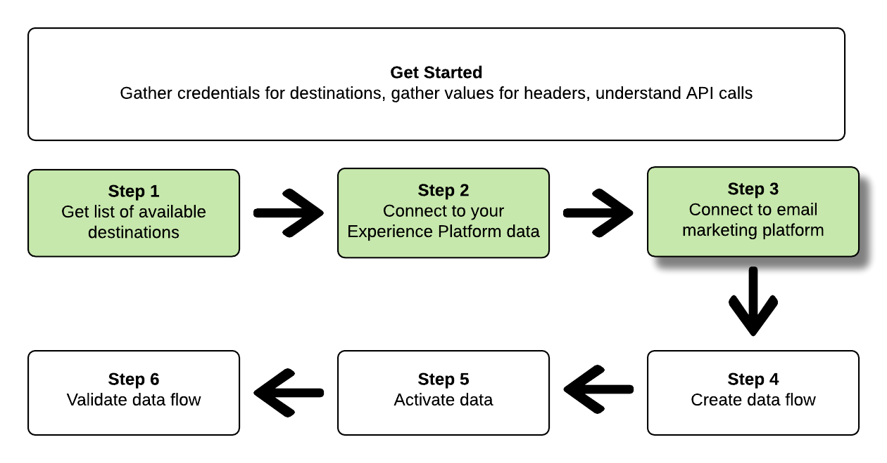

# Verbinding maken met marketingdoelen voor e-mail en gegevens activeren met de Flow Service API

Deze zelfstudie laat zien hoe u API-aanroepen kunt gebruiken om verbinding te maken met uw Adobe Experience Platform-gegevens en een [e-mailmarketingbestemming](../catalog/email-marketing/overview.md), maakt u een gegevensstroom naar de nieuwe bestemming en activeert u gegevens naar de nieuwe bestemming.

In deze zelfstudie wordt de Adobe Campaign-bestemming in alle voorbeelden gebruikt, maar de stappen zijn identiek voor alle marketingdoelen per e-mail.


Als u liever de gebruikersinterface in Platform gebruikt om een doel te verbinden en gegevens te activeren, raadpleegt u de [Een doel verbinden](../ui/connect-destination.md) en [Gebruikersgegevens activeren om exportdoelen voor batchprofielen te maken](../ui/activate-batch-profile-destinations.md) zelfstudies.

## Aan de slag

Deze handleiding vereist een goed begrip van de volgende onderdelen van Adobe Experience Platform:

* [[!DNL Experience Data Model (XDM) System]](../../xdm/home.md): Het gestandaardiseerde kader waardoor [!DNL Experience Platform] organiseert de gegevens van de klantenervaring.
* [[!DNL Catalog Service]](../../catalog/home.md): [!DNL Catalog] is het registratiesysteem voor gegevenslocatie en -lijn binnen [!DNL Experience Platform].
* [[!DNL Sandboxes]](../../sandboxes/home.md): [!DNL Experience Platform] biedt virtuele sandboxen die één enkele partitie maken [!DNL Platform] in afzonderlijke virtuele omgevingen om toepassingen voor digitale ervaringen te ontwikkelen en te ontwikkelen.

De volgende secties verstrekken extra informatie die u zult moeten weten om gegevens aan e-mail marketing bestemmingen in Platform te activeren.

### Vereiste referenties verzamelen

Om de stappen in dit leerprogramma te voltooien, zou u de volgende geloofsbrieven klaar moeten hebben, afhankelijk van het type van bestemmingen dat u verbindt en segmenten aan activeert.

* Voor [!DNL Amazon] S3-verbindingen met e-mailmarketingplatforms: `accessId`, `secretKey`
* Voor SFTP-verbindingen met e-mailmarketingplatforms: `domain`, `port`, `username`, `password` of `ssh key` (afhankelijk van de verbindingsmethode met de FTP-locatie)

### API-voorbeeldaanroepen lezen

Deze zelfstudie biedt voorbeeld-API-aanroepen om aan te tonen hoe uw verzoeken moeten worden opgemaakt. Dit zijn paden, vereiste kopteksten en correct opgemaakte ladingen voor aanvragen. Voorbeeld-JSON die wordt geretourneerd in API-reacties, wordt ook verschaft. Voor informatie over de conventies die worden gebruikt in documentatie voor voorbeeld-API-aanroepen raadpleegt u de sectie over [voorbeeld-API-aanroepen lezen](../../landing/troubleshooting.md#how-do-i-format-an-api-request) in de [!DNL Experience Platform] gids voor probleemoplossing.

### Waarden verzamelen voor vereiste en optionele koppen

Om vraag te maken aan [!DNL Platform] API&#39;s, moet u eerst de [verificatiezelfstudie](https://www.adobe.com/go/platform-api-authentication-en). Het voltooien van de zelfstudie over verificatie biedt de waarden voor elk van de vereiste kopteksten in alle [!DNL Experience Platform] API-aanroepen, zoals hieronder wordt getoond:

* Autorisatie: Drager `{ACCESS_TOKEN}`
* x-api-key: `{API_KEY}`
* x-gw-ims-org-id: `{IMS_ORG}`

Bronnen in [!DNL Experience Platform] kan worden geïsoleerd naar specifieke virtuele sandboxen. In verzoeken om [!DNL Platform] API&#39;s kunt u de naam en id opgeven van de sandbox waarin de bewerking plaatsvindt. Dit zijn optionele parameters.

* x-sandbox-name: `{SANDBOX_NAME}`

>[!NOTE]
>
>Voor meer informatie over sandboxen in [!DNL Experience Platform], zie de [overzichtsdocumentatie van sandbox](../../sandboxes/home.md).

Alle verzoeken die een nuttige lading (POST, PUT, PATCH) bevatten vereisen een extra media type kopbal:

* Inhoudstype: `application/json`

### Documentatie voor de wagenbak

In deze zelfstudie in Swagger vindt u begeleidende referentiedocumentatie voor alle API-aanroepen. Zie de [Flow Service API-documentatie over Adobe I/O](https://www.adobe.io/experience-platform-apis/references/flow-service/). We raden u aan deze zelfstudie en de documentatiepagina van Swagger parallel te gebruiken.

## Krijg de lijst van beschikbare bestemmingen {#get-the-list-of-available-destinations}


Als eerste stap moet u bepalen naar welke e-mailmarketingbestemming de gegevens moeten worden geactiveerd. Om met te beginnen, voer een vraag uit om een lijst van beschikbare bestemmingen te verzoeken die u segmenten kunt verbinden en activeren aan. Voer het volgende verzoek van de GET uit aan `connectionSpecs` eindpunt om een lijst van beschikbare bestemmingen terug te keren:

**API-indeling**

```http
GET /connectionSpecs
```

**Verzoek**

<!--

```shell
curl -X GET \
    'http://platform.adobe.io/data/foundation/flowservice/connectionSpecs' \
    -H 'Authorization: Bearer {ACCESS_TOKEN}' \
    -H 'x-api-key: {API_KEY}' \
    -H 'x-gw-ims-org-id: {IMS_ORG}' \
    -H 'x-sandbox-name: {SANDBOX_NAME}' \
    -H 'x-sandbox-id: {SANDBOX_ID}' \    
    -H 'Content-Type: application/json' \
```

-->

```shell
curl --location --request GET 'https://platform.adobe.io/data/foundation/flowservice/connectionSpecs' \
--header 'accept: application/json' \
--header 'x-gw-ims-org-id: {IMS_ORG}' \
--header 'x-api-key: {API_KEY}' \
--header 'x-sandbox-name: {SANDBOX_NAME}' \
--header 'Authorization: Bearer {ACCESS_TOKEN}'
```


**Antwoord**

Een succesvolle reactie bevat een lijst met beschikbare bestemmingen en hun unieke id&#39;s (`id`). Sla de waarde op van het doel dat u wilt gebruiken, zoals in verdere stappen wordt vereist. Als u bijvoorbeeld segmenten wilt verbinden en leveren aan Adobe Campaign, zoekt u het volgende fragment in het antwoord:

```json
{
    "id": "0b23e41a-cb4a-4321-a78f-3b654f5d7d97",
  "name": "Adobe Campaign",
  ...
  ...
}
```

## Verbinding maken met uw [!DNL Experience Platform] data {#connect-to-your-experience-platform-data}


Vervolgens moet u verbinding maken met uw [!DNL Experience Platform] gegevens, zodat u profielgegevens kunt exporteren en activeren in de gewenste bestemming. Deze bestaat uit twee substappen die hieronder worden beschreven.

1. Eerst, moet u een vraag uitvoeren om toegang tot uw gegevens toe te staan binnen [!DNL Experience Platform]door een basisverbinding in te stellen.
2. Dan, gebruikend identiteitskaart van de basisverbinding, zult u een andere vraag maken waarin u een bronverbinding creeert, die de verbinding aan uw vestigt [!DNL Experience Platform] gegevens.


### Toegang tot uw gegevens toestaan in [!DNL Experience Platform]

**API-indeling**

```http
POST /connections
```

**Verzoek**

<!--

```shell
curl -X POST \
    'http://platform.adobe.io/data/foundation/flowservice/connections' \
    -H 'Authorization: Bearer {ACCESS_TOKEN}' \
    -H 'x-api-key: {API_KEY}' \
    -H 'x-gw-ims-org-id: {IMS_ORG}' \
    -H 'x-sandbox-name: {SANDBOX_NAME}' \
    -H 'x-sandbox-id: {SANDBOX_ID}' \ 
    -H 'Content-Type: application/json' \
    -d  '{
            
            "name": "Base connection to Experience Platform",
            "description": "This call establishes the connection to Experience Platform data",
            "connectionSpec": {
                "id": "{CONNECTION_SPEC}",
                "version": "1.0"
            }
           }'
```

-->

```shell
curl --location --request POST 'https://platform.adobe.io/data/foundation/flowservice/connections' \
--header 'Authorization: Bearer {ACCESS_TOKEN}' \
--header 'x-api-key: {API_KEY}' \
--header 'x-gw-ims-org-id: {IMS_ORG}' \
--header 'x-sandbox-name: {SANDBOX_NAME}' \
--header 'Content-Type: application/json' \
--data-raw '{
            "name": "Base connection to Experience Platform",
            "description": "This call establishes the connection to Experience Platform data",
            "connectionSpec": {
                "id": "{CONNECTION_SPEC_ID}",
                "version": "1.0"
            }
}'
```


* `{CONNECTION_SPEC_ID}`: Gebruik de verbindingsspecificatie-id voor profielservice - `8a9c3494-9708-43d7-ae3f-cda01e5030e1`.

**Antwoord**

Een geslaagde reactie bevat de unieke id van de basisverbinding (`id`). Sla deze waarde op zoals vereist in de volgende stap om de bronverbinding te maken.

```json
{
    "id": "1ed86558-59b5-42f7-9865-5859b552f7f4"
}
```

### Verbinding maken met uw [!DNL Experience Platform] data {#connect-to-platform-data}

**API-indeling**

```http
POST /sourceConnections
```

**Verzoek**

<!--

```shell
curl -X POST \
    'http://platform.adobe.io/data/foundation/flowservice/sourceConnections' \
    -H 'Authorization: Bearer {ACCESS_TOKEN}' \
    -H 'x-api-key: {API_KEY}' \
    -H 'x-gw-ims-org-id: {IMS_ORG}' \
    -H 'x-sandbox-id: {SANDBOX_ID}' \ 
    -H 'x-sandbox-name: {SANDBOX_NAME}' \
    -H 'Content-Type: application/json' \
    -d  '{
  "name": "Connecting to Profile Service",
  "description": "Optional",
  "baseConnectionId": "{BASE_CONNECTION_ID}",
  "connectionSpec": {
    "id": "{CONNECTION_SPEC}",
    "version": "1.0"
  },
  "data": {
    "format": "CSV",
    "schema": null
  }
  }
```

-->

```shell
curl --location --request POST 'https://platform.adobe.io/data/foundation/flowservice/sourceConnections' \
--header 'Authorization: Bearer {ACCESS_TOKEN}' \
--header 'x-api-key: {API_KEY}' \
--header 'x-gw-ims-org-id: {IMS_ORG}' \
--header 'x-sandbox-name: {SANDBOX_NAME}' \
--header 'Content-Type: application/json' \
--data-raw '{
            "name": "Connecting to Profile Service",
            "description": "Optional",
            "connectionSpec": {
                "id": "{CONNECTION_SPEC_ID}",
                "version": "1.0"
            },
            "baseConnectionId": "{BASE_CONNECTION_ID}",
            "data": {
                "format": "CSV",
                "schema": null
            },
            "params": {}
}'
```

* `{BASE_CONNECTION_ID}`: Gebruik de id die u in de vorige stap hebt gekregen.
* `{CONNECTION_SPEC_ID}`: De specificatie-id van de verbinding gebruiken voor [!DNL Profile Service] - `8a9c3494-9708-43d7-ae3f-cda01e5030e1`.

**Antwoord**

Een geslaagde reactie retourneert de unieke id (`id`) voor de nieuwe bronverbinding met [!DNL Profile Service]. Dit bevestigt dat u verbinding hebt gemaakt met uw [!DNL Experience Platform] gegevens. Sla deze waarde op zoals deze in een latere stap wordt vereist.

```json
{
    "id": "ed48ae9b-c774-4b6e-88ae-9bc7748b6e97"
}
```


## Verbinding maken met marketingdoel voor e-mail {#connect-to-email-marketing-destination}



In deze stap stelt u een verbinding in met uw gewenste e-mailmarketingbestemming. Deze bestaat uit twee substappen die hieronder worden beschreven.

1. Eerst, moet u een vraag uitvoeren om toegang tot de e-maildienstverlener toe te staan, door opstelling een basisverbinding.
2. Vervolgens doet u met de id van de basisverbinding een volgende aanroep waarin u een doelverbinding maakt. Hiermee geeft u in uw opslagaccount de locatie op waar de geëxporteerde gegevens worden geleverd en de indeling van de gegevens die worden geëxporteerd.

### Toegang tot de e-mailmarketingbestemming toestaan

**API-indeling**

```http
POST /connections
```

**Verzoek**

<!--

```shell
curl -X POST \
    'http://platform.adobe.io/data/foundation/flowservice/connections' \
    -H 'Authorization: Bearer {ACCESS_TOKEN}' \
    -H 'x-api-key: {API_KEY}' \
    -H 'x-gw-ims-org-id: {IMS_ORG}' \
    -H 'x-sandbox-name: {SANDBOX_NAME}' \
    -H 'x-sandbox-id: {SANDBOX_ID}' \ 
    -H 'Content-Type: application/json' \
    -d  '{
            
            "name": "S3 Connection for Adobe Campaign",
            "description": "ACME company holiday campaign",
            "connectionSpec": {
                "id": "{CONNECTION_SPEC}",
                "version": "1.0"
            },
            "auth": {
                "specName": "{S3 or SFTP}",
                "params": {
                    "accessId": "{ACCESS_ID}",
                    "secretKey": "{SECRET_KEY}"
                }
            }
           }'
```

-->

```shell
curl --location --request POST 'https://platform.adobe.io/data/foundation/flowservice/connections' \
--header 'Authorization: Bearer {ACCESS_TOKEN}' \
--header 'x-api-key: {API_KEY}' \
--header 'x-gw-ims-org-id: {IMS_ORG}' \
--header 'x-sandbox-name: {SANDBOX_NAME}' \
--header 'Content-Type: application/json' \
--data-raw '{
    "name": "S3 Connection for Adobe Campaign",
    "description": "summer advertising campaign",
    "connectionSpec": {
        "id": "{_CONNECTION_SPEC_ID}",
        "version": "1.0"
    },
    "auth": {
        "specName": "{S3 or SFTP}",
        "params": {
            "accessId": "{ACCESS_ID}",
            "secretKey": "{SECRET_KEY}"
        }
    }
}'
```

* `{CONNECTION_SPEC_ID}`: Gebruik de verbindingsspecificatie-id die u in de stap hebt opgehaald [Krijg de lijst van beschikbare bestemmingen](#get-the-list-of-available-destinations).
* `{S3 or SFTP}`: Vul het gewenste verbindingstype voor deze bestemming in. In de [doelcatalogus](../catalog/overview.md)Blader naar de gewenste bestemming om te zien of de S3- en/of SFTP-verbindingstypen worden ondersteund.
* `{ACCESS_ID}`: Uw toegangs-id voor uw [!DNL Amazon] S3-opslaglocatie.
* `{SECRET_KEY}`: Je geheime sleutel voor je [!DNL Amazon] S3-opslaglocatie.

**Antwoord**

Een geslaagde reactie bevat de unieke id van de basisverbinding (`id`). Sla deze waarde op zoals vereist in de volgende stap om een doelverbinding te maken.

```json
{
    "id": "1ed86558-59b5-42f7-9865-5859b552f7f4"
}
```

### Opslaglocatie en gegevensindeling opgeven

[!DNL Adobe Experience Platform] exporteert gegevens voor e-mailmarketing en cloudopslagbestemmingen in de vorm van [!DNL CSV] bestanden.

>[!IMPORTANT]
> 
>[!DNL Adobe Experience Platform] Hiermee worden de exportbestanden automatisch gesplitst op 5 miljoen records (rijen) per bestand. Elke rij vertegenwoordigt één profiel.
>
>Namen van gesplitste bestanden worden toegevoegd met een getal dat aangeeft dat het bestand deel uitmaakt van een grotere exportbewerking, als zodanig: `filename.csv`, `filename_2.csv`, `filename_3.csv`.

**API-indeling**

```http
POST /targetConnections
```

**Verzoek**

<!--

```shell
curl -X POST \
    'http://platform.adobe.io/data/foundation/flowservice/targetConnections' \
    -H 'Authorization: Bearer {ACCESS_TOKEN}' \
    -H 'x-api-key: {API_KEY}' \
    -H 'x-gw-ims-org-id: {IMS_ORG}' \
    -H 'x-sandbox-name: {SANDBOX_NAME}' \    
    -H 'x-sandbox-id: {SANDBOX_ID}' \ 
    -H 'Content-Type: application/json' \
    -d  '{
   "baseConnectionId": "{BASE_CONNECTION_ID}",
   "name": "TargetConnection for Adobe Campaign",
   "data": {
       "format": "CSV",
       "schema": {
           "id": "1.0",
           "version": "1.0"
       },
    "connectionSpec": {
    "id": "{CONNECTION_SPEC_ID}",
    "version": "1.0"
   },
   "params": {
       "mode": "S3",
       "bucketName": "{BUCKETNAME}",
       "path": "{FILEPATH}"
    }
    }
```

-->

```shell
curl --location --request POST 'https://platform.adobe.io/data/foundation/flowservice/targetConnections' \
--header 'Authorization: Bearer {ACCESS_TOKEN}' \
--header 'x-api-key: {API_KEY}' \
--header 'x-gw-ims-org-id: {IMS_ORG}' \
--header 'Content-Type: application/json' \
--data-raw '{
    "name": "TargetConnection for Adobe Campaign",
    "description": "Connection to Adobe Campaign",
    "baseConnectionId": "{BASE_CONNECTION_ID}",
    "connectionSpec": {
        "id": "{CONNECTION_SPEC_ID}",
        "version": "1.0"
    },
    "data": {
        "format": "json",
        "schema": {
            "id": "1.0",
            "version": "1.0"
        }
    },
    "params": {
        "mode": "S3",
        "bucketName": "{BUCKETNAME}",
        "path": "{FILEPATH}",
        "format": "CSV"
    }
}'
```

* `{BASE_CONNECTION_ID}`: Gebruik de basisverbindings-id die u in de bovenstaande stap hebt verkregen.
* `{CONNECTION_SPEC_ID}`: De verbindingsspecificaties gebruiken die u in de stap hebt verkregen [Krijg de lijst van beschikbare bestemmingen](#get-the-list-of-available-destinations).
* `{BUCKETNAME}`: Uw [!DNL Amazon] S3 emmertje, waar Platform de gegevensuitvoer zal deponeren.
* `{FILEPATH}`: Het pad in uw [!DNL Amazon] S3 emmerfolder waar het Platform de gegevensuitvoer zal deponeren.

**Antwoord**

Een geslaagde reactie retourneert de unieke id (`id`) voor de nieuwe doelverbinding met uw e-mailmarketingbestemming. Sla deze waarde op zoals deze in latere stappen wordt vereist.

```json
{
    "id": "12ab90c7-519c-4291-bd20-d64186b62da8"
}
```

## Een gegevensstroom maken


Met de id&#39;s die u in de vorige stappen hebt opgehaald, kunt u nu een gegevensstroom maken tussen de [!DNL Experience Platform] gegevens en de bestemming waarnaar u gegevens wilt activeren. Beschouw deze stap als het construeren van de pijpleiding, waardoor de gegevens later, tussen zullen stromen [!DNL Experience Platform] en uw gewenste bestemming.

Om een gegevensstroom tot stand te brengen, voer een verzoek van de POST uit, zoals hieronder getoond, terwijl het verstrekken van de hieronder vermelde waarden binnen de lading.

Voer het volgende verzoek van de POST uit om een gegevensstroom tot stand te brengen.

**API-indeling**

```http
POST /flows
```

**Verzoek**

```shell
curl -X POST \
'https://platform.adobe.io/data/foundation/flowservice/flows' \
-H 'Authorization: Bearer {ACCESS_TOKEN}' \
-H 'x-api-key: {API_KEY}' \
-H 'x-gw-ims-org-id: {IMS_ORG}' \
-H 'x-sandbox-name: {SANDBOX_NAME}' \
-H 'Content-Type: application/json' \
-d  '{
   
        "name": "Activate segments to Adobe Campaign",
        "description": "This operation creates a dataflow which we will later use to activate segments to Adobe Campaign",
        "flowSpec": {
            "id": "{FLOW_SPEC_ID}",
            "version": "1.0"
        },
        "sourceConnectionIds": [
            "{SOURCE_CONNECTION_ID}"
        ],
        "targetConnectionIds": [
            "{TARGET_CONNECTION_ID}"
        ],
        "transformations": [
            {
                "name": "GeneralTransform",
                "params": {
                    "segmentSelectors": {
                        "selectors": []
                    },
                    "profileSelectors": {
                        "selectors": []
                    }
                }
            }
        ]
    }
```

* `{FLOW_SPEC_ID}`: Gebruik de flow voor de e-mailmarketingbestemming waarmee u verbinding wilt maken. Om de stroomspecificatie te krijgen, voer een verrichting van de GET op uit `flowspecs` eindpunt. Zie hier de documentatie van Swagger: https://platform.adobe.io/data/foundation/flowservice/swagger#/Flow%20Specs%20API/getFlowSpecs. In de reactie zoekt u naar `upsTo` en kopieer de bijbehorende id van de e-mailmarketingbestemming waarmee u verbinding wilt maken. Voor Adobe Campaign kunt u bijvoorbeeld zoeken naar `upsToCampaign` en kopieert u de `id` parameter.
* `{SOURCE_CONNECTION_ID}`: Gebruik de bronverbindings-id die u in de stap hebt opgehaald [Verbinding maken met uw Experience Platform](#connect-to-your-experience-platform-data).
* `{TARGET_CONNECTION_ID}`: Gebruik de doel-verbindings-id die u in de stap hebt verkregen [Verbinding maken met marketingdoel voor e-mail](#connect-to-email-marketing-destination).

**Antwoord**

Een geslaagde reactie retourneert de id (`id`) van de nieuwe gegevensstroom en een `etag`. Noteer beide waarden. om segmenten te activeren, zoals u dat in de volgende stap doet.

```json
{
    "id": "8256cfb4-17e6-432c-a469-6aedafb16cd5",
    "etag": "8256cfb4-17e6-432c-a469-6aedafb16cd5"
}
```


## Gegevens activeren naar uw nieuwe bestemming


Nadat u alle verbindingen en de gegevensstroom hebt gemaakt, kunt u nu uw profielgegevens activeren naar het e-mailmarketingplatform. In deze stap selecteert u welke segmenten en welke profielkenmerken u naar de bestemming verzendt en kunt u gegevens plannen en naar de bestemming verzenden.

Als u segmenten naar uw nieuwe bestemming wilt activeren, moet u een JSON PATCH-bewerking uitvoeren, vergelijkbaar met het onderstaande voorbeeld. U kunt veelvoudige segmenten en profielattributen in één vraag activeren. Voor meer informatie over JSON PATCH raadpleegt u de [RFC-specificatie](https://tools.ietf.org/html/rfc6902).

**API-indeling**

```http
PATCH /flows
```

**Verzoek**

```shell
curl --location --request PATCH 'https://platform.adobe.io/data/foundation/flowservice/flows/{DATAFLOW_ID}' \
--header 'Authorization: Bearer {ACCESS_TOKEN}' \
--header 'x-api-key: {API_KEY}' \
--header 'x-gw-ims-org-id: {IMS_ORG}' \
--header 'Content-Type: application/json' \
--header 'x-sandbox-name: {SANDBOX_NAME}' \
--header 'If-Match: "{ETAG}"' \
--data-raw '[
    {
        "op": "add",
        "path": "/transformations/0/params/segmentSelectors/selectors/-",
        "value": {
            "type": "PLATFORM_SEGMENT",
            "value": {
                "name": "Name of the segment that you are activating",
                "description": "Description of the segment that you are activating",
                "id": "{SEGMENT_ID}"
            }
        }
    },
        {
        "op": "add",
        "path": "/transformations/0/params/segmentSelectors/selectors/-",
        "value": {
            "type": "PLATFORM_SEGMENT",
            "value": {
                "name": "Name of the segment that you are activating",
                "description": "Description of the segment that you are activating",
                "id": "{SEGMENT_ID}"
            }
        }
    },
        {
        "op": "add",
        "path": "/transformations/0/params/profileSelectors/selectors/-",
        "value": {
            "type": "JSON_PATH",
            "value": {
                "operator": "EXISTS",
                "path": "{PROFILE_ATTRIBUTE}"
            }
        }
    }
]
```

* `{DATAFLOW_ID}`: Gebruik de gegevensstroom die u in de vorige stap hebt verkregen.
* `{ETAG}`: Gebruik het label dat u in de vorige stap hebt verkregen.
* `{SEGMENT_ID}`: Geef de segment-id op die u naar dit doel wilt exporteren. Ga naar **https://www.adobe.io/apis/experienceplatform/home/api-reference.html#/**, selecteert u **[!UICONTROL Segmentation Service API]** in het linkernavigatiemenu, en zoek naar `GET /segment/definitions` bewerking in **[!UICONTROL Segment Definitions]**.
* `{PROFILE_ATTRIBUTE}`: Bijvoorbeeld, `"person.lastName"`

**Antwoord**

Kijk naar een 202 OK-antwoord. Er wordt geen responsorgaan geretourneerd. Om te bevestigen dat het verzoek correct was, zie de volgende stap, de gegevensstroom bevestigen.

## De gegevensstroom valideren


Als laatste stap in de zelfstudie moet u controleren of de segmenten en profielkenmerken correct zijn toegewezen aan de gegevensstroom.

Om dit te bevestigen, voer het volgende verzoek van de GET uit:

**API-indeling**

```http
GET /flows
```

**Verzoek**

```shell
curl --location --request PATCH 'https://platform.adobe.io/data/foundation/flowservice/flows/{DATAFLOW_ID}' \
--header 'Authorization: Bearer {ACCESS_TOKEN}' \
--header 'x-api-key: {API_KEY}' \
--header 'x-gw-ims-org-id: {IMS_ORG}' \
--header 'Content-Type: application/json' \
--header 'x-sandbox-name: prod' \
--header 'If-Match: "{ETAG}"' 
```

* `{DATAFLOW_ID}`: Gebruik de gegevensstroom uit de vorige stap.
* `{ETAG}`: Gebruik het label van de vorige stap.

**Antwoord**

De geretourneerde reactie moet worden opgenomen in de `transformations` parameter de segmenten en profielkenmerken die u in de vorige stap hebt verzonden. Een monster `transformations` de parameter in het antwoord kan er als volgt uitzien :

```json
"transformations": [
    {
        "name": "GeneralTransform",
        "params": {
            "profileSelectors": {
                "selectors": []
            },
            "segmentSelectors": {
                "selectors": [
                    {
                        "type": "PLATFORM_SEGMENT",
                        "value": {
                            "name": "Men over 50",
                            "description": "",
                            "id": "72ddd79b-6b0a-4e97-a8d2-112ccd81bd02"
                        }
                    }
                ]
            }
        }
    }
],
```

## Volgende stappen

Door deze zelfstudie te volgen, hebt u met succes Platform met één van uw aangewezen e-mailmarketing bestemmingen verbonden en opstelling een gegevensstroom aan de respectieve bestemming. De uitgaande gegevens kunnen nu in de bestemming voor e-mailcampagnes, gerichte reclame, en vele andere gebruiksgevallen worden gebruikt. Raadpleeg de volgende pagina&#39;s voor meer informatie:

* [Overzicht van doelen](../home.md)
* [Overzicht van de doelcatalogus](../catalog/overview.md)
