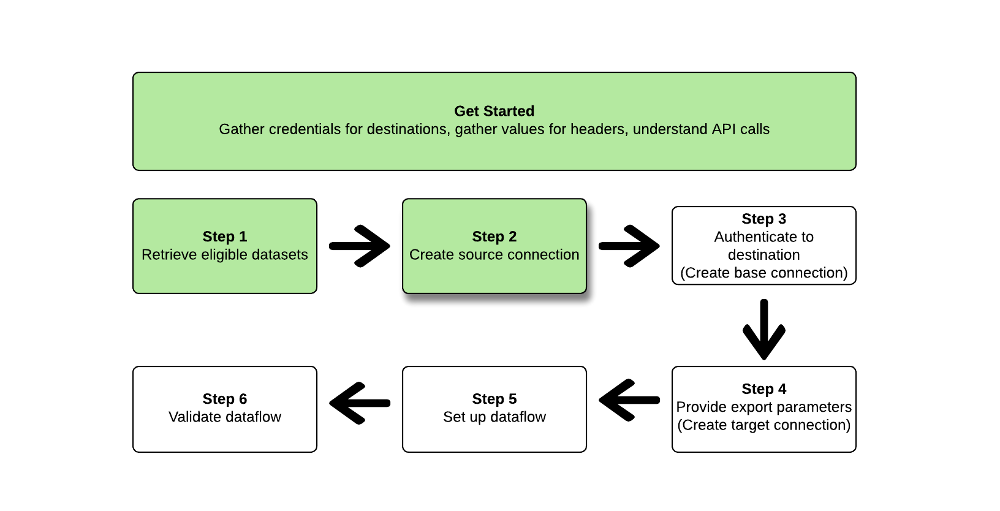

# Gegevenssets exporteren met de [!DNL Flow Service API]

>[!AVAILABILITY]
>
>* Deze functionaliteit is beschikbaar voor klanten die het Real-Time CDP Prime- en Ultimate-pakket, Adobe Journey Optimizer of Customer Journey Analytics hebben aangeschaft. Neem contact op met uw Adobe-vertegenwoordiger voor meer informatie.

>[!IMPORTANT]
>
>**het punt van de Actie**: De [ versie van September 2024 van Experience Platform ](/help/release-notes/latest/latest.md#destinations) introduceerde de optie om een `endTime` datum voor de gegevens van de uitvoerdataset te plaatsen. Adobe heeft ook een standaardeinddatum van 1 Mei 2025 voor alle gegevens van de datasetuitvoer gecreeerd *vóór de versie van september 2024* geïntroduceerd.
>
>Voor om het even welke dataflows, moet u de einddatum in dataflow manueel bijwerken vóór de einddatum, anders zal uw uitvoer op die datum ophouden. Gebruik de gebruikersinterface van Experience Platform om te bekijken welke dataflows op 1 mei 2025 worden ingesteld.
>
>Op dezelfde manier voor dataflows die u maakt zonder een `endTime` -datum op te geven, worden deze standaard ingesteld op een eindtijd van zes maanden vanaf het tijdstip waarop ze worden gemaakt.

<!--

>You can retrieve a list of such dataflows by performing the following API call: `https://platform.adobe.io/data/foundation/flowservice/flows?property=scheduleParams.endTime==UNIXTIMESTAMPTHATWEWILLUSE`
>

-->

Dit artikel verklaart het werkschema wordt vereist om [!DNL Flow Service API] te gebruiken om [ datasets ](/help/catalog/datasets/overview.md) van Adobe Experience Platform naar uw aangewezen plaats van de wolkenopslag, zoals [!DNL Amazon S3], plaatsen SFTP, of [!DNL Google Cloud Storage] uit te voeren die.

>[!TIP]
>
>U kunt de gebruikersinterface van Experience Platform ook gebruiken om datasets uit te voeren. Lees het [ leerprogramma van de de uitvoerdatasets UI ](/help/destinations/ui/export-datasets.md) voor meer informatie.

## Beschikbare gegevensbestanden voor exporteren {#datasets-to-export}

De gegevenssets die u kunt exporteren, zijn afhankelijk van de Experience Platform-toepassing (Real-Time CDP, Adobe Journey Optimizer), de laag (Prime of Ultimate) en alle invoegtoepassingen die u hebt aangeschaft (bijvoorbeeld Data Distiller).

Verwijs naar de [ lijst op de pagina van het UI leerprogramma ](/help/destinations/ui/export-datasets.md#datasets-to-export) om te begrijpen welke datasets u kunt uitvoeren.

## Ondersteunde doelen {#supported-destinations}

Momenteel, kunt u datasets naar de bestemmingen van de wolkenopslag uitvoeren die in het schermafbeelding worden benadrukt en hieronder worden vermeld.

 steunen

* [[!DNL Azure Data Lake Storage Gen2]](../../destinations/catalog/cloud-storage/adls-gen2.md)
* [[!DNL Data Landing Zone]](../../destinations/catalog/cloud-storage/data-landing-zone.md)
* [[!DNL Google Cloud Storage]](../../destinations/catalog/cloud-storage/google-cloud-storage.md)
* [[!DNL Amazon S3]](../../destinations/catalog/cloud-storage/amazon-s3.md#changelog)
* [[!DNL Azure Blob]](../../destinations/catalog/cloud-storage/azure-blob.md#changelog)
* [[!DNL SFTP]](../../destinations/catalog/cloud-storage/sftp.md#changelog)

## Aan de slag {#get-started}


Deze handleiding vereist een goed begrip van de volgende onderdelen van Adobe Experience Platform:

* [[!DNL Experience Platform datasets]](/help/catalog/datasets/overview.md): alle gegevens die met succes in Adobe Experience Platform worden opgenomen, blijven in [!DNL Data Lake] als gegevenssets behouden. Een dataset is een opslag en beheersconstructie voor een inzameling van gegevens, typisch een lijst, die een schema (kolommen) en gebieden (rijen) bevat. Datasets bevatten ook metagegevens die verschillende aspecten van de gegevens beschrijven die ze opslaan.
   * [[!DNL Sandboxes]](../../sandboxes/home.md): [!DNL Experience Platform] biedt virtuele sandboxen die één [!DNL Experience Platform] -instantie in afzonderlijke virtuele omgevingen verdelen om toepassingen voor digitale ervaringen te ontwikkelen en te ontwikkelen.

De volgende secties verstrekken extra informatie die u moet weten om datasets naar de bestemmingen van de wolkenopslag in Experience Platform uit te voeren.

### Vereiste machtigingen {#permissions}

Om datasets uit te voeren, hebt u **[!UICONTROL View Destinations]**, **[!UICONTROL View Datasets]**, en **[!UICONTROL Manage and Activate Dataset Destinations]** [ toegangsbeheertoestemmingen ](/help/access-control/home.md#permissions) nodig. Lees het [ overzicht van de toegangscontrole ](/help/access-control/ui/overview.md) of contacteer uw productbeheerder om de vereiste toestemmingen te verkrijgen.

Om ervoor te zorgen dat u de noodzakelijke toestemmingen hebt om datasets uit te voeren en dat de bestemming het uitvoeren van datasets steunt, doorblader de bestemmingscatalogus. Als een doel een **[!UICONTROL Activate]** - of **[!UICONTROL Export datasets]** -besturingselement heeft, hebt u de juiste machtigingen.

### API-voorbeeldaanroepen lezen {#reading-sample-api-calls}

Deze zelfstudie biedt voorbeeld-API-aanroepen om aan te tonen hoe uw verzoeken moeten worden opgemaakt. Dit zijn paden, vereiste kopteksten en correct opgemaakte ladingen voor aanvragen. Voorbeeld-JSON die wordt geretourneerd in API-reacties, wordt ook verschaft. Voor informatie over de overeenkomsten die in documentatie voor steekproef API vraag worden gebruikt, zie de sectie op [ hoe te om voorbeeld API vraag ](../../landing/troubleshooting.md#how-do-i-format-an-api-request) in de [!DNL Experience Platform] het oplossen van problemengids te lezen.

### Waarden verzamelen voor vereiste en optionele koppen {#gather-values-headers}

Om vraag aan [!DNL Experience Platform] APIs te maken, moet u het [ de authentificatieleerprogramma van Experience Platform ](https://www.adobe.com/go/platform-api-authentication-en) eerst voltooien. Als u de zelfstudie over verificatie voltooit, krijgt u de waarden voor elk van de vereiste headers in alle API-aanroepen van [!DNL Experience Platform] , zoals hieronder wordt getoond:

* Autorisatie: Drager `{ACCESS_TOKEN}`
* x-api-key: `{API_KEY}`
* x-gw-ims-org-id: `{ORG_ID}`

Bronnen in [!DNL Experience Platform] kunnen worden geïsoleerd naar specifieke virtuele sandboxen. In aanvragen voor [!DNL Experience Platform] API&#39;s kunt u de naam en id opgeven van de sandbox waarin de bewerking plaatsvindt. Dit zijn optionele parameters.

* x-sandbox-name: `{SANDBOX_NAME}`

>[!NOTE]
>
>Voor meer informatie over zandbakken in [!DNL Experience Platform], zie de [ documentatie van het zandbakoverzicht ](../../sandboxes/home.md).

Alle verzoeken die een lading (POST, PUT, PATCH) bevatten vereisen een extra media typekopbal:

* Inhoudstype: `application/json`

### API-naslagdocumentatie {#api-reference-documentation}

In deze zelfstudie vindt u begeleidende referentiedocumentatie voor alle API-bewerkingen. Raadpleeg de documentatie bij de API voor [[!DNL Flow Service]  Doelen op de Adobe Developer-website ](https://developer.adobe.com/experience-platform-apis/references/destinations/) . We raden u aan deze zelfstudie en de API-naslagdocumentatie parallel te gebruiken.

### Woordenlijst {#glossary}

Voor beschrijvingen van de termijnen die u in dit API leerprogramma zult ontmoeten, lees de [ verklarende woordenlijstsectie ](https://developer.adobe.com/experience-platform-apis/references/destinations/#tag/Glossary) van de API verwijzingsdocumentatie.

### Verbindingsspecificaties en stroomspecificaties voor uw gewenste doel verzamelen {#gather-connection-spec-flow-spec}

Alvorens de werkschema te beginnen om een dataset uit te voeren, identificeer de verbindingsspecificatie en stroom specificiteit IDs van de bestemming waarnaar u datasets wilt uitvoeren. Gebruik de onderstaande tabel ter referentie.


| Bestemming | Verbindingsspecificatie | Stroomspecificatie |
---------|----------|---------|
| [!DNL Amazon S3] | `4fce964d-3f37-408f-9778-e597338a21ee` | `269ba276-16fc-47db-92b0-c1049a3c131f` |
| [!DNL Azure Blob Storage] | `6d6b59bf-fb58-4107-9064-4d246c0e5bb2` | `95bd8965-fc8a-4119-b9c3-944c2c2df6d2` |
| [!DNL Azure Data Lake Gen 2(ADLS Gen2)] | `be2c3209-53bc-47e7-ab25-145db8b873e1` | `17be2013-2549-41ce-96e7-a70363bec293` |
| [!DNL Data Landing Zone(DLZ)] | `10440537-2a7b-4583-ac39-ed38d4b848e8` | `cd2fc47e-e838-4f38-a581-8fff2f99b63a` |
| [!DNL Google Cloud Storage] | `c5d93acb-ea8b-4b14-8f53-02138444ae99` | `585c15c4-6cbf-4126-8f87-e26bff78b657` |
| SFTP | `36965a81-b1c6-401b-99f8-22508f1e6a26` | `354d6aad-4754-46e4-a576-1b384561c440` |

{style="table-layout:auto"}

U hebt deze id&#39;s nodig om verschillende [!DNL Flow Service] -entiteiten samen te stellen. U moet ook naar delen van de [!DNL Connection Spec] zelf verwijzen om bepaalde entiteiten in te stellen, zodat u de instructie [!DNL Connection Spec] from [!DNL Flow Service APIs] kunt ophalen. Zie de voorbeelden hieronder van het terugwinnen van verbindingsspecificaties voor alle bestemmingen in de lijst:

>[!BEGINTABS]

>[!TAB Amazon S3]

**Verzoek**

+++Ophalen [!DNL connection spec] voor [!DNL Amazon S3]

```shell
curl --location --request GET 'https://platform.adobe.io/data/foundation/flowservice/connectionSpecs/4fce964d-3f37-408f-9778-e597338a21ee' \
--header 'accept: application/json' \
--header 'x-api-key: {API_KEY}' \
--header 'x-gw-ims-org-id: {ORG_ID}' \
--header 'x-sandbox-name: {SANDBOX_NAME}' \
--header 'Authorization: Bearer {ACCESS_TOKEN}'
```

+++

**Reactie**

+++[!DNL Amazon S3] - Verbindingsspecificatie

```json
{
    "items": [
        {
            "id": "4fce964d-3f37-408f-9778-e597338a21ee",
            "name": "Amazon S3",
            "providerId": "14e34fac-d307-11e9-bb65-2a2ae2dbcce4",
            "version": "1.0",
//...
```

+++

>[!TAB  Azure Blob Storage ]

**Verzoek**

+++Ophalen [!DNL connection spec] voor [!DNL Azure Blob Storage]

```shell
curl --location --request GET 'https://platform.adobe.io/data/foundation/flowservice/connectionSpecs/6d6b59bf-fb58-4107-9064-4d246c0e5bb2' \
--header 'accept: application/json' \
--header 'x-api-key: {API_KEY}' \
--header 'x-gw-ims-org-id: {ORG_ID}' \
--header 'x-sandbox-name: {SANDBOX_NAME}' \
--header 'Authorization: Bearer {ACCESS_TOKEN}'
```

+++

**Reactie**

+++[!DNL Azure Blob Storage] - [!DNL Connection spec]

```json
{
    "items": [
        {
            "id": "6d6b59bf-fb58-4107-9064-4d246c0e5bb2",
            "name": "Azure Blob Storage",
            "providerId": "14e34fac-d307-11e9-bb65-2a2ae2dbcce4",
            "version": "1.0",
//...
```

+++

>[!TAB  Azure Gen 2 van Gegevens (ADLS Gen2) ]

**Verzoek**

++ + ophalen [!DNL connection spec] voor [!DNL Azure Data Lake Gen 2(ADLS Gen2])

```shell
curl --location --request GET 'https://platform.adobe.io/data/foundation/flowservice/connectionSpecs/be2c3209-53bc-47e7-ab25-145db8b873e1' \
--header 'accept: application/json' \
--header 'x-api-key: {API_KEY}' \
--header 'x-gw-ims-org-id: {ORG_ID}' \
--header 'x-sandbox-name: {SANDBOX_NAME}' \
--header 'Authorization: Bearer {ACCESS_TOKEN}'
```

+++

**Reactie**

+++[!DNL Azure Data Lake Gen 2(ADLS Gen2)] - [!DNL Connection spec]

```json
{
    "items": [
        {
            "id": "be2c3209-53bc-47e7-ab25-145db8b873e1",
            "name": "Azure Data Lake Gen2",
            "providerId": "14e34fac-d307-11e9-bb65-2a2ae2dbcce4",
            "version": "1.0",
//...
```

+++

>[!TAB  Gegevens die Zone (DLZ) aanvoeren ]

**Verzoek**

+++Ophalen [!DNL connection spec] voor [!DNL Data Landing Zone(DLZ)]

```shell
curl --location --request GET 'https://platform.adobe.io/data/foundation/flowservice/connectionSpecs/10440537-2a7b-4583-ac39-ed38d4b848e8' \
--header 'accept: application/json' \
--header 'x-api-key: {API_KEY}' \
--header 'x-gw-ims-org-id: {ORG_ID}' \
--header 'x-sandbox-name: {SANDBOX_NAME}' \
--header 'Authorization: Bearer {ACCESS_TOKEN}'
```

+++

**Reactie**

+++[!DNL Data Landing Zone(DLZ)] - [!DNL Connection spec]

```json
{
    "items": [
        {
            "id": "10440537-2a7b-4583-ac39-ed38d4b848e8",
            "name": "Data Landing Zone",
            "providerId": "14e34fac-d307-11e9-bb65-2a2ae2dbcce4",
            "version": "1.0",
//...
```

+++

>[!TAB  Google Cloud Storage ]

**Verzoek**

+++Ophalen [!DNL connection spec] voor [!DNL Google Cloud Storage]

```shell
curl --location --request GET 'https://platform.adobe.io/data/foundation/flowservice/connectionSpecs/c5d93acb-ea8b-4b14-8f53-02138444ae99' \
--header 'accept: application/json' \
--header 'x-api-key: {API_KEY}' \
--header 'x-gw-ims-org-id: {ORG_ID}' \
--header 'x-sandbox-name: {SANDBOX_NAME}' \
--header 'Authorization: Bearer {ACCESS_TOKEN}'
```

+++

**Reactie**

+++[!DNL Google Cloud Storage] - [!DNL Connection spec]

```json
{
    "items": [
        {
            "id": "c5d93acb-ea8b-4b14-8f53-02138444ae99",
            "name": "Google Cloud Storage",
            "providerId": "14e34fac-d307-11e9-bb65-2a2ae2dbcce4",
            "version": "1.0",
//...
```

+++

>[!TAB SFTP]

**Verzoek**

+++ophalen [!DNL connection spec] voor SFTP

```shell
curl --location --request GET 'https://platform.adobe.io/data/foundation/flowservice/connectionSpecs/36965a81-b1c6-401b-99f8-22508f1e6a26' \
--header 'accept: application/json' \
--header 'x-api-key: {API_KEY}' \
--header 'x-gw-ims-org-id: {ORG_ID}' \
--header 'x-sandbox-name: {SANDBOX_NAME}' \
--header 'Authorization: Bearer {ACCESS_TOKEN}'
```

+++

**Reactie**

+++SFTP - [!DNL Connection spec]

```json
{
    "items": [
        {
            "id": "36965a81-b1c6-401b-99f8-22508f1e6a26",
            "name": "SFTP",
            "providerId": "14e34fac-d307-11e9-bb65-2a2ae2dbcce4",
            "version": "1.0",
//...
```

+++

>[!ENDTABS]

Voer de onderstaande stappen uit om een gegevenssetgegevensstroom in te stellen naar een opslaglocatie in de cloud. Voor sommige stappen verschillen de verzoeken en antwoorden tussen de verschillende cloudopslagbestemmingen. In die gevallen, gebruik de lusjes op de pagina om de verzoeken en de reacties terug te winnen specifiek voor de bestemming die u wilt verbinden en datasets uitvoeren naar. Gebruik de juiste [!DNL connection spec] en [!DNL flow spec] voor het doel dat u configureert.

## Een lijst met gegevenssets ophalen {#retrieve-list-of-available-datasets}


Om een lijst van datasets terug te winnen geschikt voor activering, begin door een API vraag aan het hieronder eindpunt te maken.

>[!BEGINSHADEBOX]

**Verzoek**

+++In aanmerking komende gegevenssets ophalen - Verzoek

```shell
curl --location --request GET 'https://platform.adobe.io/data/foundation/flowservice/connectionSpecs/23598e46-f560-407b-88d5-ea6207e49db0/configs?outputType=activationDatasets&outputField=datasets&start=0&limit=20&properties=name,state' \
--header 'accept: application/json' \
--header 'x-gw-ims-org-id: {ORG_ID}' \
--header 'x-api-key: {API_KEY}' \
--header 'x-sandbox-name: {SANDBOX_NAME}' \
--header 'Authorization: Bearer {ACCESS_TOKEN}'
```

Merk op dat om in aanmerking komende datasets terug te winnen, [!DNL connection spec] identiteitskaart die in het verzoek URL wordt gebruikt specificeer identiteitskaart van de bron van de gegevensmeerverbinding, `23598e46-f560-407b-88d5-ea6207e49db0` moet zijn, en de twee vraagparameters `outputField=datasets` en `outputType=activationDatasets` moeten worden gespecificeerd. Alle andere vraagparameters zijn de standaarddegenen die door de [ Dienst API van de Catalogus ](https://developer.adobe.com/experience-platform-apis/references/catalog/) worden gesteund.

+++

**Reactie**

+++Gegevenssets ophalen - Reactie

```json
{
    "items": [
        {
            "id": "5ef3e324052581191aa6a466",
            "name": "AAM Authenticated Profiles Meta Data",
            "description": "Activation profile export dataset",
            "fileDescription": {
                "persisted": true,
                "containerFormat": "parquet",
                "format": "parquet"
            },
            "aspect": "production",
            "state": "DRAFT"
        },
        {
            "id": "5ef3e3259ad2a1191ab7dd7d",
            "name": "AAM Devices Data",
            "description": "Activation profile export dataset",
            "fileDescription": {
                "persisted": true,
                "containerFormat": "parquet",
                "format": "parquet"
            },
            "aspect": "production",
            "state": "DRAFT"
        },
        {
            "id": "5ef3e325582424191b1beb42",
            "name": "AAM Devices Profile Meta Data",
            "description": "Activation profile export dataset",
            "fileDescription": {
                "persisted": true,
                "containerFormat": "parquet",
                "format": "parquet"
            },
            "aspect": "production",
            "state": "DRAFT"
        },
        {
            "id": "5ef3e328582424191b1beb44",
            "name": "AAM Realtime",
            "description": "Activation profile export dataset",
            "fileDescription": {
                "persisted": true,
                "containerFormat": "parquet",
                "format": "parquet"
            },
            "aspect": "production",
            "state": "DRAFT"
        },
        {
            "id": "5ef3e328fe742a191b2b3ea5",
            "name": "AAM Realtime Profile Updates",
            "description": "Activation profile export dataset",
            "fileDescription": {
                "persisted": true,
                "containerFormat": "parquet",
                "format": "parquet"
            },
            "aspect": "production",
            "state": "DRAFT"
        }
    ],
    "pageInfo": {
        "start": 0,
        "end": 4,
        "total": 149,
        "hasNext": true
    }
}
```

+++

>[!ENDSHADEBOX]

Een succesvol antwoord bevat een lijst met gegevenssets die in aanmerking komen voor activering. Deze datasets kunnen worden gebruikt bij het opbouwen van de bronverbinding in de volgende stap.

Raadpleeg de [documentatie](https://developer.adobe.com/experience-platform-apis/references/catalog/#tag/Datasets/operation/listDatasets) voor ontwikkelaars van de Datasets-API voor informatie over de verschillende antwoordparameters voor elke geretourneerde gegevensset.

## Een bronverbinding maken {#create-source-connection}



Na het terugwinnen van de lijst van datasets die u wilt uitvoeren, kunt u een bronverbinding tot stand brengen gebruikend die dataset IDs.

>[!BEGINSHADEBOX]

**Verzoek**

+++Bronverbinding maken - Verzoek

Maak een notitie van de gemarkeerde regels met inline opmerkingen in het aanvraagvoorbeeld, die aanvullende informatie bevatten. Verwijder de inline commentaren in het verzoek wanneer het kopiëren-kleeft van het verzoek in uw terminal van keus.

```shell {line-numbers="true" start-line="1" highlight="12,16"}
curl --location --request POST 'https://platform.adobe.io/data/foundation/flowservice/sourceConnections' \
--header 'accept: application/json' \
--header 'x-api-key: {API_KEY}' \
--header 'x-gw-ims-org-id: {ORG_ID}' \
--header 'x-sandbox-name: {SANDBOX_NAME}' \
--header 'Content-Type: application/json' \
--header 'Authorization: Bearer {ACCESS_TOKEN}' \
--data-raw '{
  "name": "Connecting to Data Lake",
  "description": "Data Lake source connection to export datasets",
  "connectionSpec": {
    "id": "23598e46-f560-407b-88d5-ea6207e49db0", // this connection spec ID is always the same for Source Connections
    "version": "1.0"
  },
  "params": {
    "datasets": [ // datasets to activate
      {
        "dataSetId": "5ef3e3259ad2a1191ab7dd7d",
        "name": "AAM Devices Data"
      }
    ]
  }
}'
```

+++


**Reactie**

+++Bronverbinding maken - Reactie

```json
{
    "id": "900df191-b983-45cd-90d5-4c7a0326d650",
    "etag": "\"0500ebe1-0000-0200-0000-63e28d060000\""
}
```

+++

>[!ENDSHADEBOX]

Een geslaagde reactie retourneert de id (`id`) van de nieuwe bronverbinding en een `etag` . Noteer de bron-verbindings-id zoals u deze later nodig hebt wanneer u de gegevensstroom maakt.

Houd er rekening mee dat:

* De bronverbinding die in deze stap wordt gecreeerd moet met een dataflow voor zijn datasets worden verbonden om aan een bestemming te worden geactiveerd. Zie [ een dataflow ](#create-dataflow) sectie voor informatie tot stand brengen over hoe te om een bronverbinding aan een dataflow te verbinden.
* De dataset IDs van een bronverbinding kan niet na verwezenlijking worden gewijzigd. Als u datasets uit een bronverbinding moet toevoegen of verwijderen, moet u een nieuwe bronverbinding tot stand brengen en identiteitskaart van de nieuwe bronverbinding met dataflow verbinden.

## Een basisverbinding (doel) maken {#create-base-connection}


Een basisverbinding slaat veilig de geloofsbrieven aan uw bestemming op. Afhankelijk van het bestemmingstype, kunnen de geloofsbrieven nodig om tegen die bestemming voor authentiek te verklaren variëren. Om deze authentificatieparameters te vinden, wint eerst [!DNL connection spec] voor uw gewenste bestemming zoals die in de sectie [ wordt beschreven terug verzamelen verbindingsspecs en stroom specs ](#gather-connection-spec-flow-spec) en bekijk dan `authSpec` van de reactie. Verwijs in de onderstaande tabbladen naar de eigenschappen `authSpec` van alle ondersteunde doelen.

>[!BEGINTABS]

>[!TAB Amazon S3]

+++[!DNL Amazon S3] - [!DNL Connection spec] show [!DNL auth spec]

Noteer de gemarkeerde regel met inline opmerkingen in het onderstaande [!DNL connection spec] voorbeeld, die aanvullende informatie geven over waar u de verificatieparameters in [!DNL connection spec] kunt vinden.

```json {line-numbers="true" start-line="1" highlight="8"}
{
    "items": [
        {
            "id": "4fce964d-3f37-408f-9778-e597338a21ee",
            "name": "Amazon S3",
            "providerId": "14e34fac-d307-11e9-bb65-2a2ae2dbcce4",
            "version": "1.0",
            "authSpec": [ // describes the authentication parameters
                {
                    "name": "Access Key",
                    "type": "KeyBased",
                    "spec": {
                        "$schema": "http://json-schema.org/draft-07/schema#",
                        "description": "Defines auth params required for connecting to amazon-s3",
                        "type": "object",
                        "properties": {
                            "s3AccessKey": {
                                "description": "Access key id",
                                "type": "string",
                                "pattern": "^[A-Z2-7]{20}$"
                            },
                            "s3SecretKey": {
                                "description": "Secret access key for the user account",
                                "type": "string",
                                "format": "password",
                                "pattern": "^[A-Za-z0-9\/\\+]{40}$"
                            }
                        },
                        "required": [
                            "s3SecretKey",
                            "s3AccessKey"
                        ]
                    }
                }
            ],
//...
```

+++

>[!TAB  Azure Blob Storage ]

+++[!DNL Azure Blob Storage] - [!DNL Connection spec] show [!DNL auth spec]

Noteer de gemarkeerde regel met inline opmerkingen in het onderstaande [!DNL connection spec] voorbeeld, die aanvullende informatie geven over waar u de verificatieparameters in [!DNL connection spec] kunt vinden.

```json {line-numbers="true" start-line="1" highlight="8"}
{
    "items": [
        {
            "id": "6d6b59bf-fb58-4107-9064-4d246c0e5bb2",
            "name": "Azure Blob Storage",
            "providerId": "14e34fac-d307-11e9-bb65-2a2ae2dbcce4",
            "version": "1.0",
            "authSpec": [ // describes the authentication parameters
                {
                    "name": "ConnectionString",
                    "type": "ConnectionString",
                    "spec": {
                        "$schema": "http://json-schema.org/draft-07/schema#",
                        "description": "Connection String for Azure Blob based destinations",
                        "type": "object",
                        "properties": {
                            "connectionString": {
                                "description": "connection string for login",
                                "type": "string",
                                "format": "password"
                            }
                        },
                        "required": [
                            "connectionString"
                        ]
                    }
                }
            ],
//...
```

+++


>[!TAB  Azure Gen 2 van Gegevens (ADLS Gen2) ]

+++[!DNL Azure Data Lake Gen 2(ADLS Gen2)] - [!DNL Connection spec] show [!DNL auth spec]

Noteer de gemarkeerde regel met inline opmerkingen in het onderstaande [!DNL connection spec] voorbeeld, die aanvullende informatie geven over waar u de verificatieparameters in [!DNL connection spec] kunt vinden.

```json {line-numbers="true" start-line="1" highlight="8"}
{
    "items": [
        {
            "id": "be2c3209-53bc-47e7-ab25-145db8b873e1",
            "name": "Azure Data Lake Gen2",
            "providerId": "14e34fac-d307-11e9-bb65-2a2ae2dbcce4",
            "version": "1.0",
            "authSpec": [ // describes the authentication parameters
                {
                    "name": "Azure Service Principal Auth",
                    "type": "AzureServicePrincipal",
                    "spec": {
                        "$schema": "http://json-schema.org/draft-07/schema#",
                        "description": "defines auth params required for connecting to adlsgen2 using service principal",
                        "type": "object",
                        "properties": {
                            "url": {
                                "description": "Endpoint for Azure Data Lake Storage Gen2.",
                                "type": "string"
                            },
                            "servicePrincipalId": {
                                "description": "Service Principal Id to connect to ADLSGen2.",
                                "type": "string"
                            },
                            "servicePrincipalKey": {
                                "description": "Service Principal Key to connect to ADLSGen2.",
                                "type": "string",
                                "format": "password"
                            },
                            "tenant": {
                                "description": "Tenant information(domain name or tenant ID).",
                                "type": "string"
                            }
                        },
                        "required": [
                            "servicePrincipalKey",
                            "url",
                            "tenant",
                            "servicePrincipalId"
                        ]
                    }
                }
            ],
//...
```

+++


>[!TAB  Gegevens die Zone (DLZ) aanvoeren ]

+++[!DNL Data Landing Zone(DLZ)] - [!DNL Connection spec] show [!DNL auth spec]

>[!NOTE]
>
>Voor de bestemming Gegevenslandingszone is geen [!DNL auth spec] vereist.

```json
{
    "items": [
        {
            "id": "10440537-2a7b-4583-ac39-ed38d4b848e8",
            "name": "Data Landing Zone",
            "providerId": "14e34fac-d307-11e9-bb65-2a2ae2dbcce4",
            "version": "1.0",
            "authSpec": [],
//...
```

+++

>[!TAB  Google Cloud Storage ]

+++[!DNL Google Cloud Storage] - [!DNL Connection spec] show [!DNL auth spec]

Noteer de gemarkeerde regel met inline opmerkingen in het onderstaande [!DNL connection spec] voorbeeld, die aanvullende informatie geven over waar u de verificatieparameters in [!DNL connection spec] kunt vinden.

```json {line-numbers="true" start-line="1" highlight="8"}
{
    "items": [
        {
            "id": "c5d93acb-ea8b-4b14-8f53-02138444ae99",
            "name": "Google Cloud Storage",
            "providerId": "14e34fac-d307-11e9-bb65-2a2ae2dbcce4",
            "version": "1.0",
            "authSpec": [ // describes the authentication parameters
                {
                    "name": "Google Cloud Storage authentication credentials",
                    "type": "GoogleCloudStorageAuth",
                    "spec": {
                        "$schema": "http://json-schema.org/draft-07/schema#",
                        "description": "defines auth params required for connecting to google cloud storage connector.",
                        "type": "object",
                        "properties": {
                            "accessKeyId": {
                                "description": "Access Key Id for the user account",
                                "type": "string"
                            },
                            "secretAccessKey": {
                                "description": "Secret Access Key for the user account",
                                "type": "string",
                                "format": "password"
                            }
                        },
                        "required": [
                            "accessKeyId",
                            "secretAccessKey"
                        ]
                    }
                }
            ],
//...
```

+++

>[!TAB SFTP]

+++SFTP - [!DNL Connection spec] weergeven [!DNL auth spec]

>[!NOTE]
>
>De bestemming SFTP bevat twee afzonderlijke punten in [!DNL auth spec], aangezien het zowel wachtwoord als SSH zeer belangrijke authentificatie steunt.

Noteer de gemarkeerde regel met inline opmerkingen in het onderstaande [!DNL connection spec] voorbeeld, die aanvullende informatie geven over waar u de verificatieparameters in [!DNL connection spec] kunt vinden.

```json {line-numbers="true" start-line="1" highlight="8"}
{
    "items": [
        {
            "id": "36965a81-b1c6-401b-99f8-22508f1e6a26",
            "name": "SFTP",
            "providerId": "14e34fac-d307-11e9-bb65-2a2ae2dbcce4",
            "version": "1.0",
            "authSpec": [ // describes the authentication parameters
                {
                    "name": "SFTP with Password",
                    "type": "SFTP",
                    "spec": {
                        "$schema": "http://json-schema.org/draft-07/schema#",
                        "description": "defines auth params required for connecting to sftp locations with a password",
                        "type": "object",
                        "properties": {
                            "domain": {
                                "description": "Domain of server",
                                "type": "string"
                            },
                            "username": {
                                "description": "Username",
                                "type": "string"
                            },
                            "password": {
                                "description": "Password",
                                "type": "string",
                                "format": "password"
                            }
                        },
                        "required": [
                            "password",
                            "domain",
                            "username"
                        ]
                    }
                },
                {
                    "name": "SFTP with SSH Key",
                    "type": "SFTP",
                    "spec": {
                        "$schema": "http://json-schema.org/draft-07/schema#",
                        "description": "defines auth params required for connecting to sftp locations using SSH Key",
                        "type": "object",
                        "properties": {
                            "domain": {
                                "description": "Domain of server",
                                "type": "string"
                            },
                            "username": {
                                "description": "Username",
                                "type": "string"
                            },
                            "sshKey": {
                                "description": "Base64 string of the private SSH key",
                                "type": "string",
                                "format": "password",
                                "contentEncoding": "base64",
                                "uiAttributes": {
                                    "tooltip": {
                                        "id": "platform_destinations_connect_sftp_ssh",
                                        "fallbackUrl": "http://www.adobe.com/go/destinations-sftp-connection-parameters-en "
                                    }
                                }
                            }
                        },
                        "required": [
                            "sshKey",
                            "domain",
                            "username"
                        ]
                    }
                }
            ],
//...
```

+++

>[!ENDTABS]

Met behulp van de eigenschappen die zijn opgegeven in de verificatietoets (d.w.z. `authSpec` uit het antwoord) kunt u een basisverbinding maken met de vereiste referenties, specifiek voor elk doeltype, zoals in de volgende voorbeelden wordt getoond:

>[!BEGINTABS]

>[!TAB Amazon S3]

**Verzoek**

+++[!DNL Amazon S3] - Aanvraag voor basisverbinding

>[!TIP]
>
>Voor informatie over hoe te om de vereiste authentificatiegeloofsbrieven te verkrijgen, verwijs naar [ voor authentiek verklaren aan bestemmings ](/help/destinations/catalog/cloud-storage/amazon-s3.md#authenticate) sectie van de pagina van de de bestemmingsdocumentatie van Amazon S3.

Maak een notitie van de gemarkeerde regels met inline opmerkingen in het aanvraagvoorbeeld, die aanvullende informatie bevatten. Verwijder de inline commentaren in het verzoek wanneer het kopiëren-kleeft van het verzoek in uw terminal van keus.

```shell {line-numbers="true" start-line="1" highlight="18"}
curl --location --request POST 'https://platform.adobe.io/data/foundation/flowservice/connections' \
--header 'accept: application/json' \
--header 'Authorization: Bearer {ACCESS_TOKEN}' \
--header 'x-api-key: <API-KEY>' \
--header 'x-gw-ims-org-id: <IMS-ORG-ID>' \
--header 'x-sandbox-name: <SANDBOX-NAME>' \
--header 'Content-Type: application/json' \
--data-raw '{
  "name": "Amazon S3 Base Connection",
  "auth": {
    "specName": "Access Key",
    "params": {
      "s3SecretKey": "<Add secret key>",
      "s3AccessKey": "<Add access key>"
    }
  },
  "connectionSpec": {
    "id": "4fce964d-3f37-408f-9778-e597338a21ee", // Amazon S3 connection spec
    "version": "1.0"
  }
}'
```

+++

**Reactie**

+++[!DNL Amazon S3] Reactie basisverbinding

```json
{
    "id": "12401496-2573-4ca7-8137-fef1aeb9dd4c",
    "etag": "\"0000d781-0000-0200-0000-63e29f420000\""
}
```

+++

>[!TAB  Azure Blob Storage ]

**Verzoek**

+++[!DNL Azure Blob Storage] - Aanvraag voor basisverbinding

>[!TIP]
>
>Voor informatie over hoe te om de vereiste authentificatiegeloofsbrieven te verkrijgen, verwijs naar [ voor authentiek verklaren aan bestemmings ](/help/destinations/catalog/cloud-storage/azure-blob.md#authenticate) sectie van de de bestemmingsdocumentatiepagina van de opslag van Azure Blob.

Maak een notitie van de gemarkeerde regels met inline opmerkingen in het aanvraagvoorbeeld, die aanvullende informatie bevatten. Verwijder de inline commentaren in het verzoek wanneer het kopiëren-kleeft van het verzoek in uw terminal van keus.

```shell {line-numbers="true" start-line="1" highlight="16"}
curl --location --request POST 'https://platform.adobe.io/data/foundation/flowservice/connections' \
--header 'accept: application/json' \
--header 'Authorization: Bearer {ACCESS_TOKEN}' \
--header 'x-api-key: <API-KEY>' \
--header 'x-gw-ims-org-id: <IMS-ORG-ID>' \
--header 'x-sandbox-name: <SANDBOX-NAME>' \
--header 'Content-Type: application/json' \
--data-raw '{
  "name": "Azure Blob Storage Base Connection",
  "auth": {
    "specName": "ConnectionString",
    "params": {
      "connectionString": "<Add Azure Blob connection string>"
    }
  },
  "connectionSpec": {
    "id": "6d6b59bf-fb58-4107-9064-4d246c0e5bb2", // Azure Blob Storage connection spec
    "version": "1.0"
  }
}'
```

+++

**Reactie**

+++[!DNL Azure Blob Storage] - Basisreactie verbinding

```json
{
    "id": "12401496-2573-4ca7-8137-fef1aeb9dd4c",
    "etag": "\"0000d781-0000-0200-0000-63e29f420000\""
}
```

+++

>[!TAB  Azure Gen 2 van Gegevens (ADLS Gen2) ]

**Verzoek**

+++[!DNL Azure Data Lake Gen 2(ADLS Gen2)] - Aanvraag voor basisverbinding

>[!TIP]
>
>Voor informatie over hoe te om de vereiste authentificatiegeloofsbrieven te verkrijgen, verwijs naar [ voor authentiek verklaren aan bestemmings ](/help/destinations/catalog/cloud-storage/adls-gen2.md#authenticate) sectie van de Azure pagina van de de bestemmingsdocumentatie van het Leer van Gegevens 2 (ADLS Gen2).

Maak een notitie van de gemarkeerde regels met inline opmerkingen in het aanvraagvoorbeeld, die aanvullende informatie bevatten. Verwijder de inline opmerkingen in het verzoek wanneer u het verzoek kopieert en plakt in de terminal van uw keuze.

```shell {line-numbers="true" start-line="1" highlight="20"}
curl --location --request POST 'https://platform.adobe.io/data/foundation/flowservice/connections' \
--header 'accept: application/json' \
--header 'Authorization: Bearer {ACCESS_TOKEN}' \
--header 'x-api-key: <API-KEY>' \
--header 'x-gw-ims-org-id: <IMS-ORG-ID>' \
--header 'x-sandbox-name: <SANDBOX-NAME>' \
--header 'Content-Type: application/json' \
--data-raw '{
  "name": "Azure Data Lake Gen 2(ADLS Gen2) Base Connection",
  "auth": {
    "specName": "Azure Service Principal Auth",
    "params": {
      "servicePrincipalKey": "<Add servicePrincipalKey>",
      "url": "<Add url>",
      "tenant": "<Add tenant>",
      "servicePrincipalId": "<Add servicePrincipalId>"
    }
  },
  "connectionSpec": {
    "id": "be2c3209-53bc-47e7-ab25-145db8b873e1", // Azure Data Lake Gen 2(ADLS Gen2) connection spec
    "version": "1.0"
  }
}'
```

+++

**Reactie**

+++[!DNL Azure Data Lake Gen 2(ADLS Gen2)] - Basisreactie verbinding

```json
{
    "id": "12401496-2573-4ca7-8137-fef1aeb9dd4c",
    "etag": "\"0000d781-0000-0200-0000-63e29f420000\""
}
```

+++

>[!TAB  Gegevens die Zone (DLZ) aanvoeren ]

**Verzoek**

+++[!DNL Data Landing Zone(DLZ)] - Aanvraag voor basisverbinding

>[!TIP]
>
>Er zijn geen verificatiereferenties vereist voor de bestemming Landing Zone voor gegevens. Voor meer informatie, verwijs naar [ voor authentiek verklaren aan bestemmings ](/help/destinations/catalog/cloud-storage/data-landing-zone.md#authenticate) sectie van de Gegevens Landing de documentatiepagina van de Zone van de bestemmingsbestemming.

```shell
curl --location --request POST 'https://platform.adobe.io/data/foundation/flowservice/connections' \
--header 'accept: application/json' \
--header 'Authorization: Bearer {ACCESS_TOKEN}' \
--header 'x-api-key: <API-KEY>' \
--header 'x-gw-ims-org-id: <IMS-ORG-ID>' \
--header 'x-sandbox-name: <SANDBOX-NAME>' \
--header 'Content-Type: application/json' \
--data-raw '{
  "name": "Data Landing Zone Base Connection",
  "connectionSpec": {
    "id": "3567r537-2a7b-4583-ac39-ed38d4b848e8",
    "version": "1.0"
  }
}'
```

+++

**Reactie**

+++[!DNL Data Landing Zone] - Basisreactie verbinding

```json
{
    "id": "12401496-2573-4ca7-8137-fef1aeb9dd4c",
    "etag": "\"0000d781-0000-0200-0000-63e29f420000\""
}
```

+++

>[!TAB  Google Cloud Storage ]

**Verzoek**

+++[!DNL Google Cloud Storage] - Aanvraag voor basisverbinding

>[!TIP]
>
>Voor informatie over hoe te om de vereiste authentificatiegeloofsbrieven te verkrijgen, verwijs naar [ voor authentiek verklaren aan bestemmings ](/help/destinations/catalog/cloud-storage/google-cloud-storage.md#authenticate) sectie van de de bestemmingsdocumentatiepagina van de Opslag van de Wolk van Google.

Maak een notitie van de gemarkeerde regels met inline opmerkingen in het aanvraagvoorbeeld, die aanvullende informatie bevatten. Verwijder de inline commentaren in het verzoek wanneer het kopiëren-kleeft van het verzoek in uw terminal van keus.

```shell {line-numbers="true" start-line="1" highlight="18"}
curl --location --request POST 'https://platform.adobe.io/data/foundation/flowservice/connections' \
--header 'accept: application/json' \
--header 'Authorization: Bearer {ACCESS_TOKEN}' \
--header 'x-api-key: <API-KEY>' \
--header 'x-gw-ims-org-id: <IMS-ORG-ID>' \
--header 'x-sandbox-name: <SANDBOX-NAME>' \
--header 'Content-Type: application/json' \
--data-raw '{
  "name": "Google Cloud Storage Base Connection",
  "auth": {
    "specName": "Google Cloud Storage authentication credentials",
    "params": {
      "accessKeyId": "<Add accessKeyId>",
      "secretAccessKey": "<Add secret Access Key>"
    }
  },
  "connectionSpec": {
    "id": "c5d93acb-ea8b-4b14-8f53-02138444ae99", // Google Cloud Storage connection spec
    "version": "1.0"
  }
}'
```

+++

**Reactie**

+++[!DNL Google Cloud Storage] - Basisreactie verbinding

```json
{
    "id": "12401496-2573-4ca7-8137-fef1aeb9dd4c",
    "etag": "\"0000d781-0000-0200-0000-63e29f420000\""
}
```

+++

>[!TAB SFTP]

**Verzoek**

+++SFTP met wachtwoord - de Verzoek van de Verbinding van de basis

>[!TIP]
>
>Voor informatie over hoe te om de vereiste authentificatiegeloofsbrieven te verkrijgen, verwijs naar [ voor authentiek verklaren aan bestemmings ](/help/destinations/catalog/cloud-storage/sftp.md#authentication-information) sectie van de pagina van de de bestemmingsdocumentatie van SFTP.

Maak een notitie van de gemarkeerde regels met inline opmerkingen in het aanvraagvoorbeeld, die aanvullende informatie bevatten. Verwijder de inline commentaren in het verzoek wanneer het kopiëren-kleeft van het verzoek in uw terminal van keus.

```shell {line-numbers="true" start-line="1" highlight="19"}
curl --location --request POST 'https://platform.adobe.io/data/foundation/flowservice/connections' \
--header 'accept: application/json' \
--header 'Authorization: Bearer {ACCESS_TOKEN}' \
--header 'x-api-key: <API-KEY>' \
--header 'x-gw-ims-org-id: <IMS-ORG-ID>' \
--header 'x-sandbox-name: <SANDBOX-NAME>' \
--header 'Content-Type: application/json' \
--data-raw '{
  "name": "SFTP with password Base Connection",
  "auth": {
    "specName": "SFTP with Password",
    "params": {
      "domain": "<Add domain>",
      "username": "<Add username>",
      "password": "<Add password>"
    }
  },
  "connectionSpec": {
    "id": "36965a81-b1c6-401b-99f8-22508f1e6a26", // SFTP connection spec
    "version": "1.0"
  }
}'
```

+++

+++SFTP met SSH-sleutel - Aanvraag voor basisverbinding

>[!TIP]
>
>Voor informatie over hoe te om de vereiste authentificatiegeloofsbrieven te verkrijgen, verwijs naar [ voor authentiek verklaren aan bestemmings ](/help/destinations/catalog/cloud-storage/sftp.md#authentication-information) sectie van de pagina van de de bestemmingsdocumentatie van SFTP.

Maak een notitie van de gemarkeerde regels met inline opmerkingen in het aanvraagvoorbeeld, die aanvullende informatie bevatten. Verwijder de inline commentaren in het verzoek wanneer het kopiëren-kleeft van het verzoek in uw terminal van keus.

```shell {line-numbers="true" start-line="1" highlight="19"}
curl --location --request POST 'https://platform.adobe.io/data/foundation/flowservice/connections' \
--header 'accept: application/json' \
--header 'Authorization: Bearer {ACCESS_TOKEN}' \
--header 'x-api-key: <API-KEY>' \
--header 'x-gw-ims-org-id: <IMS-ORG-ID>' \
--header 'x-sandbox-name: <SANDBOX-NAME>' \
--header 'Content-Type: application/json' \
--data-raw '{
  "name": "SFTP with SSH key Base Connection",
  "auth": {
    "specName": "SFTP with SSH Key",
    "params": {
      "domain": "<Add domain>",
      "username": "<Add username>",
      "sshKey": "<Add SSH key>"
    }
  },
  "connectionSpec": {
    "id": "36965a81-b1c6-401b-99f8-22508f1e6a26", // SFTP connection spec
    "version": "1.0"
  }
}'
```

+++

**Reactie**

+++SFTP - De reactie van de basisverbinding

```json
{
    "id": "12401496-2573-4ca7-8137-fef1aeb9dd4c",
    "etag": "\"0000d781-0000-0200-0000-63e29f420000\""
}
```

+++

>[!ENDTABS]

Noteer de verbinding-id in het antwoord. Deze id is vereist in de volgende stap bij het maken van de doelverbinding.

## Een doelverbinding maken {#create-target-connection}


Daarna, moet u een doelverbinding tot stand brengen die de uitvoerparameters voor uw datasets opslaat. Exportparameters zijn onder andere locatie, bestandsindeling, compressie en andere details. Raadpleeg de `targetSpec` -eigenschappen in de verbindingsspecificatie van het doel voor meer informatie over de ondersteunde eigenschappen voor elk doeltype. Verwijs in de onderstaande tabbladen naar de eigenschappen `targetSpec` van alle ondersteunde doelen.

>[!IMPORTANT]
>
>Exporteren naar JSON-bestanden worden alleen in de gecomprimeerde modus ondersteund. Exporteren naar [!DNL Parquet] -bestanden worden ondersteund in zowel de gecomprimeerde als de niet-gecomprimeerde modus.
>
>De indeling van het geëxporteerde JSON-bestand is NDJSON, de standaardindeling voor gegevensuitwisseling in het ecosysteem big data. Adobe raadt u aan een NDJSON-compatibele client te gebruiken om de geëxporteerde bestanden te lezen.

>[!BEGINTABS]

>[!TAB Amazon S3]

+++[!DNL Amazon S3] - [!DNL Connection spec] parameters voor doelverbinding weergeven

Let op de gemarkeerde regels met inline opmerkingen in het onderstaande [!DNL connection spec] voorbeeld. Deze bevatten aanvullende informatie over waar u de [!DNL target spec] -parameters in de verbindingsspecificatie kunt vinden. U kunt ook in het voorbeeld zien waaronder de doelparameters ** niet van toepassing zijn op dataset de uitvoerbestemmingen.

```json {line-numbers="true" start-line="1" highlight="10,41,56"}
{
    "items": [
        {
            "id": "4fce964d-3f37-408f-9778-e597338a21ee",
            "name": "Amazon S3",
            "providerId": "14e34fac-d307-11e9-bb65-2a2ae2dbcce4",
            "version": "1.0",
            "authSpec": [...],
            "encryptionSpecs": [...],
            "targetSpec": { // describes the target connection parameters
                "name": "User based target",
                "type": "UserNamespace",
                "spec": {
                    "$schema": "http://json-schema.org/draft-07/schema#",
                    "type": "object",
                    "properties": {
                        "bucketName": {
                            "title": "Bucket name",
                            "description": "Bucket name",
                            "type": "string",
                            "pattern": "(?=^.{3,63}$)(?!^(\\d+\\.)+\\d+$)(^(([a-z0-9]|[a-z0-9][a-z0-9\\-]*[a-z0-9])\\.)*([a-z0-9]|[a-z0-9][a-z0-9\\-]*[a-z0-9])$)",
                            "uiAttributes": {
                                "tooltip": {
                                    "id": "platform_destinations_connect_s3_bucket",
                                    "fallbackUrl": "http://www.adobe.com/go/destinations-amazon-s3-connection-parameters-en"
                                }
                            }
                        },
                        "path": {
                            "title": "Folder path",
                            "description": "Output path for copying files",
                            "type": "string",
                            "pattern": "^[0-9a-zA-Z\/\\!\\-_\\.\\*\\''\\(\\)]*((\\%SEGMENT_(NAME|ID)\\%)?\/?)+$",
                            "uiAttributes": {
                                "tooltip": {
                                    "id": "platform_destinations_connect_s3_folderpath",
                                    "fallbackUrl": "http://www.adobe.com/go/destinations-amazon-s3-connection-parameters-en"
                                }
                            }
                        },
                        "fileType": {...}, // not applicable to dataset destinations
                        "datasetFileType": {
                            "conditional": {
                                "field": "flowSpec.attributes._workflow",
                                "operator": "CONTAINS",
                                "value": "DATASETS"
                            },
                            "title": "File Type",
                            "description": "Select file format",
                            "type": "string",
                            "enum": [
                                "JSON",
                                "PARQUET"
                            ]
                        },
                        "csvOptions": {...}, // not applicable to dataset destinations
                        "compression": {
                            "title": "Compression format",
                            "description": "Select the desired file compression format.",
                            "type": "string",
                            "enum": [
                                "NONE",
                                "GZIP"
                            ]
                        }
                    },
                    "required": [
                        "bucketName",
                        "path",
                        "datasetFileType",
                        "compression",
                        "fileType"
                    ]
                }
//...
```

+++

>[!TAB  Azure Blob Storage ]

+++[!DNL Azure Blob Storage] - [!DNL Connection spec] parameters voor doelverbinding weergeven

Let op de gemarkeerde regels met inline opmerkingen in het onderstaande [!DNL connection spec] voorbeeld. Deze bevatten aanvullende informatie over waar u de [!DNL target spec] -parameters in de verbindingsspecificatie kunt vinden. U kunt ook in het voorbeeld zien waaronder de doelparameters ** niet van toepassing zijn op dataset de uitvoerbestemmingen.

```json {line-numbers="true" start-line="1" highlight="10,29,44"}
{
    "items": [
        {
            "id": "6d6b59bf-fb58-4107-9064-4d246c0e5bb2",
            "name": "Azure Blob Storage",
            "providerId": "14e34fac-d307-11e9-bb65-2a2ae2dbcce4",
            "version": "1.0",
            "authSpec": [...],
            "encryptionSpecs": [...],
            "targetSpec": { // describes the target connection parameters
                "name": "User based target",
                "type": "UserNamespace",
                "spec": {
                    "$schema": "http://json-schema.org/draft-07/schema#",
                    "type": "object",
                    "properties": {
                        "path": {
                            "title": "Folder path",
                            "description": "Output path (relative) indicating where to upload the data",
                            "type": "string",
                            "pattern": "^[0-9a-zA-Z\/\\!\\-_\\.\\*\\'\\(\\)]+$"
                        },
                        "container": {
                            "title": "Container",
                            "description": "Container within the storage where to upload the data",
                            "type": "string",
                            "pattern": "^[a-z0-9](?!.*--)[a-z0-9-]{1,61}[a-z0-9]$"
                        },
                        "fileType": {...}, // not applicable to dataset destinations
                        "datasetFileType": {
                            "conditional": {
                                "field": "flowSpec.attributes._workflow",
                                "operator": "CONTAINS",
                                "value": "DATASETS"
                            },
                            "title": "File Type",
                            "description": "Select file format",
                            "type": "string",
                            "enum": [
                                "JSON",
                                "PARQUET"
                            ]
                        },
                        "csvOptions": {...}, // not applicable to dataset destinations
                        "compression": {
                            "title": "Compression format",
                            "description": "Select the desired file compression format.",
                            "type": "string",
                            "enum": [
                                "NONE",
                                "GZIP"
                            ]
                        }
                    },
                    "required": [
                        "container",
                        "path",
                        "datasetFileType",
                        "compression",
                        "fileType"
                    ]
                }
//...
```

+++


>[!TAB  Azure Gen 2 van Gegevens (ADLS Gen2) ]

+++[!DNL Azure Data Lake Gen 2(ADLS Gen2)] - [!DNL Connection spec] parameters voor doelverbinding weergeven

Let op de gemarkeerde regels met inline opmerkingen in het onderstaande [!DNL connection spec] voorbeeld. Deze bevatten aanvullende informatie over waar u de [!DNL target spec] -parameters in de verbindingsspecificatie kunt vinden. U kunt ook in het voorbeeld zien waaronder de doelparameters ** niet van toepassing zijn op dataset de uitvoerbestemmingen.

```json {line-numbers="true" start-line="1" highlight="10,22,37"}
{
    "items": [
        {
            "id": "be2c3209-53bc-47e7-ab25-145db8b873e1",
            "name": "Azure Data Lake Gen2",
            "providerId": "14e34fac-d307-11e9-bb65-2a2ae2dbcce4",
            "version": "1.0",
            "authSpec": [...],
            "encryptionSpecs": [...],
            "targetSpec": { // describes the target connection parameters
                "name": "User based target",
                "type": "UserNamespace",
                "spec": {
                    "$schema": "http://json-schema.org/draft-07/schema#",
                    "type": "object",
                    "properties": {
                        "path": {
                            "title": "Folder path",
                            "description": "Enter the path to your Azure Data Lake Storage folder",
                            "type": "string"
                        },
                        "fileType": {...}, // not applicable to dataset destinations
                        "datasetFileType": {
                            "conditional": {
                                "field": "flowSpec.attributes._workflow",
                                "operator": "CONTAINS",
                                "value": "DATASETS"
                            },
                            "title": "File Type",
                            "description": "Select file format",
                            "type": "string",
                            "enum": [
                                "JSON",
                                "PARQUET"
                            ]
                        },
                        "csvOptions":{...}, // not applicable to dataset destinations
                        "compression": {
                            "title": "Compression format",
                            "description": "Select the desired file compression format.",
                            "type": "string",
                            "enum": [
                                "NONE",
                                "GZIP"
                            ]
                        }
                    },
                    "required": [
                        "path",
                        "datasetFileType",
                        "compression",
                        "fileType"
                    ]
                }
//...
```

+++

>[!TAB  Gegevens die Zone (DLZ) aanvoeren ]

+++[!DNL Data Landing Zone(DLZ)] - [!DNL Connection spec] parameters voor doelverbinding weergeven

Let op de gemarkeerde regels met inline opmerkingen in het onderstaande [!DNL connection spec] voorbeeld. Deze bevatten aanvullende informatie over waar u de [!DNL target spec] -parameters in de verbindingsspecificatie kunt vinden. U kunt ook in het voorbeeld zien waaronder de doelparameters ** niet van toepassing zijn op dataset de uitvoerbestemmingen.

```json {line-numbers="true" start-line="1" highlight="9,21,36"}
"items": [
    {
        "id": "10440537-2a7b-4583-ac39-ed38d4b848e8",
        "name": "Data Landing Zone",
        "providerId": "14e34fac-d307-11e9-bb65-2a2ae2dbcce4",
        "version": "1.0",
        "authSpec": [],
        "encryptionSpecs": [],
        "targetSpec": { // describes the target connection parameters
            "name": "User based target",
            "type": "UserNamespace",
            "spec": {
                "$schema": "http://json-schema.org/draft-07/schema#",
                "type": "object",
                "properties": {
                    "path": {
                        "title": "Folder path",
                        "description": "Enter the path to your Azure Data Lake Storage folder",
                        "type": "string"
                    },
                    "fileType": {...}, // not applicable to dataset destinations
                    "datasetFileType": {
                        "conditional": {
                            "field": "flowSpec.attributes._workflow",
                            "operator": "CONTAINS",
                            "value": "DATASETS"
                        },
                        "title": "File Type",
                        "description": "Select file format",
                        "type": "string",
                        "enum": [
                            "JSON",
                            "PARQUET"
                        ]
                    },
                    "csvOptions": {...}, // not applicable to dataset destinations
                    "compression": {
                        "title": "Compression format",
                        "description": "Select the desired file compression format.",
                        "type": "string",
                        "enum": [
                            "NONE",
                            "GZIP"
                        ]
                    }
                },
                "required": [
                    "path",
                    "datasetFileType",
                    "compression",
                    "fileType"
                ]
            }
//...
```

+++

>[!TAB  Google Cloud Storage ]

+++[!DNL Google Cloud Storage] - [!DNL Connection spec] parameters voor doelverbinding weergeven

Let op de gemarkeerde regels met inline opmerkingen in het onderstaande [!DNL connection spec] voorbeeld. Deze bevatten aanvullende informatie over waar u de [!DNL target spec] -parameters in de verbindingsspecificatie kunt vinden. U kunt ook in het voorbeeld zien waaronder de doelparameters ** niet van toepassing zijn op dataset de uitvoerbestemmingen.

```json {line-numbers="true" start-line="1" highlight="10,29,44"}
{
    "items": [
        {
            "id": "c5d93acb-ea8b-4b14-8f53-02138444ae99",
            "name": "Google Cloud Storage",
            "providerId": "14e34fac-d307-11e9-bb65-2a2ae2dbcce4",
            "version": "1.0",
            "authSpec": [...],
            "encryptionSpecs": [...],
            "targetSpec": { // describes the target connection parameters
                "name": "User based target",
                "type": "UserNamespace",
                "spec": {
                    "$schema": "http://json-schema.org/draft-07/schema#",
                    "type": "object",
                    "properties": {
                        "bucketName": {
                            "title": "Bucket name",
                            "description": "Bucket name",
                            "type": "string",
                            "pattern": "(?!^goog.*$)(?!^.*g(o|0)(o|0)gle.*$)(((?=^.{3,63}$)(^([a-z0-9]|[a-z0-9][a-z0-9\\-_]*)[a-z0-9]$))|((?=^.{3,222}$)(?!^(\\d+\\.)+\\d+$)(^(([a-z0-9]{1,63}|[a-z0-9][a-z0-9\\-_]{1,61}[a-z0-9])\\.)*([a-z0-9]{1,63}|[a-z0-9][a-z0-9\\-_]{1,61}[a-z0-9])$)))"
                        },
                        "path": {
                            "title": "Folder path",
                            "description": "Output path for copying files",
                            "type": "string",
                            "pattern": "^[0-9a-zA-Z\/\\!\\-_\\.\\*\\''\\(\\)]*((\\%SEGMENT_(NAME|ID)\\%)?\/?)+$"
                        },
                        "fileType": {...}, // not applicable to dataset destinations
                        "datasetFileType": {
                            "conditional": {
                                "field": "flowSpec.attributes._workflow",
                                "operator": "CONTAINS",
                                "value": "DATASETS"
                            },
                            "title": "File Type",
                            "description": "Select file format",
                            "type": "string",
                            "enum": [
                                "JSON",
                                "PARQUET"
                            ]
                        },
                        "csvOptions": {...}, // not applicable to dataset destinations
                        "compression": {
                            "title": "Compression format",
                            "description": "Select the desired file compression format.",
                            "type": "string",
                            "enum": [
                                "NONE",
                                "GZIP"
                            ]
                        }
                    },
                    "required": [
                        "bucketName",
                        "path",
                        "datasetFileType",
                        "compression",
                        "fileType"
                    ]
                }
//...
```

+++

>[!TAB SFTP]

+++SFTP - [!DNL Connection spec] parameters voor doelverbinding weergeven

Let op de gemarkeerde regels met inline opmerkingen in het onderstaande [!DNL connection spec] voorbeeld. Deze bevatten aanvullende informatie over waar u de [!DNL target spec] -parameters in de verbindingsspecificatie kunt vinden. U kunt ook in het voorbeeld zien waaronder de doelparameters ** niet van toepassing zijn op dataset de uitvoerbestemmingen.

```json {line-numbers="true" start-line="1" highlight="10,22,37"}
{
    "items": [
        {
            "id": "36965a81-b1c6-401b-99f8-22508f1e6a26",
            "name": "SFTP",
            "providerId": "14e34fac-d307-11e9-bb65-2a2ae2dbcce4",
            "version": "1.0",
            "authSpec": [...],
            "encryptionSpecs": [...],
            "targetSpec": { // describes the target connection parameters
                "name": "User based target",
                "type": "UserNamespace",
                "spec": {
                    "$schema": "http://json-schema.org/draft-07/schema#",
                    "type": "object",
                    "properties": {
                        "remotePath": {
                            "title": "Folder path",
                            "description": "Enter your folder path",
                            "type": "string"
                        },
                        "fileType": {...}, // not applicable to dataset destinations
                        "datasetFileType": {
                            "conditional": {
                                "field": "flowSpec.attributes._workflow",
                                "operator": "CONTAINS",
                                "value": "DATASETS"
                            },
                            "title": "File Type",
                            "description": "Select file format",
                            "type": "string",
                            "enum": [
                                "JSON",
                                "PARQUET"
                            ]
                        },
                        "csvOptions": {...}, // not applicable to dataset destinations
                        "compression": {
                            "title": "Compression format",
                            "description": "Select the desired file compression format.",
                            "type": "string",
                            "enum": [
                                "GZIP",
                                "NONE"
                            ]
                        }
                    },
                    "required": [
                        "remotePath",
                        "datasetFileType",
                        "compression",
                        "fileType"
                    ]
                },
//...
```

+++

>[!ENDTABS]


Aan de hand van de bovenstaande specificatie kunt u een aanvraag voor een doelverbinding samenstellen die specifiek is voor uw gewenste bestemming voor cloudopslag, zoals weergegeven in de onderstaande tabbladen.

>[!BEGINTABS]

>[!TAB Amazon S3]

**Verzoek**

+++[!DNL Amazon S3] - Verzoek om doelverbinding

>[!TIP]
>
>Voor informatie over hoe te om de vereiste doelparameters te verkrijgen, verwijs naar [ invullen bestemmingsdetails ](/help/destinations/catalog/cloud-storage/amazon-s3.md#destination-details) sectie van de [!DNL Amazon S3] pagina van de bestemmingsdocumentatie.
>Zie de API-naslagdocumentatie voor andere ondersteunde waarden van `datasetFileType` .

Maak een notitie van de gemarkeerde regels met inline opmerkingen in het aanvraagvoorbeeld, die aanvullende informatie bevatten. Verwijder de inline commentaren in het verzoek wanneer het kopiëren-kleeft van het verzoek in uw terminal van keus.

```shell {line-numbers="true" start-line="1" highlight="19"}
curl --location --request POST 'https://platform.adobe.io/data/foundation/flowservice/targetConnections' \
--header 'accept: application/json' \
--header 'x-api-key: {API_KEY}' \
--header 'x-gw-ims-org-id: {ORG_ID}' \
--header 'x-sandbox-name: {SANDBOX_NAME}' \
--header 'Content-Type: application/json' \
--header 'Authorization: Bearer {ACCESS_TOKEN}' \
--data-raw '{
    "name": "Amazon S3 Target Connection",
    "baseConnectionId": "<FROM_STEP_CREATE_TARGET_BASE_CONNECTION>",
    "params": {
        "mode": "Server-to-server",
        "bucketName": "your-bucket-name",
        "path": "folder/subfolder",
        "compression": "NONE",
        "datasetFileType": "JSON"
    },
    "connectionSpec": {
        "id": "4fce964d-3f37-408f-9778-e597338a21ee", // Amazon S3 connection spec id
        "version": "1.0"
    }
}'
```

+++

**Reactie**

+++Target-verbinding - Reactie

```json
{
    "id": "12401496-2573-4ca7-8137-fef1aeb9dd4c",
    "etag": "\"0000d781-0000-0200-0000-63e29f420000\""
}
```

+++

>[!TAB  Azure Blob Storage ]

**Verzoek**

+++[!DNL Azure Blob Storage] - Aanvraag voor doelverbinding

>[!TIP]
>
>Voor informatie over hoe te om de vereiste doelparameters te verkrijgen, verwijs naar [ invullen bestemmingsdetails ](/help/destinations/catalog/cloud-storage/azure-blob.md#destination-details) sectie van de [!DNL Azure Blob Storage] pagina van de bestemmingsdocumentatie.
>Zie de API-naslagdocumentatie voor andere ondersteunde waarden van `datasetFileType` .


Maak een notitie van de gemarkeerde regels met inline opmerkingen in het aanvraagvoorbeeld, die aanvullende informatie bevatten. Verwijder de inline commentaren in het verzoek wanneer het kopiëren-kleeft van het verzoek in uw terminal van keus.

```shell {line-numbers="true" start-line="1" highlight="19"}
curl --location --request POST 'https://platform.adobe.io/data/foundation/flowservice/targetConnections' \
--header 'accept: application/json' \
--header 'x-api-key: {API_KEY}' \
--header 'x-gw-ims-org-id: {ORG_ID}' \
--header 'x-sandbox-name: {SANDBOX_NAME}' \
--header 'Content-Type: application/json' \
--header 'Authorization: Bearer {ACCESS_TOKEN}' \
--data-raw '{
    "name": "Azure Blob Storage Target Connection",
    "baseConnectionId": "<FROM_STEP_CREATE_TARGET_BASE_CONNECTION>",
    "params": {
        "mode": "Server-to-server",
        "container": "your-container-name",
        "path": "folder/subfolder",
        "compression": "NONE",
        "datasetFileType": "JSON"
    },
    "connectionSpec": {
        "id": "6d6b59bf-fb58-4107-9064-4d246c0e5bb2", // Azure Blob Storage connection spec id
        "version": "1.0"
    }
}'
```

+++

**Reactie**

+++Target-verbinding - Reactie

```json
{
    "id": "12401496-2573-4ca7-8137-fef1aeb9dd4c",
    "etag": "\"0000d781-0000-0200-0000-63e29f420000\""
}
```

+++

>[!TAB  Azure Gen 2 van Gegevens (ADLS Gen2) ]

**Verzoek**

+++[!DNL Azure Blob Storage] - Aanvraag voor doelverbinding

>[!TIP]
>
>Voor informatie over hoe te om de vereiste doelparameters te verkrijgen, verwijs naar [ invul in bestemmingsdetails ](/help/destinations/catalog/cloud-storage/adls-gen2.md#destination-details) sectie van de Azure [!DNL Data Lake Gen 2(ADLS Gen2)] pagina van de bestemmingsdocumentatie.
>Zie de API-naslagdocumentatie voor andere ondersteunde waarden van `datasetFileType` .

Maak een notitie van de gemarkeerde regels met inline opmerkingen in het aanvraagvoorbeeld, die aanvullende informatie bevatten. Verwijder de inline commentaren in het verzoek wanneer het kopiëren-kleeft van het verzoek in uw terminal van keus.

```shell {line-numbers="true" start-line="1" highlight="18"}
curl --location --request POST 'https://platform.adobe.io/data/foundation/flowservice/targetConnections' \
--header 'accept: application/json' \
--header 'x-api-key: {API_KEY}' \
--header 'x-gw-ims-org-id: {ORG_ID}' \
--header 'x-sandbox-name: {SANDBOX_NAME}' \
--header 'Content-Type: application/json' \
--header 'Authorization: Bearer {ACCESS_TOKEN}' \
--data-raw '{
    "name": "Azure Data Lake Gen 2(ADLS Gen2) Target Connection",
    "baseConnectionId": "<FROM_STEP_CREATE_TARGET_BASE_CONNECTION>",
    "params": {
        "mode": "Server-to-server",
        "path": "folder/subfolder",
        "compression": "NONE",
        "datasetFileType": "JSON"
    },
    "connectionSpec": {
        "id": "be2c3209-53bc-47e7-ab25-145db8b873e1", // Azure Data Lake Gen 2(ADLS Gen2) connection spec id
        "version": "1.0"
    }
}'
```

+++

**Reactie**

+++Target-verbinding - Reactie

```json
{
    "id": "12401496-2573-4ca7-8137-fef1aeb9dd4c",
    "etag": "\"0000d781-0000-0200-0000-63e29f420000\""
}
```

+++

>[!TAB  Gegevens die Zone (DLZ) aanvoeren ]

**Verzoek**

+++[!DNL Data Landing Zone] - Aanvraag voor doelverbinding

>[!TIP]
>
>Voor informatie over hoe te om de vereiste doelparameters te verkrijgen, verwijs naar [ invullen bestemmingsdetails ](/help/destinations/catalog/cloud-storage/data-landing-zone.md#destination-details) sectie van de [!DNL Data Landing Zone] pagina van de bestemmingsdocumentatie.
>Zie de API-naslagdocumentatie voor andere ondersteunde waarden van `datasetFileType` .

Maak een notitie van de gemarkeerde regels met inline opmerkingen in het aanvraagvoorbeeld, die aanvullende informatie bevatten. Verwijder de inline commentaren in het verzoek wanneer het kopiëren-kleeft van het verzoek in uw terminal van keus.

```shell {line-numbers="true" start-line="1" highlight="18"}
curl --location --request POST 'https://platform.adobe.io/data/foundation/flowservice/targetConnections' \
--header 'accept: application/json' \
--header 'x-api-key: {API_KEY}' \
--header 'x-gw-ims-org-id: {ORG_ID}' \
--header 'x-sandbox-name: {SANDBOX_NAME}' \
--header 'Content-Type: application/json' \
--header 'Authorization: Bearer {ACCESS_TOKEN}' \
--data-raw '{
    "name": "Data Landing Zone Target Connection",
    "baseConnectionId": "<FROM_STEP_CREATE_TARGET_BASE_CONNECTION>",
    "params": {
        "mode": "Server-to-server",
        "path": "folder/subfolder",
        "compression": "NONE",
        "datasetFileType": "JSON"
    },
    "connectionSpec": {
        "id": "10440537-2a7b-4583-ac39-ed38d4b848e8", // Data Landing Zone connection spec id
        "version": "1.0"
    }
}'
```

+++

**Reactie**

+++Target-verbinding - Reactie

```json
{
    "id": "12401496-2573-4ca7-8137-fef1aeb9dd4c",
    "etag": "\"0000d781-0000-0200-0000-63e29f420000\""
}
```

+++

>[!TAB  Google Cloud Storage ]

**Verzoek**

+++[!DNL Google Cloud Storage] - Aanvraag voor doelverbinding

>[!TIP]
>
>Voor informatie over hoe te om de vereiste doelparameters te verkrijgen, verwijs naar [ invullen bestemmingsdetails ](/help/destinations/catalog/cloud-storage/google-cloud-storage.md#destination-details) sectie van de [!DNL Google Cloud Storage] pagina van de bestemmingsdocumentatie.
>Zie de API-naslagdocumentatie voor andere ondersteunde waarden van `datasetFileType` .


Maak een notitie van de gemarkeerde regels met inline opmerkingen in het aanvraagvoorbeeld, die aanvullende informatie bevatten. Verwijder de inline commentaren in het verzoek wanneer het kopiëren-kleeft van het verzoek in uw terminal van keus.

```shell {line-numbers="true" start-line="1" highlight="19"}
curl --location --request POST 'https://platform.adobe.io/data/foundation/flowservice/targetConnections' \
--header 'accept: application/json' \
--header 'x-api-key: {API_KEY}' \
--header 'x-gw-ims-org-id: {ORG_ID}' \
--header 'x-sandbox-name: {SANDBOX_NAME}' \
--header 'Content-Type: application/json' \
--header 'Authorization: Bearer {ACCESS_TOKEN}' \
--data-raw '{
    "name": "Google Cloud Storage Target Connection",
    "baseConnectionId": "<FROM_STEP_CREATE_TARGET_BASE_CONNECTION>",
    "params": {
        "mode": "Server-to-server",
        "bucketName": "your-bucket-name",
        "path": "folder/subfolder",
        "compression": "NONE",
        "datasetFileType": "JSON"
    },
    "connectionSpec": {
        "id": "c5d93acb-ea8b-4b14-8f53-02138444ae99", // Google Cloud Storage connection spec id
        "version": "1.0"
    }
}'
```

+++

**Reactie**

+++Target-verbinding - Reactie

```json
{
    "id": "12401496-2573-4ca7-8137-fef1aeb9dd4c",
    "etag": "\"0000d781-0000-0200-0000-63e29f420000\""
}
```

+++

>[!TAB SFTP]

**Verzoek**

+++SFTP - verzoek van de Verbinding van het doel

>[!TIP]
>
>Voor informatie over hoe te om de vereiste doelparameters te verkrijgen, verwijs naar [ invul in bestemmingsdetails ](/help/destinations/catalog/cloud-storage/google-cloud-storage.md#destination-details) sectie van de pagina van de de bestemmingsdocumentatie van SFTP.
>Zie de API-naslagdocumentatie voor andere ondersteunde waarden van `datasetFileType` .

Maak een notitie van de gemarkeerde regels met inline opmerkingen in het aanvraagvoorbeeld, die aanvullende informatie bevatten. Verwijder de inline commentaren in het verzoek wanneer het kopiëren-kleeft van het verzoek in uw terminal van keus.

```shell {line-numbers="true" start-line="1" highlight="18"}
curl --location --request POST 'https://platform.adobe.io/data/foundation/flowservice/targetConnections' \
--header 'accept: application/json' \
--header 'x-api-key: {API_KEY}' \
--header 'x-gw-ims-org-id: {ORG_ID}' \
--header 'x-sandbox-name: {SANDBOX_NAME}' \
--header 'Content-Type: application/json' \
--header 'Authorization: Bearer {ACCESS_TOKEN}' \
--data-raw '{
    "name": "SFTP Target Connection",
    "baseConnectionId": "<FROM_STEP_CREATE_TARGET_BASE_CONNECTION>",
    "params": {
        "mode": "Server-to-server",
        "remotePath": "folder/subfolder",
        "compression": "NONE",
        "datasetFileType": "JSON"
    },
    "connectionSpec": {
        "id": "36965a81-b1c6-401b-99f8-22508f1e6a26", // SFTP connection spec id
        "version": "1.0"
    }
}'
```

+++

**Reactie**

+++Doelverbinding - Reactie

```json
{
    "id": "12401496-2573-4ca7-8137-fef1aeb9dd4c",
    "etag": "\"0000d781-0000-0200-0000-63e29f420000\""
}
```

+++

>[!ENDTABS]

Noteer de doel-verbindings-id uit het antwoord. Deze id zal in de volgende stap worden vereist wanneer het creëren van dataflow om datasets uit te voeren.

## Een gegevensstroom maken {#create-dataflow}


De definitieve stap in de bestemmingsconfiguratie is aan opstelling een dataflow. Een dataflow verbindt eerder gecreeerd entiteiten samen en verstrekt ook opties om het programma van de datasetuitvoer te vormen. Om de gegevensstroom tot stand te brengen, gebruik hieronder de ladingen, afhankelijk van uw gewenste bestemming van de wolkenopslag, en vervang entiteit IDs van vorige stappen.

>[!BEGINTABS]

>[!TAB Amazon S3]

**Verzoek**

+++Gegevensset maken naar [!DNL Amazon S3] doel - Verzoek

Maak een notitie van de gemarkeerde regels met inline opmerkingen in het aanvraagvoorbeeld, die aanvullende informatie bevatten. Verwijder de inline commentaren in het verzoek wanneer het kopiëren-kleeft van het verzoek in uw terminal van keus.

```shell {line-numbers="true" start-line="1" highlight="12,22-25"}
curl --location --request POST 'https://platform.adobe.io/data/foundation/flowservice/flows' \
--header 'accept: application/json' \
--header 'x-api-key: {API_KEY}' \
--header 'x-gw-ims-org-id: {ORG_ID}' \
--header 'x-sandbox-name: {SANDBOX_NAME}' \
--header 'Content-Type: application/json' \
--header 'Authorization: Bearer {ACCESS_TOKEN}' \
--data-raw '{
    "name": "Activate datasets to an Amazon S3 cloud storage destination",
    "description": "This operation creates a dataflow to export datasets to an Amazon S3 cloud storage destination",
    "flowSpec": {
        "id": "269ba276-16fc-47db-92b0-c1049a3c131f", // Amazon S3 flow spec ID
        "version": "1.0"
    },
    "sourceConnectionIds": [
        "<FROM_STEP_CREATE_SOURCE_CONNECTION>"
    ],
    "targetConnectionIds": [
        "<FROM_STEP_CREATE_TARGET_CONNECTION>"
    ],
    "transformations": [],
    "scheduleParams": { // specify the scheduling info
        "exportMode": DAILY_FULL_EXPORT or FIRST_FULL_THEN_INCREMENTAL
        "interval": 3, // also supports 6, 9, 12 hour increments
        "timeUnit": "hour", // also supports "day" for daily increments. 
        "interval": 1, // when you select "timeUnit": "day"
        "startTime": 1675901210, // UNIX timestamp start time (in seconds)
        "endTime": 1975901210, // UNIX timestamp end time (in seconds)
        "foldernameTemplate": "%DESTINATION%_%DATASET_ID%_%DATETIME(YYYYMMdd_HHmmss)%"
    }
}'
```

De onderstaande tabel bevat beschrijvingen van alle parameters in de sectie `scheduleParams` . Hiermee kunt u de exporttijden, frequentie, locatie en meer aanpassen voor het exporteren van uw gegevensset.

| Parameter | Beschrijving |
|---------|----------|
| `exportMode` | Selecteer `"DAILY_FULL_EXPORT"` of `"FIRST_FULL_THEN_INCREMENTAL"` . Voor meer informatie over de twee opties, verwijs naar [ uitvoer volledige dossiers ](/help/destinations/ui/activate-batch-profile-destinations.md#export-full-files) en [ de uitvoer stijgende dossiers ](/help/destinations/ui/activate-batch-profile-destinations.md#export-incremental-files) in het leerprogramma van de de activering van partijbestemmingen. De drie beschikbare exportopties zijn: <br> **Volledig dossier - eens**: `"DAILY_FULL_EXPORT"` kan slechts in combinatie met `timeUnit` worden gebruikt:`day` en `interval`:`0` voor eenmalig volledige uitvoer van de dataset. Dagelijkse volledige uitvoer van gegevenssets wordt niet ondersteund. Gebruik de optie voor incrementele export als u dagelijks wilt exporteren. <br> **Incrementele dagelijkse uitvoer**: Selecteer `"FIRST_FULL_THEN_INCREMENTAL"`, `timeUnit`:`day`, en `interval` :`1` voor dagelijkse stijgende uitvoer. <br> **Incrementele uuruitvoer**: Uitgezocht `"FIRST_FULL_THEN_INCREMENTAL"`, `timeUnit`:`hour`, en `interval` :`3`, `6`, `9`, of `12` voor per uur stijgende uitvoer. |
| `timeUnit` | Selecteer `day` of `hour` afhankelijk van de frequentie waarmee u gegevenssetbestanden wilt exporteren. |
| `interval` | Selecteer `1` wanneer `timeUnit` dag en `3` is, `6`, `9`, `12` wanneer de tijdeenheid `hour` is. |
| `startTime` | De datum en de tijd in de seconden van UNIX wanneer de datasetuitvoer zou moeten beginnen. |
| `endTime` | De datum en de tijd in de seconden van UNIX wanneer de datasetuitvoer zou moeten beëindigen. |
| `foldernameTemplate` | Geef de verwachte mapnaamstructuur op in de opslaglocatie waar de geëxporteerde bestanden worden gedeponeerd. <ul><li><code> DATASET_ID</code> = <span> een uniek herkenningsteken voor de dataset.</span></li><li><code> BESTEMMING</code> = <span> de naam van de bestemming.</span></li><li><code> DATETIME</code> = <span> de datum en de tijd die als yyyyMMdd_HHmmss wordt geformatteerd.</span></li><li><code> EXPORT_TIME</code> = <span> de geplande tijd voor gegevens die als `exportTime=YYYYMMDDHHMM` worden geformatteerd.</span></li><li><code> DESTINATION_INSTANCE_NAME</code> = <span> de naam van de specifieke instantie van de bestemming.</span></li><li><code> DESTINATION_INSTANCE_ID</code> = <span> een uniek herkenningsteken voor de bestemmingsinstantie.</span></li><li><code> SANDBOX_NAME</code> = <span> de naam van het zandbakmilieu.</span></li><li><code> ORGANIZATION_NAME</code> = <span> de naam van de organisatie.</span></li></ul> |

{style="table-layout:auto"}
+++

**Reactie**

+++Gegevensstroom maken - Reactie

```json
{
    "id": "eb54b3b3-3949-4f12-89c8-64eafaba858f",
    "etag": "\"0000d781-0000-0200-0000-63e29f420000\""
}
```

+++

>[!TAB  Azure Blob Storage ]

**Verzoek**

+++Gegevensset maken naar [!DNL Azure Blob Storage] doel - Verzoek

Maak een notitie van de gemarkeerde regels met inline opmerkingen in het aanvraagvoorbeeld, die aanvullende informatie bevatten. Verwijder de inline commentaren in het verzoek wanneer het kopiëren-kleeft van het verzoek in uw terminal van keus.

```shell {line-numbers="true" start-line="1" highlight="12,22-25"}
curl --location --request POST 'https://platform.adobe.io/data/foundation/flowservice/flows' \
--header 'accept: application/json' \
--header 'x-api-key: {API_KEY}' \
--header 'x-gw-ims-org-id: {ORG_ID}' \
--header 'x-sandbox-name: {SANDBOX_NAME}' \
--header 'Content-Type: application/json' \
--header 'Authorization: Bearer {ACCESS_TOKEN}' \
--data-raw '{
    "name": "Activate datasets to an Azure Blob Storage cloud storage destination",
    "description": "This operation creates a dataflow to export datasets to an Azure Blob Storage cloud storage destination",
    "flowSpec": {
        "id": "95bd8965-fc8a-4119-b9c3-944c2c2df6d2", // Azure Blob Storage flow spec ID
        "version": "1.0"
    },
    "sourceConnectionIds": [
        "<FROM_STEP_CREATE_SOURCE_CONNECTION>"
    ],
    "targetConnectionIds": [
        "<FROM_STEP_CREATE_TARGET_CONNECTION>"
    ],
    "transformations": [],
    "scheduleParams": { // specify the scheduling info
        "exportMode": DAILY_FULL_EXPORT or FIRST_FULL_THEN_INCREMENTAL
        "interval": 3, // also supports 6, 9, 12 hour increments
        "timeUnit": "hour", // also supports "day" for daily increments. 
        "interval": 1, // when you select "timeUnit": "day"
        "startTime": 1675901210, // UNIX timestamp start time (in seconds)
        "endTime": 1975901210, // UNIX timestamp end time (in seconds)
        "foldernameTemplate": "%DESTINATION%_%DATASET_ID%_%DATETIME(YYYYMMdd_HHmmss)%"
    }
}'
```

De onderstaande tabel bevat beschrijvingen van alle parameters in de sectie `scheduleParams` . Hiermee kunt u de exporttijden, frequentie, locatie en meer aanpassen voor het exporteren van uw gegevensset.

| Parameter | Beschrijving |
|---------|----------|
| `exportMode` | Selecteer `"DAILY_FULL_EXPORT"` of `"FIRST_FULL_THEN_INCREMENTAL"` . Voor meer informatie over de twee opties, verwijs naar [ uitvoer volledige dossiers ](/help/destinations/ui/activate-batch-profile-destinations.md#export-full-files) en [ de uitvoer stijgende dossiers ](/help/destinations/ui/activate-batch-profile-destinations.md#export-incremental-files) in het leerprogramma van de de activering van partijbestemmingen. De drie beschikbare exportopties zijn: <br> **Volledig dossier - eens**: `"DAILY_FULL_EXPORT"` kan slechts in combinatie met `timeUnit` worden gebruikt:`day` en `interval`:`0` voor eenmalig volledige uitvoer van de dataset. Dagelijkse volledige uitvoer van gegevenssets wordt niet ondersteund. Gebruik de optie voor incrementele export als u dagelijks wilt exporteren. <br> **Incrementele dagelijkse uitvoer**: Selecteer `"FIRST_FULL_THEN_INCREMENTAL"`, `timeUnit`:`day`, en `interval` :`1` voor dagelijkse stijgende uitvoer. <br> **Incrementele uuruitvoer**: Uitgezocht `"FIRST_FULL_THEN_INCREMENTAL"`, `timeUnit`:`hour`, en `interval` :`3`, `6`, `9`, of `12` voor per uur stijgende uitvoer. |
| `timeUnit` | Selecteer `day` of `hour` afhankelijk van de frequentie waarmee u gegevenssetbestanden wilt exporteren. |
| `interval` | Selecteer `1` wanneer `timeUnit` dag en `3` is, `6`, `9`, `12` wanneer de tijdeenheid `hour` is. |
| `startTime` | De datum en de tijd in de seconden van UNIX wanneer de datasetuitvoer zou moeten beginnen. |
| `endTime` | De datum en de tijd in de seconden van UNIX wanneer de datasetuitvoer zou moeten beëindigen. |
| `foldernameTemplate` | Geef de verwachte mapnaamstructuur op in de opslaglocatie waar de geëxporteerde bestanden worden gedeponeerd. <ul><li><code> DATASET_ID</code> = <span> een uniek herkenningsteken voor de dataset.</span></li><li><code> BESTEMMING</code> = <span> de naam van de bestemming.</span></li><li><code> DATETIME</code> = <span> de datum en de tijd die als yyyyMMdd_HHmmss wordt geformatteerd.</span></li><li><code> EXPORT_TIME</code> = <span> de geplande tijd voor gegevens die als `exportTime=YYYYMMDDHHMM` worden geformatteerd.</span></li><li><code> DESTINATION_INSTANCE_NAME</code> = <span> de naam van de specifieke instantie van de bestemming.</span></li><li><code> DESTINATION_INSTANCE_ID</code> <span>= Een unieke identificatie voor de doelinstantie.</span></li><li><code> SANDBOX_NAME</code> = <span> de naam van het zandbakmilieu.</span></li><li><code> ORGANIZATION_NAME</code> <span>= De naam van de organisatie.</span></li></ul> |

{style="table-layout:auto"}

+++

**Antwoord**

+++Gegevensstroom maken - Reactie

```json
{
    "id": "eb54b3b3-3949-4f12-89c8-64eafaba858f",
    "etag": "\"0000d781-0000-0200-0000-63e29f420000\""
}
```

+++

>[!TAB Azure Data Lake Gen 2 (ADLS Gen2)]

**Verzoek**

+++Gegevensset maken naar [!DNL Azure Data Lake Gen 2(ADLS Gen2)] bestemming - Aanvragen

Let op de gemarkeerde regels met inline-opmerkingen in het aanvraagvoorbeeld, die aanvullende informatie bieden. Verwijder de inline opmerkingen in het verzoek wanneer u het verzoek kopieert en plakt in de terminal van uw keuze.

```shell {line-numbers="true" start-line="1" highlight="12,22-25"}
curl --location --request POST 'https://platform.adobe.io/data/foundation/flowservice/flows' \
--header 'accept: application/json' \
--header 'x-api-key: {API_KEY}' \
--header 'x-gw-ims-org-id: {ORG_ID}' \
--header 'x-sandbox-name: {SANDBOX_NAME}' \
--header 'Content-Type: application/json' \
--header 'Authorization: Bearer {ACCESS_TOKEN}' \
--data-raw '{
    "name": "Activate datasets to an Azure Data Lake Gen 2(ADLS Gen2) cloud storage destination",
    "description": "This operation creates a dataflow to export datasets to an Azure Data Lake Gen 2(ADLS Gen2) cloud storage destination",
    "flowSpec": {
        "id": "17be2013-2549-41ce-96e7-a70363bec293", // Azure Data Lake Gen 2(ADLS Gen2) flow spec ID
        "version": "1.0"
    },
    "sourceConnectionIds": [
        "<FROM_STEP_CREATE_SOURCE_CONNECTION>"
    ],
    "targetConnectionIds": [
        "<FROM_STEP_CREATE_TARGET_CONNECTION>"
    ],
    "transformations": [],
    "scheduleParams": { // specify the scheduling info
        "exportMode": DAILY_FULL_EXPORT or FIRST_FULL_THEN_INCREMENTAL
        "interval": 3, // also supports 6, 9, 12 hour increments
        "timeUnit": "hour", // also supports "day" for daily increments. 
        "interval": 1, // when you select "timeUnit": "day"
        "startTime": 1675901210, // UNIX timestamp start time (in seconds)
        "endTime": 1975901210, // UNIX timestamp end time (in seconds)
        "foldernameTemplate": "%DESTINATION%_%DATASET_ID%_%DATETIME(YYYYMMdd_HHmmss)%"
    }
}'
```

De onderstaande tabel bevat beschrijvingen van alle parameters in de `scheduleParams` sectie, waarmee u exporttijden, frequentie, locatie en meer kunt aanpassen voor de export van uw gegevensset.

| Parameter | Beschrijving |
|---------|----------|
| `exportMode` | Selecteer `"DAILY_FULL_EXPORT"` of `"FIRST_FULL_THEN_INCREMENTAL"` . Voor meer informatie over de twee opties, verwijs naar [ uitvoer volledige dossiers ](/help/destinations/ui/activate-batch-profile-destinations.md#export-full-files) en [ de uitvoer stijgende dossiers ](/help/destinations/ui/activate-batch-profile-destinations.md#export-incremental-files) in het leerprogramma van de de activering van partijbestemmingen. De drie beschikbare exportopties zijn: <br> **Volledig dossier - eens**: `"DAILY_FULL_EXPORT"` kan slechts in combinatie met `timeUnit` worden gebruikt:`day` en `interval`:`0` voor eenmalig volledige uitvoer van de dataset. Dagelijkse volledige uitvoer van gegevenssets wordt niet ondersteund. Gebruik de optie voor incrementele export als u dagelijks wilt exporteren. <br> **Incrementele dagelijkse uitvoer**: Selecteer `"FIRST_FULL_THEN_INCREMENTAL"`, `timeUnit`:`day`, en `interval` :`1` voor dagelijkse stijgende uitvoer. <br> **Incrementele uuruitvoer**: Uitgezocht `"FIRST_FULL_THEN_INCREMENTAL"`, `timeUnit`:`hour`, en `interval` :`3`, `6`, `9`, of `12` voor per uur stijgende uitvoer. |
| `timeUnit` | Selecteer `day` of `hour` afhankelijk van de frequentie waarmee u gegevenssetbestanden wilt exporteren. |
| `interval` | Selecteer `1` wanneer `timeUnit` dag en `3` is, `6`, `9`, `12` wanneer de tijdeenheid `hour` is. |
| `startTime` | De datum en de tijd in de seconden van UNIX wanneer de datasetuitvoer zou moeten beginnen. |
| `endTime` | De datum en de tijd in de seconden van UNIX wanneer de datasetuitvoer zou moeten beëindigen. |
| `foldernameTemplate` | Geef de verwachte mapnaamstructuur op in de opslaglocatie waar de geëxporteerde bestanden worden gedeponeerd. <ul><li><code> DATASET_ID</code> = <span> een uniek herkenningsteken voor de dataset.</span></li><li><code> BESTEMMING</code> = <span> de naam van de bestemming.</span></li><li><code> DATETIME</code> = <span> de datum en de tijd die als yyyyMMdd_HHmmss wordt geformatteerd.</span></li><li><code> EXPORT_TIME</code> = <span> de geplande tijd voor gegevens die als `exportTime=YYYYMMDDHHMM` worden geformatteerd.</span></li><li><code> DESTINATION_INSTANCE_NAME</code> = <span> de naam van de specifieke instantie van de bestemming.</span></li><li><code> DESTINATION_INSTANCE_ID</code> = <span> een uniek herkenningsteken voor de bestemmingsinstantie.</span></li><li><code> SANDBOX_NAME</code> = <span> de naam van het zandbakmilieu.</span></li><li><code> ORGANIZATION_NAME</code> = <span> de naam van de organisatie.</span></li></ul> |

{style="table-layout:auto"}

+++

**Reactie**

+++Gegevensstroom maken - Reactie

```json
{
    "id": "eb54b3b3-3949-4f12-89c8-64eafaba858f",
    "etag": "\"0000d781-0000-0200-0000-63e29f420000\""
}
```

+++

>[!TAB  Gegevens die Zone (DLZ) aanvoeren ]

**Verzoek**

+++Gegevensset maken naar [!DNL Data Landing Zone] doel - Verzoek

Maak een notitie van de gemarkeerde regels met inline opmerkingen in het aanvraagvoorbeeld, die aanvullende informatie bevatten. Verwijder de inline commentaren in het verzoek wanneer het kopiëren-kleeft van het verzoek in uw terminal van keus.

```shell {line-numbers="true" start-line="1" highlight="12,22-25"}
curl --location --request POST 'https://platform.adobe.io/data/foundation/flowservice/flows' \
--header 'accept: application/json' \
--header 'x-api-key: {API_KEY}' \
--header 'x-gw-ims-org-id: {ORG_ID}' \
--header 'x-sandbox-name: {SANDBOX_NAME}' \
--header 'Content-Type: application/json' \
--header 'Authorization: Bearer {ACCESS_TOKEN}' \
--data-raw '{
    "name": "Activate datasets to a Data Landing Zone cloud storage destination",
    "description": "This operation creates a dataflow to export datasets to a Data Landing Zone cloud storage destination",
    "flowSpec": {
        "id": "cd2fc47e-e838-4f38-a581-8fff2f99b63a", // Data Landing Zone flow spec ID
        "version": "1.0"
    },
    "sourceConnectionIds": [
        "<FROM_STEP_CREATE_SOURCE_CONNECTION>"
    ],
    "targetConnectionIds": [
        "<FROM_STEP_CREATE_TARGET_CONNECTION>"
    ],
    "transformations": [],
    "scheduleParams": { // specify the scheduling info
        "exportMode": DAILY_FULL_EXPORT or FIRST_FULL_THEN_INCREMENTAL
        "interval": 3, // also supports 6, 9, 12 hour increments
        "timeUnit": "hour", // also supports "day" for daily increments. 
        "interval": 1, // when you select "timeUnit": "day"
        "startTime": 1675901210, // UNIX timestamp start time (in seconds)
        "endTime": 1975901210, // UNIX timestamp end time (in seconds)
        "foldernameTemplate": "%DESTINATION%_%DATASET_ID%_%DATETIME(YYYYMMdd_HHmmss)%"
    }
}'
```

De onderstaande tabel bevat beschrijvingen van alle parameters in de sectie `scheduleParams` . Hiermee kunt u de exporttijden, frequentie, locatie en meer aanpassen voor het exporteren van uw gegevensset.

| Parameter | Beschrijving |
|---------|----------|
| `exportMode` | Selecteer `"DAILY_FULL_EXPORT"` of `"FIRST_FULL_THEN_INCREMENTAL"` . Voor meer informatie over de twee opties, verwijs naar [ uitvoer volledige dossiers ](/help/destinations/ui/activate-batch-profile-destinations.md#export-full-files) en [ de uitvoer stijgende dossiers ](/help/destinations/ui/activate-batch-profile-destinations.md#export-incremental-files) in het leerprogramma van de de activering van partijbestemmingen. De drie beschikbare exportopties zijn: <br> **Volledig dossier - eens**: `"DAILY_FULL_EXPORT"` kan slechts in combinatie met `timeUnit` worden gebruikt:`day` en `interval`:`0` voor eenmalig volledige uitvoer van de dataset. Dagelijkse volledige export van gegevenssets wordt niet ondersteund. Als u dagelijkse exports nodig heeft, gebruikt u de optie voor incrementele export. <br> **Incrementele dagelijkse exports**: Selecteer `"FIRST_FULL_THEN_INCREMENTAL"`, `timeUnit`:`day`, en `interval` :`1` voor dagelijkse incrementele exports. <br> **Incrementele export** per uur: selecteer `"FIRST_FULL_THEN_INCREMENTAL"`, `timeUnit`:`hour`, en `interval` :`3`,`6`,`9`, of `12` voor incrementele export per uur. |
| `timeUnit` | Selecteer `day` of `hour` , afhankelijk van de frequentie waarmee u gegevenssetbestanden wilt exporteren. |
| `interval` | Selecteer `1` wanneer de `timeUnit` dag is en `3`,`6`,`9`,`12` wanneer de tijdseenheid is `hour`. |
| `startTime` | De datum en de tijd in de seconden van UNIX wanneer de datasetuitvoer zou moeten beginnen. |
| `endTime` | De datum en de tijd in de seconden van UNIX wanneer de datasetuitvoer zou moeten beëindigen. |
| `foldernameTemplate` | Geef de verwachte mapnaamstructuur op in de opslaglocatie waar de geëxporteerde bestanden worden gedeponeerd. <ul><li><code> DATASET_ID</code> <span>= Een unieke identificatie voor de dataset.</span></li><li><code>BESTEMMING</code> <span>= De naam van de bestemming.</span></li><li><code>DATUM/TIJD</code> <span>= De datum en tijd geformatteerd als yyyyMMdd_HHmmss.</span></li><li><code> EXPORT_TIME</code> <span>= De geplande tijd voor het exporteren van gegevens, geformatteerd als `exportTime=YYYYMMDDHHMM`.</span></li><li><code> DESTINATION_INSTANCE_NAME</code> <span>= De naam van de specifieke instantie van de bestemming.</span></li><li><code> DESTINATION_INSTANCE_ID</code> <span>= Een unieke identificatie voor de doelinstantie.</span></li><li><code> SANDBOX_NAME</code> = <span> de naam van het zandbakmilieu.</span></li><li><code> ORGANIZATION_NAME</code> = <span> de naam van de organisatie.</span></li></ul> |

{style="table-layout:auto"}
+++

**Reactie**

+++Gegevensstroom maken - Reactie

```json
{
    "id": "eb54b3b3-3949-4f12-89c8-64eafaba858f",
    "etag": "\"0000d781-0000-0200-0000-63e29f420000\""
}
```

+++

>[!TAB  Google Cloud Storage ]

**Verzoek**

+++Gegevensset maken naar [!DNL Google Cloud Storage] doel - Verzoek

Maak een notitie van de gemarkeerde regels met inline opmerkingen in het aanvraagvoorbeeld, die aanvullende informatie bevatten. Verwijder de inline commentaren in het verzoek wanneer het kopiëren-kleeft van het verzoek in uw terminal van keus.

```shell {line-numbers="true" start-line="1" highlight="12,22-25"}
curl --location --request POST 'https://platform.adobe.io/data/foundation/flowservice/flows' \
--header 'accept: application/json' \
--header 'x-api-key: {API_KEY}' \
--header 'x-gw-ims-org-id: {ORG_ID}' \
--header 'x-sandbox-name: {SANDBOX_NAME}' \
--header 'Content-Type: application/json' \
--header 'Authorization: Bearer {ACCESS_TOKEN}' \
--data-raw '{
    "name": "Activate datasets to a Google Cloud Storage cloud storage destination",
    "description": "This operation creates a dataflow to export datasets to a Google Cloud Storage destination",
    "flowSpec": {
        "id": "585c15c4-6cbf-4126-8f87-e26bff78b657", // Google Cloud Storage flow spec ID
        "version": "1.0"
    },
    "sourceConnectionIds": [
        "<FROM_STEP_CREATE_SOURCE_CONNECTION>"
    ],
    "targetConnectionIds": [
        "<FROM_STEP_CREATE_TARGET_CONNECTION>"
    ],
    "transformations": [],
    "scheduleParams": { // specify the scheduling info
        "exportMode": DAILY_FULL_EXPORT or FIRST_FULL_THEN_INCREMENTAL
        "interval": 3, // also supports 6, 9, 12 hour increments
        "timeUnit": "hour", // also supports "day" for daily increments. 
        "interval": 1, // when you select "timeUnit": "day"
        "startTime": 1675901210, // UNIX timestamp start time (in seconds)
        "endTime": 1975901210, // UNIX timestamp end time (in seconds)
        "foldernameTemplate": "%DESTINATION%_%DATASET_ID%_%DATETIME(YYYYMMdd_HHmmss)%"
    }
}'
```

De onderstaande tabel bevat beschrijvingen van alle parameters in de sectie `scheduleParams` . Hiermee kunt u de exporttijden, frequentie, locatie en meer aanpassen voor het exporteren van uw gegevensset.

| Parameter | Beschrijving |
|---------|----------|
| `exportMode` | Selecteer `"DAILY_FULL_EXPORT"` of `"FIRST_FULL_THEN_INCREMENTAL"` . Voor meer informatie over de twee opties, verwijs naar [ uitvoer volledige dossiers ](/help/destinations/ui/activate-batch-profile-destinations.md#export-full-files) en [ de uitvoer stijgende dossiers ](/help/destinations/ui/activate-batch-profile-destinations.md#export-incremental-files) in het leerprogramma van de de activering van partijbestemmingen. De drie beschikbare exportopties zijn: <br> **Volledig dossier - eens**: `"DAILY_FULL_EXPORT"` kan slechts in combinatie met `timeUnit` worden gebruikt:`day` en `interval`:`0` voor eenmalig volledige uitvoer van de dataset. Dagelijkse volledige uitvoer van gegevenssets wordt niet ondersteund. Gebruik de optie voor incrementele export als u dagelijks wilt exporteren. <br> **Incrementele dagelijkse uitvoer**: Selecteer `"FIRST_FULL_THEN_INCREMENTAL"`, `timeUnit`:`day`, en `interval` :`1` voor dagelijkse stijgende uitvoer. <br> **Incrementele uuruitvoer**: Uitgezocht `"FIRST_FULL_THEN_INCREMENTAL"`, `timeUnit`:`hour`, en `interval` :`3`, `6`, `9`, of `12` voor per uur stijgende uitvoer. |
| `timeUnit` | Selecteer `day` of `hour` afhankelijk van de frequentie waarmee u gegevenssetbestanden wilt exporteren. |
| `interval` | Selecteer `1` wanneer `timeUnit` dag en `3` is, `6`, `9`, `12` wanneer de tijdeenheid `hour` is. |
| `startTime` | De datum en de tijd in de seconden van UNIX wanneer de datasetuitvoer zou moeten beginnen. |
| `endTime` | De datum en de tijd in de seconden van UNIX wanneer de datasetuitvoer zou moeten beëindigen. |
| `foldernameTemplate` | Geef de verwachte mapnaamstructuur op in de opslaglocatie waar de geëxporteerde bestanden worden gedeponeerd. <ul><li><code> DATASET_ID</code> = <span> een uniek herkenningsteken voor de dataset.</span></li><li><code> BESTEMMING</code> = <span> de naam van de bestemming.</span></li><li><code> DATETIME</code> = <span> de datum en de tijd die als yyyyMMdd_HHmmss wordt geformatteerd.</span></li><li><code> EXPORT_TIME</code> = <span> de geplande tijd voor gegevens die als `exportTime=YYYYMMDDHHMM` worden geformatteerd.</span></li><li><code> DESTINATION_INSTANCE_NAME</code> = <span> de naam van de specifieke instantie van de bestemming.</span></li><li><code> DESTINATION_INSTANCE_ID</code> = <span> een uniek herkenningsteken voor de bestemmingsinstantie.</span></li><li><code> SANDBOX_NAME</code> = <span> de naam van het zandbakmilieu.</span></li><li><code> ORGANIZATION_NAME</code> <span>= De naam van de organisatie.</span></li></ul> |

{style="table-layout:auto"}

+++

**Antwoord**

+++Gegevensstroom maken - Reactie

```json
{
    "id": "eb54b3b3-3949-4f12-89c8-64eafaba858f",
    "etag": "\"0000d781-0000-0200-0000-63e29f420000\""
}
```

+++

>[!TAB SFTP]

**Verzoek**

+++Gegevensset maken gegevensstroom naar SFTP-bestemming - Verzoek

Maak een notitie van de gemarkeerde regels met inline opmerkingen in het aanvraagvoorbeeld, die aanvullende informatie bevatten. Verwijder de inline commentaren in het verzoek wanneer het kopiëren-kleeft van het verzoek in uw terminal van keus.

```shell {line-numbers="true" start-line="1" highlight="12,22-25"}
curl --location --request POST 'https://platform.adobe.io/data/foundation/flowservice/flows' \
--header 'accept: application/json' \
--header 'x-api-key: {API_KEY}' \
--header 'x-gw-ims-org-id: {ORG_ID}' \
--header 'x-sandbox-name: {SANDBOX_NAME}' \
--header 'Content-Type: application/json' \
--header 'Authorization: Bearer {ACCESS_TOKEN}' \
--data-raw '{
    "name": "Activate datasets to an SFTP cloud storage destination",
    "description": "This operation creates a dataflow to export datasets to an SFTP cloud storage destination",
    "flowSpec": {
        "id": "354d6aad-4754-46e4-a576-1b384561c440", // SFTP flow spec ID
        "version": "1.0"
    },
    "sourceConnectionIds": [
        "<FROM_STEP_CREATE_SOURCE_CONNECTION>"
    ],
    "targetConnectionIds": [
        "<FROM_STEP_CREATE_TARGET_CONNECTION>"
    ],
    "transformations": [],
    "scheduleParams": { // specify the scheduling info
        "exportMode": DAILY_FULL_EXPORT or FIRST_FULL_THEN_INCREMENTAL
        "interval": 3, // also supports 6, 9, 12 hour increments
        "timeUnit": "hour", // also supports "day" for daily increments. 
        "interval": 1, // when you select "timeUnit": "day"
        "startTime": 1675901210, // UNIX timestamp start time (in seconds)
        "endTime": 1975901210, // UNIX timestamp end time (in seconds)
        "foldernameTemplate": "%DESTINATION%_%DATASET_ID%_%DATETIME(YYYYMMdd_HHmmss)%"
    }
}'
```

De onderstaande tabel bevat beschrijvingen van alle parameters in de sectie `scheduleParams` . Hiermee kunt u de exporttijden, frequentie, locatie en meer aanpassen voor het exporteren van uw gegevensset.

| Parameter | Beschrijving |
|---------|----------|
| `exportMode` | Selecteer `"DAILY_FULL_EXPORT"` of `"FIRST_FULL_THEN_INCREMENTAL"`. Voor meer informatie over de twee opties raadpleegt [u volledige bestanden](/help/destinations/ui/activate-batch-profile-destinations.md#export-full-files) exporteren en [incrementele bestanden](/help/destinations/ui/activate-batch-profile-destinations.md#export-incremental-files) exporteren in de zelfstudie voor het activeren van batchbestemmingen. De drie beschikbare exportopties zijn: <br> **Volledig bestand - Eenmalig**: `"DAILY_FULL_EXPORT"` kan alleen worden gebruikt in combinatie met `timeUnit`:`day` en `interval`:`0` voor een eenmalige volledige export van de dataset. Dagelijkse volledige export van gegevenssets wordt niet ondersteund. Als u dagelijkse exports nodig heeft, gebruikt u de optie voor incrementele export. <br> **Incrementele dagelijkse exports**: Selecteer `"FIRST_FULL_THEN_INCREMENTAL"`, `timeUnit`:`day`, en `interval` :`1` voor dagelijkse incrementele exports. <br> **Incrementele export** per uur: selecteer `"FIRST_FULL_THEN_INCREMENTAL"`, `timeUnit`:`hour`, en `interval` :`3`,`6`,`9`, of `12` voor incrementele export per uur. |
| `timeUnit` | Selecteer `day` of `hour` , afhankelijk van de frequentie waarmee u gegevenssetbestanden wilt exporteren. |
| `interval` | Selecteer `1` wanneer de `timeUnit` dag is en `3`,`6`,`9`,`12` wanneer de tijdseenheid is `hour`. |
| `startTime` | De datum en tijd in UNIX-seconden waarop het exporteren van de gegevensset moet beginnen. |
| `endTime` | De datum en tijd in UNIX-seconden waarop het exporteren van de gegevensset moet eindigen. |
| `foldernameTemplate` | Geef de verwachte mapnaamstructuur op in de opslaglocatie waar de geëxporteerde bestanden worden gedeponeerd. <ul><li><code> DATASET_ID</code> = <span> een uniek herkenningsteken voor de dataset.</span></li><li><code> BESTEMMING</code> = <span> de naam van de bestemming.</span></li><li><code> DATETIME</code> = <span> de datum en de tijd die als yyyyMMdd_HHmmss wordt geformatteerd.</span></li><li><code> EXPORT_TIME</code> = <span> de geplande tijd voor gegevens die als `exportTime=YYYYMMDDHHMM` worden geformatteerd.</span></li><li><code> DESTINATION_INSTANCE_NAME</code> = <span> de naam van de specifieke instantie van de bestemming.</span></li><li><code> DESTINATION_INSTANCE_ID</code> = <span> een uniek herkenningsteken voor de bestemmingsinstantie.</span></li><li><code> SANDBOX_NAME</code> = <span> de naam van het zandbakmilieu.</span></li><li><code> ORGANIZATION_NAME</code> = <span> de naam van de organisatie.</span></li></ul> |

{style="table-layout:auto"}

+++

**Reactie**

+++Gegevensstroom maken - Reactie

```json
{
    "id": "eb54b3b3-3949-4f12-89c8-64eafaba858f",
    "etag": "\"0000d781-0000-0200-0000-63e29f420000\""
}
```

+++

>[!ENDTABS]

Noteer de Dataflow-id uit het antwoord. Deze id wordt vereist in de volgende stap bij het ophalen van de gegevensstroomuitvoering om de geslaagde export van de gegevensset te valideren.

## De gegevensstroomuitvoering ophalen {#get-dataflow-runs}


Om de uitvoering van een gegevensstroom te controleren, gebruik Dataflow loops API:

>[!BEGINSHADEBOX]

**Verzoek**

+++Dataflow-uitvoering ophalen - Verzoek

In het verzoek om dataflow looppas terug te winnen, voeg als vraagparameter dataflow identiteitskaart toe die u in de vorige stap verwierf, toen het creëren van dataflow.

```shell
curl --location --request GET 'https://platform.adobe.io/data/foundation/flowservice/runs?property=flowId==eb54b3b3-3949-4f12-89c8-64eafaba858f' \
--header 'accept: application/json' \
--header 'x-api-key: {API_KEY}' \
--header 'x-gw-ims-org-id: {ORG_ID}' \
--header 'x-sandbox-name: {SANDBOX_NAME}' \
--header 'Authorization: Bearer {ACCESS_TOKEN}' \
```

+++

**Reactie**

+++DataFlow-runtime ophalen

```json
{
    "items": [
        {
            "id": "4b7728dd-83c9-4c38-95a4-24ddab545404",
            "createdAt": 1675807718296,
            "updatedAt": 1675807731834,
            "createdBy": "aep_activation_batch@AdobeID",
            "updatedBy": "acp_foundation_connectors@AdobeID",
            "createdClient": "aep_activation_batch",
            "updatedClient": "acp_foundation_connectors",
            "sandboxId": "7dfdcd30-0a09-11ea-8ea6-7bf93ce86c28",
            "sandboxName": "sand-1",
            "imsOrgId": "5555467B5D8013E50A494220@AdobeOrg",
            "flowId": "aae5ec63-b0ac-4808-9a44-abf2ea67bd5a",
            "flowSpec": {
                "id": "615d3489-36d2-4671-9467-4ae1129facd3",
                "version": "1.0"
            },
            "providerRefId": "ba56f98e0c49b572adb249980c39b1c7",
            "etag": "\"08005e9e-0000-0200-0000-63e2cbf30000\"",
            "metrics": {
                "durationSummary": {
                    "startedAtUTC": 1675807719411,
                    "completedAtUTC": 1675807719416
                },
                "sizeSummary": {
                    "inputBytes": 0
                },
                "recordSummary": {
                    "inputRecordCount": 0,
                    "skippedRecordCount": 0,
                    "sourceSummaries": [
                        {
                            "id": "ea2b1205-4692-49de-b448-ebf75b1d188a",
                            "inputRecordCount": 0,
                            "skippedRecordCount": 0,
                            "entitySummaries": [
                                {
//...
```

+++

>[!ENDSHADEBOX]

U kunt informatie over de [ diverse parameters vinden die door de looppasAPI van Dataflow ](https://developer.adobe.com/experience-platform-apis/references/destinations/#tag/Dataflow-runs/operation/getFlowRuns) in de API verwijzingsdocumentatie zijn teruggekeerd.

## Controleren of gegevensset is geëxporteerd {#verify}

Bij het exporteren van gegevenssets maakt Experience Platform een `.json` - of `.parquet` -bestand op de opslaglocatie die u hebt opgegeven. Verwacht een nieuw dossier dat in uw opslagplaats volgens het de uitvoerprogramma moet worden gedeponeerd u verstrekte toen [ creërend een dataflow ](#create-dataflow).

Experience Platform maakt een mappenstructuur op de opslaglocatie die u hebt opgegeven, waar de geëxporteerde gegevenssetbestanden worden opgeslagen. Voor elke exporttijd wordt een nieuwe map gemaakt volgens het onderstaande patroon:

`folder-name-you-provided/datasetID/exportTime=YYYYMMDDHHMM`

De standaardbestandsnaam wordt willekeurig gegenereerd en zorgt ervoor dat geëxporteerde bestandsnamen uniek zijn.

### Voorbeeldgegevenssetbestanden {#sample-files}

De aanwezigheid van deze bestanden op uw opslaglocatie is een bevestiging van een geslaagde export. Om te begrijpen hoe de uitgevoerde dossiers gestructureerd zijn, kunt u een steekproef [.parquet dossier ](../assets/common/part-00000-tid-253136349007858095-a93bcf2e-d8c5-4dd6-8619-5c662e261097-672704-1-c000.parquet) of [ .json dossier ](../assets/common/part-00000-tid-4172098795867639101-0b8c5520-9999-4cff-bdf5-1f32c8c47cb9-451986-1-c000.json) downloaden.

#### Gecomprimeerde gegevensbestanden {#compressed-dataset-files}

In de stap om [ tot een doelverbinding ](#create-target-connection) te leiden, kunt u de uitgevoerde datasetdossiers selecteren om worden samengeperst.

Houd rekening met het verschil in bestandsindeling tussen de twee bestandstypen bij het comprimeren:

* Bij het exporteren van gecomprimeerde JSON-bestanden is de geëxporteerde bestandsindeling `json.gz`
* Bij het exporteren van gecomprimeerde parketbestanden is de geëxporteerde bestandsindeling `gz.parquet`
* JSON-bestanden kunnen alleen in de gecomprimeerde modus worden geëxporteerd.

## API-foutafhandeling {#api-error-handling}

De API-eindpunten in deze zelfstudie volgen de algemene beginselen van het Experience Platform API-foutbericht. Verwijs naar [ API statuscodes ](/help/landing/troubleshooting.md#api-status-codes) en [ de fouten van de verzoekkopbal ](/help/landing/troubleshooting.md#request-header-errors) in de het oplossen van problemengids van Experience Platform voor meer informatie bij het interpreteren van foutenreacties.

## Bekende beperkingen {#known-limitations}

Bekende beperkingen van de mening [ ](/help/destinations/ui/export-datasets.md#known-limitations) over datasetuitvoer.

## Veelgestelde vragen {#faq}

Bekijk a [ lijst van vaak gestelde vragen ](/help/destinations/ui/export-datasets.md#faq) over datasetuitvoer.

## Volgende stappen {#next-steps}

Door deze zelfstudie te volgen, hebt u Experience Platform met succes verbonden met een van uw voorkeursbestemmingen voor de opslag van batchwolken en een gegevensstroom ingesteld naar de respectievelijke bestemming om gegevenssets te exporteren. Zie de volgende pagina&#39;s voor meer informatie, zoals hoe u bestaande gegevensstromen kunt bewerken met de Flow Service API:

* [Overzicht van doelen](../home.md)
* [Overzicht van de doelcatalogus](../catalog/overview.md)
* [Doelgegevens bijwerken met de Flow Service API](../api/update-destination-dataflows.md)