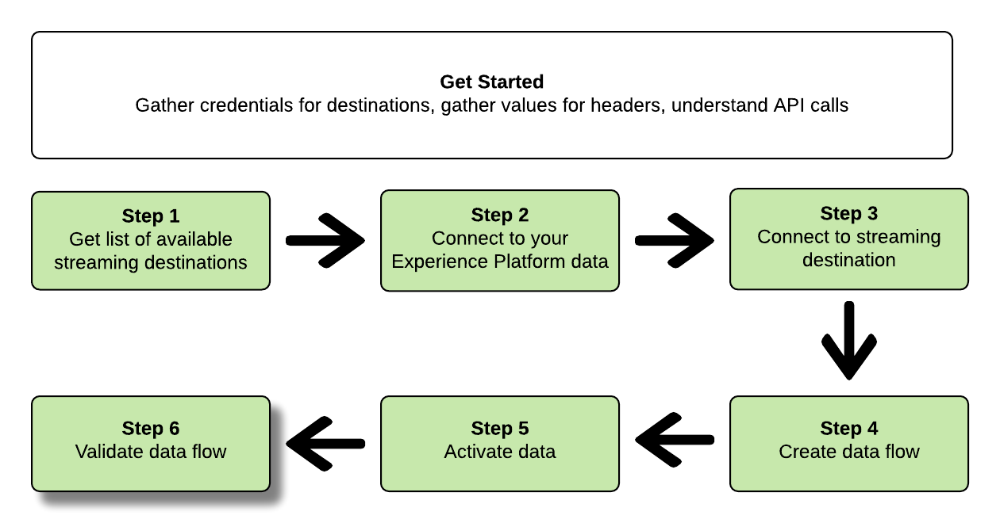

# Verbinding maken met streaming doelen en gegevens activeren met de Flow Service API

>[!IMPORTANT]
> 
>Als u verbinding wilt maken met een doel, hebt u de **[!UICONTROL Manage Destinations]** [toegangsbeheermachtiging](/help/access-control/home.md#permissions).
>
>Als u gegevens wilt activeren, hebt u de opdracht **[!UICONTROL Manage Destinations]**, **[!UICONTROL Activate Destinations]**, **[!UICONTROL View Profiles]**, en **[!UICONTROL View Segments]** [toegangsbeheermachtigingen](/help/access-control/home.md#permissions).
>
>Lees de [toegangsbeheeroverzicht](/help/access-control/ui/overview.md) of neem contact op met de productbeheerder om de vereiste machtigingen te verkrijgen.

Deze zelfstudie laat zien hoe u API-aanroepen kunt gebruiken om verbinding te maken met uw Adobe Experience Platform-gegevens en een verbinding te maken met een streamingbestemming voor cloudopslag ([Amazon Kinesis](../catalog/cloud-storage/amazon-kinesis.md) of [Azure Event Hubs](../catalog/cloud-storage/azure-event-hubs.md)), maakt u een gegevensstroom naar de nieuwe bestemming en activeert u gegevens naar de nieuwe bestemming.

Deze zelfstudie gebruikt de [!DNL Amazon Kinesis] doel in alle voorbeelden, maar de stappen zijn identiek voor [!DNL Azure Event Hubs].


Als u liever de gebruikersinterface in Platform gebruikt om verbinding te maken met een doel en gegevens te activeren, raadpleegt u de [Een doel verbinden](../ui/connect-destination.md) en [De publieksgegevens van de activering aan het stromen segment de uitvoerbestemmingen](../ui/activate-segment-streaming-destinations.md) zelfstudies.

## Aan de slag

Deze handleiding vereist een goed begrip van de volgende onderdelen van Adobe Experience Platform:

* [[!DNL Experience Data Model (XDM) System]](../../xdm/home.md): Het gestandaardiseerde kader waardoor het Experience Platform gegevens van de klantenervaring organiseert.
* [[!DNL Catalog Service]](../../catalog/home.md): [!DNL Catalog] is het registratiesysteem voor de gegevenslocatie en -lijn in het Experience Platform.
* [Sandboxen](../../sandboxes/home.md): Experience Platform biedt virtuele sandboxen die één Platform-instantie in afzonderlijke virtuele omgevingen verdelen om toepassingen voor digitale ervaringen te ontwikkelen en te ontwikkelen.

De volgende secties verstrekken extra informatie die u zult moeten weten om gegevens aan het stromen bestemmingen in Platform te activeren.

### Vereiste referenties verzamelen

Om de stappen in dit leerprogramma te voltooien, zou u de volgende geloofsbrieven klaar moeten hebben, afhankelijk van het type van bestemmingen dat u verbindt en segmenten aan activeert.

* Voor [!DNL Amazon Kinesis] verbindingen: `accessKeyId`, `secretKey`, `region` of `connectionUrl`
* Voor [!DNL Azure Event Hubs] verbindingen: `sasKeyName`, `sasKey`, `namespace`

### API-voorbeeldaanroepen lezen {#reading-sample-api-calls}

Deze zelfstudie biedt voorbeeld-API-aanroepen om aan te tonen hoe uw verzoeken moeten worden opgemaakt. Dit zijn paden, vereiste kopteksten en correct opgemaakte ladingen voor aanvragen. Voorbeeld-JSON die wordt geretourneerd in API-reacties, wordt ook verschaft. Voor informatie over de conventies die worden gebruikt in documentatie voor voorbeeld-API-aanroepen raadpleegt u de sectie over [voorbeeld-API-aanroepen lezen](../../landing/troubleshooting.md#how-do-i-format-an-api-request) in de gids voor het oplossen van problemen met Experience Platforms.

### Waarden verzamelen voor vereiste en optionele koppen {#gather-values}

Als u aanroepen wilt uitvoeren naar Platform-API&#39;s, moet u eerst de [verificatiezelfstudie](https://www.adobe.com/go/platform-api-authentication-en). Het voltooien van de autorisatiezelfstudie biedt de waarden voor elk van de vereiste headers in alle Experience Platform API-aanroepen, zoals hieronder wordt getoond:

* Autorisatie: Drager `{ACCESS_TOKEN}`
* x-api-key: `{API_KEY}`
* x-gw-ims-org-id: `{ORG_ID}`

De middelen in Experience Platform kunnen aan specifieke virtuele zandbakken worden geïsoleerd. In aanvragen voor Platform-API&#39;s kunt u de naam en id opgeven van de sandbox waarin de bewerking plaatsvindt. Dit zijn optionele parameters.

* x-sandbox-name: `{SANDBOX_NAME}`

>[!NOTE]
>
>Voor meer informatie over sandboxen in Experience Platform raadpleegt u de [overzichtsdocumentatie van sandbox](../../sandboxes/home.md).

Alle verzoeken die een nuttige lading (POST, PUT, PATCH) bevatten vereisen een extra media type kopbal:

* Inhoudstype: `application/json`

### Documentatie voor de wagenbak {#swagger-docs}

In deze zelfstudie in Swagger vindt u begeleidende referentiedocumentatie voor alle API-aanroepen. Zie de [Flow Service API-documentatie over Adobe I/O](https://www.adobe.io/experience-platform-apis/references/flow-service/). We raden u aan deze zelfstudie en de documentatiepagina van Swagger parallel te gebruiken.

## Hiermee wordt de lijst met beschikbare streamingdoelen opgehaald {#get-the-list-of-available-streaming-destinations}


Als eerste stap moet u bepalen naar welke streamingbestemming de gegevens moeten worden geactiveerd. Om met te beginnen, voer een vraag uit om een lijst van beschikbare bestemmingen te verzoeken die u segmenten kunt verbinden en activeren aan. Voer het volgende verzoek van de GET uit aan `connectionSpecs` eindpunt om een lijst van beschikbare bestemmingen terug te keren:

**API-indeling**

```http
GET /connectionSpecs
```

**Verzoek**

```shell
curl --location --request GET 'https://platform.adobe.io/data/foundation/flowservice/connectionSpecs' \
--header 'accept: application/json' \
--header 'x-gw-ims-org-id: {ORG_ID}' \
--header 'x-api-key: {API_KEY}' \
--header 'x-sandbox-name: {SANDBOX_NAME}' \
--header 'Authorization: Bearer {ACCESS_TOKEN}'
```


**Antwoord**

Een succesvolle reactie bevat een lijst met beschikbare bestemmingen en hun unieke id&#39;s (`id`). Sla de waarde op van het doel dat u wilt gebruiken, zoals in verdere stappen wordt vereist. Bijvoorbeeld, als u segmenten wilt verbinden en leveren aan [!DNL Amazon Kinesis] of [!DNL Azure Event Hubs]zoekt u het volgende fragment in het antwoord:

```json
{
    "id": "86043421-563b-46ec-8e6c-e23184711bf6",
  "name": "Amazon Kinesis",
  ...
  ...
}

{
    "id": "bf9f5905-92b7-48bf-bf20-455bc6b60a4e",
  "name": "Azure Event Hubs",
  ...
  ...
}
```

## Verbinden met uw Experience Platform gegevens {#connect-to-your-experience-platform-data}


Vervolgens moet u verbinding maken met de gegevens van uw Experience Platform, zodat u profielgegevens kunt exporteren en activeren op de gewenste bestemming. Deze bestaat uit twee substappen die hieronder worden beschreven.

1. Eerst, moet u een vraag uitvoeren om toegang tot uw gegevens in Experience Platform toe te staan, door opstelling een basisverbinding.
2. Dan, gebruikend identiteitskaart van de basisverbinding, zult u een andere vraag maken waarin u een bronverbinding creeert, die de verbinding aan uw gegevens van het Experience Platform vestigt.


### Toegang tot uw gegevens in Experience Platform toestaan

**API-indeling**

```http
POST /connections
```

**Verzoek**

```shell
curl --location --request POST 'https://platform.adobe.io/data/foundation/flowservice/connections' \
--header 'Authorization: Bearer {ACCESS_TOKEN}' \
--header 'x-api-key: {API_KEY}' \
--header 'x-gw-ims-org-id: {ORG_ID}' \
--header 'x-sandbox-name: {SANDBOX_NAME}' \
--header 'Content-Type: application/json' \
--data-raw '{
            "name": "Base connection to Experience Platform",
            "description": "This call establishes the connection to Experience Platform data",
            "connectionSpec": {
                "id": "{CONNECTION_SPEC_ID}",
                "version": "1.0"
            }
}'
```


* `{CONNECTION_SPEC_ID}`: Gebruik de verbindingsspecificatie-id voor profielservice - `8a9c3494-9708-43d7-ae3f-cda01e5030e1`.

**Antwoord**

Een geslaagde reactie bevat de unieke id van de basisverbinding (`id`). Sla deze waarde op zoals vereist in de volgende stap om de bronverbinding te maken.

```json
{
    "id": "1ed86558-59b5-42f7-9865-5859b552f7f4"
}
```

### Verbinden met uw Experience Platform gegevens {#connect-to-platform-data}

**API-indeling**

```http
POST /sourceConnections
```

**Verzoek**

```shell
curl --location --request POST 'https://platform.adobe.io/data/foundation/flowservice/sourceConnections' \
--header 'Authorization: Bearer {ACCESS_TOKEN}' \
--header 'x-api-key: {API_KEY}' \
--header 'x-gw-ims-org-id: {ORG_ID}' \
--header 'x-sandbox-name: {SANDBOX_NAME}' \
--header 'Content-Type: application/json' \
--data-raw '{
            "name": "Connecting to Profile Service",
            "description": "Optional",
            "connectionSpec": {
                "id": "{CONNECTION_SPEC_ID}",
                "version": "1.0"
            },
            "baseConnectionId": "{BASE_CONNECTION_ID}",
            "data": {
                "format": "json"
            },
            "params": {}
}'
```

* `{BASE_CONNECTION_ID}`: Gebruik de id die u in de vorige stap hebt gekregen.
* `{CONNECTION_SPEC_ID}`: Gebruik de verbindingsspecificatie-id voor profielservice - `8a9c3494-9708-43d7-ae3f-cda01e5030e1`.

**Antwoord**

Een geslaagde reactie retourneert de unieke id (`id`) voor de nieuwe bronverbinding met de profielservice. Hiermee bevestigt u dat u verbinding hebt gemaakt met de gegevens van uw Experience Platform. Sla deze waarde op zoals deze in een latere stap wordt vereist.

```json
{
    "id": "ed48ae9b-c774-4b6e-88ae-9bc7748b6e97"
}
```


## Verbinding maken met streamingdoel {#connect-to-streaming-destination}


In deze stap stelt u een verbinding in met uw gewenste streamingdoel. Deze bestaat uit twee substappen die hieronder worden beschreven.

1. Eerst, moet u een vraag uitvoeren om toegang tot de het stromen bestemming toe te staan, door opstelling een basisverbinding.
2. Vervolgens doet u met de id van de basisverbinding een volgende aanroep waarin u een doelverbinding maakt. Hiermee geeft u in uw opslagaccount de locatie op waar de geëxporteerde gegevens worden geleverd en de indeling van de gegevens die worden geëxporteerd.

### Toegang tot de streamingbestemming autoriseren

**API-indeling**

```http
POST /connections
```

**Verzoek**

>[!IMPORTANT]
>
>In het onderstaande voorbeeld worden de codeopmerkingen vooraf geplaatst `//`. Deze commentaren benadrukken waar de verschillende waarden voor verschillende het stromen bestemmingen moeten worden gebruikt. Verwijder de opmerkingen voordat u het fragment gebruikt.

```shell
curl --location --request POST 'https://platform.adobe.io/data/foundation/flowservice/connections' \
--header 'Authorization: Bearer {ACCESS_TOKEN}' \
--header 'x-api-key: {API_KEY}' \
--header 'x-gw-ims-org-id: {ORG_ID}' \
--header 'x-sandbox-name: {SANDBOX_NAME}' \
--header 'Content-Type: application/json' \
--data-raw '{
    "name": "Connection for Amazon Kinesis/ Azure Event Hubs",
    "description": "summer advertising campaign",
    "connectionSpec": {
        "id": "{_CONNECTION_SPEC_ID}",
        "version": "1.0"
    },
    "auth": {
        "specName": "{AUTHENTICATION_CREDENTIALS}",
        "params": { // use these values for Amazon Kinesis connections
            "accessKeyId": "{ACCESS_ID}",
            "secretKey": "{SECRET_KEY}",
            "region": "{REGION}"
        },
        "params": { // use these values for Azure Event Hubs connections
            "sasKeyName": "{SAS_KEY_NAME}",
            "sasKey": "{SAS_KEY}",
            "namespace": "{EVENT_HUB_NAMESPACE}"
        }        
    }
}'
```

* `{CONNECTION_SPEC_ID}`: Gebruik de verbindingsspecificatie-id die u in de stap hebt opgehaald [Krijg de lijst van beschikbare bestemmingen](#get-the-list-of-available-destinations).
* `{AUTHENTICATION_CREDENTIALS}`: Vul de naam van uw het stromen bestemming in: `Aws Kinesis authentication credentials` of `Azure EventHub authentication credentials`.
* `{ACCESS_ID}`: *Voor [!DNL Amazon Kinesis] verbindingen.* Uw toegangs-id voor uw Amazon Kinesis-opslaglocatie.
* `{SECRET_KEY}`: *Voor [!DNL Amazon Kinesis] verbindingen.* Je geheime sleutel voor je Amazon Kinesis-opslaglocatie.
* `{REGION}`: *Voor [!DNL Amazon Kinesis] verbindingen.* Het gebied in uw [!DNL Amazon Kinesis] -account waar Platform uw gegevens stroomt.
* `{SAS_KEY_NAME}`: *Voor [!DNL Azure Event Hubs] verbindingen.* Vul uw SAS-sleutelnaam in. Meer informatie over verifiëren bij [!DNL Azure Event Hubs] met SAS-toetsen in de [Microsoft-documentatie](https://docs.microsoft.com/en-us/azure/event-hubs/authenticate-shared-access-signature).
* `{SAS_KEY}`: *Voor [!DNL Azure Event Hubs] verbindingen.* Vul uw SAS-sleutel in. Meer informatie over verifiëren bij [!DNL Azure Event Hubs] met SAS-toetsen in de [Microsoft-documentatie](https://docs.microsoft.com/en-us/azure/event-hubs/authenticate-shared-access-signature).
* `{EVENT_HUB_NAMESPACE}`: *Voor [!DNL Azure Event Hubs] verbindingen.* Vul de [!DNL Azure Event Hubs] naamruimte waarin Platform uw gegevens streamt. Zie voor meer informatie [Een naamruimte voor gebeurtenishubs maken](https://docs.microsoft.com/en-us/azure/event-hubs/event-hubs-create#create-an-event-hubs-namespace) in de [!DNL Microsoft] documentatie.

**Antwoord**

Een geslaagde reactie bevat de unieke id van de basisverbinding (`id`). Sla deze waarde op zoals vereist in de volgende stap om een doelverbinding te maken.

```json
{
    "id": "1ed86558-59b5-42f7-9865-5859b552f7f4"
}
```

### Opslaglocatie en gegevensindeling opgeven

**API-indeling**

```http
POST /targetConnections
```

**Verzoek**

>[!IMPORTANT]
>
>In het onderstaande voorbeeld worden de codeopmerkingen vooraf geplaatst `//`. Deze commentaren benadrukken waar de verschillende waarden voor verschillende het stromen bestemmingen moeten worden gebruikt. Verwijder de opmerkingen voordat u het fragment gebruikt.

```shell
curl --location --request POST 'https://platform.adobe.io/data/foundation/flowservice/targetConnections' \
--header 'Authorization: Bearer {ACCESS_TOKEN}' \
--header 'x-api-key: {API_KEY}' \
--header 'x-gw-ims-org-id: {ORG_ID}' \
--header 'Content-Type: application/json' \
--data-raw '{
    "name": "Amazon Kinesis/ Azure Event Hubs target connection",
    "description": "Connection to Amazon Kinesis/ Azure Event Hubs",
    "baseConnectionId": "{BASE_CONNECTION_ID}",
    "connectionSpec": {
        "id": "{CONNECTION_SPEC_ID}",
        "version": "1.0"
    },
    "data": {
        "format": "json"
    },
    "params": { // use these values for Amazon Kinesis connections
        "stream": "{NAME_OF_DATA_STREAM}", 
        "region": "{REGION}"
    },
    "params": { // use these values for Azure Event Hubs connections
        "eventHubName": "{EVENT_HUB_NAME}"
    }
}'
```

* `{BASE_CONNECTION_ID}`: Gebruik de basisverbindings-id die u in de bovenstaande stap hebt verkregen.
* `{CONNECTION_SPEC_ID}`: De verbindingsspecificaties gebruiken die u in de stap hebt verkregen [Krijg de lijst van beschikbare bestemmingen](#get-the-list-of-available-destinations).
* `{NAME_OF_DATA_STREAM}`: *Voor [!DNL Amazon Kinesis] verbindingen.* Geef de naam op van de bestaande gegevensstroom in uw [!DNL Amazon Kinesis] account. Platform exporteert gegevens naar deze stream.
* `{REGION}`: *Voor [!DNL Amazon Kinesis] verbindingen.* Het gebied in uw Amazon Kinesis-account waar Platform uw gegevens stroomt.
* `{EVENT_HUB_NAME}`: *Voor [!DNL Azure Event Hubs] verbindingen.* Vul de [!DNL Azure Event Hub] naam waar het Platform uw gegevens zal stromen. Zie voor meer informatie [Een gebeurtenishub maken](https://docs.microsoft.com/en-us/azure/event-hubs/event-hubs-create#create-an-event-hub) in de [!DNL Microsoft] documentatie.

**Antwoord**

Een geslaagde reactie retourneert de unieke id (`id`) voor de nieuwe doelverbinding met uw streamingdoel. Sla deze waarde op zoals deze in latere stappen wordt vereist.

```json
{
    "id": "12ab90c7-519c-4291-bd20-d64186b62da8"
}
```

## Een gegevensstroom maken


Met de id&#39;s die u in de vorige stappen hebt opgehaald, kunt u nu een gegevensstroom maken tussen de gegevens van het Experience Platform en de bestemming waarnaar u de gegevens wilt activeren. Beschouw deze stap als het construeren van de pijpleiding, waardoor de gegevens, tussen Experience Platform en uw gewenste bestemming later zullen stromen.

Om een gegevensstroom tot stand te brengen, voer een verzoek van de POST uit, zoals hieronder getoond, terwijl het verstrekken van de hieronder vermelde waarden binnen de lading.

Voer het volgende verzoek van de POST uit om een gegevensstroom tot stand te brengen.

**API-indeling**

```http
POST /flows
```

**Verzoek**

```shell
curl -X POST \
'https://platform.adobe.io/data/foundation/flowservice/flows' \
-H 'Authorization: Bearer {ACCESS_TOKEN}' \
-H 'x-api-key: {API_KEY}' \
-H 'x-gw-ims-org-id: {ORG_ID}' \
-H 'x-sandbox-name: {SANDBOX_NAME}' \
-H 'Content-Type: application/json' \
-d  '{
  "name": "Azure Event Hubs",
  "description": "Azure Event Hubs",
  "flowSpec": {
    "id": "{FLOW_SPEC_ID}",
    "version": "1.0"
  },
  "sourceConnectionIds": [
    "{SOURCE_CONNECTION_ID}"
  ],
  "targetConnectionIds": [
    "{TARGET_CONNECTION_ID}"
  ],
  "transformations": [
    {
      "name": "GeneralTransform",
      "params": {
        "profileSelectors": {
          "selectors": [
            
          ]
        },
        "segmentSelectors": {
          "selectors": [
            
          ]
        }
      }
    }
  ]
}
```

* `{FLOW_SPEC_ID}`: De flow-specificatie-id voor op profielen gebaseerde doelen is `71471eba-b620-49e4-90fd-23f1fa0174d8`. Gebruik deze waarde in de vraag.
* `{SOURCE_CONNECTION_ID}`: Gebruik de bronverbindings-id die u in de stap hebt opgehaald [Verbinding maken met uw Experience Platform](#connect-to-your-experience-platform-data).
* `{TARGET_CONNECTION_ID}`: Gebruik de doel-verbindings-id die u in de stap hebt verkregen [Verbinding maken met streamingdoel](#connect-to-streaming-destination).

**Antwoord**

Een geslaagde reactie retourneert de id (`id`) van de nieuwe gegevensstroom en een `etag`. Noteer beide waarden. om segmenten te activeren, zoals u dat in de volgende stap doet.

```json
{
    "id": "8256cfb4-17e6-432c-a469-6aedafb16cd5",
    "etag": "8256cfb4-17e6-432c-a469-6aedafb16cd5"
}
```


## Gegevens activeren naar uw nieuwe bestemming {#activate-data}


Nadat u alle verbindingen en de gegevensstroom hebt gemaakt, kunt u nu uw profielgegevens activeren op het streamingplatform. In deze stap selecteert u welke segmenten en welke profielkenmerken u naar de bestemming verzendt en kunt u gegevens plannen en naar de bestemming verzenden.

Als u segmenten naar uw nieuwe bestemming wilt activeren, moet u een JSON PATCH-bewerking uitvoeren, vergelijkbaar met het onderstaande voorbeeld. U kunt veelvoudige segmenten en profielattributen in één vraag activeren. Voor meer informatie over JSON PATCH raadpleegt u de [RFC-specificatie](https://tools.ietf.org/html/rfc6902).

**API-indeling**

```http
PATCH /flows
```

**Verzoek**

```shell
curl --location --request PATCH 'https://platform.adobe.io/data/foundation/flowservice/flows/{DATAFLOW_ID}' \
--header 'Authorization: Bearer {ACCESS_TOKEN}' \
--header 'x-api-key: {API_KEY}' \
--header 'x-gw-ims-org-id: {ORG_ID}' \
--header 'Content-Type: application/json' \
--header 'x-sandbox-name: {SANDBOX_NAME}' \
--header 'If-Match: "{ETAG}"' \
--data-raw '[
  {
    "op": "add",
    "path": "/transformations/0/params/segmentSelectors/selectors/-",
    "value": {
      "type": "PLATFORM_SEGMENT",
      "value": {
        "name": "Name of the segment that you are activating",
        "description": "Description of the segment that you are activating",
        "id": "{SEGMENT_ID}"
      }
    }
  },
  {
    "op": "add",
    "path": "/transformations/0/params/profileSelectors/selectors/-",
    "value": {
      "type": "JSON_PATH",
      "value": {
        "operator": "EXISTS",
        "path": "{PROFILE_ATTRIBUTE}"
      }
    }
  }
]
```

* `{DATAFLOW_ID}`: Gebruik de gegevensstroom die u in de vorige stap hebt verkregen.
* `{ETAG}`: Gebruik het label dat u in de vorige stap hebt verkregen.
* `{SEGMENT_ID}`: Geef de segment-id op die u naar dit doel wilt exporteren. Ga naar **https://www.adobe.io/apis/experienceplatform/home/api-reference.html#/**, selecteert u **[!UICONTROL Segmentation Service API]** in het linkernavigatiemenu, en zoek naar `GET /segment/definitions` bewerking in **[!UICONTROL Segment Definitions]**.
* `{PROFILE_ATTRIBUTE}`: Bijvoorbeeld: `personalEmail.address` of `person.lastName`

**Antwoord**

Kijk naar een 202 OK-antwoord. Er wordt geen responsorgaan geretourneerd. Om te bevestigen dat het verzoek correct was, zie de volgende stap, de gegevensstroom bevestigen.

## De gegevensstroom valideren



Als laatste stap in de zelfstudie moet u controleren of de segmenten en profielkenmerken correct zijn toegewezen aan de gegevensstroom.

Om dit te bevestigen, voer het volgende verzoek van de GET uit:

**API-indeling**

```http
GET /flows
```

**Verzoek**

```shell
curl --location --request PATCH 'https://platform.adobe.io/data/foundation/flowservice/flows/{DATAFLOW_ID}' \
--header 'Authorization: Bearer {ACCESS_TOKEN}' \
--header 'x-api-key: {API_KEY}' \
--header 'x-gw-ims-org-id: {ORG_ID}' \
--header 'Content-Type: application/json' \
--header 'x-sandbox-name: prod' \
--header 'If-Match: "{ETAG}"' 
```

* `{DATAFLOW_ID}`: Gebruik de gegevensstroom uit de vorige stap.
* `{ETAG}`: Gebruik het label van de vorige stap.

**Antwoord**

De geretourneerde reactie moet worden opgenomen in de `transformations` parameter de segmenten en profielkenmerken die u in de vorige stap hebt verzonden. Een monster `transformations` de parameter in het antwoord kan er als volgt uitzien :

```json
"transformations": [
    {
        "name": "GeneralTransform",
        "params": {
            "profileSelectors": {
                        "selectors": [
                            {
                                "type": "JSON_PATH",
                                "value": {
                                    "path": "personalEmail.address",
                                    "operator": "EXISTS"
                                }
                            },
                            {
                                "type": "JSON_PATH",
                                "value": {
                                    "path": "person.lastname",
                                    "operator": "EXISTS"
                                }
                            }
                        ]
                    },
            "segmentSelectors": {
                "selectors": [
                    {
                        "type": "PLATFORM_SEGMENT",
                        "value": {
                            "name": "Men over 50",
                            "description": "",
                            "id": "72ddd79b-6b0a-4e97-a8d2-112ccd81bd02"
                        }
                    }
                ]
            }
        }
    }
],
```

**Geëxporteerde gegevens**

>[!IMPORTANT]
>
> Naast de profielkenmerken en de segmenten in de stap [Gegevens activeren naar uw nieuwe bestemming](#activate-data), de geëxporteerde gegevens in [!DNL AWS Kinesis] en [!DNL Azure Event Hubs] zal ook informatie over de identiteitskaart bevatten. Dit vertegenwoordigt de identiteiten van de uitgevoerde profielen (bijvoorbeeld [ECID](https://experienceleague.adobe.com/docs/id-service/using/intro/id-request.html), mobiele id, Google-id, e-mailadres, enz.). Zie een voorbeeld hieronder.

```json
{
  "person": {
    "email": "yourstruly@adobe.com"
  },
  "segmentMembership": {
    "ups": {
      "72ddd79b-6b0a-4e97-a8d2-112ccd81bd02": {
        "lastQualificationTime": "2020-03-03T21:24:39Z",
        "status": "exited"
      },
      "7841ba61-23c1-4bb3-a495-00d695fe1e93": {
        "lastQualificationTime": "2020-03-04T23:37:33Z",
        "status": "existing"
      }
    }
  },
  "identityMap": {
    "ecid": [
      {
        "id": "14575006536349286404619648085736425115"
      },
      {
        "id": "66478888669296734530114754794777368480"
      }
    ],
    "email_lc_sha256": [
      {
        "id": "655332b5fa2aea4498bf7a290cff017cb4"
      },
      {
        "id": "66baf76ef9de8b42df8903f00e0e3dc0b7"
      }
    ]
  }
}
```

## Postman-verzamelingen gebruiken om verbinding te maken met streaming doelen  {#collections}

Als u op een meer gestroomlijnde manier verbinding wilt maken met de streamingdoelen die in deze zelfstudie worden beschreven, kunt u [[!DNL Postman]](https://www.postman.com/).

[!DNL Postman] is een hulpmiddel dat u kunt gebruiken om API vraag te maken en bibliotheken van vooraf bepaalde vraag en milieu&#39;s te beheren.

Voor deze specifieke zelfstudie gaat u als volgt te werk [!DNL Postman] verzamelingen zijn bijgevoegd :

* [!DNL AWS Kinesis] [!DNL Postman] collectie
* [!DNL Azure Event Hubs] [!DNL Postman] collectie

Klikken [hier](../assets/api/streaming-destination/DestinationPostmanCollection.zip) om het archief met verzamelingen te downloaden.

Elke verzameling bevat de vereiste verzoeken en omgevingsvariabelen voor [!DNL AWS Kinesis], en [!DNL Azure Event Hub], respectievelijk.

### Postman-verzamelingen gebruiken

Om met succes met de bestemmingen te verbinden gebruikend in bijlage [!DNL Postman] Voer de volgende stappen uit voor verzamelingen:

* Downloaden en installeren [!DNL Postman];
* [Downloaden](../assets/api/streaming-destination/DestinationPostmanCollection.zip) en ontpitten de bijgevoegde collecties;
* Importeer de verzamelingen uit de desbetreffende mappen naar Postman;
* Vul de omgevingsvariabelen in volgens de instructies in dit artikel;
* Voer de [!DNL API] verzoeken van Postman, op basis van de instructies in dit artikel.

## Volgende stappen

Door deze zelfstudie te volgen, hebt u met succes Platform met één van uw aangewezen het stromen bestemmingen verbonden en opstelling een gegevensstroom aan de respectieve bestemming. De uitgaande gegevens kunnen nu in de bestemming voor klantenanalyse of om het even welke andere gegevensverrichtingen worden gebruikt u zou willen uitvoeren. Raadpleeg de volgende pagina&#39;s voor meer informatie:

* [Overzicht van doelen](../home.md)
* [Overzicht van de doelcatalogus](../catalog/overview.md)
