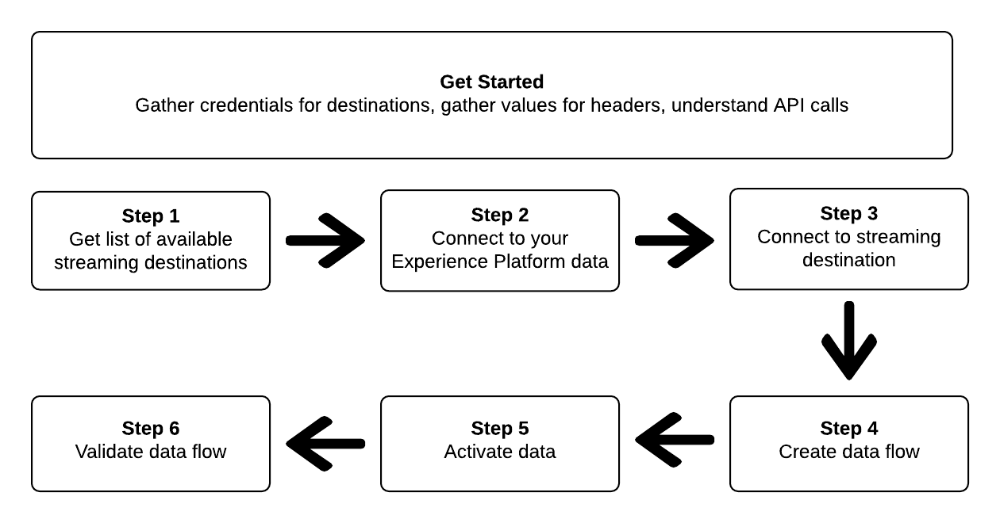

# Verbinding maken met streaming doelen en gegevens activeren met de Flow Service API

>[!IMPORTANT]
> 
>Om met een bestemming te verbinden, hebt u **[!UICONTROL View Destinations]** en **[!UICONTROL Manage Destinations]** [ toegangsbeheertoestemmingen ](/help/access-control/home.md#permissions) nodig.
>
>Om gegevens te activeren, hebt u **[!UICONTROL View Destinations]**, **[!UICONTROL Activate Destinations]**, **[!UICONTROL View Profiles]**, en **[!UICONTROL View Segments]** [ toegangsbeheertoestemmingen ](/help/access-control/home.md#permissions) nodig.
>
>Lees het [ overzicht van de toegangscontrole ](/help/access-control/ui/overview.md) of contacteer uw productbeheerder om de vereiste toestemmingen te verkrijgen.

Dit leerprogramma toont aan hoe te om API vraag te gebruiken om met uw gegevens van Adobe Experience Platform te verbinden, een verbinding tot een het stromen bestemming van de wolkenopslag tot stand te brengen ([ Amazon Kinesis ](../catalog/cloud-storage/amazon-kinesis.md) of [ Azure Gebeurtenis Hubs ](../catalog/cloud-storage/azure-event-hubs.md)), een dataflow aan uw nieuwe gecreeerde bestemming tot stand te brengen, en gegevens aan uw nieuwe gecreeerde bestemming te activeren.

In deze zelfstudie wordt in alle voorbeelden het doel van [!DNL Amazon Kinesis] gebruikt, maar de stappen zijn identiek voor [!DNL Azure Event Hubs] .



Als u verkiest om het gebruikersinterface in Experience Platform te gebruiken om met een bestemming te verbinden en gegevens te activeren, [ verbind een bestemming ](../ui/connect-destination.md) en [ activeer publieksgegevens aan het stromen van publiek uitvoerbestemmingen ](../ui/activate-segment-streaming-destinations.md) leerprogramma&#39;s.

## Aan de slag

Deze handleiding vereist een goed begrip van de volgende onderdelen van Adobe Experience Platform:

* [[!DNL Experience Data Model (XDM) System]](../../xdm/home.md): Het gestandaardiseerde raamwerk waarmee Experience Platform gegevens over de ervaring van klanten organiseert.
* [[!DNL Catalog Service]](../../catalog/home.md): [!DNL Catalog] is het recordsysteem voor de gegevenslocatie en -lijn in Experience Platform.
* [ Sandboxes ](../../sandboxes/home.md): Experience Platform verstrekt virtuele zandbakken die één enkele instantie van Experience Platform in afzonderlijke virtuele milieu&#39;s verdelen helpen digitale ervaringstoepassingen ontwikkelen en ontwikkelen.

De volgende secties verstrekken extra informatie die u zult moeten weten om gegevens aan het stromen bestemmingen in Experience Platform te activeren.

### Vereiste referenties verzamelen

Om de stappen in dit leerprogramma te voltooien, zou u de volgende geloofsbrieven klaar moeten hebben, afhankelijk van het type van bestemmingen dat u verbindend en activerend publiek aan.

* Voor [!DNL Amazon Kinesis] -verbindingen: `accessKeyId` , `secretKey` , `region` of `connectionUrl`
* Voor [!DNL Azure Event Hubs] verbindingen: `sasKeyName`, `sasKey`, `namespace`

### API-voorbeeldaanroepen lezen {#reading-sample-api-calls}

Deze zelfstudie biedt voorbeeld-API-aanroepen om aan te tonen hoe uw verzoeken moeten worden opgemaakt. Dit zijn paden, vereiste kopteksten en correct opgemaakte ladingen voor aanvragen. Voorbeeld-JSON die wordt geretourneerd in API-reacties, wordt ook verschaft. Voor informatie over de overeenkomsten die in documentatie voor steekproef API vraag worden gebruikt, zie de sectie op [ hoe te om voorbeeld API vraag ](../../landing/troubleshooting.md#how-do-i-format-an-api-request) in de het oplossen van problemengids van Experience Platform te lezen.

### Waarden verzamelen voor vereiste en optionele koppen {#gather-values}

Om vraag aan Experience Platform APIs te maken, moet u het [ authentificatieleerprogramma ](https://www.adobe.com/go/platform-api-authentication-en) eerst voltooien. Als u de zelfstudie over verificatie voltooit, krijgt u de waarden voor elk van de vereiste headers in alle Experience Platform API-aanroepen, zoals hieronder wordt getoond:

* Autorisatie: Drager `{ACCESS_TOKEN}`
* x-api-key: `{API_KEY}`
* x-gw-ims-org-id: `{ORG_ID}`

De middelen in Experience Platform kunnen aan specifieke virtuele zandbakken worden geïsoleerd. In aanvragen voor Experience Platform API&#39;s kunt u de naam en id opgeven van de sandbox waarin de bewerking plaatsvindt. Dit zijn optionele parameters.

* x-sandbox-name: `{SANDBOX_NAME}`

>[!NOTE]
>
>Voor meer informatie over zandbakken in Experience Platform, zie de [ documentatie van het zandbakoverzicht ](../../sandboxes/home.md).

Alle verzoeken die een lading (POST, PUT, PATCH) bevatten vereisen een extra media typekopbal:

* Inhoudstype: `application/json`

### Documentatie voor de wagenbak {#swagger-docs}

In deze zelfstudie in Swagger vindt u begeleidende referentiedocumentatie voor alle API-aanroepen. Zie de [ documentatie van de Dienst API van de Stroom op Adobe I/O ](https://www.adobe.io/experience-platform-apis/references/flow-service/). We raden u aan deze zelfstudie en de documentatiepagina van Swagger parallel te gebruiken.

## Hiermee wordt de lijst met beschikbare streamingdoelen opgehaald {#get-the-list-of-available-streaming-destinations}


Als eerste stap moet u bepalen naar welke streamingbestemming de gegevens moeten worden geactiveerd. Om met te beginnen, voer een vraag uit om een lijst van beschikbare bestemmingen te verzoeken die u kunt verbinden en publiek activeren aan. Voer het volgende GET verzoek aan het `connectionSpecs` eindpunt uit om een lijst van beschikbare bestemmingen terug te keren:

**API formaat**

```http
GET /connectionSpecs
```

**Verzoek**

```shell
curl --location --request GET 'https://platform.adobe.io/data/foundation/flowservice/connectionSpecs' \
--header 'accept: application/json' \
--header 'x-gw-ims-org-id: {ORG_ID}' \
--header 'x-api-key: {API_KEY}' \
--header 'x-sandbox-name: {SANDBOX_NAME}' \
--header 'Authorization: Bearer {ACCESS_TOKEN}'
```


**Reactie**

Een succesvolle reactie bevat een lijst van beschikbare bestemmingen en hun unieke herkenningstekens (`id`). Sla de waarde op van het doel dat u wilt gebruiken, zoals in verdere stappen wordt vereist. Als u bijvoorbeeld een verbinding wilt maken met [!DNL Amazon Kinesis] of [!DNL Azure Event Hubs] en een publiek wilt maken, zoekt u het volgende fragment in het antwoord:

```json
{
    "id": "86043421-563b-46ec-8e6c-e23184711bf6",
  "name": "Amazon Kinesis",
  ...
  ...
}

{
    "id": "bf9f5905-92b7-48bf-bf20-455bc6b60a4e",
  "name": "Azure Event Hubs",
  ...
  ...
}
```

## Verbinding maken met uw Experience Platform-gegevens {#connect-to-your-experience-platform-data}


Vervolgens moet u verbinding maken met uw Experience Platform-gegevens, zodat u profielgegevens kunt exporteren en activeren op de gewenste bestemming. Deze bestaat uit twee substappen die hieronder worden beschreven.

1. Eerst, moet u een vraag uitvoeren om toegang tot uw gegevens in Experience Platform toe te staan, door een basisverbinding te vestigen.
2. Vervolgens doet u met de id van de basisverbinding een nieuwe aanroep waarin u een bronverbinding maakt, waarmee de verbinding met uw Experience Platform-gegevens tot stand wordt gebracht.


### Toegang tot uw gegevens autoriseren in Experience Platform

**API formaat**

```http
POST /connections
```

**Verzoek**

```shell
curl --location --request POST 'https://platform.adobe.io/data/foundation/flowservice/connections' \
--header 'Authorization: Bearer {ACCESS_TOKEN}' \
--header 'x-api-key: {API_KEY}' \
--header 'x-gw-ims-org-id: {ORG_ID}' \
--header 'x-sandbox-name: {SANDBOX_NAME}' \
--header 'Content-Type: application/json' \
--data-raw '{
            "name": "Base connection to Experience Platform",
            "description": "This call establishes the connection to Experience Platform data",
            "connectionSpec": {
                "id": "{CONNECTION_SPEC_ID}",
                "version": "1.0"
            }
}'
```


* `{CONNECTION_SPEC_ID}`: gebruik de specificatie-id van de verbinding voor profielservice - `8a9c3494-9708-43d7-ae3f-cda01e5030e1` .

**Reactie**

Een succesvolle reactie bevat het unieke herkenningsteken van de basisverbinding (`id`). Sla deze waarde op zoals vereist in de volgende stap om de bronverbinding te maken.

```json
{
    "id": "1ed86558-59b5-42f7-9865-5859b552f7f4"
}
```

### Verbinding maken met uw Experience Platform-gegevens {#connect-to-platform-data}

**API formaat**

```http
POST /sourceConnections
```

**Verzoek**

```shell
curl --location --request POST 'https://platform.adobe.io/data/foundation/flowservice/sourceConnections' \
--header 'Authorization: Bearer {ACCESS_TOKEN}' \
--header 'x-api-key: {API_KEY}' \
--header 'x-gw-ims-org-id: {ORG_ID}' \
--header 'x-sandbox-name: {SANDBOX_NAME}' \
--header 'Content-Type: application/json' \
--data-raw '{
            "name": "Connecting to Profile Service",
            "description": "Optional",
            "connectionSpec": {
                "id": "{CONNECTION_SPEC_ID}",
                "version": "1.0"
            },
            "baseConnectionId": "{BASE_CONNECTION_ID}",
            "data": {
                "format": "json"
            },
            "params": {}
}'
```

* `{BASE_CONNECTION_ID}`: gebruik de id die u in de vorige stap hebt verkregen.
* `{CONNECTION_SPEC_ID}`: gebruik de specificatie-id van de verbinding voor profielservice - `8a9c3494-9708-43d7-ae3f-cda01e5030e1` .

**Reactie**

Een succesvolle reactie keert unieke herkenningsteken (`id`) voor de pas gecreëerde bronverbinding aan de Dienst van het Profiel terug. Hiermee bevestigt u dat u verbinding hebt gemaakt met uw Experience Platform-gegevens. Sla deze waarde op zoals deze in een latere stap wordt vereist.

```json
{
    "id": "ed48ae9b-c774-4b6e-88ae-9bc7748b6e97"
}
```


## Verbinding maken met streamingdoel {#connect-to-streaming-destination}


In deze stap stelt u een verbinding in met uw gewenste streamingdoel. Deze bestaat uit twee substappen die hieronder worden beschreven.

1. Eerst, moet u een vraag uitvoeren om toegang tot de het stromen bestemming toe te staan, door opstelling een basisverbinding.
2. Vervolgens doet u met de id van de basisverbinding een volgende aanroep waarin u een doelverbinding maakt. Hiermee geeft u in uw opslagaccount de locatie op waar de geëxporteerde gegevens worden geleverd en de indeling van de gegevens die worden geëxporteerd.

### Toegang tot de streamingbestemming autoriseren

**API formaat**

```http
POST /connections
```

**Verzoek**

>[!IMPORTANT]
>
>In het onderstaande voorbeeld worden opmerkingen in de code vooraf opgenomen met `//` . Deze commentaren benadrukken waar de verschillende waarden voor verschillende het stromen bestemmingen moeten worden gebruikt. Verwijder de opmerkingen voordat u het fragment gebruikt.

```shell
curl --location --request POST 'https://platform.adobe.io/data/foundation/flowservice/connections' \
--header 'Authorization: Bearer {ACCESS_TOKEN}' \
--header 'x-api-key: {API_KEY}' \
--header 'x-gw-ims-org-id: {ORG_ID}' \
--header 'x-sandbox-name: {SANDBOX_NAME}' \
--header 'Content-Type: application/json' \
--data-raw '{
    "name": "Connection for Amazon Kinesis/ Azure Event Hubs",
    "description": "summer advertising campaign",
    "connectionSpec": {
        "id": "{_CONNECTION_SPEC_ID}",
        "version": "1.0"
    },
    "auth": {
        "specName": "{AUTHENTICATION_CREDENTIALS}",
        "params": { // use these values for Amazon Kinesis connections
            "accessKeyId": "{ACCESS_ID}",
            "secretKey": "{SECRET_KEY}",
            "region": "{REGION}"
        },
        "params": { // use these values for Azure Event Hubs connections
            "sasKeyName": "{SAS_KEY_NAME}",
            "sasKey": "{SAS_KEY}",
            "namespace": "{EVENT_HUB_NAMESPACE}"
        }        
    }
}'
```

* `{CONNECTION_SPEC_ID}`: Gebruik identiteitskaart van de verbindingsspecificatie u in de stap [ verkrijgt de lijst van beschikbare bestemmingen ](#get-the-list-of-available-destinations).
* `{AUTHENTICATION_CREDENTIALS}` : vul de naam van uw streamingdoel in: `Aws Kinesis authentication credentials` of `Azure EventHub authentication credentials` .
* `{ACCESS_ID}`: *voor [!DNL Amazon Kinesis] verbindingen.* Uw toegangs-id voor de opslaglocatie van Amazon Kinesis.
* `{SECRET_KEY}`: *voor [!DNL Amazon Kinesis] verbindingen.* Je geheime sleutel voor de opslaglocatie van Amazon Kinesis.
* `{REGION}`: *voor [!DNL Amazon Kinesis] verbindingen.* Het gebied in uw [!DNL Amazon Kinesis] -account waar Experience Platform uw gegevens streamt.
* `{SAS_KEY_NAME}`: *voor [!DNL Azure Event Hubs] verbindingen.* Vul uw SAS-sleutelnaam in. Leer over voor authentiek verklaren aan [!DNL Azure Event Hubs] met de sleutels van SAS in de [ documentatie van Microsoft ](https://docs.microsoft.com/en-us/azure/event-hubs/authenticate-shared-access-signature).
* `{SAS_KEY}`: *voor [!DNL Azure Event Hubs] verbindingen.* Vul uw SAS-sleutel in. Leer over voor authentiek verklaren aan [!DNL Azure Event Hubs] met de sleutels van SAS in de [ documentatie van Microsoft ](https://docs.microsoft.com/en-us/azure/event-hubs/authenticate-shared-access-signature).
* `{EVENT_HUB_NAMESPACE}`: *voor [!DNL Azure Event Hubs] verbindingen.* Vul de naamruimte [!DNL Azure Event Hubs] in waarin Experience Platform uw gegevens streamt. Voor meer informatie, zie [ tot een Hubs van de Gebeurtenis namespace ](https://docs.microsoft.com/en-us/azure/event-hubs/event-hubs-create#create-an-event-hubs-namespace) in de [!DNL Microsoft] documentatie leiden.

**Reactie**

Een succesvolle reactie bevat het unieke herkenningsteken van de basisverbinding (`id`). Sla deze waarde op zoals vereist in de volgende stap om een doelverbinding te maken.

```json
{
    "id": "1ed86558-59b5-42f7-9865-5859b552f7f4"
}
```

### Opslaglocatie en gegevensindeling opgeven

**API formaat**

```http
POST /targetConnections
```

**Verzoek**

>[!IMPORTANT]
>
>In het onderstaande voorbeeld worden opmerkingen in de code vooraf opgenomen met `//` . Deze commentaren benadrukken waar de verschillende waarden voor verschillende het stromen bestemmingen moeten worden gebruikt. Verwijder de opmerkingen voordat u het fragment gebruikt.

```shell
curl --location --request POST 'https://platform.adobe.io/data/foundation/flowservice/targetConnections' \
--header 'Authorization: Bearer {ACCESS_TOKEN}' \
--header 'x-api-key: {API_KEY}' \
--header 'x-gw-ims-org-id: {ORG_ID}' \
--header 'Content-Type: application/json' \
--data-raw '{
    "name": "Amazon Kinesis/ Azure Event Hubs target connection",
    "description": "Connection to Amazon Kinesis/ Azure Event Hubs",
    "baseConnectionId": "{BASE_CONNECTION_ID}",
    "connectionSpec": {
        "id": "{CONNECTION_SPEC_ID}",
        "version": "1.0"
    },
    "data": {
        "format": "json"
    },
    "params": { // use these values for Amazon Kinesis connections
        "stream": "{NAME_OF_DATA_STREAM}", 
        "region": "{REGION}"
    },
    "params": { // use these values for Azure Event Hubs connections
        "eventHubName": "{EVENT_HUB_NAME}"
    }
}'
```

* `{BASE_CONNECTION_ID}`: gebruik de basisverbindings-id die u in de bovenstaande stap hebt verkregen.
* `{CONNECTION_SPEC_ID}`: Gebruik de verbindingsspecificatie u in de stap [ verkregen krijgt de lijst van beschikbare bestemmingen ](#get-the-list-of-available-destinations).
* `{NAME_OF_DATA_STREAM}`: *voor [!DNL Amazon Kinesis] verbindingen.* Geef de naam op van de bestaande gegevensstroom in uw [!DNL Amazon Kinesis] -account. Experience Platform exporteert gegevens naar deze stream.
* `{REGION}`: *voor [!DNL Amazon Kinesis] verbindingen.* Het gebied in uw Amazon Kinesis-account waar Experience Platform uw gegevens stroomt.
* `{EVENT_HUB_NAME}`: *voor [!DNL Azure Event Hubs] verbindingen.* Vul de naam [!DNL Azure Event Hub] in waar Experience Platform uw gegevens zal streamen. Voor meer informatie, zie [ een gebeurtenishub ](https://docs.microsoft.com/en-us/azure/event-hubs/event-hubs-create#create-an-event-hub) in de [!DNL Microsoft] documentatie creëren.

**Reactie**

Een succesvol antwoord keert unieke herkenningsteken (`id`) voor de pas gecreëerde doelverbinding aan uw het stromen bestemming terug. Sla deze waarde op zoals deze in latere stappen wordt vereist.

```json
{
    "id": "12ab90c7-519c-4291-bd20-d64186b62da8"
}
```

## Een gegevensstroom maken


Met de id&#39;s die u in de vorige stappen hebt opgehaald, kunt u nu een gegevensstroom maken tussen uw Experience Platform-gegevens en de bestemming waarnaar u de gegevens wilt activeren. Beschouw deze stap als het construeren van de pijpleiding, waardoor de gegevens later, tussen Experience Platform en uw gewenste bestemming zullen stromen.

Als u een gegevensstroom wilt maken, voert u een POST-verzoek uit, zoals hieronder wordt weergegeven, terwijl u de hieronder vermelde waarden opgeeft binnen de laadtijd.

Voer het volgende POST- verzoek uit om een gegevensstroom tot stand te brengen.

**API formaat**

```http
POST /flows
```

**Verzoek**

```shell
curl -X POST \
'https://platform.adobe.io/data/foundation/flowservice/flows' \
-H 'Authorization: Bearer {ACCESS_TOKEN}' \
-H 'x-api-key: {API_KEY}' \
-H 'x-gw-ims-org-id: {ORG_ID}' \
-H 'x-sandbox-name: {SANDBOX_NAME}' \
-H 'Content-Type: application/json' \
-d  '{
  "name": "Azure Event Hubs",
  "description": "Azure Event Hubs",
  "flowSpec": {
    "id": "{FLOW_SPEC_ID}",
    "version": "1.0"
  },
  "sourceConnectionIds": [
    "{SOURCE_CONNECTION_ID}"
  ],
  "targetConnectionIds": [
    "{TARGET_CONNECTION_ID}"
  ],
  "transformations": [
    {
      "name": "GeneralTransform",
      "params": {
        "profileSelectors": {
          "selectors": [
            
          ]
        },
        "segmentSelectors": {
          "selectors": [
            
          ]
        }
      }
    }
  ]
}
```

* `{FLOW_SPEC_ID}`: De flow-specificatie-id voor op profielen gebaseerde doelen is `71471eba-b620-49e4-90fd-23f1fa0174d8` . Gebruik deze waarde in de vraag.
* `{SOURCE_CONNECTION_ID}`: Gebruik bronverbindings identiteitskaart u in de stap [ werd verkregen verbind met uw Experience Platform ](#connect-to-your-experience-platform-data).
* `{TARGET_CONNECTION_ID}`: Gebruik identiteitskaart van de doelverbinding u in de stap [ werd verkregen verbind met het stromen bestemming ](#connect-to-streaming-destination).

**Reactie**

Een geslaagde reactie retourneert de id (`id`) van de nieuwe gegevensstroom en een `etag` . Noteer beide waarden. zoals u dat in de volgende stap doet , om het publiek te activeren .

```json
{
    "id": "8256cfb4-17e6-432c-a469-6aedafb16cd5",
    "etag": "8256cfb4-17e6-432c-a469-6aedafb16cd5"
}
```


## Gegevens activeren naar uw nieuwe bestemming {#activate-data}


Nadat u alle verbindingen en de gegevensstroom hebt gemaakt, kunt u nu uw profielgegevens activeren op het streamingplatform. In deze stap selecteert u welk publiek en welke profielkenmerken u naar de bestemming verzendt en kunt u gegevens plannen en naar de bestemming verzenden.

Als u een publiek naar uw nieuwe bestemming wilt activeren, moet u een JSON PATCH-bewerking uitvoeren, vergelijkbaar met het onderstaande voorbeeld. U kunt veelvoudige publiek en profielattributen in één vraag activeren. Meer over JSON PATCH leren, zie de [ specificatie RFC ](https://tools.ietf.org/html/rfc6902).

**API formaat**

```http
PATCH /flows
```

**Verzoek**

```shell
curl --location --request PATCH 'https://platform.adobe.io/data/foundation/flowservice/flows/{DATAFLOW_ID}' \
--header 'Authorization: Bearer {ACCESS_TOKEN}' \
--header 'x-api-key: {API_KEY}' \
--header 'x-gw-ims-org-id: {ORG_ID}' \
--header 'Content-Type: application/json' \
--header 'x-sandbox-name: {SANDBOX_NAME}' \
--header 'If-Match: "{ETAG}"' \
--data-raw '[
  {
    "op": "add",
    "path": "/transformations/0/params/segmentSelectors/selectors/-",
    "value": {
      "type": "PLATFORM_SEGMENT",
      "value": {
        "name": "Name of the audience that you are activating",
        "description": "Description of the audience that you are activating",
        "id": "{SEGMENT_ID}"
      }
    }
  },
  {
    "op": "add",
    "path": "/transformations/0/params/profileSelectors/selectors/-",
    "value": {
      "type": "JSON_PATH",
      "value": {
        "operator": "EXISTS",
        "path": "{PROFILE_ATTRIBUTE}"
      }
    }
  }
]
```

| Eigenschap | Beschrijving |
| --------- | ----------- |
| `{DATAFLOW_ID}` | Gebruik in de URL de id van de gegevensstroom die u in de vorige stap hebt gemaakt. |
| `{ETAG}` | Krijg `{ETAG}` van de reactie in de vorige stap, [ een dataflow ](#create-dataflow) creëren. De antwoordindeling in de vorige stap heeft escape-aanhalingstekens. U moet de niet-beschermde waarden in de kopbal van het verzoek gebruiken. Zie het onderstaande voorbeeld: <br> <ul><li>Voorbeeld van reactie: `"etag":""7400453a-0000-1a00-0000-62b1c7a90000""`</li><li>Waarde die u in uw verzoek wilt gebruiken: `"etag": "7400453a-0000-1a00-0000-62b1c7a90000"`</li></ul> <br> De labelwaarde wordt bijgewerkt bij elke geslaagde update van een gegevensstroom. |
| `{SEGMENT_ID}` | Geef de gebruikers-id op die u naar dit doel wilt exporteren. Om publiek IDs voor het publiek terug te winnen dat u wilt activeren, zie [ een publieksdefinitie ](https://www.adobe.io/experience-platform-apis/references/segmentation/#operation/retrieveSegmentDefinitionById) in de verwijzing van Experience Platform API terugwinnen. |
| `{PROFILE_ATTRIBUTE}` | Bijvoorbeeld: `"person.lastName"` |
| `op` | De verrichtingsvraag die wordt gebruikt om de actie te bepalen nodig om dataflow bij te werken. Bewerkingen zijn: `add` , `replace` en `remove` . Als u een publiek aan een gegevensstroom wilt toevoegen, gebruikt u de bewerking `add` . |
| `path` | Definieert het deel van de flow dat moet worden bijgewerkt. Wanneer u een publiek aan een gegevensstroom toevoegt, gebruikt u het pad dat in het voorbeeld is opgegeven. |
| `value` | De nieuwe waarde waarmee u de parameter wilt bijwerken. |
| `id` | Geef de id op van het publiek dat u aan de doelgegevensstroom toevoegt. |
| `name` | *Facultatief*. Geef de naam op van het publiek dat u aan de doelgegevensstroom toevoegt. Dit veld is niet verplicht en u kunt een publiek toevoegen aan de doelgegevensstroom zonder de naam ervan op te geven. |

**Reactie**

Kijk naar een 202 OK-antwoord. Er wordt geen responsorgaan geretourneerd. Om te bevestigen dat het verzoek correct was, zie de volgende stap, de gegevensstroom bevestigen.

## De gegevensstroom valideren


Als laatste stap in de zelfstudie moet u controleren of het publiek en de profielkenmerken correct zijn toegewezen aan de gegevensstroom.

Voer de volgende GET-aanvraag uit om dit te valideren:

**API formaat**

```http
GET /flows
```

**Verzoek**

```shell
curl --location --request PATCH 'https://platform.adobe.io/data/foundation/flowservice/flows/{DATAFLOW_ID}' \
--header 'Authorization: Bearer {ACCESS_TOKEN}' \
--header 'x-api-key: {API_KEY}' \
--header 'x-gw-ims-org-id: {ORG_ID}' \
--header 'Content-Type: application/json' \
--header 'x-sandbox-name: prod' \
--header 'If-Match: "{ETAG}"' 
```

* `{DATAFLOW_ID}`: gebruik de gegevensstroom uit de vorige stap.
* `{ETAG}`: gebruik het label van de vorige stap.

**Reactie**

De geretourneerde reactie moet in de parameter `transformations` het publiek en de profielkenmerken bevatten die u in de vorige stap hebt verzonden. Een sample `transformations` -parameter in de reactie kan er als volgt uitzien:

```json
"transformations": [
    {
        "name": "GeneralTransform",
        "params": {
            "profileSelectors": {
                        "selectors": [
                            {
                                "type": "JSON_PATH",
                                "value": {
                                    "path": "personalEmail.address",
                                    "operator": "EXISTS"
                                }
                            },
                            {
                                "type": "JSON_PATH",
                                "value": {
                                    "path": "person.lastname",
                                    "operator": "EXISTS"
                                }
                            }
                        ]
                    },
            "segmentSelectors": {
                "selectors": [
                    {
                        "type": "PLATFORM_SEGMENT",
                        "value": {
                            "name": "Men over 50",
                            "description": "",
                            "id": "72ddd79b-6b0a-4e97-a8d2-112ccd81bd02"
                        }
                    }
                ]
            }
        }
    }
],
```

**Geëxporteerde Gegevens**

>[!IMPORTANT]
>
> Naast de profielattributen en het publiek in de stap [ activeer gegevens aan uw nieuwe bestemming ](#activate-data), zullen de uitgevoerde gegevens in [!DNL AWS Kinesis] en [!DNL Azure Event Hubs] ook informatie over de identiteitskaart omvatten. Dit vertegenwoordigt de identiteiten van de uitgevoerde profielen (bijvoorbeeld [ ECID ](https://experienceleague.adobe.com/docs/id-service/using/intro/id-request.html?lang=nl-NL), mobiele identiteitskaart, identiteitskaart van Google, e-mailadres, enz.). Zie een voorbeeld hieronder.

```json
{
  "person": {
    "email": "yourstruly@adobe.com"
  },
  "segmentMembership": {
    "ups": {
      "72ddd79b-6b0a-4e97-a8d2-112ccd81bd02": {
        "lastQualificationTime": "2020-03-03T21:24:39Z",
        "status": "exited"
      },
      "7841ba61-23c1-4bb3-a495-00d695fe1e93": {
        "lastQualificationTime": "2020-03-04T23:37:33Z",
        "status": "realized"
      }
    }
  },
  "identityMap": {
    "ecid": [
      {
        "id": "14575006536349286404619648085736425115"
      },
      {
        "id": "66478888669296734530114754794777368480"
      }
    ],
    "email_lc_sha256": [
      {
        "id": "655332b5fa2aea4498bf7a290cff017cb4"
      },
      {
        "id": "66baf76ef9de8b42df8903f00e0e3dc0b7"
      }
    ]
  }
}
```

## [!DNL Postman] -verzamelingen gebruiken om verbinding te maken met streaming doelen  {#collections}

Om met de het stromen bestemmingen te verbinden die in dit leerprogramma worden beschreven op een meer gestroomlijnde manier, kunt u [[!DNL Postman] gebruiken ](https://www.postman.com/).

[!DNL Postman] is een hulpmiddel dat u kunt gebruiken om API vraag te maken en bibliotheken van vooraf bepaalde vraag en milieu&#39;s te beheren.

Voor deze specifieke zelfstudie zijn de volgende [!DNL Postman] verzamelingen gekoppeld:

* [!DNL AWS Kinesis] [!DNL Postman] collectie
* [!DNL Azure Event Hubs] [!DNL Postman] collectie

Klik [ hier ](../assets/api/streaming-destination/DestinationPostmanCollection.zip) om het archief van inzamelingen te downloaden.

Elke verzameling bevat de benodigde aanvragen en omgevingsvariabelen voor respectievelijk [!DNL AWS Kinesis] en [!DNL Azure Event Hub] .

### De [!DNL Postman] -verzamelingen gebruiken {#how-to-use-postman-collections}

Voer de volgende stappen uit om verbinding te maken met de doelen die zijn gekoppeld aan de verzamelingen in [!DNL Postman] :

* downloaden en installeren [!DNL Postman];
* [ Download ](../assets/api/streaming-destination/DestinationPostmanCollection.zip) en unzip de inzamelingen in bijlage;
* Importeer de verzamelingen vanuit de bijbehorende mappen naar [!DNL Postman] ;
* Vul de omgevingsvariabelen in volgens de instructies in dit artikel;
* Voer de [!DNL API] aanvragen van [!DNL Postman] uit op basis van de instructies in dit artikel.

## API-foutafhandeling {#api-error-handling}

De API-eindpunten in deze zelfstudie volgen de algemene beginselen van het Experience Platform API-foutbericht. Verwijs naar [ API statuscodes ](/help/landing/troubleshooting.md#api-status-codes) en [ de fouten van de verzoekkopbal ](/help/landing/troubleshooting.md#request-header-errors) in de het oplossen van problemengids van Experience Platform voor meer informatie bij het interpreteren van foutenreacties.

## Volgende stappen {#next-steps}

Door deze zelfstudie te volgen, hebt u Experience Platform verbonden met een van uw voorkeursstreamingdoelen en een gegevensstroom ingesteld naar het desbetreffende doel. De uitgaande gegevens kunnen nu in de bestemming voor klantenanalyse of om het even welke andere gegevensverrichtingen worden gebruikt u zou willen uitvoeren. Raadpleeg de volgende pagina&#39;s voor meer informatie:

* [Overzicht van doelen](../home.md)
* [Overzicht van de doelcatalogus](../catalog/overview.md)
