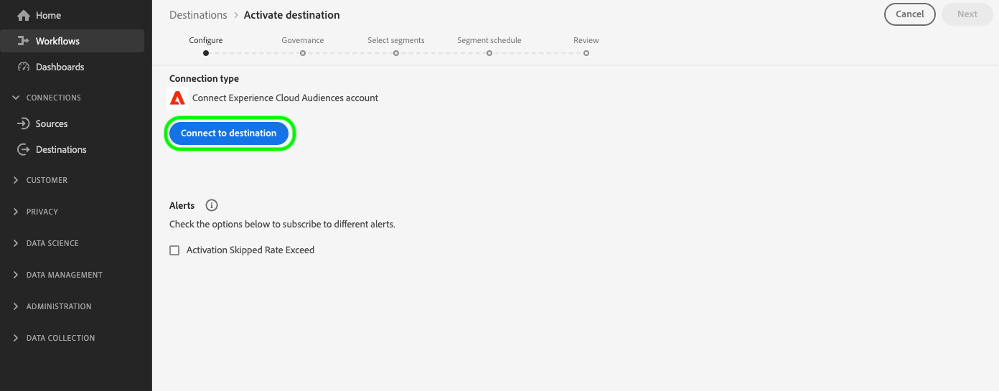

# [!UICONTROL Experience Cloud Audiences]-verbinding

>[!AVAILABILITY]
>
> Deze bestemming is beschikbaar aan [ Adobe Real-Time Customer Data Platform Prime en Ultimate ](https://helpx.adobe.com/legal/product-descriptions/real-time-customer-data-platform.html) klanten.

Gebruik deze bestemming om het publiek te activeren van [!DNL Real-Time CDP] naar Audience Manager en [!DNL Adobe Analytics] .

Als u een publiek naar [!DNL Adobe Analytics] wilt sturen, hebt u een Audience Manager-licentie nodig. Voor meer details, zie het [ overzicht van Audience Analytics ](https://experienceleague.adobe.com/docs/analytics/integration/audience-analytics/mc-audiences-aam.html?lang=en).

Om publiek naar andere oplossingen van Adobe te verzenden, gebruik de directe verbindingen van [!DNL Real-Time CDP] aan [ Adobe Target ](../personalization/adobe-target-connection.md), [ Adobe Advertising ](../advertising/adobe-advertising-dsp-connection.md), [ Adobe Campaign ](../email-marketing/adobe-campaign.md) en [ Marketo Engage ](../adobe/marketo-engage.md).

>[!IMPORTANT]
>
>Deze bestemming vervangt de [ erfenis publiek-delende integratie ](https://experienceleague.adobe.com/docs/audience-manager/user-guide/implementation-integration-guides/integration-experience-platform/aam-aep-audience-sharing.html#aep-segments-in-aam) van [!DNL Real-Time Customer Data Platform] aan diverse oplossingen van Experience Cloud.
> 
>Als u reeds publiek van [!DNL Real-Time CDP] aan Audience Manager en andere oplossingen van Experience Cloud via de [ erfenis publiek-delende integratie ](https://experienceleague.adobe.com/docs/audience-manager/user-guide/implementation-integration-guides/integration-experience-platform/aam-aep-audience-sharing.html#aep-segments-in-aam) deelt, moet u de Zorg van de Klant contacteren om de erfenisintegratie onbruikbaar te maken alvorens deze bestemming te gebruiken.

## Gebruik gevallen en voordelen {#use-cases}

Om u beter te helpen begrijpen hoe en wanneer u de [!UICONTROL Experience Cloud Audiences] bestemming zou moeten gebruiken, zijn hier voorbeelden van gebruiksgevallen die [!DNL Real-Time CDP] klanten kunnen oplossen door deze bestemming te gebruiken.

### Gebruiksgevallen van het platform voor gegevensbeheer inschakelen {#dmp-use-cases}

In Audience Manager kunt u [!DNL Real-Time CDP] soorten publiek gebruiken voor het gebruik van gegevensbeheerplatforms, zoals:

* Het toevoegen van [ derdegegevens ](https://experienceleague.adobe.com/docs/audience-manager/user-guide/overview/data-types-collected.html#third-party-data) aan uw segmenten;
* [ Algorithmic modelling ](https://experienceleague.adobe.com/docs/audience-manager/user-guide/features/algorithmic-models/look-alike-modeling/understanding-models.html);
* Het activeren van uw publiek naar op cookies gebaseerde doelen die nog niet worden ondersteund in de catalogus met [!DNL Real-Time CDP] doelen.

### Kortere controle van het geëxporteerde publiek {#segments-control}

Om te selecteren welk publiek aan Audience Manager en verder te exporteren, gebruik de nieuwe zelf-dienst publiek-delende integratie via de bestemming van het Publiek van Experience Cloud.  Hiermee kunt u bepalen welk publiek u met andere Experience Cloud-oplossingen wilt delen en welk publiek u alleen in [!DNL Real-Time CDP] wilt houden.

Dankzij de integratie van het publiek in het verleden was er geen korrelige controle mogelijk, waarvan het publiek naar Audience Manager en daarbuiten zou moeten worden geëxporteerd.

### [!DNL Real-Time CDP] soorten publiek delen met [!DNL Adobe Analytics] {#share-audiences-with-analytics}

Soorten publiek dat u naar de bestemming Experience Cloud Soorten publiek verzendt, worden niet automatisch weergegeven in [!DNL Adobe Analytics] .

Alvorens u publiek naar [!DNL Adobe Analytics] kunt verzenden, moet u [ de Dienst van de Identiteit van Experience Cloud voor Analytics en Audience Manager ](https://experienceleague.adobe.com/docs/id-service/using/implementation/setup-aam-analytics.html?lang=en) uitvoeren.

>[!IMPORTANT]
>
>Als u een publiek wilt verzenden van [!DNL Real-Time CDP] naar [!DNL Adobe Analytics] via de bestemming Experience Cloud Audiences, hebt u een Audience Manager-licentie nodig.

### [!DNL Real-Time CDP] soorten publiek delen met andere Experience Cloud-oplossingen {#share-segments-with-other-solutions}

U kunt de doelkaart van het publiek [!DNL Real-Time CDP] gebruiken om publiek met andere oplossingen van Experience Cloud te delen.

Adobe raadt echter ten zeerste aan de volgende speciale doelkaarten te gebruiken als u het publiek met deze oplossingen wilt delen:

* [Adobe Campaign](../email-marketing/adobe-campaign.md)
* [Adobe Target](../personalization/adobe-target-connection.md)
* [Adobe Advertising DSP](../advertising/adobe-advertising-dsp-connection.md)
* [Marketo](../adobe/marketo-engage.md)

## Vereisten {#prerequisites}

>[!IMPORTANT]
>
> * U hebt een vergunning van Audience Manager nodig om de [ het gebruiksgevallen van het Platform van het Beheer van Gegevens ](#dmp-use-cases) toe te laten hierboven vermeld verder.
> * U ** hebt een vergunning van Audience Manager nodig om [!DNL Real-Time CDP] publiek met [!DNL Adobe Analytics] te delen.
> * U *hebt* geen vergunning van Audience Manager nodig om [!DNL Real-Time CDP] publiek met [!DNL Adobe Advertising Cloud], [!DNL Adobe Target], Marketo, en andere oplossingen van Experience Cloud te delen, die in de [ sectie hierboven ](#share-segments-with-other-solutions) worden vermeld.

### Voor klanten die de oplossing voor het delen van het verouderde publiek gebruiken {#legacy-audience-sharing}

Als u reeds publiek van [!DNL Real-Time CDP] aan Audience Manager en andere oplossingen van Experience Cloud via de [ erfenis publiek-delende integratie ](https://experienceleague.adobe.com/docs/audience-manager/user-guide/implementation-integration-guides/integration-experience-platform/aam-aep-audience-sharing.html#aep-segments-in-aam) deelt, moet u de Zorg van de Klant contacteren om de erfenisintegratie onbruikbaar te maken.

De doorlooptijd om het uitstelticket op te lossen is zes werkdagen of minder. Nadat de bestaande erfenisintegratie is onbruikbaar gemaakt, kunt u te werk gaan [ een verbinding ](#connect) tot stand brengen via de zelfbediening bestemmingskaart.

>[!IMPORTANT]
>
>Het publiek dat van [!DNL Real-Time CDP] naar uw andere oplossingen uitvoert wordt tegengehouden in de tijd tussen de ticketresolutie en de tijd dat een nieuwe verbinding door de bestemmingskaart wordt gevestigd. U kunt deze onderbreking minimaliseren door de verbinding via de bestemmingskaart te creëren nadat het kaartje wordt gesloten.

## Bekende beperkingen en bijschriften {#known-limitations}

Let op de volgende bekende beperkingen en belangrijke callouts bij gebruik van de Experience Cloud Audiences-kaart:

* Momenteel kunt u de bestemming Experience Cloud-soorten publiek configureren in één sandbox per organisatie. Als u probeert een tweede doelverbinding te configureren in een andere sandbox, treedt een fout op.
* Wanneer het verbinden met de bestemming, kunt u een optie zien om [ dataflow alarm ](../../ui/alerts.md) toe te laten. Hoewel zichtbaar in UI, **toelaat alarm optie momenteel niet wordt gesteund**.
* **de backfill van het publiek steun**: De eerste uitvoer naar Audience Manager of andere oplossingen van Experience Cloud omvat een historische bevolking van het publiek. De gebruikers van de [ erfenis publiek-delende integratie ](https://experienceleague.adobe.com/docs/audience-manager/user-guide/implementation-integration-guides/integration-experience-platform/aam-aep-audience-sharing.html#aep-segments-in-aam) die deze bestemming vormen zouden een backfill verschil van ongeveer zes uur moeten verwachten.
* Het publiek dat uit [ Samenstelling van het Publiek ](../../../segmentation/ui/audience-composition.md) voortkomt wordt niet direct gesteund. Om samengesteld publiek aan deze bestemming te activeren moet u een publieksdefinitie door [ Bouwer van het Segment ](../../../segmentation/ui/segment-builder.md) tot stand brengen die op uw samengesteld publiek wordt gebaseerd, en het pas gecreëerde publiek activeren.

### Latentie bij activering van publiek {#audience-activation-latency}

Er is een vertraging van vier uur tussen de tijd dat het publiek voor het eerst wordt geactiveerd in [!DNL Real-Time CDP] en de tijd dat het publiek klaar is om te worden gebruikt in Audience Manager en andere Experience Cloud-oplossingen.

Het kan tot 24 uur duren voordat het publiek volledig beschikbaar is in Audience Manager voor alle gebruiksgevallen. Het kan tot 48 uur duren voordat het publiek van Experience Cloud Audiences in Audience Manager-rapporten verschijnt.

Metagegevens, zoals publieksnamen, zijn beschikbaar in Audience Manager binnen minuten nadat u het exporteren hebt ingesteld op de bestemming Experience Cloud Publiek.

## Ondersteunde identiteiten {#supported-identities}

De profielen die naar de [!UICONTROL Experience Cloud Audiences] -bestemming worden geëxporteerd, worden toegewezen aan de identiteiten die in de onderstaande tabel worden beschreven. Leer meer over [ identiteiten ](/help/identity-service/features/namespaces.md).

| Doelidentiteit | Beschrijving | Overwegingen |
|---|---|---|
| ECID | Experience Cloud-id | Een naamruimte die ECID vertegenwoordigt. Deze namespace kan ook door de volgende aliassen worden bedoeld: &quot;identiteitskaart van Adobe Marketing Cloud&quot;, &quot;[!DNL Adobe Experience Cloud] identiteitskaart&quot;, &quot;[!DNL Adobe Experience Platform] identiteitskaart&quot;. Zie het volgende document op [ ECID ](/help/identity-service/features/ecid.md) voor meer informatie. |
| GAID | GOOGLE ADVERTISING ID | Profielen die in [!DNL Real-Time CDP] worden ingevoerd met een primaire identiteit van de Google Advertising-id (GAID), kunnen naar deze bestemming worden geëxporteerd. |
| IDFA | Apple-id voor adverteerders | Profielen die in [!DNL Real-Time CDP] worden ingevoerd met een primaire identiteit van de Apple-id voor adverteerders (IDFA), kunnen naar deze bestemming worden geëxporteerd. |
| email_lc_sha256 | E-mailadressen die met het algoritme SHA256 worden gehasht | Profielen die in [!DNL Real-Time CDP] worden ingevoerd met een primaire identiteit van een hashed-e-mailadres, kunnen naar deze bestemming worden geëxporteerd. |

{style="table-layout:auto"}

## Ondersteunde doelgroepen {#supported-audiences}

In deze sectie wordt beschreven welk type publiek u naar dit doel kunt exporteren.

| Oorsprong publiek | Ondersteund | Beschrijving |
|---------|----------|----------|
| [!DNL Segmentation Service] | Ja | Het publiek produceerde door de Dienst van de Segmentatie van Experience Platform . |
| Alle andere doelgroepen | Nee | Deze categorie omvat alle oorsprong van het publiek buiten het publiek dat via [!DNL Segmentation Service] wordt gegenereerd. Lees over de [ diverse publieksoorsprong ](/help/segmentation/ui/audience-portal.md#customize). Voorbeelden zijn: <ul><li> de douane uploadt publiek [ ingevoerde ](../../../segmentation/ui/audience-portal.md#import-audience) in Experience Platform van Csv- dossiers,</li><li> gelijksoortige doelgroepen, </li><li> federaal publiek, </li><li> publiek dat wordt gegenereerd in andere Experience Platform-toepassingen, zoals [!DNL Adobe Journey Optimizer] , </li><li> en meer. </li></ul> |

{style="table-layout:auto"}

Ondersteund publiek per type publieksgegevens:

| Gegevenstype Publiek | Ondersteund | Beschrijving | Gebruiksscenario&#39;s |
|--------------------|-----------|-------------|-----------|
| [ het publiek van Mensen ](/help/segmentation/types/people-audiences.md) | Ja | Gebaseerd op klantenprofielen, die u toestaan om specifieke groepen mensen voor marketing campagnes te richten. | Frequente kopers, winkeliers |
| [ publiek van de Rekening ](/help/segmentation/types/account-audiences.md) | Nee | Doelpersonen binnen specifieke organisaties voor marketingstrategieën op basis van account. | B2B-marketing |
| [ Het publiek van het Vooruitzicht ](/help/segmentation/types/prospect-audiences.md) | Nee | De individuen van het doel die nog geen klanten zijn maar eigenschappen met uw doelpubliek delen. | Waarschuwing met gegevens van derden |
| [ de uitvoer van de Dataset ](/help/catalog/datasets/overview.md) | Nee | Verzamelingen gestructureerde gegevens die zijn opgeslagen in het [!DNL Adobe Experience Platform] Data Lake. | Rapportage, workflows voor gegevenswetenschap |

{style="table-layout:auto"}

## Type en frequentie exporteren {#export-type-frequency}

Raadpleeg de onderstaande tabel voor informatie over het exporttype en de exportfrequentie van de bestemming.

| Item | Type | Notities |
|---------|----------|---------|
| Exporttype | **[!UICONTROL Audience export]** | U exporteert alle leden van een publiek die zijn afgesneden van de identiteiten die in de bovenstaande sectie worden vermeld. |
| Exportfrequentie | **[!UICONTROL Streaming]** | Streaming doelen zijn &quot;altijd aan&quot; API-verbindingen. Wanneer een profiel in [!DNL Real-Time CDP] wordt bijgewerkt die op publieksevaluatie wordt gebaseerd, verzendt de schakelaar de update stroomafwaarts naar het bestemmingsplatform. Lees meer over [ het stromen bestemmingen ](/help/destinations/destination-types.md#streaming-destinations). |

{style="table-layout:auto"}

## Verbinden met de bestemming {#connect}

>[!IMPORTANT]
>
>Om met de bestemming te verbinden, hebt u **[!UICONTROL View Destinations]** en **[!UICONTROL Manage Destinations]** [ toegangsbeheertoestemmingen ](/help/access-control/home.md#permissions) nodig. Lees het [ overzicht van de toegangscontrole ](/help/access-control/ui/overview.md) of contacteer uw productbeheerder om de vereiste toestemmingen te verkrijgen.

Om met deze bestemming te verbinden, volg de stappen die in het [ leerprogramma van de bestemmingsconfiguratie ](../../ui/connect-destination.md) worden beschreven. In vormen bestemmingswerkschema, vul de gebieden in die in de twee hieronder secties worden vermeld.

### Verifiëren voor bestemming {#authenticate}

Selecteer **[!UICONTROL Set up]** in de weergave met de doelkaart in de catalogus en selecteer **[!UICONTROL Connect to destination]** om de verificatie naar het doel uit te voeren.

### Doelgegevens invullen {#destination-details}

Als u details voor de bestemming wilt configureren, vult u de vereiste en optionele velden hieronder in. Een sterretje naast een veld in de gebruikersinterface geeft aan dat het veld verplicht is.

* **[!UICONTROL Name]**: Een naam waarmee u dit doel in de toekomst herkent.
* **[!UICONTROL Description]**: Een beschrijving die u zal helpen deze bestemming in de toekomst identificeren.

## Soorten publiek naar dit doel activeren {#activate}

>[!IMPORTANT]
>
>Om gegevens te activeren, hebt u **[!UICONTROL View Destinations]**, **[!UICONTROL Activate Destinations]**, **[!UICONTROL View Profiles]**, en **[!UICONTROL View Segments]** [ toegangsbeheertoestemmingen ](/help/access-control/home.md#permissions) nodig. Lees het [ overzicht van de toegangscontrole ](/help/access-control/ui/overview.md) of contacteer uw productbeheerder om de vereiste toestemmingen te verkrijgen.

Lees [ activeer profielen en publiek aan het stromen publiek uitvoerbestemmingen ](/help/destinations/ui/activate-segment-streaming-destinations.md) voor instructies bij het activeren van publiek aan deze bestemming. Geen [ toewijzingsstap ](/help/destinations/ui/activate-segment-streaming-destinations.md#mapping) wordt vereist en geen [ het plannen stap ](/help/destinations/ui/activate-segment-streaming-destinations.md#scheduling) is beschikbaar voor deze bestemming.

## Gegevens exporteren valideren {#exported-data}

Om succesvolle gegevensuitvoer te bevestigen, kunt u controleren dat uw publiek het tot uw gewenste oplossing van Experience Cloud met succes heeft gemaakt.

### Gegevens valideren in Audience Manager {#validate-audience-manager}

Uw [!DNL Real-Time CDP] publiek verschijnt in Audience Manager als [ signalen ](https://experienceleague.adobe.com/docs/audience-manager/user-guide/implementation-integration-guides/integration-experience-platform/aam-aep-audience-sharing.html#aep-segments-as-aam-signals), [ trekken ](https://experienceleague.adobe.com/docs/audience-manager/user-guide/implementation-integration-guides/integration-experience-platform/aam-aep-audience-sharing.html#aep-segments-as-aam-traits), en [ segmenten ](https://experienceleague.adobe.com/docs/audience-manager/user-guide/implementation-integration-guides/integration-experience-platform/aam-aep-audience-sharing.html#aep-segments-as-aam-segments). U kunt in Audience Manager controleren of de gegevens zijn weergegeven zoals beschreven in de bovenstaande documentatiekoppelingen.

Segmentnamen beginnen 15 minuten nadat het publiek van [!DNL Real-Time CDP] is verstuurd, in Audience Manager te worden gevuld.

De segmentpopulatie begint binnen 6 uur na verzending vanuit [!DNL Real-Time CDP] naar Audience Manager te stromen en wordt elke 24 uur bijgewerkt in Audience Manager.

De volledige populatie is na 72 uur zichtbaar in Audience Manager en de populaties blijven naar Audience Manager stromen, tenzij het publiek van de bestemming in [!DNL Real-Time CDP] wordt verwijderd.

## Gegevensgebruik en -beheer {#data-usage-governance}

Alle [!DNL Real-Time CDP] -doelen zijn compatibel met het beleid voor gegevensgebruik bij het verwerken van uw gegevens. Voor gedetailleerde informatie over hoe [!DNL Adobe Experience Platform] gegevensbeheer afdwingt, lees het [ overzicht van het Beleid van Gegevens ](/help/data-governance/home.md).

Het bestuur van gegevens in [!DNL Real-Time CDP] wordt afgedwongen door zowel [ de etiketten van het gegevensgebruik ](/help/data-governance/labels/reference.md) als marketing acties.
Met labels voor gegevensgebruik worden toepassingen overgedragen, maar marketingacties niet. Dit betekent dat wanneer ze in Audience Manager landen, soorten publiek uit [!DNL Real-Time CDP] naar alle beschikbare doelen kunnen worden geëxporteerd. In Audience Manager, kunt u [ controles van de gegevensuitvoer ](https://experienceleague.adobe.com/docs/audience-manager/user-guide/features/data-export-controls.html) gebruiken om publiek van het worden uitgevoerd naar bepaalde bestemmingen te blokkeren.

Soorten publiek dat is gemarkeerd met de marketingactie [!DNL HIPAA] , worden niet verzonden van [!DNL Real-Time CDP] naar Audience Manager.

### Machtigingenbeheer in Audience Manager {#audience-manager-permissions}

Het publiek en de sporen in Audience Manager zijn onderworpen aan [ Op rol-Gebaseerde Controles van de Toegang ](https://experienceleague.adobe.com/docs/audience-manager/user-guide/features/administration/administration-overview.html) (RBAC).

Soorten publiek dat wordt geëxporteerd uit [!DNL Real-Time CDP] , worden toegewezen aan een specifieke gegevensbron in Audience Manager die **[!UICONTROL Experience Platform Segments]** wordt genoemd.

Om slechts bepaalde gebruikers toegang tot het publiek toe te staan, gebruik [ Op rol-Gebaseerde Controles van de Toegang ](https://experienceleague.adobe.com/docs/audience-manager/user-guide/features/administration/administration-overview.html) om gebruikerstoegang tot het publiek en sporen te vormen die van [!DNL Real-Time CDP] publiek worden gecreeerd.
