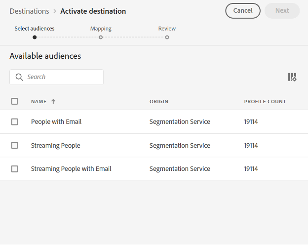
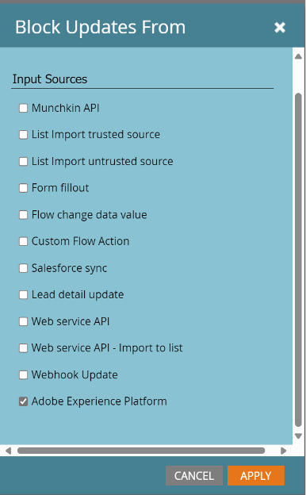

# Verbinding persoon synchroniseren Marketo Engage {#marketo-engage-person-sync}

>[!IMPORTANT]
>
>Deze bestemmingsschakelaar is in bèta en slechts beschikbaar om klanten te selecteren. Neem contact op met uw Adobe als u toegang wilt aanvragen.

## Overzicht {#overview}

Gebruik de schakelaar van de Synchronisatie van de Persoon van het Marketo Engage om updates van persoonpubliek aan de overeenkomstige verslagen in uw instantie van het Marketo Engage te stromen.

>[!IMPORTANT]
> 
>De [ Schakelaar van de Synchronisatie van het publiek van Marketo V2 ](/help/destinations/catalog/adobe/marketo-engage.md) zou niet op Create wijze samen met de Schakelaar van de Synchronisatie van de Update van het Profiel moeten worden gebruikt

## Ondersteunde identiteiten en kenmerken {#support-identities-and-attributes}

### Ondersteunde identiteiten {#supported-identities}

| Doelidentiteit | Beschrijving |
| --------------- | ---------------------------------------------------------------------------------------------------------------------------------------------------------------------------------------- |
| Email | Een naamruimte die een e-mailadres vertegenwoordigt. Dit type naamruimte is vaak gekoppeld aan één persoon en kan daarom worden gebruikt om die persoon op verschillende kanalen te identificeren. |

{style="table-layout:auto"}

### Ondersteunde kenmerken {#supported-attributes}

U kunt kenmerken van het Experience Platform toewijzen aan alle kenmerken waartoe uw organisatie toegang heeft in Marketo. In Marketo, kunt u [ gebruiken beschrijf API ](https://developer.adobe.com/marketo-apis/api/mapi/#tag/Leads/operation/describeUsingGET_6) verzoek om de attributengebieden terug te winnen die uw organisatie toegang heeft tot.

## Ondersteunde doelgroepen {#supported-audiences}

In deze sectie wordt beschreven welke soorten publiek u naar dit doel kunt exporteren.

| Oorsprong publiek | Ondersteund | Beschrijving |
| -------------------- | :-------: | ------------------------------------------------------------------------------------------------------------------------------------------------------------- |
| Segmentatieservice | ✓ | Het publiek produceerde door de Dienst van de Segmentatie van het Experience Platform [&#128279;](https://experienceleague.adobe.com/nl/docs/experience-platform/segmentation/home). |
| Aangepaste uploads | ✓ | Soorten publiek dat uit CSV-bestanden in het Experience Platform is geïmporteerd. |

## Type en frequentie exporteren {#export-type-and-frequency}

Raadpleeg de onderstaande tabel voor informatie over het exporttype en de exportfrequentie van de bestemming.

| Item | Type | Notities |
| ---------------- | --------- | ----------------------------------------------------------------------------------------------------------------------------------------------------------------------------------------------------------------------------------------------------------------------------------------------------------------------------------------------------------------------------------------- |
| Exportfrequentie | Streaming | Streaming doelen zijn &quot;altijd aan&quot; API-verbindingen. Zodra een profiel in Experience Platform wordt bijgewerkt dat op publieksevaluatie wordt gebaseerd, verzendt de schakelaar de update stroomafwaarts naar het bestemmingsplatform. Lees meer over [ het stromen bestemmingen ](/help/destinations/destination-types.md#streaming-destinations). |

{style="table-layout:auto"}

## Doel instellen {#set-up-destination}

>[!IMPORTANT]
>
>* Om met de bestemming te verbinden, hebt u **[!UICONTROL View Destinations]** en **[!UICONTROL Manage Destinations]** [ toegangsbeheertoestemmingen ](/help/access-control/home.md#permissions) nodig.

Als uw bedrijf toegang tot veelvoudige organisaties heeft, zorg ervoor dat u de zelfde organisatie in zowel Marketo Engage als Real-Time CDP gebruikt, waar u opstelling de bestemmingsschakelaar aan Marketo bent.  Als u al een doel hebt geconfigureerd, kunt u een bestaande Marketo-account selecteren voor gebruik met uw nieuwe configuratie.  Als niet, klik de Schakelaar aan de herinnering van de Bestemming, die u zal toestaan om de naam, de beschrijving, en identiteitskaart van Marketo Munchkin van de gewenste bestemming te plaatsen.  De Munchkin-id van uw Marketo-instantie vindt u in het menu Admin->Munchkin.

>[!IMPORTANT]
>
>De gebruiker die opstelling de bestemming moet [&#128279;](https://experienceleague.adobe.com/nl/docs/marketo/using/product-docs/administration/users-and-roles/descriptions-of-role-permissions#access-database) toestemming van de Persoon  hebben uitgeven in de instantie en de verdeling van Marketo.

* **[!UICONTROL Name]**: Een naam waarmee u dit doel in de toekomst herkent.
* **[!UICONTROL Description]**: Een beschrijving die u zal helpen deze bestemming in de toekomst identificeren.
* **[!UICONTROL Munchkin ID]**: De Munchkin-id is de unieke id voor een specifieke Marketo-instantie.
* **[!UICONTROL Partition]**: een concept in Marketo Engage dat wordt gebruikt om loodrecords te scheiden op bedrijfsniveau
* **[!UICONTROL First searchable field]**: veld dat moet worden gededupliceerd. Het veld moet aanwezig zijn in elke eerstvolgende record van de invoer. Standaard e-mailadres
* **[!UICONTROL First searchable field]**: Een secundair veld dat moet worden gededupliceerd. Het veld moet aanwezig zijn in elke eerstvolgende record van de invoer. Optioneel

Nadat u de instantie hebt geselecteerd, moet u ook de partitie Lead selecteren waarmee u de configuratie wilt integreren. A [ de Verdeling van de Lood ](https://experienceleague.adobe.com/nl/docs/marketo/using/product-docs/administration/workspaces-and-person-partitions/understanding-workspaces-and-person-partitions) is een concept in Marketo Engage wordt gebruikt om loodverslagen door bedrijfszorg, zoals een merk of een verkoopgebied te scheiden dat. Als uw Marketo-abonnement niet over de functie Werkruimten en Partities beschikt of als uw abonnement geen extra partities bevat, is alleen de standaardpartitie beschikbaar. Één enkele configuratie kan slechts loodverslagen bijwerken die in zijn gevormde verdeling bestaan.

>[!IMPORTANT]
> 
>Nadat een publiek aan de bestemming van Marketo voor het eerst is geactiveerd, kan het terugvullen van profielen die reeds in het publiek vóór de bestemmingsactivering van Marketo bestonden *tot 24 uren* nemen. Als profielen worden toegevoegd aan de doelgroep, worden ze direct toegevoegd aan Marketo.

### Deduplicatievelden {#deduplication-fields}

Wanneer updates naar Marketo worden verzonden, worden records geselecteerd op basis van de geselecteerde partitie en een of twee door de gebruiker geselecteerde velden. Als uw bestemming met de verdeling van Noord-Amerika wordt gevormd, en E-mailAdres en de Naam van het Bedrijf heeft die als deduplicatiegebieden wordt gevormd, dan moeten alle drie gebieden aanpassen om veranderingen op een bestaand verslag toe te passen. Bijvoorbeeld:

* De bestemming wordt gevormd met de verdeling van Noord-Amerika
* De persoon met E-mail <test@example.com> en het Voorbeeld Inc. van de Bedrijfsnaam in Experience Platform past het bestemmingspubliek aan
* Tenzij er al een record met deze waarden bestaat op de Noord-Amerikaanse partitie in Marketo, wordt een nieuwe lead record gemaakt

Als er geen overeenkomende lead-record wordt gevonden, wordt een nieuwe record gemaakt.

## Soorten publiek activeren {#activate-audiences}

>[!IMPORTANT]
> 
>* Om gegevens te activeren, hebt u **[!UICONTROL View Destinations]**, **[!UICONTROL Activate Destinations]**, **[!UICONTROL View Profiles]**, en **[!UICONTROL View Segments]** [ toegangsbeheertoestemmingen ](/help/access-control/home.md#permissions) nodig. Lees het [ overzicht van de toegangscontrole ](/help/access-control/ui/overview.md) of contacteer uw productbeheerder om de vereiste toestemmingen te verkrijgen.

Lees [ activeer profielen en segmenten aan het stromen segment de uitvoerbestemmingen ](/help/destinations/ui/activate-segment-streaming-destinations.md) voor instructies bij het activeren van publiekssegmenten aan deze bestemming.

In de stap Soorten publiek activeren kunt u een publiek selecteren dat voor u zichtbaar is.

## Veldtoewijzing {#field-mapping}

Als u wilt dat wijzigingen in een bepaald personeels-kenmerk naar het Marketo Engage worden verzonden, moet het veld worden toegewezen van een Real-Time CDP-veld naar een Marketo-veld.

Datatypes van het Experience Platform en Marketo datatypes kunnen op de volgende manieren in kaart worden gebracht:

| Gegevenstype Experience Platform | Marketo-gegevenstype |
| ----------------------------- | ------------------------------------ |
| String | Tekenreeks, tekstgebied, URL, telefoon, e-mail |
| Enum | String |
| Datum | Datum |
| Datum/tijd | Datumtijd |
| Geheel | Geheel |
| Kort | Geheel |
| Lang | Float |
| Dubbel | Valuta, zwevend, percentage |
| Boolean | Boolean |
| Array | Niet ondersteund |
| Object | Niet ondersteund |
| Kaart | Niet ondersteund |
| Byte | Niet ondersteund |

{style="table-layout:auto"}

In sommige gevallen is het wenselijk toe te staan dat integraties de waarde van een veld instellen als er geen veld is, terwijl integraties worden verhinderd updates uit te voeren naar velden die al een waarde hebben.  Als u moet voorkomen dat de doelconnector bestaande waarden in uw Marketo Engage-instantie overschrijft, kunt u velden configureren om updates te blokkeren in de sectie Admin->Veld-beheer van uw Marketo-instantie en het Adobe Experience Platform-brontype in- en uitschakelen.

## Gebruik en beheer van gegevens {#data-usage-and-governance}

Alle Adobe Experience Platform-doelen zijn bij het verwerken van uw gegevens compatibel met het beleid voor gegevensgebruik. Voor gedetailleerde informatie over hoe Adobe Experience Platform gegevensbeheer afdwingt, zie het [ overzicht van het gegevensbeheer ](/help/data-governance/home.md).
