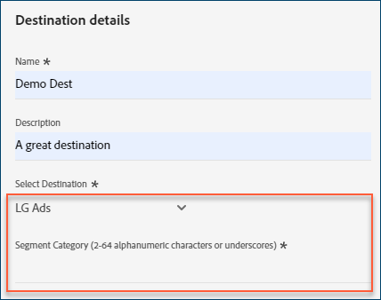

# [!DNL Acxiom Audience Connection]-bestemming

>[!NOTE]
>
>Het doel van [!DNL Acxiom Audience Connection] is in bèta. Deze doelconnector en documentatiepagina worden gemaakt en onderhouden door het team van [!DNL Acxiom] . Voor om het even welke onderzoeken of updateverzoeken, direct contactAcxiom [&#x200B; &#x200B;](mailto:acxiom-adobe-help@acxiom.com).

Gebruik de [!DNL Acxiom Audience Connection] bestemming om publiek met [!DNL Acxiom's] [&#x200B; Echte ID™ &#x200B;](https://www.acxiom.com/real-id/real-id/) technologie te verbeteren en publiek aan veelvoudige platforms, zoals [!DNL Altice], [!DNL Ampersand], [!DNL Comcast], en meer te activeren.

Deze zelfstudie bevat instructies voor het maken van een [!DNL Acxiom Audience Connection] -doelconnector via de gebruikersinterface van [!DNL Adobe Experience Platform] . Deze schakelaar wordt gebruikt om publiek aan geselecteerde bestemmingen te bouwen en te verspreiden.

## Gebruiksscenario’s {#use-cases}

Om u beter te helpen begrijpen hoe en wanneer u de [!DNL Acxiom Audience Connection] bestemming zou moeten gebruiken, is hier een geval van het steekproefgebruik dat de klanten van [!DNL Adobe Experience Platform] door deze schakelaar kunnen oplossen.

### Soorten publiek vanuit Experience Platform naar uw Acxiom-account verzenden {#send-audiences}

Gebruik deze doelconnector als u een marketingprofessional bent die publiek van [!DNL Experience Platform] naar uw [!DNL Acxiom] -account wil sturen voor aanschaf via meerdere kanalen.

Zo is de afdeling Marketing Operations van een wereldwijd merk voor financiële diensten geïnteresseerd in de aanschaf van klanten via meerdere reclameplatforms via verschillende kanalen. Ze kunnen de doelconnector van [!DNL Acxiom Audience Connection] gebruiken om een publiek van [!DNL Experience Platform] naar [!DNL Acxiom] te sturen, het publiek met [!DNL Acxiom's Real ID] -technologie te verbeteren en het publiek naar meerdere platforms te activeren, zoals [!DNL Altice] , [!DNL Ampersand], [!DNL Comcast] en meer.

## Vereisten {#prerequisites}

* **Bevestig Voorwaarden van Gebruik:** alvorens u een nieuwe [!DNL Acxiom Audience Connection] bestemming kunt vormen, moet u [!DNL Acxiom's] Overeenkomst van de Voorwaarden van het Gebruik lezen en ondertekenen. U ontvangt de koppeling naar de overeenkomst zodra de uitgevoerde verkooporder is voltooid.
* **ken uw organisatie-identiteitskaart van Adobe:** Uw [!DNL Adobe] organisatie - identiteitskaart is nodig om uw Voorwaarden van de Overeenkomst van de Gebruiker te voltooien. Zie [!DNL Adobe's] *Organisaties in Experience Cloud* onderwerp voor details op hoe te [&#x200B; uw organisatie identiteitskaart &#x200B;](https://experienceleague.adobe.com/en/docs/core-services/interface/administration/organizations#concept_EA8AEE5B02CF46ACBDAD6A8508646255) bekijken.

## Ondersteunde doelen {#supported-destinations}

Het doel van [!DNL Acxiom Audience Connection] ondersteunt momenteel activering van het publiek voor de volgende platforms.  

* [!DNL Altice]
* [!DNL Ampersand]
* [!DNL Comcast]
* [!DNL Cox]
* [[!DNL LG Ads]](#lg-ads)
* [!DNL Spectrum]
* [!DNL Viant]

## Verbinden met de bestemming {#connect}

Verificatie naar [!DNL Acxiom's Audience Connection] -doel wordt automatisch achter de schermen afgehandeld, voor uw gemak.

## Doelspecifieke instellingen {#destination-settings}

Voor sommige [!DNL Acxiom Audience Connection] -doelen is aanvullende informatie vereist. In de onderstaande secties vindt u gedetailleerde informatie over het configureren van deze opties.

### [!DNL LG Ads] {#lg-ads}

Vul de onderstaande velden in om details voor de bestemming te configureren.

* **Categorie van het Segment**: De doelcategorie of verticaal dat uw segment in valt. Voorbeeld: financiële diensten, auto&#39;s, gezondheid, enz.

 toe

## Soorten publiek naar dit doel activeren {#activate}

>[!IMPORTANT]
> 
>* Om gegevens te activeren, hebt u **[!UICONTROL View Destinations]**, **[!UICONTROL Activate Destinations]**, **[!UICONTROL View Profiles]**, en **[!UICONTROL View Segments]** [&#x200B; toegangsbeheertoestemmingen &#x200B;](/help/access-control/home.md#permissions) nodig. Lees het [&#x200B; overzicht van de toegangscontrole &#x200B;](/help/access-control/ui/overview.md) of contacteer uw productbeheerder om de vereiste toestemmingen te verkrijgen.
>* Om *identiteiten* uit te voeren, hebt u de **[!UICONTROL View Identity Graph]** [&#x200B; toegangsbeheertoestemming &#x200B;](/help/access-control/home.md#permissions) nodig.   {width="100" zoomable="yes"}

Lees [&#x200B; activeer publieksgegevens aan de uitvoerbestemmingen van het partijprofiel &#x200B;](/help/destinations/ui/activate-batch-profile-destinations.md) voor instructies bij het activeren van publiek aan deze bestemming.

>[!NOTE]
>
>Het doel [!DNL Acxiom Audience Connection] ondersteunt alleen het exporteren van volledige bestanden.

### Kenmerken en identiteiten toewijzen {#map}

Als u wilt dat de doelgegevens van [!DNL Acxiom Audience Connection] correct worden ontvangen, moet u de bronvelden van Experience Platform toewijzen aan de juiste doelvelden van [!DNL Acxiom Audience Connection] .

[!DNL Acxiom Audience Connection] staat alleen toewijzingen aan de volgende doelvelden toe. De doelvelden die in de onderstaande tabel worden beschreven, moeten in onderstaande volgorde worden toegewezen.

| Veldnaam | Beschrijving | Vereist | Veldvolgorde | Max. lengte |
|---|---|---|---|---|          
| Voornaam | Voornaam van individu | Nee | 1 | 255 |
| Midden | Tweede voornaam of initiaal van de persoon | Nee | 2 | 50 |
| Achternaam | Achternaam van de persoon | Ja | 3 | 255 |
| Algemeen achtervoegsel | Achtervoegsel van de persoon | Nee | 4 | 10 |
| Adresregel 1 | Adres 1 veld primaire woonplaats | Ja | 5 | 255 |
| Adresregel 2 | Adres 2 veld primaire woonplaats | Nee | 6 | 255 |
| Plaats | Plaats van primaire woonplaats | Ja | 7 | 255 |
| Staat | Afkorting van de primaire verblijfplaats | Ja | 8 | 2 |
| Postcode | Volledige postcode van primaire verblijfplaats | Ja | 9 | 10 |
| Email | Standaard wordt dit veld gebruikt als deduplicatietoets om de records uniek te maken | Nee | 10 | 255 |
| Telefoon | Het aantal van de telefoon van individu (gebiedscode + aantal)   door gebrek, wordt dit gebied gebruikt als deduplicatietoets om de verslagen uniek te maken. | Nee | 11 | 10 |

Voer in de kolom **[!UICONTROL Source Field]** de naam in van elk van de bronkenmerken die u wilt toewijzen aan het corresponderende doelveld, of selecteer het pijlpictogram om het **[!UICONTROL &#x200B; Select source field]** -scherm te openen. 

Nadat u alle velden hebt toegewezen, selecteert u **[!UICONTROL Next]** .

Als u niet [!DNL Adobe's] standaardschema gebruikt, zie de [&#x200B; gids UI van de Dienst van de Vraag &#x200B;](../../../query-service/ui/overview.md) documentatie voor informatie over hoe te om de vraagdienst te gebruiken om het [!DNL Adobe] standaardschema met uw gebiedsnamen te bevolken.

### Controleren {#review}

Nadat u alle bovenstaande stappen hebt uitgevoerd, hebt u de gelegenheid om de status en de publieksgegevens van uw doelverbinding te bekijken voordat u deze activeert (verspreidt). Het geselecteerde publiek wordt onder in een lijst weergegeven. Elk publiek zal een afzonderlijke vraag aan [!DNL Acxiom Audience Connection] API zijn.

Als u tevreden bent met de resultaten, selecteert u **[!UICONTROL Finish]** om uw bestemming te activeren.

## Problemen oplossen {#troubleshooting}

Als uw doelvertegenwoordiger uw publiek niet kan vinden, neemt u contact op met uw [!DNL Adobe] -vertegenwoordiger voor hulp.

U moet de volgende informatie aan uw [!DNL Adobe] vertegenwoordiger verstrekken:

* Naam publiek
* Doelnaam
* Activeringsdatum publiek
* Geëxporteerde bestandsnaam

## Volgende stappen {#next-steps}

Door deze zelfstudie te volgen, hebt u een publiek geactiveerd voor het geselecteerde doelplatform. Neem vervolgens contact op met de vertegenwoordiger van het doelplatform om uw campagne in te stellen.

## Gegevensgebruik en -beheer {#data-usage-governance}

Alle [!DNL Adobe Experience Platform] -doelen zijn compatibel met het beleid voor gegevensgebruik bij het verwerken van uw gegevens. Voor gedetailleerde informatie over hoe [!DNL Adobe Experience Platform] gegevensbeheer afdwingt, lees het [&#x200B; overzicht van het Beleid van Gegevens &#x200B;](https://experienceleague.adobe.com/en/docs/experience-platform/data-governance/home).
