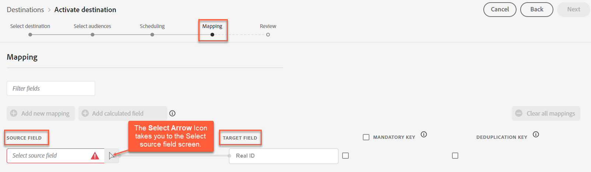

# [!DNL Acxiom Real ID Audience Connection]-bestemming

>[!NOTE]
>
>Deze doelconnector en documentatiepagina worden gemaakt en onderhouden door het team van [!DNL Acxiom] . Voor om het even welke onderzoeken of updateverzoeken, direct contactAcxiom .

Gebruik de [!DNL Acxiom Real ID Audience Connection]-bestemming om uw doelgroepen te verbeteren met [!DNL Acxiom's] [Real ID](https://www.acxiom.com/real-id/real-id/)-technologie en doelgroepen activeren op meerdere platforms, zoals [!DNL Altice], [!DNL Ampersand], [!DNL Comcast] en meer.

Deze zelfstudie bevat instructies voor het maken van een [!DNL Acxiom Real ID Audience Connection] -doelconnector via de gebruikersinterface van [!DNL Adobe Experience Platform] . Deze schakelaar bouwt en verdeelt publiek aan geselecteerde bestemmingen.

## Gebruiksscenario&#39;s {#use-cases}

Deze connector ondersteunt clients waarvan de werkelijke identiteit van Acxiom als id in [!DNL Real-Time CDP] is geladen. Om u beter te helpen begrijpen hoe en wanneer u de [!DNL Acxiom Real ID Audience Connection] bestemming zou moeten gebruiken, is hier een geval van het steekproefgebruik dat de klanten van [!DNL Adobe Experience Platform] door deze schakelaar kunnen oplossen.

### Soorten publiek vanuit Experience Platform naar uw Acxiom-account verzenden {#send-audiences}

Gebruik deze doelconnector als u een marketingprofessional bent die publiek van [!DNL Experience Platform] naar uw [!DNL Acxiom] -account wil sturen voor aanschaf via meerdere kanalen.

Zo is de afdeling Marketing Operations van een wereldwijd merk voor financiële diensten geïnteresseerd in de aanschaf van klanten via meerdere reclameplatforms via verschillende kanalen. Ze kunnen de doelconnector van [!DNL Acxiom Real ID Audience Connection] gebruiken om een publiek van [!DNL Experience Platform] naar [!DNL Acxiom] te sturen, het publiek met [!DNL Acxiom's Real ID] -technologie te verbeteren en het publiek naar meerdere platforms te activeren, zoals [!DNL Altice] , [!DNL Ampersand], [!DNL Comcast] en meer.

## Vereisten {#prerequisites}

* **Bevestig Voorwaarden van Gebruik:** alvorens u een nieuwe [!DNL Acxiom Real ID Audience Connection] bestemming kunt vormen, moet u [!DNL Acxiom's] Overeenkomst van de Voorwaarden van het Gebruik lezen en ondertekenen. U ontvangt de koppeling naar de overeenkomst zodra de uitgevoerde verkooporder is voltooid.
* **ken uw organisatie-identiteitskaart van Adobe:** Uw [!DNL Adobe] organisatie - identiteitskaart is nodig om uw Voorwaarden van de Overeenkomst van de Gebruiker te voltooien. Zie [!DNL Adobe's] *Organisaties in Experience Cloud* onderwerp voor details op hoe te [ uw organisatie identiteitskaart ](https://experienceleague.adobe.com/en/docs/core-services/interface/administration/organizations#concept_EA8AEE5B02CF46ACBDAD6A8508646255) bekijken.
* **verkrijg vergunning voor [!DNL Acxiom's Real ID] product:** Zodra een vergunning wordt verkregen, maak Echte identiteitskaart van Acxiom beschikbaar binnen [!DNL Real-Time CDP]. Zie [ Verbetering van Gegevens van Acxiom ](https://experienceleague.adobe.com/en/docs/experience-platform/destinations/catalog/data-partner/acxiom-data-enhancement) voor meer informatie.

## Ondersteunde identiteiten {#supported-identities}

Het doel van [!DNL Acxiom's Real ID Audience Connection] ondersteunt de activering van identiteiten die in de onderstaande tabel worden beschreven. Leer meer over [ identiteiten ](https://experienceleague.adobe.com/en/docs/experience-platform/identity/features/namespaces).

| Doelidentiteit | Beschrijving | Overwegingen |
|---------------|----------------|----------------|
| Real ID | [!DNL Acxiom Real ID] | Selecteer deze doelidentiteit wanneer uw bronidentiteit een Acxiom Real-ID-naamruimte is. |
| extern_id | Aangepaste gebruikers-id&#39;s | Selecteer deze doelidentiteit wanneer uw bronidentiteit een aangepaste naamruimte is. |

## Ondersteunde doelgroepen {#supported-audiences}

In deze sectie wordt beschreven welke soorten publiek u naar dit doel kunt exporteren.

| Oorsprong publiek | Ondersteund | Beschrijving |
|---------------|----------------|----------------|
| Segmentatieservice | Ja | Het publiek produceerde door de Dienst van de Segmentatie van Experience Platform . |
| Alle andere doelgroepen | Ja | Deze categorie omvat alle oorsprong van het publiek buiten het publiek dat via [!DNL Segmentation Service] wordt gegenereerd. Lees over de [ diverse publieksoorsprong ](/help/segmentation/ui/audience-portal.md#customize). Voorbeelden zijn: <ul><li> de douane uploadt publiek [ ingevoerde ](../../../segmentation/ui/audience-portal.md#import-audience) in Experience Platform van Csv- dossiers,</li><li> gelijksoortige doelgroepen, </li><li> federaal publiek, </li><li> publiek dat wordt gegenereerd in andere Experience Platform-toepassingen, zoals [!DNL Adobe Journey Optimizer] , </li><li> en meer. </li></ul> |

{style="table-layout:auto"}

Ondersteund publiek per type publieksgegevens:

| Gegevenstype Publiek | Ondersteund | Beschrijving | Gebruiksscenario&#39;s |
|--------------------|-----------|-------------|-----------|
| [ het publiek van Mensen ](/help/segmentation/types/people-audiences.md) | Ja | Gebaseerd op klantenprofielen, die u toestaan om specifieke groepen mensen voor marketing campagnes te richten. | Frequente kopers, winkeliers |
| [ publiek van de Rekening ](/help/segmentation/types/account-audiences.md) | Nee | Doelpersonen binnen specifieke organisaties voor marketingstrategieën op basis van account. | B2B-marketing |
| [ Het publiek van het Vooruitzicht ](/help/segmentation/types/prospect-audiences.md) | Nee | De individuen van het doel die nog geen klanten zijn maar eigenschappen met uw doelpubliek delen. | Waarschuwing met gegevens van derden |
| [ de uitvoer van de Dataset ](/help/catalog/datasets/overview.md) | Nee | Verzamelingen gestructureerde gegevens die zijn opgeslagen in het [!DNL Adobe Experience Platform] Data Lake. | Rapportage, workflows voor gegevenswetenschap |

{style="table-layout:auto"}

## Ondersteunde doelen {#supported-destinations}

Het doel van [!DNL Acxiom's Real ID Audience Connection] ondersteunt momenteel activering van het publiek voor de volgende platforms.

* [!DNL Altice]
* [!DNL Ampersand]
* [!DNL Comcast]
* [!DNL Cox]
* [[!DNL LG Ads]](#lg-ads)
* [!DNL Spectrum]
* [!DNL Viant]

## Verbinden met de bestemming {#connect}

Verificatie naar [!DNL Acxiom's Real ID Audience Connection] -doel wordt automatisch achter de schermen afgehandeld, voor uw gemak.

## Doelspecifieke instellingen {#destination-settings}

Voor sommige [!DNL Acxiom Real ID Audience Connection] -doelen is aanvullende informatie vereist. In de onderstaande secties vindt u gedetailleerde informatie over het configureren van deze opties.

### [!DNL LG Ads] {#lg-ads}

Vul de onderstaande velden in om details voor de bestemming te configureren.

* **Categorie van het Segment**: De doelcategorie of verticaal dat uw segment in valt. Voorbeeld: financiële diensten, auto&#39;s, gezondheid, enz.

 toe

## Soorten publiek naar dit doel activeren {#activate}

>[!IMPORTANT]
> 
>* Om gegevens te activeren, hebt u **[!UICONTROL View Destinations]**, **[!UICONTROL Activate Destinations]**, **[!UICONTROL View Profiles]**, en **[!UICONTROL View Segments]** [ toegangsbeheertoestemmingen ](/help/access-control/home.md#permissions) nodig. Lees het [ overzicht van de toegangscontrole ](/help/access-control/ui/overview.md) of contacteer uw productbeheerder om de vereiste toestemmingen te verkrijgen.
>* Om *identiteiten* uit te voeren, hebt u de **[!UICONTROL View Identity Graph]** [ toegangsbeheertoestemming ](/help/access-control/home.md#permissions) nodig.   {width="100" zoomable="yes"}

Lees [ activeer publieksgegevens aan de uitvoerbestemmingen van het partijprofiel ](https://experienceleague.adobe.com/en/docs/experience-platform/destinations/ui/activate/activate-batch-profile-destinations) voor instructies bij het activeren van publiek aan deze bestemming.

>[!NOTE]
>
>Het doel [!DNL Acxiom Real ID Audience Connection] ondersteunt alleen het exporteren van volledige bestanden.

### Kenmerken en identiteiten toewijzen {#map}

Als u wilt dat het doel van [!DNL Acxiom Real ID Audience Connection] de publieksgegevens correct ontvangt, moet u het bronveld van Experience Platform toewijzen aan het juiste doelveld van [!DNL Acxiom Real ID Audience Connection] .

[!DNL Acxiom Real ID Audience Connection] staat alleen toewijzing aan het volgende doelveld toe.

| Veldnaam | Beschrijving | Vereist |
|--------------------|------------|--------|
| Real ID | Een Real ID is een unieke 36-byte alfa-numerieke id (ID) uit de gedeponeerde identiteitsresolutiegrafiek van Acxiom, vergelijkbaar met een primaire sleutel voor een relationele database. Het is een id die een persoon, huishouden of adres vertegenwoordigt. | Ja |

{style="table-layout:auto"}

Voer in de kolom **[!UICONTROL Source Field]** de naam in van het bronkenmerk dat u wilt toewijzen aan het corresponderende doelveld, of selecteer het pijlpictogram om het **[!UICONTROL Select source field]** -scherm te openen. Selecteer vervolgens **[!UICONTROL Next]** .

Als u niet [!DNL Adobe's] standaardschema gebruikt, zie de [ gids UI van de Dienst van de Vraag ](../../../query-service/ui/overview.md) documentatie voor informatie over hoe te om de vraagdienst te gebruiken om het [!DNL Adobe] standaardschema met uw gebiedsnamen te bevolken.

### Controleren {#review}

Nadat u alle bovenstaande stappen hebt uitgevoerd, hebt u de gelegenheid om de status en de publieksgegevens van uw doelverbinding te bekijken voordat u deze activeert (verspreidt). Het geselecteerde publiek wordt onder in een lijst weergegeven. Elk publiek zal een afzonderlijke vraag aan [!DNL Acxiom Real ID Audience Connection] API zijn.

Als u tevreden bent met de resultaten, selecteert u **[!UICONTROL Finish]** om uw bestemming te activeren.

## Gegevensgebruik en -beheer {#data-usage-governance}

Alle [!DNL Adobe Experience Platform] -doelen zijn compatibel met het beleid voor gegevensgebruik bij het verwerken van uw gegevens. Voor gedetailleerde informatie over hoe [!DNL Adobe Experience Platform] gegevensbeheer afdwingt, lees het [ overzicht van het Beleid van Gegevens ](https://experienceleague.adobe.com/en/docs/experience-platform/data-governance/home).

## Problemen oplossen {#troubleshooting}

Als uw doelvertegenwoordiger uw publiek niet kan vinden, neemt u contact op met uw [!DNL Adobe] -vertegenwoordiger voor hulp.

U moet de volgende informatie aan uw [!DNL Adobe] vertegenwoordiger verstrekken:

* Naam publiek
* Doelnaam
* Activeringsdatum publiek
* Geëxporteerde bestandsnaam

## Volgende stappen {#next-steps}

U hebt een publiek geactiveerd voor het geselecteerde doelplatform. Neem vervolgens contact op met de vertegenwoordiger van het doelplatform om uw campagne in te stellen.
