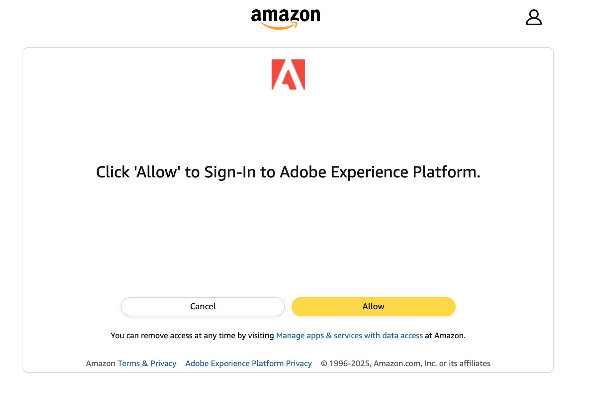

# Amazon Ads v2-verbinding {#amazon-ads-v2}

## Overzicht {#overview}

Met [!DNL Amazon Ads v2] kunnen adverteerders op efficiënte wijze publieksgegevens in [!DNL Amazon Ads] -producten opnemen, beheren, activeren en hergebruiken.

>[!IMPORTANT]
>
>[!DNL Amazon Ads v2] is het huidige doel voor alle nieuwe [!DNL Amazon Ads] verbindingen. Als u een bestaande [&#x200B; (Verouderd)  [!DNL Amazon Ads]](./amazon-ads.md) verbinding hebt, blijft het functioneren zonder enige vereiste veranderingen. [!DNL Amazon Ads v2] verbindt met [!DNL Ads Data Manager], die steun voor uitgebreide identiteitstypes, adres-verwante gebieden, en gegeven-delend over [!DNL Amazon Ads] producten verleent, verbeterend het richten en publiek past tarieven in vergelijking met [&#x200B; (Verouderd)  [!DNL Amazon Ads]](./amazon-ads.md) aan.
>
>Na eind april 2026 wordt de naam van [!DNL Amazon Ads v2] gewijzigd in [!DNL Amazon Ads] en wordt de verouderde kaart verborgen, zodat er één doelkaart in de catalogus overblijft. Bestaande oudere gegevensstromen blijven werken en u kunt deze na die datum beheren op het tabblad **[!UICONTROL Browse]** .

De [!DNL Amazon Ads v2] integratie met [!DNL Adobe Experience Platform] biedt een directe verbinding voor het opnemen van publieksleden in [!DNL Amazon Ads] . Het geüploade publiek is beschikbaar in de [!DNL Ads Data Manager (ADM)] -console in [!DNL Amazon Ads] . U kunt de [!DNL Ads Data Manager] -console gebruiken om gegevens te delen over verschillende [!DNL Amazon Ads] -producten.

Zie voor meer informatie over [!DNL Ads Data Manager] :

* [&#x200B; Adds de Manager van Gegevens - het Overzicht van de Console &#x200B;](https://advertising.amazon.com/API/docs/en-us/adm/1_ads-data-manager-console-overview)
* [&#x200B; Gebruikend de Console van de Manager van Gegevens van Adds &#x200B;](https://advertising.amazon.com/API/docs/en-us/adm/2_ads-data-manager-console)
* [&#x200B; de opstelling van de Rekening in de Manager van Gegevens van Advertentie &#x200B;](https://advertising.amazon.com/API/docs/en-us/adm/2a_ads-data-manager_account_setup)

>[!IMPORTANT]
>
>Deze doelconnector en documentatiepagina worden gemaakt en onderhouden door het team van *[!DNL Amazon Ads]* . Voor vragen of updateverzoeken kunt u rechtstreeks contact opnemen via *`amc-support@amazon.com`.*

## Gebruiksscenario&#39;s {#use-cases}

Om u beter te helpen begrijpen hoe en wanneer u de [!DNL Amazon Ads v2] bestemming zou moeten gebruiken, zijn hier voorbeelden van gebruiksgevallen die [!DNL Adobe Experience Platform] klanten kunnen oplossen door deze bestemming te gebruiken.

### Inname en activering door het publiek {#activation-and-targeting}

Een atletisch merkje wil zijn bestaande klanten bereiken met relevante advertenties in [!DNL Amazon Ads] . Het merk kan e-mailadressen van klanten van zijn CRM in [!DNL Adobe Experience Platform] opnemen, publiek bouwen gebruikend zijn eerste-partij off-line gegevens, en deze publiek aan [!DNL Amazon Ads] door de [!DNL Amazon Ads v2] bestemming activeren. Na activering kunt u dit publiek gebruiken om advertenties aan die klanten over [!DNL Amazon Ads] voorraad te richten, die het merk helpen bekende klanten opnieuw aan de slag te gaan en herhaalde aankopen te drijven. Meer leren, zie [&#x200B; gegevens &#x200B;](https://advertising.amazon.com/API/docs/en-us/adm/6_adm-manage-data) leiden.

## Vereisten {#prerequisites}

Om de [!DNL Amazon Ads v2] verbinding met [!DNL Adobe Experience Platform] te gebruiken, moet u toegang tot **[!DNL Amazon Ads Data Manager]** hebben gebruikend de Rekening van de Manager van de a [&#x200B; &#x200B;](https://advertising.amazon.com/help/G69CDSR9MNSWJH95). Zie [&#x200B; begonnen worden met de Manager van Gegevens van Amazon Ads &#x200B;](https://advertising.amazon.com/API/docs/en-us/adm/1_ads-data-manager-console-overview) voor details.

### Algemene voorwaarden voor Amazon Ads Data Manager accepteren {#accept-terms}

Voordat u de bestemming [!DNL Amazon Ads v2] configureert, meldt u zich aan bij uw [!DNL Amazon Ads] -account en accepteert u de voorwaarden en bepalingen van [!DNL Ads Data Manager] . Navigeer naar de [!DNL Ads Data Manager] -console in [!DNL Amazon Ads] en accepteer de voorwaarden wanneer u daarom wordt gevraagd. Als u de voorwaarden niet accepteert, worden soorten publiek niet gemaakt in [!DNL Amazon Ads] .

## Ondersteunde identiteiten {#supported-identities}

Het doel van [!DNL Amazon Ads v2] ondersteunt de activering van de volgende identiteiten. Leer meer over [&#x200B; identiteiten &#x200B;](/help/identity-service/features/namespaces.md).

| Doelidentiteit | Beschrijving | Overwegingen |
|---|---|---|
| `phone` | Telefoonnummers die zijn hashed met het SHA256-algoritme | Onbewerkte tekst en via SHA256 gehashte telefoonnummers worden ondersteund door [!DNL Adobe Experience Platform] . Wanneer het bronveld hashingkenmerken bevat, schakelt u de optie **[!UICONTROL Apply transformation]** in om de gegevens bij activering automatisch door [!DNL Experience Platform] te laten hashen. |
| `email` | E-mailadressen (verlaagd) met hashing met het SHA256-algoritme | Zowel platte tekst als gehashte e-mailadressen van SHA256 worden ondersteund door [!DNL Adobe Experience Platform]. Wanneer het bronveld hashingkenmerken bevat, schakelt u de optie **[!UICONTROL Apply transformation]** in om de gegevens bij activering automatisch door [!DNL Experience Platform] te laten hashen. |
| `firstname` | Voornaam gebruiker | Zowel voornamen met onbewerkte tekst als voornamen met SHA256-hashing worden ondersteund door [!DNL Adobe Experience Platform] . Wanneer het bronveld hashingkenmerken bevat, schakelt u de optie **[!UICONTROL Apply transformation]** in om de gegevens bij activering automatisch door [!DNL Experience Platform] te laten hashen. |
| `lastname` | Achternaam van de gebruiker | Achternamen met hashing en met platte tekst en met SHA256 worden ondersteund door [!DNL Adobe Experience Platform] . Wanneer het bronveld hashingkenmerken bevat, schakelt u de optie **[!UICONTROL Apply transformation]** in om de gegevens bij activering automatisch door [!DNL Experience Platform] te laten hashen. |
| `address` | Adres van de gebruiker | Zowel platte tekst als gehakte straten SHA256 worden gesteund door [!DNL Adobe Experience Platform]. Wanneer het bronveld hashingkenmerken bevat, schakelt u de optie **[!UICONTROL Apply transformation]** in om de gegevens bij activering automatisch door [!DNL Experience Platform] te laten hashen. |
| `city` | Plaats van de gebruiker | Zowel platte tekst als gehashte steden SHA256 worden ondersteund door [!DNL Adobe Experience Platform] . Wanneer het bronveld hashingkenmerken bevat, schakelt u de optie **[!UICONTROL Apply transformation]** in om de gegevens bij activering automatisch door [!DNL Experience Platform] te laten hashen. |
| `state` | Staat of provincie van de gebruiker | Onbewerkte tekst en SHA256-staten met hashing worden ondersteund door [!DNL Adobe Experience Platform] . Wanneer het bronveld hashingkenmerken bevat, schakelt u de optie **[!UICONTROL Apply transformation]** in om de gegevens bij activering automatisch door [!DNL Experience Platform] te laten hashen. |
| `zip` | Postcode van de gebruiker | Zijden met hashes en met platte tekst SHA256 worden ondersteund door [!DNL Adobe Experience Platform] . Wanneer het bronveld hashingkenmerken bevat, schakelt u de optie **[!UICONTROL Apply transformation]** in om de gegevens bij activering automatisch door [!DNL Experience Platform] te laten hashen. |
| `countryCode` | Land van de gebruiker (ISO-code van 2 tekens) | Ondersteunt invoer zonder opmaak. |
| `experianId` | Id toegewezen door [!DNL Experian] | Ondersteunt invoer zonder opmaak. |
| `kantarId` | Id toegewezen door [!DNL Kantar] | Ondersteunt invoer zonder opmaak. |
| `liveRampId` | Id toegewezen door [!DNL LiveRamp] | Ondersteunt invoer zonder opmaak. |
| `maId` | Id die is toegewezen door een mobiele toepassing | Ondersteunt invoer zonder opmaak. |
| `merkleId` | Id toegewezen door [!DNL Merkle] | Ondersteunt invoer zonder opmaak. |
| `neustarId` | Id toegewezen door [!DNL Neustar] | Ondersteunt invoer zonder opmaak. |
| `realId` | Identificatiecode die is toegewezen door de identiteitsgrafiek van de Real ID | Ondersteunt invoer zonder opmaak. |
| `sambaTvId` | Id toegewezen door [!DNL Samba TV] | Ondersteunt invoer zonder opmaak. |

{style="table-layout:auto"}

## Ondersteunde doelgroepen {#supported-audiences}

In deze sectie wordt beschreven welke soorten publiek u naar dit doel kunt exporteren.

| Oorsprong publiek | Ondersteund | Beschrijving |
|---------|----------|----------|
| [!DNL Segmentation Service] | Ja | Het publiek produceerde door de [!DNL Experience Platform] [&#x200B; Dienst van de Segmentatie &#x200B;](/help/segmentation/home.md). |
| Alle andere doelgroepen | Ja | Deze categorie omvat alle oorsprong van het publiek buiten het publiek dat via [!DNL Segmentation Service] wordt gegenereerd. Lees over de [&#x200B; diverse publieksoorsprong &#x200B;](/help/segmentation/ui/audience-portal.md#customize). Voorbeelden zijn: <ul><li> de douane uploadt publiek [&#x200B; ingevoerde &#x200B;](/help/segmentation/ui/audience-portal.md#import-audience) in [!DNL Experience Platform] van Csv- dossiers,</li><li> gelijksoortige doelgroepen, </li><li> federaal publiek, </li><li> publiek dat wordt gegenereerd in andere [!DNL Experience Platform] -toepassingen, zoals [!DNL Adobe Journey Optimizer] , </li><li> en meer. </li></ul> |

{style="table-layout:auto"}

Ondersteund publiek per type publieksgegevens:

| Gegevenstype Publiek | Ondersteund | Beschrijving | Gebruiksscenario&#39;s |
|--------------------|-----------|-------------|-----------|
| [&#x200B; het publiek van Mensen &#x200B;](/help/segmentation/types/people-audiences.md) | Ja | Gebaseerd op klantenprofielen, die u toestaan om specifieke groepen mensen voor marketing campagnes te richten. | Frequente kopers, winkeliers |
| [&#x200B; publiek van de Rekening &#x200B;](/help/segmentation/types/account-audiences.md) | Nee | Doelpersonen binnen specifieke organisaties voor marketingstrategieën op basis van account. | B2B-marketing |
| [&#x200B; Het publiek van het Vooruitzicht &#x200B;](/help/segmentation/types/prospect-audiences.md) | Nee | De individuen van het doel die nog geen klanten zijn maar eigenschappen met uw doelpubliek delen. | Waarschuwing met gegevens van derden |
| [&#x200B; de uitvoer van de Dataset &#x200B;](/help/catalog/datasets/overview.md) | Nee | Verzamelingen gestructureerde gegevens die zijn opgeslagen in het [!DNL Adobe Experience Platform] Data Lake. | Rapportage, workflows voor gegevenswetenschap |

{style="table-layout:auto"}

## Type en frequentie exporteren {#export-type-frequency}

In de onderstaande tabel staan het exporttype en de exportfrequentie van de bestemming.

| Item | Type | Notities |
| ---------|----------|---------|
| Exporttype | **[!UICONTROL Audience export]** | U exporteert alle leden van een publiek met id&#39;s die worden ondersteund door [!DNL Amazon Ads] . |
| Exportfrequentie | **[!UICONTROL Streaming]** | Streaming doelen zijn &quot;altijd aan&quot; API-verbindingen. Poortupdates in [!DNL Experience Platform] worden direct verzonden naar [!DNL Ads Data Manager] . |

{style="table-layout:auto"}

## Verbinden met de bestemming {#connect}

>[!IMPORTANT]
>
>Om met de bestemming te verbinden, hebt u **[!UICONTROL View Destinations]** en **[!UICONTROL Manage Destinations]** [&#x200B; toegangsbeheertoestemmingen &#x200B;](/help/access-control/home.md#permissions) nodig. Lees het [&#x200B; overzicht van de toegangscontrole &#x200B;](/help/access-control/ui/overview.md) of contacteer uw productbeheerder om de vereiste toestemmingen te verkrijgen.

Om met deze bestemming te verbinden, volg de stappen die in het [&#x200B; leerprogramma van de bestemmingsconfiguratie &#x200B;](/help/destinations/ui/connect-destination.md) worden beschreven. Vul in de workflow voor doelconfiguratie de velden in die in de twee onderstaande secties worden vermeld.

### Verifiëren voor bestemming {#authenticate}

Als u voor verificatie bij het doel wilt zorgen, vult u de vereiste velden in en selecteert u **[!UICONTROL Connect to destination]** .

* **[!UICONTROL Account name]**: voer een naam in waarmee u dit doelaccount kunt identificeren. Dit is vooral handig als u meerdere verbindingen met hetzelfde doel hebt.
* **[!UICONTROL Description]** (optioneel): voeg details toe die u of uw team helpen onderscheid te maken tussen accounts, zoals het doel van de verbinding of de relevante zakelijke context.

U wordt omgeleid naar de interface [!DNL Amazon Ads v2] . Selecteer **[!UICONTROL Allow]** om u aan te melden bij uw Amazon-account.

 toe te staan

Na de verificatie wordt u weer omgeleid naar [!DNL Adobe Experience Platform] met de nieuwe verbinding.

### Doelgegevens invullen {#destination-details}

Als u details voor de bestemming wilt configureren, vult u de vereiste en optionele velden hieronder in. Een sterretje naast een veld in de gebruikersinterface geeft aan dat het veld verplicht is.

* **[!UICONTROL Name]**: Een naam waarmee u dit doel herkent.
* **[!UICONTROL Description]**: Een beschrijving waarmee u dit doel kunt identificeren.
* **[!UICONTROL Manager Account]**: De account-id van de doelbeheeraccount in het vervolgkeuzemenu.
* **[!UICONTROL All audience members sent to Amazon are consented for use for Advertising]**: geef toestemming voor gegevensgebruik op (`GRANTED` of `DENIED`).
* **[!UICONTROL Ads data manager Terms & Conditions]**: ga akkoord met de voorwaarden en bepalingen van [!DNL Amazon Ads] Data Manager. Lees [&#x200B; goedkeurt termen &#x200B;](#accept-terms) sectie voor details.

### Waarschuwingen inschakelen {#enable-alerts}

U kunt alarm toelaten om berichten over de status van dataflow aan uw bestemming te ontvangen. Selecteer een waarschuwing in de lijst om u te abonneren op meldingen over de status van uw gegevensstroom. Voor meer informatie over alarm, lees de gids over [&#x200B; het intekenen aan bestemmingsalarm gebruikend UI &#x200B;](/help/destinations/ui/alerts.md).

Wanneer u klaar bent met het opgeven van details voor uw doelverbinding, selecteert u **[!UICONTROL Next]** .

## Soorten publiek naar dit doel activeren {#activate}

>[!IMPORTANT]
>
>* Om gegevens te activeren, hebt u de **[!UICONTROL View Destinations]**, **[!UICONTROL Activate Destinations]**, **[!UICONTROL View Profiles]** en **[!UICONTROL View Segments]** [&#x200B; toegangsbeheertoestemmingen &#x200B;](/help/access-control/home.md#permissions) nodig. Lees het [&#x200B; overzicht van de toegangscontrole &#x200B;](/help/access-control/ui/overview.md) of contacteer uw productbeheerder om de vereiste toestemmingen te verkrijgen.
>* Om identiteiten uit te voeren, hebt u de **[!UICONTROL View Identity Graph]** [&#x200B; toegangsbeheertoestemming &#x200B;](/help/access-control/home.md#permissions) nodig.   {width="100" zoomable="yes"}

Lees [&#x200B; activeer profielen en publiek aan het stromen publiek uitvoerbestemmingen &#x200B;](/help/destinations/ui/activate-segment-streaming-destinations.md) voor instructies bij het activeren van publiek aan deze bestemming.

### Verplichte toewijzingen {#map}

Voor het doel van [!DNL Amazon Ads v2] moet u de volgende toewijzingen configureren voor het activeren van gegevens.

| Source-veld | Doelveld | Beschrijving |
|---------|----------|---------|
| `IdentityMap: Email_LC_SHA256` of `IdentityMap: Email` | `Identity: email` | Wanneer het bronveld hashingkenmerken bevat, schakelt u de optie **[!UICONTROL Apply transformation]** in om de gegevens bij activering automatisch door [!DNL Experience Platform] te laten hashen. |
| `xdm: homeAddress.countryCode` | `Identity: countryCode` | Land van de gebruiker (ISO-code van 2 tekens) |

### Aanbevolen werkwijzen toewijzen {#mapping-best-practices}

Combineer eerste-partijherkenningstekens (zoals telefoonaantal en adres) met partner-verstrekte herkenningstekens. Hierdoor kunnen in [!DNL Amazon Ads] meerdere identiteitssignalen worden gebruikt tijdens overeenkomende doelgroepen, wat resulteert in betere overeenkomsten.

Gebruik partner-verstrekte herkenningstekens slechts wanneer zij in uw brongegevens worden bevolkt. Als een in kaart gebracht partnerherkenningsgebied leeg is of niet aanwezig voor een bepaald profiel, wordt het genegeerd tijdens publieksaanpassing en draagt niet bij tot gelijke tarieven.

### Voorbeelden {#examples}

* Gebruik `kantarId` wanneer u publiek activeert dat is gemaakt of verrijkt met [!DNL Kantar] -identiteitsgegevens.
* Gebruik `merkleId` wanneer de publieksgegevens afkomstig zijn van door [!DNL Merkle] beheerde identiteitsoplossingen.
* Gebruik `neustarId` wanneer uw gegevens zijn gekoppeld via de [!DNL Neustar] identiteitsresolutie.
* Gebruik `experianId` voor publiek dat is verrijkt met [!DNL Experian] identiteitsgegevens.
* Gebruik `liveRampId` wanneer u soorten publiek activeert dat afhankelijk is van de [!DNL LiveRamp] identiteitsresolutie.
* Gebruik `sambaTvId` wanneer u werkt met door [!DNL Samba TV] verschafte publieksgegevens.

Deze herkenningstekens worden typisch verstrekt door de respectieve partners als duidelijke tekstherkenningstekens en vereisen het hashen niet.

## Gegevens exporteren valideren {#exported-data}

Na activering, bevestig uw publieksopname in de **[!DNL Ads Data Manager]Console**.

Navigeer naar **[!UICONTROL Audiences]** → **[!UICONTROL Uploaded Sources]** . Controleer de status, grootte en eventuele foutlogbestanden van de gebruikersinvoer. [&#x200B; beheert Gegevens &#x200B;](https://advertising.amazon.com/API/docs/en-us/adm/6_adm-manage-data) en [&#x200B; Doelen &#x200B;](https://advertising.amazon.com/API/docs/en-us/adm/7_adm-destinations) pagina&#39;s in de [!DNL Amazon Ads] documentatie verstrekken verdere bevestigingsbegeleiding.

## Gegevensgebruik en -beheer {#data-usage-governance}

Alle [!DNL Adobe Experience Platform] -doelen zijn compatibel met het beleid voor gegevensgebruik bij het verwerken van uw gegevens. Voor gedetailleerde informatie over hoe [!DNL Adobe Experience Platform] gegevensbeheer afdwingt, lees het [&#x200B; overzicht van het Beleid van Gegevens &#x200B;](/help/data-governance/home.md).

## Aanvullende bronnen {#additional-resources}

Zie de volgende bron voor meer informatie over [!DNL Amazon Ads Data Manager] :

* [&#x200B; het Overzicht van de Manager van Gegevens van Amazon Adds &#x200B;](https://advertising.amazon.com/API/docs/en-us/adm/1_ads-data-manager-console-overview)
