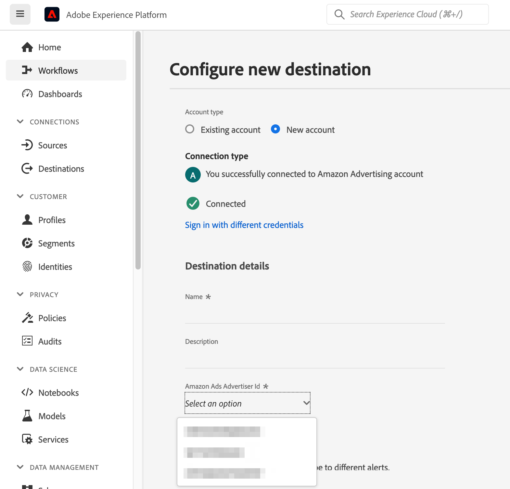

# (bèta) Amazon Ads-verbinding {#amazon-ads}

## Overzicht {#overview}

Amazon Ads biedt verschillende opties om geregistreerde verkopers, verkopers, boekverkopers, Kindle Direct Publishing-auteurs (KDP), ontwikkelaars van apps en/of bureaus te helpen uw reclamedoelstellingen te bereiken.

De integratie van Amazon Ads met Adobe Experience Platform biedt kant-en-klare integratie voor Amazon Ads-producten, waaronder de Amazon DSP (ADSP). Met de Amazon Ads-bestemming in Adobe Experience Platform kunnen gebruikers adverteerdersoorten definiëren voor doelwitten en activering op de Amazon-DSP.

Deze verbinding ondersteunt het maken van publiek in de volgende Amazon Marketplace: `US`, `CA`, `MX`, `BR`.

>[!IMPORTANT]
>
>Deze documentatiepagina is gemaakt door de *Amazon-advertenties* team. Dit is momenteel een bètaproduct en de functionaliteit kan worden gewijzigd. Voor vragen of verzoeken om updates kunt u rechtstreeks contact opnemen via *`amc-support@amazon.com`.*

## Gebruiksscenario’s {#use-cases}

Om u te helpen beter begrijpen hoe en wanneer u het *Amazon-advertenties* doel, hier zijn de gevallen van het steekproefgebruik die de klanten van Adobe Experience Platform kunnen oplossen door deze bestemming te gebruiken.

### Activering en doelversie {#activation-and-targeting}

Dankzij deze integratie met Amazon DSP kunnen adverteerders van Amazon Ads CDP-segmenten van Adobe Experience Platform naar Amazon doorgeven DSP adverteerders te maken om adverteerders aan te zetten voor reclamedoeleinden. In de Amazon-DSP kunnen doelgroepen worden geselecteerd voor positieve doelgerichtheid en voor negatieve doelgerichtheid (onderdrukking). Bovendien kunnen adverteerders hun adverteerderpubliek optimaliseren door signalen te gebruiken die via de Marketing Cloud van Amazon worden gegenereerd en die de publiekswijzigingen met Amazon-DSP synchroniseren.

## Vereisten {#prerequisites}

Als u de Amazon Ads-verbinding met Adobe Experience Platform wilt gebruiken, moeten gebruikers eerst toegang hebben tot een Amazon DSP Advertiser-account.  Ga naar de volgende pagina op de website Amazon Ads om deze gevallen op te geven:

* [Aan de slag met Amazon DSP](https://advertising.amazon.com/solutions/products/amazon-dsp?ref_=a20m_us_hnav_p_dsp_adtech)

## Ondersteunde identiteiten {#supported-identities}

De *Amazon-advertenties* De verbinding steunt de activering van identiteiten die in de hieronder lijst worden beschreven. Meer informatie over [identiteiten](/help/identity-service/namespaces.md). Ga voor meer informatie over de identiteiten die worden ondersteund door Amazon Ads naar de [Amazon DSP Support Center](https://advertising.amazon.com/dsp/help/ss/en/audiences#GA6BC9BW52YFXBNE).

| Doelidentiteit | Beschrijving | Overwegingen |
|---|---|---|
| phone_sha256 | Telefoonnummers die zijn hashed met het SHA256-algoritme | Adobe Experience Platform biedt ondersteuning voor zowel platte tekst- als SHA256-telefoonnummers. Wanneer het bronveld hashkenmerken bevat, controleert u de **[!UICONTROL Apply transformation]** optie, om [!DNL Platform] de gegevens bij activering automatisch hashen. |
| email_lc_sha256 | E-mailadressen die met het algoritme SHA256 worden gehasht | Adobe Experience Platform biedt ondersteuning voor zowel platte tekst- als SHA256-e-mailadressen met hashing. Wanneer het bronveld hashkenmerken bevat, controleert u de **[!UICONTROL Apply transformation]** optie, om [!DNL Platform] de gegevens bij activering automatisch hashen. |

{style="table-layout:auto"}

## Type en frequentie exporteren {#export-type-frequency}

Raadpleeg de onderstaande tabel voor informatie over het exporttype en de exportfrequentie van de bestemming.

| Item | Type | Notities |
---------|----------|---------|
| Exporttype | **[!UICONTROL Segment export]** | U exporteert alle leden van een segment (publiek) met de id&#39;s (naam, telefoonnummer of andere) die worden gebruikt in het dialoogvenster *Amazon-advertenties* bestemming. |
| Uitvoerfrequentie | **[!UICONTROL Streaming]** | Streaming doelen zijn &quot;altijd aan&quot; API-verbindingen. Zodra een profiel in Experience Platform wordt bijgewerkt dat op segmentevaluatie wordt gebaseerd, verzendt de schakelaar de update stroomafwaarts naar het bestemmingsplatform. Meer informatie over [streaming doelen](/help/destinations/destination-types.md#streaming-destinations). |

{style="table-layout:auto"}

## Verbinden met de bestemming {#connect}

>[!IMPORTANT]
> 
>Om met de bestemming te verbinden, hebt u nodig **[!UICONTROL Manage Destinations]** [toegangsbeheermachtiging](/help/access-control/home.md#permissions). Lees de [toegangsbeheeroverzicht](/help/access-control/ui/overview.md) of neem contact op met de productbeheerder om de vereiste machtigingen te verkrijgen.

Als u verbinding wilt maken met dit doel, voert u de stappen uit die worden beschreven in het dialoogvenster [zelfstudie over doelconfiguratie](../../ui/connect-destination.md). In vormen bestemmingswerkschema, vul de gebieden in die in de twee hieronder secties worden vermeld.

### Verifiëren voor bestemming {#authenticate}

Als u zich wilt verifiëren bij de bestemming, vult u de vereiste velden in en selecteert u **[!UICONTROL Connect to destination]**.

U wordt doorgestuurd naar de Amazon Ads-verbindingsinterface waar u eerst de adverteerderaccounts selecteert waarmee u verbinding wilt maken.  Als er verbinding is, wordt u weer omgeleid naar Adobe Experience Platform met een nieuwe verbinding, die wordt geleverd met de id van het door u geselecteerde Advertiser-account. Selecteer de juiste Advertiser-account op het scherm met de doelconfiguratie om door te gaan.

* **[!UICONTROL Bearer token]**: Vul de token van de drager in om te verifiëren bij de bestemming.

### Doelgegevens invullen {#destination-details}

Als u details voor de bestemming wilt configureren, vult u de vereiste en optionele velden hieronder in. Een sterretje naast een veld in de gebruikersinterface geeft aan dat het veld verplicht is.

* **[!UICONTROL Name]**: Een naam waarmee u deze bestemming in de toekomst zult erkennen.
* **[!UICONTROL Description]**: Een beschrijving die u zal helpen deze bestemming in de toekomst identificeren.
* **[!UICONTROL Amazon Ads Advertiser ID]**: Selecteer de id voor het Amazon Ads-doelaccount dat voor het doel wordt gebruikt.

Opmerking: als u deze Amazon Advertiser ID hebt geselecteerd, moet u een nieuwe bestemming maken om deze te wijzigen. Als u de OAuth-gegevens opnieuw verifieert en een nieuwe Advertiser-id selecteert, zijn de wijzigingen niet van toepassing.

### Waarschuwingen inschakelen {#enable-alerts}

U kunt alarm toelaten om berichten over de status van dataflow aan uw bestemming te ontvangen. Selecteer een waarschuwing in de lijst om u te abonneren op meldingen over de status van uw gegevensstroom. Voor meer informatie over waarschuwingen raadpleegt u de handleiding over [het abonneren aan bestemmingen alarm gebruikend UI](../../ui/alerts.md).

Wanneer u klaar bent met het opgeven van details voor uw doelverbinding, selecteert u **[!UICONTROL Next]**.

## Segmenten naar dit doel activeren {#activate}

>[!IMPORTANT]
> 
>Als u gegevens wilt activeren, hebt u de opdracht **[!UICONTROL Manage Destinations]**, **[!UICONTROL Activate Destinations]**, **[!UICONTROL View Profiles]**, en **[!UICONTROL View Segments]** [toegangsbeheermachtigingen](/help/access-control/home.md#permissions). Lees de [toegangsbeheeroverzicht](/help/access-control/ui/overview.md) of neem contact op met de productbeheerder om de vereiste machtigingen te verkrijgen.

Lezen [Profielen en segmenten activeren voor streaming segmentexportdoelen](/help/destinations/ui/activate-segment-streaming-destinations.md) voor instructies bij het activeren van publiekssegmenten aan deze bestemming.

### Kenmerken en identiteiten toewijzen {#map}

De Amazon Ads-verbinding biedt ondersteuning voor gehashte e-mailadressen en gehashte telefoonnummers voor overeenstemmende identiteiten.  De onderstaande schermafbeelding biedt een voorbeeld dat overeenkomt met de Amazon Ads-verbinding:

* Als u gehashte e-mailadressen wilt toewijzen, selecteert u de optie `Email_LC_SHA256` naamruimte van identiteit als bronveld.
* Als u gehashte telefoonnummers wilt toewijzen, selecteert u de optie `Phone_SHA256` naamruimte van identiteit als bronveld.
* Als u niet-gehashte e-mailadressen of telefoonnummers wilt toewijzen, selecteert u de bijbehorende naamruimten als bronvelden en controleert u de `Apply Transformation` als u wilt dat het Platform de identiteiten bij activering verbergt.

U wordt ten zeerste aangeraden om zoveel velden in kaart te brengen als u hebt. Als er slechts één bronkenmerk beschikbaar is, kunt u één veld toewijzen.  De bestemming van de Advertentie van Amazon zal alle in kaart gebrachte gebieden voor kaartdoeleinden gebruiken, die hogere gelijke tarieven opleveren als meer gebieden worden verstrekt. Ga voor meer informatie over de geaccepteerde id&#39;s naar de [Amazon Advertentiepagina met gehakte doelgroepen](https://advertising.amazon.com/dsp/help/ss/en/audiences#GA6BC9BW52YFXBNE).

## Geëxporteerde gegevens/Gegevens valideren bij exporteren {#exported-data}

Nadat u het publiek hebt geüpload, kunt u controleren of het publiek correct is gemaakt en geüpload door de volgende stappen uit te voeren:

**Voor Amazon DSP**

Navigeer naar uw advertentie-id → Soorten publiek → Advertiser-soorten. Als uw publiek met succes is gemaakt en aan het minimale aantal publieksleden voldoet, wordt de status `Active`.  Meer informatie over de grootte en het bereik van uw publiek vindt u in het deelvenster Voorspeld Bereik aan de rechterkant van de gebruikersinterface van Amazon DSP.

## Gegevensgebruik en -beheer {#data-usage-governance}

Alles [!DNL Adobe Experience Platform] de bestemmingen zijn volgzaam met het beleid van het gegevensgebruik wanneer het behandelen van uw gegevens. Voor gedetailleerde informatie over hoe [!DNL Adobe Experience Platform] dwingt gegevensbeheer af, lees de [Overzicht van gegevensbeheer](/help/data-governance/home.md).

## Aanvullende bronnen {#additional-resources}

Raadpleeg de volgende Help-bronnen voor Amazon Ads voor aanvullende Help-documentatie:

* [Amazon DSP Help Center](https://advertising.amazon.com/dsp/help/ss/en/audiences#/)
