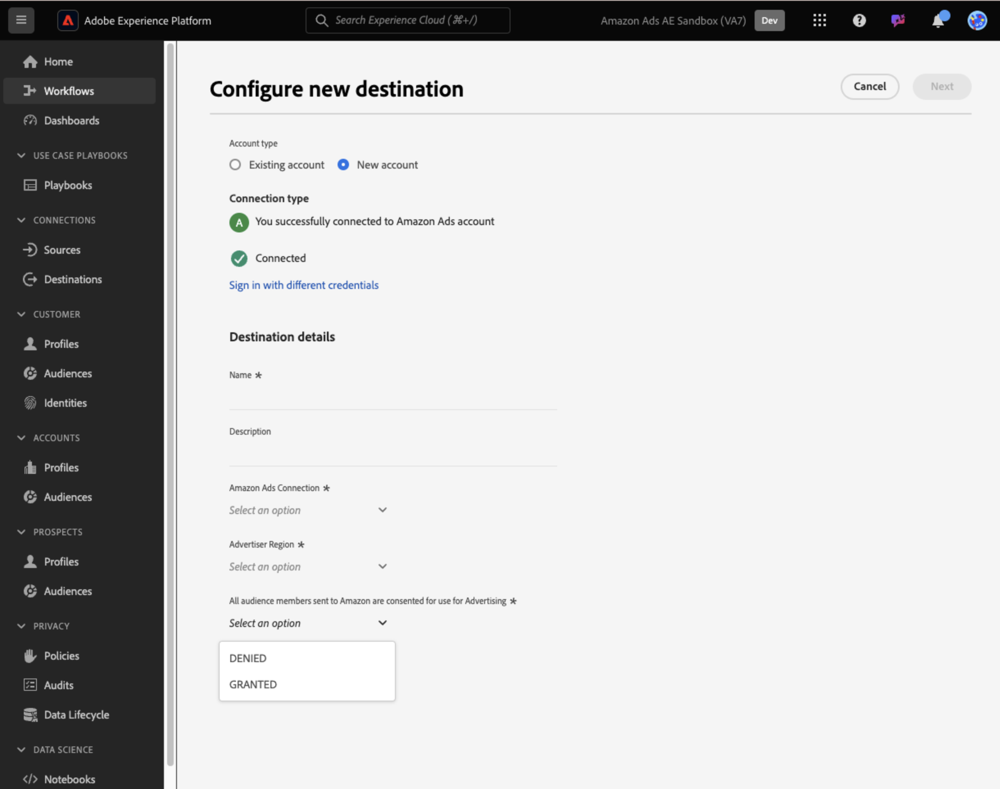
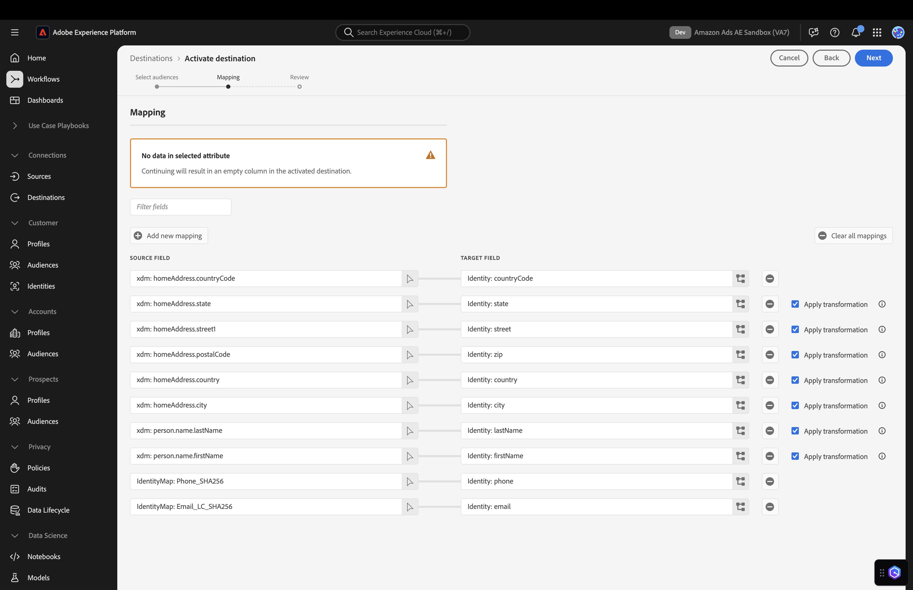
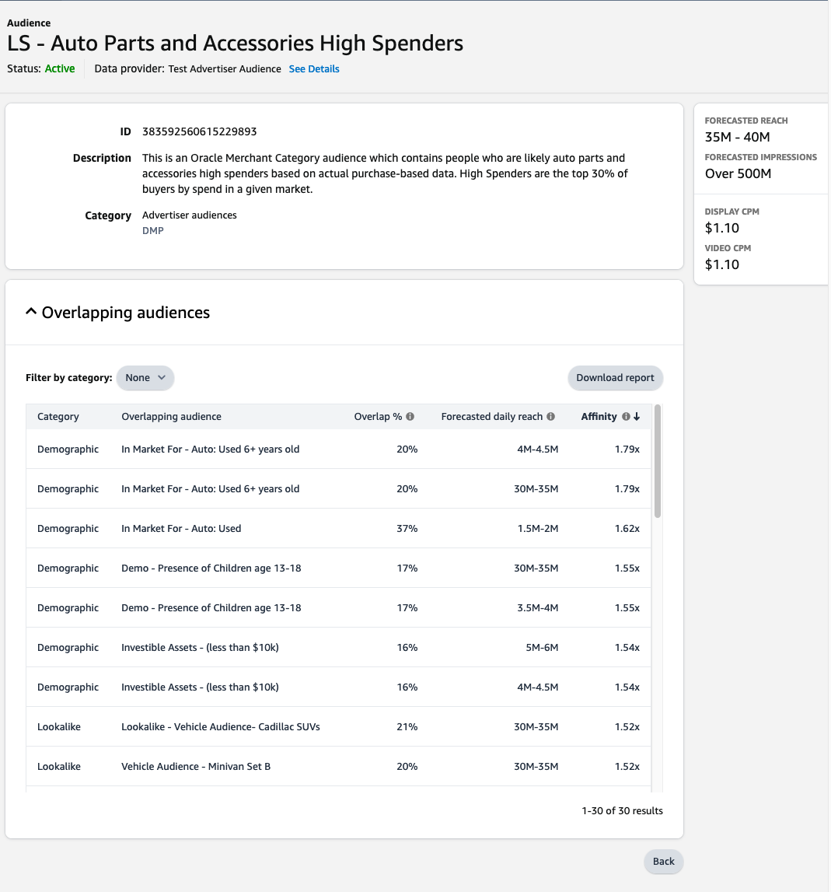
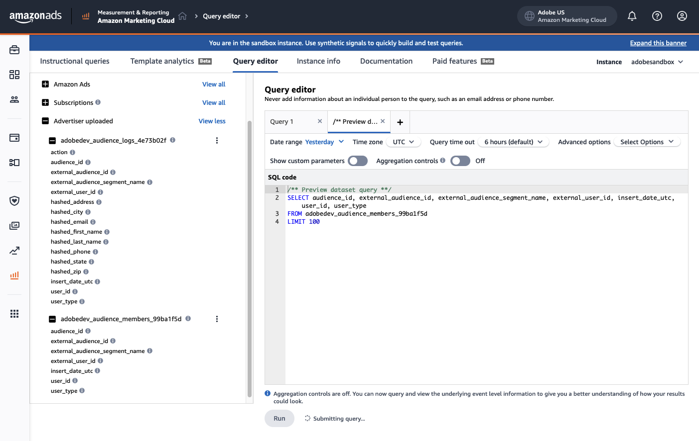

# (Verouderd) Amazon Ads-verbinding {#amazon-ads}

## Overzicht {#overview}

[!DNL Amazon Ads] biedt een aantal opties om geregistreerde verkopers, verkopers, boekverkopers, Kindle Direct Publishing (KDP)-auteurs, ontwikkelaars van apps of agentschappen te helpen uw reclamedoelstellingen te bereiken.

>[!IMPORTANT]
>
>[[!DNL Amazon Ads v2]](./amazon-ads-v2.md) is het huidige doel voor alle nieuwe [!DNL Amazon Ads] verbindingen. Als u een bestaande (verouderde) [!DNL Amazon Ads] verbinding hebt, blijft deze werken zonder de vereiste wijzigingen. [[!DNL Amazon Ads v2]](./amazon-ads-v2.md) maakt verbinding met [!DNL Ads Data Manager] , dat ondersteuning biedt voor uitgebreide identiteitstypen, adresgerelateerde velden en het delen van gegevens in [!DNL Amazon Ads] -producten. Hierdoor wordt het aantal doelgroepen en doelgroepen beter vergeleken met dit verouderde doel.
>
>Na eind april 2026 wordt de naam van [!DNL Amazon Ads v2] gewijzigd in [!DNL Amazon Ads] en wordt de verouderde kaart verborgen, zodat er één doelkaart in de catalogus overblijft. Bestaande oudere gegevensstromen blijven werken en u kunt deze na die datum beheren op het tabblad **[!UICONTROL Browse]** .

De [!DNL Amazon Ads] -integratie met [!DNL Adobe Experience Platform] biedt kant-en-klare integratie voor [!DNL Amazon Ads] -producten, waaronder [!DNL Amazon DSP] (ADSP) en [!DNL Amazon Marketing Cloud] (AMC).

Met de [!DNL Amazon Ads] bestemming in [!DNL Adobe Experience Platform] kunt u adverteerdersoorten definiëren voor activering en doelversie op de [!DNL Amazon DSP] . U kunt uw gegevens ook uploaden naar [!DNL Amazon Marketing Cloud] om de prestaties per publiek, door adverteerders verschafte afmetingen, het lidmaatschap van Amazon-segmenten of andere signalen in AMC te begrijpen. Na het uploaden van adverteerders naar AMC, kunnen gebruikers [!DNL Amazon Marketing Cloud] gebruiken om leden van het publiek te wijzigen, te verbeteren of toe te voegen met Amazon-signalen vanuit [!DNL Amazon Marketing Cloud] .

AMC verenigt unieke signalen van Amazon-eigendommen en -bediende eigenschappen, waaronder media voor weergave, video, streaming TV, audio en gesponsorde advertenties. U kunt curated segments van [!DNL Adobe Experience Platform] naar AMC verzenden om het leren te verbeteren, zoals in-market groepen van het publiek, levensstijlcohorten en merkbetrokkenheidspatronen. Gebruik versterkte segmenten om mediatoepassingen te optimaliseren in [!DNL Amazon DSP] .

>[!IMPORTANT]
>
>Deze doelconnector en documentatiepagina worden gemaakt en onderhouden door het team van *[!DNL Amazon Ads]* . Voor vragen of updateverzoeken kunt u rechtstreeks contact opnemen via *`amc-support@amazon.com`.*

## Gebruiksscenario&#39;s {#use-cases}

Om u beter te helpen begrijpen hoe en wanneer u de *[!DNL Amazon Ads]* bestemming zou moeten gebruiken, zijn hier voorbeelden van gebruiksgevallen die [!DNL Adobe Experience Platform] klanten kunnen oplossen door deze bestemming te gebruiken.

### Activering en doelversie {#activation-and-targeting}

Dankzij deze integratie met [!DNL Amazon DSP] kunnen [!DNL Amazon Ads] adverteerders CDP-soorten voor adverteerders doorgeven van [!DNL Adobe Experience Platform] naar [!DNL Amazon DSP] om adverteerders te maken die adverteerders aanspreken. U kunt een publiek binnen [!DNL Amazon DSP] selecteren voor positieve doelgerichtheid en voor negatieve doelgerichtheid (onderdrukking).

### Analyse en meting {#analytics-and-measurement}

Dankzij deze integratie met [!DNL Amazon Marketing Cloud] (AMC) kunnen [!DNL Amazon Ads] -adverteerders CDP-segmenten doorgeven van [!DNL Adobe Experience Platform] naar AMC. Vervolgens kunt u zich bij de CDP-invoer aansluiten met [!DNL Amazon Ads] -signalen en aangepaste analyses uitvoeren over onderwerpen zoals mediakijffect, publiekssegmenten en klantritten in een indeling die voldoet aan de privacy. U kunt bijvoorbeeld een lijst met bestaande klanten uploaden om inzicht te krijgen in de geaggregeerde prestaties van de advertentiecampagne, of geaggregeerde statistieken over conversiegebeurtenissen op Amazon, zoals het weergeven van een pagina met productdetails, het toevoegen van een product aan een winkelwagentje of het kopen van een product.

### Advertising optimaliseren {#advertising-optimization}

Dankzij deze integratie met [!DNL Amazon Marketing Cloud] (AMC) kunnen adverteerders hun eigen klantlijsten uploaden en met [!DNL Amazon Marketing Cloud] SQL overlappende analyses, onderdrukkingen, toevoegingen of optimalisaties op terugkerende basis uitvoeren voor een publiek dat klaar is voor activering in Amazon DSP.

## Vereisten {#prerequisites}

Als u de [!DNL Amazon Ads] verbinding met [!DNL Adobe Experience Platform] wilt gebruiken, moeten gebruikers eerst toegang hebben tot een [!DNL Amazon DSP] Advertiser-account of een [!DNL Amazon Marketing Cloud] -instantie. Ga naar de volgende pagina op de [!DNL Amazon Ads] -website om deze instanties op te geven:

* [ worden begonnen met Amazon DSP ](https://advertising.amazon.com/solutions/products/amazon-dsp)
* [ worden begonnen met Amazon Marketing Cloud ](https://advertising.amazon.com/solutions/products/amazon-marketing-cloud)

## Ondersteunde identiteiten {#supported-identities}

De *[!DNL Amazon Ads]* -verbinding ondersteunt de activering van identiteiten die in de onderstaande tabel worden beschreven. Leer meer over [ identiteiten ](/help/identity-service/features/namespaces.md). Voor meer details over de identiteiten die door [!DNL Amazon Ads] worden gesteund, bezoek het [ Centrum van de Steun van DSP van Amazon ](https://advertising.amazon.com/dsp/help/ss/en/audiences#GA6BC9BW52YFXBNE).

| Doelidentiteit | Beschrijving | Overwegingen |
|---|---|---|
| phone_sha256 | Telefoonnummers die zijn hashed met het SHA256-algoritme | Onbewerkte tekst en via SHA256 gehashte telefoonnummers worden ondersteund door [!DNL Adobe Experience Platform] . Wanneer het bronveld hashingkenmerken bevat, schakelt u de optie **[!UICONTROL Apply transformation]** in om de gegevens automatisch te laten hashen bij activering door [!DNL Experience Platform] . |
| email_lc_sha256 | E-mailadressen die met het algoritme SHA256 worden gehasht | Zowel platte tekst als gehashte e-mailadressen van SHA256 worden ondersteund door [!DNL Adobe Experience Platform]. Wanneer het bronveld hashingkenmerken bevat, schakelt u de optie **[!UICONTROL Apply transformation]** in om de gegevens automatisch te laten hashen bij activering door [!DNL Experience Platform] . |
| `firstName` | Voornaam gebruiker | Ondersteunt platte tekst of SHA256. Als onbewerkte tekst wordt gebruikt, schakelt u **[!UICONTROL Apply transformation]** in de gebruikersinterface van [!DNL Adobe Experience Platform] in. |
| `lastName` | Achternaam van de gebruiker | Ondersteunt platte tekst of SHA256. Als onbewerkte tekst wordt gebruikt, schakelt u **[!UICONTROL Apply transformation]** in de gebruikersinterface van [!DNL Adobe Experience Platform] in. |
| `street` | Adres van de gebruiker op straatniveau | Alleen SHA256-invoer met hashing wordt ondersteund. Normaliseren voor hashing. Laat **** geen transformatie aan de kant van Adobe toe. |
| `city` | Plaats van de gebruiker | Ondersteunt platte tekst of SHA256. Als onbewerkte tekst wordt gebruikt, schakelt u **[!UICONTROL Apply transformation]** in de gebruikersinterface van [!DNL Adobe Experience Platform] in. |
| `state` | Staat of provincie van de gebruiker | Ondersteunt platte tekst of SHA256. Als onbewerkte tekst wordt gebruikt, schakelt u **[!UICONTROL Apply transformation]** in de gebruikersinterface van [!DNL Adobe Experience Platform] in. |
| `zip` | Postcode van de gebruiker | Ondersteunt platte tekst of SHA256. Als onbewerkte tekst wordt gebruikt, schakelt u **[!UICONTROL Apply transformation]** in de gebruikersinterface van [!DNL Adobe Experience Platform] in. |
| `country` | Land van de gebruiker | Ondersteunt platte tekst of SHA256. Als onbewerkte tekst wordt gebruikt, schakelt u **[!UICONTROL Apply transformation]** in de gebruikersinterface van [!DNL Adobe Experience Platform] in. |

{style="table-layout:auto"}

## Ondersteunde doelgroepen {#supported-audiences}

In deze sectie wordt beschreven welke soorten publiek u naar dit doel kunt exporteren. De twee lijsten hieronder wijzen op welk publiek deze schakelaar steunt, door _kijkoorsprong_ en _profieltypes inbegrepen in het publiek_:

| Oorsprong publiek | Ondersteund | Beschrijving |
|---------|----------|----------|
| [!DNL Segmentation Service] | Ja | Het publiek produceerde door de Dienst van de Segmentatie van Experience Platform . |
| Alle andere doelgroepen | Ja | Deze categorie omvat alle oorsprong van het publiek buiten het publiek dat via [!DNL Segmentation Service] wordt gegenereerd. Lees over de [ diverse publieksoorsprong ](/help/segmentation/ui/audience-portal.md#customize). Voorbeelden zijn: <ul><li> de douane uploadt publiek [ ingevoerde ](../../../segmentation/ui/audience-portal.md#import-audience) in Experience Platform van Csv- dossiers,</li><li> gelijksoortige doelgroepen, </li><li> federaal publiek, </li><li> publiek dat wordt gegenereerd in andere Experience Platform-toepassingen, zoals [!DNL Adobe Journey Optimizer] , </li><li> en meer. </li></ul> |

{style="table-layout:auto"}

Ondersteund publiek per type publieksgegevens:

| Gegevenstype Publiek | Ondersteund | Beschrijving | Gebruiksscenario&#39;s |
|--------------------|-----------|-------------|-----------|
| [ het publiek van Mensen ](/help/segmentation/types/people-audiences.md) | Ja | Gebaseerd op klantenprofielen, die u toestaan om specifieke groepen mensen voor marketing campagnes te richten. | Frequente kopers, winkeliers |
| [ publiek van de Rekening ](/help/segmentation/types/account-audiences.md) | Nee | Doelpersonen binnen specifieke organisaties voor marketingstrategieën op basis van account. | B2B-marketing |
| [ Het publiek van het Vooruitzicht ](/help/segmentation/types/prospect-audiences.md) | Nee | De individuen van het doel die nog geen klanten zijn maar eigenschappen met uw doelpubliek delen. | Waarschuwing met gegevens van derden |
| [ de uitvoer van de Dataset ](/help/catalog/datasets/overview.md) | Nee | Verzamelingen gestructureerde gegevens die zijn opgeslagen in het [!DNL Adobe Experience Platform] Data Lake. | Rapportage, workflows voor gegevenswetenschap |

{style="table-layout:auto"}

## Type en frequentie exporteren {#export-type-frequency}

Raadpleeg de onderstaande tabel voor informatie over het exporttype en de exportfrequentie van de bestemming.

| Item | Type | Notities |
| ---------|----------|---------|
| Exporttype | **[!UICONTROL Audience export]** | U exporteert alle leden van een publiek met de id&#39;s (naam, telefoonnummer of andere) die in de *[!DNL Amazon Ads]* -bestemming worden gebruikt. |
| Exportfrequentie | **[!UICONTROL Streaming]** | Streaming doelen zijn &quot;altijd aan&quot; API-verbindingen. Zodra een profiel in Experience Platform wordt bijgewerkt dat op publieksevaluatie wordt gebaseerd, verzendt de schakelaar de update stroomafwaarts naar het bestemmingsplatform. Lees meer over [ het stromen bestemmingen ](/help/destinations/destination-types.md#streaming-destinations). |

{style="table-layout:auto"}

## Verbinden met de bestemming {#connect}

>[!IMPORTANT]
>
>Om met de bestemming te verbinden, hebt u **[!UICONTROL View Destinations]** en **[!UICONTROL Manage Destinations]** [ toegangsbeheertoestemmingen ](/help/access-control/home.md#permissions) nodig. Lees het [ overzicht van de toegangscontrole ](/help/access-control/ui/overview.md) of contacteer uw productbeheerder om de vereiste toestemmingen te verkrijgen.

Om met deze bestemming te verbinden, volg de stappen die in het [ leerprogramma van de bestemmingsconfiguratie ](/help/destinations/ui/connect-destination.md) worden beschreven. In vormen bestemmingswerkschema, vul de gebieden in die in de twee hieronder secties worden vermeld.

### Verifiëren voor bestemming {#authenticate}

Als u voor verificatie bij het doel wilt zorgen, vult u de vereiste velden in en selecteert u **[!UICONTROL Connect to destination]** .

U gaat naar de verbindingsinterface van [!DNL Amazon Ads] waar u eerst de adverteerderaccounts selecteert waarmee u verbinding wilt maken. Als er verbinding is, wordt u weer omgeleid naar [!DNL Adobe Experience Platform] met een nieuwe verbinding, die wordt geleverd met de id van het Advertiser-account dat u hebt geselecteerd. Selecteer de juiste Advertiser-account op het scherm met de doelconfiguratie om door te gaan.

### Doelgegevens invullen {#destination-details}

Als u details voor de bestemming wilt configureren, vult u de vereiste en optionele velden hieronder in. Een sterretje naast een veld in de gebruikersinterface geeft aan dat het veld verplicht is.

* **[!UICONTROL Name]**: Een naam waarmee u dit doel herkent.
* **[!UICONTROL Description]**: Een beschrijving waarmee u dit doel kunt identificeren.
* **[!UICONTROL Amazon Ads Connection]**: selecteer de id voor de doelaccount van [!DNL Amazon Ads] die voor de bestemming wordt gebruikt.

>[!NOTE]
>
>Nadat u de doelconfiguratie hebt opgeslagen, kunt u de [!DNL Amazon Ads] Advertiser-id niet meer wijzigen, zelfs niet als u de verificatie opnieuw uitvoert via uw Amazon-account. Als u een andere [!DNL Amazon Ads] Advertiser-id wilt gebruiken, moet u een nieuwe doelverbinding maken. Adverteerders die reeds op een integratie met ADSP zijn gevestigd moeten een nieuwe bestemmingsstroom tot stand brengen als zij hun publiek aan AMC of aan een verschillend rekening ADSP willen worden geleverd.

* **[!UICONTROL Advertiser Region]**: selecteer het juiste gebied waarin uw adverteerder wordt gehost. Voor meer informatie over de markten die door elk gebied worden gesteund, bezoek de [ documentatie van Amazon Ads ](https://advertising.amazon.com/API/docs/en-us/info/api-overview#api-endpoints).

* **[!UICONTROL Amazon Ads Consent Signal]**: Bevestig dat alle gegevens die via deze verbinding worden verzonden, hebben ingestemd met het gebruik van persoonsgegevens voor reclamedoeleinden. &quot;GRANTED&quot; geeft aan dat Amazon ermee instemt de persoonsgegevens van de klant te gebruiken voor reclame. De toegestane waarden zijn &quot;GRANTED&quot; en &quot;DENIED&quot;. Alle records die via verbindingen met &quot;DENIED&quot; worden verzonden, worden geweigerd voor verder gebruik binnen [!DNL Amazon Ads] .

### Waarschuwingen inschakelen {#enable-alerts}

U kunt alarm toelaten om berichten over de status van dataflow aan uw bestemming te ontvangen. Selecteer een waarschuwing in de lijst om u te abonneren op meldingen over de status van uw gegevensstroom. Voor meer informatie over alarm, lees de gids over [ het intekenen aan bestemmingsalarm gebruikend UI ](/help/destinations/ui/alerts.md).

Wanneer u klaar bent met het opgeven van details voor uw doelverbinding, selecteert u **[!UICONTROL Next]** .

## Soorten publiek naar dit doel activeren {#activate}

>[!IMPORTANT]
>
>* Om gegevens te activeren, hebt u **[!UICONTROL View Destinations]**, **[!UICONTROL Activate Destinations]**, **[!UICONTROL View Profiles]**, en **[!UICONTROL View Segments]** [ toegangsbeheertoestemmingen ](/help/access-control/home.md#permissions) nodig. Lees het [ overzicht van de toegangscontrole ](/help/access-control/ui/overview.md) of contacteer uw productbeheerder om de vereiste toestemmingen te verkrijgen.
>* Om *identiteiten* uit te voeren, hebt u de **[!UICONTROL View Identity Graph]** [ toegangsbeheertoestemming ](/help/access-control/home.md#permissions) nodig.   {width="100" zoomable="yes"}

Lees [ activeer profielen en publiek aan het stromen publiek uitvoerbestemmingen ](/help/destinations/ui/activate-segment-streaming-destinations.md) voor instructies bij het activeren van publiek aan deze bestemming.

### Kenmerken en identiteiten toewijzen {#map}

De verbinding van [!DNL Amazon Ads] steunt gehakt e-mailadres en gehashte telefoonaantallen voor overeenstemmende identiteit. In de onderstaande schermafbeelding ziet u een voorbeeld dat overeenkomt met de [!DNL Amazon Ads] -verbinding:

* Als u gehashte e-mailadressen wilt toewijzen, selecteert u de naamruimte `Email_LC_SHA256` identity als bronveld.
* Als u gehashte telefoonnummers wilt toewijzen, selecteert u de naamruimte `Phone_SHA256` identity als bronveld.
* Als u ongehashte e-mailadressen of telefoonnummers wilt toewijzen, selecteert u de bijbehorende naamruimten als bronvelden en schakelt u de optie **[!UICONTROL Apply transformation]** in om de id&#39;s bij activering door [!DNL Experience Platform] te laten hashen.
* *NIEUW die met de versie van September 2024* begint: Amazon Ads vereist u om een gebied in kaart te brengen dat een `countryCode` waarde in het 2 karakterISO formaat bevat om het proces van de identiteitsresolutie (bijvoorbeeld: US, GB, MX, CA, etc.) te vergemakkelijken. Verbindingen zonder `countryCode` toewijzingen hebben een negatief effect op de overeenstemmingssnelheden.

>[!NOTE]
>
>Deze velden gebruiken:
> 
>* Alle identiteitswaarden moeten vóór inname worden genormaliseerd. Zie de [ normalisatiegids ](https://advertising.amazon.com/help/GCCXMZYCK4RXWS6C).
>* SHA256 hashing wordt vereist, of op de cliëntkant of door het toelaten van de transformatie van Adobe plaatsen.
>* Adobe UI verstrekt checkbox om transformatie per identiteitsgebied tijdens schakelaaropstelling toe te passen.

U selecteert slechts één keer een bepaald doelgebied in een bestemmingsconfiguratie van de [!DNL Amazon Ads] schakelaar. Als u bijvoorbeeld bedrijfs-e-mail verzendt, kunt u persoonlijke e-mail niet ook toewijzen in dezelfde doelconfiguratie.

Wijs zoveel mogelijk velden toe. Als er slechts één bronkenmerk beschikbaar is, kunt u één veld toewijzen. Het doel [!DNL Amazon Ads] gebruikt alle toegewezen velden voor toewijzingsdoeleinden, wat hogere overeenkomende snelheden oplevert als er meer velden zijn opgegeven. Voor meer informatie over de toegelaten herkenningstekens, bezoek de [ Amazon Ads hakte pagina van de publiekshulp ](https://advertising.amazon.com/dsp/help/ss/en/audiences#GA6BC9BW52YFXBNE).

## Geëxporteerde gegevens/Gegevens valideren bij exporteren {#exported-data}

Nadat het publiek is geüpload, controleert u met de volgende stappen of het publiek op de juiste wijze is gemaakt en geüpload:

**Voor[!DNL Amazon DSP]**

Ga naar **[!UICONTROL Advertiser ID]** > **[!UICONTROL Audiences]** > **[!UICONTROL Advertiser Audiences]**. Als uw publiek met succes is gemaakt en aan het minimale aantal publieksleden voldoet, wordt de status `Active` weergegeven. Meer informatie over de grootte en het bereik van uw publiek vindt u in het deelvenster Voorspelde resultaten rechts van de gebruikersinterface van [!DNL Amazon DSP] .

**Voor[!DNL Amazon Marketing Cloud]**

Zoek in de linkerschemabrowser naar uw publiek onder **[!UICONTROL Advertiser Uploaded]** > **[!UICONTROL aep_audiences]** . U kunt dan uw publiek in de SQL redacteur van AMC met de volgende clausule vragen:

`select count(user_id) from adobeexperienceplatf_audience_view_000xyz where external_audience_segment_name = '1234567'`

## Gegevensgebruik en -beheer {#data-usage-governance}

Alle [!DNL Adobe Experience Platform] -doelen zijn compatibel met het beleid voor gegevensgebruik bij het verwerken van uw gegevens. Voor gedetailleerde informatie over hoe [!DNL Adobe Experience Platform] gegevensbeheer afdwingt, lees het [ overzicht van het Beleid van Gegevens ](/help/data-governance/home.md).

## Aanvullende bronnen {#additional-resources}

Raadpleeg de volgende [!DNL Amazon Ads] Help-bronnen voor aanvullende Help-documentatie:

* [ Amazon DSP Help Center ](https://www.amazon.com/ap/signin?openid.pape.max_auth_age=28800&openid.return_to=https%3A%2F%2Fadvertising.amazon.com%2Fdsp%2Fhelp%2Fss%2Fen%2Faudiences&openid.identity=http%3A%2F%2Fspecs.openid.net%2Fauth%2F2.0%2Fidentifier_select&openid.assoc_handle=amzn_bt_desktop_us&openid.mode=checkid_setup&openid.claimed_id=http%3A%2F%2Fspecs.openid.net%2Fauth%2F2.0%2Fidentifier_select&openid.ns=http%3A%2F%2Fspecs.openid.net%2Fauth%2F2.0)

## Changelog {#changelog}

Deze sectie vangt de functionaliteit en de significante documentatieupdates aan deze bestemmingsschakelaar worden aangebracht die.

+++ Wijzigingen weergeven

| Releasedatum | Type bijwerken | Beschrijving |
|---|---|---|
| Oktober 2025 | Ondersteuning toegevoegd aan extra identiteitsvelden | Extra persoonlijke id&#39;s worden ondersteund, zoals `firstName` , `lastName` , `street` , `city` , `state` , `zip` en `country` . Door deze velden toe te wijzen, kunt u de weergavesnelheid voor de doelgroep verbeteren. |
| februari 2025 | De vereiste om **[!UICONTROL Amazon Ads Consent Signal]** toe te voegen aan het exporteren van gegevens is toegevoegd en de bestemming van bèta naar algemeen beschikbaar bevorderd. |  |
| Mei 2024 | Bijwerken van functionaliteit en documentatie | De toewijzingsoptie voor het exporteren van de parameter `countryCode` naar Amazon Ads is toegevoegd. Gebruik `countryCode` in de [toewijzingsstap](#map) om uw afstemmingspercentages voor identiteiten met Amazon te verbeteren. |
| maart 2024 | Bijwerken van functionaliteit en documentatie | De optie voor het exporteren van soorten publiek die in [!DNL Amazon Marketing Cloud] (AMC) moeten worden gebruikt, is toegevoegd. |
| Mei 2023 | Bijwerken van functionaliteit en documentatie | <ul><li>Toegevoegde steun voor de selectie van het Gebied Advertiser in het [ werkschema van de bestemmingsverbinding ](#destination-details).</li><li>Bijgewerkte documentatie waarin de toevoeging van de selectie van het advertentiegebied wordt weergegeven. Voor meer informatie bij het selecteren van het correcte Gebied Advertiser, zie de [ documentatie van Amazon ](https://advertising.amazon.com/API/docs/en-us/info/api-overview#api-endpoints).</li></ul> |
| maart 2023 | Eerste release | Eerste doelversie en documentatie gepubliceerd. |

{style="table-layout:auto"}

+++
