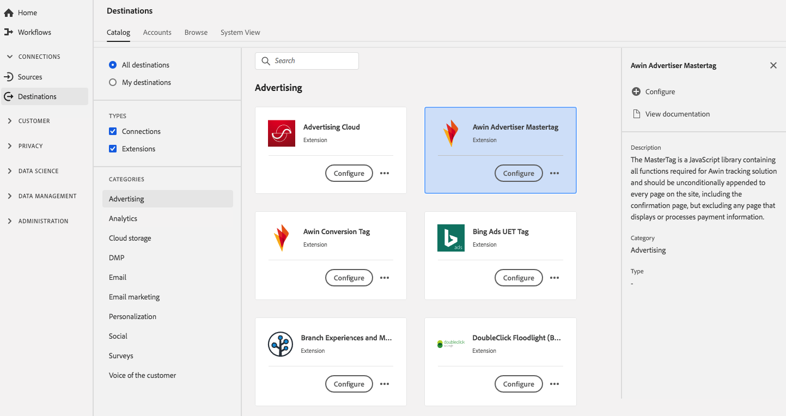

# [!DNL Awin Advertiser Mastertag] extension {#awin-mastertag-extension}

## Overzicht {#overview}

[!DNL MasterTag] is een JavaScript-bibliotheek met alle functies die vereist zijn voor de Awin-trackingsoplossing en moet onvoorwaardelijk worden toegevoegd aan elke pagina op de site, inclusief de bevestigingspagina, maar exclusief pagina&#39;s die betalingsgegevens weergeven of verwerken.

[!DNL Awin Advertiser Mastertag] is een advertentie-extensie in Adobe Experience Platform. Voor meer informatie over de uitbreidingsfunctionaliteit, zie de uitbreidingspagina op [ Adobe Exchange ](https://exchange.adobe.com/experiencecloud.details.103176.awin-advertiser-mastertag.html).

Dit doel is een tagextensie. Voor meer informatie over hoe de uitbreidingen in Experience Platform werken, zie het [ overzicht van markeringsuitbreidingen ](../launch-extensions/overview.md).

## Vereisten {#prerequisites}

Deze extensie is beschikbaar in de catalogus [!DNL Destinations] voor alle klanten die Experience Platform hebben aangeschaft.

Als u deze extensie wilt gebruiken, hebt u toegang tot tags in Adobe Experience Platform nodig. Tags worden aan Adobe Experience Cloud-klanten aangeboden als een inbegrepen, waardetoevoegend element. Neem contact op met de systeembeheerder van uw organisatie om toegang tot tags te krijgen en vraag hen om u de **[!UICONTROL manage_properties]** -machtiging te verlenen zodat u extensies kunt installeren.

## Extensie installeren {#install-extension}

De extensie [!DNL Awin Advertiser Mastertag] installeren:

In de [ interface van Experience Platform ](https://platform.adobe.com/), ga **[!UICONTROL Destinations]** > **[!UICONTROL Catalog]**.

Selecteer de extensie in de catalogus of gebruik de zoekbalk.

Klik op de bestemming om deze te markeren en selecteer vervolgens **[!UICONTROL Configure]** in de rechtertrack. Als het besturingselement **[!UICONTROL Configure]** grijs wordt weergegeven, ontbreekt de machtiging **[!UICONTROL manage_properties]** . Zie [ Eerste vereisten ](#prerequisites).

Selecteer de eigenschap tag waarin u de extensie wilt installeren. U kunt ook een nieuwe eigenschap maken. Een bezit is een inzameling van regels, gegevenselementen, gevormde uitbreidingen, milieu&#39;s, en bibliotheken. Leer over eigenschappen in de [ tagdocumentatie ](../../../tags/ui/administration/companies-and-properties.md).

De werkstroom neemt u aan de UI van de Inzameling van Gegevens om de installatie te voltooien.

Voor informatie over de opties van de uitbreidingsconfiguratie en installatiesteun, zie de [ pagina van Advertiser Mastertag op Adobe Exchange ](https://exchange.adobe.com/experiencecloud.details.103176.awin-advertiser-mastertag.html) Awin.

U kunt de uitbreiding direct in [ de Inzameling UI van Gegevens ](https://experience.adobe.com/#/data-collection/) ook installeren. Zie de gids op [ toevoegend een nieuwe uitbreiding ](../../../tags/ui/managing-resources/extensions/overview.md#add-a-new-extension) voor meer informatie.

## De extensie gebruiken {#how-to-use}

Nadat u de extensie hebt geïnstalleerd, kunt u regels instellen. In de UI van de Inzameling van Gegevens, kunt u opstellingsregels voor uw geïnstalleerde uitbreidingen om gebeurtenisgegevens naar de uitbreidingsbestemming slechts in bepaalde situaties te verzenden. Voor meer informatie over vestiging regels voor uw uitbreidingen, zie het overzicht op [ regels ](../../../tags/ui/managing-resources/rules.md) in de markeringsdocumentatie.

## Uitbreiding configureren, bijwerken en verwijderen {#configure-upgrade-delete}

U kunt extensies configureren, upgraden en verwijderen in de gebruikersinterface voor gegevensverzameling.

>[!TIP]
>
>Als de extensie al op een van uw eigenschappen is geïnstalleerd, wordt de interface nog steeds **[!UICONTROL Install]** voor de extensie weergegeven. Kik van het installatiewerkschema zoals die in [ wordt beschreven installeer uitbreiding ](#install-extension) om uw uitbreiding te vormen of te schrappen.

Om uw uitbreiding te bevorderen, zie de gids op het [ proces van de uitbreidingsverbetering ](../../../tags/ui/managing-resources/extensions/extension-upgrade.md) in de tagdocumentatie.
