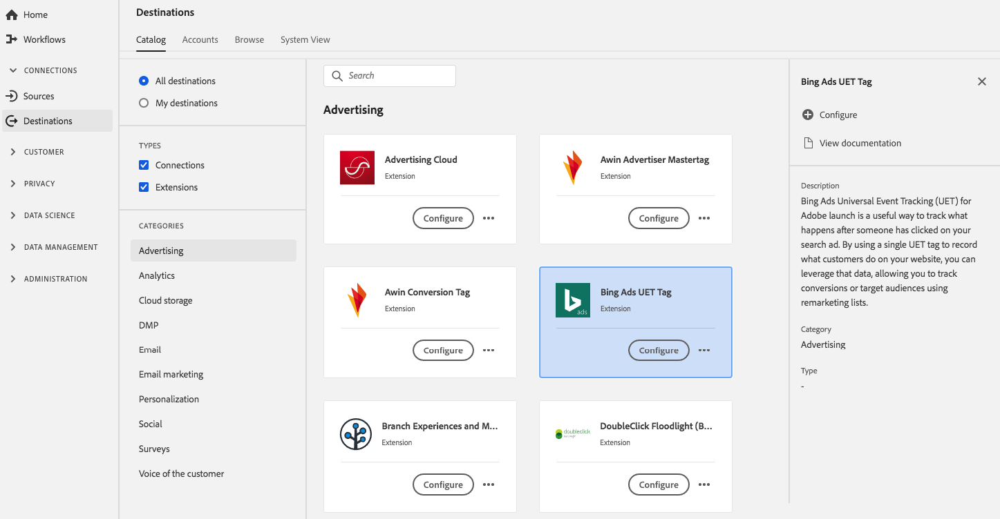

# [!DNL Bing Ads Universal Event Tracking] (UET)-extensie {#bing-ads-extension}

## Overzicht {#overview}

De extensie van de tag [!DNL Bing Ads Universal Event Tracking] (UET) is een handige manier om te volgen wat er gebeurt wanneer iemand op de advertentie heeft geklikt. Door één UET-tag te gebruiken om op te nemen wat klanten op uw website doen, kunt u deze gegevens benutten, zodat u conversies of doelgroepen kunt bijhouden met behulp van remarketing lijsten.

[!DNL Bing Ads Universal Event Tracking] (UET) is een advertentie-uitbreiding in Adobe Experience Platform. Voor meer informatie over de uitbreidingsfunctionaliteit, zie de uitbreidingspagina op [Adobe Uitwisseling](https://exchange.adobe.com/experiencecloud.details.100154.html).

Dit doel is een tagextensie. Zie [overzicht van tagextensies](../launch-extensions/overview.md) voor meer informatie over de manier waarop tagextensies werken in Platform.

## Vereisten {#prerequisites}

Deze extensie is beschikbaar in de catalogus [!DNL Destinations] voor alle klanten die Platform hebben aangeschaft.

Als u deze extensie wilt gebruiken, hebt u toegang tot tags in Adobe Experience Platform nodig. Tags worden aan Adobe Experience Cloud-klanten aangeboden als een inbegrepen, waardetoevoegend element. Neem contact op met de systeembeheerder van uw organisatie om toegang tot tags te krijgen en vraag hen om u de **[!UICONTROL manage_properties]** toestemming te geven zodat u extensies kunt installeren.

## Extensie installeren {#install-extension}

De extensie [!DNL Bing Ads Universal Event Tracking] (UET) installeren:

Ga in [Platform interface](https://platform.adobe.com/) naar **[!UICONTROL Destinations]** > **[!UICONTROL Catalog]**.

Selecteer de extensie in de catalogus of gebruik de zoekbalk.

Klik op de bestemming om deze te markeren en selecteer **[!UICONTROL Configure]** in de rechtertrack. Als het **[!UICONTROL Configure]** besturingselement grijs is, ontbreekt u de **[!UICONTROL manage_properties]** toestemming. Zie [Eerste vereisten](#prerequisites).

Selecteer de eigenschap tag waarin u de extensie wilt installeren. U kunt ook een nieuwe eigenschap maken. Een bezit is een inzameling van regels, gegevenselementen, gevormde uitbreidingen, milieu&#39;s, en bibliotheken. Meer informatie over eigenschappen vindt u in de [tagdocumentatie](../../../tags/ui/administration/companies-and-properties.md).

De werkstroom neemt u aan de UI van de Inzameling van Gegevens om de installatie te voltooien.

Voor informatie over de opties van de uitbreidingsconfiguratie en installatiesteun, zie [Bing Advertentie Universal Event Tracking (UET) pagina op de Uitwisseling van Adobe ](https://exchange.adobe.com/experiencecloud.details.100154.html).

U kunt de extensie ook rechtstreeks installeren in de gebruikersinterface [Gegevensverzameling](https://experience.adobe.com/#/data-collection/). Zie de gids op [toevoegend een nieuwe uitbreiding](../../../tags/ui/managing-resources/extensions/overview.md#add-a-new-extension) voor meer informatie.

## De extensie gebruiken {#how-to-use}

Nadat u de extensie hebt geïnstalleerd, kunt u regels instellen. In de UI van de Inzameling van Gegevens, kunt u opstellingsregels voor uw geïnstalleerde uitbreidingen om gebeurtenisgegevens naar de uitbreidingsbestemming slechts in bepaalde situaties te verzenden. Voor meer informatie over opstellingsregels voor uw uitbreidingen, zie het overzicht over [regels](../../../tags/ui/managing-resources/rules.md) in de markeringsdocumentatie.

## De extensie configureren, upgraden en verwijderen {#configure-upgrade-delete}

U kunt extensies configureren, upgraden en verwijderen in de gebruikersinterface voor gegevensverzameling.

>[!TIP]
>
>Als de extensie al op een van uw eigenschappen is geïnstalleerd, wordt **[!UICONTROL Install]** voor de extensie nog steeds weergegeven. Kies de installatieworkflow zoals beschreven in [Extensie installeren](#install-extension) om de extensie te configureren of te verwijderen.

Als u de extensie wilt bijwerken, raadpleegt u de handleiding bij het [upgradeproces van de extensie](../../../tags/ui/managing-resources/extensions/extension-upgrade.md) in de documentatie bij de codes.
