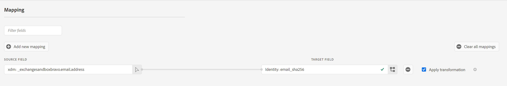
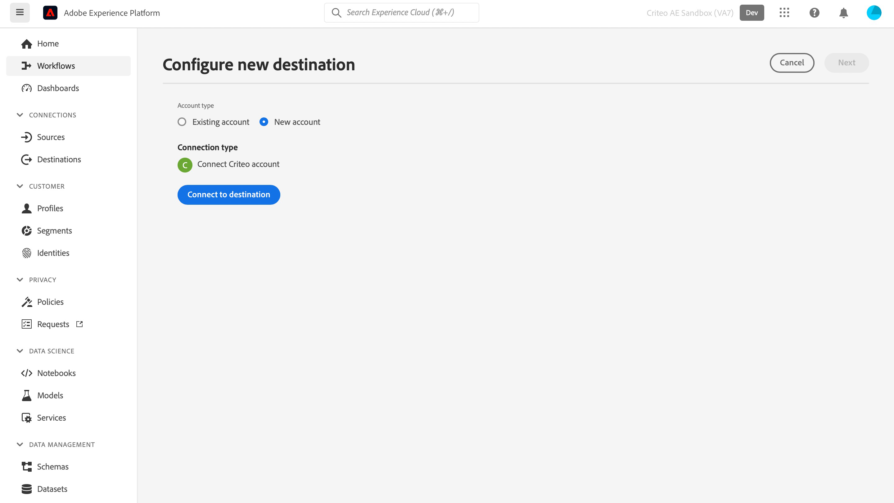

# (bèta) Criteo-verbinding

## Overzicht {#overview}

>[!IMPORTANT]
>
>Deze documentatiepagina is gemaakt door de website. Dit is momenteel een bètaproduct en de functionaliteit kan worden gewijzigd. Voor vragen of verzoeken om updates kunt u rechtstreeks contact opnemen met de Commissie [hier](mailto:criteoTechnicalPartnerships@criteo.com).

Criteo biedt vertrouwde en ondoordachte reclame de mogelijkheid om meer ervaring op te doen voor elke consument op het open internet. Met &#39;s werelds grootste set handelsgegevens en de best-in-class AI zorgt Criteo ervoor dat elk touchpoint over de winkelreis gepersonaliseerd is om klanten met de juiste en juiste advertentie op het juiste moment te bereiken.

## Vereisten {#prerequisites}

* U moet een beheerdersgebruikersaccount hebben op [Centrum voor systeembeheer](https://marketing.criteo.com).
* U hebt uw advertentie-id voor de website nodig (vraag uw contactpersoon voor de website als u deze id niet hebt).

## Beperkingen {#limitations}

* Criteo biedt momenteel geen ondersteuning voor het verwijderen van gebruikers uit het publiek.
* Criteuse accepteert alleen [!DNL SHA-256]-hashed en onbewerkte e-mails (om te zetten in [!DNL SHA-256] vóór verzending). Stuur geen PII (Persoonlijke identificeerbare gegevens, zoals de naam of het telefoonnummer van een persoon).



## Ondersteunde identiteiten {#supported-identities}

Criteo ondersteunt de activering van identiteiten die in de onderstaande tabel worden beschreven. Meer informatie over [identiteiten](https://experienceleague.adobe.com/docs/experience-platform/identity/namespaces.html?lang=en#getting-started).

| Doelidentiteit | Beschrijving | Overwegingen |
| --- | --- | --- |
| `email_sha256` | E-mailadressen die met het algoritme SHA-256 worden gehasht | Adobe Experience Platform biedt ondersteuning voor zowel platte tekst- als SHA-256-gehashte e-mailadressen. Wanneer het bronveld hashkenmerken bevat, controleert u de [!UICONTROL Apply transformation] als u wilt dat het Platform de gegevens bij activering automatisch verbergt. |

## Type en frequentie exporteren {#export-type-frequency}

Raadpleeg de onderstaande tabel voor informatie over het exporttype en de exportfrequentie van de bestemming.

| Item | Type | Notities |
| --- | --- | --- |
| Exporttype | Segment exporteren | U exporteert alle leden van een segment (publiek) met de id&#39;s (naam, telefoonnummer of andere) die worden gebruikt in het dialoogvenster [!DNL Criteo] bestemming. |
| Uitvoerfrequentie | Streaming | Streaming doelen zijn &quot;altijd aan&quot; API-verbindingen. Zodra een profiel in Experience Platform wordt bijgewerkt dat op segmentevaluatie wordt gebaseerd, verzendt de schakelaar de update stroomafwaarts naar het bestemmingsplatform. Meer informatie over [streaming doelen](../../destination-types.md#streaming-destinations). |

## Gebruiksscenario’s {#use-cases}

Om u te helpen beter begrijpen hoe te gebruiken [!DNL Criteo] doel, hier zijn sommige doelstellingen die de klanten van Adobe Experience Platform kunnen bereiken met [!DNL Criteo]:

### Hoofdlettergebruik 1: Verkeer ophalen

Laat uw bedrijf zien met relevante productaanbiedingen en flexibele creatieve producten. Met intelligente productaanbevelingen zullen uw advertenties automatisch de producten bevatten die het meest waarschijnlijk bezoeken en betrokkenheid zullen veroorzaken. Het flexibele richten staat u toe om publiek van de handels van Criteo gegevensreeks of van uw eigen perspectieflijsten en Adobe CDP segmenten te bouwen.

### Hoofdlettergebruik 2: Meer websiteconversies

Wanneer bezoekers uw website verlaten, herinner hen wat zij met het herrichten van advertenties missen die omzettingen door speciale overeenkomsten en hyper-relevante aanbiedingen te tonen verhogen, waar zij ook gaan. Verbind uw Adobe CDP segment om bestaande klanten opnieuw in dienst te nemen of consumenten te richten gelijkend op uw meest loyale kopers.

## Verbinding maken met website {#connect}

>[!IMPORTANT]
> 
>Om met de bestemming te verbinden, hebt u nodig **[!UICONTROL Manage Destinations]** [toegangsbeheermachtiging](/help/access-control/home.md#permissions). Lees de [toegangsbeheeroverzicht](/help/access-control/ui/overview.md) of neem contact op met de productbeheerder om de vereiste machtigingen te verkrijgen.

Als u verbinding wilt maken met dit doel, voert u de stappen uit die worden beschreven in het dialoogvenster [zelfstudie over doelconfiguratie](../../ui/connect-destination.md).

### Verifiëren voor commissie

De stappen om te verbinden zijn als volgt:

1. Meld u aan bij Adobe Experience Platform en maak verbinding met het doel Computer.

   

1. U wordt omgeleid naar de website om de verbinding te autoriseren. Mogelijk moet u zich eerst aanmelden met uw verificatiegegevens:

   

   

   


### Verbindingsparameters {#connection-parameters}

Vul de volgende verbindingsparameters in nadat u de bestemming hebt geverifieerd.


| Veld | Beschrijving | Vereist |
| --- | --- | --- |
| Naam | Een naam waarmee u deze bestemming in de toekomst kunt herkennen. De naam die u hier kiest, is [!DNL Audience] naam in het Centrum van het Beheer van de Nota en kan niet in later stadium worden gewijzigd. | Ja |
| Beschrijving | Een beschrijving waarmee u deze bestemming in de toekomst kunt identificeren. | Nee |
| API-versie | Criteo API-versie. Selecteer Voorvertoning. | Ja |
| Adverteerder-id | Identiteitskaart van Adverteerder van de website van uw organisatie. Neem contact op met uw accountmanager van de website voor deze informatie. | Ja |

## Segmenten naar dit doel activeren {#activate-segments}

>[!IMPORTANT]
> 
>Als u gegevens wilt activeren, hebt u de opdracht **[!UICONTROL Manage Destinations]**, **[!UICONTROL Activate Destinations]**, **[!UICONTROL View Profiles]**, en **[!UICONTROL View Segments]** [toegangsbeheermachtigingen](/help/access-control/home.md#permissions). Lees de [toegangsbeheeroverzicht](/help/access-control/ui/overview.md) of neem contact op met de productbeheerder om de vereiste machtigingen te verkrijgen.

Lezen [Profielen en segmenten activeren voor streaming segmentexportdoelen](../../ui/activate-segment-streaming-destinations.md) voor instructies bij het activeren van publiekssegmenten aan deze bestemming.

## Geëxporteerde gegevens {#exported-data}

U kunt de geëxporteerde segmenten zien in het dialoogvenster [Centro](https://marketing.criteo.com/audience-manager/dashboard).

De door de [!DNL Criteo] De verbinding ziet er ongeveer als volgt uit:

```json
{ 
  "data": { 
    "type": "ContactlistWithUserAttributesAmendment", 
    "attributes": { 
      "operation": "add", 
      "identifierType": "sha256email", 
      "identifiers": [ 
        { 
          "identifier": "1c8494bbc4968277345133cca6ba257b9b3431b8a84833a99613cf075a62a16d", 
          "attributes": [{ "key": "customValue", "value": "1" }] 
        } 
      ] 
    } 
  } 
} 
```

## Gegevensgebruik en -beheer {#data-usage}

Alle Adobe Experience Platform-doelen zijn bij het verwerken van uw gegevens compatibel met het beleid voor gegevensgebruik. Lees voor meer informatie over hoe Adobe Experience Platform gegevensbeheer afdwingt de [Overzicht van gegevensbeheer](https://experienceleague.adobe.com/docs/experience-platform/data-governance/home.html?lang=en).

## Aanvullende bronnen

* [Criteo Help Center](https://help.criteo.com/kb/en)
* [Criteo Developer Portal](https://developers.criteo.com/marketing-solutions/v2022.04/reference/modifyaudienceuserswithattributes)
