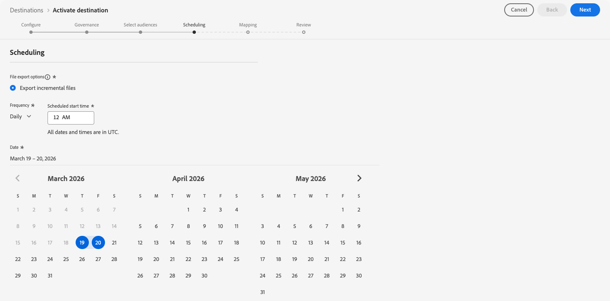

# [!DNL FreeWheel]-verbinding {#freewheel}

>[!AVAILABILITY]
>
>De [!DNL FreeWheel] -bestemming bevindt zich momenteel in Beta en is alleen beschikbaar voor bepaalde klanten. Neem contact op met uw Adobe-vertegenwoordiger om toegang aan te vragen.

## Overzicht {#overview}

[!DNL FreeWheel] is een wereldwijd platform voor advertentietechnologie dat programmatic macht koopt en verkoopt over verbonden TV (CTV), video, en vertoningsinventaris. [!DNL FreeWheel] biedt een gegevensgestuurde markt die adverteerders overal ter wereld verbindt met toonaangevende media-eigenaars.

Gebruik deze bestemming om een publiek van [!DNL Adobe Experience Platform] naar [!DNL FreeWheel] te verzenden. Soorten publiek wordt geleverd als dagelijkse batchbestanden en wordt beschikbaar gesteld voor doelversie in [!DNL FreeWheel] -deals en -campagnes.

## Vereisten {#prerequisites}

Controleer de volgende vereisten voordat u het publiek naar [!DNL FreeWheel] kunt activeren:

* **het netwerkidentiteitskaart FreeWheel**: U moet een geldige [!DNL FreeWheel] netwerkidentiteitskaart hebben. Deze wordt geleverd door [!DNL FreeWheel] wanneer uw account wordt ingesteld.

## Ondersteunde identiteiten {#supported-identities}

[!DNL FreeWheel] ondersteunt de activering van identiteiten die in de onderstaande tabel worden beschreven. Naast deze identiteiten kunt u elke beschikbare identiteit in uw [!DNL FreeWheel] account gebruiken. Zie [&#x200B; attributen en identiteiten van de Kaart &#x200B;](#map) voor instructies op hoe te om een identiteit in kaart te brengen die niet in de lijst hieronder is. Leer meer over [&#x200B; identiteiten &#x200B;](/help/identity-service/features/namespaces.md).

| Doelidentiteit | Beschrijving | Overwegingen |
|---|---|---|
| `idfa` | Apple-id voor adverteerders | Selecteer deze doelidentiteit wanneer uw bronidentiteit een IDFA-naamruimte is. |
| `aaid` | ANDROID ADVERTISING ID | Selecteer deze doelidentiteit wanneer uw bronidentiteit een GAID-naamruimte is. |
| `ctv` | Id van aangesloten tv-apparaat | Selecteer deze doelidentiteit wanneer u zich richt op CTV-apparaten. |
| `ip` | IPv4-adres | Selecteer deze doelidentiteit om gebruikers te richten die op hun IP adres worden gebaseerd. Wijs een profielattribuut toe dat een geldig IPv4 adres bevat, of gebruik een berekend gebied om de waarde af te leiden. |
| `ipv6` | IPv6-adres | Selecteer deze doelidentiteit om gebruikers te richten die op hun IPv6 adres worden gebaseerd. Wijs een profielattribuut toe dat een geldig IPv6 adres bevat, of gebruik een berekend gebied om de waarde af te leiden. |

{style="table-layout:auto"}

## Ondersteunde doelgroepen {#supported-audiences}

In deze sectie wordt beschreven welke soorten publiek u naar dit doel kunt exporteren.

| Oorsprong publiek | Ondersteund | Beschrijving |
|---------|----------|----------|
| [!DNL Segmentation Service] | Ja | Het publiek produceerde door de Dienst van de Segmentatie van Experience Platform [&#x200B; &#x200B;](../../../segmentation/home.md). |
| Alle andere doelgroepen | Ja | Deze categorie omvat alle oorsprong van het publiek buiten het publiek dat via [!DNL Segmentation Service] wordt gegenereerd. Lees over de [&#x200B; diverse publieksoorsprong &#x200B;](/help/segmentation/ui/audience-portal.md#customize). Voorbeelden zijn: <ul><li>de douane uploadt publiek [&#x200B; ingevoerde &#x200B;](../../../segmentation/ui/audience-portal.md#import-audience) in Experience Platform van Csv- dossiers,</li><li>gelijksoortige doelgroepen,</li><li>federaal publiek,</li><li>publiek dat wordt gegenereerd in andere Experience Platform-toepassingen, zoals [!DNL Adobe Journey Optimizer] ,</li><li>en meer.</li></ul> |

{style="table-layout:auto"}

Ondersteund publiek per type publieksgegevens:

| Gegevenstype Publiek | Ondersteund | Beschrijving | Gebruiksscenario&#39;s |
|--------------------|-----------|-------------|-----------|
| [&#x200B; het publiek van Mensen &#x200B;](/help/segmentation/types/people-audiences.md) | Ja | Gebaseerd op klantenprofielen, die u toestaan om specifieke groepen mensen voor marketing campagnes te richten. | Heroriëntering van tv, onderdrukking van bereik |
| [&#x200B; publiek van de Rekening &#x200B;](/help/segmentation/types/account-audiences.md) | Nee | Doelpersonen binnen specifieke organisaties voor marketingstrategieën op basis van account. | B2B-marketing |
| [&#x200B; Het publiek van het Vooruitzicht &#x200B;](/help/segmentation/types/prospect-audiences.md) | Nee | De individuen van het doel die nog geen klanten zijn maar eigenschappen met uw doelpubliek delen. | Waarschuwing met gegevens van derden |
| [&#x200B; de uitvoer van de Dataset &#x200B;](/help/catalog/datasets/overview.md) | Nee | Verzamelingen gestructureerde gegevens die zijn opgeslagen in het [!DNL Adobe Experience Platform] Data Lake. | Rapportage, workflows voor gegevenswetenschap |

{style="table-layout:auto"}

## Type en frequentie exporteren {#export-type-frequency}

Raadpleeg de onderstaande tabel voor informatie over het exporttype en de exportfrequentie van de bestemming.

| Item | Type | Notities |
|---------|----------|---------|
| Exporttype | **[!UICONTROL Profile-based]** | U exporteert alle leden van een publiek, samen met de gewenste identiteitsgebieden zoals gekozen in de afbeeldingsstap van het [&#x200B; werkschema van de bestemmingsactivering &#x200B;](/help/destinations/ui/activate-batch-profile-destinations.md#select-attributes). |
| Exportfrequentie | **[!UICONTROL Batch]** | De eerste exportbewerking is een volledige momentopname van alle profielen die zijn gekwalificeerd voor het actieve publiek. De volgende uitvoer is dagelijkse stijgende updates die nieuwe publiekskwalificaties (toevoegt) en publieksuitgang omvatten (verwijdert). Een configureerbaar volledig publiek verfrist interval (4, 8, of 12 weken) is ook beschikbaar, die periodieke volledige uitvoer naast de dagelijkse verhogingen teweegbrengen. Volledig exporteren bevat alleen profielen die momenteel zijn gekwalificeerd. De uitgangen van het publiek worden niet inbegrepen en worden geleverd uitsluitend door de dagelijkse stijgende updates. Lees meer over [&#x200B; partij op dossier-gebaseerde bestemmingen &#x200B;](/help/destinations/destination-types.md#file-based). |

{style="table-layout:auto"}

## Verbinden met de bestemming {#connect}

>[!IMPORTANT]
>
>Om met de bestemming te verbinden, hebt u **[!UICONTROL View Destinations]** en **[!UICONTROL Manage Destinations]** [&#x200B; toegangsbeheertoestemmingen &#x200B;](/help/access-control/home.md#permissions) nodig. Lees het [&#x200B; overzicht van de toegangscontrole &#x200B;](/help/access-control/ui/overview.md) of contacteer uw productbeheerder om de vereiste toestemmingen te verkrijgen.

Om met deze bestemming te verbinden, volg de stappen die in het [&#x200B; leerprogramma van de bestemmingsconfiguratie &#x200B;](../../ui/connect-destination.md) worden beschreven. In vormen bestemmingswerkschema, vul de gebieden in die in de twee hieronder secties worden vermeld.

### Verifiëren voor bestemming {#authenticate}

Verificatie naar het doel van [!DNL FreeWheel] wordt automatisch door Adobe afgehandeld. Tijdens de verificatie zijn geen referenties of API-sleutels van u vereist. Adobe beheert namens u de beveiligde verbinding met [!DNL FreeWheel] .


Selecteer **[!UICONTROL Connect to destination]** om door te gaan naar de stap met de doeldetails.

### Doelgegevens invullen {#destination-details}

>[!CONTEXTUALHELP]
>id="platform_destinations_freewheel_backfill"
>title="Volledig publiek vernieuwt interval"
>abstract="Selecteer het interval waarmee een volledige publieksexport naar [!DNL FreeWheel] wordt verzonden naast dagelijkse incrementele updates. Als u een volledige doelgroep exporteert, voorkomt u dat leden van uw publiek aflopen in [!DNL FreeWheel] , zodat u geen problemen krijgt met het opnemen van doelleden terwijl uw campagnes worden uitgevoerd. De beschikbare opties zijn 4 weken, 8 weken en 12 weken."

Als u details voor de bestemming wilt configureren, vult u de vereiste en optionele velden hieronder in. Een sterretje naast een veld in de gebruikersinterface geeft aan dat het veld verplicht is.


* **[!UICONTROL Name]**: Een naam waarmee u dit doel in de toekomst herkent.
* **[!UICONTROL Description]**: Een beschrijving die u zal helpen deze bestemming in de toekomst identificeren.
* **[!UICONTROL Region]**: Het [!DNL FreeWheel] -gebied waar uw account wordt gehost. Selecteer een van de volgende opties:
   * **[!UICONTROL US East]**
   * **[!UICONTROL Europe]**
   * **[!UICONTROL Asia Pacific]**
* **[!UICONTROL FreeWheel network ID]**: Uw [!DNL FreeWheel] netwerk-id. Deze waarde wordt geleverd door [!DNL FreeWheel] en identificeert uw organisatie op unieke wijze in het [!DNL FreeWheel] -platform.
* **[!UICONTROL Full audience refresh interval]**: De frequentie waarmee een volledige publieksexport naar [!DNL FreeWheel] wordt verzonden, in aanvulling op dagelijkse incrementele updates. Als u een volledige doelgroep exporteert, voorkomt u dat leden van uw publiek aflopen in [!DNL FreeWheel] , zodat u geen problemen krijgt met het opnemen van doelleden terwijl uw campagnes worden uitgevoerd. Selecteer een interval in de vervolgkeuzelijst.

### Waarschuwingen inschakelen {#enable-alerts}

U kunt alarm toelaten om berichten over de status van dataflow aan uw bestemming te ontvangen. Selecteer een waarschuwing in de lijst om u te abonneren op meldingen over de status van uw gegevensstroom. Voor meer informatie over alarm, zie de gids bij [&#x200B; het intekenen aan bestemmingsalarm gebruikend UI &#x200B;](../../ui/alerts.md).

Wanneer u klaar bent met het opgeven van details voor uw doelverbinding, selecteert u **[!UICONTROL Next]** .

## Soorten publiek naar dit doel activeren {#activate}

>[!IMPORTANT]
>
>* Om gegevens te activeren, hebt u **[!UICONTROL View Destinations]**, **[!UICONTROL Activate Destinations]**, **[!UICONTROL View Profiles]**, en **[!UICONTROL View Segments]** [&#x200B; toegangsbeheertoestemmingen &#x200B;](/help/access-control/home.md#permissions) nodig. Lees het [&#x200B; overzicht van de toegangscontrole &#x200B;](/help/access-control/ui/overview.md) of contacteer uw productbeheerder om de vereiste toestemmingen te verkrijgen.
>* Om *identiteiten* uit te voeren, hebt u de **[!UICONTROL View Identity Graph]** [&#x200B; toegangsbeheertoestemming &#x200B;](/help/access-control/home.md#permissions) nodig. <br> {width="100" zoomable="yes"}

Lees [&#x200B; activeer publieksgegevens aan de uitvoerbestemmingen van het partijprofiel &#x200B;](/help/destinations/ui/activate-batch-profile-destinations.md) voor instructies bij het activeren van publiek aan deze bestemming.

### Uitvoer van publiek plannen {#schedule}



In de **[!UICONTROL Scheduling]** stap, vorm het uitvoerprogramma voor elk publiek. [!DNL FreeWheel] gebruikt een hybride exportmodel: de eerste exportmethode voor elk geactiveerd publiek is een volledige momentopname, gevolgd door dagelijkse incrementele updates.

Configureer de volgende velden:

* **[!UICONTROL File export options]**: **[!UICONTROL Export incremental files]** is vooraf geselecteerd en is de enige ondersteunde optie. De eerste exportbewerking bevat automatisch een volledige opname van alle gekwalificeerde profielen. De volgende uitvoer levert slechts nieuwe publiekscapaciteiten en sluit af sinds de laatste export.
* **[!UICONTROL Frequency]**: Selecteer **[!UICONTROL Daily]** . [!DNL FreeWheel] verwacht dagelijkse incrementele bestandslevering.
* **[!UICONTROL Scheduled start time]**: voer in UTC de tijd in waarop de dagelijkse export moet worden uitgevoerd.
* **[!UICONTROL Date]**: stel de begin- en einddatum voor de activering in. De begindatum bepaalt wanneer de eerste volledige momentopname wordt uitgevoerd verzonden.

>[!NOTE]
>
>De volledige uitvoer (zowel de aanvankelijke momentopname als periodieke volledige verfrissingen) bevatten slechts momenteel gekwalificeerde profielen. Afsluiten van het publiek worden niet in de volledige uitvoer opgenomen en worden uitsluitend via de dagelijkse incrementele actualiseringen geleverd.

### Kenmerken en identiteiten toewijzen {#map}

Selecteer in de toewijzingsstap de bronvelden in uw Experience Platform-profielen en wijs deze toe aan de identiteitstypen die worden ondersteund door [!DNL FreeWheel] . Ten minste één afbeelding is vereist.

>[!IMPORTANT]
>
>De [!DNL FreeWheel] - gesteunde identiteitstypes worden voorgesteld als **doelattributen** in de afbeelding UI, niet als identiteit namespaces.

Als uw [!DNL FreeWheel] rekening identiteitstypes steunt die niet in de [&#x200B; gesteunde identiteiten &#x200B;](#supported-identities) lijst vermeld zijn, kunt u aan hen in kaart brengen door de identiteitsnaam op het doelgebied manueel in te gaan in plaats van uit de vooraf bepaalde lijst te selecteren.


Hieronder vindt u voorbeeldtoewijzingen. De werkelijke toewijzingen zijn afhankelijk van uw profielschema en de identiteitstypen die uw [!DNL FreeWheel] -account ondersteunt.

| Source-veld | Doelveld |
| --- | --- |
| `identityMap.IDFA` | `idfa` |
| `identityMap.GAID` | `aaid` |
| `homeAddress.ipAddress` | `ip` |

{style="table-layout:auto"}

>[!NOTE]
>
>Er worden geen verplichte toewijzingen afgedwongen. Profielen zonder ten minste één geldige identiteitstoewijzing worden echter niet opgenomen in de geëxporteerde bestanden.

## Geëxporteerde gegevens/Gegevens valideren bij exporteren {#exported-data}

[!DNL FreeWheel] ontvangt twee bestandstypen per export. Beide bestandstypen worden automatisch gegenereerd en geleverd. U hoeft niets te doen.

**Identiteitsdossiers (gegevens)** bevatten de gegevens van het publiekslidmaatschap. In elke rij wordt een gebruikers-id toegewezen aan een of meer gebruikers-id&#39;s. De bestanden worden geleverd aan [!DNL FreeWheel] in CSV-indeling zonder kolomkoppen. Afzonderlijke bestanden worden gemaakt voor elk type identiteit dat aanwezig is in de exportbewerking (bijvoorbeeld één bestand voor `aaid` en een afzonderlijk bestand voor `idfa` ).

Voorbeeld van bestandsindeling:

```csv
aebc1234-56f7-89ab-cdef-0123456789ab,segment_1,segment_2
f7c9a8b0-4d33-11ec-81d3-0242ac130003,segment_1,segment_3
123e4567-e89b-12d3-a456-426614174000,segment_2
```

**de dossiers van de Taxonomie** beschrijven het publiek inbegrepen in de uitvoer. Deze bestanden worden samen met de gegevensbestanden geleverd en bevatten de gebruikers-id, naam en TTL (live-tijd) in dagen. De maximale door [!DNL FreeWheel] ondersteunde TTL is 90 dagen. De waarden in het onderstaande voorbeeld zijn illustratief.

Voorbeeld van indeling taxonomiebestand:

```csv
Segment ID,Segment Name,TTL
segment_1,my_first_segment,30
segment_2,my_second_segment,30
segment_3,my_third_segment,30
```

## Gegevensgebruik en -beheer {#data-usage-governance}

Alle [!DNL Adobe Experience Platform] -doelen zijn compatibel met het beleid voor gegevensgebruik bij het verwerken van uw gegevens. Voor gedetailleerde informatie over hoe [!DNL Adobe Experience Platform] gegevensbeheer afdwingt, zie het [&#x200B; overzicht van het Beleid van Gegevens &#x200B;](/help/data-governance/home.md).

## Aanvullende bronnen {#additional-resources}

Voor extra informatie over [!DNL FreeWheel] en zijn platform van de advertentietechnologie, zie de [&#x200B; website FreeWheel &#x200B;](https://www.freewheel.com){target="_blank"}.
