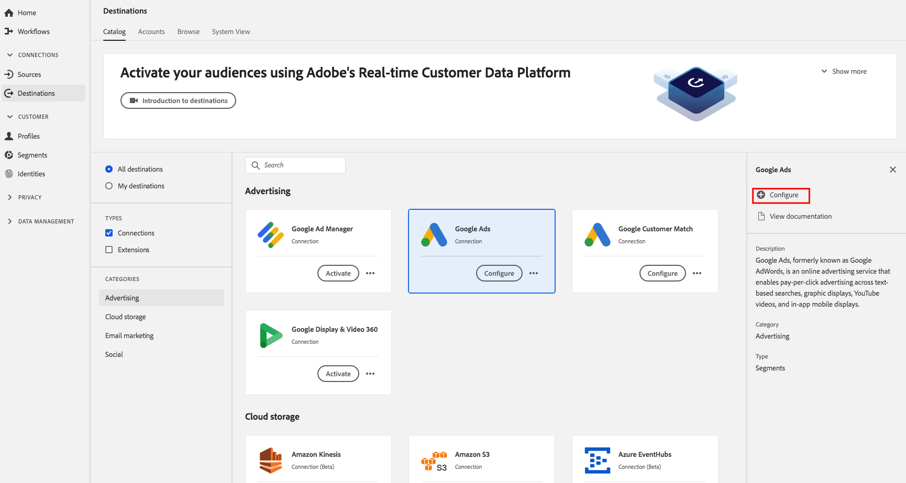

# [!DNL Google Ads] Bestemming

## Overzicht

[!DNL Google Ads], voorheen bekend als [!DNL Google AdWords], is een onlinereclame die bedrijven in staat stelt om per klik reclame te betalen voor zoekopdrachten op tekstbasis, grafische weergaven, [!DNL YouTube] video&#39;s en mobiele weergaven in de app.

## Doelspecificaties

Let op de volgende details die specifiek zijn voor [!DNL Google Ads] bestemmingen:

* U kunt de volgende [identiteiten](../../../identity-service/namespaces.md) naar [!DNL Google Ads] bestemmingen verzenden: Google-cookie-id, IDFA, GAID, Roku-id&#39;s, Microsoft-id&#39;s en Amazon Fire TV-id&#39;s.
* Geactiveerd publiek wordt programmatically gecreeerd op het [!DNL Google] platform.
* CDP in realtime bevat momenteel geen metrische waarde om succesvolle activering te valideren. Raadpleeg de tellingen van het publiek in Google om de integratie te valideren en inzicht te krijgen in doelgroepen.

>[!IMPORTANT]
>
>Als u uw eerste bestemming wilt maken met [!DNL Google Ads] en in het verleden (met Audience Manager of andere toepassingen) de functionaliteit [voor het synchroniseren van](https://experienceleague.adobe.com/docs/id-service/using/id-service-api/methods/idsync.html) id&#39;s niet hebt ingeschakeld in de Experience Cloud-id-service, neemt u contact op met Adobe Consulting of de klantenservice om id-syncs in te schakelen. Als u eerder Google-integraties in Audience Manager had ingesteld, worden de id-syncs die u hebt ingesteld, overgedragen naar Real-Time CDP.

### Exporttype {#export-type}

**Segmentexport** - u exporteert alle leden van een segment (publiek) naar de Google-bestemming.

## Vereisten

### Bestaande [!DNL Google Ads] account

>[!IMPORTANT]
>
> [!DNL Google] heeft nieuwe [!DNL Google Ads] cookieintegratie met derde verkopers vervangen. Voor het uitvoeren van de stappen van de lijst van gewenste personen in de volgende sectie, moet u bestaande integratie met hebben [!DNL Google Ads]. De aanbevolen aanpak voor het gebruik [!DNL Google Ads] is daarom het opzetten van een [!DNL Google Customer Match] integratie. Lees voor meer informatie over het maken van een [!DNL Google Customer Match] integratie de zelfstudie over het maken van een [[!DNL Google Customer Match]](./google-customer-match.md) verbinding.

### Lijst van gewenste personen

>[!NOTE]
>
>De lijst van gewenste personen is verplicht alvorens vestiging uw eerste [!DNL Google Ads] bestemming in real time CDP. Controleer of het hieronder beschreven lijst van gewenste personen-proces is voltooid door [!DNL Google] voordat u een doel maakt.

Voordat u de [!DNL Google Ads] bestemming maakt in Real-time CDP, moet u contact opnemen [!DNL Google] met de Adobe die wordt geplaatst in de lijst met toegestane gegevensproviders en met de account die wordt toegevoegd aan de lijst van gewenste personen. Neem contact op met [!DNL Google] en geef de volgende informatie op:

* **Account-id** : Dit is Adobe account-ID met [!DNL Google]. Neem contact op met de klantenservice van Adobe of uw Adobe om deze id te verkrijgen.
* **Klant-id** : Dit is Adobe-klant-id met [!DNL Google]. Neem contact op met de klantenservice van Adobe of uw Adobe om deze id te verkrijgen.
* Je accounttype: **AdWords**
* **Google AdWords-id** : Dit is je ID met [!DNL Google]. De id-indeling heeft doorgaans de notatie 123-456-7890.

## Doel configureren

Selecteer in **[!UICONTROL Verbindingen]** > **[!UICONTROL Doelen]** de optie [!DNL Google Ads]en selecteer **[!UICONTROL Configureren]**.

>[!NOTE]
>
>Als er al een verbinding met dit doel bestaat, ziet u een knop **[!UICONTROL Activeren]** op de doelkaart. Voor meer informatie over het verschil tussen **[!UICONTROL Activate]** en **[!UICONTROL Configure]**, verwijs naar de sectie van de [Catalogus](../../ui/destinations-workspace.md#catalog) van de documentatie van de bestemmingswerkruimte.

In de stap van de **Opstelling** van creeer bestemmingswerkschema, vul de [!UICONTROL BasisInformatie] voor de bestemming in.

* **[!UICONTROL Naam]**: Vul de voorkeursnaam voor dit doel in.
* **[!UICONTROL Omschrijving]**: Optioneel. U kunt bijvoorbeeld opgeven voor welke campagne u deze bestemming wilt gebruiken.
* **[!UICONTROL Accounttype]**: De enige beschikbare optie is AdvertentieWoorden.
* **[!UICONTROL Account-id]**: Vul je account-id in met [!DNL Google Ads]. De id-indeling heeft doorgaans de notatie 123-456-7890.
* **[!UICONTROL Geval]** voor gebruik bij het in de handel brengen: Gebruiksgevallen voor marketingdoeleinden geven de intentie aan waarvoor gegevens naar de bestemming worden geëxporteerd. U kunt kiezen uit door de Adobe gedefinieerde gebruiksgevallen voor marketingdoeleinden of u kunt uw eigen gebruiksscenario voor marketingdoeleinden maken. Voor meer informatie over het op de markt brengen van gebruiksgevallen, zie de [Governance van Gegevens in Echte tijd CDP](../../../rtcdp/privacy/data-governance-overview.md#destinations) pagina. Voor informatie over de individuele Adobe-bepaalde het in de handel brengen gebruiksgevallen, zie het overzicht [van het het gebruiksbeleid van](../../../data-governance/policies/overview.md#core-actions)Gegevens.

## Segmenten activeren om [!DNL Google Ads]

Voor instructies op hoe te om segmenten te activeren, zie [!DNL Google Ads]Gegevens aan Doelen activeren.

## Geëxporteerde gegevens

Controleer uw [!DNL Google Ads] account om te controleren of gegevens naar de [!DNL Google Ads] bestemming zijn geëxporteerd. Als de activering succesvol was, worden de soorten publiek in uw account ingevuld.