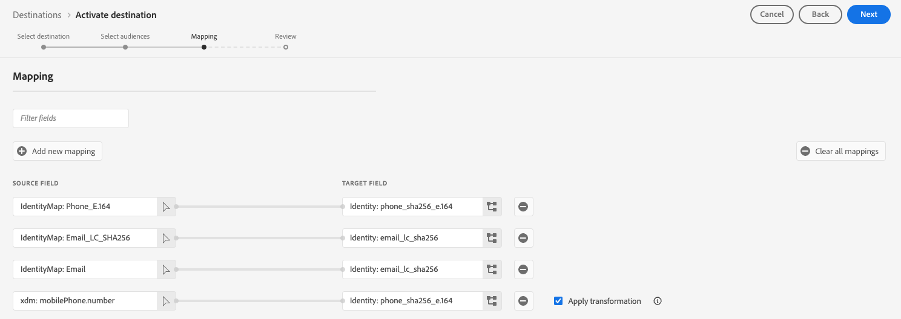

# [!DNL Google Customer Match + Display & Video 360] verbinding

Gebruik deze bestemming om uw op PII gebaseerde [[!DNL Google Customer Match] ](https://support.google.com/google-ads/answer/6379332?hl=en) lijsten van eerste partijen direct aan [!DNL Google Display & Video 360] eigenschappen zoals [!DNL Search], [!DNL YouTube], [!DNL Gmail], en [!DNL Google Display Network] te activeren.

Bepaalde door Google geïntegreerde derden, zoals Adobe Real-Time CDP, kunnen [!DNL Google Audience Partner API] gebruiken om [!DNL Customer Match] publiek rechtstreeks in de account van klanten [!DNL Display & Video 360] te maken.

Dankzij de nieuwe mogelijkheid om [!DNL Customer Matched] publiek in [!DNL Display & Video 360] te kunnen gebruiken, kunt u nu doelgroepen kiezen in een uitgevouwen rooster met inventarisbronnen.

>[!IMPORTANT]
>
>Deze bestemmingsconnector bevindt zich in de bètafase en is alleen beschikbaar voor geselecteerde klanten. Neem contact op met uw Adobe-vertegenwoordiger om toegang aan te vragen.

## Belangrijke kennisgeving over wijzigingen aan Google-bestemmingen in verband met geactualiseerde toestemmingsvereisten in de Europese Unie

>[!IMPORTANT]
>
> Google geeft veranderingen in de [ Adds API van Google ](https://developers.google.com/google-ads/api/docs/start), [ Overeenkomst van de Klant ](https://ads-developers.googleblog.com/2023/10/updates-to-customer-match-conversion.html) vrij, en [ Vertoning &amp; Video 360 API ](https://developers.google.com/display-video/api/guides/getting-started/overview) om de naleving en toestemmings-gerelateerde vereisten te steunen die onder de [ Wet van de Markten ](https://digital-markets-act.ec.europa.eu/index_nl) (DMA) worden bepaald in de Europese Unie ([ EU het Beleid van de Toestemming van de Gebruiker ](https://www.google.com/about/company/user-consent-policy/)). De handhaving van deze wijzigingen in de toestemmingsvereisten is vanaf 6 maart 2024 van kracht.
> 
>Om zich aan het EU-beleid inzake instemming van gebruikers te houden en door te gaan met het opstellen van publiekslijsten voor gebruikers in de Europese Economische Ruimte (EER), moeten adverteerders en partners ervoor zorgen dat zij toestemming van de eindgebruiker geven bij het uploaden van publieksgegevens. Als Google-partner beschikt Adobe over de benodigde tools om te voldoen aan deze toestemmingsvereisten in het kader van de DMA in de Europese Unie.
> 
>De klanten die de Privacy &amp; het Schild van de Veiligheid van Adobe hebben gekocht en het beleid van de a [ toestemming ](../../../data-governance/enforcement/auto-enforcement.md#consent-policy-evaluation) gevormd om niet-goedgekeurde profielen uit te filteren hoeven geen actie te ondernemen.
> 
>De klanten die geen de Privacy &amp; het Schild van de Veiligheid van Adobe hebben gekocht moeten de [&#128279;](../../../segmentation/home.md#segment-definitions) mogelijkheden van de segmentdefinitie  binnen [ de Bouwer van het Segment ](../../../segmentation/ui/segment-builder.md) aan filter uit niet-goedgekeurde profielen gebruiken, om de bestaande bestemmingen van Real-Time CDP Google zonder onderbreking te blijven gebruiken.

## Wanneer gebruikt u deze bestemming

Verschillende integraties met Google zijn beschikbaar in de lijst met bestemmingen en het kan lastig zijn om te begrijpen wanneer u elk van de beschikbare Google-bestemmingen gebruikt. Houd rekening met de verschillende gebruiksgevallen door de informatie in de onderstaande tabel te lezen:

| [ Klantovereenkomst van Google ](/help/destinations/catalog/advertising/google-customer-match.md) | [ de Vertoning van Google &amp; Video 360 ](/help/destinations/catalog/advertising/google-dv360.md) | [!DNL Google Customer Match] + [!DNL Display & Video 360] (deze connector) |
|---------|----------|---------|
| Exporteer uw op PII gebaseerde publiek en ga naar de voorraad die beschikbaar is in [!DNL Google Customer Match] . | Bereik een publiek dat op cookies is gebaseerd en dat via [!DNL Google Display & Video 360] beschikbaar is, op Google-eigendommen zoals Youtube en [!DNL Search] en verder. | Maak een publiek met PII&#39;s in [!DNL Google Customer Match] en bereik dit publiek via de voorraad die beschikbaar is in [!DNL Google Display & Video 360] , alleen op eigenschappen die eigendom zijn van en worden gebruikt door Google. |

## Gebruiksscenario’s {#use-cases}

Om u beter te helpen begrijpen hoe en wanneer om deze bestemming te gebruiken, zijn hier voorbeelden van gebruiksgevallen die de klanten van Adobe Experience Platform door deze eigenschap kunnen oplossen.

### Hoofdletters gebruiken #1

Een atletisch merkje wil bestaande klanten bereiken via [!DNL Google Search] en [!DNL Google Shopping] om aanbiedingen en objecten aan te passen op basis van hun eerdere aankopen en browsergeschiedenis. Het merk apparel kan e-mailadressen van hun eigen CRM aan Experience Platform opnemen, en publiek van hun eigen off-line gegevens bouwen. Vervolgens kunnen ze deze doelgroepen naar de [!DNL Google Customer Match + Display & Video 360] -bestemming sturen voor gebruik in [!DNL Google Display & Video 360] -eigenschappen zoals [!DNL Search] , [!DNL YouTube] , [!DNL Gmail] en [!DNL Google Display Network] .

### Hoofdletters gebruiken #2

Een vooraanstaand technologiebedrijf heeft een nieuwe telefoon gelanceerd. Om dit nieuwe telefoonmodel te bevorderen, kijken zij om bewustzijn van de nieuwe eigenschappen en de functionaliteit van de telefoon aan klanten te drijven die vorige modellen van hun telefoons bezitten.

Om de release te promoten, uploaden ze e-mailadressen vanuit hun CRM-database naar Experience Platform, waarbij ze de e-mailadressen als id&#39;s gebruiken. Het publiek wordt gecreeerd gebaseerd op klanten die oudere telefoonmodellen bezitten. Vervolgens wordt het publiek verzonden naar [!DNL Google Customer Match] , zodat het bedrijf zich kan richten op huidige klanten, klanten die eigenaar zijn van oudere telefoonmodellen en vergelijkbare klanten op [!DNL Google Display & Video 360] -eigenschappen zoals [!DNL Search] , [!DNL YouTube] , [!DNL Gmail] en [!DNL Google Display Network] .

## Ondersteunde identiteiten {#supported-identities}

[!DNL Google Customer Match] ondersteunt de activering van identiteiten die in de onderstaande tabel worden beschreven. Leer meer over [ identiteiten ](/help/identity-service/features/namespaces.md).

| Doelidentiteit | Beschrijving | Overwegingen |
|---|---|---|
| GAID | GOOGLE ADVERTISING ID | Selecteer de GAID doelidentiteit wanneer uw bronidentiteit een GAID-naamruimte is. |
| IDFA | Apple-id voor adverteerders | Selecteer de IDFA doelidentiteit wanneer uw bronidentiteit een IDFA namespace is. |
| phone_sha256_e.164 | Telefoonnummers in E164-indeling, gehasht met het SHA256-algoritme | Adobe Experience Platform biedt ondersteuning voor zowel platte tekst- als SHA256-telefoonnummers. Volg de instructies in de [ passende vereisten van identiteitskaart ](#id-matching-requirements-id-matching-requirements) sectie en gebruik aangewezen namespaces voor gewone teksten en gehakt telefoonaantallen, respectievelijk. Wanneer het bronveld hashingkenmerken bevat, schakelt u de optie **[!UICONTROL Apply transformation]** in om de gegevens automatisch te laten hashen bij activering door [!DNL Experience Platform] . |
| email_lc_sha256 | E-mailadressen die met het algoritme SHA256 worden gehasht | Adobe Experience Platform biedt ondersteuning voor zowel platte tekst- als SHA256-e-mailadressen met hashing. Volg de instructies in de [ passende vereisten van identiteitskaart ](#id-matching-requirements-id-matching-requirements) sectie en gebruik aangewezen namespaces voor gewone teksten en gehakt e-mailadressen, respectievelijk. Wanneer het bronveld hashingkenmerken bevat, schakelt u de optie **[!UICONTROL Apply transformation]** in om de gegevens automatisch te laten hashen bij activering door [!DNL Experience Platform] . |

{style="table-layout:auto"}

<!-- not supported in beta

|GAID|Google Advertising ID|Select this target identity when your source identity is a GAID namespace.|
|IDFA|Apple ID for Advertisers|Select this target identity when your source identity is an IDFA namespace.|
|user_id|Custom user IDs|Select this target identity when your source identity is a custom namespace.| 

-->

## Ondersteunde doelgroepen {#supported-audiences}

In deze sectie wordt beschreven welke soorten publiek u naar dit doel kunt exporteren.

| Oorsprong publiek | Ondersteund | Beschrijving |
|---------|----------|----------|
| [!DNL Segmentation Service] | ✓ | Het publiek produceerde door de Dienst van de Segmentatie van Experience Platform [&#128279;](../../../segmentation/home.md). |
| Aangepaste uploads | ✓ | Het publiek [ ingevoerde ](../../../segmentation/ui/audience-portal.md#import-audience) in Experience Platform van Csv- dossiers. |

{style="table-layout:auto"}

## Type en frequentie exporteren {#export-type-frequency}

Raadpleeg de onderstaande tabel voor informatie over het exporttype en de exportfrequentie van de bestemming.

| Item | Type | Notities |
---------|----------|---------|
| Exporttype | **[!UICONTROL Audience export]** | U exporteert alle leden van een publiek met de id&#39;s (naam, telefoonnummer en andere) die in de [!DNL Google Customer Match] -bestemming worden gebruikt. |
| Exportfrequentie | **[!UICONTROL Streaming]** | Streaming doelen zijn &quot;altijd aan&quot; API-verbindingen. Zodra een profiel in Experience Platform wordt bijgewerkt dat op publieksevaluatie wordt gebaseerd, verzendt de schakelaar de update stroomafwaarts naar het bestemmingsplatform. Lees meer over [ het stromen bestemmingen ](/help/destinations/destination-types.md#streaming-destinations). |

{style="table-layout:auto"}

## [!DNL Google Customer Match] -accountvoorwaarden {#google-account-prerequisites}

Alvorens vestiging een [!DNL Google Customer Match] bestemming in Experience Platform, zorg ervoor u leest en aan het beleid van Google hanteert voor het gebruiken van [!DNL Customer Match], die in de [ de steundocumentatie van Google ](https://support.google.com/google-ads/answer/6299717) wordt geschetst.

Controleer vervolgens of uw [!DNL Google] -account is geconfigureerd voor een machtigingsniveau van [!DNL Standard] of hoger. Zie de [ documentatie van Ads van Google ](https://support.google.com/google-ads/answer/9978556?visit_id=637611563637058259-4176462731&amp;rd=1) voor details.

### Lijst van gewenste personen {#allowlist}

Alvorens de [!DNL Google Customer Match] bestemming in Experience Platform te creëren, zorg ervoor dat uw [!DNL Google Ads] rekening met het [[!DNL Google Customer Match]  beleid ](https://support.google.com/google-ads/answer/6299717/customer-match-policy) voldoet.

Klanten met compatibele accounts worden automatisch gevoegd op lijst van gewenste personen door Google.

## Vereisten voor id-afstemming {#id-matching-requirements}

[!DNL Google] vereist dat er geen PII&#39;s (Personal Identified Information) worden verzonden. Daarom moet het publiek dat aan [!DNL Google Customer Match] wordt geactiveerd van *gehakt* herkenningstekens, zoals gehakt e-mailadressen of telefoonaantallen worden afgevinkt.

Afhankelijk van het type id&#39;s dat u in Adobe Experience Platform invoert, moet u aan de desbetreffende vereisten voldoen.

### Vereisten voor hashing voor telefoonnummers {#phone-number-hashing-requirements}

Er zijn twee methoden om telefoonnummers te activeren in [!DNL Google Customer Match] :

* **Ingesting ruwe telefoonaantallen**: u kunt ruwe telefoonaantallen in het [!DNL E.164] formaat in [!DNL Experience Platform] opnemen, en zij worden automatisch gehakt op activering. Als u deze optie kiest, moet u uw onbewerkte telefoonnummers altijd in de naamruimte `Phone_E.164` invoeren.
* **het Ingeesten hashed telefoonaantallen**: u kunt uw telefoonaantallen vóór opname in [!DNL Experience Platform] pre-hash. Als u deze optie kiest, moet u uw hashed-telefoonnummers altijd invoeren in de naamruimte `PHONE_SHA256_E.164` .

>[!NOTE]
>
>Telefoonnummers die in de naamruimte `Phone` worden ingevoerd, kunnen niet worden geactiveerd naar het doel van [!DNL Google Customer Match + DV360] .

### E-mailhashingvereisten {#hashing-requirements}

U kunt e-mailadressen hashen alvorens hen in Adobe Experience Platform op te nemen, of e-mailadressen gebruiken duidelijk in Experience Platform, en [!DNL Experience Platform] hen hebben geknoeid op activering.

Raadpleeg de volgende secties in de documentatie bij Google voor meer informatie over de hashingvereisten voor Google en andere activeringsbeperkingen:

* [[!DNL Customer Match]  met e-mailadres, adres, of gebruiker - identiteitskaart ](https://developers.google.com/google-ads/api/docs/remarketing/audience-types/customer-match#customer_match_with_email_address_address_or_user_id)
* [[!DNL Customer Match]  overwegingen ](https://developers.google.com/google-ads/api/docs/remarketing/audience-types/customer-match#customer_match_considerations)
* [[!DNL Customer Match]  met telefoonaantal ](https://developers.google.com/google-ads/api/docs/remarketing/audience-types/customer-match#customer_match_with_phone_number)
* [[!DNL Customer Match]  met mobiele apparaat IDs ](https://developers.google.com/google-ads/api/docs/remarketing/audience-types/customer-match#customer_match_with_mobile_device_ids)

Om over het opnemen van e-mailadressen in Experience Platform te leren, zie het [ overzicht van de partijopname ](../../../ingestion/batch-ingestion/overview.md) en [ het stromen ingestitieoverzicht ](../../../ingestion/streaming-ingestion/overview.md).

Als u ervoor kiest om de e-mailadressen zelf te hashen, moet u voldoen aan de Google-vereisten die in de bovenstaande koppelingen worden beschreven.

<!-- ### Using custom namespaces {#custom-namespaces}

Before you can use the `User_ID` namespace to send data to Google, make sure you synchronize your own identifiers using [!DNL gTag]. Refer to the [Google official documentation](https://support.google.com/google-ads/answer/9199250) for detailed information. -->

<!-- Data from unhashed namespaces is automatically hashed by [!DNL Experience Platform] upon activation.

Attribute source data is not automatically hashed. When your source field contains unhashed attributes, check the **[!UICONTROL Apply transformation]** option, to have [!DNL Experience Platform] automatically hash the data on activation.
 -->

<!-- ## Configure destination - video walkthrough {#video}

The video below demonstrates the steps to configure a [!DNL Google Customer Match] destination and activate audiences. The steps are also laid out sequentially in the next sections.

>[!VIDEO](https://video.tv.adobe.com/v/332599/?quality=12&learn=on&captions=eng) -->

## Verbinden met de bestemming {#connect}

>[!IMPORTANT]
> 
>Om met de bestemming te verbinden, hebt u **[!UICONTROL View Destinations]** en **[!UICONTROL Manage Destinations]** [ toegangsbeheertoestemmingen ](/help/access-control/home.md#permissions) nodig. Lees het [ overzicht van de toegangscontrole ](/help/access-control/ui/overview.md) of contacteer uw productbeheerder om de vereiste toestemmingen te verkrijgen.

Om met deze bestemming te verbinden, volg de stappen die in het [ leerprogramma van de bestemmingsconfiguratie ](../../ui/connect-destination.md) worden beschreven.

### Verbindingsparameters {#parameters}

Terwijl [ vestiging ](../../ui/connect-destination.md) deze bestemming, u de volgende informatie moet verstrekken:

* **[!UICONTROL Name]**: geef een naam op voor deze doelverbinding
* **[!UICONTROL Description]**: geef een beschrijving voor deze doelverbinding
* **[!UICONTROL Account ID]**: uw [ Google voegt klantenidentiteitskaart ](https://support.google.com/google-ads/answer/1704344?hl=en) toe. De indeling van de id is xxx-xxxx. Als u [!DNL Google Ads Manager Account (My Client Center)] gebruikt, gebruik dan niet uw account-id voor Manager. Gebruik in plaats hiervan [ Google Adds klant ID ](https://support.google.com/google-ads/answer/1704344?hl=en).
* **[!UICONTROL Account type]** : je Google-accounttype. Selecteer een optie, afhankelijk van het type advertentieaccount bij Google:
   * **[!UICONTROL Display Video Partner]**
   * **[!UICONTROL Display Video Advertiser]**

### Waarschuwingen inschakelen {#enable-alerts}

U kunt alarm toelaten om berichten over de status van dataflow aan uw bestemming te ontvangen. Selecteer een waarschuwing in de lijst om u te abonneren op meldingen over de status van uw gegevensstroom. Voor meer informatie over alarm, zie de gids bij [ het intekenen aan bestemmingsalarm gebruikend UI ](../../ui/alerts.md).

Wanneer u klaar bent met het opgeven van details voor uw doelverbinding, selecteert u **[!UICONTROL Next]** .

## Soorten publiek naar dit doel activeren {#activate}

>[!IMPORTANT]
> 
>* Om gegevens te activeren, hebt u **[!UICONTROL View Destinations]**, **[!UICONTROL Activate Destinations]**, **[!UICONTROL View Profiles]**, en **[!UICONTROL View Segments]** [ toegangsbeheertoestemmingen ](/help/access-control/home.md#permissions) nodig. Lees het [ overzicht van de toegangscontrole ](/help/access-control/ui/overview.md) of contacteer uw productbeheerder om de vereiste toestemmingen te verkrijgen.
>* Om *identiteiten* naar bestemmingen uit te voeren, hebt u de **[!UICONTROL View Identity Graph]** [ toegangsbeheertoestemming ](/help/access-control/home.md#permissions) nodig.   {width="100" zoomable="yes"}

Zie [ publieksgegevens aan het stromen publiek de uitvoerbestemmingen ](../../ui/activate-segment-streaming-destinations.md) voor instructies op het activeren van publiek aan deze bestemming activeren.

<!-- In the **[!UICONTROL Segment schedule]** step, you must provide the [!UICONTROL App ID] when sending [!DNL IDFA] or [!DNL GAID] audiences to [!DNL Google Customer Match].

For details on how to find the [!DNL App ID], refer to the [Google official documentation](https://developers.google.com/adwords/api/docs/reference/v201809/AdwordsUserListService.CrmBasedUserList#appid) or ask your Google representative. -->

### Voorbeeld van toewijzing: publieksgegevens activeren in [!DNL Google Customer Match + Display & Video 360] {#example-gcm}

Dit is een voorbeeld van correcte identiteitstoewijzing wanneer het activeren van publieksgegevens in [!DNL Google Customer Match + Display & Video 360].

Bronvelden selecteren:

* Selecteer de naamruimte `Email` als bronidentiteit als de e-mailadressen die u gebruikt geen hashing zijn.
* Selecteer `Email_LC_SHA256` namespace als bronidentiteit als u klant e-mailadressen op gegevensinvoer in [!DNL Experience Platform], volgens [!DNL Google Customer Match] [ e-mailhashing vereisten ](#hashing-requirements) hashing.
* Selecteer de naamruimte `PHONE_E.164` als bronidentiteit als uw gegevens uit niet-gehashte telefoonnummers bestaan. [!DNL Experience Platform] hasht de telefoonnummers om te voldoen aan [!DNL Google Customer Match] -vereisten.
* Selecteer `Phone_SHA256_E.164` namespace als bronidentiteit als u telefoonaantallen op gegevensinvoer in [!DNL Experience Platform] hashing, volgens [!DNL Facebook] [ de hashing vereisten van het telefoonaantal ](#phone-number-hashing-requirements).

Doelvelden selecteren:

* Selecteer de naamruimte `Email_LC_SHA256` als doelidentiteit wanneer de bronnaamruimten `Email` of `Email_LC_SHA256` zijn.
* Selecteer de naamruimte `Phone_SHA256_E.164` als doelidentiteit wanneer de bronnaamruimten `PHONE_E.164` of `Phone_SHA256_E.164` zijn.

Gegevens uit naamruimten zonder hashing worden automatisch gehasht door [!DNL Experience Platform] bij activering.

Kenmerkbrongegevens worden niet automatisch gehasht. Wanneer het bronveld hashingkenmerken bevat, schakelt u de optie **[!UICONTROL Apply transformation]** in om de gegevens automatisch te laten hashen bij activering door [!DNL Experience Platform] .

## Doel van monitor {#monitor-destination}

Na het verbinden met de bestemming en het vestigen van een bestemmingsdataflow, kunt u de [ controlefunctionaliteit ](/help/dataflows/ui/monitor-destinations.md) in Real-Time CDP gebruiken om uitgebreide informatie over de profielverslagen te krijgen die aan uw bestemming in elke dataflow in werking worden gesteld.

De monitoringinformatie voor de [!DNL Google Customer Match + Display & Video 360] -verbinding bevat informatie op publieksniveau over geactiveerde, uitgesloten en mislukte identiteiten in elke dataflow en dataflow die worden uitgevoerd. [Lees meer](/help/dataflows/ui/monitor-destinations.md#segment-level-view) over de nieuwe functionaliteit.

## Controleren of publieksactivering is gelukt {#verify-activation}

Schakel over naar uw **[!UICONTROL Google Ads]** -account nadat u de activeringsstroom hebt voltooid. Het geactiveerde publiek wordt in uw Google-account weergegeven als klantenlijsten. Afhankelijk van de grootte van uw publiek, bevolken sommige soorten publiek alleen als er meer dan 1000 actieve gebruikers zijn om te dienen. Vind verdere informatie in de [ documentatie van de Partner van het publiek van Google ](https://developers.google.com/audience-partner/api/docs/customer-match/get-started#verify-list). U moet Google om toegang vragen tot de documentatie in de koppeling.

## Datagovernance

Sommige bestemmingen in Experience Platform hebben bepaalde regels en verplichtingen voor gegevens die naar het bestemmingsplatform worden verzonden of van het bestemmingsplatform worden ontvangen. U bent verantwoordelijk voor het begrijpen van de beperkingen en verplichtingen van uw gegevens en hoe u die gegevens gebruikt in Adobe Experience Platform en het doelplatform. Adobe Experience Platform biedt tools voor gegevensbeheer om u te helpen bij het beheren van een aantal van deze gegevensgebruiksverplichtingen. [ leer meer ](../../../data-governance/labels/overview.md) over de hulpmiddelen en het beleid van het gegevensbeheer.

## Problemen oplossen {#troubleshooting}

### 400 Onjuist aanvraagfoutbericht {#bad-request}

Wanneer het vormen van deze bestemming, kunt u de volgende fout ontvangen:

`{"message":"Google Customer Match Error: OperationAccessDenied.ACTION_NOT_PERMITTED","code":"400 BAD_REQUEST"}`

Deze fout komt voor wanneer de klantenrekeningen niet aan de [ eerste vereisten ](#google-account-prerequisites) voldoen. Neem contact op met Google om dit probleem op te lossen en zorg ervoor dat uw account op de lijst met toegestane items staat en geconfigureerd is voor een machtigingsniveau van [!DNL Standard] of hoger. Zie de [ documentatie van Ads van Google ](https://support.google.com/google-ads/answer/9978556?visit_id=637611563637058259-4176462731&amp;rd=1) voor details.
