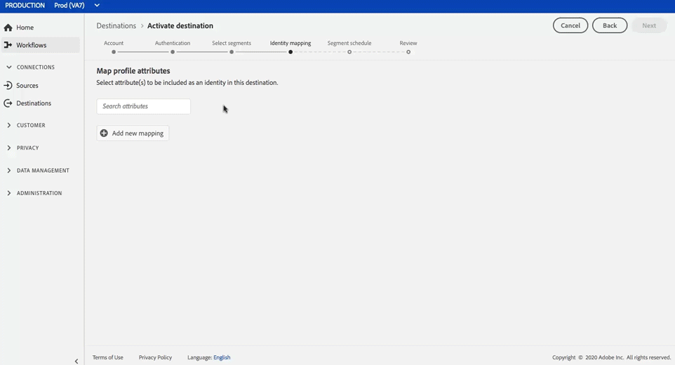

# [!DNL Google Customer Match] verbinding

>[!IMPORTANT]
>
>We migreren momenteel klanten naar de nieuwe versie van deze bestemming.
>
> De instructies in dit artikel zijn van toepassing op beide versies, met de volgende opmerking: terwijl deze migratie bezig is, zult u slechts de huidige versie van [!DNL Google Customer Match] bestemming in het gebruikersinterface zien, waar u [!UICONTROL EMAIL] en [!UICONTROL EMAIL_LC_SHA_256] identiteiten voor activering kunt slechts gebruiken.

[Met Google Customer ](https://support.google.com/google-ads/answer/6379332?hl=en) Matchlets kunt u uw online- en offline-gegevens gebruiken om uw klanten te bereiken en opnieuw contact op te nemen met andere klanten over de eigendommen en gebruiksmogelijkheden van Google, zoals:  [!DNL Search],  [!DNL Shopping],  [!DNL Gmail]en  [!DNL YouTube].

## Gevallen gebruiken

Om u beter te helpen begrijpen hoe en wanneer u [!DNL Google Customer Match] bestemming zou moeten gebruiken, zijn hier voorbeelden van gebruiksgevallen die de klanten van het Platform van Gegevens van de Klant in real time kunnen oplossen door deze eigenschap te gebruiken.

### Hoofdletters en kleine letters gebruiken 1

Een atletisch merkje wil bestaande klanten bereiken via [!DNL Google Search] en [!DNL Google Shopping] om aanbiedingen en objecten aan te passen op basis van hun eerdere aankopen en browsergeschiedenis. Het merkteken kan e-mailadressen van hun eigen CRM aan In real time CDP opnemen, segmenten van hun eigen off-line gegevens bouwen, en deze segmenten naar [!DNL Google Customer Match] verzenden om over [!DNL Search] en [!DNL Shopping] te worden gebruikt, die hun reclame-uitgaven optimaliseren.

### Hoofdletters en kleine letters gebruiken 2

Een vooraanstaand technologiebedrijf heeft zojuist een nieuwe telefoon uitgebracht. In een inspanning om dit nieuwe telefoonmodel te bevorderen, kijken zij om bewustzijn van de nieuwe eigenschappen en de functionaliteit van de telefoon aan klanten te drijven die vorige modellen van hun telefoons bezitten.

Om de versie te bevorderen, uploaden zij e-mailadressen van hun gegevensbestand van CRM in CDP In real time, gebruikend de e-mailadressen als herkenningstekens. Segmenten worden gemaakt op basis van klanten die eigenaar zijn van oudere telefoonmodellen en worden verzonden naar [!DNL Google Customer Match] zodat zij zich kunnen richten op huidige klanten, klanten die eigenaar zijn van oudere telefoonmodellen, en vergelijkbare klanten op [!DNL YouTube].

## Doelspecificaties {#destination-specs}

### Gegevensbeheer voor [!DNL Google Customer Match] doelen {#data-governance}

De bestemmingen in real time CDP kunnen bepaalde regels en verplichtingen voor gegevens hebben die naar, of van, het bestemmingsplatform worden verzonden ontvangen. U bent verantwoordelijk voor het begrijpen van de beperkingen en verplichtingen van uw gegevens en hoe u die gegevens gebruikt in Adobe Experience Platform en het doelplatform. Adobe Experience Platform biedt tools voor gegevensbeheer om u te helpen bij het beheren van een aantal van deze gegevensgebruiksverplichtingen. [Meer informatie ](../../..//data-governance/labels/overview.md) over tools en beleid voor gegevensbeheer.

### Type en identiteit exporteren {#export-type}

**Segmentexport** : u exporteert alle leden van een segment (publiek) met de id&#39;s (naam, telefoonnummer, enzovoort) gebruikt in de bestemming [!DNL Google Customer Match].

**Identiteiten**  - u kunt onbewerkte of gehashte e-mails gebruiken als klant-id&#39;s in Google

### [!DNL Google Customer Match] accountvereisten  {#google-account-prerequisites}

Voordat u een [!DNL Google Customer Match]-bestemming instelt in Real-time CDP, moet u het Google-beleid voor het gebruik van [!DNL Customer Match] lezen en volgen. Dit wordt beschreven in de [documentatie voor Google-ondersteuning](https://support.google.com/google-ads/answer/6299717).

### Lijst van gewenste personen {#allowlist}

>[!NOTE]
>
>Het is verplicht om aan de lijst van gewenste personen van Google vóór vestiging uw eerste [!DNL Google Customer Match] bestemming in real time CDP toe te voegen. Controleer of Google het hieronder beschreven lijst van gewenste personen-proces heeft voltooid voordat u een bestemming maakt.

Voordat u de [!DNL Google Customer Match]-bestemming maakt in Real-time CDP, dient u contact op te nemen met Google en de instructies van de lijst van gewenste personen in [Customer Match partners gebruiken om uw gegevens te uploaden](https://support.google.com/google-ads/answer/7361372?hl=en&amp;ref_topic=6296507) in de Google-documentatie.

Bovendien is er een tweede Google-lijst van gewenste personen waaraan u uw account moet toevoegen als u gegevens wilt uploaden met de [Gebruikersnaam](https://developers.google.com/adwords/api/docs/guides/remarketing#customer_match_with_email_address_address_or_user_id) van Google. Neem contact op met uw Google-accountmanager om te controleren of u aan de lijsten van gewenste personen bent toegevoegd.

### Overeenkomende vereisten {#id-matching-requirements}

[!DNL Google] vereist dat er geen duidelijk identificeerbare informatie (PII) wordt verstrekt. Daarom kan het publiek dat aan [!DNL Google Customer Match] wordt geactiveerd *hashed* herkenningstekens, zoals e-mailadressen of telefoonaantallen worden afgevinkt.

Afhankelijk van het type id&#39;s dat u in Adobe Experience Platform invoert, moet u aan de desbetreffende vereisten voldoen.

#### Vereisten voor hashing voor telefoonnummers {#phone-number-hashing-requirements}

Er zijn twee methodes om telefoonaantallen in [!DNL Google Customer Match] te activeren:

* **Onbewerkte telefoonnummers** worden geïnstalleerd: u kunt onbewerkte telefoonnummers in de  [!DNL E.164] notatie invoeren  [!DNL Platform], die na activering automatisch worden gehasht. Als u deze optie kiest, zorg ervoor om uw ruwe telefoonaantallen in `Phone_E.164` namespace altijd in te nemen.
* **Hashed-telefoonnummers** invoegen: U kunt uw telefoonaantallen pre-hash alvorens in te gaan  [!DNL Platform]. Als u deze optie kiest, zorg ervoor om uw gehakt telefoonaantallen in `PHONE_SHA256_E.164` namespace altijd in te nemen.

>[!NOTE]
>
>Telefoonnummers die worden ingevoerd in de naamruimte `Phone` kunnen niet worden geactiveerd in [!DNL Google Customer Match].

#### Vereisten voor e-mailhashing {#hashing-requirements}

U kunt ervoor kiezen e-mailadressen te hashen alvorens hen in Adobe Experience Platform op te nemen, of u kunt verkiezen om met e-mailadressen in duidelijk Experience Platform te werken en onze algoritme te hebben hen op activering hakt.

Raadpleeg de volgende secties in de documentatie van Google voor meer informatie over de hashing-vereisten van Google en andere activeringsbeperkingen:

* [[!DNL Customer Match] met e-mailadres, adres of gebruikersnaam](https://developers.google.com/adwords/api/docs/guides/remarketing#customer_match_with_email_address_address_or_user_id)
* [[!DNL Customer Match] overwegingen](https://developers.google.com/adwords/api/docs/guides/remarketing#customer_match_considerations)
* [Klanten komen overeen met telefoonnummer](https://developers.google.com/adwords/api/docs/guides/remarketing#customer_match_with_phone_number)
* [Klanten komen overeen met mobiele apparaat-id&#39;s](https://developers.google.com/adwords/api/docs/guides/remarketing#customer_match_with_mobile_device_ids)

Als u meer wilt weten over het invoeren van e-mailadressen in Experience Platform, raadpleegt u het [batchoverzicht](../../../ingestion/batch-ingestion/overview.md) en het [streamingoverzicht](../../../ingestion/streaming-ingestion/overview.md).

Als u ervoor kiest om de e-mailadressen zelf te hashen, moet u voldoen aan de vereisten van Google, zoals beschreven in de koppelingen hierboven.

#### Aangepaste naamruimten gebruiken {#custom-namespaces}

Voordat u de naamruimte `User_ID` kunt gebruiken om gegevens naar Google te verzenden, moet u uw eigen id&#39;s eerst synchroniseren met [!DNL gTag]. Zie de [officiële documentatie](https://support.google.com/google-ads/answer/9199250) voor gedetailleerde informatie.

<!-- Data from unhashed namespaces is automatically hashed by [!DNL Platform] upon activation.

Attribute source data is not automatically hashed. When your source field contains unhashed attributes, check the **[!UICONTROL Apply transformation]** option, to have [!DNL Platform] automatically hash the data on activation.
 -->

## Verbinden met doel {#connect-destination}

Blader in **[!UICONTROL Doelen]** > **[!UICONTROL Catalogus]** naar de categorie **[!UICONTROL Advertising]**. Selecteer [!DNL Google Customer Match], dan uitgezocht **[!UICONTROL vorm]**.

>[!NOTE]
>
>Als er al een verbinding met dit doel bestaat, kunt u een **[!UICONTROL knop Activeer]** op de doelkaart zien. Voor meer informatie over het verschil tussen **[!UICONTROL Activate]** en **[!UICONTROL Configure]**, verwijs naar [Catalog](../../ui/destinations-workspace.md#catalog) sectie van de documentatie van de bestemmingswerkruimte.

Als u in de stap **Account** eerder een verbinding met uw [!DNL Google Customer Match]-doel hebt ingesteld, selecteert u **[!UICONTROL Bestaande account]** en selecteert u de bestaande verbinding. U kunt ook **[!UICONTROL Nieuwe account]** selecteren om een nieuwe verbinding in te stellen met [!DNL Google Customer Match]. Selecteer **[!UICONTROL Verbinding maken met doel]** om u aan te melden en Adobe Experience Cloud te verbinden met uw [!DNL Google Ad]-account.

>[!NOTE]
>
>CDP in real time steunt geloofsbevestiging in het authentificatieproces en toont een foutenmelding als u onjuiste geloofsbrieven aan uw [!DNL Google Ad] rekening invoert. Dit zorgt ervoor dat u de werkstroom niet met onjuiste geloofsbrieven voltooit.

Nadat uw referenties zijn bevestigd en Adobe Experience Cloud is verbonden met uw Google-account, kunt u **[!UICONTROL Next]** selecteren om door te gaan naar de stap **[!UICONTROL Setup]**.

Voer in de stap **[!UICONTROL Verificatie]** een [!UICONTROL Naam] en een [!UICONTROL Beschrijving] in voor uw activeringsstroom en vul de [!UICONTROL Account ID] in op Google.

Ook in deze stap, kunt u om het even welke **[!UICONTROL Handeling van de Marketing]** selecteren die op deze bestemming zou moeten van toepassing zijn. Marketingsacties geven de intentie aan waarvoor gegevens naar de bestemming worden geëxporteerd. U kunt kiezen uit door Adobe gedefinieerde marketingacties of u kunt uw eigen marketingactie maken. Voor meer informatie over marketing acties, zie [De Governance van Gegevens in Echt - tijd CDP](../../../rtcdp/privacy/data-governance-overview.md#destinations) pagina. Zie [Overzicht van beleidsregels voor gegevensgebruik](../../../data-governance/policies/overview.md#core-actions) voor informatie over de afzonderlijke door Adobe gedefinieerde marketingacties.

Selecteer **[!UICONTROL Doel maken]** nadat u de bovenstaande velden hebt ingevuld.

>[!IMPORTANT]
>
> * De marketingactie **[!UICONTROL Combineren met PII]** is standaard geselecteerd voor het doel [!DNL Google Customer Match] en kan niet worden verwijderd.
> * Voor [!DNL Google Customer Match] doelen. **[!UICONTROL Account-id]** is uw client-id bij Google. De indeling van de id is xxx-xxx-xxxx.

Uw doel is nu gemaakt. U kunt **[!UICONTROL Opslaan en afsluiten]** selecteren als u segmenten later wilt activeren of u kunt **[!UICONTROL Volgende]** selecteren om door te gaan met de workflow en segmenten te selecteren om te activeren. In beide gevallen, zie de volgende sectie, [Activate segmenten aan  [!DNL Google Customer Match]](#activate-segments), voor de rest van het werkschema.

## Segmenten activeren naar [!DNL Google Customer Match] {#activate-segments}

Zie [Gegevens naar doelen activeren](../../ui/activate-destinations.md) voor instructies over het activeren van segmenten naar [!DNL Google Customer Match].

In **[!UICONTROL Segmentprogramma]** stap, moet u [!UICONTROL App ID] verstrekken wanneer het verzenden van [!DNL IDFA] of [!DNL GAID] segmenten naar [!DNL Google Customer Match].

Raadpleeg de [officiële documentatie](https://developers.google.com/adwords/api/docs/reference/v201809/AdwordsUserListService.CrmBasedUserList#appid) voor meer informatie over het zoeken naar de [!DNL App ID].

<!-- 
To activate segments to [!DNL Google Customer Match], follow the steps below: 

In **[!UICONTROL Destinations > Browse]**, select the [!DNL Google Customer Match] destination where you want to activate your segments.

Click the name of the destination. This takes you to the Activate flow.

Note that if an activation flow already exists for a destination, you can see the segments that are currently being sent to the destination. Select **[!UICONTROL Edit activation]** in the right rail and follow the steps below to modify the activation details.

Select **[!UICONTROL Activate]**. In the **[!UICONTROL Activate destination]** workflow, on the **[!UICONTROL Select Segments]** page, select which segments to send to [!DNL Google Customer Match].

In the **[!UICONTROL Identity mapping]** step, select which attributes to be included as an identity in this destination. Select **[!UICONTROL Add new mapping]** and browse your schema, select email and/or hashed email, and map them to the corresponding target identity.

 

**Plain text email address as primary identity**: If you have plain text (unhashed) email addresses as primary identity in your schema, select the email field in your **[!UICONTROL Source Attributes]** and map to the Email field in the right column under **[!UICONTROL Target Identities]**, as shown below:

 

**Hashed email address as primary identity**: If you have hashed email addresses as primary identity in your schema, select the hashed email field in your **[!UICONTROL Source Attributes]** and map to the Email_LC_SHA256 field in the right column under **[!UICONTROL Target Identities]**, as shown below:

On the **[!UICONTROL Segment schedule]** page, you can set the start date for sending data to the destination.

On the **[!UICONTROL Review]** page, you can see a summary of your selection. Select **[!UICONTROL Cancel]** to break up the flow, **[!UICONTROL Back]** to modify your settings, or **[!UICONTROL Finish]** to confirm your selection and start sending data to the destination.

>[!IMPORTANT]
>
>In this step, Real-time CDP checks for data usage policy violations. Shown below is an example where a policy is violated. You cannot complete the segment activation workflow until you have resolved the violation. For information on how to resolve policy violations, see [Policy enforcement](../../../rtcdp/privacy/data-governance-overview.md#enforcement) in the data governance documentation section.
 

If no policy violations have been detected, select **[!UICONTROL Finish]** to confirm your selection and start sending data to the destination.

 -->

## Controleren of segmentactivering is gelukt {#verify-activation}

Nadat u de activeringsstroom hebt voltooid, schakelt u over naar uw **[!UICONTROL Google Ads]**-account. De geactiveerde segmenten worden nu in uw Google-account weergegeven als klantenlijsten. Houd er rekening mee dat sommige doelgroepen, afhankelijk van de grootte van uw segment, alleen vullen met meer dan 100 actieve gebruikers.

Wanneer u een segment toewijst aan zowel [!DNL IDFA] als [!DNL GAID] mobiele id&#39;s, maakt [!DNL Google Customer Match] een afzonderlijk segment voor elke id-toewijzing. Uw [!DNL Google Ads] account zal twee verschillende segmenten tonen, één voor [!DNL IDFA], en één voor [!DNL GAID] afbeelding.

## Aanvullende bronnen {#additional-resources}

* [Google Customer Match integreren - videozelfstudie](https://experienceleague.adobe.com/docs/platform-learn/tutorials/rtcdp/integrate-with-google-customer-match.html)