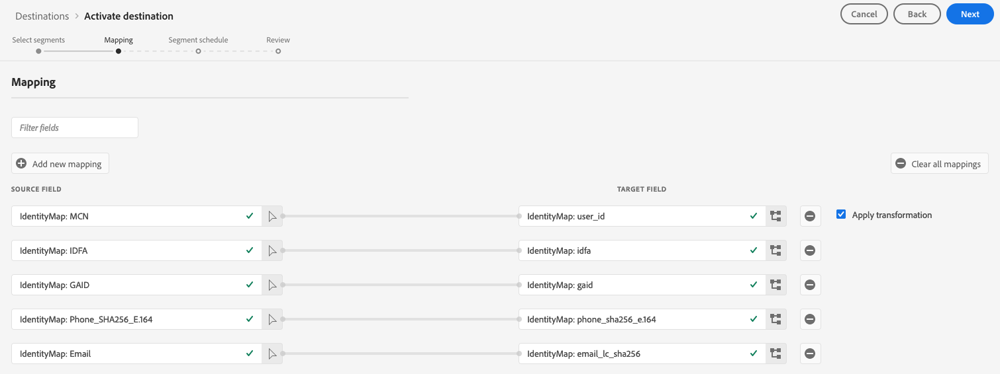

# [!DNL Google Customer Match] verbinding

## Overzicht {#overview}

[Google Customer Match](https://support.google.com/google-ads/answer/6379332?hl=en) Hiermee kunt u uw online- en offlinegegevens gebruiken om uw klanten te bereiken en opnieuw contact op te nemen met andere Google-eigendommen, zoals: [!DNL Search], [!DNL Shopping], [!DNL Gmail], en [!DNL YouTube].

## Gebruiksscenario’s {#use-cases}

Om u te helpen beter begrijpen hoe en wanneer gebruiken [!DNL Google Customer Match] doel, hier zijn voorbeelden van gebruiksgevallen die Adobe Experience Platform-klanten met deze functie kunnen oplossen.

### Hoofdletters gebruiken #1

Een atletisch merkteken wil bestaande klanten bereiken via [!DNL Google Search] en [!DNL Google Shopping] om aanbiedingen en objecten aan te passen op basis van eerdere aankopen en browsergeschiedenis. Het merk apparel kan e-mailadressen van hun eigen CRM aan Experience Platform opnemen, en segmenten van hun eigen off-line gegevens bouwen. Vervolgens kunnen ze deze segmenten naar [!DNL Google Customer Match] te gebruiken voor [!DNL Search] en [!DNL Shopping]en hun reclame-uitgaven optimaliseren.

### Hoofdletters gebruiken #2

Een vooraanstaande technologiebedrijf lanceerde een nieuwe telefoon. Om dit nieuwe telefoonmodel te bevorderen, kijken zij om bewustzijn van de nieuwe eigenschappen en de functionaliteit van de telefoon aan klanten te drijven die vorige modellen van hun telefoons bezitten.

Om de versie te promoten, uploaden zij e-mailadressen van hun gegevensbestand van CRM in Experience Platform, gebruikend de e-mailadressen als herkenningstekens. De segmenten worden gecreeerd gebaseerd op klanten die oudere telefoonmodellen bezitten. Vervolgens worden segmenten verzonden naar [!DNL Google Customer Match], zodat kan het bedrijf huidige klanten, klanten richten die oudere telefoonmodellen bezitten en gelijkaardige klanten op [!DNL YouTube].

## Gegevensbeheer voor [!DNL Google Customer Match] bestemmingen {#data-governance}

Sommige bestemmingen in Experience Platform hebben bepaalde regels en verplichtingen voor gegevens die worden verzonden naar of ontvangen van het bestemmingsplatform. U bent verantwoordelijk voor het begrijpen van de beperkingen en verplichtingen van uw gegevens en hoe u die gegevens gebruikt in Adobe Experience Platform en het doelplatform. Adobe Experience Platform biedt tools voor gegevensbeheer om u te helpen bij het beheren van een aantal van deze gegevensgebruiksverplichtingen. [Meer informatie](../../../data-governance/labels/overview.md) over instrumenten en beleid voor gegevensbeheer.

## Ondersteunde identiteiten {#supported-identities}

[!DNL Google Customer Match] ondersteunt de activering van identiteiten die in de onderstaande tabel worden beschreven. Meer informatie over [identiteiten](/help/identity-service/namespaces.md).

| Doelidentiteit | Beschrijving | Overwegingen |
|---|---|---|
| GAID | Google-advertentie-id | Selecteer deze doelidentiteit wanneer uw bronidentiteit een GAID-naamruimte is. |
| IDFA | Apple-id voor adverteerders | Selecteer deze doelidentiteit wanneer uw bronidentiteit een IDFA-naamruimte is. |
| phone_sha256_e.164 | Telefoonnummers in E164-indeling, gehasht met het SHA256-algoritme | Adobe Experience Platform biedt ondersteuning voor zowel platte tekst- als SHA256-telefoonnummers. Volg de instructies in de [Vereisten voor id-afstemming](#id-matching-requirements-id-matching-requirements) en gebruik de juiste naamruimten voor respectievelijk platte tekst en gehashte telefoonnummers. Wanneer het bronveld hashkenmerken bevat, controleert u de **[!UICONTROL Apply transformation]** optie, om [!DNL Platform] de gegevens bij activering automatisch hashen. |
| email_lc_sha256 | E-mailadressen die met het algoritme SHA256 worden gehasht | Adobe Experience Platform biedt ondersteuning voor zowel platte tekst- als SHA256-e-mailadressen met hashing. Volg de instructies in de [Vereisten voor id-afstemming](#id-matching-requirements-id-matching-requirements) gebruiken en de juiste naamruimten gebruiken voor normale tekst en gehashte e-mailadressen. Wanneer het bronveld hashkenmerken bevat, controleert u de **[!UICONTROL Apply transformation]** optie, om [!DNL Platform] de gegevens bij activering automatisch hashen. |
| user_id | Aangepaste gebruikers-id&#39;s | Selecteer deze doelidentiteit wanneer uw bronidentiteit een aangepaste naamruimte is. |

{style=&quot;table-layout:auto&quot;}

## Type en frequentie exporteren {#export-type-frequency}

Raadpleeg de onderstaande tabel voor informatie over het exporttype en de exportfrequentie van de bestemming.

| Item | Type | Notities |
---------|----------|---------|
| Exporttype | **[!UICONTROL Segment export]** | U exporteert alle leden van een segment (publiek) met de id&#39;s (naam, telefoonnummer en andere) die worden gebruikt in het dialoogvenster [!DNL Google Customer Match] bestemming. |
| Uitvoerfrequentie | **[!UICONTROL Streaming]** | Streaming doelen zijn &quot;altijd aan&quot; API-verbindingen. Zodra een profiel in Experience Platform wordt bijgewerkt dat op segmentevaluatie wordt gebaseerd, verzendt de schakelaar de update stroomafwaarts naar het bestemmingsplatform. Meer informatie over [streaming doelen](/help/destinations/destination-types.md#streaming-destinations). |

{style=&quot;table-layout:auto&quot;}

## [!DNL Google Customer Match] accountvereisten {#google-account-prerequisites}

Voordat u een [!DNL Google Customer Match] bestemming in Experience Platform, zorg ervoor u leest en aan het beleid van Google hanteert voor het gebruiken [!DNL Customer Match], die in de [Google-ondersteuningsdocumentatie](https://support.google.com/google-ads/answer/6299717).

Controleer vervolgens of [!DNL Google] account is geconfigureerd voor een [!DNL Standard] of hoger machtigingsniveau. Zie de [Google Ads-documentatie](https://support.google.com/google-ads/answer/9978556?visit_id=637611563637058259-4176462731&amp;rd=1) voor meer informatie.

### Lijst van gewenste personen {#allowlist}

Voordat u het dialoogvenster [!DNL Google Customer Match] doel in Experience Platform, zorg ervoor uw [!DNL Google Ads] voldoet aan de [Beleid voor afstemming van Google-klanten](https://support.google.com/google-ads/answer/6299717/customer-match-policy).

Klanten met compatibele accounts worden automatisch door Google aangeboden.

## Vereisten voor id-afstemming {#id-matching-requirements}

[!DNL Google] vereist dat er geen duidelijk identificeerbare informatie (PII) wordt verstrekt. Daarom wordt het publiek geactiveerd tot [!DNL Google Customer Match] kan worden uitgeschakeld *hashed* id&#39;s, zoals e-mailadressen of telefoonnummers.

Afhankelijk van het type id&#39;s dat u in Adobe Experience Platform invoert, moet u aan de desbetreffende vereisten voldoen.

### Vereisten voor hashing voor telefoonnummers {#phone-number-hashing-requirements}

Er zijn twee methoden om telefoonnummers te activeren in [!DNL Google Customer Match]:

* **Raw-telefoonnummers worden geïnstalleerd**: u kunt onbewerkte telefoonnummers invoeren in het dialoogvenster [!DNL E.164] indelen in [!DNL Platform]en deze worden automatisch gehasht bij activering. Als u deze optie kiest, moet u altijd uw onbewerkte telefoonnummers invoeren in het dialoogvenster `Phone_E.164` naamruimte.
* **Hashing-telefoonnummers invoegen**: u kunt uw telefoonaantallen vóór inname pre-hash in [!DNL Platform]. Als u deze optie kiest, zorg ervoor om uw gehakte telefoonaantallen altijd in te nemen in `PHONE_SHA256_E.164` naamruimte.

>[!NOTE]
>
>Telefoonnummers die in de `Phone` naamruimte kan niet worden geactiveerd in [!DNL Google Customer Match].

### Vereisten voor e-mailhashing {#hashing-requirements}

U kunt e-mailadressen hashen alvorens hen in Adobe Experience Platform op te nemen, of e-mailadressen gebruiken duidelijk in Experience Platform, en hebben [!DNL Platform] hash deze na activering.

Raadpleeg de volgende secties in de documentatie bij Google voor meer informatie over de hashingvereisten voor Google en andere activeringsbeperkingen:

* [[!DNL Customer Match] met e-mailadres, adres of gebruikersnaam](https://developers.google.com/adwords/api/docs/guides/remarketing#customer_match_with_email_address_address_or_user_id)
* [[!DNL Customer Match] overwegingen](https://developers.google.com/adwords/api/docs/guides/remarketing#customer_match_considerations)
* [Klanten komen overeen met telefoonnummer](https://developers.google.com/adwords/api/docs/guides/remarketing#customer_match_with_phone_number)
* [Klanten komen overeen met mobiele apparaat-id&#39;s](https://developers.google.com/adwords/api/docs/guides/remarketing#customer_match_with_mobile_device_ids)

Als u meer wilt weten over het invoeren van e-mailadressen in Experience Platform, raadpleegt u de [overzicht van batch-opname](../../../ingestion/batch-ingestion/overview.md) en de [overzicht van streaming opname](../../../ingestion/streaming-ingestion/overview.md).

Als u ervoor kiest om de e-mailadressen zelf te hashen, moet u voldoen aan de Google-vereisten die in de bovenstaande koppelingen worden beschreven.

### Aangepaste naamruimten gebruiken {#custom-namespaces}

Voordat u de `User_ID` naamruimte om gegevens naar Google te verzenden, moet u uw eigen id&#39;s synchroniseren met [!DNL gTag]. Zie de [Officiële Google-documentatie](https://support.google.com/google-ads/answer/9199250) voor nadere informatie.

<!-- Data from unhashed namespaces is automatically hashed by [!DNL Platform] upon activation.

Attribute source data is not automatically hashed. When your source field contains unhashed attributes, check the **[!UICONTROL Apply transformation]** option, to have [!DNL Platform] automatically hash the data on activation.
 -->

<!-- ## Configure destination - video walkthrough {#video}

The video below demonstrates the steps to configure a [!DNL Google Customer Match] destination and activate segments. The steps are also laid out sequentially in the next sections.

>[!VIDEO](https://video.tv.adobe.com/v/332599/?quality=12&learn=on&captions=eng) -->

## Verbinden met de bestemming {#connect}

>[!IMPORTANT]
> 
>Om met de bestemming te verbinden, hebt u nodig **[!UICONTROL Manage Destinations]** [toegangsbeheermachtiging](/help/access-control/home.md#permissions). Lees de [toegangsbeheeroverzicht](/help/access-control/ui/overview.md) of neem contact op met de productbeheerder om de vereiste machtigingen te verkrijgen.

Als u verbinding wilt maken met dit doel, voert u de stappen uit die worden beschreven in het dialoogvenster [zelfstudie over doelconfiguratie](../../ui/connect-destination.md).

### Verbindingsparameters {#parameters}

while [opzetten](../../ui/connect-destination.md) voor deze bestemming moet u de volgende informatie opgeven:

* **[!UICONTROL Name]**: Geef een naam op voor deze doelverbinding
* **[!UICONTROL Description]**: Geef een beschrijving voor deze doelverbinding
* **[!UICONTROL Account ID]**: uw [Customer ID Google Adds](https://support.google.com/google-ads/answer/1704344?hl=en). De indeling van de id is xxx-xxx-xxxx. Als u het [!DNL Google Ads Manager Account (My Client Center)], gebruik uw account-id voor Manager niet. Gebruik de [Customer ID Google Adds](https://support.google.com/google-ads/answer/1704344?hl=en) in plaats daarvan.

>[!IMPORTANT]
>
> * De **[!UICONTROL Combine with PII]** marketingactie is standaard geselecteerd voor de [!DNL Google Customer Match] doel en kan niet worden verwijderd.

### Waarschuwingen inschakelen {#enable-alerts}

U kunt alarm toelaten om berichten over de status van dataflow aan uw bestemming te ontvangen. Selecteer een waarschuwing in de lijst om u te abonneren op meldingen over de status van uw gegevensstroom. Voor meer informatie over waarschuwingen raadpleegt u de handleiding over [het abonneren aan bestemmingen alarm gebruikend UI](../../ui/alerts.md).

Wanneer u klaar bent met het opgeven van details voor uw doelverbinding, selecteert u **[!UICONTROL Next]**.

## Segmenten naar dit doel activeren {#activate}

>[!IMPORTANT]
> 
>Als u gegevens wilt activeren, hebt u de opdracht **[!UICONTROL Manage Destinations]**, **[!UICONTROL Activate Destinations]**, **[!UICONTROL View Profiles]**, en **[!UICONTROL View Segments]** [toegangsbeheermachtigingen](/help/access-control/home.md#permissions). Lees de [toegangsbeheeroverzicht](/help/access-control/ui/overview.md) of neem contact op met de productbeheerder om de vereiste machtigingen te verkrijgen.

Zie [De publieksgegevens van de activering aan het stromen segment de uitvoerbestemmingen](../../ui/activate-segment-streaming-destinations.md) voor instructies bij het activeren van publiekssegmenten aan deze bestemming.

In de **[!UICONTROL Segment schedule]** stap, moet u de [!UICONTROL App ID] wanneer verzenden [!DNL IDFA] of [!DNL GAID] segmenten naar [!DNL Google Customer Match].

Voor meer informatie over het zoeken naar de [!DNL App ID], verwijst u naar de [Officiële Google-documentatie](https://developers.google.com/adwords/api/docs/reference/v201809/AdwordsUserListService.CrmBasedUserList#appid).

### Voorbeeld van toewijzing: publieksgegevens activeren in [!DNL Google Customer Match] {#example-gcm}

Dit is een voorbeeld van correcte identiteitstoewijzing wanneer het activeren van publieksgegevens in [!DNL Google Customer Match].

Bronvelden selecteren:

* Selecteer `Email` naamruimte als bronidentiteit als de e-mailadressen die u gebruikt geen hashed zijn.
* Selecteer `Email_LC_SHA256` naamruimte als bronidentiteit als u de e-mailadressen van de klant hebt gewijzigd bij het invoeren van gegevens in [!DNL Platform]volgens [!DNL Google Customer Match] [e-mailhashingvereisten](#hashing-requirements).
* Selecteer `PHONE_E.164` naamruimte als bronidentiteit als uw gegevens uit niet-gehashte telefoonnummers bestaan. [!DNL Platform] hash de telefoonnummers waaraan moet worden voldaan [!DNL Google Customer Match] eisen.
* Selecteer `Phone_SHA256_E.164` naamruimte als bronidentiteit als u telefoonnummers hebt gehasht bij gegevensinvoer in [!DNL Platform]volgens [!DNL Facebook] [hashingvereisten voor telefoonnummers](#phone-number-hashing-requirements).
* Selecteer `IDFA` naamruimte als bronidentiteit als uw gegevens bestaan uit [!DNL Apple] apparaat-id&#39;s.
* Selecteer `GAID` naamruimte als bronidentiteit als uw gegevens bestaan uit [!DNL Android] apparaat-id&#39;s.
* Selecteer `Custom` naamruimte als bronidentiteit als uw gegevens uit andere typen id&#39;s bestaan.

Doelvelden selecteren:

* Selecteer `Email_LC_SHA256` naamruimte als doelidentiteit wanneer de bronnaamruimten `Email` of `Email_LC_SHA256`.
* Selecteer `Phone_SHA256_E.164` naamruimte als doelidentiteit wanneer de bronnaamruimten `PHONE_E.164` of `Phone_SHA256_E.164`.
* Selecteer `IDFA` of `GAID` naamruimten als doelidentiteit wanneer uw bronnaamruimten `IDFA` of `GAID`.
* Selecteer `User_ID` naamruimte als doelidentiteit wanneer uw bronnaamruimte een aangepaste naamruimte is.

Gegevens uit naamruimten zonder hashing worden automatisch gehasht door [!DNL Platform] na activering.

Kenmerkbrongegevens worden niet automatisch gehasht. Wanneer het bronveld hashkenmerken bevat, controleert u de **[!UICONTROL Apply transformation]** optie, om [!DNL Platform] de gegevens bij activering automatisch hashen.

## Controleren of segmentactivering is gelukt {#verify-activation}

Nadat u de activeringsstroom hebt voltooid, schakelt u over naar uw **[!UICONTROL Google Ads]** account. De geactiveerde segmenten worden in uw Google-account weergegeven als klantenlijsten. Houd er rekening mee dat sommige doelgroepen, afhankelijk van de grootte van uw segment, alleen worden gevuld als er meer dan 100 actieve gebruikers zijn die u kunt bedienen.

Wanneer u een segment toewijst aan beide [!DNL IDFA] en [!DNL GAID] mobiele id&#39;s, [!DNL Google Customer Match] Hiermee maakt u een apart segment voor elke id-toewijzing. Uw [!DNL Google Ads] account toont twee verschillende segmenten, één voor de [!DNL IDFA]en een voor de [!DNL GAID] toewijzing.

## Problemen oplossen {#troubleshooting}

### 400 Onjuist aanvraagfoutbericht {#bad-request}

Wanneer het vormen van deze bestemming, kunt u de volgende fout ontvangen:

`{"message":"Google Customer Match Error: OperationAccessDenied.ACTION_NOT_PERMITTED","code":"400 BAD_REQUEST"}`

Deze fout treedt op wanneer de klantenrekeningen niet aan [voorwaarden](#google-account-prerequisites). Neem contact op met Google om dit probleem op te lossen en zorg ervoor dat uw account op de lijst met toegestane items staat en geconfigureerd is voor een [!DNL Standard] of hoger machtigingsniveau. Zie de [Google Ads-documentatie](https://support.google.com/google-ads/answer/9978556?visit_id=637611563637058259-4176462731&amp;rd=1) voor meer informatie.

## Aanvullende bronnen {#additional-resources}

* [Google Customer Match integreren - videozelfstudie](https://experienceleague.adobe.com/docs/platform-learn/tutorials/rtcdp/integrate-with-google-customer-match.html)

