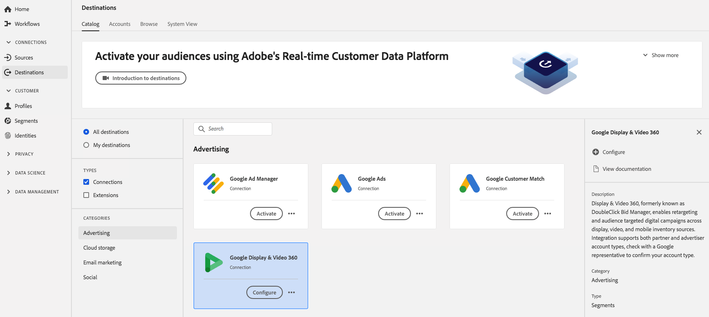

# [!DNL Google Display & Video 360] verbinding

[!DNL Display & Video 360], voorheen bekend onder de naam  [!DNL DoubleClick Bid Manager], is een hulpmiddel dat wordt gebruikt voor het uitvoeren van herrichtings- en doelgerichte digitale campagnes in verschillende bronnen voor weergave, video en mobiele inventaris.

## Doelspecificaties

Neem nota van de volgende details die voor [!DNL Google Display & Video 360] bestemmingen specifiek zijn:

* U kunt de volgende [identiteiten](../../../identity-service/namespaces.md) naar [!DNL Google Ads] bestemmingen verzenden: [AAM UUID](https://experienceleague.adobe.com/docs/audience-manager/user-guide/reference/ids-in-aam.html?lang=en), Google cookie-id, IDFA, GAID, Roku-id&#39;s, Microsoft-id&#39;s en Amazon Fire TV-id&#39;s.
   * Google gebruikt [AAM UUID](https://experienceleague.adobe.com/docs/audience-manager/user-guide/reference/ids-in-aam.html?lang=en) om gebruikers in Californië als doelgroep op te nemen, en de Google Cookie-id voor alle andere gebruikers.
* Geactiveerd publiek wordt via programmacode gemaakt in het Google-platform.
* Platform bevat momenteel geen metrische waarde om succesvolle activering te valideren. Raadpleeg de tellingen van het publiek in Google om de integratie te valideren en inzicht te krijgen in doelgroepen.

>[!IMPORTANT]
>
>Als u uw eerste bestemming met Google Display &amp; Video 360 wilt maken en in het verleden (met Adobe Audience Manager of andere toepassingen) de [ID-synchronisatiefunctie](https://experienceleague.adobe.com/docs/id-service/using/id-service-api/methods/idsync.html) niet hebt ingeschakeld in de Experience Cloud ID-service, neemt u contact op met Adobe Consulting of de klantenservice om ID-syncs in te schakelen. Als u eerder Google-integraties in Audience Manager had ingesteld, worden de id-synchronisaties die u hebt ingesteld overgedragen naar Platform.

### Exporttype {#export-type}

**Segmentexport** : u exporteert alle leden van een segment (publiek) naar de Google-bestemming.

## Vereisten

### Lijst van gewenste personen

>[!NOTE]
>
>De lijst van gewenste personen is verplicht alvorens uw eerste [!DNL Google Display & Video 360] bestemming in Platform te plaatsen. Controleer of Google het hieronder beschreven lijst van gewenste personen-proces heeft voltooid voordat u een bestemming maakt.

Voordat u de [!DNL Google Display & Video 360]-bestemming in Platform maakt, moet u contact opnemen met Google om Adobe op te nemen in de lijst met toegestane gegevensproviders en om uw account toe te voegen aan de lijst van gewenste personen. Neem contact op met Google en geef de volgende informatie op:

* **Account-id** : Dit is Adobe account-ID bij Google. Neem contact op met de klantenservice van Adobe of uw Adobe om deze id te verkrijgen.
* **Klant-id** : Dit is Adobe-klant-id bij Google. Neem contact op met de klantenservice van Adobe of uw Adobe om deze id te verkrijgen.
* **Je accounttype**: gebruik  **[!DNL Invite advertiser]** om het publiek alleen te laten delen naar een specifiek merk in uw Display &amp; Video 360-account of gebruik  **[!DNL Invite partner]** om het publiek te laten delen naar alle merken in uw Display &amp; Video 360-account.

## Doel configureren

Selecteer **[!UICONTROL Verbindingen]** > **[!UICONTROL Doelen]** en selecteer [!DNL Google Display & Video 360] en **[!UICONTROL Configureren]**.

>[!NOTE]
>
>Als er al een verbinding met dit doel bestaat, kunt u een **[!UICONTROL knop Activeer]** op de doelkaart zien. Voor meer informatie over het verschil tussen [!UICONTROL Activate] en [!UICONTROL Configure], verwijs naar [Catalog](../../ui/destinations-workspace.md#catalog) sectie van de documentatie van de bestemmingswerkruimte.

In **Opstelling** stap van creeer bestemmingswerkschema, vul [!UICONTROL BasisInformatie] voor de bestemming, evenals de marketing gebruiksgevallen in die op deze bestemming zouden moeten van toepassing zijn.

* **[!UICONTROL Naam]**: Vul de voorkeursnaam voor dit doel in.
* **[!UICONTROL Omschrijving]**: Optioneel. U kunt bijvoorbeeld opgeven voor welke campagne u deze bestemming wilt gebruiken.
* **[!UICONTROL Accounttype]**: Selecteer een optie, afhankelijk van uw account bij Google:
   * Gebruik `Invite Advertiser` om het publiek toe te staan om slechts aan een specifiek merk in uw Vertoning &amp; Video 360 rekening worden gedeeld.
   * Gebruik `Invite Partner` om publiek toe te staan om aan alle merken in uw Vertoning &amp; Video 360 rekening worden gedeeld.
* **[!UICONTROL Account-id]**: Vul uw  **[!DNL Invite partner]** of  **[!DNL Invite advertiser]** account-id in met Google. Dit is doorgaans een ID van zes of zeven cijfers.
* **[!UICONTROL Geval]** voor gebruik bij het in de handel brengen: Gebruiksgevallen voor marketingdoeleinden geven de intentie aan waarvoor gegevens naar de bestemming worden geëxporteerd. U kunt kiezen uit door de Adobe gedefinieerde gebruiksgevallen voor marketingdoeleinden of u kunt uw eigen gebruiksscenario voor marketingdoeleinden maken. Zie [Overzicht van beleidsregels voor gegevensgebruik](../../../data-governance/policies/overview.md) voor meer informatie over gevallen van marketinggebruik.

>[!NOTE]
>
>Wanneer u een [!DNL Google Display & Video 360]-bestemming instelt, werkt u samen met uw [!DNL Google Account Manager]- of Adobe-vertegenwoordiger om te begrijpen welk accounttype u hebt.

## Segmenten activeren naar [!DNL Google Display & Video 360]

Zie [Gegevens naar doelen activeren](../../ui/activate-destinations.md) voor instructies over het activeren van segmenten naar [!DNL Google Display & Video 360].

## Geëxporteerde gegevens

Controleer uw [!DNL Google Display & Video 360]-account om te controleren of gegevens naar de [!DNL Google Display & Video 360]-bestemming zijn geëxporteerd. Als de activering succesvol was, worden de soorten publiek in uw account ingevuld.