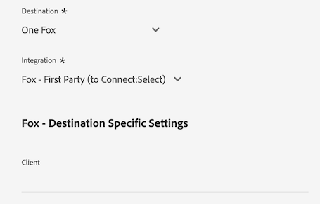

# [!DNL LiveRamp - Distribution]-verbinding

Met de [!DNL LiveRamp - Distribution] -verbinding kunt u een publiek van Experience Platform activeren voor hoogwaardige uitgevers op mobiele media, het web, displays en verbonden tv-media.

>[!IMPORTANT]
>
>Deze doelconnector en documentatiepagina worden gemaakt en onderhouden door LiveRamp. Voor om het even welke onderzoeken of updateverzoeken, contacteer rechtstreeks LiveRamp [&#x200B; &#x200B;](mailto:adobertcdp@liveramp.com).

## Ondersteunde doelen {#supported-destinations}

[!DNL LiveRamp - Distribution] ondersteunt momenteel activering van het publiek voor de volgende platforms:

* [[!DNL 4C Insights]](#insights)
* [[!DNL Acast]](#acast)
* [[!DNL Nexxen]](#nexxen)
* [[!DNL Ampersand.tv]](#ampersand-tv)
* [[!DNL Captify]](#captify)
* [[!DNL Cardlytics]](#cardlytics)
* [[!DNL Disney (Hulu/ESPN/ABC)]](#disney)
* [[!DNL iHeartMedia]](#iheartmedia)
* [[!DNL Index Exchange]](#index-exchange)
* [[!DNL Magnite CTV Platform]](#magnite)
* [[!DNL Magnite DV+ (Rubicon Project)]](#magnite-dv)
* [[!DNL One Fox]](#fox)
* [[!DNL Pandora]](#pandora)
* [[!DNL Reddit]](#reddit)
* [[!DNL Roku]](#roku)
* [[!DNL Spotify]](#spotify)
* [[!DNL Taboola]](#taboola)
* [[!DNL TargetSpot]](#targetspot)
* [[!DNL Teads]](#teads)
* [[!DNL WB Discovery]](#wb-discovery)

## Gebruiksscenario’s {#use-cases}

Om u beter te helpen begrijpen hoe en wanneer u de [!DNL LiveRamp - Distribution] bestemming zou moeten gebruiken, is hier een geval van het steekproefgebruik dat de klanten van Adobe Experience Platform kunnen oplossen door deze bestemming te gebruiken.

Het marketing team van een sportkleding retailer gebruikte [&#x200B; LiveRamp - Onboarding &#x200B;](liveramp-onboarding.md) verbinding om publiek van Experience Platform naar hun rekening te verzenden LiveRamp.

Door de [!DNL LiveRamp - Distribution] verbinding kunnen zij de activering van het geregistreerde publiek aan de [&#x200B; gesteunde bestemmingen &#x200B;](#supported-destinations) nu teweegbrengen. Vervolgens kunnen ze zich richten op gebruikers op mobiele, open web-, sociale en [!DNL CTV] -platforms.

## Boordpubliek naar LiveRamp {#onboarding}

Alvorens publiek door de [!DNL LiveRamp - Distribution] verbinding te activeren, gebruik [&#x200B; LiveRamp - on boarding &#x200B;](liveramp-onboarding.md) verbinding om uw publiek van Experience Platform naar LiveRamp uit te voeren.

Nadat u uw publiek aan LiveRamp hebt ingezien, ga het activeringswerkschema van [&#x200B; met de bestemmings &#x200B;](#connect) stap verbinden om uw doelbestemmingsplatforms voor gegevensactivering te selecteren en te vormen.

## Verbinden met de bestemming {#connect}

>[!CONTEXTUALHELP]
>id="platform_destinations_liveramp_distribution_identifier_settings"
>title="Id-instellingen"
>abstract="Selecteer de id&#39;s die door uw doel worden ondersteund. Zie de documentatie voor de volledige lijst van gesteunde herkenningstekens voor elke bestemming."

>[!IMPORTANT]
> 
>Om met de bestemming te verbinden, hebt u **[!UICONTROL View Destinations]** en **[!UICONTROL Manage Destinations]** [&#x200B; toegangsbeheertoestemmingen &#x200B;](/help/access-control/home.md#permissions) nodig. Lees het [&#x200B; overzicht van de toegangscontrole &#x200B;](/help/access-control/ui/overview.md) of contacteer uw productbeheerder om de vereiste toestemmingen te verkrijgen.

Om met deze bestemming te verbinden, volg de stappen die in het [&#x200B; leerprogramma van de bestemmingsconfiguratie &#x200B;](../../ui/connect-destination.md) worden beschreven. In vormen bestemmingswerkschema, vul de gebieden in die in de twee hieronder secties worden vermeld.

### Verifiëren voor LiveRamp {#authenticate}

Als u voor verificatie bij het doel wilt zorgen, vult u de vereiste velden in en selecteert u **[!UICONTROL Connect to destination]** .

* **[!UICONTROL LiveRamp Organization ID]**: De organisatieidentiteitskaart van uw rekening LiveRamp (die als _wordt vermeld owner_org_ in uw LiveRamp-Geleide geloofsbrieven).
* **[!UICONTROL Password]**: Uw die rekeningswachtwoord LiveRamp (als _wordt vermeld geheim_key_ in uw LiveRamp-Geleide geloofsbrieven).
* **[!UICONTROL Token URL]**: De URL van uw token LiveRamp.
* **[!UICONTROL Username]**: Uw LiveRamp rekeningsgebruikersbenaming (die als _wordt vermeld account_id_ in uw LiveRamp-Geleide geloofsbrieven).

### Doeldetails configureren {#destination-details}

Nadat u verbinding hebt gemaakt met uw LiveRamp-account, voert u de vereiste informatie in om verbinding te maken met het doel waarop u het publiek wilt activeren.

{het beeld van 0} Experience Platform UI die het doelDetails screen.l toont 

* **[!UICONTROL Name]**: vul de voorkeursnaam in voor uw doelverbinding.

>[!NOTE]
>
>Adobe raadt u aan de volgende notatie te volgen wanneer u de naam van uw bestemming wijzigt: `LiveRamp - Downstream Destination Name` . Dit het noemen patroon helpt u snel uw bestemmingen in [&#x200B; identificeren doorbladert &#x200B;](../../ui/destinations-workspace.md#browse) lusje van de bestemmingswerkruimte.
> 
>Voorbeeld: `LiveRamp - Roku` .

* **[!UICONTROL Description]**: voer een beschrijving in voor uw doel. Gebruik een beschrijving waarmee u het doel van deze bestemming gemakkelijk kunt identificeren.
* **[!UICONTROL Destination]**: gebruik het keuzemenu om het doel te selecteren waarnaar u het publiek wilt activeren. De bestemming u hier selecteert beïnvloedt direct wat u in het [&#x200B; bestemming-specifieke montages &#x200B;](#destination-settings) scherm ziet.
* **[!UICONTROL Integration]**: selecteer de integratieaccount die u voor uw doel wilt gebruiken.
* **[!UICONTROL Identifier]**: Selecteer de id&#39;s die door uw doel worden ondersteund. Momenteel hebben alle bestemmingen hun gesteunde herkenningstekens die in het drop-down menu worden voorgevuld.

## Doelspecifieke instellingen {#destination-settings}

Elk van de bestemmingen [&#x200B; gesteund &#x200B;](#supported-destinations) door [!DNL LiveRamp - Distribution] vereist u om specifieke configuratieopties in te vullen.

Zie de secties hieronder voor gedetailleerde begeleiding op hoe te om elke bestemming te vormen.

### [!DNL 4C Insights] {#insights}

>[!CONTEXTUALHELP]
>id="platform_destinations_liveramp_distribution_4cinsights_profile_id"
>title="4C-merkprofiel-id"
>abstract="Voer de numerieke id in die aan uw 4C-merkprofiel is gekoppeld. Als u deze id niet hebt, neemt u contact op met uw 4C-vertegenwoordiger voor clientservices."

Vul de onderstaande velden in om details voor de bestemming te configureren.

{het beeld van 0} Experience Platform UI die de gebieden van klantengegevens voor de 4C bestemming van Inzichten toont.

* **[!UICONTROL 4C Brand Profile ID]**: voer de numerieke id in die is gekoppeld aan uw 4C-merkprofiel. Als u deze id niet hebt, neemt u contact op met uw 4C-vertegenwoordiger voor clientservices.

### [!DNL Acast] {#acast}

>[!CONTEXTUALHELP]
>id="platform_destinations_liveramp_distribution_acast_client"
>title="Naam client"
>abstract="Uw naam van de adverteerderaccount, zoals u wilt dat deze aan de doelpartner wordt getoond. Gebruik uw bedrijfsnaam. Gebruik geen spaties of speciale tekens."

Vul de onderstaande velden in om details voor de bestemming te configureren.

* **[!UICONTROL Client name]**: De naam van uw advertentieaccount, zoals u wilt dat deze aan de doelpartner wordt getoond. Gebruik uw bedrijfsnaam. Gebruik geen spaties of speciale tekens.

### [!DNL Ampersand.tv] {#ampersand-tv}

>[!CONTEXTUALHELP]
>id="platform_destinations_liveramp_distribution_ampersand_company_name"
>title="Uw bedrijfsnaam"
>abstract="Uw bedrijfsnaam, aangezien u het aan de bestemmingspartner zou willen worden getoond. Gebruik geen spaties of speciale tekens."

Vul de onderstaande velden in om details voor de bestemming te configureren.

{het beeld van 0} Experience Platform UI die de gebieden van klantengegevens voor de bestemming Ampersand toont.

* **[!UICONTROL Your Company Name]**: Uw bedrijfsnaam, aangezien u het aan de bestemmingspartner zou willen worden getoond. Gebruik geen spaties of speciale tekens.

### [!DNL Captify] {#captify}

>[!CONTEXTUALHELP]
>id="platform_destinations_liveramp_distribution_captify_client"
>title="Naam client"
>abstract="Uw naam van de adverteerderaccount, zoals u wilt dat deze aan de doelpartner wordt getoond. Gebruik uw bedrijfsnaam. Gebruik geen spaties of speciale tekens."

Vul de onderstaande velden in om details voor de bestemming te configureren.

* **[!UICONTROL Client name]**: De naam van uw advertentieaccount, zoals u wilt dat deze aan de doelpartner wordt getoond. Gebruik uw bedrijfsnaam. Gebruik geen spaties of speciale tekens.

### [!DNL Cardlytics] {#cardlytics}

>[!CONTEXTUALHELP]
>id="platform_destinations_liveramp_distribution_cardlytics_client"
>title="Naam client"
>abstract="Uw naam van de adverteerderaccount, zoals u wilt dat deze aan de doelpartner wordt getoond. Gebruik uw bedrijfsnaam. Gebruik geen spaties of speciale tekens."

Vul de onderstaande velden in om details voor de bestemming te configureren.

{het beeld van 0} Experience Platform UI die de gebieden van klantengegevens voor de bestemming van de Karakteristiek toont.

* **[!UICONTROL Client name]**: De naam van uw advertentieaccount, zoals u wilt dat deze aan de doelpartner wordt getoond. Gebruik uw bedrijfsnaam. Gebruik geen spaties of speciale tekens.

### [!DNL Disney (Hulu/ESPN/ABC)] {#disney}

>[!CONTEXTUALHELP]
>id="platform_destinations_liveramp_distribution_agreement"
>title="Terreurovereenkomst voor gegevensbestemming van adverteerders"
>abstract="Typ in `I AGREE` om de bevestiging en instemming met de gegevensvoorwaarden van Disney-adverteerders te bevestigen."

<!-- >additional-url="<https://www.disneyadvertising.com/ADVERTISER-DATA-DESTINATION-TERMS/>" text="Read the agreement" -->

>[!CONTEXTUALHELP]
>id="platform_destinations_liveramp_distribution_disney_client"
>title="Naam client"
>abstract="Uw naam van de adverteerderaccount, zoals u wilt dat deze aan de doelpartner wordt getoond. Gebruik uw bedrijfsnaam. Gebruik geen spaties of speciale tekens."

>[!CONTEXTUALHELP]
>id="platform_destinations_liveramp_distribution_disney_email"
>title="Uw e-mailadres"
>abstract="Voer een e-mailadres in dat aan een persoon is gekoppeld. Dit e-mailadres fungeert als handtekening op de overeenkomst met de gegevensvoorwaarden van de adverteerder. Dit e-mailadres wordt ook gebruikt om indien nodig contact met u op te nemen."

Vul de onderstaande velden in om details voor de bestemming te configureren.

* **[!UICONTROL Advertiser data destination terms agreement]**: typ in `I AGREE` om de bevestiging en instemming met de gegevensvoorwaarden van Disney-adverteerders te bevestigen.
* **[!UICONTROL Client name]**: ga uw bedrijfsnaam in aangezien u het aan de bestemmingspartner wilt worden getoond.
* **[!UICONTROL Email address]**: voer een e-mailadres in dat aan een persoon is gekoppeld. Dit e-mailadres fungeert als handtekening op de overeenkomst met de gegevensvoorwaarden van de adverteerder.

### [!DNL iHeartMedia] {#iheartmedia}

>[!CONTEXTUALHELP]
>id="platform_destinations_liveramp_distribution_iheartmedia_client"
>title="Clientnaam"
>abstract="Uw naam van de adverteerderaccount, zoals u wilt dat deze aan de doelpartner wordt getoond. Gebruik uw bedrijfsnaam. Gebruik geen spaties of speciale tekens."

Vul de onderstaande velden in om details voor de bestemming te configureren.

* **[!UICONTROL Client Name]**: De naam van uw advertentieaccount, zoals u wilt dat deze aan de doelpartner wordt getoond. Gebruik uw bedrijfsnaam. Gebruik geen spaties of speciale tekens.

### [!DNL Index Exchange] {#index-exchange}

>[!CONTEXTUALHELP]
>id="platform_destinations_liveramp_distribution_index_advertiseraccountname"
>title="Accountnaam"
>abstract="De naam van uw Index Exchange-clientaccount. Gebruik geen spaties of speciale tekens."

Vul de onderstaande velden in om details voor de bestemming te configureren.

* **[!UICONTROL Account Name]**: De naam van uw Index Exchange-clientaccount. Gebruik geen spaties of speciale tekens.

### [!DNL Magnite CTV Platform] {#magnite}

>[!CONTEXTUALHELP]
>id="platform_destinations_liveramp_distribution_magnitectv_client"
>title="Client"
>abstract="Uw cliëntnaam, aangezien u het aan de bestemmingspartner zou willen worden getoond. Gebruik uw bedrijfsnaam. Gebruik geen spaties of speciale tekens."

Vul de onderstaande velden in om details voor de bestemming te configureren.

* **[!UICONTROL Client]**: Uw cliëntnaam, aangezien u het aan de bestemmingspartner zou willen worden getoond. Gebruik uw bedrijfsnaam. Gebruik geen spaties of speciale tekens.

### [!DNL Magnite DV+ (Rubicon Project)] {#magnite-dv}

>[!CONTEXTUALHELP]
>id="platform_destinations_liveramp_distribution_magnitedv+_partnerid"
>title="Partner-id"
>abstract="De identiteitskaart van de Partner van het Project Rubicon verbonden aan de uitgever die het segment/de gegevens bezit. Neem contact op met de vertegenwoordiger van uw Rubicon Project-account als u niet zeker weet welke waarde u moet gebruiken."

>[!CONTEXTUALHELP]
>id="platform_destinations_liveramp_distribution_magnitedv+_seatid"
>title="Licentie-id"
>abstract="Magnite DV+ Seat ID verstrekt door uw Magnite accountmanager"

Vul de onderstaande velden in om details voor de bestemming te configureren.

{het beeld van 0} Experience Platform UI die de gebieden van klantengegevens voor de Magnite DV+ bestemming toont.

* **[!UICONTROL Partner ID]**: Identiteitskaart van de Partner van het Project Rubicon verbonden aan de uitgever die het segment/de gegevens bezit. Neem contact op met de vertegenwoordiger van uw Rubicon Project-account als u niet zeker weet welke waarde u moet gebruiken.
* **[!UICONTROL Seat ID]**: Magnite DV+ Seat ID geleverd door uw Magnite-accountmanager

### [!DNL Nexxen (formerly known as [!DNL Amobee])] {#nexxen}

>[!CONTEXTUALHELP]
>id="platform_destinations_liveramp_distribution_nexxen_ratetype"
>title="Type snelheid"
>abstract="Het type van tarief vertegenwoordigt de manier het gegevensgebruik zou moeten worden gefactureerd. Alle $ 0,00 kosten moeten forfaitair worden berekend. Bevestig dit met uw Nexxen-vertegenwoordiger als u niet zeker weet welk type frequentie u moet gebruiken."

>[!CONTEXTUALHELP]
>id="platform_destinations_liveramp_distribution_nexxen_marketid"
>title="Marktnummer"
>abstract="Voer de numerieke markt-id in waar het Nexxen-gegevenscontract moet worden gemaakt. Als u de syndicatie &quot;AlwaysOn&quot;over elke markt in het Nexxen platform doet, ga -1 in."

>[!CONTEXTUALHELP]
>id="platform_destinations_liveramp_distribution_nexxen_advertiserid"
>title="Adverteerder-id"
>abstract="Als u gegevens naar één adverteerder op het Nexxen-platform verzendt, voert u de numerieke Adobe Advertiser-id in. Voer -1 in als u de gegevens beschikbaar wilt stellen aan alle adverteerders op een markt of als deze segmenten &quot;AlwaysOn&quot; zijn."

>[!CONTEXTUALHELP]
>id="platform_destinations_liveramp_distribution_nexxen_contactemail"
>title="E-mailadres"
>abstract="Voer het e-mailadres in dat Nexxen moet gebruiken om gegevens in het gegevenscontract te verzenden. Waarschijnlijk is dit uw eigen e-mailadres, maar het kan ook een e-mailalias zijn. Voor veelvoudige ontvangers, scheiden gebruikend komma&#39;s (`email1@domain.com`, `email2@domain.com`, etc.)."

Vul de onderstaande velden in om details voor de bestemming te configureren.

* **[!UICONTROL Rate Type]**: Het type snelheid geeft aan hoe het gegevensgebruik moet worden gefactureerd. Alle $ 0,00 kosten moeten forfaitair worden berekend. Bevestig dit met uw Nexxen-vertegenwoordiger als u niet zeker weet welk type frequentie u moet gebruiken.
* **[!UICONTROL Market ID]**: voer de numerieke markt-id in waar het Nexxen-gegevenscontract moet worden gemaakt. Als u de syndicatie &quot;AlwaysOn&quot;over elke markt in het Nexxen platform doet, ga -1 in.
* **[!UICONTROL Advertiser ID]**: Als u gegevens naar één adverteerder op het Nexxen-platform verzendt, voert u de numerieke Nexxen Advertiser-id in. Voer -1 in als u de gegevens beschikbaar wilt stellen aan alle adverteerders op een markt of als deze segmenten &quot;AlwaysOn&quot; zijn.
* **[!UICONTROL Contact Email]**: voer het e-mailadres in dat Nexxen moet gebruiken om gegevens in het gegevenscontract te verzenden. Waarschijnlijk is dit uw eigen e-mailadres, maar het kan ook een e-mailalias zijn. Scheid voor meerdere ontvangers de komma&#39;s ( `email1@domain.com` , `email2@domain.com` ) van elkaar.

### [!DNL One Fox] {#fox}

>[!CONTEXTUALHELP]
>id="platform_destinations_liveramp_distribution_fox_client"
>title="Client"
>abstract="De naam van uw bedrijf/distributierekening aangezien u het aan de partner zou willen verschijnen. Neem contact op met de vertegenwoordiger van uw partneraccount als u niet zeker weet welke naam u moet gebruiken. Gebruik geen spaties of speciale tekens."

Vul de onderstaande velden in om details voor de bestemming te configureren.

* **[!UICONTROL Client]**: De naam van uw bedrijf/distributierekening aangezien u het aan de partner zou willen verschijnen. Gebruik standaard uw bedrijfsnaam. Neem contact op met de vertegenwoordiger van uw partneraccount als u niet zeker weet welke naam u moet gebruiken. Gebruik geen spaties of speciale tekens.

### [!DNL Pandora] {#pandora}

>[!CONTEXTUALHELP]
>id="platform_destinations_liveramp_distribution_pandora_account_name"
>title="Accountnaam"
>abstract="De naam van uw Pandora-account. Neem contact op met uw vertegenwoordiger van uw Pandora-account als u niet zeker weet wat uw accountnaam is. Gebruik geen spaties of speciale tekens."

Vul de onderstaande velden in om details voor de bestemming te configureren.

* **[!UICONTROL Account name]**: De naam van uw Pandora-account. Neem contact op met uw vertegenwoordiger van uw Pandora-account als u niet zeker weet wat uw accountnaam is. Gebruik geen spaties of speciale tekens.

### [!DNL Reddit] {#reddit}

>[!CONTEXTUALHELP]
>id="platform_destinations_liveramp_distribution_reddit_advertiser_id"
>title="Advertentie-id bewerken"
>abstract="Je advertentie-id voor Reddit. Moet beginnen met &quot;t2_&quot; of &quot;a2_&quot;. Neem contact op met uw vertegenwoordiger van Reddit als u uw adverteerder-id niet kent."

>[!CONTEXTUALHELP]
>id="platform_destinations_liveramp_distribution_reddit_advertiser_name"
>title="Naam van adverteerder wijzigen"
>abstract="De naam van uw reddit-adverteerder. Gebruik geen spaties of speciale tekens."

Vul de onderstaande velden in om details voor de bestemming te configureren.

{het beeld van 0} Experience Platform UI die de gebieden van klantengegevens voor het reddit doel toont.

* **[!UICONTROL Reddit advertiser ID]**: Je advertentie-id voor Reddit. Moet beginnen met &quot;t2_&quot; of &quot;a2_&quot;. Neem contact op met uw vertegenwoordiger van Reddit als u uw adverteerder-id niet kent.
* **[!UICONTROL Reddit advertiser name]**: De naam van uw reddit-adverteerder. Gebruik geen spaties of speciale tekens.

### [!DNL Roku] {#roku}

>[!CONTEXTUALHELP]
>id="platform_destinations_liveramp_distribution_roku_email"
>title="E-mailadres van Roku-account"
>abstract="Voer het e-mailadres in dat aan uw Roku-account is gekoppeld."

>[!CONTEXTUALHELP]
>id="platform_destinations_liveramp_distribution_roku_representative_email"
>title="E-mailadres van vertegenwoordiger van Roku-account"
>abstract="Voer het e-mailadres in van uw vertegenwoordiger van uw Roku-account. Dit adres wordt gebruikt om taxonomie updates te verzenden. Als u meerdere adressen wilt invoeren, scheidt u deze met komma&#39;s."

Vul de onderstaande velden in om details voor de bestemming te configureren.

{het beeld van 0} Experience Platform UI die de gesteunde herkenningstekens voor de bestemming van Roku tonen.

* **[!UICONTROL Roku account email address]**: voer het e-mailadres in dat aan uw Roku-account is gekoppeld.
* **[!UICONTROL Roku account representative email address]**: voer het e-mailadres in van uw vertegenwoordiger van uw Roku-account. Als u meerdere adressen wilt invoeren, scheidt u deze met komma&#39;s.

### [!DNL Spotify] {#spotify}

>[!CONTEXTUALHELP]
>id="platform_destinations_liveramp_distribution_spotify_client"
>title="Naam client"
>abstract="Uw naam van de adverteerderaccount, zoals u wilt dat deze aan de doelpartner wordt getoond. Gebruik uw bedrijfsnaam. Gebruik geen spaties of speciale tekens."

Vul de onderstaande velden in om details voor de bestemming te configureren.

* **[!UICONTROL Client name]**: De naam van uw advertentieaccount, zoals u wilt dat deze aan de doelpartner wordt getoond. Gebruik uw bedrijfsnaam. Gebruik geen spaties of speciale tekens.

### [!DNL Taboola] {#taboola}

>[!CONTEXTUALHELP]
>id="platform_destinations_liveramp_distribution_taboola_rep_email"
>title="E-mailadres van accountmanager"
>abstract="Het e-mailadres van uw accountmanager van Taboola."

>[!CONTEXTUALHELP]
>id="platform_destinations_liveramp_distribution_taboola_seg_type"
>title="Segmenttype"
>abstract="Het segmenttype. Momenteel worden alleen de eerste-partijsegmenten ondersteund."

Vul de onderstaande velden in om details voor de bestemming te configureren.

* **[!UICONTROL Account manager email address]**: Het e-mailadres van uw accountmanager van Taboola.
* **[!UICONTROL Segment type]**: Het segmenttype. Momenteel worden alleen de eerste-partijsegmenten ondersteund.

### [!DNL TargetSpot] {#targetspot}

>[!CONTEXTUALHELP]
>id="platform_destinations_liveramp_distribution_targetspot_client"
>title="Naam client"
>abstract="Uw naam van de adverteerderaccount, zoals u wilt dat deze aan de doelpartner wordt getoond. Gebruik uw bedrijfsnaam. Gebruik geen spaties of speciale tekens."

Vul de onderstaande velden in om details voor de bestemming te configureren.

* **[!UICONTROL Client name]**: De naam van uw advertentieaccount, zoals u wilt dat deze aan de doelpartner wordt getoond. Gebruik uw bedrijfsnaam. Gebruik geen spaties of speciale tekens.

### [!DNL Teads] {#teads}

>[!CONTEXTUALHELP]
>id="platform_destinations_liveramp_distribution_teads_teadsid"
>title="Teads-id"
>abstract="Uw Teams-id"

Vul de onderstaande velden in om details voor de bestemming te configureren.

* **[!UICONTROL Teads ID]**: Uw team-id

### [!DNL WB Discovery] {#wb-discovery}

>[!CONTEXTUALHELP]
>id="platform_destinations_liveramp_distribution_wb_client"
>title="Naam client"
>abstract="Uw naam van de adverteerderaccount, zoals u wilt dat deze aan de doelpartner wordt getoond. Gebruik uw bedrijfsnaam. Gebruik geen spaties of speciale tekens."

Vul de onderstaande velden in om details voor de bestemming te configureren.

* **[!UICONTROL Client name]**: De naam van uw advertentieaccount, zoals u wilt dat deze aan de doelpartner wordt getoond. Gebruik uw bedrijfsnaam. Gebruik geen spaties of speciale tekens.

### Waarschuwingen inschakelen {#enable-alerts}

U kunt alarm toelaten om berichten over de status van dataflow aan uw bestemming te ontvangen. Selecteer een waarschuwing in de lijst als u meldingen wilt ontvangen over de status van uw gegevensstroom. Voor meer informatie over alarm, lees de gids over [&#x200B; het intekenen aan bestemmingsalarm gebruikend UI &#x200B;](../../ui/alerts.md).

Wanneer u klaar bent met het opgeven van details voor uw doelverbinding, selecteert u **[!UICONTROL Next]** .

## Soorten publiek naar dit doel activeren {#activate}

>[!IMPORTANT]
> 
>Om gegevens te activeren, hebt u **[!UICONTROL View Destinations]**, **[!UICONTROL Activate Destinations]**, **[!UICONTROL View Profiles]**, en **[!UICONTROL View Segments]** [&#x200B; toegangsbeheertoestemmingen &#x200B;](/help/access-control/home.md#permissions) nodig. Lees het [&#x200B; overzicht van de toegangscontrole &#x200B;](/help/access-control/ui/overview.md) of contacteer uw productbeheerder om de vereiste toestemmingen te verkrijgen.

De [!DNL LiveRamp - Distribution] verbinding activeert publiek dat reeds aan uw rekening LiveRamp door [&#x200B; LiveRamp - Onboarding &#x200B;](liveramp-onboarding.md) verbinding is bezet.

Om uw publiek met succes te activeren, moet u het **zelfde publiek** selecteren dat u [&#x200B; &#x200B;](liveramp-onboarding.md) aan LiveRamp eerder hebt bezet.

>[!IMPORTANT]
>
>Het selecteren van publiek dat niet eerder door [&#x200B; LiveRamp - Onboarding &#x200B;](liveramp-onboarding.md) verbinding is ingezien brengt niet het onboarding van het nieuwe publiek teweeg.

## Geëxporteerde gegevens/Gegevens valideren bij exporteren {#exported-data}

Als u de activering van uw publiek wilt controleren en controleren, meldt u zich aan bij uw LiveRamp-account en controleert u de activeringsgegevens.

Als u vragen hebt over de activering van het publiek, neemt u contact op met uw accountvertegenwoordiger van LiveRamp.

## Gegevensgebruik en -beheer {#data-usage-governance}

Alle [!DNL Adobe Experience Platform] -doelen zijn compatibel met het beleid voor gegevensgebruik bij het verwerken van uw gegevens. Voor gedetailleerde informatie over hoe [!DNL Adobe Experience Platform] gegevensbeheer afdwingt, lees het [&#x200B; overzicht van het Beleid van Gegevens &#x200B;](/help/data-governance/home.md).

## Aanvullende bronnen {#additional-resources}

Voor meer details op hoe te om uw [!DNL LiveRamp - Onboarding] bestemming te vormen, zie [&#x200B; LiveRamp - documentatie Onboarding &#x200B;](liveramp-onboarding.md).
